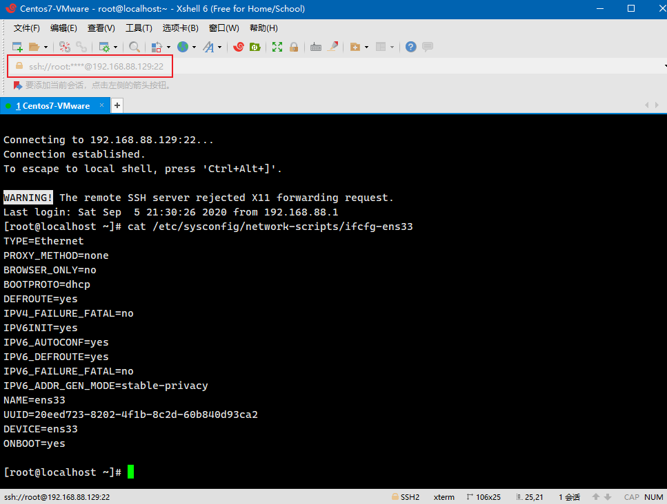
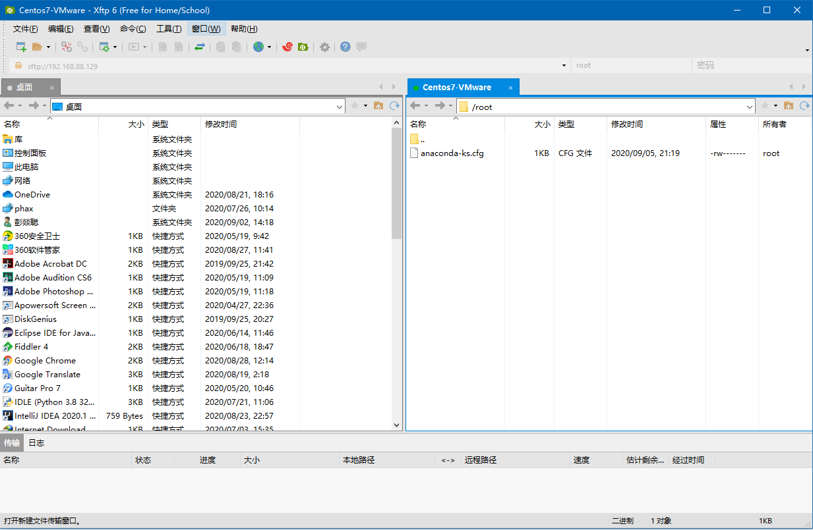

# 前言

> - 此篇介绍`CentOS7`的相关系统操作。

# 虚拟机安装CentOS 7

- 省略了，就是选择镜像在`VMware`中安装就可了。
- 最小化安装，不需要图形界面。

# 关于VMware Tools问题

- 可能与镜像、`CentOS`版本或者`kernel`内核有关系，无法成功安装`VMware Tools`，但由于`VMware`的最小化安装界面也不怎么友好，大多数情况都是用`Xshell`连接的，传输文件使用`Xftp`，不需要安装`VMware Tools`了。
- 最小化安装`CentOS 7`不需要过分追求`VMware Tools`，`99%`的情况下`VMware`都是后台运行，使用者一般都使用`Xshell`等连接工具远程控制虚拟机。

# 虚拟机快照

- `VMware`的快照最好在关机的状态下进行保存，运行或挂起的虚拟机的快照，无法进行克隆操作。
- 一定要记得在系统安装完毕，完成基本软件配置之后，进行增加虚拟机快照操作。在系统崩溃或重新搭建坏境还原系统时，快照都是十分必要的。

# 设置CentOS 7网络

- 网络是进行远程`SSH`连接必须要进行配置的操作。

## 1. 动态IP地址

- 默认`CentOS`不开启网络，需要修改`ifcfg-ens33`文件中的最后一项为`yes`，意思是重启服务的时候连接网络。


```shell
# 需要使用vi或vim编辑器
vi /etc/sysconfig/network-scripts/ifcfg-ens33
vim /etc/sysconfig/network-scripts/ifcfg-ens33

sudo service network restart
# 查看IP地址
ip addr
```
- `ifcfg-ens33`文件内容：

```shell
TYPE=Ethernet
PROXY_METHOD=none
BROWSER_ONLY=no
BOOTPROTO=dhcp
DEFROUTE=yes
IPV4_FAILURE_FATAL=no
IPV6INIT=yes
IPV6_AUTOCONF=yes
IPV6_DEFROUTE=yes
IPV6_FAILURE_FATAL=no
IPV6_ADDR_GEN_MODE=stable-privacy
NAME=ens33
UUID=20eed723-8202-4f1b-8c2d-60b840d93ca2
DEVICE=ens33
ONBOOT=yes # 开机时自动连接网络
```
- 更改并重启服务后，可以看到已经有`IP`地址了`192.168.88.129`：
```shell
[root@localhost ~]# ip addr
1: lo: <LOOPBACK,UP,LOWER_UP> mtu 65536 qdisc noqueue state UNKNOWN qlen 1
    link/loopback 00:00:00:00:00:00 brd 00:00:00:00:00:00
    inet 127.0.0.1/8 scope host lo
       valid_lft forever preferred_lft forever
    inet6 ::1/128 scope host 
       valid_lft forever preferred_lft forever
2: ens33: <BROADCAST,MULTICAST,UP,LOWER_UP> mtu 1500 qdisc pfifo_fast state UP qlen 1000
    link/ether 00:0c:29:75:31:10 brd ff:ff:ff:ff:ff:ff
    inet 192.168.88.129/24 brd 192.168.88.255 scope global dynamic ens33
       valid_lft 1111sec preferred_lft 1111sec
    inet6 fe80::c9f4:dc4d:dc6:2622/64 scope link 
       valid_lft forever preferred_lft forever
```

## 2. 静态IP地址

- 通过修改`/etc/sysconfig/network-scripts/ifcfg-ens33`文件，可以使系统获得静态`IP`：

```shell
TYPE=Ethernet
PROXY_METHOD=none
BROWSER_ONLY=no
BOOTPROTO=static #需要设置为static静态，原本为dhcp动态获取
DEFROUTE=yes
IPV4_FAILURE_FATAL=no
IPV6INIT=yes
IPV6_AUTOCONF=yes
IPV6_DEFROUTE=yes
IPV6_FAILURE_FATAL=no
IPV6_ADDR_GEN_MODE=stable-privacy
NAME=ens33
UUID=7ccd63f4-34fb-4936-9863-df033bc849c6
DEVICE=ens33
ONBOOT=yes # 开机时自动连接网络
ZONE=public

# 以下四条为新增，和Window系统中的规则一样，IP地址、网关、子网掩码、DNS
IPADDR=192.168.88.130
GATEWAY=192.168.88.2
NETMASK=255.255.255.0
DNS1=192.168.88.2
```

- 重启网络即可：

```bash
sudo service network restart
```

# 设置CentOS 7防火墙

- 如果说在`CentOS 7`上部署了项目或`Redis`、`MySQL`等项目时，需要开启对应访问端口的权限，否则服务可能无法被访问。

## 1. 开启/关闭防火墙

- 使用`CentOS`默认防火墙是开启状态的，除了`sshd`端口`22`和`master`端口`1129`之外，并且没有对外放其他的端口，使用以下命令查看防火墙状态：

```shell
# 查看防火墙状态
firewall-cmd --state
# 查看防火墙运行状态
systemctl status firewalld
# 关闭防火墙
systemctl stop firewalld
# 开启防火墙
systemctl start firewalld
```

## 2. 开放/关闭端口

- 如果需要对某些端口进行开放操作，使用以下命令：

```shell
# 查看防火墙所有(永久/临时)开放的端口
firewall-cmd --zone=public --list-ports
# 永久开放3306端口
# 该命令会将3306端口加入到INPUT_direct、OUTPUT_direct以及IN_public_allow链中
firewall-cmd --zone=public --add-port=3306/tcp --permanent
# 永久关闭3306端口
firewall-cmd --zone=public --remove-port=3306/tcp --permanent
# 使开放/关闭端口操作立即生效
firewall-cmd --reload
```

- 选项`--permanent`的说明，如果不希望永久开放这些端口，可以不加这个选项，那么主机在重启或运行命令`firewall-cmd --reload`之后，防火墙设置将重置。

```bash
# 临时开放3306端口，知道防火墙重新加载或重启
# 该命令只会将3306端口加入到IN_public_allow链中
firewall-cmd --zone=public --add-port=3306/tcp
# 查看防火墙所有(永久/临时)开放的端口
firewall-cmd --zone=public --list-ports
# 重新加载防火墙后，临时开放端口3306将从IN_public_allow链中移除
firewall-cmd --reload
```

## 3. 查看端口状态

- 关于端口的状态或被占用如何操作：

```shell
# 查看目前监听的端口，如果没有netstat命令，使用yum -y install net-tools进行安装
netstat -lnpt
# 检查端口被那个进程所占用
netstat -lnpt | grep 3306
# 查看进程详情，1140是PID，上一步可以查询出占用端口的PID
ps 1140
# 中止进程，“kill -9”表示强制杀死该进程
kill -9 1140
```

## 4. 端口转发

- 使用`firewall-cmd`命令还可以实现端口转发功能，同样地，选项`--permanet`可以控制该设置是永久生效还是临时生效：

```bash
永久添加端口转发格式：
firewall-cmd --permanent [--zone=<zone>] --add-forward-port=port=<port>[-<port>]:proto=<protocol> { :toport=<port>[-<port>] | :toaddr=<address> | :toport=<port>[-<port>]:toaddr=<address> }
------------------------------------------------------------------------------------------------

永久移除端口转发格式：firewall-cmd --permanent [--zone=<zone>] --remove-forward-port=port=<port>[-<port>]:proto=<protocol> { :toport=<port>[-<port>] | :toaddr=<address> | :toport=<port>[-<port>]:toaddr=<address> }
------------------------------------------------------------------------------------------------

查询永久端口转发格式：firewall-cmd --permanent [--zone=<zone>] --query-forward-port=port=<port>[-<port>]:proto=<protocol> { :toport=<port>[-<port>] | :toaddr=<address> | :toport=<port>[-<port>]:toaddr=<address> }
------------------------------------------------------------------------------------------------

临时转发（不添加选项“--permanent”）示例：
1.将80端口的tcp流量临时转发到8842端口
firewall-cmd --add-forward-port=port=80:proto=tcp:toport:8842
2.将80端口的tcp流量临时转发到192.168.88.203服务器的80端口
firewall-cmd --add-forward-port=port=80:proto=tcp:toaddr=192.168.88.203
3.将80端口的tcp流量临时转发到192.168.88.203服务器的9521端口
firewall-cmd --add-forward-port=port=80:proto=tcp:toaddr=192.168.88.203:toport=9521
```

# 使用Xshell连接CentOS 7

- 使用`Xshell`连接也省略了，你懂的。



# 使用Xftp进行文件传输

- 如果在安装的时候不创建其他用户，默认就以`root`的身份登录，点击`Xshell`中的文件传输按钮，会拉起`Xftp`客户端，默认会打开`CentOS 7`当前登录用户的家目录作为传输的目标目录，可以自行更改。



- 使用`Xftp`可以像`Window`系统一样创建或删除文件、文件夹等等。

# Linux基本命令

- 基本的命令如创建删除文件或目录，移动复制重命名等，代码如下：

```bash
#list，以列表的形式列出当前目录下的文件
ls -l 或 ll
#以列表的形式列出当前目录下的所有文件
ls -al
#change directory，切换目录
cd [DIRECTORY]
#move，移动文件或目录，也可以作为重命名的命令
mv [SOURCE] [DISTINATION]
#remove，删除文件或目录
rm [FILE]
rm -r [DIRECTORY]
#由于删除文件或目录是危险操作，如果确认要删除，可以加上-f选项
rm -f [FILE]
rm -rf [DIRECTORY]
#copy，复制文件或目录
cp [SOURCE] [DISTINATION]
#touch，创建一个文件
touch [FILE_NAME]
#make directory，创建一个目录
mkdir [DIRECTORY_NAME]
#print working directory，打印当前目录路径
pwd
```

- 如果是虚拟机上安装`CentOS`，可能需要关机操作，命令如下：

```bash
shutdown -h now
```

# Linux软件管理

- `CentOS`中自带了一个包管理工具叫`yum`。
- `yum`的全称为`Yellow dog Updater, Modified`，是一个在`Fedora`和`RedHat`以及`CentOS`中的`Shell`前端软件包管理器。基于`RPM`包管理，能够从指定的服务器自动下载`RPM`包并进行安装，可以自动处理依赖关系，并一次安装所有依赖的软件包，无须繁琐地一次次下载、安装。
- 基本的操作功能如下：

```bash
#安装软件，可以添加自动应答选项-y
yum install xxx
#卸载软件
yum remove xxx 或 yum erase xxx
#升级软件
yum upgrade xxx 或 yum update xxx
#搜索软件
yum search xxx
#列出指定软件的信息
yum info xxx
#列出软件包依赖关系
yum deplist xxx
#创建服务器包信息的缓存，下一次需要install或search包的时候，会从缓存中查找，即使断网也可以查找
yum makecache
#缓存需要清理，譬如你想更新一下软件包信息的缓存，先清理了之后，再运行makecache
yum clean all
#升级所有包（rpm包），同时也升级软件和系统内核
yum update
#升级所有包（rpm包），但不升级软件和系统内核
yum upgrade
#列出所有已安装的软件包
yum list installed
#列出所有可更新的软件包
yum list updates

选项：
-q：静默执行
-t：忽略错误
-R：设置等待时间，单位分钟
-y：自动应答yes
```

- 因此我们知道了`yum`命令需要从服务其中寻找合适的包，并安装，我们通常把提供`yum`命令的服务器叫做源。
- 指定`yum`源的文件位于目录`/etc/yum.repos.d`下，其中有很多文件，主要起作用的是名字为`CentOS-Base.repo`的配置文件。
- 通过`cat`命令查看该`yum`源配置文件，会发现许多服务器其实是在国外的，如果在国内使用`yum`，最好的方式是更换域名源中的配置，更换为国内的阿里源、`163`源等等。
- 更换源之前，需要了解一个下载工具`wget`，我们将使用它直接下载阿里源的`Centos-7.repo`文件，只需要将该源重命名并替换`CentOS-Base.repo`即可，此前最好将`CentOS-Base.repo`作备份。
- `wget`是一个从网络上自动下载文件的自由工具，支持通过`HTTP`、`HTTPS`、`FTP`三个最常见的`TCP/IP`协议下载，并可以使用`HTTP`代理。而所谓的自动下载，是指`wget`可以在用户退出系统之后，继续在后台执行下载直到任务完成。
- 阿里`yum`源下载地址为`http://mirrors.aliyun.com/repo/Centos-7.repo`，具体替换系统`yum`源的操作如下：

```bash
#需要首先安装一下wget下载工具
yum install wget -y
#备份CentOS-Bash.repo文件
mv /etc/yum.repos.d/CentOS-Base.repo /etc/yum.repos.d/CentOS-Base.repo.bak
#下载阿里源的配置文件Centos-7.repo，并以CentOS-Bash.repo的文件名保存
wget -O /etc/yum/repos.d/CentOS-Base.repo http://mirrors.aliyun.com/repo/Centos-7.repo
```

# Linux系统管理

- 浏览以下网页可以获取更加详尽的关于`Linux`的介绍：
  - http://c.biancheng.net/linux_tutorial/10/

## 1. ps查看正在运行的进程

- `ps`命令是最常用的监控进程的命令，通过此命令可以查看系统中所有运行进程的详细信息。
- 详尽资料：`http://c.biancheng.net/view/1062.html`

```bash
# 查看系统中所有的进程，使用BS操作系统格式
ps aux

选项：
a：显示一个终端的多有进程；
u：显示进程的归属用户及内存的使用情况；
x：显示没有控制终端的进程；

# 查看系统中所有的进程，使用Linux标命令格式
ps -le

选项：
-l：长格式显示更加详细的信息，只用这个选项的时候，仅显示当前Shell产生的进程；
-e：显示所有进程。

# ps命令可以一次性给出当前系统中进程状态，但是使用此方法
```

## 2. top实时监听进程运行状态

- `ps`命令可以一次性给出当前系统中进程状态，但使用此方式得到的信息缺乏时效性，并且，如果管理员需要实时监控进程运行情况，就必须不停地执行`ps`命令，这显然是缺乏效率的。
- `top`命令可以动态地持续监听进程地运行状态，与此同时，该命令还提供了一个交互界面，用户可以根据需要，人性化地定制自己的输出，进而更清楚地了进程的运行状态。
- 详尽资料：`http://c.biancheng.net/view/1065.html`

```bash
top [选项]

选项：
-d：秒数，指定top命令每隔几秒更新。默认是3秒；
-p：进程PID，仅查看指定ID的进程；
-s：使top命令在安全模式中运行，避免在交互模式中出现错误；
-u：仅监听某个用户的进程。

在top命令的显示窗口中，使用以下按键可以进行交互操作：
?或h：显示交互模式的帮助；
P：按照CPU的使用率排序，默认排序；
M：按照内存的使用率排序；
N：按照PID排序；
T：按照CPU的累积运算时间排序，也就是按照TIME+项排序；
k：按照PID给予某个进程一个信号，一般用于中止某个进程，信号9是强制中止的信号；
r：按照PID给某个进程重设优先级（Nice）值；
q：退出top命令。
```

## 3. kill终止进程

- `kill`从字面来看，就是用来杀死进程的命令，但事实上，这个或多或少带有一定的误导性。从本质上讲，`kill`命令只是用来向进程发送一个信号，至于这个信号是什么，是用户指定的。
- 也就是说，`kill`命令的执行原理是这样的，`kill`命令会向操作系统内核发送一个信号（多是终止信号）和目标进程的`PID`，然后系统内核根据收到的信号类型，对指定进程进行相应的操作。

```bash
# kill命令是按照PID来确定进程的，所以kill命令只能识别PID，而不能识别进程名。
kill [信号] PID

常用信号：
0：EXIT，程序退出时收到该信息；
1：HUP，挂掉电话线或终端连接的挂起信号，这个信号也会造成某些进程在没有终止的情况下重新初始化；
2：INT，表示结束进程，但并不是强制性的，常用的"Ctrl+C"组合键发出就是一个kill -2的信号；
3：QUIT，退出；
9：KILL，杀死进程，即强制结束进程；
11：SEGV，段错误；
15：TERM，正常结束进程，是kill命令的默认信号。
```

## 4. 方法放入后台运行的命令

- 有两种命令可以将方法放入后台运行：
  1. `空格&`：在需要放入后台的命令后面加上此命令，可以将目标方法放入后台运行，该方法在后台将处于执行状态；
  2. `Ctrl+Z`：也可以使用此命令将目标方法翻入后台运行，但是该方法在后台将处于暂停状态，因为`Ctrl+Z`快捷键就是暂停的快捷键。

## 5. top查看当前终端的后台工作

- `jobs`命令可以用来查看当前终端放入后台的工作，工作管理的名字也来源于`jobs`命令。

```bash
jobs [选项]

选项：
-l：列出进程的PID号；
-n：只列出上次发出通知后改变了状态的进程；
-p：只列出进程的PID号；
-r：只列出运行中的进程；
-s：只列出已停止的进程。

# 如果需要杀掉后台的命令，使用kill
kill %工作号
```

## 6. fg将后台命令恢复在前台执行

- `fg`命令用于把后台工作恢复到前台执行。

```bash
fg %工作号
```

## 7. bg将后台暂停的工作恢复运行

- 此前讲过，`Ctrl+Z`会将任务放入后台，但该任务会处于暂停状态。使用`bg`命令可以恢复该后台任务的运行。

```bash
bg %工作号
```

## 8. free查看内存使用状态

- `free`命令用来显示系统内存状态，包括系统物理内存、虚拟内存（swap 交换分区）、共享内存和系统缓存的使用情况，其输出和`top`命令的内存部分非常相似。

```bash
free [选项]

选项：
-b：以byte为单位，显示内存使用情况；
-k：以kb为单位，显示内存使用情况；
-m：以mb为单位，显示内存使用情况；
-g：以gb为单位，显示内存使用情况；
-t：在输出的最终结果中，输出内存和swap分区的总量；
-o：不显示系统缓冲区这一列；
-s：间隔秒数。根据指定的间隔时间，持续显示内存使用情况。
```

## 9. df查看文件占用情况

- 使用`df`命令可以查看文件占用情况，或者查看整个系统的文件占用情况。

```bash
df [OPTION]... [FILE]...

选项：
-h：使用方便阅读的模式将文件占用情况输出到屏幕上

# 显示整个文件系统的占用情况
df -h
```

## 10. du查看文件大小

- 使用`du`命令可以查看文件或目录的大小。

```bash
du [OPTION]... [FILE]...

选项：
-h：使用方便阅读的模式将文件占用情况输出到屏幕上
-s：仅显示目录的总和大小而不显示每一个子文件的大小

# 显示一个文件或目录的大小
du -hs [FILE]
```

# Linux文本处理

## 1. cat连接合并文件内容

- `cat`命令可以用来显示文本文件的内容（类似于`DOS`下的`type`命令），也可以把几个文件内容附加到一个文件中，即连接合并文件。

```bash
cat [选项] 文件名
或
cat fileA fileB > fileC

选项：
-A：相当于-vET选项的整合，用于列出所有隐藏符号；
-E：列出每行结尾的回车符$；
-n：对输出的所有行进行编号；
-b：与-n不同，此选项表示只对非空行进行编号；
-T：把Tab键^|显示出来；
-v：列出特殊字符；
-s：当遇到有连续2行以上的空白行时，就替换为1行的空白行。
```

## 2. more分屏显示文件内容

- 当使用`cat`命令查看文件内容时，如果文件过大，以至使用`PgUp+上箭头`组合键向上翻页也无法看全文件中的内容，该怎么办呢？这就需要使用`more`命令。

```bash
more [选项] 文件名

选项：
-f：计算行数时，以实际的行数，而不是自动换行过后的行数；
-p：不以卷动的方式显示每一页，而是先清除屏幕后再显示内容；
-c：跟-p选项相似，不同的是先显示内容再清除其他旧资料；
-s：当遇到有连续2行以上的空白行时，就替换为1行的空白行；
-u：不显示下引号（根据环境变量TERM指定的终端而有所不同）；
+NUM：从第NUM行开始显示文件内容，NUM代表数字；
-NUM：一次显示的行数，NUM代表数字。
```

- `more`命令的执行会打开一个交互界面，常用的交互命令如下：

```reStructuredText
h或?：显示more交互命令帮助；
q或Q：退出more；
v：在当前行启动一个编辑器；
:f：显示当前文件的文件名和行号；
!<命令>或:!<命令>：在子Shell中执行指定命令；
回车键：向下移动一行；
空格键：向下移动一页；
Ctrl+l：刷新屏幕；
=：显示当前行的行号；
'：转到上一次搜索开始的地方；
Ctrl+f：向下滚动一页；
.：重复上次输入的命令；
/<regular expression>：使用正则表达式搜索字符；
d：向下移动半页；
b：向上移动一页。
```

## 3. grep查找文件内容

- `grep`命令能够在一个或多个文件中，搜索某一特定的字符模式（也就是正则表达式），此模式可以是单一的字符、字符串、单词或句子。

```bash
grep [选项] 模式 文件名

选项：
-c：仅列出文件中包含模式的行数
-i：忽略模式中的字母大小写；
-l：列出带有匹配行的文件名；
-n：在每一行的最前面列出行号；
-v：列出没有匹配模式的行；
-w：把表达式当做一个完整的单字符来搜寻，忽略那些部分匹配的行。
```

