# 简介

- 本篇讲解`Java`中的集合框架。

# 集合框架中的接口

- `Java`集合框架为不同类型的集合定义了大量的接口，如下图所示。

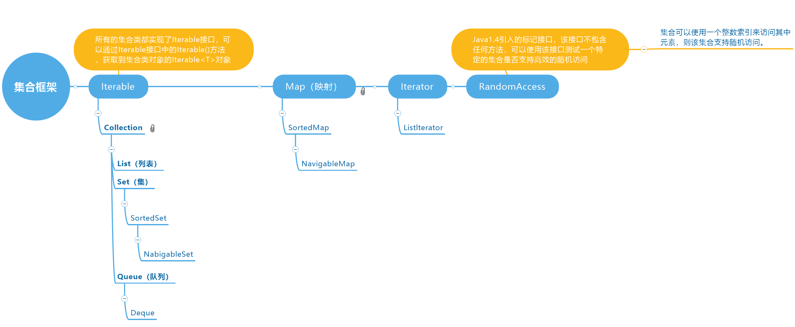

- 集合框架有两个基本接口：`Collection`和`Map`。

# 集合框架

- 表中展示了`Java`类库中的集合，并简要描述了每个集合类的用途。
- 除了`Map`结尾的类之外，其他类都实现了`Collection`接口；而以`Map`结尾的类则实现了`Map`接口。

|     集合类型      |                      描述                      |
| :---------------: | :--------------------------------------------: |
|    `ArrayList`    |        可以动态增长和缩减的一个索引序列        |
|   `LinkedList`    |   可以在任何位置高效插入和删除的一个有序序列   |
|   `ArrayDeque`    |          实现为循环数组的一个双端队列          |
|     `HashSet`     |            没有重复元素的一个无序集            |
|     `TreeSet`     |                   一个有序集                   |
|     `EnumSet`     |             一个包含枚举类型值的集             |
|  `LinkedHashSet`  |          一个可以记住元素插入次序的集          |
|  `PriorityQueue`  |         允许高效删除最小元素的一个集合         |
|     `HashMap`     |          存储键/值关联的一个数据结构           |
|     `TreeMap`     |                键有序的一个映射                |
|     `EnumMap`     |            键属于枚举类型的一个映射            |
|  `LinkedHashMap`  |       可以记住键/值项添加次序的一个映射        |
|   `WeakHashMap`   | 值不会在别处使用时，就可以被垃圾回收的一个映射 |
| `IdentityHashMap` |     用`==`而不是用`equals`比较键的一个映射     |


## 链表（LinkedList）

- 底层原理：用于表示链接的对象`Node<E>`，其中存放着上下链接对象以及对象`E`。此链表是**双向链表**。
- 优点：插入和删除元素快；
- 缺点：查找元素慢。修改元素的速度由查找速度决定，本质上修改即等同于查找后替换。
  - 如果是通过索引`index`查找值，代码底层只都会从链表的一半中查找；
  - 如果需要通过值`value`来查找值，代码底层会对链表进行迭代。

------

- 数组`Array`和数组列表`ArrayList`有一个重大的缺陷：从数组中间删除一个元素的开销很大，如果删除一个元素，那么对应的数组中位于被删元素之后的所有元素都要向数组前端移动。同样的，向数组中插入一个元素也是如此。

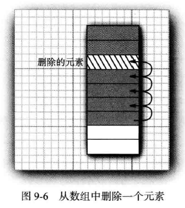

- 对于大部分的业务情况而言，我们使用集合是因为要用来保存数据。当取用数据的时候，往往需要同时从存储媒介中剔除该已取用的数据。这个时候无论使用`Array`还是`ArrayList`都会影响程序的性能。
- 除了数组结构外，`Java`也提供了另一种数据结构链表的实现`LinkedList`，链表结构可以实现元素的快速增删。
- 数组是在连续的存储位置上存放对象引用，而链表则是将每个对象存放在单独的链接`link`中。
- 每个链接`link`还存放着序列中的下一个链接`link`的引用。如下图结构所示：

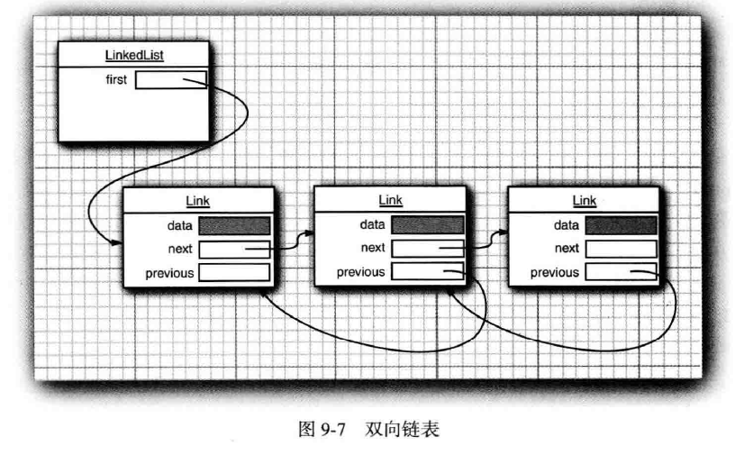

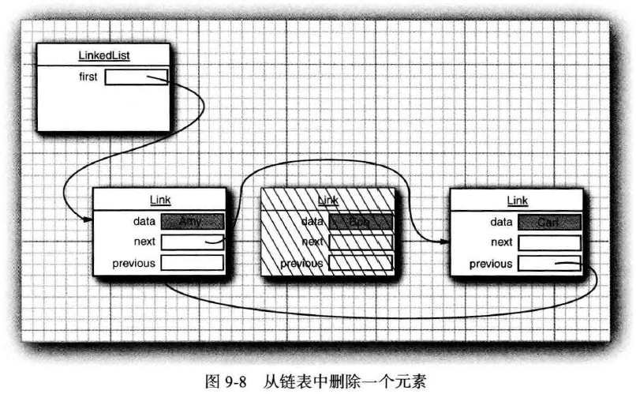

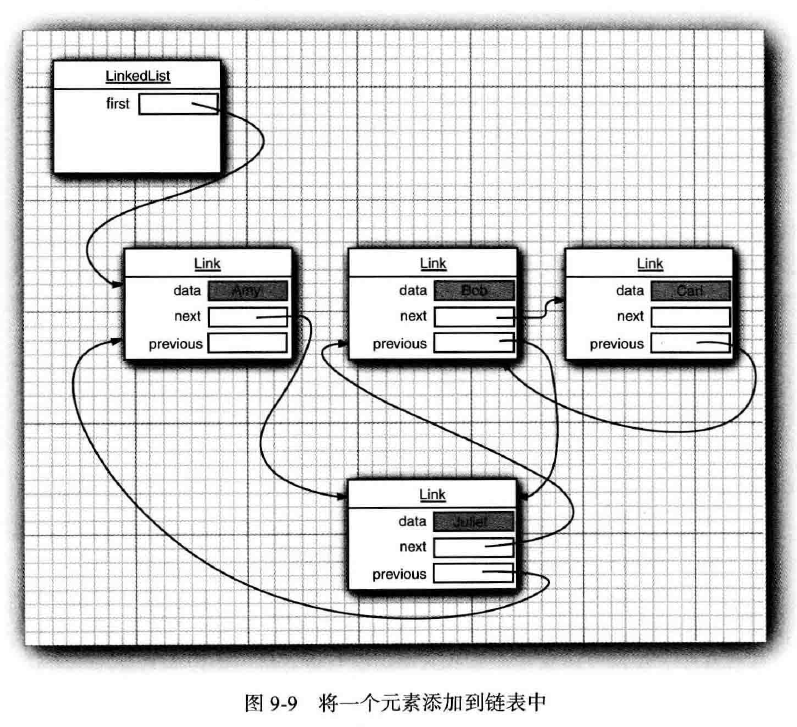

- 在`Java`程序设计语言中，所有链表`LinkedList`实际上都是双向链接`doubly linked`，即每个链接`link`还存放着其前驱的引用。链表是一个有序集合`ordered collection`，每个对象的位置十分重要。
- 通过`LinkedList.add`方法，可以将对象添加到链表的尾部。但是通常需要将元素添加到链表的中间。由于迭代器描述了集合中的位置，所以这种依赖于位置的`add`方法将由迭代器负责。只有对自然有序的集合使用迭代器添加元素才有实际意义。
- `Iterator`接口中包含了四个方法：
  - `hasNext()`：等待实现；
  - `next()`：等待实现；
  - `remove()`：抛出`UnsupportedOperationException("remove")`异常；
  - `forEachRemaining`：用于迭代当前`Iterator`对象并取用其中元素的方法，类似于`forEach()`。

```java
package java.util;

import java.util.function.Consumer;
public interface Iterator<E> {
    
    boolean hasNext();
    
    E next();
    
    default void remove() {
        throw new UnsupportedOperationException("remove");
    }
    
    default void forEachRemaining(Consumer<? super E> action) {
        Objects.requireNonNull(action);
        while (hasNext())
            action.accept(next());
    }
}
```

- 集合类库则提供了一个`Iterator`接口的子类接口`ListIterator`，其中增加了一些方法：
  - `hasPrevious()`
  - `previous()`
  - `nextIndex()`
  - `previousIndex()`
  - `set(E e)`
  - `add(E e)`

```java
package java.util;

public interface ListIterator<E> extends Iterator<E> {

    boolean hasNext();

    E next();

    boolean hasPrevious();

    E previous();

    int nextIndex();

    int previousIndex();

    void remove();

    void set(E e);

    void add(E e);
}
```

- 在`ListIterator<E>`中一个较为有趣的地方是，该接口重新定义了一个`remove()`方法，那么所有实现该接口的类就必须要覆写`remove()`方法，同时该接口的父类接口`Iterator<E>`中的默认方法`remove()`也等同于被废弃。
- 在进行相关方法比较前，需要了解一下链表`LinkedList`的构成，链表中有一个私有静态内部类`Node<E>`，这个类就相当于链表中的链接`link`，源码如下：

```java
private static class Node<E> {
    E item;
    Node<E> next;
    Node<E> prev;

    Node(Node<E> prev, E element, Node<E> next) {
        this.item = element;
        this.next = next;
        this.prev = prev;
    }
}
```

- 链接`link`中除了封装当前对象元素`element`之后，还封装了上一个链接的对象引用`prev`与下一个链接的对象引用`next`。
- 众所周知，外部类是可以随意访问其成员内部类中的成员变量、成员方法而不受任何权限修饰符的限制。因此在`LinkedList`中可以使用`Node<E>.filed`的格式，获取到链表中当前位置对象、上一个对象的链接及下一个对象的链接。
- 链表`LinkedList`中还包含了一个方法`node(int index)`，源码如下：

```java
Node<E> node(int index) {
    if (index < (size >> 1)) {
        Node<E> x = first;
        for (int i = 0; i < index; i++)
            x = x.next;
        return x;
    } else {
        Node<E> x = last;
        for (int i = size - 1; i > index; i--)
            x = x.prev;
        return x;
    }
}
```

- 其中`size`为成员变量，记录了当前链表长度，链表方法`size()`的调用将返回`size`。
- 方法`node(int index)`接收一个`int`类型作为参数，它将返回指定索引位`index`上的`Node`对象。注意，它每次只会从当前链表中的前半部分或后半部分去找。
- 有符号右移位运算符`>>`右移`1`位等同于`(int) Math.floor(size / 2)`，即`node(int index)`会首先计算出`index`处于当前链表的前半部还是后半部，之后才会根据计算结果分别进行正序或倒序遍历。
- 关于位移运算符的计算，可以参考以下代码：

```java
package cn.dylanphang;

/**
 * @author dylan
 */
public class BitOperator2 {

    public static void main(String[] args) {
        // m进行有符号右移n位相当于(int) Math.floor(m / Math.pow(2, n))
        // 关于-7，采用8位解释，运算前需要求出反码和补码，对补码进行有符号右移，高位补1，之后得到原码，结算得到结果：
        // 十进制-7的原码为：1000 0111，计算其补码为：1111 1001，右移一位：1111 1100，计算原码：1000 0100
        // 因此十进制结果为：-4
        System.out.println(7 >> 1);
        System.out.println(-7 >> 1);
    }
}
```

- 在`LinkedList`的`API`中，提供了一个方法`add(int index, E element)`，而`ListIterator`对象中的`add`方法也可以向链表中添加元素，那么其本质是否一致呢？
- 关于方法`add(int index, E element)`，源码如下：

```java
public void add(int index, E element) {
    checkPositionIndex(index);

    if (index == size)
        linkLast(element);
    else
        linkBefore(element, node(index));
}
```

- 方法`linkLast()`会在当前链表末尾追加一个元素`element`，而`linkBefore(E element, Node<E> succ)`会在链接`succ`对象之前添加`element`元素，以下为`linkLast()`与`linkBefore()`的源码：

```java
/**
 * Links e as last element.
 */
void linkLast(E e) {
    final Node<E> l = last;
    final Node<E> newNode = new Node<>(l, e, null);
    last = newNode;
    if (l == null)
        first = newNode;
    else
        l.next = newNode;
    size++;
    modCount++;
}

/**
 * Inserts element e before non-null Node succ.
 */
void linkBefore(E e, Node<E> succ) {
    // assert succ != null;
    final Node<E> pred = succ.prev;
    final Node<E> newNode = new Node<>(pred, e, succ);
    succ.prev = newNode;
    if (pred == null)
        first = newNode;
    else
        pred.next = newNode;
    size++;
    modCount++;
}
```

- 实际中使用最多的获取`ListIterator`对象的方法，是`linkedList.listIterator()`。但`LinkedList`中并没有找到该方法的空参形式，仅有以下方法被定义在`LinkedList`中用于返回`ListIterator<E>`对象：

```java
public ListIterator<E> listIterator(int index) {
    checkPositionIndex(index);
    return new ListItr(index);
}
```

- 无疑该方法是通过继承或实现的方式，从父类或接口处获取的。通过阅读源码，可以发现无参的`listIterator()`方法被定义在接口`List<E>`中，而该方法被接口`AbstractList<E>`覆写为以下形式：

```java
public ListIterator<E> listIterator() {
    return listIterator(0);
}
```

- 以下为`LinkedList<E>`、`AbstractSequentialList<E>`、`AbstractList<E>`及`List<E>`的部分源码：

```java
public class LinkedList<E>
    extends AbstractSequentialList<E>
    implements List<E>, Deque<E>, Cloneable, java.io.Serializable { 
	public ListIterator<E> listIterator(int index) {
        checkPositionIndex(index);
        return new ListItr(index);
    }
    
    private class ListItr implements ListIterator<E> { ... }
}
```

```java
public abstract class AbstractSequentialList<E> extends AbstractList<E> { 
    public Iterator<E> iterator() {
        return listIterator();
    }

    public abstract ListIterator<E> listIterator(int index);
}
```

```java
public abstract class AbstractList<E> extends AbstractCollection<E> implements List<E> { 
    public Iterator<E> iterator() {
        return new Itr();
    }

    public ListIterator<E> listIterator() {
        return listIterator(0);
    }
    
    public ListIterator<E> listIterator(final int index) {
        rangeCheckForAdd(index);

        return new ListItr(index);
    }
    
    private class Itr implements Iterator<E> { ... }

    private class ListItr extends Itr implements ListIterator<E> { ... }
}
```

```java
public interface List<E> extends Collection<E> {
    Iterator<E> iterator();
    
    ListIterator<E> listIterator();

    ListIterator<E> listIterator(int index);
}
```

- 那么一个完整的调用流程是：
  - `linkedList.listIterator() -> AbstractList.listIterator() -> this.listIterator(0)`
- 即使用`linkedList.listIterator()`等同于使用了`linkedList.listIterator(0)`。
- 那么`listIterator`中如何实现`add(E element)`方法呢？源码如下：

```java
public ListIterator<E> listIterator(int index) {
    checkPositionIndex(index);
    return new ListItr(index);
}

private class ListItr implements ListIterator<E> {
    private Node<E> lastReturned; // 这个成员变量将记录最后一次cursor跳过的那个链接Node，remove()方法依赖于它来删除链接Node
    private Node<E> next; // 从构造器方法可以看出，这个就是等于index为0的链接Node或者链表为空的时候它等于null
    private int nextIndex; // 记录当前cursor所指向位置后的那个索引
    private int expectedModCount = modCount; // 记录当前链表被操作的次数，调用此类中的大部分方法会使此操作数+1

    ListItr(int index) {
        // assert isPositionIndex(index);
        next = (index == size) ? null : node(index);
        nextIndex = index;
    }

    public void add(E e) {
        checkForComodification();
        lastReturned = null;
        if (next == null)
            linkLast(e);
        else
            linkBefore(e, next);
        nextIndex++;
        expectedModCount++;
    }
    
    final void checkForComodification() {
            if (modCount != expectedModCount)
                throw new ConcurrentModificationException();
    }
}
```

- 重新贴一下`LinkedList`中的`add(int index, E element)`方法的源码：

```java
public void add(int index, E element) {
    checkPositionIndex(index);

    if (index == size)
        linkLast(element);
    else
        linkBefore(element, node(index));
}

private void checkPositionIndex(int index) {
        if (!isPositionIndex(index))
            throw new IndexOutOfBoundsException(outOfBoundsMsg(index));
}

private boolean isPositionIndex(int index) {
        return index >= 0 && index <= size;
}
```

- 比较两者，可以知道其中的逻辑是一模一样的，前者通过判断下一个链接对象引用`next`是否为`null`，来判定此时迭代器是否位于链表的尾部；而后者通过判断当前索引是否等于链表的长度，来判定此时迭代器是否位于链表的尾部。
- 使用`add(int index, E element)`向链表末尾添加元素即等同于调用`linkLast(E e)`方法，而链表提供的`add(E e)`方法也是调用`linkLast(E e)`方法用于添加元素。以下将使用`add(E e)`作一个线程不安全的测试。
- 总所周知，`LinkedList`是线程不安全的，即允许多个线程同时对它进行操作，那么想象以下场景：
  1. 假设有两个线程同时对长度大于`2`的链表`A`进行添加元素的操作，使用`add(E element)`方法；
  2. 此时两个线程都需要在链表末尾添加一个元素，假如两个线程一前一后进入`linkBefore(E e)`。

```java
public boolean add(E e) {
    linkLast(e);
    return true;
}

void linkLast(E e) {
    final Node<E> l = last;
    final Node<E> newNode = new Node<>(l, e, null);
    last = newNode;
    if (l == null)
        first = newNode;
    else
        l.next = newNode;
    size++;
    modCount++;
}
```

- 此时添加操作不会出现任何异常。但这可能会导致一个严重问题：插入链表的两个元素的下一个链接`next`都会指向`null`，而上一个链接则均会指向`last`。而`last`中所指向的下一个链接则指向线程较慢时所插入的元素。
- 虽然看似没有异常，但对于链表来说却是灾难性的错误。链表元素中的链接指向出错，将直接导致迭代器无法工作。
- 以下测试中，会开启`5000`个线程，同时对成员变量`linkedList`进行插入操作，程序将输出以下日志信息：
  - `this.counter`：计算向`linkedList`中添加元素的有效次数，确保不是因为异常导致添加元素失败；
  - `this.linkedList.size()`：链表长度；
  - `e.getClass().getSimpleName()`：迭代如果出现异常，则打印异常的名字；
  - `currentIndex`：异常出现在哪个链接之后。

```java
package cn.dylanphang;

import cn.dylanphang.util.ThreadUtils;
import lombok.extern.slf4j.Slf4j;
import org.junit.jupiter.api.Test;

import java.util.LinkedList;
import java.util.ListIterator;
import java.util.concurrent.CountDownLatch;

/**
 * @author dylan
 * @date 2021/01/01
 */
@Slf4j
public class LinkedListTest {

    private static final int CONCURRENT_TIMES = 5000;

    private final CountDownLatch cdl = new CountDownLatch(CONCURRENT_TIMES);
    private final CountDownLatch testCdl = new CountDownLatch(CONCURRENT_TIMES);
    private final LinkedList<String> linkedList = new LinkedList<>();

    private int counter = 0;

    /**
     * 由于无法控制LinkedList中的程序流程，采用高并发插入数据的方式去为同一个LinkedList添加元素。
     */
    @Test
    public void test() throws InterruptedException {
        for (int i = 0; i < CONCURRENT_TIMES; i++) {
            final String content = i + "";
            ThreadUtils.create(() -> {
                try {
                    this.cdl.await();
                    Thread.sleep(1000);
                    this.linkedList.add(content);
                    count();
                } catch (InterruptedException e) {
                    e.printStackTrace();
                }
                this.testCdl.countDown();
            });
            this.cdl.countDown();
        }

        this.testCdl.await();
        log.info("Successful write into LinkedList times is: {}", this.counter);
        log.info("Current insert operation finish. LinkedList's size is: {}", this.linkedList.size());

        int currentIndex = -1;
        final ListIterator<String> listIterator = this.linkedList.listIterator();

        while (listIterator.hasNext()) {
            try {
                listIterator.next();
                currentIndex++;
            } catch (Exception e) {
                log.error("Exception is: {}", e.getClass().getSimpleName());
                break;
            }
        }
        log.info("Mistake element index is: {}", currentIndex);
    }

    synchronized private void count() {
        this.counter++;
    }
}
```

- 高并发多线程的环境往往总是复杂的，计算成功添加元素次数的`count()`方法必须使用`synchronized`关键字修饰，此时不能使用以下代码进行替换：
  - `count++;`，此代码是线程不安全的。
- 测试运行次数为`3`次，得到以下结果：

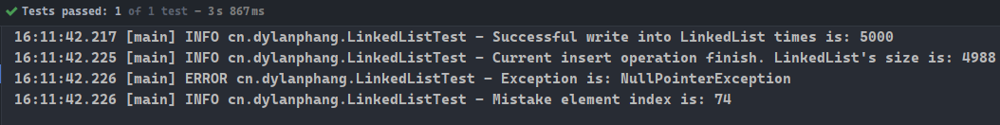

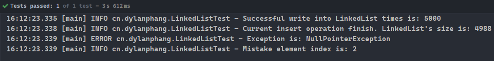


- 三次测试表明，添加元素`add()`操作本身不会出现任何异常，但最终链表长度则表明其内部出现添加失败的操作。
- 而三次获取的迭代器对象，在进行迭代时均出现`NullPointerException`，在不进行异常抓取的情况下，可以清晰看到异常出现的位置位于`next()`方法中的`next = next.next`行，不难推敲是由于当前链接的前置链接中`next`字段值为`null`引起。

```java
public E next() {
    checkForComodification();
    if (!hasNext())
        throw new NoSuchElementException();

    lastReturned = next;
    next = next.next;
    nextIndex++;
    return lastReturned.item;
}
```

- 以上结论，可以知道在多线程的情况下使用`linkLast(E e)`方法，是可能会造成链表结构错误。那么对于使用该方法的其他方法`add(int index, E element)`或`add(E e)`来说，即同样有可能造成结构错误。
- 遗憾的是，在多线程情况下使用成员变量或类变量`LinkedList`时，该错误是不可避免的。
- 在`LinkedList`中大部分对链表操作的方法，都会记录操作数，而这个操作数成员变量是`modCount`，其初始值为`0`。操作数需要与`ListIterator`中的`expectedModCount`配合使用，某些特殊情况下可以避免添加元素失败的情况。
- `ListIterator`中对操作数进行记录的字段为`expectedModCount`，该字段在获取`ListIterator`对象时，被初始化为当前链表的操作数字段`modCount`的值。
- 使用`ListIterator`对链表进行`add`或`remove`操作时，其会调用`LinkedList`中的增删方法，此时`modCount`会自增或自减的情况。而`ListIterator`的`add`和`remove`方法也会同步让`expectedModCount`进行自增或自减的操作。
- 其中关键点是`ListIterator`的`add()`方法中调用的`checkForComodification()`方法：
  - 该方法检查`modCount`是否与`expectedModCount`的值一致。一致则无事发生，否则抛出异常。

```java
final void checkForComodification() {
    if (modCount != expectedModCount)
        throw new ConcurrentModificationException();
}
```

- 如果此时有两个线程获取了同一个`LinkedList`的`ListIterator`对象，此时它们获取到的`expectedModCount`都为`0`。其中一个线程如果调用了`ListIterator.add()`，此时假设另一个线程为调用任何的方法。
- 则`LinkedList`中的`modCount`就会被置为`1`。此时另一个线程开始调用`ListIterator.add()`，进入此方法会，程序会先进性校验操作，调用`checkForComodification()`。明显，此时`modCount == 1`而`expectedModCount == 0`。
- `modCount != expectedModCount`的情况下，会抛出`ConcurrentModificationException`异常。
- 为了方便理解，编写以下测试类：

```java
package cn.dylanphang;

import lombok.extern.slf4j.Slf4j;
import org.junit.jupiter.api.Test;

import java.lang.reflect.Field;
import java.util.AbstractList;
import java.util.ConcurrentModificationException;
import java.util.LinkedList;
import java.util.ListIterator;

/**
 * @author dylan
 */
@Slf4j
@SuppressWarnings("all")
public class ListIteratorTest {

    @Test
    public void test() throws InterruptedException, IllegalAccessException, InstantiationException, NoSuchFieldException {
        // 1.获取LinkedList对象
        AbstractList<String> linkedList = new LinkedList<>();

        // 2.线程一
        new Thread(() -> {
            try {
                // 2.1.获取listIterator对象，modCount/expectedModCount均为0
                ListIterator<String> listIterator = linkedList.listIterator();
                // 2.2.线程休眠2秒
                Thread.sleep(2000);
                // 2.3.线程结束休眠后，添加元素前需要经过checkForComodification()
                // *.此时线程二已经结束，modCount必然为1，checkForComodification()将抛出ConcurrentModificationException
                listIterator.add("dylan");
            } catch (InterruptedException e) {
                e.printStackTrace();
            } catch (ConcurrentModificationException e) {
                log.error("{}", e.toString());
            }
        }).start();

        // 3.线程二
        new Thread(() -> {
            try {
                // 3.1.获取listIterator对象，modCount/expectedModCount均为0
                ListIterator<String> listIterator = linkedList.listIterator();
                // 3.2.线程休眠1秒
                Thread.sleep(1000);
                // 3.3.线程结束休眠后，添加元素完毕，modCount被更新为1
                listIterator.add("sunny");
            } catch (InterruptedException e) {
                e.printStackTrace();
            }
        }).start();

        // 4.防止test线程结束
        Thread.sleep(3000);

        // 5.使用反射技术获取AbstractList中modCount的字段对象field
        Class<AbstractList> abstractListClass = AbstractList.class;
        Field field = abstractListClass.getDeclaredField("modCount");

        // 6.取消Java权限控制检查
        field.setAccessible(true);

        // 7.断言modCount的值为1
        log.info("modCount: {}", field.get(linkedList));
    }
}
```

- 以上程序开启两个线程，在对`LinkedList`进行`add()`操作前获取其`ListIterator`对象，并进行不通过长度的休眠，以确保获取的`ListIterator`对象中的`expectedModCount`值为`0`。线程二将先对链表进行操作，之后观察线程一及后续的输出。
- 运行测试：

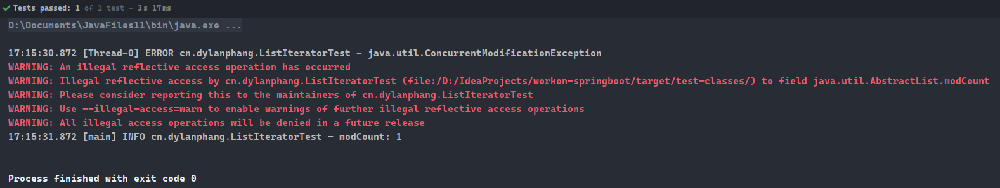

- 没有意外，程序捕获到了`ConcurrentModificationException`。
- 但纵使如此，仍没有消除`LinkedList`中线程不安全的问题。多个线程是极有可能在`modCount`与`expectedModCount`相等的情况下进行`checkForComodification()`判断的，此时不会抛出任何的异常。对于以下代码：

```java
ListIterator<String> listIterator = linkedList.listIterator();
listIterator.add("something.");
```

- 程序基本上在一瞬间就能获取到`ListIterator`并使用`add()`让`modCount++`，此时另一个线程获取的`ListIterator`依然是新操作数`modCount`了。程序运行太快，使得在平常的程序中难以捕获异常，但并不代表线程安全。
- 综上所述，`LinkedList`中的方法`add(int index, E element)`，与`ListIterator`对象中的`add(E element)`同样可以向链表中插入元素，其实现原理其实也是一致的：
  - 前者能带来更强的便利性，通过直接指定索引的方式，可以在链表的任意一个位置添加新的链接`link`；
  - 后者可以通过指定索引的方式`listIterator(int index)`先获取到`ListIterator`对象引用，之后再调用该对象所提供的`add(E element)`方法添加元素，使用该对象也可以对链表进行增`add`、删`remove`、改`set`操作；
  - 两者均为线程不安全的方法，多线程操作`linkedList.add()`可能会导致链表出错；多线程操作`listIterator.add()`则可能会导致`ConcurrentModificationException`异常。

## 数组列表（ArrayList）

- 底层原理：**动态数组**。
- 优点：支持随机访问，即通过索引寻值。
  - 根据索引查询，速度快；
  - 根据值查询，则数组列表会比链表快，同样通过迭代寻值的情况下，数组列表只需要通过索引遍历寻值即可，而链表则多了一步寻址的操作。
- 缺点：添加、删除元素慢，数组列表的添加、删除元素，都需要将添加或删除的目标位置之后的元素，整体向后或向前移动。
- 扩容机制：新的数组列表的长度是旧的数组列表长度的约1.5倍。
  - `int newCapacity = oldCapacity + (oldCapacity >> 1);`

## 散列集（HashSet）

- 底层原理：动态数组加单向链表或红黑树。`JDK 1.8`之后，当链表长度超过阈值`8`时，链表将转换为红黑树。

- 查阅`HashSet`的源码，可以看到`HashSet`的底层是`HashMap`，`HashSet`相当于只用了`HashMap`键`Key`的部分，当需要进行添加元素操作时，其值`Value`始终为常量`PRESENT = new Object()`。以下为`HashSet`的代码片段：

```java
private transient HashMap<E,Object> map;

public HashSet() {
    map = new HashMap<>();
}

public boolean add(E e) {
    return map.put(e, PRESENT)==null;
}

public Iterator<E> iterator() {
        return map.keySet().iterator();
}
```

- 在`JDK 1.8`之后，当链表长度超过阈值`8`时，链表将转为红黑树；当链表长度小于`6`时，红黑树重新转为链表。那么为什么阈值是`8`呢？
- 阈值定义为`8`符合数学概率论上的泊松分布`Poisson`。根据泊松分布，一个桶`bucket`是很难被填满达到长度`8`的。
- 一旦用于存储数据的链表长度达到阈值`8`，则很大的可能是该`HashSet`所使用的散列函数性能不佳、或存在恶意代码向集中添加了很多具有相同散列码的值，此时转为平衡二叉树可以提高性能。

------

- 链表`LinkedList`、数组`Array`或数组列表`ArrayList`都有一个共同的缺点：根据值查找元素速度慢。一旦存放的数据较多，查找速度将十分缓慢。
- 如果应用中开发者不在意元素的排列顺序，此时推荐使用的数据结构为散列表。散列表用于快速查找对象。
- 使用散列表的关键是对象必须具备一个散列码，通过对象内`HashCode()`方法即可计算得到对象的散列码。一般情况下，不同数据的对象将产生不同的散列码。
- 下表显示了使用`String`类中`hashCode()`方法成的散列码：

| 字符串 | 散列码 |
| :----: | :----: |
| "Lee"  | 76268  |
| "lee"  | 107020 |
| "eel"  | 100300 |

- 在`Java`中，散列表`HashTable`使用动态数组加链表或红黑树的形式实现。
- 动态数组中的每个位置被称为**桶**`bucket`。要想查找元素位于散列表中的位置，需要首先计算元素的散列码，然后与桶的总数取余，所得到的结果就是保存这个元素的桶的索引。
- 假设动态数组为`table`，对象`a`的散列码为`hashCode`，则元素将存放在`table`的索引为`hashCode % table.size()`，通常将该索引值成为散列值，它与散列码是不一样的。

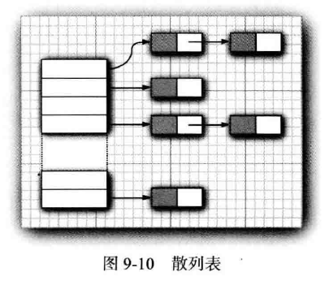

- 例如，如果某个对象的散列码为`76268`，并且有`128`个桶，那么这个对象应该保存在第`108`号桶中，因为`76268%128=108`。
- 如果在这个桶中没有其他的元素，此时将元素直接插入到桶中即可；但如果桶已经被填充，这种现象被称为散列冲突`hash collision`。发生散列冲突，需要将新对象与桶中的所有对象进行比较，查看这个对象是否已经存在。
- 此时如果散列码合理地随机分布（可以理解为散列函数`hashCode()`合理），桶的数目也足够大，需要比较的次数就会很少。
- 在`Java 8`中，桶满时会从链表变为平衡二叉树。如果选择的散列函数不好，会产生很多冲突，或者如果有恶意代码试图在散列表中填充多个有相同散列码的值，这样改为平衡二叉树能提高性能。
- 如果需要更多地控制散列表的性能，可以指定一个初始的桶数。桶数是指用于收集具有相同散列值的桶的数目。如果要插入到散列表中的元素太多，就会增加冲突数量，降低检索的性能。
- 如果大致知道最终会有多少个元素要插入到散列表中，就可以设置桶数。通常，将桶数设置为预计元素个数的`75%~150%`。有些研究人员认为：最好将桶数设置为一个素数，以防止键的聚集。不过，对此并没有确凿的证据。
- 标准类库使用的桶数是`2`的次幂，默认值为`16`（为表大小提供的任何值，都将自动转换为`2`的下一个幂值）。
- 但是，并不总能够知道需要存储多少个元素，也有可能最初的估计过低。如果散列表太满，就需要再散列`rehashed`。如果要对散列表再散列，就需要创建一个桶数更多的表，并将所有元素插入到这个新表中，然后丢弃原来的表。装填因子`load factor`可以确定何时对散列表进行再散列。
- 例如，如果装填因子是`0.75`（默认值），说明表中已经填满了`75%`以上，就会自动再散列，新表的桶数是原来的两倍。对于大多数程序来说，装填因子为`0.75`是合理的。
- 散列表可以用于实现很多重要的数据结构，其中最简单的是集类型。集是没有重复元素的元素集合，其中`add`方法首先会在这个集中查找要添加的对象，如果不存在，就添加这个对象。
- `Java`集合框架提供了一个`HashSet`类，它实现了基于散列表的集。可以用`add`方法添加元素。`contains`方法已经被重新定义，用来快速查找某个元素是否已经在集中。它只查看一个桶中的元素，而不必查看集合中所有元素。
- 散列集迭代器将依次访问所有的桶，由于散列将元素分散在表中，所以会以一种看起来随机的顺序访问元素。只有不关心集合中元素的顺序时，才应该使用`HashSet`。
- 而`HashSet`的实现基于`HashMap`，在随后会对`HashMap`的部分源码进行分析，以了解其初始容量及扩容机制。

## 树集（TreeSet）

- 底层原理：**红黑树**。红黑树是一种自平衡排序二叉树，按照**中序遍历**就可以得到由小到大的**有序序列**。因此构造树集`TreeSet`需要提供对象比较的方法，或该对象已实现`Comparable`接口。
- 由于树集`TreeSet`是通过红黑树的形式保存数据，它的每一次插入都需要先进行比较，找到合适的位置再进行插入；而查找也需要先进行比较。这也就直接导致了其插入和查找的效率略低于散列集`HashSet`。
- 通过查看`TreeSet`的源码，可以发现其底层实现是一个`TreeMap`。同`HashSet`一样，`TreeSet`也只是用到了`TreeMap`中键`Key`部分，而值`Value`始终为常量`PRESENT = new Object()`。
- `TreeMap`内部使用一个`Entry<K,V>`对象保存数据，其内部使用红黑树加链表或红黑树的数据结构基础，构建了`TreeMap`代码。

```java
// TreeMap.java源码
// 基于红黑树用于存储数据的对象
static final class Entry<K,V> implements Map.Entry<K,V> {
    K key;
    V value;
    Entry<K,V> left;
    Entry<K,V> right;
    Entry<K,V> parent;
    boolean color = BLACK;

    /**
         * Make a new cell with given key, value, and parent, and with
         * {@code null} child links, and BLACK color.
         */
    Entry(K key, V value, Entry<K,V> parent) {
        this.key = key;
        this.value = value;
        this.parent = parent;
    }
    ...
}
```

------

- `TreeSet`类与散列集`HashSet`十分类似，不过它比散列集有所改进。树集是一个有序集合`sorted collection`。可以以任意顺序将元素插入到集合中。在对集合进行遍历的时候，值将自动地按照排序后的顺序呈现。

```java
var sorter = new TreeSet<String>();
sorter.add("Bob");
sorter.add("Amy");
Sorter.add("Carl");
sorter.forEach(System.out::println);

// Output Result: Amy Bob Carl
```

- 排序使用的是一个树数据结构完成的，当前实现使用的是红黑树`red-black tree`。每一次将一个元素添加到树中时，都会将其放置在正确的排序位置上。因此，迭代器总是以有序的顺序访问每个元素。
- 将一个元素添加到树中要比添加到散列表中慢，参考下表，但是与检查数组或链表中的重复元素相比，使用树会快很多。如果树中包含`n`个元素，查找新元素的正确平均需要`log2(n)`次比较。例如，如果一棵树包含了`1000`个元素，添加一个新元素大约需要比较`10`次。

|           文档            | 单词总数 | 不同单词的个数 | HashSet | TreeSet |
| :-----------------------: | :------: | :------------: | :-----: | :-----: |
|    Alice in Wonderland    |  28195   |      5909      | 5 sec.  | 7 sec.  |
| The Count of Monte Cristo |  266300  |     37545      | 75 sec. | 98 sec. |

- 要使用树集，必须能够比较元素。这些元素必须实现`Comparable`接口，或者构造集时必须提供一个`Comparator`。通俗地将，树集中元素的排序规则是取决于元素间的比较结果，而对象如果可以比较，则需要实现`Comparable`接口。
- 添加一个元素所花费的时间，看上去差距并不是很大，而`TreeSet`还能进行自动排序，我们在考虑使用集的时候，是否应该只考虑`TreeSet`而不考虑`HastSet`呢？到底应该如何做，取决于所要收集的数据。如果不需要数据是有序的，就没有必要付出排序的开销。更重要的是，对于某些数据来说，对其进行排序要比给出一个散列函数更加困难。散列函数只需要将对象适当地打乱存放，而比较函数必须精确地区分各个对象。
- 以下例子中，`Item`对象分别使用两种不同的排序，因此打印该`TreeSet`对象的时候，输出是根据指定排序而定的，比较方法是什么由创建者决定。

```java
package cn.dylanphang.ex.set;

import java.util.Comparator;
import java.util.Objects;
import java.util.Set;
import java.util.TreeSet;

/**
 * TreeSet中的有序指的是迭代是有序的，而且排序的顺序不是根据你插入元素的先后而定，而是根据你TreeSet中存储对象的比较方法而定的。
 * 一句话总结，TreeSet是有序的集，其排列迭代顺序取决于其存储对象的比较方法。
 * 
 * @author dylan
 */
public class TreeSetTest {
    public static void main(String[] args) {
        Set<Item> parts = new TreeSet<>();

        parts.add(new Item("Toaster", 1234));
        parts.add(new Item("Modem", 9912));
        parts.add(new Item("Widget", 4562));
        System.out.println(parts);

        Set<Item> sortedByDescription = new TreeSet<>(Comparator.comparing(Item::getDescription));
        sortedByDescription.addAll(parts);
        System.out.println(sortedByDescription);
    }

    private static class Item implements Comparable<Item> {

        private final String description;
        private final int partNumber;

        public Item(String description, int partNumber) {
            this.description = description;
            this.partNumber = partNumber;
        }

        public String getDescription() {
            return this.description;
        }

        @Override
        public String toString() {
            return "Item{" +
                    "description='" + description + '\'' +
                    ", partNumber=" + partNumber +
                    '}';
        }

        @Override
        public boolean equals(Object o) {
            if (this == o) return true;
            if (o == null || getClass() != o.getClass()) return false;
            Item item = (Item) o;
            return partNumber == item.partNumber &&
                    Objects.equals(description, item.description);
        }

        @Override
        public int hashCode() {
            return Objects.hash(description, partNumber);
        }

        @Override
        public int compareTo(Item other) {
            final int diff = Integer.compare(this.partNumber, other.partNumber);
            return diff != 0 ? diff : this.description.compareTo(other.description);
        }
    }
}
```

## 链接散列集（LinkedHashSet）

- 底层原理：**数组**加**单向链表或红黑树**，外加**双向链表**以保证可以按顺序对`LinkedHashMap`中的对象进行有序地遍历，避免了散列表中的项看起来是随机的。

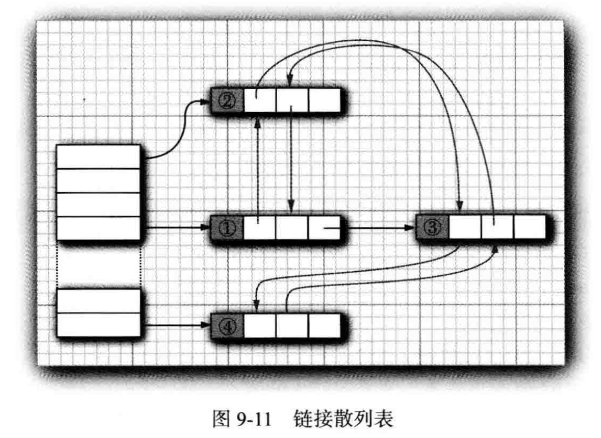

- `LinkedHashSet`可以记住插入元素的顺序。
- 从源码角度看，每一个`LinkedHashSet`无一例外都直接调用了其父类`HashSet`中的一个有参构造器，如下：

```java
HashSet(int initialCapacity, float loadFactor, boolean dummy) {
    map = new LinkedHashMap<>(initialCapacity, loadFactor);
}
```

- 因此`LinkedHashSet`其实使用的就是`LinkedHashMap`中键`Key`的部分，同样地其值`Value`始终为常量`PRESENT = new Object()`。

## 枚举集（EnumSet）

- 需要理解什么是枚举，才能进一步了解枚举集。
- 在`JDK1.5`之前，我们定义常量都是：`public static final`。有了枚举，可以把相关的常量分组到一个枚举类型里，而且枚举提供了比常量更多的方法。
- 以下是一个普通的枚举类：

```java
package cn.dylanphang.ex;

/**
 * @author dylan
 */

public enum Color {
    YELLOW, RED, BLUE, PURPLE, BLACK;
}

```

- 枚举集只能通过其中的静态方法获取。

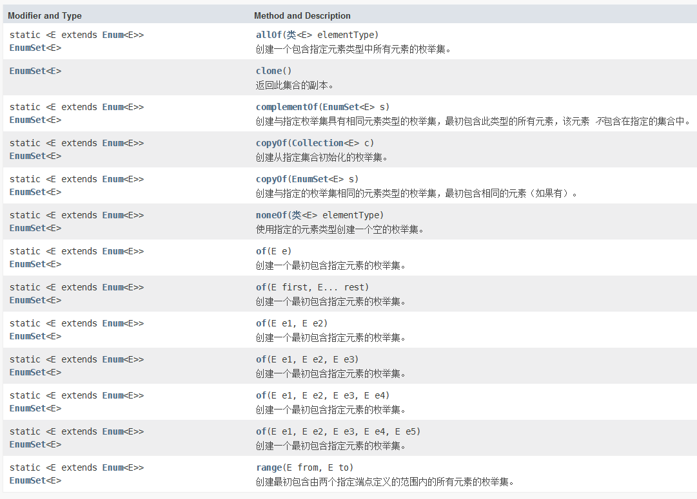

- 相关枚举集`EnumSet`代码：

```java
package cn.dylanphang.ex.set;

import cn.dylanphang.ex.Color;

import java.util.EnumSet;

/**
 * @author dylan
 */
public class EnumSetTest {
    public static void main(String[] args) {
        final EnumSet<Color> colorsA = EnumSet.noneOf(Color.class);
        System.out.println(colorsA);

        final EnumSet<Color> colorsB = EnumSet.allOf(Color.class);
        System.out.println(colorsB);

        final EnumSet<Color> colorsC = EnumSet.of(Color.BLUE, Color.YELLOW);
        System.out.println(colorsC);
    }
}
```

## 队列（Queue）

- 底层原理：**链表**或**循环数组**。
- 队列是一种`FIFO`的数据结构，先进先出的原则，它不允许在队列中间添加元素。

------

- 队列`Queue`允许使用者高效地在尾部添加元素，并在头部删除元素。
- 不支持在队列中间添加元素。

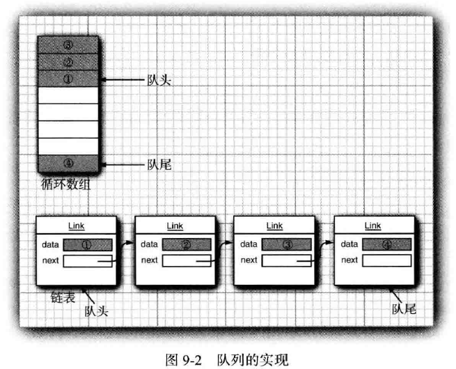

## 双端队列（Deque）

- 底层原理：**链表**或**循环数组**。
- 双端队列是一种具有队列和栈性质的数据结构。当中的元素可以从两端弹出，其限定插入和删除操作在表的两端进行，它不允许在队列中间添加元素。
- 当双端队列只允许其中一端进行出队入队操作的时候，可以将它作为栈`Stack`使用；当双端队列的一端仅作为入队，另一端仅作为出队，可以将它作为队列`Queue`使用。

------

- 双端队列`Deque`，顾名思义就是允许在头部和尾部都高效地添加或删除元素的一种队列。
- `Java 6`中引入了`Deque`接口，其中`ArrayDeque`和`LinkedDeque`类实现了这个接口。

## 优先队列（Priority Queue）

- 底层原理：通过**数组**表示的**二叉小顶堆**。**二叉小顶堆是顶部为最小值的平衡二叉树。**
- 在进行remove操作的时候，会从根上移除最小值对象，同时重新组织剩余的对象为新的二叉小顶堆结构。
- 同时因为是通过数组表示的二叉小顶堆，在直接打印该数组或遍历该优先队列的时候，实际上操作的是数组而不是二叉小顶堆，也就是实际上打印或遍历的是用于表示该二叉小顶堆的数组。

------

- 优先队列`Priority Queue`中的元素可以按照任意的顺序插入，但会按照有序的顺序进行检索。也就是说，无论何时调用`remove`方法，总会获得当前优先队列中最小的元素。不过，优先队列并没有对所有元素进行排序。如果迭代处理这些元素，并不需要对它们进行排序。
- 优先队列使用了一个精巧且高效的数据结构，称为堆`heap`。
- 堆是一个可以自组织的二叉树，其添加`add`和删除`remove`操作可以让最小的元素移动到根，而不必花费时间对元素进行排序。

- 与树集`TreeSet`一样，优先队列既可以保存实现了`Comparable`接口的类对象，也可以保存构造器中提供的`Comparator`对象。也就是说，其中保存的对象要么实现了`Comparable`接口，覆写了`compareTo`方法；要么就在构造`Priority Queue`的时候提供一个`Comparator`对象，该对象将用于元素的排序。
- 优先队列的典型用法是**任务调度**。每一个任务有一个优先级，任务以随机的顺序添加到队列中。每当启动一个新的任务时，都将优先级最高的任务从队列中删除（由于习惯上将`1`设为“最高”优先级，所以remove操作会将最小的元素删除）。

- 与`TreeSet`中的迭代不同，这里的迭代并不是按照有序顺序来访问元素。不过，删除操作却总是删除剩余元素中最小的那个元素。

```java
package cn.dylanphang.ex.queue;

import java.time.LocalDate;
import java.util.PriorityQueue;
import java.util.Queue;

/**
 * 底层采用数组来保存元素，数组蕴含的是二叉小顶堆。
 *
 * @author dylan
 */
public class PriorityQueueTest {
    public static void main(String[] args) {
        Queue<LocalDate> priorityQueue = new PriorityQueue<>();

        priorityQueue.add(LocalDate.of(1906, 12, 9));
        priorityQueue.add(LocalDate.of(1815, 12, 10));
        priorityQueue.add(LocalDate.of(1903, 12, 3));
        priorityQueue.add(LocalDate.of(1910, 6, 22));

        System.out.println(priorityQueue);

        for (LocalDate localDate : priorityQueue) {
            System.out.println(localDate);
        }

        System.out.println("Removing elements ...");
        while (!priorityQueue.isEmpty()) {
            System.out.println(priorityQueue.remove());
        }
    }
}
```

# 映射

- 集是一个集合，允许你快速地查找现有元素。但是，要查找一个元素，需要有所要查找的那个元素的准确副本。这不是一种常见的查找方式。通常，我们知道某些关键的信息，希望查找到与之相关联的元素。
- 映射`map`数据结构就是为此设计的。映射用来存放键/值对，如果提供了键，就能够查找到值。

## 散列映射（HashMap）

- 底层原理：动态数组加单向链表或红黑树。`JDK 1.8`之后，当链表长度超过阈值`8`时，链表将转换为红黑树。默认散列表中的动态数组长度为`16`，散列因子为`0.75`，扩容阈值为`12`。
- 扩容机制：扩容后散列表中的动态数组长度，变为旧动态数组的两倍。扩容阈值为散列因子与动态数组长度的乘积。
- 以下为`HashMap`中代表单向链表结构的`Node<K, V>`类，与代表红黑树结构的`TreeNode<K, V>`类。

```java
// HashMap.java源码
// 基于单向链表的用于存储数据的对象
static class Node<K,V> implements Map.Entry<K,V> {
    final int hash;
    final K key;
    V value;
    Node<K,V> next;

    Node(int hash, K key, V value, Node<K,V> next) {
        this.hash = hash;
        this.key = key;
        this.value = value;
        this.next = next;
    }
    ...
}

// 基于红黑树的用于存储数据的对象
static final class TreeNode<K,V> extends LinkedHashMap.Entry<K,V> {
    TreeNode<K,V> parent;  // red-black tree links
    TreeNode<K,V> left;
    TreeNode<K,V> right;
    TreeNode<K,V> prev;    // needed to unlink next upon deletion
    boolean red;
    TreeNode(int hash, K key, V val, Node<K,V> next) {
        super(hash, key, val, next);
    }
    ...
}
```

------

- 散列映射`HashMap`只对键进行散列，与键关联的值不进行散列。以下为`HashMap`中的部分源码：

```java
public V put(K key, V value) {
    return putVal(hash(key), key, value, false, true);
}

static final int hash(Object key) {
    int h;
    return (key == null) ? 0 : (h = key.hashCode()) ^ (h >>> 16);
}
```

- 所有使用`put()`方法存入`HashMap`中的键值对，都会在内部调用`putVal()`进行添加元素操作。`putVal()`方法的第一个参数则需要提供`key`的散列码。
- 此处并没有直接使用`key.hashCode()`，而是使用了`HashMap`中的`hash()`方法对`key`进行二次散列。二次散列可以理解为在对象调用它的散列函数之后，再进行一次额外的计算。二次散列有助于获得更好的散列码。
- `HashMap`中的动态数组初始容量为`16`，默认的散列因子为`0.75`，即在容量到达`16 * 0.75 = 12`时，会对动态数组进行扩容处理，上限容量被称为`threshold`。
- 扩容后的`HashMap`，其动态数组容量为原来的`2`倍，由于散列因子不会改变，因此`threshold`也为原来的`2`倍。
- 以下为`HashMap`中`resize()`、`putVal()`的源码：

```java
final Node<K,V>[] resize() {
    Node<K,V>[] oldTab = table;
    int oldCap = (oldTab == null) ? 0 : oldTab.length;
    int oldThr = threshold;
    int newCap, newThr = 0;
    if (oldCap > 0) {
        if (oldCap >= MAXIMUM_CAPACITY) {
            threshold = Integer.MAX_VALUE;
            return oldTab;
        }
        else if ((newCap = oldCap << 1) < MAXIMUM_CAPACITY &&
                 oldCap >= DEFAULT_INITIAL_CAPACITY)
            newThr = oldThr << 1; // double threshold
    }
    else if (oldThr > 0) // initial capacity was placed in threshold
        newCap = oldThr;
    else {               // zero initial threshold signifies using defaults
        newCap = DEFAULT_INITIAL_CAPACITY;
        newThr = (int)(DEFAULT_LOAD_FACTOR * DEFAULT_INITIAL_CAPACITY);
    }
    if (newThr == 0) {
        float ft = (float)newCap * loadFactor;
        newThr = (newCap < MAXIMUM_CAPACITY && ft < (float)MAXIMUM_CAPACITY ?
                  (int)ft : Integer.MAX_VALUE);
    }
    threshold = newThr;
    @SuppressWarnings({"rawtypes","unchecked"})
    Node<K,V>[] newTab = (Node<K,V>[])new Node[newCap];
    table = newTab;
    if (oldTab != null) {
        for (int j = 0; j < oldCap; ++j) {
            Node<K,V> e;
            if ((e = oldTab[j]) != null) {
                oldTab[j] = null;
                if (e.next == null)
                    newTab[e.hash & (newCap - 1)] = e;
                else if (e instanceof TreeNode)
                    ((TreeNode<K,V>)e).split(this, newTab, j, oldCap);
                else { // preserve order
                    Node<K,V> loHead = null, loTail = null;
                    Node<K,V> hiHead = null, hiTail = null;
                    Node<K,V> next;
                    do {
                        next = e.next;
                        if ((e.hash & oldCap) == 0) {
                            if (loTail == null)
                                loHead = e;
                            else
                                loTail.next = e;
                            loTail = e;
                        }
                        else {
                            if (hiTail == null)
                                hiHead = e;
                            else
                                hiTail.next = e;
                            hiTail = e;
                        }
                    } while ((e = next) != null);
                    if (loTail != null) {
                        loTail.next = null;
                        newTab[j] = loHead;
                    }
                    if (hiTail != null) {
                        hiTail.next = null;
                        newTab[j + oldCap] = hiHead;
                    }
                }
            }
        }
    }
    return newTab;
}

final V putVal(int hash, K key, V value, boolean onlyIfAbsent,
               boolean evict) {
    Node<K,V>[] tab; Node<K,V> p; int n, i;
    if ((tab = table) == null || (n = tab.length) == 0)
        n = (tab = resize()).length; // 第一个resize()是进行动态数组Node<K, V>[]初始化的操作，不会进行扩容
    if ((p = tab[i = (n - 1) & hash]) == null)
        tab[i] = newNode(hash, key, value, null);
    else {
        Node<K,V> e; K k;
        if (p.hash == hash &&
            ((k = p.key) == key || (key != null && key.equals(k))))
            e = p;
        else if (p instanceof TreeNode)
            e = ((TreeNode<K,V>)p).putTreeVal(this, tab, hash, key, value);
        else {
            for (int binCount = 0; ; ++binCount) {
                if ((e = p.next) == null) {
                    p.next = newNode(hash, key, value, null);
                    if (binCount >= TREEIFY_THRESHOLD - 1) // -1 for 1st
                        treeifyBin(tab, hash);
                    break;
                }
                if (e.hash == hash &&
                    ((k = e.key) == key || (key != null && key.equals(k))))
                    break;
                p = e;
            }
        }
        if (e != null) { // existing mapping for key
            V oldValue = e.value;
            if (!onlyIfAbsent || oldValue == null)
                e.value = value;
            afterNodeAccess(e);
            return oldValue;
        }
    }
    ++modCount;
    // 当HashMap中元素数量大于阈值threshold，则会进行扩容resize()操作
    if (++size > threshold)
        resize();
    afterNodeInsertion(evict);
    return null;
}
```

- 通过源码可以知道，`HashMap`在初始化的时候并不会立即为动态数组分配内存，直到调用`putVal()`为止，才会在`putVal()`中调用`resize()`方法初始化动态数组。
- 动态数组`Node<K, V>[]`将在`resize()`中完成初始化或扩容的操作。
- 其中有关初始化的关键代码为：

```java
newCap = DEFAULT_INITIAL_CAPACITY; // DEFAULT_INITIAL_CAPACITY = 1 << 4，即默认大小为16。
newThr = (int)(DEFAULT_LOAD_FACTOR * DEFAULT_INITIAL_CAPACITY); // threshold = newCap * 0.75，即默认为12。
```

- 有关于扩容的关键代码为：
```java
if (oldCap > 0) { // 当动态数组拥有默认容量时，如果再次调用resize()，则一定会进行扩容操作
    if (oldCap >= MAXIMUM_CAPACITY) {
        threshold = Integer.MAX_VALUE;
        return oldTab;
    } else if ((newCap = oldCap << 1) < MAXIMUM_CAPACITY && oldCap >= DEFAULT_INITIAL_CAPACITY) { // 容量为原来的2倍
        newThr = oldThr << 1; // 阈值为原来的2倍
    }
}
```

## 树映射（TreeMap)

- 底层原理：**红黑树**。红黑树是一种自平衡二叉搜索树，按照**中序遍历**就可以得到有序序列。因此构造树集`TreeMap`需要提供对象比较的方法，或该对象已实现`Comparable`接口。
- 同此前`TreeSet`中引申的`TreeMap`，其中用于存储数据的对象是Entry`<K,V>`，分别保存着左子节点`left`、右子节点`right`和父节点`parent`的信息。

```java
// TreeMap.java源码
// 基于红黑树用于存储数据的对象
static final class Entry<K,V> implements Map.Entry<K,V> {
    K key;
    V value;
    Entry<K,V> left;
    Entry<K,V> right;
    Entry<K,V> parent;
    boolean color = BLACK;

    /**
         * Make a new cell with given key, value, and parent, and with
         * {@code null} child links, and BLACK color.
         */
    Entry(K key, V value, Entry<K,V> parent) {
        this.key = key;
        this.value = value;
        this.parent = parent;
    }
    ...
}
```

------

- 树映射`TreeMap`根据键的顺序将元素组织为一个搜索树，其中比较函数只应用于键，与键关联的值不进行比较。

## 链接散列映射（LinkedHashMap）

- 底层原理：**数组**加**单向链表或红黑树**，外加**双向链表**以保证可以按顺序对`LinkedHashMap`中的对象进行有序地遍历，避免了散列表中的项看起来是随机的。其中`before`和`after`就是其中元素的前后链接。


- 从源码上看，`LinkedHashMap`继承了`HashMap`，它在创建对象的时候都会直接调用其父类`HashMap`的构造方法，而一些基础的添加删除方法也是从`HashMap`中继承的。
- `LinkedHashMap`在内部创建了一个新的`Entry<K,V>`对象，它继承了`HashMap.Node<K,V>`对象，新增了链接字段`before`和`after`。
- 由于需要在原有的基础上，对元素进行链接的赋值，`LinkedHashMap`中覆写了大量的`HashMap`中用于创建`Node<K,V>`节点的方法，同时在这些方法内部会调用为链接`before`和`after`赋值的特有方法。
- 例如，`HashMap`会在`putVal()`方法中调用`newNode()`方法来创建一个新的节点，而`LinkedHashMap`中覆写了这个方法。
- 因此在调用`put()`方法的时候，会先调用`HashMap`中的`putVal()`，但其中涉及到一些节点操作的方法时，如果`LinkedHashMap`覆写了那些方法，那么就会优先使用那些方法，这也是继承的特点之一。
- 同时这些被覆写的方法也会同时为节点对象中的链接对象`before`和`after`进行赋值操作（如果有必要）。

```java
static class Entry<K,V> extends HashMap.Node<K,V> {
    Entry<K,V> before, after;
    Entry(int hash, K key, V value, Node<K,V> next) {
        super(hash, key, value, next);
    }
}

Node<K,V> newNode(int hash, K key, V value, Node<K,V> e) {
    LinkedHashMap.Entry<K,V> p =
        new LinkedHashMap.Entry<>(hash, key, value, e);
    linkNodeLast(p);
    return p;
}
```

- 以上说的存储数据是针对与单向链表，而对于`HashMap`来说，如果用于存储数据还可以是红黑树，这个比较容易理解，为前驱链接`before`和后驱链接`after`赋值的原理一致，但创建这两个字段比较巧妙。
- 一下截取一小段`HashMap`中`TreeNode<K,V>`的源码，其中继承的竟然是`LinkedHashMap.Entry<K,V>`类。也就是说，`TreeNode<K,V>`这个节点对象中，本来就已经存在前驱链接`before`和后驱链接`after`字段了。
- 题外话，其实创建`TreeNode<K,V>`同样是需要使用`HashMap.Node<K,V>`中的构造方法。

```java
static final class TreeNode<K,V> extends LinkedHashMap.Entry<K,V> {
    TreeNode<K,V> parent;  // red-black tree links
    TreeNode<K,V> left;
    TreeNode<K,V> right;
    TreeNode<K,V> prev;    // needed to unlink next upon deletion
    boolean red;
    TreeNode(int hash, K key, V val, Node<K,V> next) {
        super(hash, key, val, next);
    }
}
```

- `LinkedHashMap`和`TreeMap`的区别：
  - `LinkedHashMap`通过在存储对象中添加前驱链接字段`before`和后驱链接字段`after`，将存储的数据组织成了双向链表。在迭代该映射的时候，会使用双向链表来进行迭代，因此可以按照插入的顺序对存储数据进行输出；但其中的查找或修改操作则会在单向链表或红黑树的基础上进行。
  - `TreeMap`只是采用红黑树的结构对数据进行存储，它可以根据对象元素要求的排序方式，对元素进行排序，也就是基于存储对象的比较函数。在迭代该映射的时候，会对红黑树进行中序遍历，因此可以按照对象中定义的比较函数对存储数据进行输出；其中的查找或修改操作也是基于红黑树的基础进行的。

## 枚举映射（EnumMap）

- 枚举映射`EnumMap`可以将枚举`Enum`作为枚举映射的键`Key`，而将值`Val`设为任意类型。
- 简而言之，需要在构建`EnumMap`的时候提供一个枚举类，其中键的值只能是枚举类中存在的值，而键的类型可以自行定义。
- 示例代码：

```java
package cn.dylanphang.ex.map;

import cn.dylanphang.ex.Color;

import java.util.EnumMap;

/**
 * @author dylan
 */
public class EnumMapTest {
    public static void main(String[] args) {
        EnumMap<Color, String> enumMap = new EnumMap<>(Color.class);
        enumMap.put(Color.BLACK, "黑色");
        enumMap.put(Color.RED, "红色");

        System.out.println(enumMap);
    }
}
```

## 弱散列映射（WeakHashMap)

- 底层原理：**数组**加**单向链表**。同样会对`Key`进行**二次散列**。

```java
private static class Entry<K,V> extends WeakReference<Object> implements Map.Entry<K,V> {
    V value;
    final int hash;
    Entry<K,V> next;

    /**
         * Creates new entry.
         */
    Entry(Object key, V value,
          ReferenceQueue<Object> queue,
          int hash, Entry<K,V> next) {
        super(key, queue);
        this.value = value;
        this.hash  = hash;
        this.next  = next;
    }

    @SuppressWarnings("unchecked")
    public K getKey() {
        return (K) WeakHashMap.unmaskNull(get());
    }

    public V getValue() {
        return value;
    }
}
```

------

- 设计`WeakHashMap`类是为了解决一个有趣的问题。如果有一个值，它对应的键已经不再在程序中的任何地方使用，将会出现什么情况？
- 假定对某个值的最后一个引用已经消失，那么不再有任何途径可以引用这个值的对象了。但是，由于程序中的任何部分不会再有这个键，所以，无法从映射中删除这个键/值对。为什么垃圾回收器不能删除它呢？删除无用对象不就是垃圾回收器的工作吗？
- 遗憾的是，事情没有那么简单。垃圾回收器会跟踪活动的对象。只要映射对象是活动的，其中的所有桶`bucket`也是活动的，它们不能被回收。因此，需要由程序负责从长期存活的映射表中删除那些无用的值。或者，你可以使用`WeakHashMap`。
- 当对键的唯一引用来自散列表映射条目时，这个数据结构将与垃圾回收器协同工作一起删除键/值对。
- 内部工作原理：`WeakHashMap`使用弱引用`weak references`保存键。`WeakReference`对象将包含另一个对象的引用，在这里，就是一个散列表键。对于这种类型的对象，垃圾回收器采用一种特有的方式进行处理。
- 正常情况下，如果垃圾回收器发现某个特定的对象没有他人引用了，就将其回收。然而，如果某个对象只能有`WeakReference`引用，垃圾回收器也会将其回收，但会将引用这个对象的弱引用放入一个队列。
- `WeakHashMap`将周期性地检查这个队列，以便找出新添加的弱引用。一个弱引用进入队列意味着这个键不再被他人使用，并且已经回收。于是，`WeakHashMap`将删除相关联的映射条目。

## 标识散列映射（IdentityHashMap）

- 类`IdentityHashMap`有特殊的用途。
- 在这个类中，键的散列码不是用`hashCode`函数计算的，而是使用`System.identityHashCode`。这是`Object.hashCode`根据对象的内存地址计算散列码时所使用的方法。
- 而且，在对两个对象进行比较时，IdentityHashMap类使用的是`==`，而不使用`equals`。
- 简单地说，不同的键对象即使内容相同，也被视为不同的对象。在实现对遍历算法，如对象串行化时，这个类非常有用，可以用来跟踪哪些对象已经遍历过。

# 遗留集合或映射

- 本节会介绍一些不常用的但你可能想要知道的集合框架类。

## 矢量队列（Vector）

- 此前介绍数组列表ArrayList的时候提到过Vector，这是另一个使用动态数组实现的集合类。不同于ArrayList的是，Vector是线程安全的，其中大多数读写的方法拥有锁保护，即使用`synchronized`修饰方法。

## 散列表（Hashtable）

- 底层实现：**数组**加**单向链表**。通过翻看源码没有发现关于红黑树的代码，散列表本身的概念就是使用数组存放散列码，使用单向链表存储数据的。
- 经典的`Hashtable`类和`HashMap`类的作用是一样的，实际上，接口也基本相同。`Hashtable`中的方法大多数都被线程同步关键字`synchronized`修饰，使大多数读写的方法拥有了锁保护，因此它是一个同步的类。
- 如果对于遗留代码的兼容性没有任何要求，那么应该使用`HashMap`；如果需要并发访问，也不推荐使用`Hashtable`，而可以使用推荐的`ConcurrentHashMap`。

```java
private static class Entry<K,V> implements Map.Entry<K,V> {
    final int hash;
    final K key;
    V value;
    Entry<K,V> next;

    protected Entry(int hash, K key, V value, Entry<K,V> next) {
    this.hash = hash;
    this.key =  key;
    this.value = value;
    this.next = next;
    }
}
```

## 属性映射（Properties）

- 属性映射`Properties`是一个特殊类型的映射结构，它含有3个特性：
  1. 键与值都是字符串`String`类型；
  2. 这个映射可以很容易地保存到文件以及从文件加载；
  3. 有一个二级表存放默认值。
- `Properties`类是实现了`Map<Object, Object>`。因此可以使用`Map`接口的`get`和`put`方法，不过`get`方法返回值类型为`Object`，而`put`方法允许插入任意的对象。
- 由于`get`和`put`的特殊性，最好坚持使用处理字符串而不是对象的`getProperty`和`setProperty`方法。

## 栈（Stack）

- 从`1.0`版开始，标准类库中就包含了`Stack`类，其中有大家熟悉的`push`方法和`pop`方法。
- 但是， `Stack`类扩展为`Vector`类，从理论角度看，`Vector`类并不太令人满意，它可以让栈使用不属于栈操作的`insert`和`remove`方法，即可以在任何地方进行插入或删除操作，而不仅仅是在栈顶。

## 位集（BitSet）

- `Java`平台的`BitSet`类用于存储一个位序列，它不是数学上的集，成为位向量或位数组更为贴切。如果需要高效地存储位序列，就可以使用位集`BitSet`。
- 由于位集包装在字节里，所以使用位集要比使用`Boolean`对象的`ArrayList`高效得多。
- `BitSet`类提供了一个便于读取、设置或重置各个位的接口。使用这个接口可以避免掩码和其他调整为的操作，如果将位存储在`int`或`long`变量中，就必须要做这些繁琐的操作。
- 以下是使用位集`BitSet`标记的示例，使用埃拉托色尼筛选法，计算`2 ~ 200000`直接的所有素数：

```java
package cn.dylanphang.ex.set;

import java.util.BitSet;

/**
 * 本例使用埃拉托色尼筛选法，计算2~2000000之间的所有素数。其中BitSet用于标记所有未被剔除的数字，用于if判断，计数用的是count。
 *
 * @author dylan
 */
public class BitSetTest {
    public static void main(String[] args) {
        int n = 2000000;
        final long start = System.currentTimeMillis();

        final BitSet bitSet = new BitSet(n + 1);

        int count = 0;
        int i;

        // 将BitSet的第二位开始到第两百万零一位结束之间的位都设置为开
        for (i = 2; i <= n; i++) {
            bitSet.set(i);
        }

        i = 2;

        while (i * i <= n) {
            if (bitSet.get(i)) {
                count++;

                int k = i * i;
                while (k <= n) {
                    bitSet.clear(k);
                    k += i;
                }
            }
            i++;
        }

        while (i <= n) {
            if (bitSet.get(i)) {
                count++;
            }
            i++;
        }

        final long end = System.currentTimeMillis();
        System.out.println(count + " primes");
        System.out.println((end - start) + " milliseconds.");

    }
}

```

## 枚举（Enumeration）

- 枚举接口`Enumeration`是大多数遗留集合所实现的接口，用于遍历元素序列。`Enumeration`拥有两个方法，即`hasMoreElements`和`nextElement`。这两个方法完全类似于`Iterator`接口中提供的`hasNext`和`next`方法。

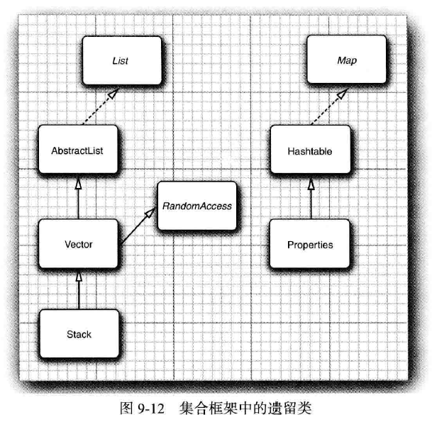

- 如果发现了类中使用了该枚举接口，你可以使用`Collections.list`将枚举中的元素收集到一个`ArrayList`中；或者，在`Java 9`中，你可以把一个枚举转换为一个迭代器：

```java
package cn.dylanphang.ex.set;

import java.util.*;

/**
 * @author dylan
 */
public class HashtableTest {
    public static void main(String[] args) {
        final Hashtable<String, String> hashtable = new Hashtable<>();
        hashtable.put("dylan", "18");
        hashtable.put("rose", "22");
        hashtable.put("jack", "24");

        // 在Java 9中，可以将枚转换为迭代器
        final Enumeration<String> keysEnumA = hashtable.keys();
        final Iterator<String> keysIterA = keysEnumA.asIterator();
        keysIterA.forEachRemaining(System.out::println);

        // 将枚举类中的元素收集到一个List中
        final Enumeration<String> keysEnumB = hashtable.keys();
        final ArrayList<String> list = Collections.list(keysEnumB);
        list.forEach(System.out::println);
    }
}
```

# 循环数组

- 循环数组在实现队列`Queue`这种`FIFO`结构的时候被采用，它可以提高空间的利用率。

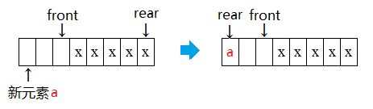

- 用循环数组的方式实现时，为了方便判断队列时候为空或者蛮，可以采用以下方式：
  1. 设队列最大的容量为`max_size`，那么需要创建一个长度为`max_size + 1`的数组。因为队列中的状态共有`0 ~ max_size`总共`max_size + 1`种状态；
  2. 如图所示，其中`rear`为当前队列尾部元素在数组中的下标位置，而`front`为当前队列头部元素的逻辑上前一个位置的数组下标，存储队列元素的数组下标范围是`0 ~ max_size`，则：
     1. 初始时，`front = rear = 0`；
     2. 队列为满的条件是：`(rear + 1) % (max_size + 1) == front`；
     3. 队列为空的条件是：`front == rear`；
     4. 当有元素入队时，先判断是否为满，不满则更新尾部位置：`rear = (rear + 1) % (max_size + 1)`，然后将新入队的元素添加到数组下标为`rear`处；
     5. 但有元素出队时，先判断是否为空，不空则更新头部位置：`front = (front + 1) % (max_size + 1)`，数组下标为`front`的元素将作为出队元素。

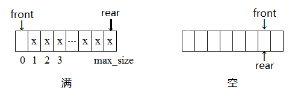

