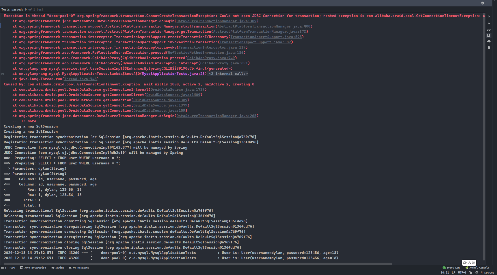

# 前言

- 本篇是关于高并发请求的测试。
- 高并发请求的情况下，会发生什么事情呢？本文将在测试中为大家解开这个谜题。

# 环境配置

- 项目为`SpringBoot`项目，使用`MyBatis`作为持久层框架，依赖如下：
  1. 提供线程池的工具类需要依赖`guava`包，由`Google`提供的；
  2. 注意区分数据库连接池和线程池，这俩是不一样的东西。

```xml
<dependencies>
	<!-- Web模块，可以省略 -->
    <dependency>
        <groupId>org.springframework.boot</groupId>
        <artifactId>spring-boot-starter-web</artifactId>
    </dependency>
    <!-- MyBatis -->
    <dependency>
        <groupId>org.mybatis.spring.boot</groupId>
        <artifactId>mybatis-spring-boot-starter</artifactId>
        <version>2.1.4</version>
    </dependency>
    <!-- Druid数据库连接池 -->
    <dependency>
        <groupId>com.alibaba</groupId>
        <artifactId>druid-spring-boot-starter</artifactId>
        <version>1.1.22</version>
    </dependency>
    <!-- Guava多线程工具 -->
    <dependency>
        <groupId>com.google.guava</groupId>
        <artifactId>guava</artifactId>
        <version>29.0-jre</version>
    </dependency>
    <!-- 基本的MySQL连接驱动 -->
    <dependency>
        <groupId>mysql</groupId>
        <artifactId>mysql-connector-java</artifactId>
        <scope>runtime</scope>
    </dependency>
    <!-- Lombok提供Getter/Setter方法即类日志注解@Slf4j -->
    <dependency>
        <groupId>org.projectlombok</groupId>
        <artifactId>lombok</artifactId>
        <optional>true</optional>
    </dependency>
    <dependency>
        <groupId>org.springframework.boot</groupId>
        <artifactId>spring-boot-starter-test</artifactId>
        <scope>test</scope>
    </dependency>
</dependencies>
```

- `SpringBoot`配置文件`application.yml`如下：
  1. 配置了`tomcat`默认启动的端口号；
  2. 配置了数据库连接参数；
  3. 配置了`MyBatis`的参数。

```yml
server:
  port: 8888
spring:
  datasource:
    druid:
      # 数据库连接配置
      db-type: com.alibaba.druid.pool.DruidDataSource
      driver-class-name: com.mysql.cj.jdbc.Driver
      url: jdbc:mysql://localhost:3306/transaction?serverTimezone=GMT%2B8&useAffectedRows=true
      username: root
      password: root
      # 基本连接池数据
      initial-size: 5
      min-idle: 10
      max-active: 20
      max-wait: 5000
mybatis:
  mapper-locations: classpath:mapper/*xml
  type-aliases-package: cn.dylanphang.mysql.pojo
  # 此条让数据库sql语句在控制台中输出
  configuration:
    log-impl: org.apache.ibatis.logging.stdout.StdOutImpl
```
- 所用的数据库表为：

```sql
CREATE TABLE `user` (
  `id` int(11) NOT NULL AUTO_INCREMENT,
  `username` varchar(30) NOT NULL,
  `password` varchar(30) NOT NULL,
  `age` int(11) NOT NULL,
  PRIMARY KEY (`id`)
) ENGINE=InnoDB AUTO_INCREMENT=3 DEFAULT CHARSET=utf8;
```
- 数据库表基本数据：
```sql
INSERT INTO `user`(username, password, age)
VALUES
	('dylan', '123456', 18),
	('dora', '123456', 16);
```

- `Mapper`类及配置：

```java
package cn.dylanphang.mysql.mapper;

import cn.dylanphang.mysql.pojo.User;
import org.apache.ibatis.annotations.Mapper;
import org.springframework.stereotype.Repository;

/**
 * @author dylan
 * @date 2020/12/18
 */
@Mapper
@Repository
public interface UserMapper {
    /**
     * 用于查询表的语句，测试事务。
     *
     * @param username username
     * @return user
     */
    User find(String username);

    /**
     * 用于修改表的语句，测试事务。
     *
     * @param username username
     * @param age      age
     */
    void update(String username, Integer age);
}
```

```xml
<?xml version="1.0" encoding="UTF-8" ?>
<!DOCTYPE mapper
        PUBLIC "-//mybatis.org//DTD Mapper 3.0//EN"
        "http://mybatis.org/dtd/mybatis-3-mapper.dtd">

<mapper namespace="cn.dylanphang.mysql.mapper.UserMapper">
    <select id="find" parameterType="string" resultType="user">
        SELECT *
        FROM user
        WHERE username = #{username};
    </select>

    <update id="update">
        UPDATE user
        SET age = #{param2}
        WHERE username = #{param1}
    </update>

</mapper>
```

- `Service`层中的休眠设置：

```java
package cn.dylanphang.mysql.service.impl;

import cn.dylanphang.mysql.mapper.UserMapper;
import cn.dylanphang.mysql.pojo.User;
import cn.dylanphang.mysql.service.UserService;
import org.springframework.stereotype.Service;
import org.springframework.transaction.annotation.Transactional;

import javax.annotation.Resource;

/**
 * @author dylan
 * @date 2020/12/18
 */
@Service("userService")
@Transactional(rollbackFor = Exception.class)
public class UserServiceImpl implements UserService {

    @Resource
    private UserMapper userMapper;

    @Override
    public User find(String username) throws InterruptedException {
        Thread.sleep(3000);
        return this.userMapper.find(username);
    }

    @Override
    public void update(String username, Integer age) throws InterruptedException {
        Thread.sleep(3000);
        this.userMapper.update(username, age);
    }
}
```

- 线程池工具类：

```java
package cn.dylanphang.mysql.util;

import com.google.common.util.concurrent.ThreadFactoryBuilder;

import java.util.concurrent.*;

/**
 * @author dylan
 */
public class ThreadUtils {
    public static void create(Runnable runnable) {

        ThreadFactory namedThreadFactory = new ThreadFactoryBuilder()
                .setNameFormat("demo-pool-%d").build();
        ExecutorService singleThreadPool = new ThreadPoolExecutor(2000, 4000,
                0L, TimeUnit.MILLISECONDS,
                new LinkedBlockingQueue<>(1024), namedThreadFactory, new ThreadPoolExecutor.AbortPolicy());

        singleThreadPool.execute(runnable);
    }
}
```

- 实验开始前需要了解`4`个参数：
  1. `initial-size`：数据库连接池初始化时创建的连接数，该值不能大于`max-active`，但可以大于`min-idle`；
  2. `min-idle`：数据库连接池中所能存在的最小空闲连接数量，该值不能待遇`max-active`；
  3. `max-active`：数据库连接池中所能存在的最大连接数量，该值需要大于`initial-size`和`min-idle`；
  4. `max-wait`：连接的最大等待时长，单位是毫秒。

# 测试一

- 测试`max-active`和`max-wait`在查询的情况下，其作用和影响。

- 此时更改数据库连接池的配置为：

```yml
initial-size: 1
min-idle: 2
max-active: 2
max-wait: 1000
```

- 测试类将创建`3`个线程同时请求：

```java
package cn.dylanphang.mysql;

import cn.dylanphang.mysql.pojo.User;
import cn.dylanphang.mysql.service.UserService;
import cn.dylanphang.mysql.util.ThreadUtils;
import lombok.extern.slf4j.Slf4j;
import org.junit.jupiter.api.Test;
import org.springframework.boot.test.context.SpringBootTest;

import javax.annotation.Resource;
import java.util.concurrent.CountDownLatch;

@SpringBootTest
@Slf4j
class MysqlApplicationTests {

    @Resource
    private UserService userService;
    
    @Test
    void testA() throws InterruptedException {
        int maxThread = 3;
        final CountDownLatch cdl = new CountDownLatch(maxThread);
        for (int i = 0; i < maxThread; i++) {
            ThreadUtils.create(() -> {
                try {
                    cdl.await();
                    final User user = this.userService.find("dylan");
                    log.info("User is: {}", user.toString());
                } catch (InterruptedException e) {
                    e.printStackTrace();
                }
            });
            cdl.countDown();
        }
        Thread.sleep(30000);
    }

}
```

- 测试结果：



- 请求过程：
  1. 数据库连接池中的最大连接数为`2`，也就是在同一时间有且仅会允许`2`个线程获取连接；
  2. 数据库连接池中设置的最大等待时间是`1`秒，当`3`个线程的请求同时发起，有且仅有`2`个线程获取到了数据库连接对象，剩余`1`个线程进入了等待；
  3. 测试类中线程处理时间为最少`3`秒，而连接池中的最大等待时间为`1`秒，当该线程达到指定的等待时间但仍旧未获取到数据库连接对象时，将抛出`GetConnectionTimeoutException`；
  4. 成功获取数据库连接对象的`2`个线程在`3`秒后将成功输出查询到的数据。

- 从实验中可以知道`max-active`和`max-wait`的作用是什么：
  - `max-active`将决定数据库连接池中所能承受的线程上限，而`max-wait`将决定当超过`max-active`个线程发出请求时，进入等待流程的线程的最长等待时长是多少；
  - 设想场景，但`200`个并发发起了查询请求，而此时数据库连接池中配置为`max-active: 100`、`max-wait: 1000`，而每个查询请求需要处理的时长为`2000ms`，此时必定只有`100`查询请求可以完成，但剩余的`100`个查询请求必定失败；
  - 过大的`max-active`会增加数据库的负担，而过大的`max-wait`会降低用户的体验。

# 测试二

- 测试二将测试`2`条并发的情况下，事务是否能够顺利完成。

- 在`SpringBoot`中事务管理可以通过直接添加`@Transactional(rollbackFor = Exception.class)`完成。

- 在`UserServiceImpl`中添加一个方法，查询用户年龄后，根据年龄进行减一操作后等到新的年龄，再将新的年龄更新为该用户当前的年龄，查询操作后将休眠`3`秒。

```java
package cn.dylanphang.mysql.service.impl;

import cn.dylanphang.mysql.mapper.UserMapper;
import cn.dylanphang.mysql.pojo.User;
import cn.dylanphang.mysql.service.UserService;
import org.springframework.stereotype.Service;
import org.springframework.transaction.annotation.Transactional;

import javax.annotation.Resource;

/**
 * @author dylan
 * @date 2020/12/18
 */
@Service("userService")
@Transactional(rollbackFor = Exception.class)
public class UserServiceImpl implements UserService {

    @Resource
    private UserMapper userMapper;

    @Override
    public User find(String username) throws InterruptedException {
        Thread.sleep(3000);
        return this.userMapper.find(username);
    }

    @Override
    public void update(String username, Integer age) throws InterruptedException {
        Thread.sleep(3000);
        this.userMapper.update(username, age);
    }

    @Override
    public void findThenUpdate(String username) throws InterruptedException {
        final Integer newAge = this.find(username).getAge() - 1;
        Thread.sleep(3000);
        this.update(username, newAge);
    }
}
```

- 测试类：
  1. 测试方法只使用了`2`个线程对数据库发出查询并修改数据的请求，其计算过程是在`findThenUpdate`中完成的；
  2. 测试前后将输出用户年龄前后的值。

```java
package cn.dylanphang.mysql;

import cn.dylanphang.mysql.pojo.User;
import cn.dylanphang.mysql.service.UserService;
import cn.dylanphang.mysql.util.ThreadUtils;
import lombok.extern.slf4j.Slf4j;
import org.junit.jupiter.api.AfterEach;
import org.junit.jupiter.api.BeforeEach;
import org.junit.jupiter.api.Test;
import org.springframework.boot.test.context.SpringBootTest;

import javax.annotation.Resource;
import java.util.concurrent.CountDownLatch;

@SpringBootTest
@Slf4j
class MysqlApplicationTests {

    @Resource
    private UserService userService;

    @BeforeEach
    void init() throws InterruptedException {
        final Integer age = this.userService.find("dylan").getAge();
        log.info("Now the age is: {}", age);
    }

    @Test
    void testB() throws InterruptedException {
        int maxThread = 2;
        final CountDownLatch cdl = new CountDownLatch(maxThread);
        for (int i = 0; i < maxThread; i++) {
            ThreadUtils.create(() -> {
                try {
                    cdl.await();
                    this.userService.findThenUpdate("dylan");
                } catch (InterruptedException e) {
                    e.printStackTrace();
                }
            });
            cdl.countDown();
        }
        Thread.sleep(30000);
    }
    
    @AfterEach
    void destroy() throws InterruptedException {
        final Integer age = this.userService.find("dylan").getAge();
        log.info("After the age is: {}", age);
    }

}
```

- `@BeforeEach`输出：


- `@Test`输出：


- `@AfterEach`输出：


- 请求过程：
  1. 测试类中的`2`个请求同时发出后，都会先进行数据库查询的操作，无疑`2`个线程都会获得同一个年龄值；
  2. 线程完成`Service`中的线程倒计时后，此时`2`个线程都会同时对数据库发起`update`的操作；
  3. 由于更新操作完全一致，导致最终年龄值不是原来年龄值减二后的结果，而仅仅是减一后的结果。
- 此时可以类比多线程请求购买商品时，商品扣库的情况，即使在有事务控制的情况下，多线程请求同一个接口，对同一个表的同一条数据进行同样的增删改操作，可能会造成数据的不准确，解决方法：
  - 将查询和更新语句写在同一条语句中。

# 测试三

- 为了解决测试二中出现的并发问题，测试三将把查询和更新语句写在同一条`sql`语句中，观察输出结果：
  - `UPDATE user SET age = age - 1 WHERE username = #{username}；`

- 在`UserMapper.java`中添加一个新的方法，同时在`UserMapper.xml`中添加相应的`Sql`语句：

```java
package cn.dylanphang.mysql.mapper;

import cn.dylanphang.mysql.pojo.User;
import org.apache.ibatis.annotations.Mapper;
import org.springframework.stereotype.Repository;

/**
 * @author dylan
 * @date 2020/12/18
 */
@Mapper
@Repository
public interface UserMapper {

    /**
     * 使用一条语句进行年龄更新的操作。
     *
     * @param username username
     */
    void findThenUpdateInOneSql(String username);
}
```

```xml
<?xml version="1.0" encoding="UTF-8" ?>
<!DOCTYPE mapper
        PUBLIC "-//mybatis.org//DTD Mapper 3.0//EN"
        "http://mybatis.org/dtd/mybatis-3-mapper.dtd">

<mapper namespace="cn.dylanphang.mysql.mapper.UserMapper">
    <update id="findThenUpdateInOneSql">
        UPDATE user
        SET age = age - 1
        WHERE username = #{username};
    </update>
</mapper>
```

- 相应地，在`service`层中对线程进行`3`秒延时处理的模仿：

```java
package cn.dylanphang.mysql.service.impl;

import cn.dylanphang.mysql.mapper.UserMapper;
import cn.dylanphang.mysql.pojo.User;
import cn.dylanphang.mysql.service.UserService;
import org.springframework.stereotype.Service;
import org.springframework.transaction.annotation.Transactional;

import javax.annotation.Resource;

/**
 * @author dylan
 * @date 2020/12/18
 */
@Service("userService")
@Transactional(rollbackFor = Exception.class)
public class UserServiceImpl implements UserService {

    @Resource
    private UserMapper userMapper;

    @Override
    public void findThenUpdateInOneSql(String username) throws InterruptedException {
        Thread.sleep(3000);
        this.userMapper.findThenUpdateInOneSql(username);
    }
}
```

- 其中`UPDATE user SET age = age - 1 WHERE username = #{username}`语句为将年龄减一，再次运行测试：
- `@BeforeEach`输出：


- `@Test`输出：


- `@AfterEach`输出：


- 此时没有出现类似于测试二中的错误结果。

# 测试四

- 经过测试三优化后，我们在同一条`sql`中完成了更新年龄的操作。

- 如果此时需要同时处理`20000`条并发呢？每个线程发送的请求都会获取一个数据库连接对象，而该对象明显是从数据库连接池中取出来的，如果连接池的初始化数量或最小空闲连接数量不足`20000`，在突然需要处理高并发时，会出现异常。
- 此时修改连接池的配置为：

```yml
initial-size: 10
min-idle: 20
max-active: 40
max-wait: 5000
```

- 需要注意的是，关于`initial-size`初始化连接池数量，该数量不是越大越好的，创建连接对象是十分消耗资源的，该数值配置的越大，启动服务器则会越慢。
- 所以说，当预计服务器的并发量为`20000`条时，不可能将`initial-size`设置为`20000`，这是不合理的。
- 同样的，`max-active`参数也不能设置过大，服务器的资源总是有限的，如果资源大部分用作维护`20000`个数据库连接对象，无疑也是不合理的，可能会造成系统资源的浪费。
- 同样使用测试三中的`UserMapper.java`和`UserMapper.xml`：

```java
package cn.dylanphang.mysql.mapper;

import cn.dylanphang.mysql.pojo.User;
import org.apache.ibatis.annotations.Mapper;
import org.springframework.stereotype.Repository;

/**
 * @author dylan
 * @date 2020/12/18
 */
@Mapper
@Repository
public interface UserMapper {

    /**
     * 使用一条语句进行年龄更新的操作。
     *
     * @param username username
     */
    void findThenUpdateInOneSql(String username);
}
```

```xml
<?xml version="1.0" encoding="UTF-8" ?>
<!DOCTYPE mapper
        PUBLIC "-//mybatis.org//DTD Mapper 3.0//EN"
        "http://mybatis.org/dtd/mybatis-3-mapper.dtd">

<mapper namespace="cn.dylanphang.mysql.mapper.UserMapper">
    <update id="findThenUpdateInOneSql">
        UPDATE user
        SET age = age - 1
        WHERE username = #{username};
    </update>
</mapper>
```

- 同时`service`层中一样延时`3`秒：

```java
package cn.dylanphang.mysql.service.impl;

import cn.dylanphang.mysql.mapper.UserMapper;
import cn.dylanphang.mysql.pojo.User;
import cn.dylanphang.mysql.service.UserService;
import org.springframework.stereotype.Service;
import org.springframework.transaction.annotation.Transactional;

import javax.annotation.Resource;

/**
 * @author dylan
 * @date 2020/12/18
 */
@Service("userService")
@Transactional(rollbackFor = Exception.class)
public class UserServiceImpl implements UserService {

    @Resource
    private UserMapper userMapper;

    @Override
    public void findThenUpdateInOneSql(String username) throws InterruptedException {
        Thread.sleep(3000);
        this.userMapper.findThenUpdateInOneSql(username);
    }
}
```

- 运行测试，本次过程中出现了`GetConnectionTimeoutException`和`CannotCreateTransactionException`：


- 同时数据库中相关用户的年龄原本为`20018`，经过`20000`高并发测试后，结果却为`19842`：


- 并发扣减年龄失败的原因，无疑是因为异常导致的。
- 关于异常的说明：
  - `GetConnectionTimeoutException`：由于在并发的情况下，不能获取到数据库连接的线程，将会进入等待状态，当等待时间超过`max-wait`中的设定`5000ms`后，仍未获取到连接，则会抛出此异常；
  - `CannotCreateTransactionException`：本异常的出现，是`GetConnectionTimeoutException`的一层外壳，其中调用获取数据库连接的方法失败后，捕获到了`GetConnectionTimeoutException`异常，该方法则抛出此异常：

```console
Exception in thread "demo-pool-0" org.springframework.transaction.CannotCreateTransactionException: 
Could not open JDBC Connection for transaction; nested exception is com.alibaba.druid.pool.GetConnectionTimeoutException: wait millis 9308, active 40, maxActive 40, creating 0
```

- 高并发情况下发生异常，基本上都是由于无法获取到数据库连接而导致的。

# 总结

1. 从测试一中，可以看到决定数据库连接池中连接数量的关键参数是`max-active`；
2. 从测试二中，可以知道每个线程中的事务，都是独立的：
   1. 同一个线程的情况，前后两条代码同时使用`service`中的方法去更新数据库中的同一条数据，后一条代码必定是在前一条代码执行完全结束之后才会执行，而实际开发中，需要将两条代码置于`service`层中，保证其在一个事务里而不是两个；
   2. 两个线程的情况下，其中的事务是各自单独执行的，每个线程都回去请求数据库连接池中的连接，每个连接都会开启一个独立的事务，一个事务的异常不会影响另一个事务的执行；
   3. 多线程下如果需要进行更新库操作，最好的方式是使用同一条`sql`语句完成操作，先查后计算再更新，有可能导致两个线程中的查询结果一致，直接造成计算结果与更新结果一致的情况。
3. 从测试三中，可以得出将操作置于同一条`sql`语句，是可以保证事务的一致性；
4. 从测试四中，可以明白在保证事务一致性的前提下，并发量巨大时，系统的短板则会出现在数据库连接池的配置上，同时此配置也无法设置得太大，会影响系统性能。

