# 0. 前言

> - 本篇是针对我个人开发环境的搭建。

# 1. Typora主题

- `Typora Blubook`
  - https://github.com/FishionYu/typora-blubook-theme
- 下载安装后，可以自定义内容宽度为`900px`，默认的`700px`宽度过于窄，同样代码类字体样式也修改一下，参考如下：

```css
/****** Code style ******/
code {
    font-size: .9em; 
     /* 添加了Microsoft YaHei UI Light */
    font-family: 'Cascadia Code', 'Microsoft YaHei UI Light', Consolas, 'Noto Sans SC','Courier New', monospace;
    padding: .2em .2em;
    border-radius: 3px;
    background: #f5f7f9 !important;
}
  
code,
pre{
    font-size: 90% !important;
    /* 自定义字体样式bold，添加了Microsoft YaHei UI Light */
    font-weight: bold;
    font-family: 'Cascadia Code', 'Microsoft YaHei UI Light', Consolas, 'Noto Sans SC','Courier New', monospace;
    -webkit-font-smoothing: initial;
    -moz-osx-fontsmoothing: initial
}

/****** #write basic ******/
#write {
    position: static;
    width: 90%;
    /* 自定义宽度900px */
    max-width: 900px;
    line-height: 1.6;
    transform: none;
    height: auto;
}
```

# 2. 编程字体

- 一款漂亮的字体总是会让工作事半功倍
- 其中代码使用的字体为`cascadia code`，下载打开目标字体文件安装即可
  - https://github.com/microsoft/cascadia-code
- 如果需要修改`IDEA`的字体为`cascadia code`，将`\Windows\fonts`下的`cascadia code`复制到`idea`安装目录下`\jbr\lib\fonts`中，即可在`IDEA`的`setting`中找到目标字体。

# 3. Maven仓库镜像

- 在`IDEA`的设置中找到选项`Maven`，通过修改`User settings file`，我们可以将`Maven`仓库的默认下载镜像改为国内的阿里云镜像，从而解决下载慢的问题。
- 目标的文件一般路径为：`/.m2/settings.xml`，如果目标目录`/.m2`中不存在用户自定义`Maven`的配置文件，自行创建一个`settings.xml`即可，内容如下：

```xml
<settings xmlns="http://maven.apache.org/SETTINGS/1.0.0"
      xmlns:xsi="http://www.w3.org/2001/XMLSchema-instance"
      xsi:schemaLocation="http://maven.apache.org/SETTINGS/1.0.0
                          https://maven.apache.org/xsd/settings-1.0.0.xsd">
    <mirrors>
        <mirror> 
            <id>alimaven</id> 
            <name>aliyun maven</name> 
            <!-- Nexus是Maven仓库管理器，通过nexus可以搭建maven仓库，同时nexus还提供强大的仓库管理功能，构件搜索功能等。 -->
            <url>http://maven.aliyun.com/nexus/content/groups/public/</url> 
            <mirrorOf>central</mirrorOf>         
        </mirror> 
    </mirrors>
</settings>
```

# 4. keyborad说明书

- `Niz 66`键双模全键可编程静电容


# 5. Tomcat日志乱码问题

- 在`IDEA`中配置`Tomcat`服务器，有可能在日志输出的控制台出现中文乱码的问题，需要到`Tomcat`目录下，修改`/conf/logging.properties`文件，将图中右侧蓝色标注的地方，注释起来

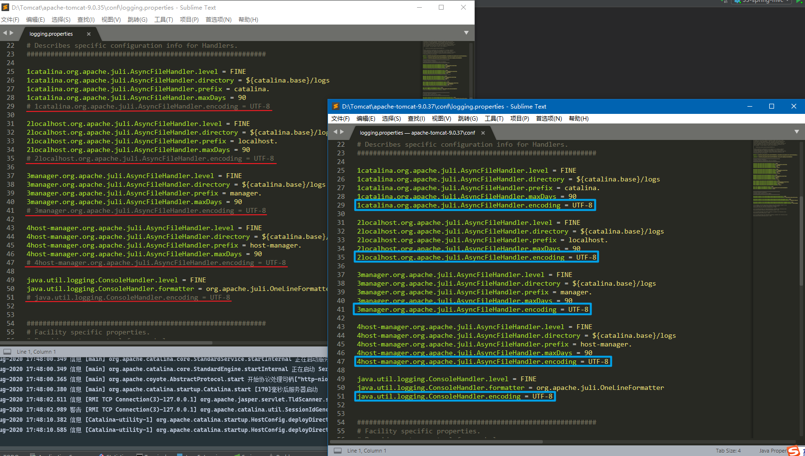

# 6. IDEA样式

- 版本为`IntelliJ IDEA 2020.1`；
- 直接在`Plugins`中下载主题`One Dark Theme`即可；
- 更改默认字体前，需要将`cascadia code`字体放入`Intellij IDEA`中的`fonts`目录里：

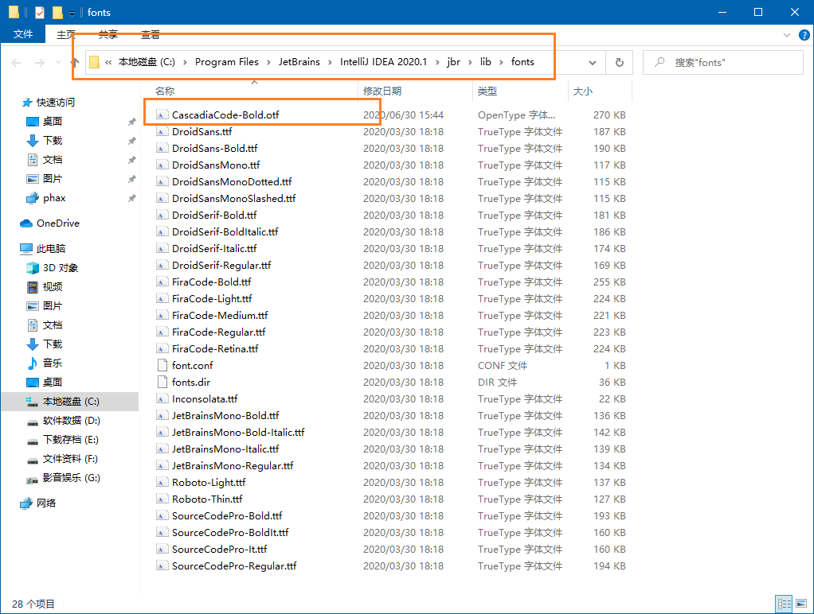

- 修改编程字体只需要在以下两个地方，将默认字体更改为`cascadia code`即可：

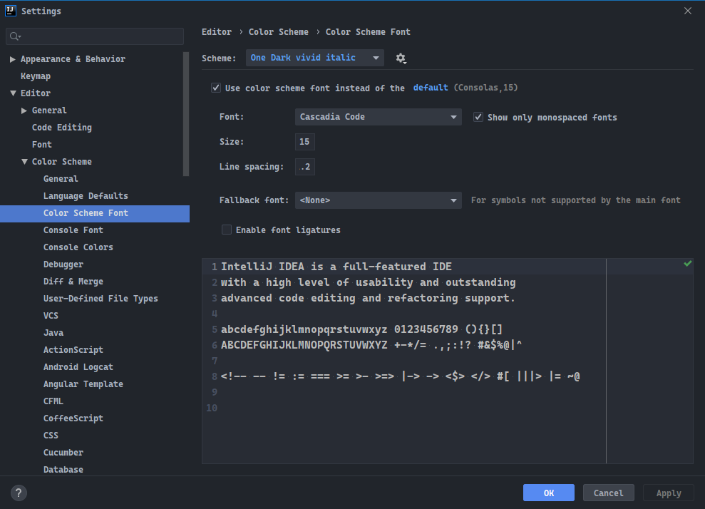

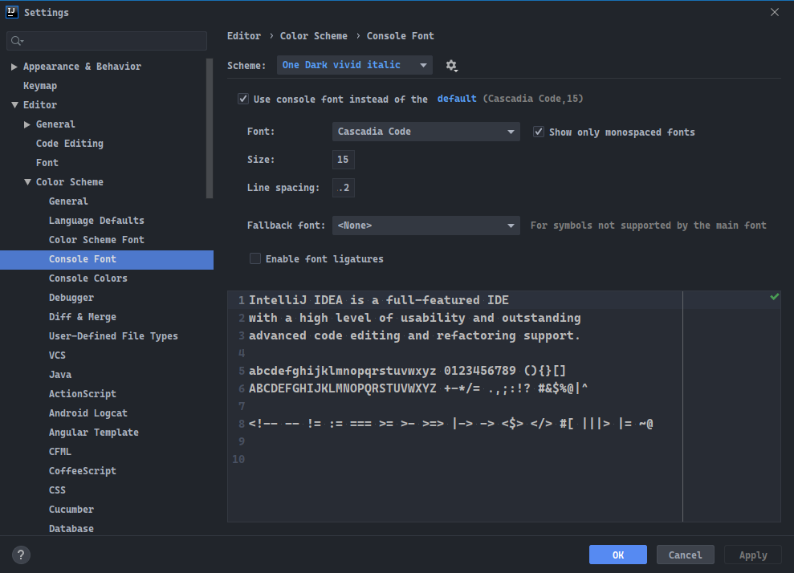

- 更改软件显示字体，如图所示：

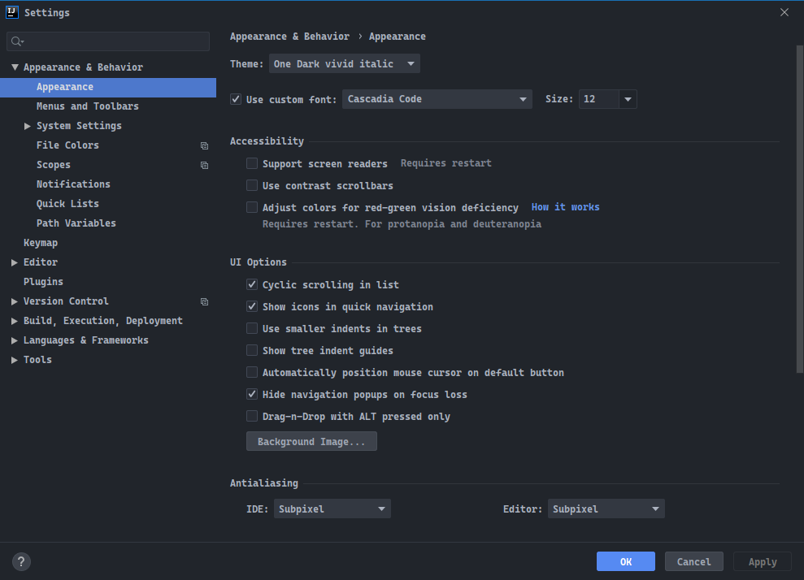

# 7. IDEA Template

- 在`IDEA`中创建模板`Template`，可以快速生成工程代码。

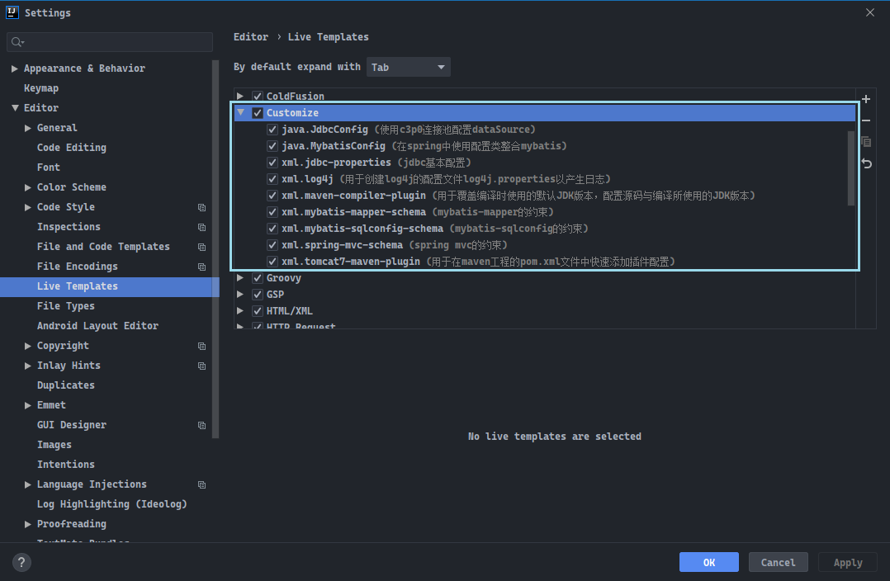

# 8. 端口占用

- 使用`IDEA`进行`Web`开发可能会出现`1099`端口被占用的情况，主要的原因是项目未被关闭，`IDEA`就被强制关闭了，重启`IDEA`之后，出现`1099`端口被占用的情况。

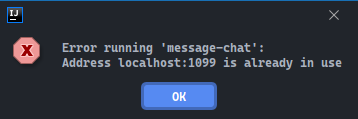

- 使用命令行将占用`1099`端口的程序杀死即可，对于其他端口被占用的情况，也可以使用以下的方式将端口释放。
  - `netstat -ano|findstr 1099`
  - `taskkill -f -pid {pid_num}`

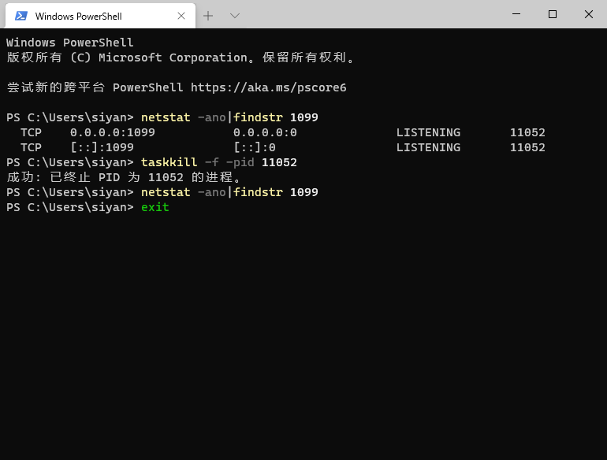

# 9. 热部署插件

- 项目如果很大，一般部署运行这个项目，就需要很长的时间。
- 修改代码之后，需要看到代码呈现的效果，也需要将项目进行重启。
- `JRebel`热部署插件，安装此插件可以直接对代码进行修改，代码效果也可以立刻呈现。

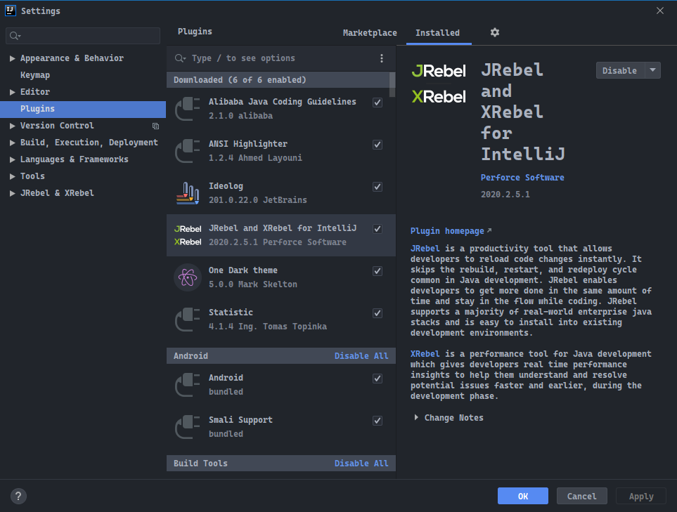

- `JRebel`是收费的，需要在`https://www.guidgen.com/`获取`GUID`，并拼接`https://jrebel.qekang.com/`网址，组成`Team URL`，邮箱地址可以自行填写，如下图所示：

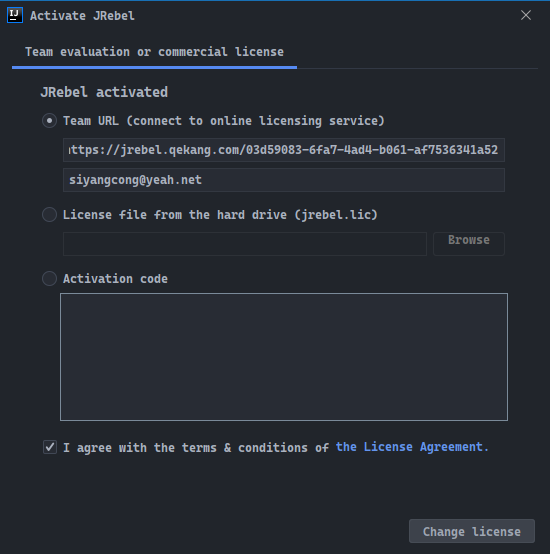

- 激活完毕，点击`Work offline`防止激活链接失效。

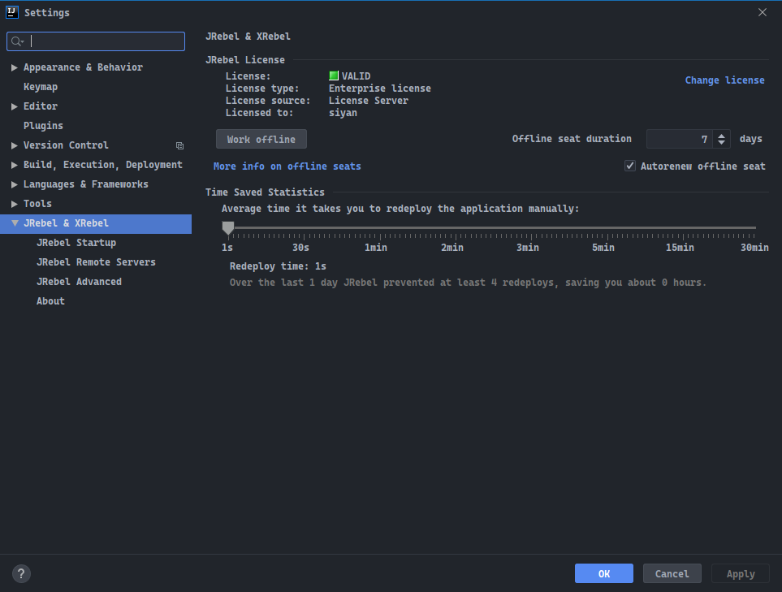

- 调整热部署时间为`1s`。

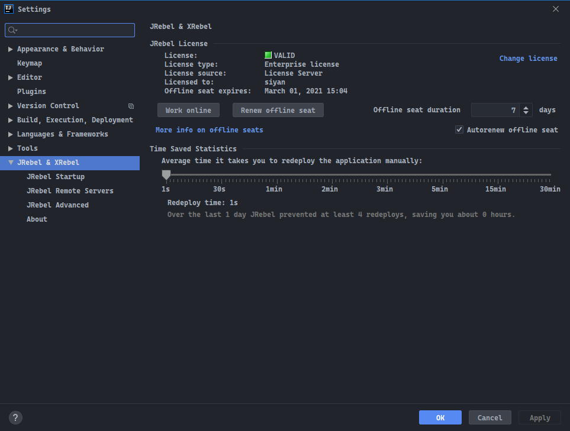

- 最后，打开`JRebel panel`，在需要进行热部署的项目上允许`JRebel`插件（打钩）。

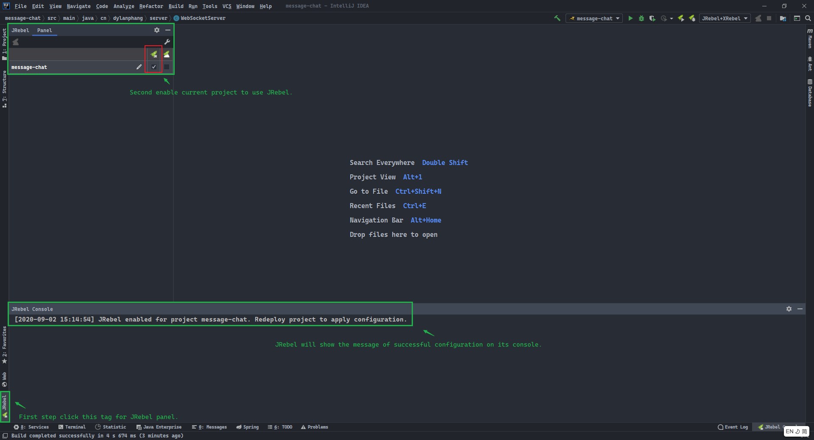

# 10. Netease Music

- 解锁网易云变灰、`vip`等音乐，`GitHub`项目地址：
  - https://github.com/nondanee/UnblockNeteaseMusic

- 需要从`GitHub`上下载`zip`压缩包，解压到任意位置，可以为它取一个合理的名字例如`UnblockNeteaseMusic`，方便你使用命令行切目录，好看点。


- 接下来我们需要`node.js`，下载地址：
  - https://nodejs.org/zh-cn/

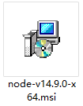

- 双击完成`node.js`的安装，完成后再`cmd`中键入以下命令：

```shell
node -h
```

- 如图所示，即安装成功：

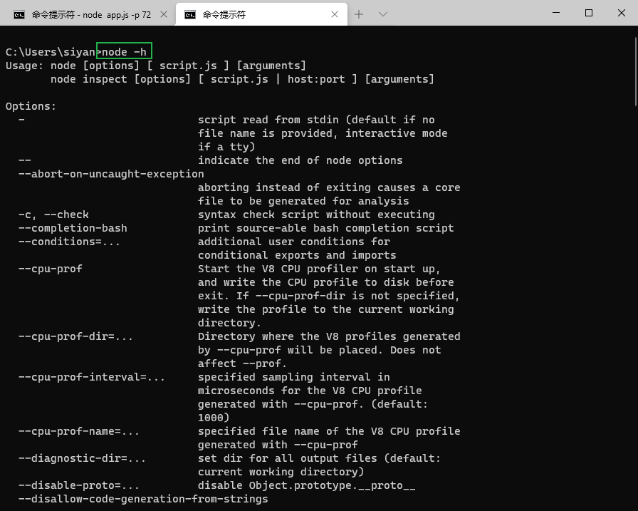

- 接下来运行以下的命令行，启用代理：

```shell
cd /d D:\UnblockNeteaseMusic && node app.js -p 7239 -f 59.111.181.60
```

- 命令第一部分是进入项目目录`UnblockNeteaseMusic`目录：

```shell
cd /d D:\UnblockNeteaseMusic
```

- 命令第二部分是使用`node.js`在端口`7239`上部署项目`UnblockNeteaseMusic`，并传递网易云音乐的`IP`地址`59.111.181.60`：

```shell
node app.js -p 7239 -f 59.111.181.60
```

- 网易云音乐的`IP`地址可以通过`ping`命令行获取：

```shell
ping music.163.com
```

- 如图所示，有时候会`ping`不出来，可以直接使用图示`IP`地址：

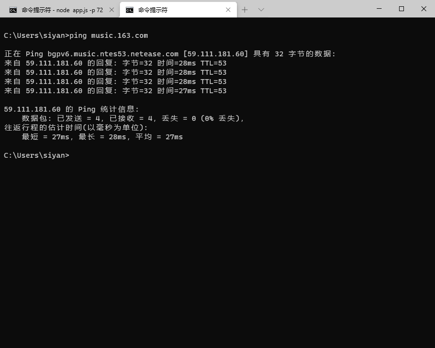

- 服务器启动后，需要保持窗口的运行，在网易云没有启动或没有正确设置`HTTP`端口的时候，只会显示橙色线所示的消息行：

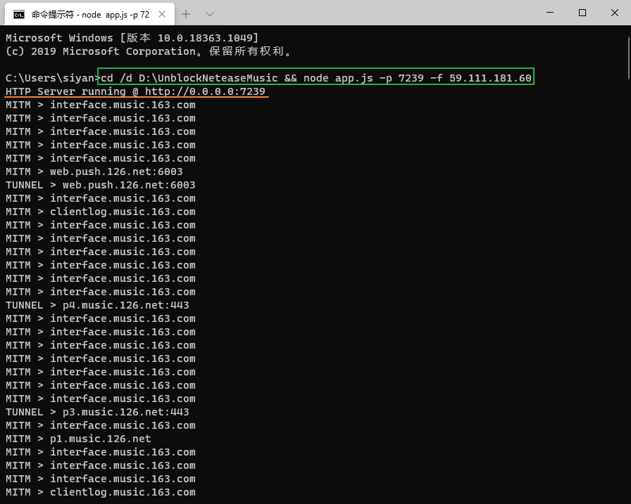

- 最后，进入网页云音乐，设置`HTTP`代理，将`IP`设置为本地IP地址：`127.0.0.1`，将端口设置为部署项目时设置的端口：`7239`，重启软件后，即完成所有歌曲的解锁。

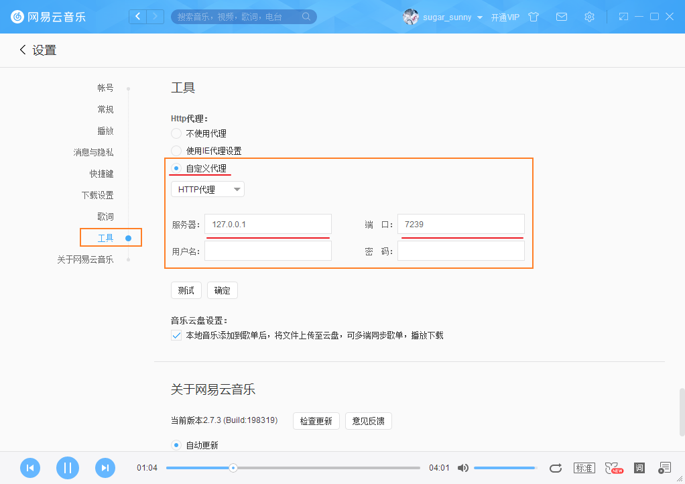

- 针对远程服务器的部署，同样的需要下载项目，希望程序在后台静默运行，运行以下代码：

```shell
# 针对Window系统，后台运行文件将被记录到window-output.file
node app.js -p 9214:9215 -f 59.111.181.60 -e http://music.163.com > window-output.file 2>&1 &
# 针对IOS系统，后台运行文件将被记录到ios-output.file
node app.js -p 19214:19215 -f 59.111.181.60 -e https://music.163.com > ios-output.file 2>&1 &
```

#  11. Xshell配色方案

- 字体方案推荐采用`cascadia code semibold`，字号设置为`12`。
- 可以选用系统自带的`Isayme`配色，也可以使用`Ubuntu`的配色方案，都较为护眼，配色方案如下，保存为`.xcs`结尾的文件，在`Xshell`配色方案中导入即可：

```css
[Ubuntu]
text(bold)=ffffff
magenta(bold)=ad7fa8
text=ffffff
white(bold)=eeeeec
green=4e9a06
red(bold)=ef2929
green(bold)=8ae234
black(bold)=555753
red=cc0000
blue=3465a4
black=000000
blue(bold)=729fcf
yellow(bold)=fce94f
cyan(bold)=34e2e2
yellow=c4a000
magenta=75507b
background=300a24
white=d3d7cf
cyan=06989a
[Names]
count=1
name0=Ubuntu
```

# 12. @SuppressWarnings相关

- 抑制警告的关键字：

|          关键字          |                             用途                             |
| :----------------------: | :----------------------------------------------------------: |
|           all            |                   to suppress all warnings                   |
|          boxing          | to suppress warnings relative to boxing/unboxing operations  |
|           cast           |       to suppress warnings relative to cast operations       |
|         dep-ann          |    to suppress warnings relative to deprecated annotation    |
|       deprecation        |         to suppress warnings relative to deprecation         |
|       fallthrough        | to suppress warnings relative to missing breaks in switch statements |
|         finally          | to suppress warnings relative to finally block that don’t return |
|          hiding          |  to suppress warnings relative to locals that hide variable  |
|    incomplete-switch     | to suppress warnings relative to missing entries in a switch statement (enum case) |
|           nls            |   to suppress warnings relative to non-nls string literals   |
|           null           |        to suppress warnings relative to null analysis        |
|         rawtypes         | to suppress warnings relative to un-specific types when using generics on class params |
|       restriction        | to suppress warnings relative to usage of discouraged or forbidden references |
|          serial          | to suppress warnings relative to missing serialVersionUID field for a serializable class |
|      static-access       |   o suppress warnings relative to incorrect static access    |
|     synthetic-access     | to suppress warnings relative to unoptimized access from inner classes |
|        unchecked         |    to suppress warnings relative to unchecked operations     |
| unqualified-field-access |  to suppress warnings relative to field access unqualified   |
|          unused          |         to suppress warnings relative to unused code         |