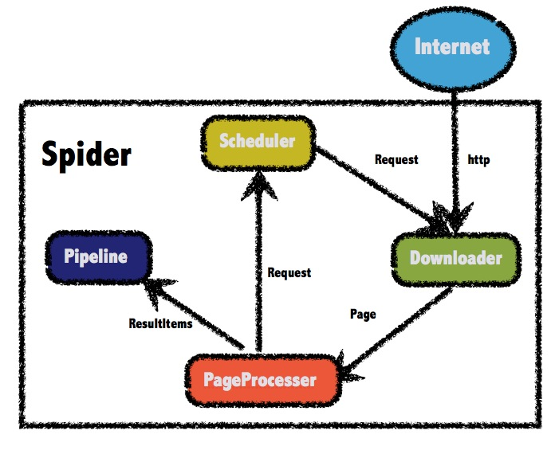

# Simple Crawler（HttpClient）

> - **此项目使用的JDK版本为Java1.8。**
>

## 0. pom.xml

- 这是一个Maven项目，要先获取项目所需要依赖的所有jar包，直接修改项目的pom.xml文件，添加项目所需要的依赖。

### #pom.xml

```xml
<?xml version="1.0" encoding="UTF-8"?>
<project xmlns="http://maven.apache.org/POM/4.0.0"
         xmlns:xsi="http://www.w3.org/2001/XMLSchema-instance"
         xsi:schemaLocation="http://maven.apache.org/POM/4.0.0 http://maven.apache.org/xsd/maven-4.0.0.xsd">
    <modelVersion>4.0.0</modelVersion>
    
    <parent>
        <groupId>org.springframework.boot</groupId>
        <artifactId>spring-boot-starter-parent</artifactId>
        <version>2.0.2.RELEASE</version>
    </parent>

    <groupId>cn.dylanphang</groupId>
    <artifactId>crawler</artifactId>
    <version>1.0-SNAPSHOT</version>
    
    <dependencies>
        <!-- SpringMVC -->
        <dependency>
            <groupId>org.springframework.boot</groupId>
            <artifactId>spring-boot-starter-web</artifactId>
        </dependency>
        <!-- SpringData Jpa -->
        <dependency>
            <groupId>org.springframework.boot</groupId>
            <artifactId>spring-boot-starter-data-jpa</artifactId>
        </dependency>
        <!-- MySQL连接包 -->
        <dependency>
            <groupId>mysql</groupId>
            <artifactId>mysql-connector-java</artifactId>
        </dependency>
        <!-- httpclient用于发送网页请求 -->
        <dependency>
            <groupId>org.apache.httpcomponents</groupId>
            <artifactId>httpclient</artifactId>
            <version>4.5.2</version>
        </dependency>
        <!-- jsoup用于解析dom -->
        <dependency>
            <groupId>org.jsoup</groupId>
            <artifactId>jsoup</artifactId>
            <version>1.11.3</version>
        </dependency>
        <!-- https://mvnrepository.com/artifact/org.apache.commons/commons-lang3 -->
        <dependency>
            <groupId>org.apache.commons</groupId>
            <artifactId>commons-lang3</artifactId>
            <version>3.8.1</version>
        </dependency>
        <!-- 测试单元 -->
        <dependency>
            <groupId>junit</groupId>
            <artifactId>junit</artifactId>
            <version>4.12</version>
            <scope>test</scope>
        </dependency>
        <!-- https://mvnrepository.com/artifact/commons-io/commons-io -->
        <dependency>
            <groupId>commons-io</groupId>
            <artifactId>commons-io</artifactId>
            <version>2.6</version>
        </dependency>
    </dependencies>
</project>
```

## 1. application.properties

- 第一部分是熟悉的数据库配置信息，与数据库建立起连接；
- 第二部分是JPA配置信息，猜测是JPA需要在操作数据库前，需要的读取的配置信息。

### # application.properties

```properties
#DB Configuration:
spring.datasource.driverClassName=com.mysql.jdbc.Driver
spring.datasource.url=jdbc:mysql://127.0.0.1:3306/crawler
spring.datasource.username=root
spring.datasource.password=root

#JPA Configuration:
spring.jpa.database=MySQL
spring.jpa.show-sql=true
```

## 2. database

- 根据你所需要的爬取的数据，新建一个对应的数据库表，并放置于配置文件中所指向的数据库中。
- 这一步不是特别需要注意的，大致了解爬取下来的数据是什么类型的、主键默认都设置为id自增长就好了，其他不太明白的部分，暂时先照抄吧。

### # jd_item

```mysql
CREATE TABLE `jd_item` (
  `id` bigint(10) NOT NULL AUTO_INCREMENT COMMENT '主键id',
  `spu` bigint(15) DEFAULT NULL COMMENT '商品集合id',
  `sku` bigint(15) DEFAULT NULL COMMENT '商品最小品类单元id',
  `title` varchar(100) DEFAULT NULL COMMENT '商品标题',
  `price` bigint(10) DEFAULT NULL COMMENT '商品价格',
  `pic` varchar(200) DEFAULT NULL COMMENT '商品图片',
  `url` varchar(200) DEFAULT NULL COMMENT '商品详情地址',
  `created` datetime DEFAULT NULL COMMENT '创建时间',
  `updated` datetime DEFAULT NULL COMMENT '更新时间',
  PRIMARY KEY (`id`),
  KEY `sku` (`sku`) USING BTREE
) ENGINE=InnoDB DEFAULT CHARSET=utf8 COMMENT='京东商品标';
```

## 3. pojo

- pojo是一个简单的Java类，用于保存爬取下来的数据，其中的成员变量对应着数据库中的每一个键；
- 需要注意的是成员变量的数据类型，Java的数据类型与MySql中的有一定的差异；
- 除开必要的成员变量外，还需要为其添加Getter/Setter方法，toString方法可选。

### # Item

```java
package jdphone.pojo;

import javax.persistence.*;
import java.util.Date;

@Entity // 实体类注解
@Table(name = "jd_item")
public class Item {
    
    @Id // 主键
    @GeneratedValue(strategy = GenerationType.IDENTITY)
    private Long id;
    // 标准产品单位（商品集合）
    private Long spu;
    // 库存量单位（最小品类单元）
    private Long sku;
    // 商品标题
    private String title;
    // 商品价格
    private Double price;
    // 商品图片
    private String pic;
    // 商品链接
    private String url;
    // 创建时间
    private Date created;
    // 更新时间
    private Date updated;

    public Long getId() {
        return id;
    }

    public void setId(Long id) {
        this.id = id;
    }

    public Long getSpu() {
        return spu;
    }

    public void setSpu(Long spu) {
        this.spu = spu;
    }

    public Long getSku() {
        return sku;
    }

    public void setSku(Long sku) {
        this.sku = sku;
    }

    public String getTitle() {
        return title;
    }

    public void setTitle(String title) {
        this.title = title;
    }

    public Double getPrice() {
        return price;
    }

    public void setPrice(Double price) {
        this.price = price;
    }

    public String getPic() {
        return pic;
    }

    public void setPic(String pic) {
        this.pic = pic;
    }

    public String getUrl() {
        return url;
    }

    public void setUrl(String url) {
        this.url = url;
    }

    public Date getCreated() {
        return created;
    }

    public void setCreated(Date created) {
        this.created = created;
    }

    public Date getUpdated() {
        return updated;
    }

    public void setUpdated(Date updated) {
        this.updated = updated;
    }
}
```

## 4. dao

- dao猜测用于数据库的交互，里面包含的是一个接口，它继承了一个**JpaRepository<T, ID>接口**；
- 进一步猜测是因为无法直接使用**JpaRepository<T, ID>接口**，必须要继承它才能通过它的子类使用它；
- 其中，**T**为pojo中的**数据库表类**，**ID**为**数据库表类的主键成员变量类**。

### #ItemDao

```java
package jdphone.dao;

import jdphone.pojo.Item;
import org.springframework.data.jpa.repository.JpaRepository;

public interface ItemDao extends JpaRepository<Item, Long>{ // 继承JpaRepository类并传入实体类Item以及主键数据类型Long
}
```

## 5. service

- service用于保存数据，里面包含了一个接口与它的一个实现类；
- 猜测接口是用于规范实现类编写的，可以认为接口是一种规则，里面包含了必须要被覆写的方法；
- 在接口中需要定义商品保存的方法，以及一个查询商品的方法（可用于查询商品是否存在）；
- 稍加留意会发现，此接口的实现类会在覆写的方法中调用**<? super JpaRepository<T, ID>>**中的同名方法，也就是说这个service包中的接口里规定的方法，**无论是其命名方式或者是其返回值类型**，其参考的编写方式均来自于**<? super JpaRepository<T, ID>>**，其中的必要功能已经在**<? super JpaRepository<T, ID>>**中被实现，我们需要做的只是传入参数罢了，大自然的搬运工；
- 下面是service包中**接口**的编写代码：

### # ItemService

```java
package jdphone.service;

import jdphone.pojo.Item;

import java.util.List;

public interface ItemService {
    /**
     * 保存商品
     *
     * @param item
     */
    public void save(Item item);

    /**
     * 根据条件查询商品
     *
     * @param item
     * @return
     */
    public List<Item> findAll(Item item);
}
```
- 关于覆写的**findAll**方法中，要求传入一个**Example的对象引用**问题：
  - 获取的方法是通过**Example类中的静态方法of**，传入**JpaRepository<T, ID>**中我们设定好的**T类**的对象引用，就能获取到**findAll**方法中要求传入的Example类的对象引用了。
- 下面是service包中**实现类**的编写代码：

### # ItemServiceImpl

```java
package jdphone.service.impl;

import jdphone.dao.ItemDao;
import jdphone.pojo.Item;
import jdphone.service.ItemService;
import org.springframework.beans.factory.annotation.Autowired;
import org.springframework.data.domain.Example;
import org.springframework.stereotype.Service;
import org.springframework.transaction.annotation.Transactional;

import java.util.List;

@Service
public class ItemServiceImpl implements ItemService {

    @Autowired
    private ItemDao itemDao;

    @Override
    @Transactional // 涉及到操纵数据库，要开启事务，使用默认参数
    public void save(Item item) {
        this.itemDao.save(item);
    }

    @Override
    public List<Item> findAll(Item item) {
        // 声明查询条件
        Example<Item> example = Example.of(item);

        // 根据查询条件进行数据查询
        List<Item> list = this.itemDao.findAll(example);

        return list;
    }
}
```

## 6. util

- **一般使用后的httpClient对象，需要进行资源的释放操作，而网页爬虫爬取的数据众多，从效率层面上考虑，保留httpClient对象做下一次请求操作，只释放response对象的资源，会更为妥善；**
- 因此我们使用httpClient对象的**连接池管理器PoolingHttpClientConnectionManager**获取httpClient对象并管理闲置的httpClient对象；
- 创建一个工具类，并编写能够获取网页内容及下载网页图片的方法：
  - **获取网页内容：**通过httpClient对象的静态方法execute传入httpGet参数能获取到response对象，通过判断状态码"**response.getStatusLine().getStatusCode()**"是否正常以及响应体"**response.getEntity()**"是否为空，可以进一步通过工具类"**EntityUtils.toString(response.getEntity())**"获取到网页的String类型数据。
  - **下载网页图片：**传入的url为图片地址，依旧需要判断状态码是否正常以及响应体是否为空，之后使用"**response.getEntity().writeTo(OutputStream os)**"写入文件系统，os对象需要传入file对象，其中path路径是包含有输出文件名的完整文件路径，如："**C:/user/desktop/new.jpg**"

- **关于httpGet对象设置请求头Header的问题：**
  - 有些网站为了避免爬虫程序，会拒绝一些request中不带请求头的请求，因此某些情况下，需要使用以下的方法"**httpGet.setHeader(String header)**"为我们的request设置header。

### # HttpUtils

```java
package jdphone.util;

import org.apache.http.client.config.RequestConfig;
import org.apache.http.client.methods.CloseableHttpResponse;
import org.apache.http.client.methods.HttpGet;
import org.apache.http.impl.client.CloseableHttpClient;
import org.apache.http.impl.client.HttpClients;
import org.apache.http.impl.conn.PoolingHttpClientConnectionManager;
import org.apache.http.util.EntityUtils;
import org.springframework.stereotype.Component;

import java.io.File;
import java.io.FileOutputStream;
import java.io.IOException;
import java.io.OutputStream;
import java.util.UUID;

@Component
public class HttpUtils {
    private PoolingHttpClientConnectionManager cm;

    public HttpUtils() {
        // 创建连接池管理器
        this.cm = new PoolingHttpClientConnectionManager();
        // 设置最大连接数
        this.cm.setMaxTotal(100);
        // 设置每个主机的最大连接数
        this.cm.setDefaultMaxPerRoute(10);
    }

    /**
     * 根据请求地址下载页面数据
     *
     * @param url
     * @return 页面数据
     */
    public String doGetHtml(String url) {
        // 1.获取HttpClient对象
        CloseableHttpClient httpClient = HttpClients.custom().setConnectionManager(this.cm).build();

        // 2.创建httpGet对象，设置url地址
        HttpGet httpGet = new HttpGet(url);

        // *.设置请求信息
        httpGet.setConfig(this.getConfig());

        // *.设置请求头
        httpGet.setHeader("user-agent", "Mozilla/5.0 (Windows NT 10.0; Win64; x64) AppleWebKit/537.36 (KHTML, like Gecko) Chrome/81.0.4044.138 Safari/537.36");

        // 3.使用HttpClient发起请求，获取响应
        CloseableHttpResponse response = null;
        try {
            response = httpClient.execute(httpGet);
            // 4.解析响应，返回结果
            if (response.getStatusLine().getStatusCode() == 200) {
                // 5.判断响应体Entity是否不为空，如果不为空则可以使用工具类EntityUtils
                if (response.getEntity() != null) {
                    String content = EntityUtils.toString(response.getEntity(), "utf8");
                    return content;
                }
            }
        } catch (IOException e) {
            e.printStackTrace();
        } finally {
            if (response != null) {
                try {
                    response.close();
                } catch (IOException e) {
                    e.printStackTrace();
                }
            }
        }
        return "";
    }

    /**
     * 下载图片
     *
     * @param url
     * @return 图片名称
     */
    public String doGetImage(String url) {
        // 1.获取HttpClient对象
        CloseableHttpClient httpClient = HttpClients.custom().setConnectionManager(this.cm).build();

        // 2.创建httpGet对象，设置url地址
        HttpGet httpGet = new HttpGet(url);

        // *.设置请求信息
        httpGet.setConfig(this.getConfig());

        // 3.使用HttpClient发起请求，获取响应
        CloseableHttpResponse response = null;
        try {
            response = httpClient.execute(httpGet);
            // 4.解析响应，返回结果
            if (response.getStatusLine().getStatusCode() == 200) {
                // 5.判断响应体Entity是否不为空，如果不为空则可以使用工具类EntityUtils
                if (response.getEntity() != null) {
                    // 6.下载图片
                    // 6-1 获取图片后缀，传入的url就包含后缀
                    String suffixName = url.substring(url.lastIndexOf("."));
                    String picName = UUID.randomUUID().toString() + suffixName;
                    // 6-2 创建OutputStream对象
                    OutputStream outputStream = new FileOutputStream(new File("C:/Users/siyan/Desktop/image/" + picName));
                    // 6-3 保存图片到电脑中
                    response.getEntity().writeTo(outputStream);
                    // 6-4 返回文件名
                    return picName;
                }
            }
        } catch (IOException e) {
            e.printStackTrace();
        } finally {
            if (response != null) {
                try {
                    response.close();
                } catch (IOException e) {
                    e.printStackTrace();
                }
            }
        }
        return "";
    }

    /**
     * 设置httpGet对象的请求信息
     *
     * @return
     */
    private RequestConfig getConfig() {
        RequestConfig config = RequestConfig.custom()
                .setConnectTimeout(1000) // 创建连接的最长时间
                .setConnectionRequestTimeout(500) // 获取连接的最长时间
                .setSocketTimeout(10000) // 数据传输的最长时间
                .build();
        return config;
    }
}
```

## 7. @SpringBootApplication

- 暂时理解为固定写法，**SpringApplication.run()**中传入的是当前类的**.class**以及**args**。

### # Application

```java
package jdphone;

import org.springframework.boot.SpringApplication;
import org.springframework.boot.autoconfigure.SpringBootApplication;
import org.springframework.scheduling.annotation.EnableScheduling;

@SpringBootApplication
// 使用定时任务，需要先开启定时任务，需要添加注解
@EnableScheduling
public class Application {

    public static void main(String[] args) {
        SpringApplication.run(Application.class, args);
    }
}
```

## 8. task

- 爬虫程序需要定时爬取网页上的数据，保证获取到的数据是最新的，因此一般是定时任务，在task中类的定时方法前添加**@Scheduled注解**并设置定时参数**fixedDelay**控制该方法多久运行一次；
- 猜测**Application.class**会自动检索到带**@Scheduled注解**的定时任务**itemTask**并运行它。

### # ItemTask

 ```java
  package jdphone.task;
  
  import com.fasterxml.jackson.databind.ObjectMapper;
  import jdphone.pojo.Item;
  import jdphone.service.ItemService;
  import jdphone.util.HttpUtils;
  import org.jsoup.Jsoup;
  import org.jsoup.nodes.Document;
  import org.jsoup.nodes.Element;
  import org.jsoup.select.Elements;
  import org.springframework.beans.factory.annotation.Autowired;
  import org.springframework.scheduling.annotation.Scheduled;
  import org.springframework.stereotype.Component;
  
  import java.util.Date;
  import java.util.List;
  import java.util.regex.Pattern;
  
  @Component
  public class ItemTask {
      @Autowired
      private HttpUtils httpUtils;
      @Autowired
      private ItemService itemService;
  
      // 解析JSON的工具类
      private static final ObjectMapper MAPPER = new ObjectMapper();
  
      // 注解意义：当下载任务完成后，间隔多长时间进行下一次的任务
      @Scheduled(fixedDelay = 100 * 1000)
      public void itemTask() throws Exception {
          // 声明需要解析的初始地址
          String url = "https://search.jd.com/Search?keyword=%E6%89%8B%E6%9C%BA&wq=%E6%89%8B%E6%9C%BA&s=90&click=0&page=";
  
          for (int i = 1; i < 10; i = i + 2) {
              String html = this.httpUtils.doGetHtml(url + i);
  
              // 解析页面，获取商品数据并存储
              this.parse(html);
          }
  
          System.out.println("数据抓取完成。");
      }
  
      private void parse(String html) throws Exception {
          // 解析html获取Document对象
          Document document = Jsoup.parse(html);
  
          // 获取spu的Elements对象
          Elements spuEles = document.select("div#J_goodsList > ul > li");
  
          for (Element spuEle : spuEles) {
              // 得到每一组商品的spu，通过debug可以看到有一些data-spu为空字符串，我们使用<li>标签的data-sku属性代替获取spu
              long spu = Long.parseLong(spuEle.attr("data-sku"));
  
              // 获取sku的Elements对象
              Elements skuEles = spuEle.select("li.ps-item > a > img");
  
              for (Element skuEle : skuEles) {
                  // 得到每一个商品的spu
                  long sku = Long.parseLong(skuEle.attr("data-sku"));
  
                  // 根据sku查询商品数据是否存在
                  Item item = new Item();
                  item.setSku(sku);
                  List<Item> list = this.itemService.findAll(item);
  
                  if (list.size() > 0) {
                      // 如果商品存在，就进行下一个循环，否则继续将保存商品数据
                      continue;
                  }
  
                  // 设置商品的spu
                  item.setSpu(spu);
  
                  // 获取商品详情页的url，并设置商品url
                  String itemUrl = "https://item.jd.com/" + sku + ".html";
                  item.setUrl(itemUrl);
  
                  // 设置商品图片
                  String picUrl = null;
                  if (skuEle.hasAttr("data-lazy-img")) {
                      picUrl = "https:" + skuEle.attr("data-lazy-img");
                  } else if (skuEle.hasAttr("data-lazy-img-slave")) {
                      picUrl = "https:" + skuEle.attr("data-lazy-img-slave");
                  }
  
                  // 替换图片链接中的字符
                  picUrl = Pattern.compile("\\b/n\\d/\\b").matcher(picUrl).replaceAll("/n1/");
  
                  String picName = this.httpUtils.doGetImage(picUrl);
                  item.setPic(picName);
  
                  // 设置商品价格
                  String priceJson = this.httpUtils.doGetHtml("https://p.3.cn/prices/mgets?skuIds=J_" + sku);
                  double price = MAPPER.readTree(priceJson).get(0).get("p").asDouble();
                  item.setPrice(price);
  
                  // 设置商品标题
                  Document documentPhone = Jsoup.parse(this.httpUtils.doGetHtml(item.getUrl()));
                  String title = documentPhone.select("div.sku-name").text();
                  item.setTitle(title);
  
                  // 设置商品创建时间
                  item.setCreated(new Date());
                  // 设置商品更新时间
                  item.setUpdated(item.getCreated());
  
                  // 保存商品数据到数据库中
                  this.itemService.save(item);
              }
          }
      }
  }
 ```

# Simple Crawler（WebMagic）

- **此项目使用的JDK版本为Java11。**
## *. readme.md

- **WebMagic**使用Java11进行编译运行不会出现异常，但其在Java8、Java9下编译运行都会出现以下异常，：
  - **java.lang.IllegalArgumentException: TLSv1.3**

- **Maven**项目中使用**spring-boot-starter-parent 2.0.2 RELEASE**，则项目在Java8环境下编译运行不会出现异常，但使用Java9会出现警告、使用Java11会出现警告及错误。
- 解决方案（**以下修改均已应用**）：
  - 更换**pom.xml**中的**spring-boot-starter-parent**为更新的版本，例如：**2.2.7.RELEASE**
  - 同时需要修改或增加**application.properties**中的某些参数，以解决版本替换带来的**db**或**jpa**异常：
    - **DB Configuration：**
      - **spring.datasource.driverClassName=com.mysql.cj.jdbc.Driver**
      - **spring.datasource.url=jdbc:mysql://127.0.0.1:3306/crawler\?serverTimezone=UTC**
    - **JPA Configuration：**
      - **spring.jpa.open-in-view=false**

## 0. pom.xml

- **WebMagic**是一款爬虫框架，其底层用到了HttpClient和Jsoup，能够让开发者更方便地开发爬虫；
- **WebMagic**项目代码分为核心和扩展两个部分：
  - **webmagic-core**：一个精简的、模块化的爬虫实现；
  - **webmagic-extension**：提供了一些便捷的功能，例如注解模式编写爬虫等。同时内置了一些常用组件，便于爬虫开发。

- **WebMagic**的结构分为**Downloader**、**PageProcessor**、**Scheduler**、**Pipeline**四大组件，并由**Spider**将它们彼此组织起来。这四大组件对应爬虫生命周期中的下载、处理、管理和持久化等功能。



- **WebMagic**的四大组件：
  - **Downloader**：负责从互联网上下载页面，以便后续处理。一般无需自己实现。
  - **PageProcessor**：负责解析页面，抽取有用信息，以及发现新的链接。需要自己定义。
  - **Scheduler**：负责管理待抓取的URL，以及一些去重的工作。一般无需自己定制Scheduler。
  - **Pipeline**：负责抽取结果的处理，包括计算、持久化到文件、数据库等。
- 用于数据流转的对象：

  - **Request**：是对URL地址的一层封装，一个Request对应一个URL地址。
  - **Page**：代表了从Downloader下载到的一个页面——可能是HTML，也可能是JSON或者其他文本格式的内容。
  - **ResultItems**：相当于一个Map，它保存PageProcessor处理的结果，供Pipeline使用。
- 编写**pom.xml**时需要注意的事项是，需要把**webmagic-core**中的**slf4j-log4j12**排除出依赖，因为**spring**中已经包含了项目，防止冲突。

### # pom.xml

```xml
<?xml version="1.0" encoding="UTF-8"?>
<project xmlns="http://maven.apache.org/POM/4.0.0"
         xmlns:xsi="http://www.w3.org/2001/XMLSchema-instance"
         xsi:schemaLocation="http://maven.apache.org/POM/4.0.0 http://maven.apache.org/xsd/maven-4.0.0.xsd">
    <modelVersion>4.0.0</modelVersion>
    <!--<parent>
        <groupId>org.springframework.boot</groupId>
        <artifactId>spring-boot-starter-parent</artifactId>
        <version>2.0.2.RELEASE</version>
    </parent>-->
    <parent>
        <groupId>org.springframework.boot</groupId>
        <artifactId>spring-boot-starter-parent</artifactId>
        <version>2.2.7.RELEASE</version>
    </parent>

    <groupId>cn.dylanphang</groupId>
    <artifactId>crawler2</artifactId>
    <version>1.0-SNAPSHOT</version>

    <!--<properties>-->
            <!--<java.version>1.8</java.version>-->
    <!--</properties>-->

    <dependencies>
        <!--SpringMVC-->
        <dependency>
            <groupId>org.springframework.boot</groupId>
            <artifactId>spring-boot-starter-web</artifactId>
        </dependency>
        <!--SpringData Jpa-->
        <dependency>
            <groupId>org.springframework.boot</groupId>
            <artifactId>spring-boot-starter-data-jpa</artifactId>
        </dependency>
        <!--MySQL连接包-->
        <dependency>
            <groupId>mysql</groupId>
            <artifactId>mysql-connector-java</artifactId>
        </dependency>
        <!-- https://mvnrepository.com/artifact/us.codecraft/webmagic-core -->
        <dependency>
            <groupId>us.codecraft</groupId>
            <artifactId>webmagic-core</artifactId>
            <version>0.7.3</version>
            <exclusions>
                <exclusion>
                    <groupId>org.slf4j</groupId>
                    <artifactId>slf4j-log4j12</artifactId>
                </exclusion>
            </exclusions>
        </dependency>
        <!-- https://mvnrepository.com/artifact/us.codecraft/webmagic-extension -->
        <dependency>
            <groupId>us.codecraft</groupId>
            <artifactId>webmagic-extension</artifactId>
            <version>0.7.3</version>
        </dependency>
        <!-- https://mvnrepository.com/artifact/com.google.guava/guava -->
        <dependency>
            <groupId>com.google.guava</groupId>
            <artifactId>guava</artifactId>
            <version>28.2-jre</version>
        </dependency>
        <!-- https://mvnrepository.com/artifact/org.apache.commons/commons-lang3 -->
        <dependency>
            <groupId>org.apache.commons</groupId>
            <artifactId>commons-lang3</artifactId>
            <version>3.8.1</version>
        </dependency>

    </dependencies>
</project>
```

## 1. application.properties

- 编写建立数据库连接的配置以及操作数据库的配置，因为JDK版本的不同，配置稍微有点不太一样。

### # application.properties

```properties
#DB Configuration:
spring.datasource.driverClassName=com.mysql.cj.jdbc.Driver
spring.datasource.url=jdbc:mysql://127.0.0.1:3306/crawler?serverTimezone=UTC
spring.datasource.username=root
spring.datasource.password=root

#JPA Configuration:
spring.jpa.database=MySQL
spring.jpa.show-sql=true
spring.jpa.open-in-view=false
```

## 2. log4j.properties

- 日志文件配置，暂时不太理解。

### # log4j.properties

```properties
log4j.rootLogger=INFO,A1

log4j.appender.A1=org.apache.log4j.ConsoleAppender
log4j.appender.A1.layout=org.apache.log4j.PatternLayout
log4j.appender.A1.layout.ConversionPattern=%-d{yyyy-MM-dd HH:mm:ss,SSS} [%t] [%c]-[%p] %m%n
```

## 3. database

- 创建用于存放数据的数据库表

### # job_info

```mysql
CREATE TABLE `job_info` (
  `id` bigint(20) NOT NULL AUTO_INCREMENT COMMENT '主键id',
  `company_name` varchar(100) DEFAULT NULL COMMENT '公司名称',
  `company_addr` varchar(200) DEFAULT NULL COMMENT '公司联系方式',
  `company_info` text COMMENT '公司信息',
  `job_name` varchar(100) DEFAULT NULL COMMENT '职位名称',
  `job_addr` varchar(50) DEFAULT NULL COMMENT '工作地点',
  `job_info` text COMMENT '职位信息',
  `salary_min` int(10) DEFAULT NULL COMMENT '薪资范围，最小',
  `salary_max` int(10) DEFAULT NULL COMMENT '薪资范围，最大',
  `url` varchar(150) DEFAULT NULL COMMENT '招聘信息详情页',
  `time` varchar(10) DEFAULT NULL COMMENT '职位最近发布时间',
  PRIMARY KEY (`id`)
) ENGINE=InnoDB AUTO_INCREMENT=51 DEFAULT CHARSET=utf8 COMMENT='招聘信息'
```

## 4. pojo

- 用于存放从互联网上爬取下来的数据，提供给JpaRepository使用。

### # JobInfo

```java
package job.pojo;

import javax.persistence.Entity;
import javax.persistence.GeneratedValue;
import javax.persistence.GenerationType;
import javax.persistence.Id;

@Entity
public class JobInfo {
    @Id
    @GeneratedValue(strategy = GenerationType.IDENTITY)
    private Long id;
    private String companyName;
    private String companyAddr;
    private String companyInfo;
    private String jobName;
    private String jobAddr;
    private String jobInfo;
    private Integer salaryMin;
    private Integer salaryMax;
    private String url;
    private String time;

    @Override
    public String toString() {
        return "JobInfo{" +
                "id=" + id +
                ", companyName='" + companyName + '\'' +
                ", companyAddr='" + companyAddr + '\'' +
                ", companyInfo='" + companyInfo + '\'' +
                ", jobName='" + jobName + '\'' +
                ", jobAddr='" + jobAddr + '\'' +
                ", jobInfo='" + jobInfo + '\'' +
                ", salaryMin=" + salaryMin +
                ", salaryMax=" + salaryMax +
                ", url='" + url + '\'' +
                ", time='" + time + '\'' +
                '}';
    }

    public Long getId() {
        return id;
    }

    public void setId(Long id) {
        this.id = id;
    }

    public String getCompanyName() {
        return companyName;
    }

    public void setCompanyName(String companyName) {
        this.companyName = companyName;
    }

    public String getCompanyAddr() {
        return companyAddr;
    }

    public void setCompanyAddr(String companyAddr) {
        this.companyAddr = companyAddr;
    }

    public String getCompanyInfo() {
        return companyInfo;
    }

    public void setCompanyInfo(String companyInfo) {
        this.companyInfo = companyInfo;
    }

    public String getJobName() {
        return jobName;
    }

    public void setJobName(String jobName) {
        this.jobName = jobName;
    }

    public String getJobAddr() {
        return jobAddr;
    }

    public void setJobAddr(String jobAddr) {
        this.jobAddr = jobAddr;
    }

    public String getJobInfo() {
        return jobInfo;
    }

    public void setJobInfo(String jobInfo) {
        this.jobInfo = jobInfo;
    }

    public Integer getSalaryMin() {
        return salaryMin;
    }

    public void setSalaryMin(Integer salaryMin) {
        this.salaryMin = salaryMin;
    }

    public Integer getSalaryMax() {
        return salaryMax;
    }

    public void setSalaryMax(Integer salaryMax) {
        this.salaryMax = salaryMax;
    }

    public String getUrl() {
        return url;
    }

    public void setUrl(String url) {
        this.url = url;
    }

    public String getTime() {
        return time;
    }

    public void setTime(String time) {
        this.time = time;
    }
}
```

## 5. dao

- 一个继承JpaRepository接口的类，在service中注入dao，用于对数据进行保存或查找操作

### # JobInfoDao

```java
package job.dao;

import job.pojo.JobInfo;
import org.springframework.data.jpa.repository.JpaRepository;

public interface JobInfoDao extends JpaRepository<JobInfo, Long> {
}
```

## 6. service

- service包中的接口用于规范，其中的方法是参考<? super JpaRepository<T, ID>>编写的。
- service包中的实现类用于编写方法规则，例如：保存数据的规则，什么时候保存，什么时候不保存。

### # JobInfoService

```java
package job.service;

import job.pojo.JobInfo;

import java.util.List;

public interface JobInfoService {
    /**
     * 保存工作信息
     *
     * @param jobInfo
     */
    public void save(JobInfo jobInfo);

    /**
     * 根据条件查询工作信息
     *
     * @param jobInfo
     * @return
     */
    public List<JobInfo> findJobInfo(JobInfo jobInfo);
}
```
### # JobInfoServiceImpl
```java
package job.service.impl;

import job.dao.JobInfoDao;
import job.pojo.JobInfo;
import job.service.JobInfoService;
import org.springframework.beans.factory.annotation.Autowired;
import org.springframework.data.domain.Example;
import org.springframework.stereotype.Service;
import org.springframework.transaction.annotation.Transactional;

import java.util.List;

@Service
public class JobInfoServiceImpl implements JobInfoService {

    @Autowired
    private JobInfoDao jobInfoDao;

    @Override
    @Transactional
    public void save(JobInfo jobInfo) {
        // 根据url和发布时间查询数据
        JobInfo param = new JobInfo();

        param.setUrl(jobInfo.getUrl());
        param.setTime(jobInfo.getTime());

        if (this.findJobInfo(param).size() == 0) {
            // 如果查询后list为空，表示招聘信息数据不存在或已更新，因此需要新增或更新数据库数据
            this.jobInfoDao.saveAndFlush(jobInfo);
        }
    }

    @Override
    public List<JobInfo> findJobInfo(JobInfo jobInfo) {
        // 设置查询条件
        Example example = Example.of(jobInfo);
        // 执行查询
        List list = this.jobInfoDao.findAll(example);

        return list;
    }
}
```

## 7. @SpringBootApplication

### # Application

```java
package job;

import org.springframework.boot.SpringApplication;
import org.springframework.boot.autoconfigure.SpringBootApplication;
import org.springframework.scheduling.annotation.EnableScheduling;

@SpringBootApplication
// 使用定时任务，需要先开启定时任务，需要添加注解
@EnableScheduling
public class Application {

    public static void main(String[] args) {
        SpringApplication.run(Application.class, args);
    }
}
```

## 8. task

- **WebMagic**爬取到的数据可以使用**page.putField()**保存到内存中的**ResultItems**中，实现**Pipeline**接口更改数据的流向，并在**Spider**中使用**addPipeline()**传入实现类：
  - ResultItems是供**Pipeline**使用的，在程序的开始处，我们传入的实现类，就指明了获得到的**ResultItems**是要供给我们自己编写的**Pipeline实现类**使用的；
  - 只要得到了**ResultItems**，就会流向我们自己编写的**Pipeline实现类**中，而**ResultItems**相当于就是一个**Map**，有**key**就能取到**value**，然后使用**value**；
  - 我们的**value**就是指向了**pojo**中的数据表类。

### # JobProcessor

```java
package job.task;

import job.pojo.JobInfo;
import org.jsoup.Jsoup;
import org.springframework.beans.factory.annotation.Autowired;
import org.springframework.scheduling.annotation.Scheduled;
import org.springframework.stereotype.Component;
import us.codecraft.webmagic.Page;
import us.codecraft.webmagic.Site;
import us.codecraft.webmagic.Spider;
import us.codecraft.webmagic.processor.PageProcessor;
import us.codecraft.webmagic.scheduler.BloomFilterDuplicateRemover;
import us.codecraft.webmagic.scheduler.QueueScheduler;
import us.codecraft.webmagic.selector.Selectable;

import java.util.ArrayList;
import java.util.List;
import java.util.regex.Pattern;

@Component
public class JobProcessor implements PageProcessor {
    private String url = "https://search.51job.com/list/000000,000000,0000,32%252C01,9,99,java,2,1.html?lang=c&" +
            "stype=&postchannel=0000&workyear=99&cotype=99&degreefrom=99&jobterm=99&companysize=99&providesalary=99&" +
            "lonlat=0%2C0&radius=-1&ord_field=0&confirmdate=9&fromType=&dibiaoid=0&address=&line=&specialarea=00&" +
            "from=&welfare=";

    @Override
    public void process(Page page) {
        // 职位列表页（含有div标签并拥有id=resultList的属性对）
        List<Selectable> list = page.getHtml().css("div#resultList > div.el").nodes();

        // 判断在列表页还是详情页
        if (list.size() == 0) {
            // 目前位于详情页，调用saveJobInfo()方法进行保存
            this.saveJobInfo(page);
        } else {
            // 目前位于列表页，获取详情页url进行抓取
            for (Selectable selectable : list) {
                page.addTargetRequest(selectable.links().toString());
            }
            // 转到下一个列表页继续抓取
//            String nextUrl = page.getHtml().css("div.p_in li.bk").nodes().get(1).links().toString();
//            page.addTargetRequest(nextUrl);
        }
    }

    private Site site = Site.me()
            .setCharset("gbk") // 设置编码，根据抓取页面而设置，不正确会乱码
            .setTimeOut(10 * 1000) // 设置超时时间
            .setRetrySleepTime(3000) // 设置超时后等待多久重试
            .setRetryTimes(3); // 设置重试次数

    @Override
    public Site getSite() {
        return site;
    }

    @Autowired
    private SpringDataPipeline springDataPipeline;
    /**
     * initialDelay：当此任务需要执行时，等多久后执行
     * fixedDelay：间隔多长时间重新执行此定时任务
     */
    @Scheduled(initialDelay = 1000, fixedDelay = 10 * 1000)
    public void process() {
        Spider.create(new JobProcessor())
                .addUrl(url)
                .setScheduler(new QueueScheduler().setDuplicateRemover(new BloomFilterDuplicateRemover(100000)))
                .thread(2)
                .addPipeline(this.springDataPipeline)
                .run();
    }

    private void saveJobInfo(Page page) {
        JobInfo jobInfo_t = new JobInfo();
        // 0. 判断是否重复
        // webmagic自带去重功能，url不会重复。

        // 1. 获取并设置url
        String url = page.getUrl().toString();
        jobInfo_t.setUrl(url);

        // *. 抓取必要的Selectable
        Selectable selectable_a = page.getHtml().css("div.tHjob div.cn");

        // 2. 获取并设置job_name
        String jobName = selectable_a.xpath("//h1[@title]/text()").toString();
        jobInfo_t.setJobName(jobName);

        // 3. 获取并设置salary_min/salary_max
        String salary = selectable_a.xpath("//strong/text()").toString();
        List<Integer> listSalary = this.getSalary(salary);

        Integer salaryMin = listSalary.get(0);
        Integer salaryMax = listSalary.get(1);
        jobInfo_t.setSalaryMin(salaryMin);
        jobInfo_t.setSalaryMax(salaryMax);

        // 4. 获取并设置company_name
        String companyName = selectable_a.xpath("//p[@class='cname']/a/text()").toString();
        jobInfo_t.setCompanyName(companyName);

        // 5. 获取并设置job_addr/time
        String jobAddr = selectable_a.xpath("//p[@class='msg']/text()").regex("^[\\u4e00-\\u9fa5]+-?[\\u4e00-\\u9fa5]*").toString();
        String time = selectable_a.xpath("//p[@class='msg']/text()").regex("\\d\\d-\\d\\d").toString();

        jobInfo_t.setJobAddr(jobAddr);
        jobInfo_t.setTime(time);

        // *. 抓取必要的Selectable
        Selectable selectable_b = page.getHtml().css("div.tCompany_main > div");

        // 6. 获取并设置job_info
        String jobInfo = getJobInfo(selectable_b.xpath("//div[@class='bmsg job_msg inbox']").toString());
        jobInfo_t.setJobInfo(jobInfo);

        // 7. 获取并设置company_addr

        String htmlContent = page.getHtml().xpath("//div[@class='bmsg inbox']/p").toString();
        if (htmlContent != null) {
            String companyAddr = Jsoup.parse(htmlContent).text();
            jobInfo_t.setCompanyAddr(companyAddr);
        } else {
            jobInfo_t.setCompanyAddr("上班地址：不详");
        }

        // 8. 获取并设置company_info
        String companyInfo = getCompanyInfo(selectable_b.xpath("//div[@class='tmsg inbox']").toString());
        jobInfo_t.setCompanyInfo(companyInfo);

        // 9. 保存结果（只是保存在内存中，并未进入数据库）
        page.putField("jobInfo", jobInfo_t);
    }

    /**
     * 用于处理抓取到的公司信息基础文本
     *
     * @param str
     * @return 返回处理后的文本
     */
    private String getCompanyInfo(String str) {
        int indexOne = str.indexOf(">") + 1;
        int indexTwo = str.indexOf("</div>");

        if (indexOne == 0 || indexTwo == -1) {
            return "Warning：文本处理错误！";// 避免索引越界异常
        }
        String substring = str.substring(indexOne, indexTwo);

        String strOne = Pattern.compile("<br>|\\u0020+|\\u00A0+|(&nbsp;)+").matcher(substring).replaceAll("");
        String strTwo = Pattern.compile("^\n*|\n*$").matcher(strOne).replaceAll("");
        return strTwo;
    }

    /**
     * 用于处理抓取到的职位信息基础文本
     *
     * @param str
     * @return 返回处理后的文本
     */
    private String getJobInfo(String str) {
        int indexOne = str.indexOf("<div class=\"bmsg job_msg inbox\">") + "<div class=\"bmsg job_msg inbox\">".length();
        int indexTwo = str.indexOf("<div class=\"mt10\">");
        if (indexOne == -1 || indexTwo == -1) {
            return "Warning：文本处理错误！"; // 避免索引越界异常
        }
        String substring = str.substring(indexOne, indexTwo);

        String strOne = Pattern.compile("</?p>|<br>|\\u0020+|\\u00A0+|(&nbsp;)+").matcher(substring).replaceAll("");
        String strTwo = Pattern.compile("^\n|\n*$").matcher(strOne).replaceAll("");

        if (strTwo.contains("<") || strTwo.contains(">")) {
            return Jsoup.parse(strTwo).text();
        }
        return strTwo;
    }

    /**
     * 用于处理抓取到的薪酬范围信息
     *
     * @param salary
     * @return 返回一个包含月度最低与最高工资的List<Integer>集合
     */
    private List<Integer> getSalary(String salary) {
        ArrayList<Integer> list = new ArrayList<>();
        list.add(0);
        list.add(0);

        if ("".equals(salary)) {
            return list;
        }
        Pattern pattern = Pattern.compile("\\d+\\.?\\d*-?\\d*\\.?\\d*");
        String unit = pattern.matcher(salary).replaceAll("");

        Integer salaryMin = null;
        Integer salaryMax = null;
        Double coefficientNum = null;
        if (salary.split(unit)[0].contains("-")) {
            String[] salaryRange = salary.split(unit)[0].split("-");

            if ("万/月".equals(unit)) {
                coefficientNum = 10000.0;
            } else if ("万/年".equals(unit)) {
                coefficientNum = 10000.0 / 12.0;
            } else if ("千/月".equals(unit)) {
                coefficientNum = 1000.0;
            } else {
                return list;
            }

            salaryMin = (int) (Double.parseDouble(salaryRange[0]) * coefficientNum);
            salaryMax = (int) (Double.parseDouble(salaryRange[1]) * coefficientNum);
        } else {
            if ("万/月".equals(unit)) {
                coefficientNum = 10000.0;
            } else if ("万/年".equals(unit)) {
                coefficientNum = 10000.0 / 12.0;
            } else if ("千/月".equals(unit)) {
                coefficientNum = 1000.0;
            } else {
                return list;
            }

            salaryMin = (int) (Double.parseDouble(salary.split(unit)[0]) * coefficientNum);
            salaryMax = salaryMin;
        }

        list.add(0, salaryMin);
        list.add(1, salaryMax);

        return list;
    }
}
```

### # SpringDataPipeline

- 更改数据流向，并在Spider中使用addPipeline()添加此实现类，如：Spider.create(new JobProcessor).addPipeline(new SpringDataPipeline)。

```java
package job.task;

import job.pojo.JobInfo;
import job.service.JobInfoService;
import org.springframework.beans.factory.annotation.Autowired;
import org.springframework.stereotype.Component;
import us.codecraft.webmagic.ResultItems;
import us.codecraft.webmagic.Task;
import us.codecraft.webmagic.pipeline.Pipeline;

@Component
public class SpringDataPipeline implements Pipeline {

    @Autowired
    private JobInfoService jobInfoService;

    @Override
    public void process(ResultItems resultItems, Task task) {
        // 获取封装好的表数据
        JobInfo jobInfo = resultItems.get("jobInfo");

        // 判断数据是否为空
        if (jobInfo != null) {
            // 不为空可以进行保存
            this.jobInfoService.save(jobInfo);
        }
    }
}
```