# 简介

- 本篇讲解在`Idea`中如何进行`Debug`。

# 程序调试

- 什么是程序`Debug`？
  - `Debug`是程序开发人员必备的调试程序技能。
  - 在企业中程序开发和程序调试的比例为`1:1.5`，是必须要掌握的技能。
- `Debug`的作用？
  1. 追踪代码的运行流畅；
  2. 程序运行异常定位；
  3. 线上问题追踪。

# 调试步骤

1. 设置断点，快捷键`F9`；
2. 调试程序，共`8`个按钮：

|                             按钮                             |                             描述                             |
| :----------------------------------------------------------: | :----------------------------------------------------------: |
|  | `Show Excution Point`：如果当前你不在调试所在的行，此按钮可以快速定位到调试行上。 |
|  |  `Step Over`：跳过当前调试行，不会进入当前行中的方法体内。   |
|  | `Step Into`：步入。如果当前行有非官方类库的方法，则可以进入方法内部。官方类库不包括第三方依赖。 |
|  | `Force Step Into`：强制步入，能进入任何方法。查看底层源码时，可以使用这个进入官方类库的方法。 |
|  | `Step Out`：步出，从步入的方法内退出到方法调用处，此时方法已执行完毕，但还没有完成赋值。 |
|  |     `Drop Frame`：回退断点。回退到对象创建或方法调用行。     |
| 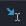 | `Run to Cursor`：运行到光标处，你可以将光标定位到你需要查看的那一行，然后使用这个功能，代码会运行至光标行，此时不需要设置断点。 |
|  |            `Evaluate Expression...`：计算表达式。            |

3. 观察变量。
   - 查看变量有三种方式：
     1. `Debugger`的`Variables`中查看变量；
     2. 鼠标悬停到变量上会弹出当前变量信息；
     3. 程序区查看变量。

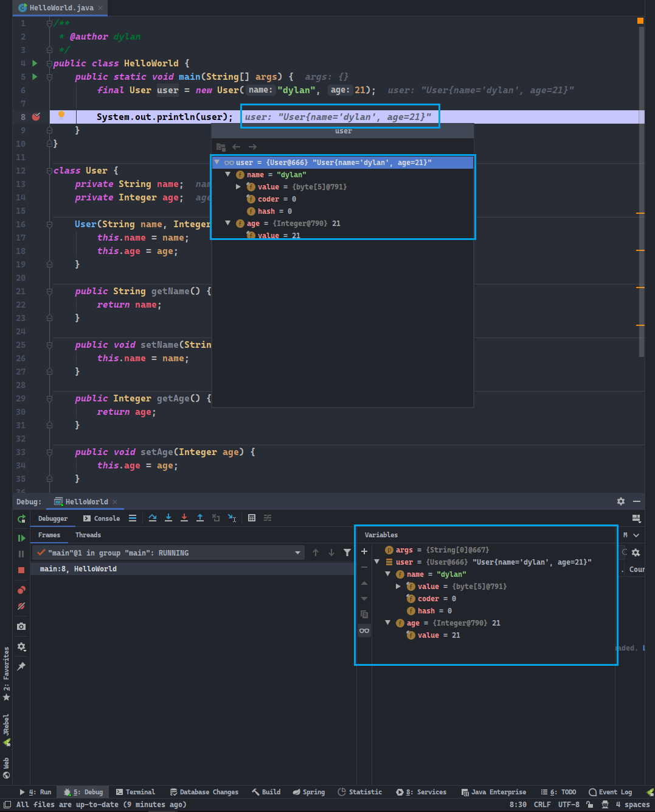

## 1. 跳转到当前代码执行的行

- `Show Excution Point`：跳转到当前代码执行的行，快捷键`Alt + F10`。

- 作用：使程序快速从其他窗口切换到当前调试程序所在行。

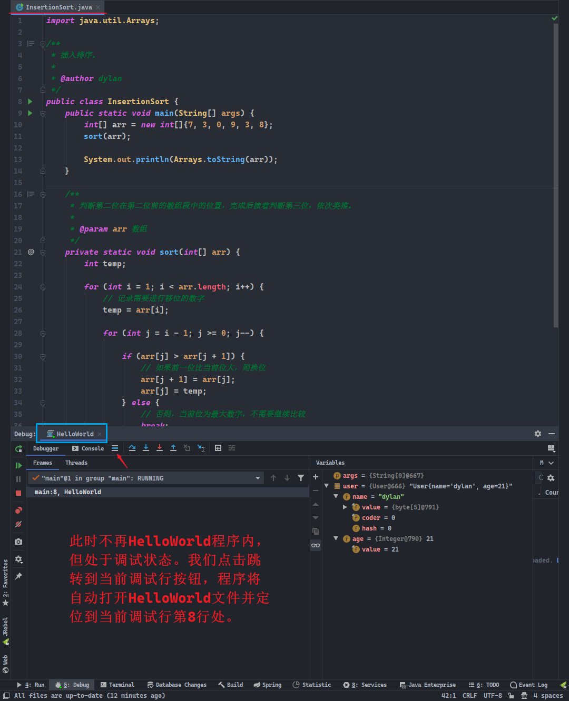

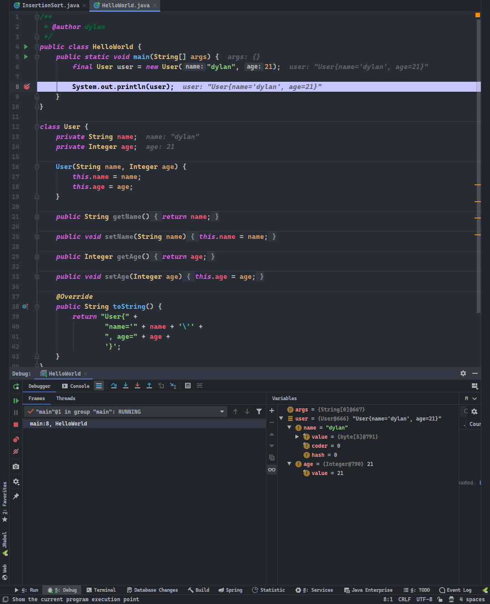

## 2. 步过调试

- `Step Over`：步过调试，快捷键`F8`。

- 作用：使代码一行一行地顺序执行，不会进入方法。

## 3. 步入调试

- `Step Into`：步入调试，快捷键`F7`。

- 作用：当前如果调试行使用`new`关键字进行自定义类或第三方类的对象创建，当使用这些对象引用的自定义方法时，步入调试会进入该方法中。但步入不会进入`JDK`的类或其对象引用调用的方法中。

## 4. 强制步入调试

- `Force Step Into`：强制步入调试，快捷键`Alt + Shift + F7`。

- 作用：和普通步入调试的区别是，强制步入调试会进入`JDK`的类或其对象引用调用的方法中。

## 5. 步出调试

- `Step Out`：步出调试，快捷键`Shift + F8`

- 作用：可以从类或方法中退出到当前调试行处。

## 6. 回退断点

- `Drop Frame`：回退断点，无快捷键。

- 作用：回退到对象创建或方法调用行。当你进入了方法体时，此时想查看方法实际接收的参数来自哪里，使用回退断点就可以回到上一步。

## 7. 运行到光标处

- `Run to Cursor`：运行到光标处，快捷键`Alt + F9`。

- 作用：使`Debugger`程序运行到光标处，等同于一个自由的断点。

## 8. 计算表达式

- `Evaluate Expression`：计算表达式，快捷键`Alt + F8`。

- 作用：使用计算表达式可以更改变量的值。

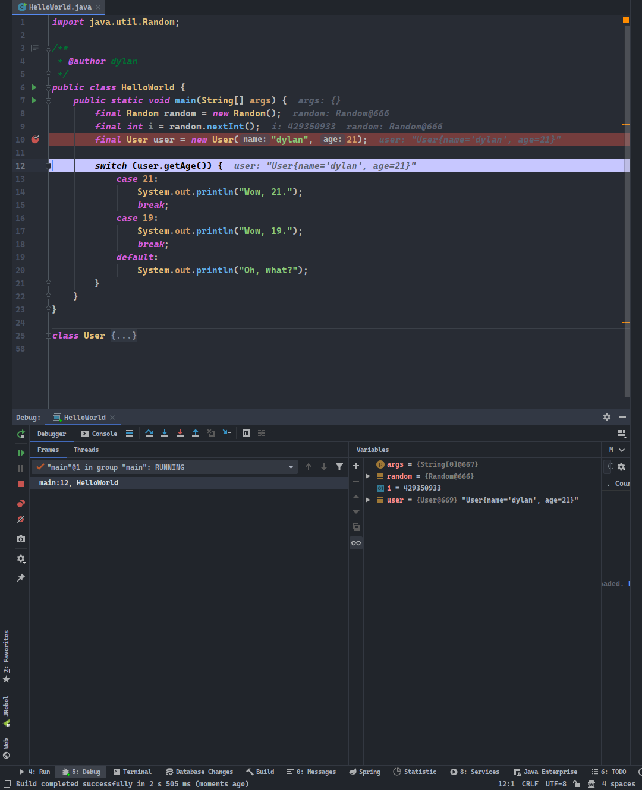

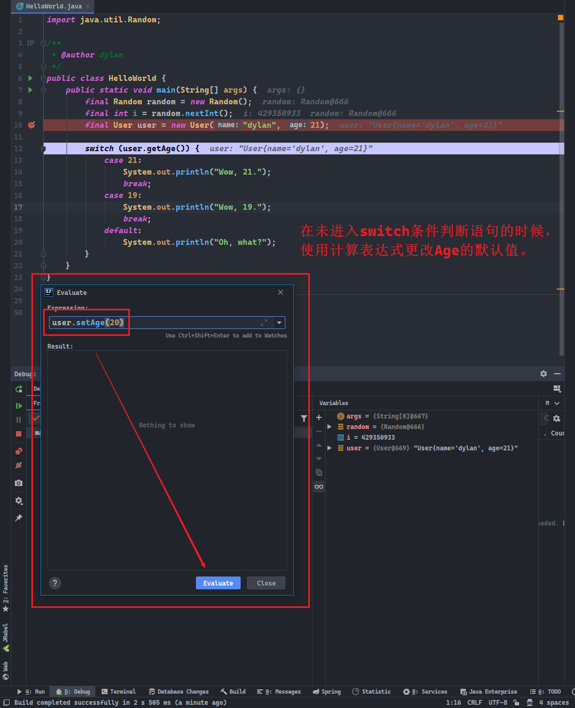

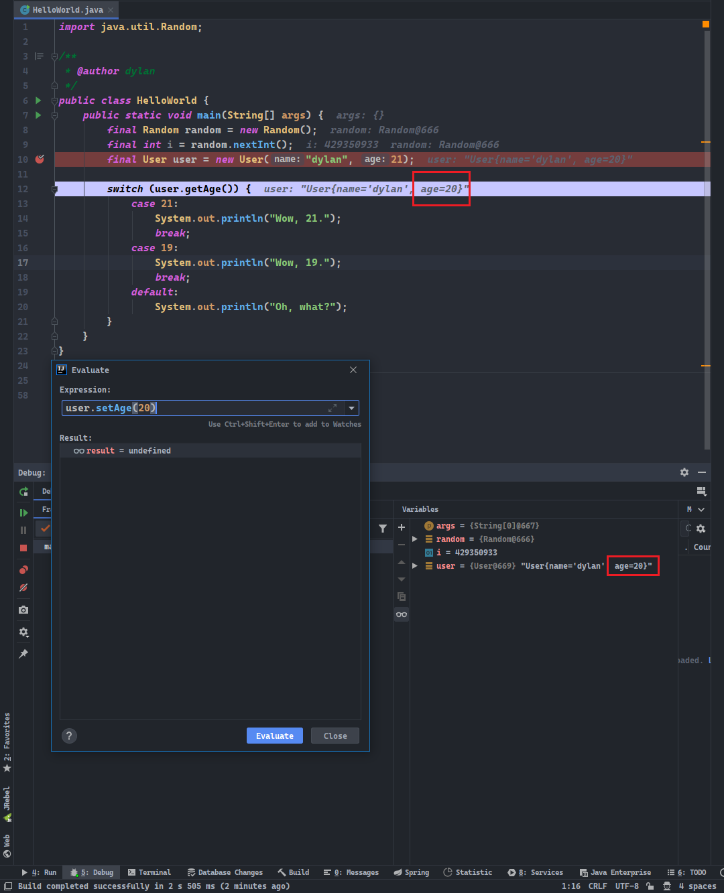

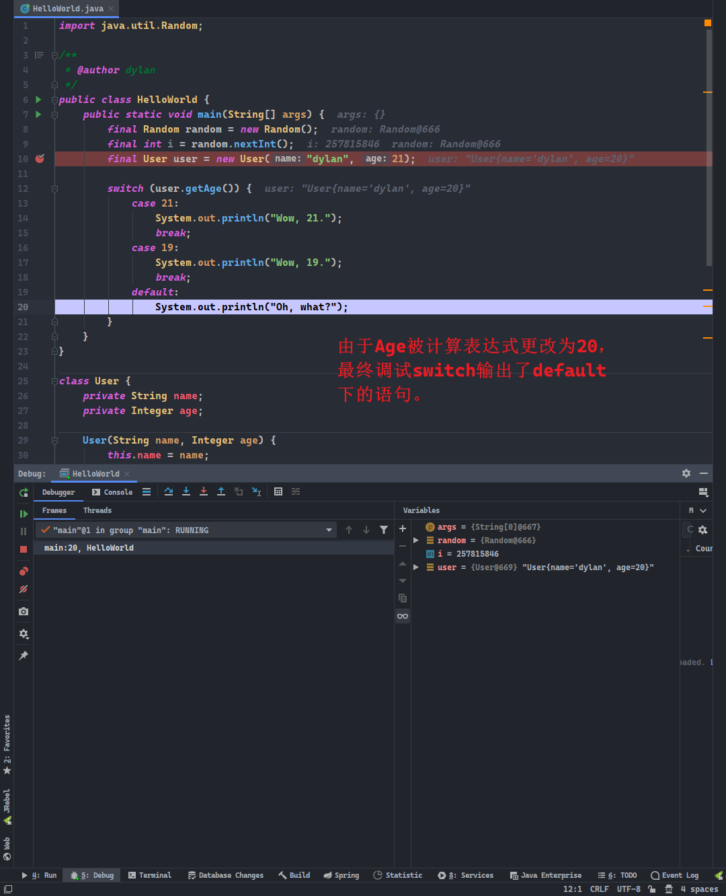

## 9. 条件断点

- 在遇到诸如循环多次时，你可能只需要查看中间某个条件的执行结果，这个时候可以使用条件断点。
- 程序将运行到符合条件时停下，意味着可以从设定点开始调试。

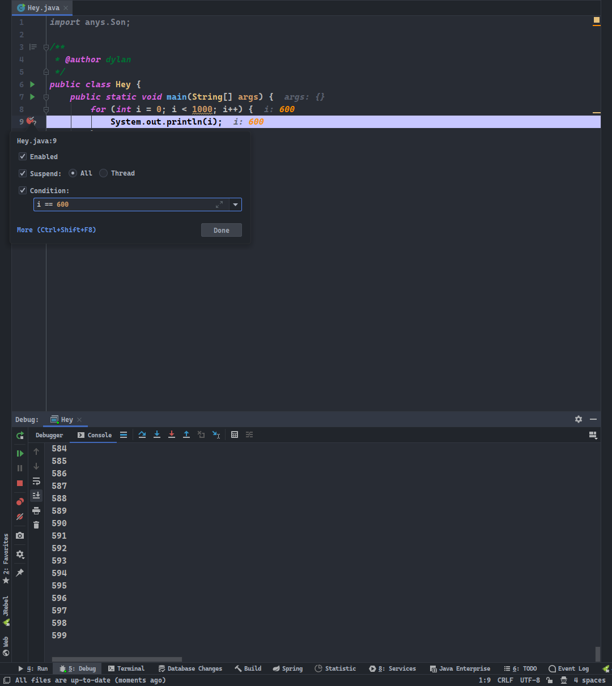

## 10. 多线程调试

- 多线程调试，需要调整断点挂起级别为`Thread`，然后在`Frames`中选择线程进行调试即可。

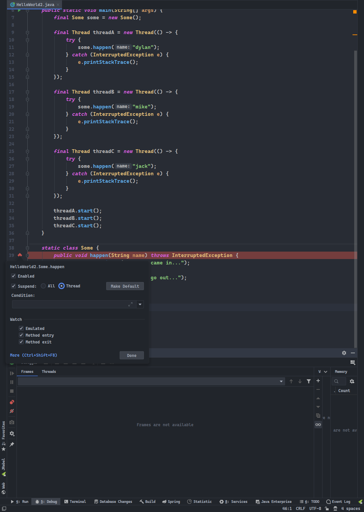

- 此时所在调试的线程是红色勾标记，而处于等待调试的线程则是红色圆点标记。

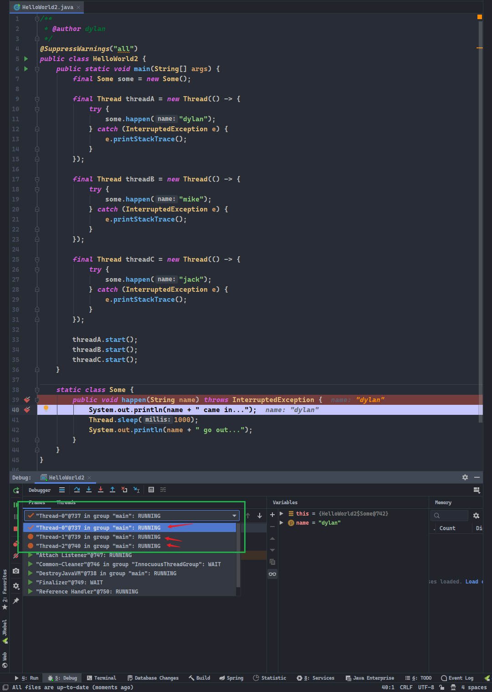

- 选择`Thread-0`并运行调试至`happen()`方法结束，则只有该线程会输出，其他的线程则仍会处于等待调试状态：

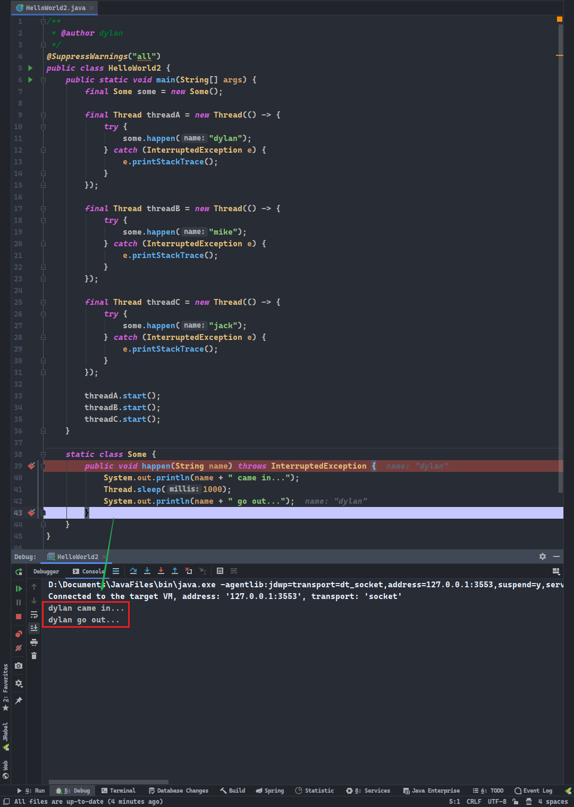

- 如果当前线程完全结束，则会自动切换到另一个线程的调试中：

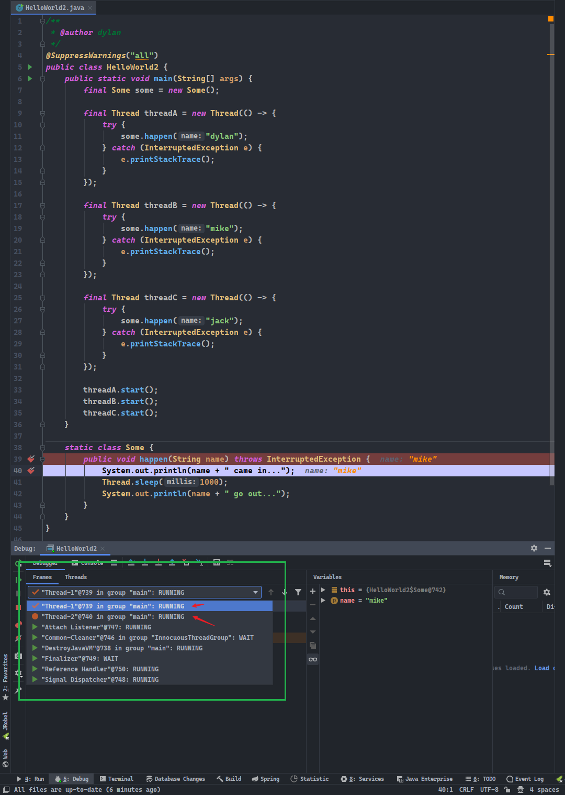