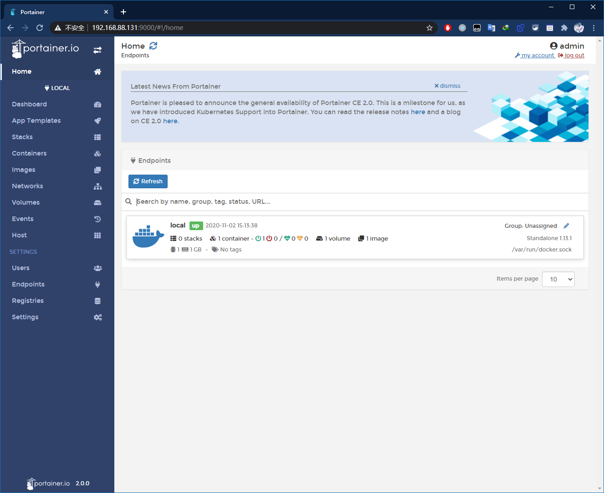
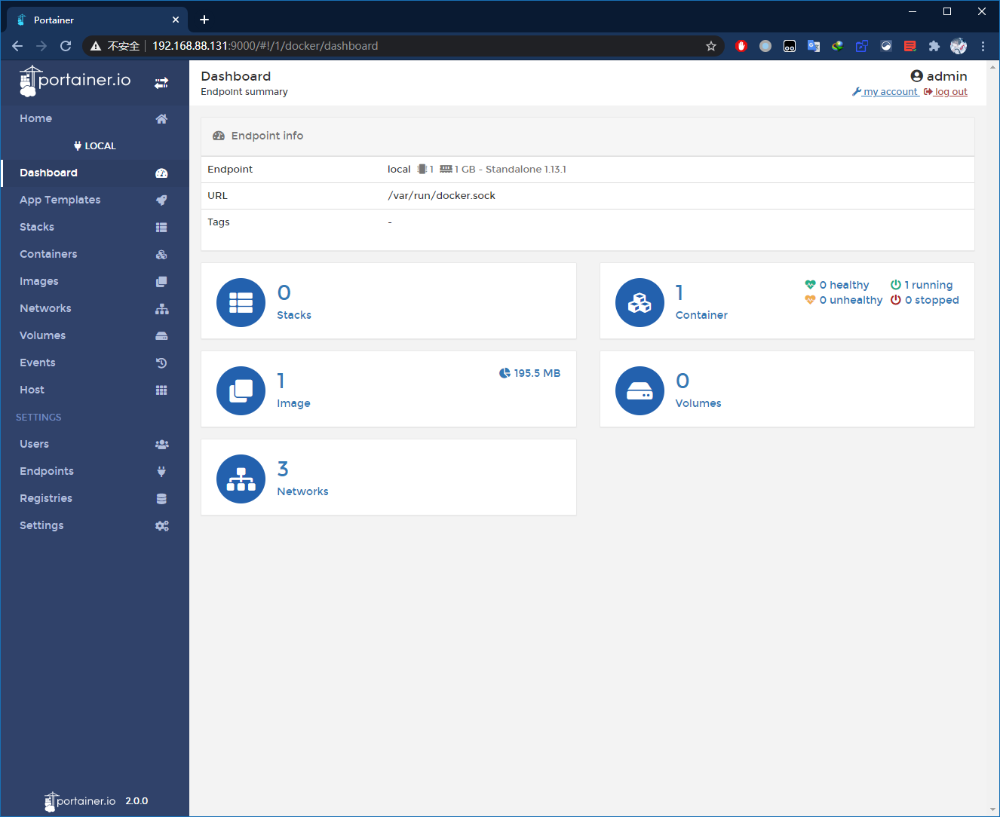

# 前言

> - 本篇会先列举如何在`CentOS7`中安装`docker`。

# docker的安装

- 使用`yum`命令可以很轻松地在`CentOS7`中安装`docker`。

```bash
# 可以先替换一下源，这样下载速度会快一些
wget -O /etc/yum.repos.d/CentOS-Base.repo http://mirrors.aliyun.com/repo/Centos-7.repo
# 生成仓库缓存
yum makecache
```

- 接下来安装`docker`：

```bash
yum install -y docker
```

- `docker`相关命令：

```bash
# 启用docker
systemctl start docker
# 重启docker
systemctl restart docker
systemctl enable docker
# 查看docker运行状态
systemctl status docker
# 查看docker版本
docker version
```

- 解决`docker pull`慢的问题，需要将`docker`的镜像源修改为国内的，使用阿里云：

```bash
vim /etc/docker/daemon.json

# 添加以下内容
{
  "registry-mirrors": ["https://9cpn8tt6.mirror.aliyuncs.com"]
}

# 重启docker服务
systemctl daemon-reload
systemctl restart docker
```

# docker注意事项

- 如果玩脱了可能出现以下错误信息：

```bash
Job for docker.service failed because the control process exited with error code. See "systemctl status docker.service" and "journalctl -xe" for details.
```

- 这种情况下无法重启`docker`，重启系统也无法解决，目前的解决方法是重新安装`docker`，使用以下命令卸载`docker`后，重新安装即可：

```bash
# 查询本机上安装的docker包
yum list installed | gerp docker
docker.x86_64,docker-client.x86_64,docker-common.x86_64 

# 逐一卸载docker服务
yum remove -y docker.x86_64
yum remove -y docker-client.x86_64
yum remove -y docker-common.x86_64

# 重新安装即可
yum install -y docker
```

# docker可视化管理工具

- `portainer-ce`是一个轻量级的管理`UI `，可让你轻松管理不同的`Docker`环境（`Docker`主机或`Swarm`群集）。它由可在任何`Docker`引擎上运行的单个容器组成，旨在使部署更简单 。
- 官方推荐的安装方式如下：

```bash
# 在/var/lib/docker/volume下创建portainer_data目录
docker volume create portainer_data
# 不需要事先拉取portianer-ce的镜像，容器创建过程中会自动拉取镜像
docker run -d -p 9000:9000 --name=portainer --restart=always -v /var/run/docker.sock:/var/run/docker.sock -v portainer_data:/data portainer/portainer-ce
```

- 查看关于`portainer_data`的信息，使用以下代码：

```bash
docker volume inspect portainer_data
```

- 浏览器键入访问地址，首次需要设置密码，之后可以访问到`docker`的可视化界面：



- 在左侧选项卡中的`Dashboard`可以查看`docker`中关于镜像、容器和卷的占用状态等，在`docker`程序莫名占满磁盘空间的时候，可以轻松地清除掉一些不常用的镜像、容器或卷：



# docker基本命令

- `docker`可以理解为虚拟机，`images`可以理解为虚拟机上的软件，`container`可以理解为正在运行的软件。
- 以下是一些`docker`中的常用命令`Commands`，每个命令后面都可以使用参数`--help`来查看该命令的详细帮助文档：

```bash
# 在dockerhub中寻找目标images镜像
docker search {IMAGE NAME}
# 从dockerhub/registry中获取目标image镜像
docker pull {IMAGE NAME}
# 列出所有的images镜像
docker images
# 开启一个新容器
docker run [OPTION] [...] [IMAGE NAME | ID]
# 让停止的container容器重新运行
docker start {CONTAINER NAME | ID}
# 让运行的container容器停止运行
docker stop {CONTAINER NAME | ID}
# 重启container容器
docker restart {CONTAINER NAME | ID}
# 列出所有运行中的containers容器，一般加上-a显示包括已停止容器
docker ps [-a]
# 杀死正在运行中的container容器
docker kill {CONTAINER NAME | ID}
# 移除某个container容器
docker rm {CONTAINER NAME | ID}
# 移除某个image镜像
docker rmi {IMAGE NAME | ID}
```

- 其中详细说明一下`docker run`中的部分参数，通过命令`docker run --help`可以查看详细的帮助文档：

```bash
docker run [OPTIONS] IMAGE [COMMAND] [ARG...]
# 让容器在后台运行，即background运行
-d
# 在容器结束的时候移除该容器，与-d参数一起使用无意义，它只能移除foreground的容器
# 但如果你有挂载的目录，使用这个命令，当容器被rm移除的时候，宿主机上的目录也会被
--rm
# 给你的容器命个名
--name {alias container name}
# 指定端口映射关系，冒号前是宿主机(也就是你的linux主机)的端口，冒号后是docker的端口
-p {host port}:{container port}
# 建立目录映射关系前，一般需要将目标镜像需要进行配置的文件夹container directory先拷贝到宿主机上
# 之后再使用以下选项，将拷贝下来并配置完毕的host directory挂载到目标容器中container directory中
# 此后每次需要对container进行配置，只需要修改host中的目录，修改完毕重启目标容器，配置即可同步并生效
-v {host directory}:{container directory}
```

- 使用以下命令可以进入`container`的`bash`模式中，浏览`container`中的文件：

```bash
# 显示正在运行的container容器
docker ps
# 显示所有的container容器
docker ps -a
# 显示容器内进程信息
docker top {container id | container name}
# 进入指定容器的bash交互模式中,CONTAINER ID可以简写
docker exec -it {container id | container name} bash
# 如果只想浏览某个容器中的某些文件夹中的文件，可以直接在container id之后写bash命令
# 例如，列出容器ID简写为16fc的容器中/etc/conf.d目录下的所有文件
docker exec -it {container id | container name} {bash command}
docker exec -it 16fc ls /etc/conf.d
```

- 显示容器的网络状态，可以使用`inspect`选项，该选项在查看目标容器的容器内`IP`时很有用：

```bash
docker inspect [OPTIONS] CONTAINER NAME|ID [CONTAINER NAME|ID...]

# 准确获取容器内的IP地址
docker inspect --format='{{.NetworkSettings.IPAddress}}' {CONTAINER_NAME | CONTAINER_ID}
```

- 如过不使用`inspect`选项查看容器内`IP`，需要首先进入容器`bash`，更新`apt`并安装`net-tools`，使用`ifconfig -a`命令查看容器内网络状况：

```bash
# 如果容器内未安装net-tools，需要先安装net-tools
docker exec -it CONTAINER NAME|ID bash
# 进入容器内bash
apt update
apt install -y net-tools
ifconfig -a
# 退出容器内bash
exit

# 如果容器内以安装net-tools，可以直接使用以下命令在宿主机bash上查询目标容器的网络状态
docker exec -it CONTAINER NAME|ID ifconfig -a
```

# docker网络

1. 同一个`docker`内的所有容器都相当于处在同一个局域网下，可以通过容器内`IP`地址及对应的容器内端口进行访问；
2. 同一个`docker`内的容器，无法通过同一个`docker`下的其他容器的宿主机`IP`地址及对应的宿主机映射端口访问到其中提供的服务，是一个`bug`，可以通过开放宿主机映射端口的防火墙权限解决：

```shell
# 查看防火墙所有(永久/临时)开放的端口
firewall-cmd --zone=public --list-ports
# 永久开放xxxx端口
firewall-cmd --zone=public --add-port=xxxx/tcp --permanent
# 使开放/关闭端口操作立即生效
firewall-cmd --reload
```

3. 来自于宿主机局域网中的其他`docker`容器的连接，可以直接通过宿主机`IP`地址及其对应的宿主机映射端口访问到容器中提供的服务，毋需开启宿主机映射端口的防火墙权限。