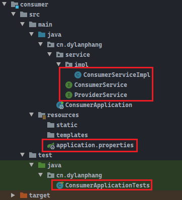
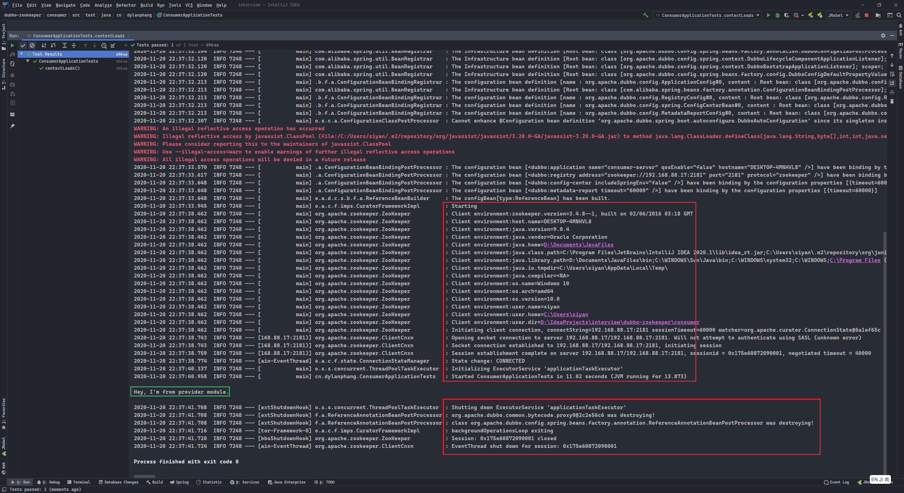

# 前言

> - 本篇将了解`Dubbo`和`ZooKeeper`。

# 什么是分布式系统？

- 在《分布式系统原理与范型》一书中有如下定义：**分布式系统是若干独立计算机的集合，这些计算机对于普通用户来说就像单个相关系统**。

- 分布式系统是由一组通过网络进行通信、为了完成共同的任务而协调工作的计算机节点组成的系统。分布式系统的出现是为了使用廉价的、普通的机器完成单个计算机无法完成的计算、存储任务。
- 其最终目的是利用更多的机器，处理更多的数据。

# 什么时候需要使用分布式系统？

- 分布式系统`distributed system`是建立在网络之上的软件系统。
- 需要明确的是，只有当单个节点的处理能力无法满足日益增长的计算、存储任务的时候，且硬件的提升（加内存、加磁盘、使用更好的`CPU`）需要花费十分高昂的代价，同时应用程序也无法通过内部进一步优化的时候，我们才需要考虑分布式系统。
- 因为本身分布式系统具有一定的复杂性，如果不需要项目不需要使用到分布式系统，就不要浪费多余的资源在一开始的时候去考虑使用分布式的结构了。

# Dubbo

- `Dubbo`是阿里巴巴公司开源的一个高性能优秀的服务框架，使得应用可以通过高性能的`RPC`实现服务的输出和输入功能，可以和`Spring`框架无缝集成。
- `Dubbo`是一款高性能、轻量级的开源`Java RPC`框架，它提供了三大核心功能：面向接口的远程方法调用，智能容错和负载均衡，以及服务自动注册和发现。
- 以下是官网摘录的部分系统架构演变介绍，具体文档可以访问以下链接：
  - http://dubbo.apache.org/zh/docs/v2.7/

## 1. 背景

> 随着互联网的发展，网站应用的规模不断扩大，常规的垂直应用架构已无法应对，分布式服务架构以及流动计算架构势在必行，亟需一个治理系统确保架构有条不紊的演进。
>
> 
>
> **单一应用架构（Monolithic Architecture）**
>
> 当网站流量很小时，只需一个应用，将所有功能都部署在一起，以减少部署节点和成本。此时，用于简化增删改查工作量的数据访问框架(ORM)是关键。
>
> **垂直应用架构（Vertical Architecture）**
>
> 当访问量逐渐增大，单一应用增加机器带来的加速度越来越小，提升效率的方法之一是将应用拆成互不相干的几个应用，以提升效率。此时，用于加速前端页面开发的Web框架(MVC)是关键。
>
> **分布式服务架构（Vertical Architecture）**
>
> 当垂直应用越来越多，应用之间交互不可避免，将核心业务抽取出来，作为独立的服务，逐渐形成稳定的服务中心，使前端应用能更快速的响应多变的市场需求。此时，用于提高业务复用及整合的分布式服务框架(RPC)是关键。
>
> **流动计算架构（Distrubuted Service Architecture）**
>
> 当服务越来越多，容量的评估，小服务资源的浪费等问题逐渐显现，此时需增加一个调度中心基于访问压力实时管理集群容量，提高集群利用率。此时，用于提高机器利用率的资源调度和治理中心(SOA)是关键。

## 2. 需求

- 任何复杂的应用或框架都是诞生在某种需求上的，`Dubbo`也不例外。

> 
>
> 在大规模服务化之前，应用可能只是通过 RMI 或 Hessian 等工具，简单的暴露和引用远程服务，通过配置服务的URL地址进行调用，通过 F5 等硬件进行负载均衡。
>
> **当服务越来越多时，服务 URL 配置管理变得非常困难，F5 硬件负载均衡器的单点压力也越来越大。** 此时需要一个服务注册中心，动态地注册和发现服务，使服务的位置透明。并通过在消费方获取服务提供方地址列表，实现软负载均衡和 Failover，降低对 F5 硬件负载均衡器的依赖，也能减少部分成本。
>
> **当进一步发展，服务间依赖关系变得错踪复杂，甚至分不清哪个应用要在哪个应用之前启动，架构师都不能完整的描述应用的架构关系。** 这时，需要自动画出应用间的依赖关系图，以帮助架构师理清关系。
>
> **接着，服务的调用量越来越大，服务的容量问题就暴露出来，这个服务需要多少机器支撑？什么时候该加机器？** 为了解决这些问题，第一步，要将服务现在每天的调用量，响应时间，都统计出来，作为容量规划的参考指标。其次，要可以动态调整权重，在线上，将某台机器的权重一直加大，并在加大的过程中记录响应时间的变化，直到响应时间到达阈值，记录此时的访问量，再以此访问量乘以机器数反推总容量。
>
> 以上是 Dubbo 最基本的几个需求。

## 3. 架构

>Dubbo 架构：
>
>
>
>|    节点     |                角色说明                |
>| :---------: | :------------------------------------: |
>| `Provider`  |          暴露服务的服务提供方          |
>| `Consumer`  |        调用远程服务的服务消费方        |
>| `Registry`  |        服务注册与发现的注册中心        |
>|  `Monitor`  | 统计服务的调用次数和调用时间的监控中心 |
>| `Container` |              服务运行容器              |
>
>调用关系说明
>
>1. 服务容器负责启动，加载，运行服务提供者。
>2. 服务提供者在启动时，向注册中心注册自己提供的服务。
>3. 服务消费者在启动时，向注册中心订阅自己所需的服务。
>4. 注册中心返回服务提供者地址列表给消费者，如果有变更，注册中心将基于长连接推送变更数据给消费者。
>5. 服务消费者，从提供者地址列表中，基于软负载均衡算法，选一台提供者进行调用，如果调用失败，再选另一台调用。
>6. 服务消费者和提供者，在内存中累计调用次数和调用时间，定时每分钟发送一次统计数据到监控中心。
>
>**Dubbo 架构具有以下几个特点，分别是连通性、健壮性、伸缩性、以及向未来架构的升级性。**
>
>**连通性**
>
>- 注册中心负责服务地址的注册与查找，相当于目录服务，服务提供者和消费者只在启动时与注册中心交互，注册中心不转发请求，压力较小；
>- 监控中心负责统计各服务调用次数，调用时间等，统计先在内存汇总后，每分钟一次发送到监控中心服务器，并以报表展示；
>- 服务提供者向注册中心注册其提供的服务，并汇报调用时间到监控中心，此时间不包括网络开销；
>- 服务消费者向注册中心获取服务提供者地址列表，并根据负载算法，直接调用提供者，同时汇报调用时间到监控中心，此时间包含网络开销；
>- 注册中心，服务提供者，服务消费者三者之间均为长连接，监控中心除外；
>- 注册中心通过长连接感知提供者的存在，服务提供者宕机，注册中心将立即推送事件通知消费者；
>- 注册中心和监控中心全部宕机，不影响已运行的提供者和消费者，消费者在本地缓存了提供者列表；
>- 注册中心和监控中心都是可选的，服务消费者可以直连服务提供者。
>
>**健壮性**
>
>- 监控中心宕掉不影响使用，只是丢失部分采样数据；
>- 数据库宕掉后，注册中心仍能够通过缓存提供服务列表查询，但不能注册新服务；
>- 注册中心对等集群，任意一台宕掉后，将自动切换到另一台；
>- 注册中心全部宕掉后，服务提供者和服务消费者仍能通过本地缓存通讯；
>- 服务提供者无状态，任意一台宕掉后，不影响使用；
>- 服务提供者全部宕掉后，服务消费者应用将无法使用，并无限次重连等待服务提供者恢复。
>
>**伸缩性**
>
>- 注册中心为对等集群，可动态增加机器部署示例，所有客户端将自动发现新的注册中心；
>- 服务提供者无状态，可动态增加机器部署实例，注册中心将推送新的服务提供者信息给消费者。
>
>**升级性**
>
>- 当服务集群规模进一步扩大，带动 IT 治理结构进一步升级，需要实现动态部署，进行流动计算，现有分布式服务架构不会带来阻力。下图是未来可能第一种架构：
>
>
>
>- 节点角色说明：
>
>|     节点     |                角色说明                |
>| :----------: | :------------------------------------: |
>|  `Deployer`  |         自动部署服务的本地代理         |
>| `Repository` |       仓库用于存储服务应用发布包       |
>| `Scheduler`  | 调度中心基于访问压力自动增减服务提供者 |
>|   `Admin`    |             统一管理控制台             |
>|  `Registry`  |        服务注册与发现的注册中心        |
>|  `Monitor`   | 统计服务的调用次数和调用时间的监控中心 |

## 4. 用法

> **本地服务Spring配置**
>
> - local.xml：
>
> ```xml
> <bean id=“xxxService” class=“com.xxx.XxxServiceImpl” />
> <bean id=“xxxAction” class=“com.xxx.XxxAction”>
>     <property name=“xxxService” ref=“xxxService” />
> </bean>
> ```
>
> **远程服务Spring配置**
>
> 在本地服务的基础上，只需要做简单的配置，即可完成远程化：
>
> - 将上面的`local.xml` 配置拆分成两份，将服务定义部分放在服务提供方`remote-provider.xml`，将服务引用部分放在服务消费方`remote-consumer.xml`。
> - 并在提供方增加暴露服务配置`<dubbo:service>`，在消费方增加引用服务配置`<dubbo:reference>`。
>
> - remote-provider.xml：
>
> ```xml
> <!-- 和本地服务一样实现远程服务 -->
> <bean id=“xxxService” class=“com.xxx.XxxServiceImpl” /> 
> <!-- 增加暴露远程服务配置 -->
> <dubbo:service interface=“com.xxx.XxxService” ref=“xxxService” />
> ```
>
> - remote-consumer.xml：
>
> ```xml
> <!-- 增加引用远程服务配置 -->
> <dubbo:reference id=“xxxService” interface=“com.xxx.XxxService” />
> <!-- 和本地服务一样使用远程服务 -->
> <bean id=“xxxAction” class=“com.xxx.XxxAction”> 
>     <property name=“xxxService” ref=“xxxService” />
> </bean>
> ```

# SpringBoot整合Dubbo、ZooKeeper

- 以上的`xml`配置不再过多介绍，以下使用`SpringBoot`整合`Dubbo`及`ZooKeeper`。

## 1. 在虚拟机上安装并运行ZooKeeper

- 首先需要获取`ZooKeeper`的安装包，`ZooKeeper`是解压即用的，入门只需要进行少量的配置即可。
- 获取`ZooKeeper`的访问链接：http://archive.apache.org/dist/zookeeper/zookeeper-3.4.9/zookeeper-3.4.9.tar.gz
- 可以使用`wget`工具，也可以使用`xftp`进行传输。
- 版本说明，使用太高版本的`ZooKeeper`可能会出现启动失败的情况。本示例采用`3.4.9`版本。下载完毕后解压：

```shell
tar zxvf zookeeper-3.4.9.tar.gz
```


- 进入目录`/zookeeper-3.4.9/conf/`中，复制文件`zoo_sample.cfg`为新的配置文件`zoo.cfg`。`ZooKeeper`的启动依赖于配置文件`zoo.cfg`，名字必须为`zoo.cfg`。其中使用默认配置即可，默认运行端口为`2181`。
- 进入目录`/zookeeper-3.4.9/bin/`中，运行以下命令启动`ZooKeeper`：

```bash
./zkServer.sh start
```


- 需要停止`ZooKeeper`，可以运行以下命令：

```bash
./zkServer.sh stop
```


## 2. 创建SpringBoot项目并引入依赖

- 创建一个普通的`Maven`项目，并在其中创建`provider`和`consumer`两个`SpringBoot`项目模块。


- 其中`provider`模块和`consumer`模块的`pom.xml`文件如下：
  - 依赖`zookeeper`中必须要排除`slf4j-log4j12`，否则会出现异常；
  - 其中版本最好不要更改，否则可能会出现不稳定的现象，如果有异常，在确保配置无误的情况下，请自行降级。

```xml
<?xml version="1.0" encoding="UTF-8"?>
<project xmlns="http://maven.apache.org/POM/4.0.0" xmlns:xsi="http://www.w3.org/2001/XMLSchema-instance"
         xsi:schemaLocation="http://maven.apache.org/POM/4.0.0 https://maven.apache.org/xsd/maven-4.0.0.xsd">
    <modelVersion>4.0.0</modelVersion>
    <parent>
        <groupId>org.springframework.boot</groupId>
        <artifactId>spring-boot-starter-parent</artifactId>
        <version>2.4.0</version>
        <relativePath/> <!-- lookup parent from repository -->
    </parent>
    <groupId>cn.dylanphang</groupId>
    <artifactId>consumer</artifactId>
    <version>0.0.1-SNAPSHOT</version>
    <name>consumer</name>
    <description>Demo project for Spring Boot</description>

    <properties>
        <java.version>1.8</java.version>
    </properties>

    <dependencies>
        <!-- https://mvnrepository.com/artifact/org.apache.dubbo/dubbo-spring-boot-starter -->
        <dependency>
            <groupId>org.apache.dubbo</groupId>
            <artifactId>dubbo-spring-boot-starter</artifactId>
            <version>2.7.8</version>
        </dependency>

        <!-- https://mvnrepository.com/artifact/com.github.sgroschupf/zkclient -->
        <dependency>
            <groupId>com.github.sgroschupf</groupId>
            <artifactId>zkclient</artifactId>
            <version>0.1</version>
        </dependency>
        <!-- https://mvnrepository.com/artifact/org.apache.curator/curator-framework -->
        <dependency>
            <groupId>org.apache.curator</groupId>
            <artifactId>curator-framework</artifactId>
            <version>2.12.0</version>
        </dependency>

        <!-- https://mvnrepository.com/artifact/org.apache.curator/curator-recipes -->
        <dependency>
            <groupId>org.apache.curator</groupId>
            <artifactId>curator-recipes</artifactId>
            <version>2.12.0</version>
        </dependency>

        <!-- https://mvnrepository.com/artifact/org.apache.zookeeper/zookeeper -->
        <dependency>
            <groupId>org.apache.zookeeper</groupId>
            <artifactId>zookeeper</artifactId>
            <version>3.4.8</version>
            <exclusions>
                <exclusion>
                    <groupId>org.slf4j</groupId>
                    <artifactId>slf4j-log4j12</artifactId>
                </exclusion>
            </exclusions>
        </dependency>

        <!-- 以上为Dubbo、ZooKeeper需要的依赖 -->
        
		<!-- 以下为Spring Web项目自带的依赖 -->
        <dependency>
            <groupId>org.springframework.boot</groupId>
            <artifactId>spring-boot-starter-web</artifactId>
        </dependency>

        <dependency>
            <groupId>org.springframework.boot</groupId>
            <artifactId>spring-boot-starter-test</artifactId>
            <scope>test</scope>
        </dependency>
        <dependency>
            <groupId>org.junit.jupiter</groupId>
            <artifactId>junit-jupiter</artifactId>
            <version>RELEASE</version>
            <scope>test</scope>
        </dependency>
    </dependencies>

    <build>
        <plugins>
            <plugin>
                <groupId>org.springframework.boot</groupId>
                <artifactId>spring-boot-maven-plugin</artifactId>
            </plugin>
        </plugins>
    </build>

</project>
```

- `provider`模块中的结构图如下：


- 其中红色框所示的是需要编写的文件，不再展示`ProviderService`接口代码了，其中`ProviderServiceImpl`代码如下：
  - `@DubboService`为`Dubbo`中的注解，用于自动发现并注册服务到服务注册中心，在这里指的是`ZooKeeper`。

```java
package cn.dylanphang.service.impl;

import cn.dylanphang.service.ProviderService;
import org.apache.dubbo.config.annotation.DubboService;
import org.springframework.stereotype.Component;

/**
 * @author dylan
 */
@DubboService
@Component("providerService")
public class ProviderServiceImpl implements ProviderService {

    @Override
    public String getSome() {
        return "Hey, I'm from provider module.";
    }
}
```

- 配置文件`application.properties`如下：
  - `application.name`：应用名称，注册中心将使用此名字作为服务提供者的名字；
  - `registry.address`：注册中心的地址，也就是`ZooKeeper`的部署地址；
  - `scan.base-packages`：需要指定`Dubbo`扫描的包，会扫描`@DubboService`的类并注册该服务。

```properties
server.port=8001

dubbo.application.name=provider-server
dubbo.registry.address=zookeeper://192.168.88.17:2181
dubbo.scan.base-packages=cn.dylanphang.service

# 以下两条需要设置，否则会连接不上ZooKeeper，原因暂时未知
dubbo.metadata-report.timeout=60000
dubbo.config-center.timeout=60000
```

- `consumer`模块中的结构图如下：



- 其中接口`ProviderService`必须要和服务提供者位于同一个包且同名、内容一致。
- 不再展示`ConsumerService`代码，其中`ConsumerServiceImpl`的代码如下：
  - `@DubboReference`：会根据`application.properties`中所配置的服务注册中心地址，自动寻找并发现符合的服务注入。

```java
package cn.dylanphang.service.impl;

import cn.dylanphang.service.ConsumerService;
import cn.dylanphang.service.ProviderService;
import org.apache.dubbo.config.annotation.DubboReference;
import org.springframework.stereotype.Service;

/**
 * @author dylan
 */
@Service("consumerService")
public class ConsumerServiceImpl implements ConsumerService {

    @DubboReference
    private ProviderService providerService;

    @Override
    public void willConsume() {
        final String str = this.providerService.getSome();
        System.out.println(str);
    }
}
```

- 配置文件`application.properties`如下：

```properties
server.port=8002

dubbo.application.name=consumer-server
dubbo.registry.address=zookeeper://192.168.88.17:2181

# 以下两条需要设置，否则会连接不上ZooKeeper，原因暂时未知
dubbo.metadata-report.timeout=60000
dubbo.config-center.timeout=60000
```

- 测试类代码`ConsumerApplicationTests`代码如下：

```java
package cn.dylanphang;

import cn.dylanphang.service.ConsumerService;
import org.junit.jupiter.api.Test;
import org.springframework.beans.factory.annotation.Autowired;
import org.springframework.boot.test.context.SpringBootTest;

@SpringBootTest
class ConsumerApplicationTests {

    @Autowired
    private ConsumerService consumerService;

    @Test
    void contextLoads() {
        this.consumerService.willConsume();
    }
}
```

## 3. 测试Provider、Consumer服务类

- 启动`provider`模块：


- 模块`provider`已经成功启动，并且连接到了注册中心`ZooKeeper`。
- 运行`consumer`测试类：



- 同样`consumer`需要连接到注册中心`ZooKeeper`，之后获取已经注册的服务，并成功运行。

# 小节

- 这是关于`Dubbo`的入门知识。而对于`ZooKeeper`来说，它有更多的用处。