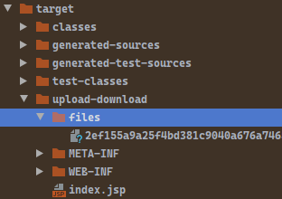

# 前言

- 本篇讲述`EasyPOI`的最基本使用，即导出和导入`Excel`文档。

# 关于概念

- 关于`EasyPOI`的概念不再累赘，我们需要知道的所有东西就是，它可以帮助我们把集合对象`pojo`转换为表格`Excel`。
- 本章采用的是客户端上传和下载`Excel`文档作为范例，这也是最为频繁的使用场景或需求。

# 主要步骤

- 数据库表结构与`Excel`表结构是一致的，对于导入的情况，`EasyPOI`所需要做的事情就读取表格，将表格转为`pojo`的集合类对象，之后调用`Service`层中的方法写入数据库即可。
- 对于导出的情况，则是先从`Service`层中读取数据，之后通过`EasyPOI`写出到文件即可。
- 相对于导出操作而言，导入操作的要求实际上会更为严苛，其中涉及到数据合法性问题。
- 务必使用`JSR-303`或其实现`Hibernate Validator`中的注解，来校验导入数据的合法性。否则写入数据库的数据可能会出现各种问题，本文不会对校验数据合法性进行测试。

# 核心代码

- 其中的核心代码是`Controller`中的上传写入数据库，以及下载从数据库取出数据转换为`Excel`。
- 我们将分两部分快速讲解。

```java
package cn.dylanphang.controller;

import cn.afterturn.easypoi.excel.ExcelExportUtil;
import cn.afterturn.easypoi.excel.ExcelImportUtil;
import cn.afterturn.easypoi.excel.entity.ExportParams;
import cn.afterturn.easypoi.excel.entity.ImportParams;
import cn.dylanphang.pojo.Student;
import cn.dylanphang.service.StudentService;
import cn.dylanphang.util.ReturnClassUtils;
import org.apache.poi.ss.usermodel.Workbook;
import org.springframework.beans.factory.annotation.Autowired;
import org.springframework.http.HttpHeaders;
import org.springframework.http.HttpStatus;
import org.springframework.http.ResponseEntity;
import org.springframework.stereotype.Controller;
import org.springframework.ui.ModelMap;
import org.springframework.web.bind.annotation.RequestMapping;
import org.springframework.web.bind.annotation.SessionAttributes;
import org.springframework.web.multipart.MultipartFile;
import org.springframework.web.servlet.ModelAndView;

import javax.servlet.http.HttpServletRequest;
import java.io.File;
import java.io.FileInputStream;
import java.io.FileOutputStream;
import java.io.IOException;
import java.util.Collection;
import java.util.List;
import java.util.UUID;

/**
 * @author dylan
 */
@Controller
@RequestMapping("/file")
@SessionAttributes("lastRetrieve")
public class StudentController {

    private final StudentService studentService;

    @Autowired
    public StudentController(StudentService studentService) {
        this.studentService = studentService;
    }

    @RequestMapping("/upload")
    public String upload(MultipartFile upload) throws Exception {
        // 1.解析文档需要用到ImportParams对象
        final ImportParams importParams = new ImportParams();
        importParams.setHeadRows(1);

        // 2.使用ExcelImportUtil工具类获取Excel表格中的内容，并转为List<T>，实际情况下我们需要知道上传的表格是什么类型的
        // *.因为所有的pojo都是按照用户需求创建的，拥有模板，上传的数据必须符合这些模板
        // *.那么实际开发中，可以通过访问的url判断本次上传的文件是属于什么类型的pojo
        final List<Student> students = ExcelImportUtil.importExcel(
                upload.getInputStream(),
                Student.class,
                importParams
        );

        // 3.写入数据库，其中如果数据格式不符合，在上一步转换的时候会报错
        this.studentService.saveAll(students);

        return "upload-success";
    }

    @SuppressWarnings("all")
    @RequestMapping("/download")
    public ResponseEntity<byte[]> download(ModelMap modelMap, HttpServletRequest request) throws IOException {
        // 1.获取用户的最后一次筛选查询的结果集
        final Object lastRetrieve = modelMap.getAttribute("lastRetrieve");

        // *.判断是否存在最后一次查询
        if (lastRetrieve != null && lastRetrieve instanceof List) {

            // 2.pojo是根据用户需求去创建的，使用自定义工具类返回集合中字节码的文件信息
            final Collection<?> retrieve = (Collection<? extends Object>) lastRetrieve;
            final Class<?> targetClass = ReturnClassUtils.getReturnClass(retrieve);

            // 3.获取存储文件的目录路径
            String path = request.getSession().getServletContext().getRealPath("/files");

            // 4.根据路径创建file对象
            File file = new File(path);

            // 5.如果当前路径下不存在/files目录，则创建一个/files目录
            if (!file.exists()) {
                final boolean mkdir = file.mkdir();
                if (!mkdir) {
                    throw new RuntimeException("Create new folder failure.");
                }
            }

            // 6.easypoi部分，获取Workbook对象，创建UUID别名并写入硬盘
            final Workbook sheets = ExcelExportUtil.exportExcel(new ExportParams(), targetClass, retrieve);
            final String name = UUID.randomUUID().toString().replaceAll("-", "") + ".xls";
            final FileOutputStream fs = new FileOutputStream(new File(file, name));
            sheets.write(fs);
            fs.close();

            // 7.获取该.xls文件，并获得它的输入流
            file = new File(path + "/" + name);
            final FileInputStream is = new FileInputStream(file);

            // 8.使用输入流创建指定大小的byte[]数组，并将字节码存入byte[]数组中
            byte[] body = new byte[is.available()];
            is.read(body);
            is.close();

            // 9.需要指定相应体中指定头的值是attchement
            final HttpHeaders httpHeaders = new HttpHeaders();
            httpHeaders.add("Content-Disposition", "attchement;filename=" + file.getName());

            // 10.最后使用ResponseEntity封装字节码、响应体即状态码信息，并返回此对象引用
            return new ResponseEntity<>(body, httpHeaders, HttpStatus.OK);
        } else {
            return null;
        }
    }

    @RequestMapping("/query")
    public ModelAndView hello() {
        final ModelAndView mv = new ModelAndView("test");
        final List<Student> students = this.studentService.findAll();

        // *.将用户的最后一次筛选查询存入当前用户的session域中
        mv.addObject("lastRetrieve", students);

        return mv;
    }
}
```

- 对应的`pojo`需要添加注解`@Excel`，将作为表格的字段名：

```java
package cn.dylanphang.pojo;

import cn.afterturn.easypoi.excel.annotation.Excel;
import lombok.Data;

import java.text.SimpleDateFormat;
import java.util.Date;

/**
 * @author dylan
 */
@Data
public class Student {
    @Excel(name = "id")
    private Integer id;

    @Excel(name = "name")
    private String name;

    @Excel(name = "age")
    private Integer age;

    @Excel(name = "birthday", format = "yyyy-MM-dd")
    private Date birthday;

    public String getDisplayDate() {
        final SimpleDateFormat simpleDateFormat = new SimpleDateFormat("yyyy-MM-dd");
        return simpleDateFormat.format(this.birthday);
    }
}
```

# 上传文件

- 上传文件会比较通俗简单，甚至比`Spring MVC`原生上传文件还要简单，因为我们不需要将获取到的字节码文件存储在本地，而是直接可用`Excel`的字节码文件作为转换工具的参数，将`Excel`表格变成一个`List<T>`集合。
- 以下是上次文件的`@RequestMapping`方法：

```java
@RequestMapping("/upload")
public String upload(MultipartFile upload) throws Exception {
    // 1.解析文档需要用到ImportParams对象
    final ImportParams importParams = new ImportParams();
    importParams.setHeadRows(1);

    // 2.使用ExcelImportUtil工具类获取Excel表格中的内容，并转为List<T>，实际情况下我们需要知道上传的表格是什么类型的
    // *.因为所有的pojo都是按照用户需求创建的，拥有模板，上传的数据必须符合这些模板
    // *.那么实际开发中，可以通过访问的url判断本次上传的文件是属于什么类型的pojo
    final List<Student> students = ExcelImportUtil.importExcel(
        upload.getInputStream(),
        Student.class,
        importParams
    );

    // 3.写入数据库，其中如果数据格式不符合，在上一步转换的时候会报错
    this.studentService.saveAll(students);

    return "upload-success";
}
```

- 使用`EasyPOI`中的两个对象即可完成将`Excel`文档转换为`List<T>`集合的过程。而通常情况下，`List<T>`也经常作为`Mapper`方法中的参数，因此可以无缝衔接数据库写入。
- 其中最重要的是`ExcelImportUtil`工具类，它接收三个参数：
  1. `InputStream`：直接通过`MultipartFile`对象获取；
  2. `Class<T>`：根据实际上传表格对应的`pojo`类进行输入，可以在前端隐式入参该表格的类名；
  3. `ImportParams`：自行创建并设置，一般表格模板是固定的，那么也就是说`ImportParams`也是固定的。
- 过多的关于上传文件的代码不再赘述，下面讲一下我认为的可能遇到的设计难点和解决思路：
- 关于当前上传表格的类型识别，你几乎无法得知当前上传的表格是属于哪一个`pojo`类的，只有在`ExcelImportUtil`报错的时候，你才会发现传入的`Class<T>`有问题：
  1. 因此实际开发中，你必须有效地识别用户上传的文件归属于哪一个`pojo`，其中一个方法是通过`url`识别，用户上传文件的链接通过设置不同的`url`，可以定向访问指定的`@RequestMapping`方法；
  2. 或者通过`RestFul`风格，这两种方法都是通过前端参数的设置来给后端传递信息的。
- 关于导入参数`ImportParams`的设置：
  1. 理论上，你需要保证用户上传的文件是符合项目中所设置的`pojo`类的，因此你需要为你的表格提供模板；
  2. 用户需要通过模板进行信息的填写，对数据有效性的验证大多数可以在`ImportParams`中完成，不再赘述。

# 下载文件

- 下载文件的测试，将假设下载文件是会紧跟在查询某一个数据之后发生的，那么可以很轻松地通过`Session`的方式，保存用户最后一次查询的数据。一旦用户点击下载，那么下载的数据一定是用户最后一次查询的数据，从`Session`取数据即可。
- 当然实际项目中，最好不要进行如下的判断。你无法避免用户在同一个浏览器中进行多页面打开并查询数据，此时就没有办法保证用户需要下载的文件是不是最后一次查询的文件，如果沿用以上逻辑，服务器将始终提供用户最后一次查询数据的下载。
- `EasyPOI`关于下载文件的操作，稍微比较复杂一点。
  1. 需要首先将从数据库获取到的`List<T>`转换为本地的`Excel`文件导出到本地；
  2. 然后将本地文件作为`attchement`返回给客户端。

```java
@RequestMapping("/query")
public ModelAndView hello() {
    final ModelAndView mv = new ModelAndView("test");
    final List<Student> students = this.studentService.findAll();

    // *.将用户的最后一次筛选查询存入当前用户的session域中
    mv.addObject("lastRetrieve", students);

    return mv;
}

@SuppressWarnings("all")
@RequestMapping("/download")
public ResponseEntity<byte[]> download(ModelMap modelMap, HttpServletRequest request) throws IOException {
    // 1.获取用户的最后一次筛选查询的结果集
    final Object lastRetrieve = modelMap.getAttribute("lastRetrieve");

    // *.判断是否存在最后一次查询
    if (lastRetrieve != null && lastRetrieve instanceof List) {

        // 2.pojo是根据用户需求去创建的，使用自定义工具类返回集合中字节码的文件信息
        final Collection<?> retrieve = (Collection<? extends Object>) lastRetrieve;
        final Class<?> targetClass = ReturnClassUtils.getReturnClass(retrieve);

        // 3.获取存储文件的目录路径
        String path = request.getSession().getServletContext().getRealPath("/files");

        // 4.根据路径创建file对象
        File file = new File(path);

        // 5.如果当前路径下不存在/files目录，则创建一个/files目录
        if (!file.exists()) {
            final boolean mkdir = file.mkdir();
            if (!mkdir) {
                throw new RuntimeException("Create new folder failure.");
            }
        }

        // 6.easypoi部分，获取Workbook对象，创建UUID别名并写入硬盘
        final Workbook sheets = ExcelExportUtil.exportExcel(new ExportParams(), targetClass, retrieve);
        final String name = UUID.randomUUID().toString().replaceAll("-", "") + ".xls";
        final FileOutputStream fs = new FileOutputStream(new File(file, name));
        sheets.write(fs);
        fs.close();

        // 7.获取该.xls文件，并获得它的输入流
        file = new File(path + "/" + name);
        final FileInputStream is = new FileInputStream(file);

        // 8.使用输入流创建指定大小的byte[]数组，并将字节码存入byte[]数组中
        byte[] body = new byte[is.available()];
        is.read(body);
        is.close();

        // 9.需要指定相应体中指定头的值是attchement
        final HttpHeaders httpHeaders = new HttpHeaders();
        httpHeaders.add("Content-Disposition", "attchement;filename=" + file.getName());

        // 10.最后使用ResponseEntity封装字节码、响应体即状态码信息，并返回此对象引用
        return new ResponseEntity<>(body, httpHeaders, HttpStatus.OK);
    } else {
        return null;
    }
}
```

- 其中的难点其实是获取文件存放路径上，我们使用以下的代码获取目录路径，并获取它的`File`对象，如果目录不存在，则创建该目录：

```java
String path = request.getSession().getServletContext().getRealPath("/files");

File file = new File(path);

if (!file.exists()) {
    final boolean mkdir = file.mkdir();
    if (!mkdir) {
        throw new RuntimeException("Create new folder failure.");
    }
}
```

- 此测试项目是使用`SpringBoot`创建的，此时目录的真实路径是`target/{项目名称}/files`，这样说可能不太清晰，详细情况请看结构图，如下：



- `files`目录真实存在于已编译项目下。真实部署环境下，并未测试过是否可行，因此关于真实创建的目录所在位置，需要以实际项目为准。过多的关于下载文件的代码不再赘述，下面讲一下我认为的可能遇到的设计难点和解决思路：
- 如何确定用户想要导出的是什么类型？
  1. 由于初步接触`EasyPOI`，我并不知道是否可以导出一些自定义的表格数据，因为`ExcelExportUtil`工具类总是要求编写者需要输入一个表示当前表格的`pojo`类的`Class`对象；
  2. 假设用户导出的表格都是提前设计并规范好的表格，此时我们需要知道用户导出`Collection<T>`对象中的`T`是什么，在本例中我创建了一个`ReturnClassUtils`做基础的校验，实际上`ReturnClassUtils`应该具备校验所有`pojo`类的功能。
- `ReturnClassUtils`代码如下：

```java
package cn.dylanphang.util;

import cn.dylanphang.pojo.Student;

import java.util.Collection;
import java.util.Iterator;

/**
 * @author dylan
 */
public class ReturnClassUtils {

    public static <T> Class<?> getReturnClass(Collection<T> collection) {
        final Iterator<T> iterator = collection.iterator();
        if (iterator.hasNext() && iterator.next() instanceof Student) {
            return Student.class;
        } else {
            return null;
        }
    }
}
```

- 在导出类型都是设计者规定好的前提下，用户如果需要导出，如何获取用户正在浏览的表格是什么？
  - 同样地，如果导出类型是固定的，那么我们可以简单地根据`url`进行判断。
