# 前言

> - 使用`ElasticSearch`很简单，但配置可视化界面，更直观地获得结果，配置稍微有点迂回。
> - 本篇还会介绍关于`ElasticSearch`的相关概念及基本应用。
> - 视频教程所用的`ElasticSearch`版本，与本篇所用版本有较大的差异，详细的使用方法，参考官方文档：
>   - `https://www.elastic.co/guide/en/elasticsearch/reference/7.9/index.html`

# ElasticSearch概述

- `Elasticsearch`是一个基于`Lucene`的搜索服务器。它提供了一个分布式多用户能力的全文搜索引擎，基于`RESTful web`接口。`Elasticsearch`是用`Java`语言开发的，并作为`Apache`许可条款下的开放源码发布，是一种流行的企业级搜索引擎。
- `Elasticsearch`用于云计算中，能够达到实时搜索，稳定，可靠，快速，安装使用方便。
- 官方客户端在`Java`、`.NET（C#）`、`PHP`、`Python`、`Apache Groovy`、`Ruby`和许多其他语言中都是可用的。根据`DB-Engines`的排名显示，`Elasticsearch`是最受欢迎的企业搜索引擎，其次是`Apache Solr`，也是基于`Lucene`。
- `ElasticSearch`是面向文档`document oriented`的，这意味着它可以存储整个对象或文档`document`。然而它不仅仅是存储，还会索引`index`每个文档的内容使之可以被搜索。在`ElasticSearch`中，你可以对文档（而非成行成列的数据）进行索引、搜索、排序、过滤。
- `ElasticSearch`与传统关系型数据库的对比如下：
  - `Relational DB => DataBases => Tables => Rows => Columns`
  - `ElasticSearch => Indices => Types => Documents => Fields`

## 2. 获取ElasticSearch

- 从官网可下载到适用于各种系统的`ElasticSearch`版本：`https://www.elastic.co/downloads/elasticsearch`

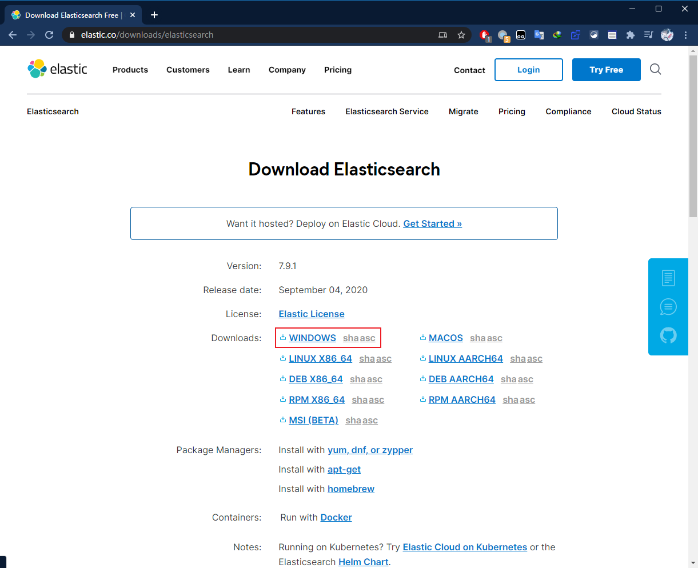

## 3. 解压后运行bat使用

- 和许多其他的开源软件一样，解压缩文件后，运行`bat`即可使用，`ElasticSearch`依赖于`Java`环境，请确认系统中已经配置好了`Java`环境：

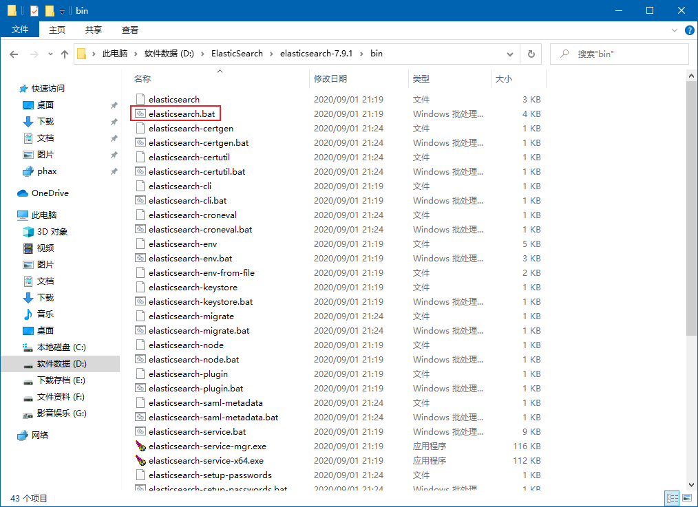

- 等待`bat`运行完毕：

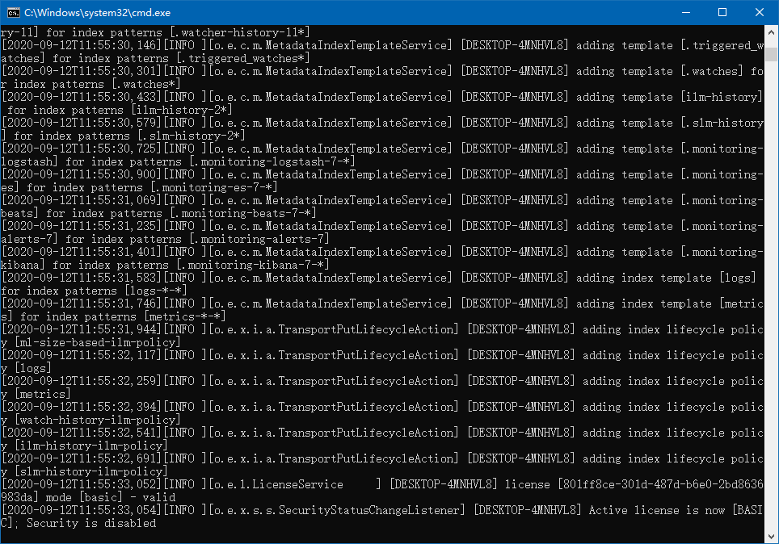

- 浏览器端打开`http://localhost:9200`查看`ES`是否正在运行：


# ES可视化工具ES-HEAD

## 1. 获取ElasticSearch-Head

- 从`GitHub`中可以获取`ElasticSearch-Head`：`https://github.com/mobz/elasticsearch-head`；

- 由于该项目是`JavaScript`的项目，因此使用该工具需要`node.js`坏境，下载安装即可；

## 2. 相关配置

- 除了`node.js`外，还需要使用`node.js`的包管理器`npm: node package management`下载并安装`grunt-cli`：

```shell
npm install -g grunt-cli
```

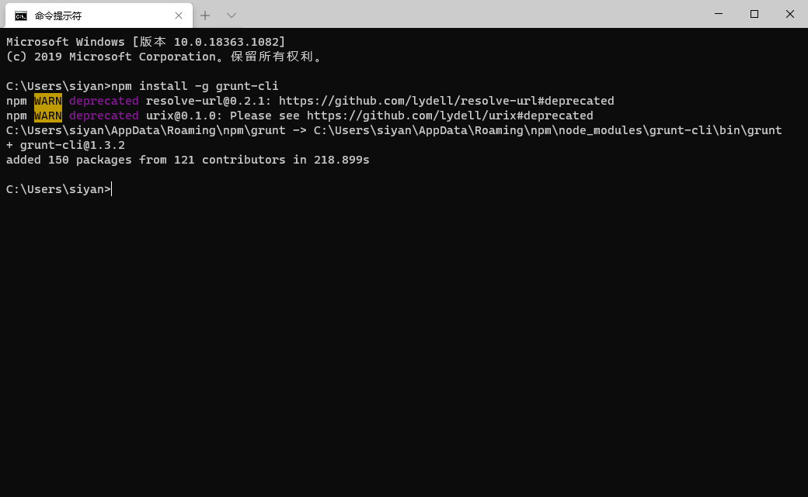

- 之后切入目录`elasticsearch-head-master`运行以下命令安装相关软件：

```shell
npm install
```

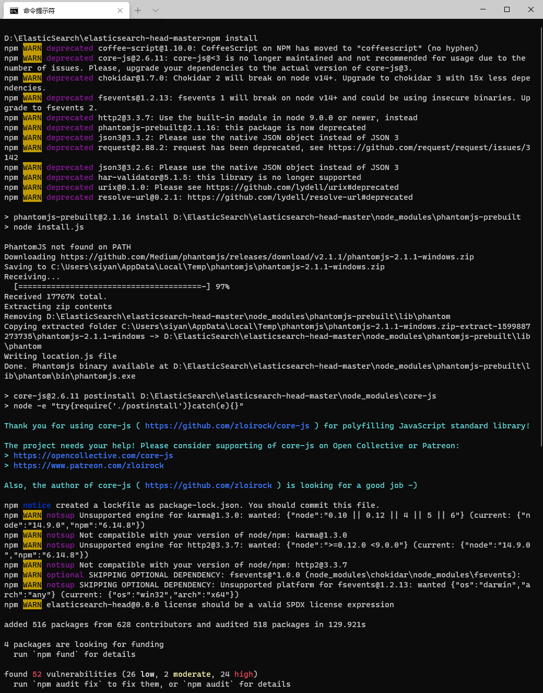

## 3. 运行ES-Head

- 配置完成后，切入到目录`elasticsearch-head-master`中运行以下命令开启服务：

```shell
grunt server
```

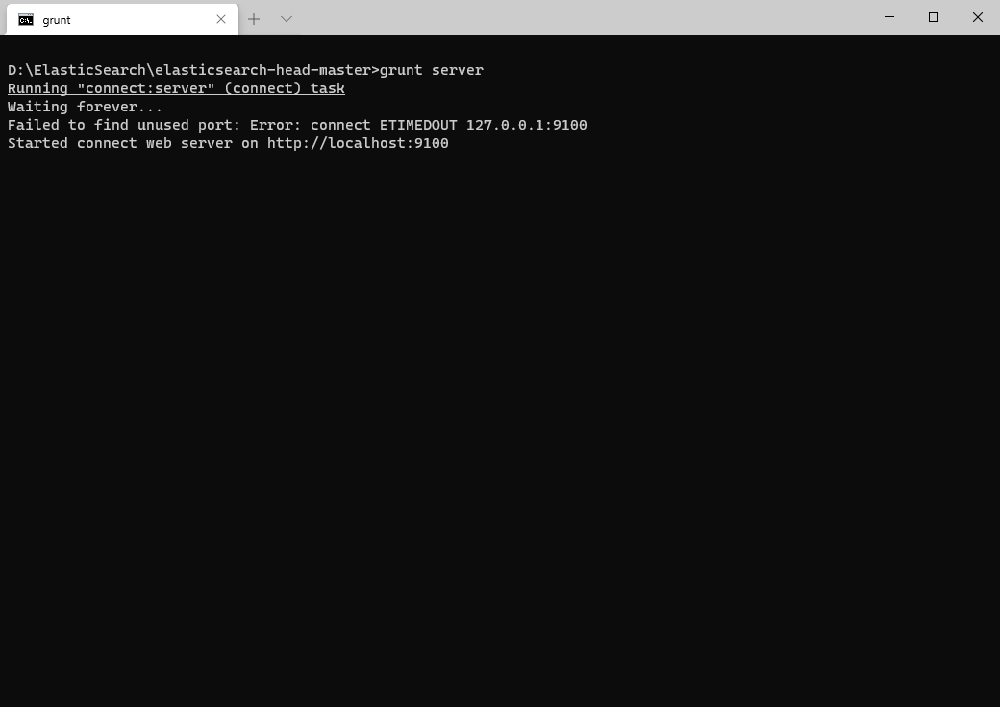

- 打开网址`http://localhost:9100`可以看到可视化页面：


## 4. 连接ElasticSearch

- 打开`ElasticSearch-Head`之后，还无法连接到`ElasticSearch`，需要对`ElasticSearch`进行进一步的配置，在其配置文件中找到`elasticsearch.yml`，添加两行配置信息：

```yml
# yml格式中的键值对，在冒号(:)之后一定要添加空格，否则会报错
# 第一条指明是否允许跨域访问，第二条指明允许来自哪里的跨域访问，(*)指的是所有
http.cors.enabled: true
http.cors.allow-origin: "*"
```

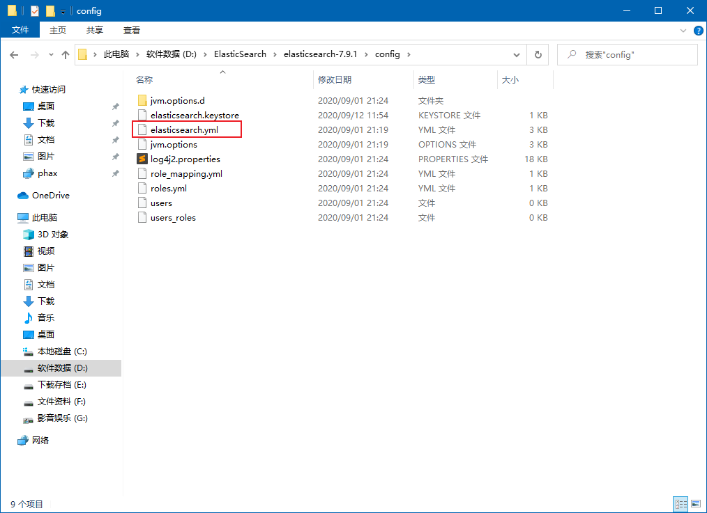

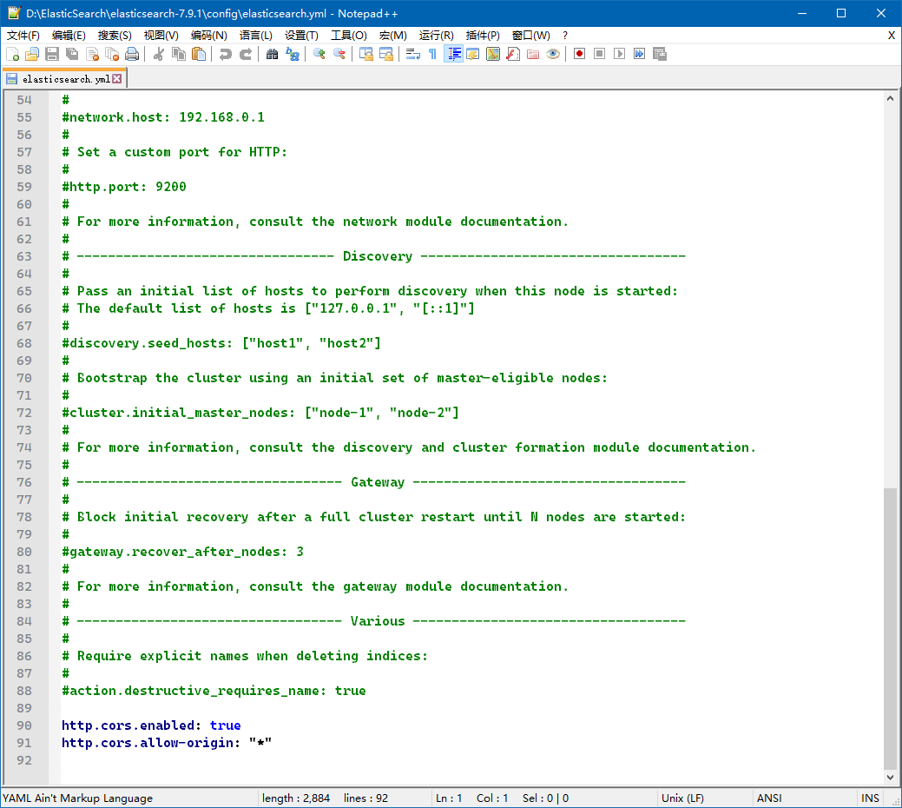

- 重启`ElasticSearch`之后，之后`ElasticSearch-Head`已经可以正常连接了：

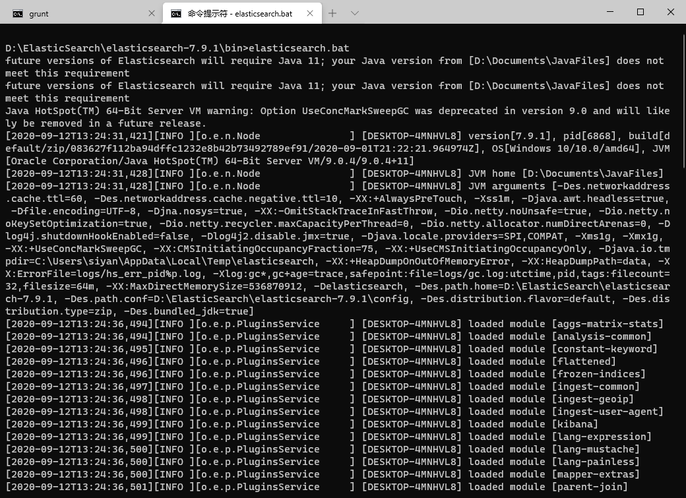

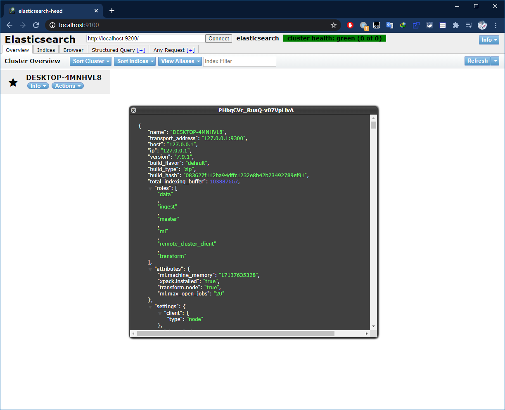

# ElasticSearch核心概念

## 1. 索引 (Index)

- 更为准确地表达应该是`Indices`（索引库），一个索引就是一个拥有几分相似特征的文档集合；
- 比如说，你可以有一个客户数据的索引，和另一个产品目录的索引，还有一个订单数据的索引。一个索引由一个名字来标识（必须全部是小写字母！！！），并且但我们要对对应于这个索引中的某些文档进行索引、搜索、更新和删除的时候，都要使用到这个索引库的名称；
- 在一个集群中，可以定义任意个索引。

## 2. ~~类型 (Type)~~

- 在`ElasticSearch 7.x`版本中，不再需要`Type`，被官方标记为过时；而`ElasticSearch 8.x`将不再支持`Type`。
- 如果仍需要在`7.x`版本中使用`Type`添加`mappings`，需要添加参数`include_type_name=true`，默认情况下，该值为`false`，即不支持带有`Type`的`Json`数据提交。

- 在一个索引库中，你可以定义一种或多种类型。一个类型是你的索引的一个逻辑上的分类/分区，其语义完全有用户定义。通常，会为具有一组共同字段的文档定义一个类型；
- 比如，我们假设你运营一个博客平台，并且将你所有的数据存储到一个索引中。在这个索引中，你可以为用户数据定义一个类型，为博客数据定义另一个类型，当然，你也可以为评论数据定义另一个类型。

## 3. 字段 (Field)

- 相当于数据表的字段，对文档数据根据不同属性进行分类标识。

## 4. 映射 (Mapping)

- `Mapping`在处理数据的方式和规则方面做了一些限制，如某个字段的数据类型、默认值、分析器、是否被索引等等。这些都是映射里面的配置，其他的诸如处理`ES`里面数据的一些使用规则设置也叫作映射。
- 按照最优规则处理数据对性能提高很大，因此才需要建设映射，并且需要思考如何建立映射才能对性能更好。

## 5. 文档 (Document)

- 一个文档是一个可索引的基础信息单元（相当于数据库表中的行）。
- 比如，你可以拥有某一个客户的文档，某一个产品的文档，也可以拥有某个订单的一个文档。文档是以`Json`格式来表示，而`Json`是一个到处存在的互联网数据交互格式。
- 在一个`Index/Type`中，你可以存储任意多个文档。~~注意，尽管一个文档物理上存在于索引库`Index`中，但文档始终需要被赋予一个`Type`值（相当于数据库表的表名）。~~
- 更新：在`ElasticSearch 7.x`版本中，不再需要`Type`，被官方标记为过时；而`ElasticSearch 8.x`将不再支持`Type`。

## 6. 接近实时 (NRT)

- `ElasticSearch`是一个接近实时的搜索平台。这意味着，从索引一个文档直到这个文档能够被搜索到，仅有一个轻微的延迟（通常是`1`秒以内）。

## 7. 集群 (Cluster)

- 一个集群就是由一个或多个节点组织在一起的组合，它们共同持有整个数据，并一起提供索引和搜索功能。
- 一个集群由一个唯一标识表示，这个名字的默认值是`elasticsearch`。这个名字是很重要的，因为一个节点（可以理解为索引库的集合）只能通过指定某个集群的名字来加入该集群。

## 8. 节点 (node)

- 一个节点是集群中的一个服务器，作为集群的一部分，它存储数据，参与集群的索引和搜索功能。
- 和集群类似，一个节点也是由一个名字来标识的，默认情况下，这个名字是一个随机的漫威漫画角色的名字，这个名字会在启动的时候被赋予到节点上。这个名字对于管理工作来说是重要的，因为在管理的过程中，你会去确定网络中的那些服务器对应着`ElasticSearch`集群中的哪些节点。

- 一个节点可以通过配置集群名称的方式，加入到一个指定的集群中。默认情况下，每个节点都会被安排加入到一个叫做`elasticsearch`的集群中，这意味着，如果你在你的网络中启动了若干个节点，并假定它们能够相互发现彼此，那么这些节点将会自动加入（形成）到一个叫做`elasticsearch`的集群中。
- 在一个集群里，只要你想就可以创建多个节点。而且，如果当前你的网络中没有运行任何`ElasticSearch`节点，这时启动一个节点，会默认创建并加入一个叫做`elasticsearch`的集群。

## 9. 分片和复制 (shard&replicas)

- 一个索引可以存储超出单个节点硬件限制的大量数据。比如，一个具有`10`亿文档的索引占据1TB的磁盘空间，而任一节点都没有这样大的磁盘空间；或者单个节点处理搜索请求，响应太慢。为了解决这个问题，`ElasticSearch`提供了将索引划分成多份的能力，这些份就叫做分片。
- 当你创建一个索引的时候，你可以指定你想要的分片数量，每个分片本身也是一个功能完善并且独立的“索引”，这个“索引”可以被放置到集群中的任意节点上。分片很重要，主要有两方面的原因：
  1. 允许你水平分割/扩展你的内容容量；
  2. 允许你在分片（潜在地，位于多个节点上）之上进行分布式的、并行的操作，进而提高性能/吞吐量。

- 置于一个分片怎么分布，它的文档怎样聚合回搜索请求，是完全有`ElasticSearch`管理的，对于作为用户的你来说，这些都是透明的。
- 在一个网络/云的环境里，失败随时都可能发生，在某个分片/节点不知怎么就处于离线状态，或者由于任何原因消失不见的时候，能有一个故障转移机制是非常有用并且是强烈推荐的。为此目的，`ElasticSearch`运行你创建分片的一份或多份拷贝，这些拷贝就是复制分片，或者直接叫复制。
- 复制之所以重要，主要的原因是：在分片/节点失败的情况下，提供了高可用性。
  - 复制分片从不与原本/主要（`original/primary`）分片置于同一个节点上，是`ElasticSearch`重要的属性。扩展你的搜索量/吞吐量，因为搜索可以在所有的复制上并行运行。总之，每个索引都可以被分成多个分片；而一个索引也可以被复制`0`次或多次。
- 一旦分片被复制了，每个索引就有了主分片和复制分片之分。分片和复制分片的数量可以在索引创建的时候指定，在索引创建之后，你可以在任何时候动态地改变复制的数量，但是注意，分片的数量在索引创建之后是不能再次改变的。
- 默认情况下，`ElasticSearch`中每个索引（索引库）会被分片`5`个主分片和`1`个复制，也就是说，如果你在集群中至少有两个节点，你的索引将会有`5`个主分片和另外五个复制分片（即1个完整的拷贝），这样的话每个索引总共就有`10`个分片。

# Postman安装

## 1. Postman的作用

- 用户在开发或者调试网络程序或者是网页`B/S`模式的程序的时候是需要一些方法来跟踪网页请求的，用户可以使用一些网络的监视工具比如著名的`Firebug`等网页调试工具。
- `Postman`工具不仅可以调试简单的`css`、`html`、脚本等简单的网页基本信息，它还可以发送几乎所有类型的`HTTP`请求！`Postman`在发送网络`HTTP`请求方面可以说是`Chrome`插件类产品中的代表产品之一。
- 我们虽然可以使用`ElasticSearch-Head`对索引库进行操作，但它的网页的界面不是十分友好，且`Json`数据格式不优雅。因此改为使用`Postman`工具，向目标的`ElasticSearch`服务器发送增删改查等http请求。

## 2. 安装Postman

- 可以从以下网址中获得最新`Window`版本的`Postman`：`https://www.postman.com/downloads/`

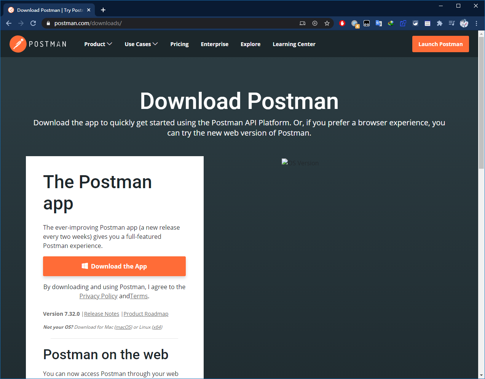

- 双击等待安装完成即可，使用`Postman`需要拥有账户密码，我们使用`Google`登录：


# Kibana安装

## 1. Kibana

- 什么是`ELK`？`ELK`是`ElasticSearch`、`Logstash`、`Kibana`三大开源框架首字母大写的简称，也被称为`Elastic Stack`。
  - `ElasticSearch`是一个基于`Lucene`、分布式、通过`Restful`方式进行交互的近实时搜索平台框架，类似于百度、谷歌等大数据全文搜索引擎的场景，都是使用`ElasticSearch`作为底层支持框架；
  - `Logstash`是`ELK`的中央数据流引擎，用于从不同目标（文件/数据存储/MQ）收集不同格式的数据，经过过滤后支持输出到不同目的地（文件/MQ/redis/ElasticSearch/kafka等）；
  - `Kibana`可以将`ElasticSearch`的数据通过友好的页面展示出来，提供实时分析的功能。
- 我们除了可以通过`Postman`进行测试，还可以使用`Kibana`，它对`Restful`有更好的支持。

## 2. 安装Kibana

- 从官网上下载`Kibana`的压缩文档，解压后通过运行`bin/kibana.bat`运行`Kibana`，默认端口为`5601`：`https://www.elastic.co/cn/downloads/kibana`

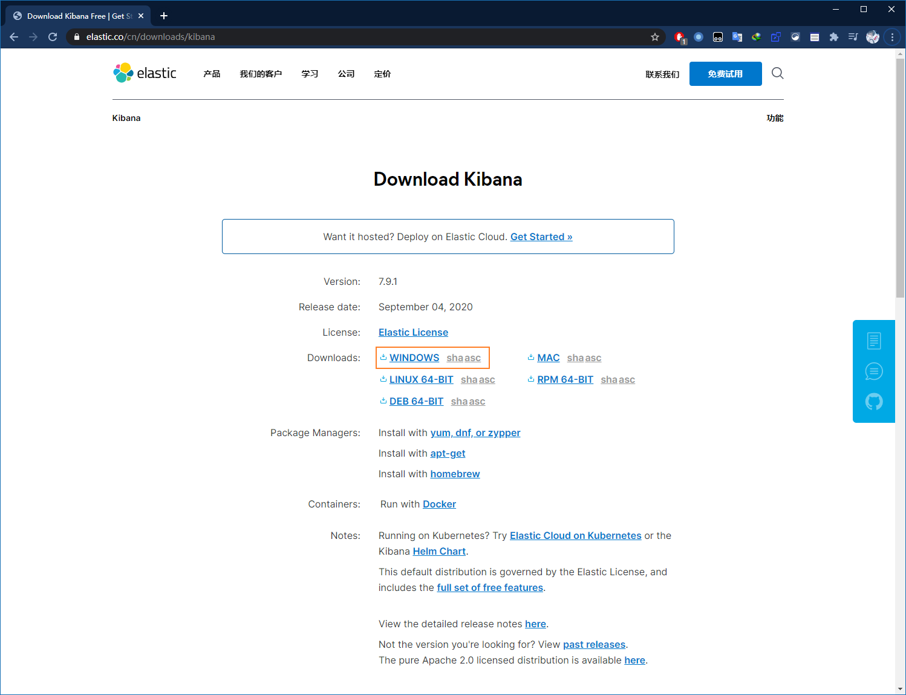

- `Kibana`启动会自动连接到`ElasticSearch`中，所以会使用`ElasticSearch`的默认端口`9200`，如果你的节点/索引的端口不是默认端口，需要修改`Kibana`的配置文件`config/kibana.yml`；
- `Kibana`默认提供中文汉化插件`zh-CH.json`，在配置文件`config/kibana.yml`中启用即可；

```yml
# 插件库中已经有这个了，直接使用，是官方汉化
i18n.locale: "zh-CN"
# 默认端口是9200，如果需要更改请自定义
elasticsearch.hosts: ["http://localhost:9201"]
```

- 访问`http://localhost:5601`即可访问`Kibana`：


# Restful风格

- `Restful`是一种软件架构风格，而不是标准，只是提供了一组设计原则和约束条件。它主要用于客户端和服务器交互类的软件。基于这个风格设计的软件可以更简洁、更有层次，更易于实现缓存等机制。

# ElasticSearch中的Restful

- 主要是配合`Kibana`使用，`ElasticSearch 8.x`中将彻底废弃`Type`，也许`_doc`会被取消：

| Method |              URL               |          Mark           |
| :----: | :----------------------------: | :---------------------: |
|  PUT   |     `/indices/_doc/doc_id`     | 创建文档（指定文档_id） |
|  POST  |        `/indices/_doc`         | 创建文档（随机文档_id） |
|  POST  | `/indices/_doc/doc_id/_update` |        修改文档         |
| DELETE |     `/indices/_doc/doc_id`     |        删除文档         |
|  GET   |     `/indices/_doc/doc_id`     |     通过_id查询文档     |
|  POST  |    `/indices/_doc/_search`     |        查询数据         |

# ES基本数据类型

- 参考下表，注意`keyword`是不可分割的，也就是不支持分词：

|  type  |                           include                            |
| :----: | :----------------------------------------------------------: |
| 字符串 |                        text、keyword                         |
|  数值  | byte、short、integer、long、float、double、half float、scaled float |
|  日期  |                             date                             |
| 布尔值 |                           boolean                            |
| 二进制 |                            binary                            |

# ElasticSearch索引库操作

## 1. 创建索引库

- 涉及到创建`Indices`操作的，需要发送`PUT`请求。

### a. 使用ES-Head创建

- 直接使用`ES-Head`中的可视化图形界面进行索引库的创建，可以自行设置分片数、复制数。

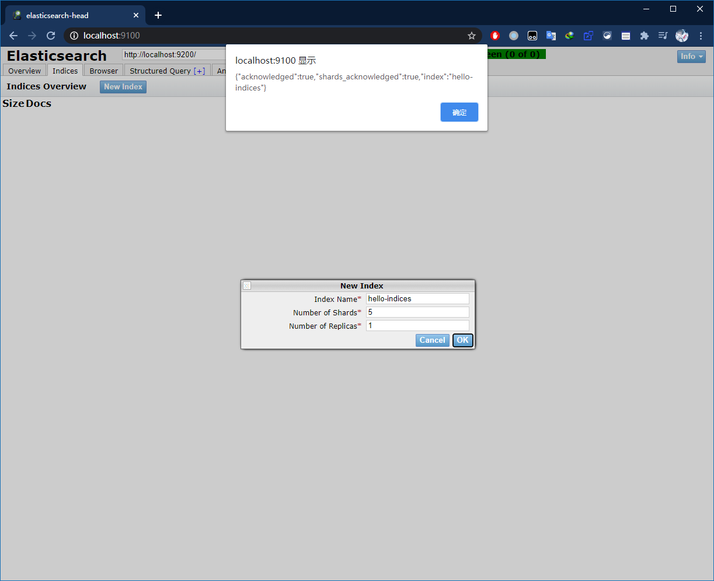

### b. 使用Postman创建

- 使用`Postman`需要发送`PUT {index}`请求，发送链接为：`http://localhost:9200/postman-indices`，这样将在`ElasticSearch`中创建一个名为`postman-indices`的索引库。

```http
PUT http://localhost:9200/postman-indices
```

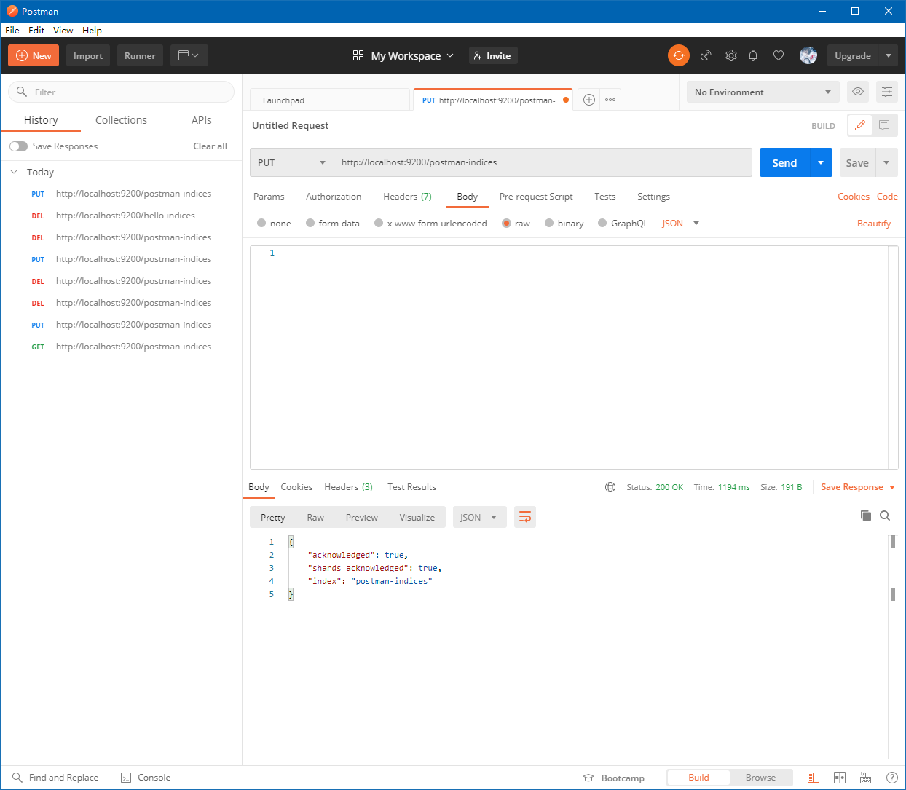

### c. 结果比较

- 从图中可以看出从`Postman`端中创建的索引库，并没有进行分片的操作，但是进行复制；
- 由于教程版本的问题，也许最新版本的`ElasticSearch 7.x`中的默认分片已经不再是`5`片了，我们可以直接通过传入`Json`配置数据的方式控制分片数。

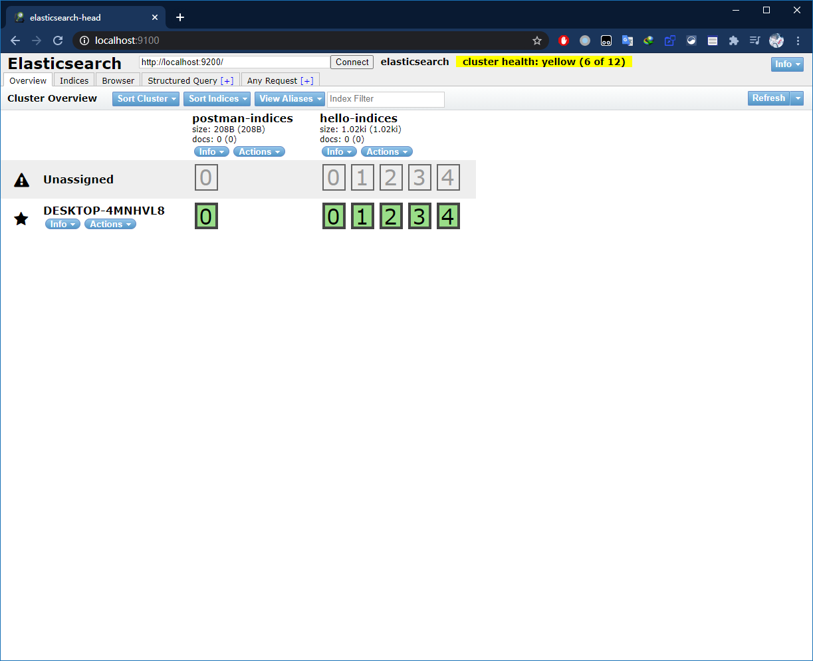

### d. 拓展知识

- `ElasticSearch 7.x`不再提供默认分片，但默认复制为`1`，使用`Json`数据设置索引库分片：

```json
{
    "settings": {
        // 默认分片数量
        "number_of_shards": 5,
        // 默认复制数量
        "number_of_replicas": 1
    },
    "mappings": {
        "properties": {
            "id": {
                "type": "text",
                "store": true
            },
            "title": {
                "type": "text",
                "store": true,
                "index": true,
                "analyzer": "standard"
            },
            "content": {
                "type": "text",
                "store": true,
                "index": true,
                "analyzer": "standard"
            }
        }
    }
}
```

- `Postman`图例：

```http
PUT http://localhost:9200/hello-indices
```

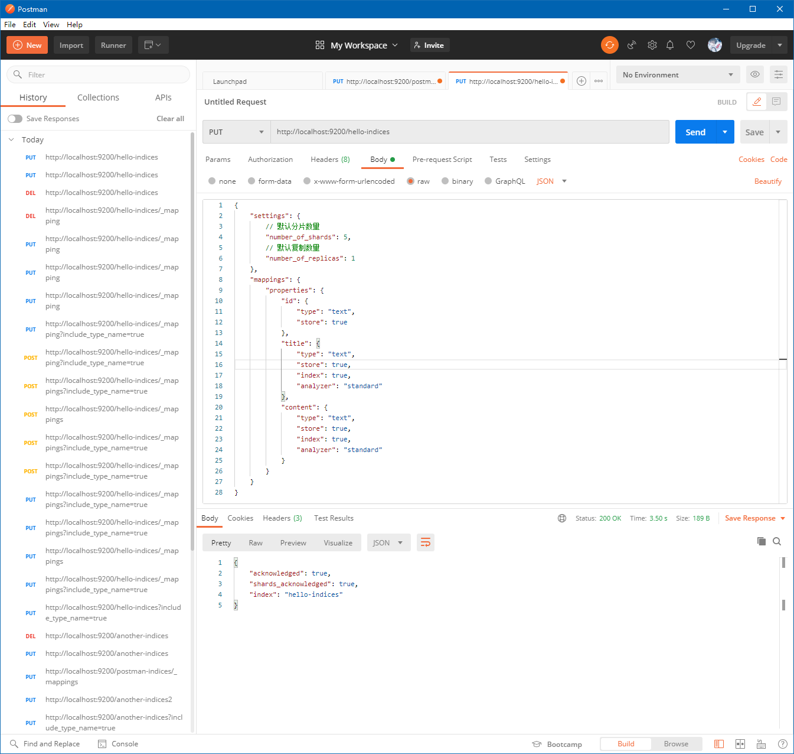

## 2. 创建索引库并添加Mappings

- 涉及到创建`Indices`操作的，需要发送`PUT`请求。

### a. 注意事项

- 注意，本篇使用的`ElasticSearch`的版本为`7.9.1`，其中`Type`已经被官方标记为`Deprecated`（已过时）。
- 参考官方文档：`https://www.elastic.co/guide/en/elasticsearch/reference/current/removal-of-types.html`

> ### Schedule for removal of mapping types
>
> - **Elasticsearch 7.x**
>   - Specifying types in requests is deprecated. For instance, indexing a document no longer requires a document `type`. The new index APIs are `PUT {index}/_doc/{id}` in case of explicit ids and `POST {index}/_doc` for auto-generated ids. Note that in 7.0, `_doc` is a permanent part of the path, and represents the endpoint name rather than the document type.
>   - The `include_type_name` parameter in the index creation, index template, and mapping APIs will default to `false`. Setting the parameter at all will result in a deprecation warning.
>   - The `_default_` mapping type is removed.
> - **Elasticsearch 8.x**
>   - Specifying types in requests is no longer supported.The `include_type_name` parameter is removed.

### b. 使用Postman创建

- 通过添加请求参数`include_type_name=true`，仍然开启对`type`的支持：

```http
PUT http://localhost:9200/another-indices?include_type_name=true
```


- 通过`ES-Head`查看添加结果：

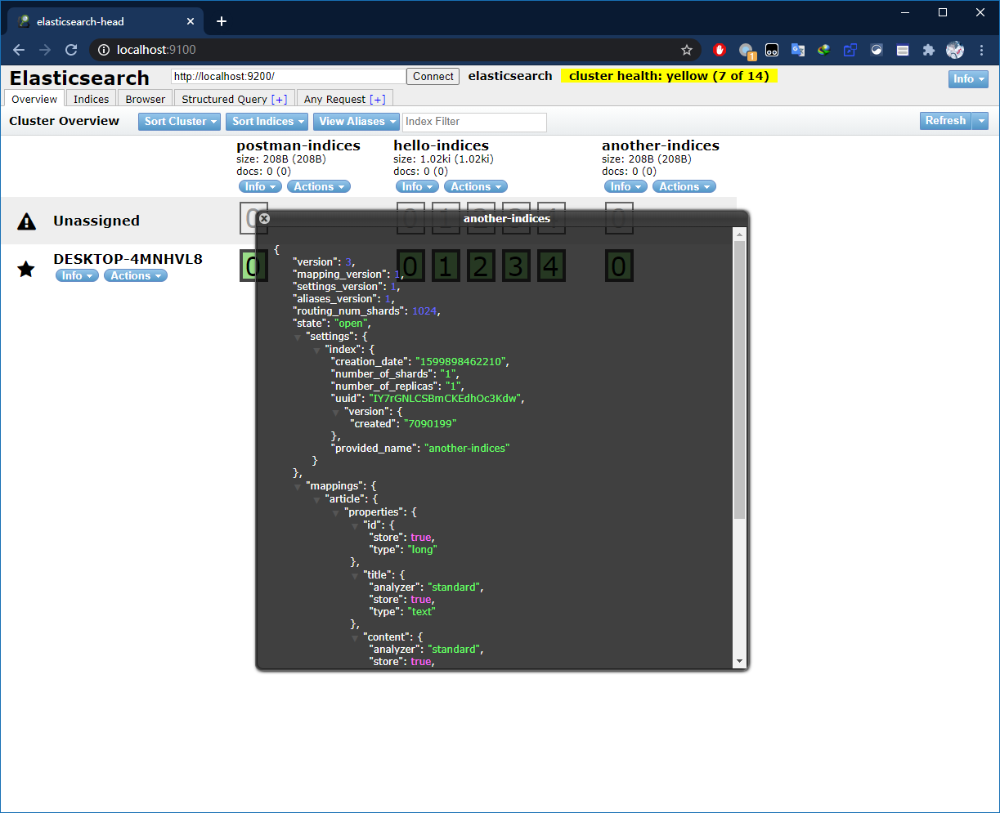

- 或不再使用`Type`，进行`Indices`与`Mappings`的添加：

```http
PUT http://localhost:9200/another-indices2
```

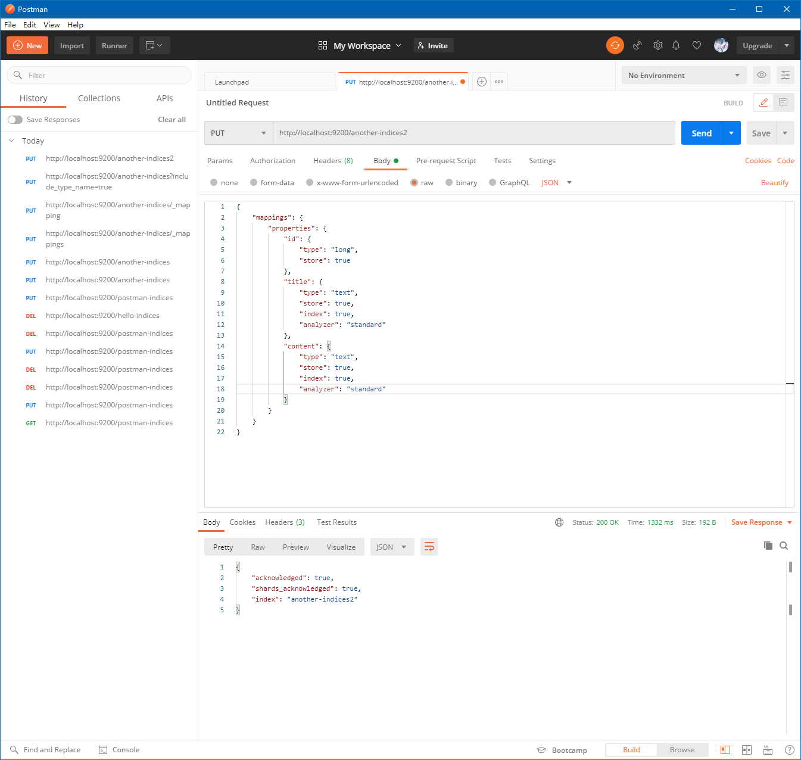

- `ElasticSearch`将默认创建名为`_doc`的Type：

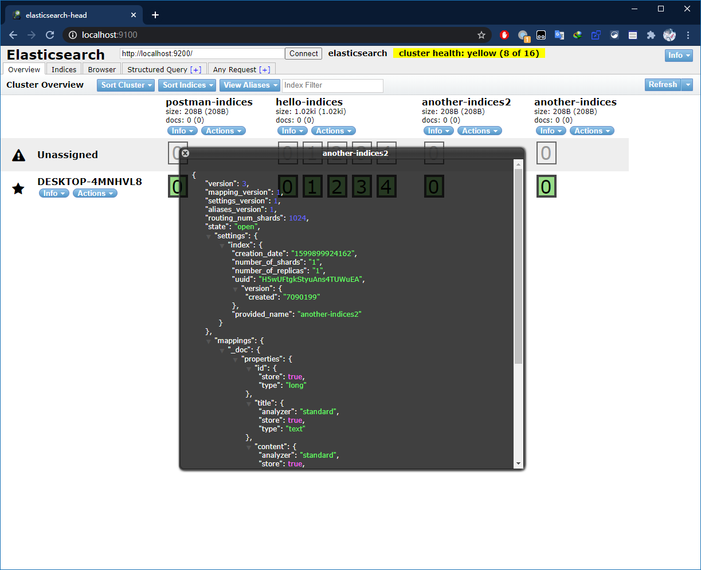

## 3. 已存在的索引库中添加Mappings

- 涉及到修改的操作要使用`POST`请求。

### a. 注意事项

- 注意，本篇使用的`ElasticSearch`的版本为`7.9.1`，其中`Type`已经被官方标记为`Deprecated`（已过时）。

### b. 使用Postman添加

- 请求格式为：`POST {index}/_mappings`

```http
POST http://localhost:9200/postman-indices/_mappings
```

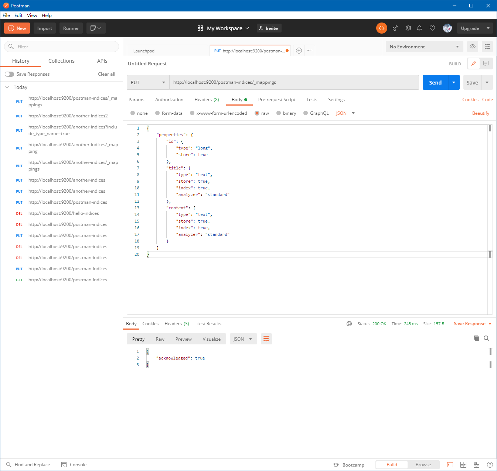

- 通过`ES-Head`查看添加结果：


## 4. 删除索引库

- 涉及到删除操作的请求为`DELETE`方法。

### a. 通过ES-Head删除

- 删除操作十分简单，直接在图形化界面中点击`Action->Delete`即可：

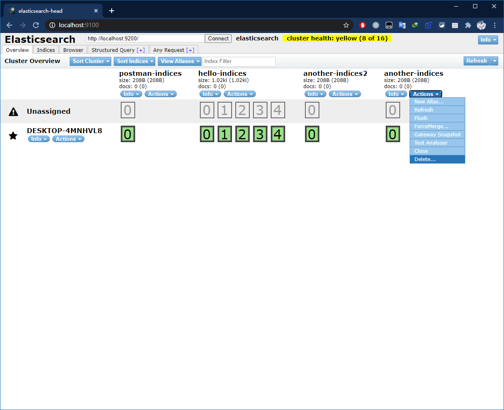

### b. 通过Postman删除

- 通过格式：`DELETE {index}`

```http
DELETE http://localhost:9200/another-indices
```

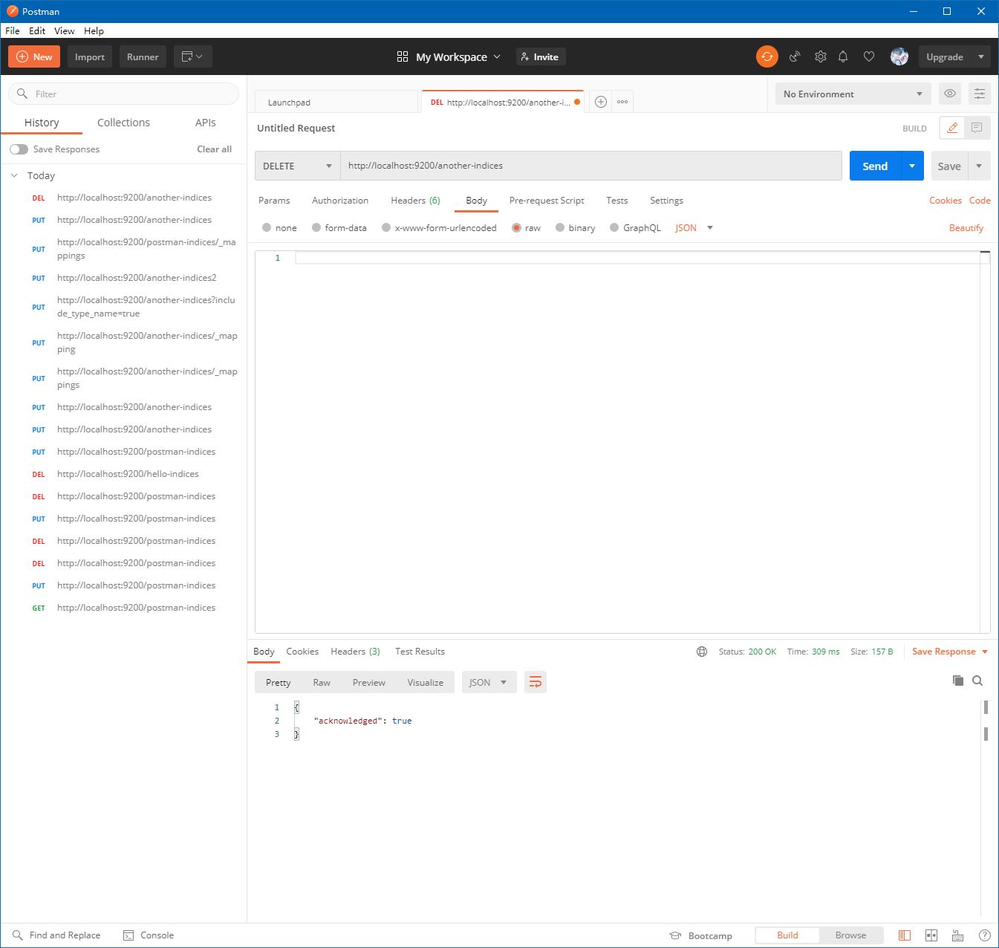

# ElasticSearch文档操作

## 1. 向索引库中添加文档

- `ElasticSearch`未来的版本中不再有`Type`，需要向索引库中插入文档，建议使用格式：`POST {index}/_doc/{_id}`；
- 除了`POST`还可以使用`PUT`；
- `_id`和`id`是不一样的，但是传统上/理论上它们的值需要保持一致：
  - `_id`的值是在地址栏被指定且创建的；
  - `id`的值实在`Json`格式数据中被指定且创建的。

```http
POST http://localhost:9200/hello-indices/_doc/1
```

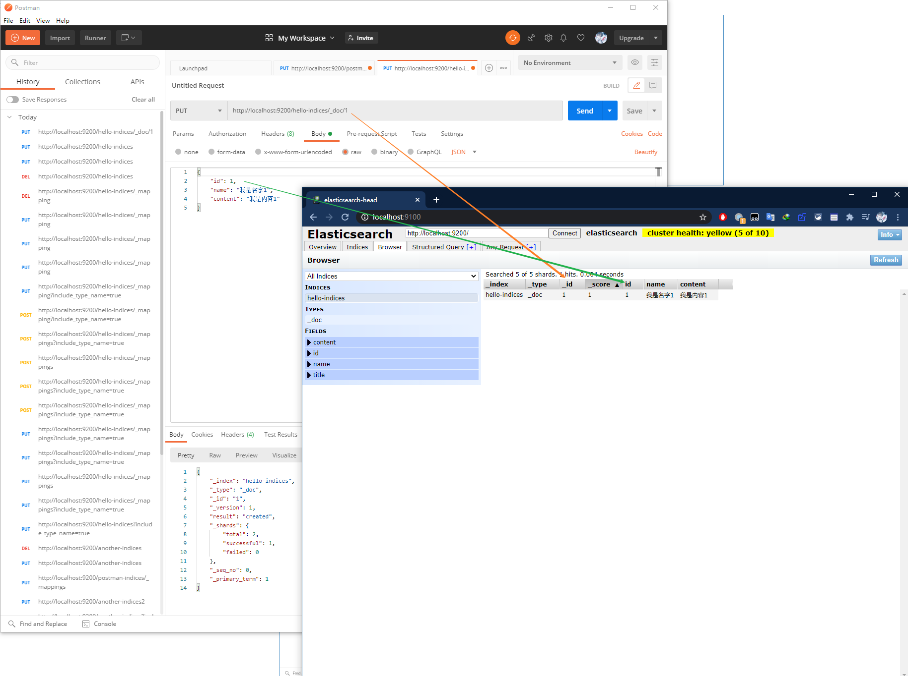

- 添加文档格式`POST {index}/_doc`也可以添加文档，但此时`_id`的值将被随机创建：

```http
POST http://localhost:9200/hello-indices/_doc
```

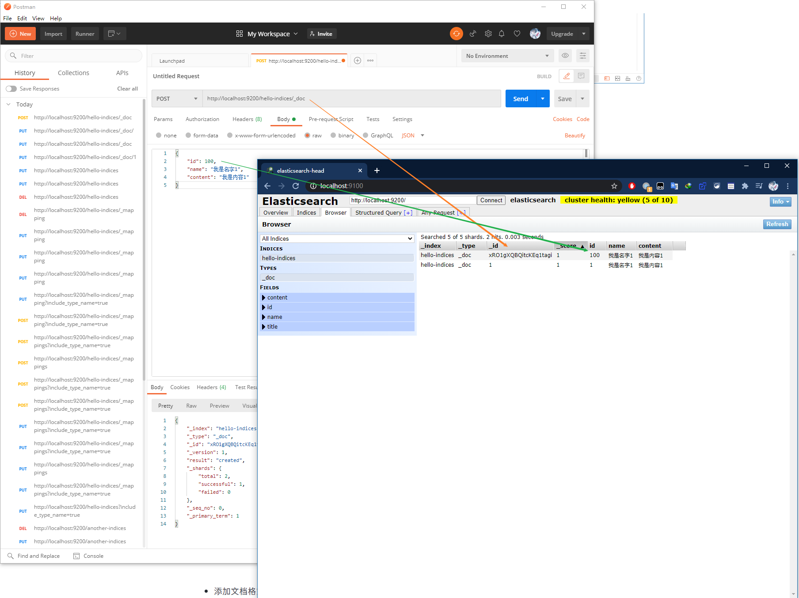

## 2. 从索引库中删除文档

- `ElasticSearch`未来的版本中不再有`Type`的概念，需要从索引库中删除文档，使用格式：`DELETE {index}/_doc/{_id}`；
- 根据`_id`删除文档。

```http
DELETE http://localhost:9200/hello-indices/_doc/xRO1gXQBQitcKEq1tagi
```

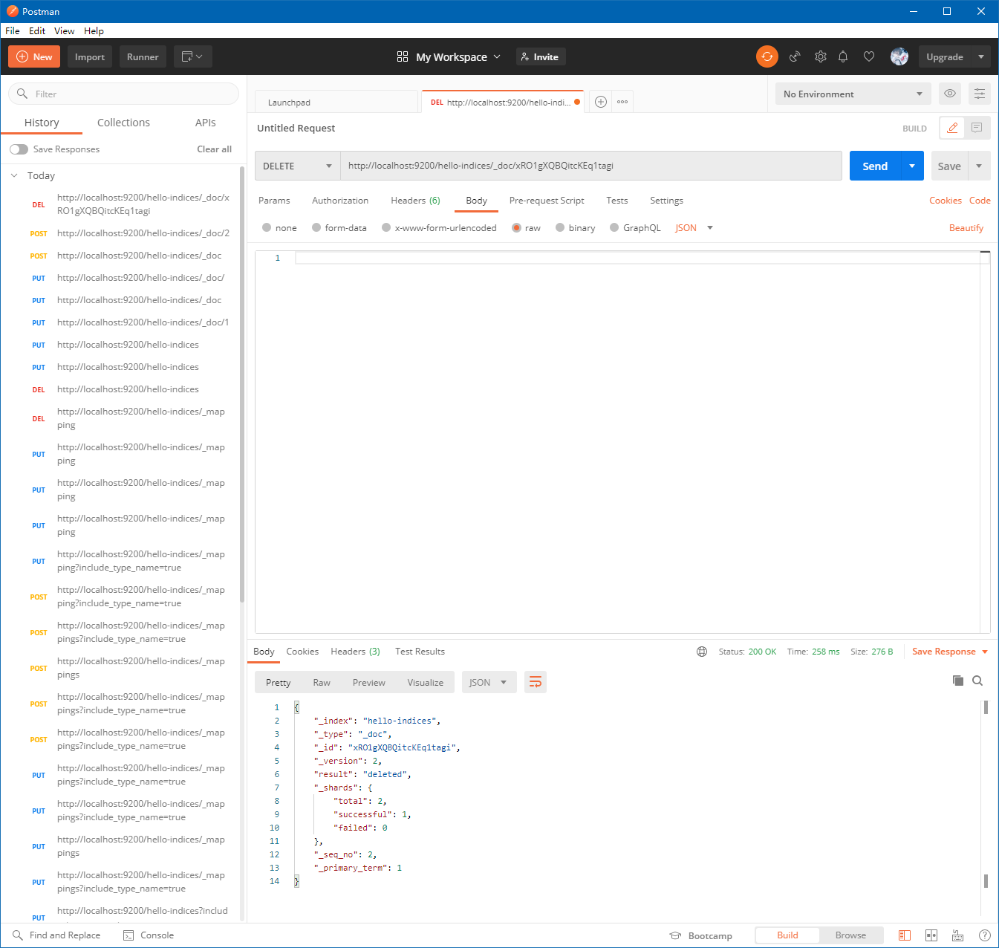

## 3. 在索引库中修改文档

- `ElasticSearch`未来的版本中不再有`Type`的概念，需要在索引库中修改文档，使用格式：`POST {index}/_doc/{_id}`；

- 根据`_id`修改文档。

```http
POST http://localhost:9200/hello-indices/_doc/2
```

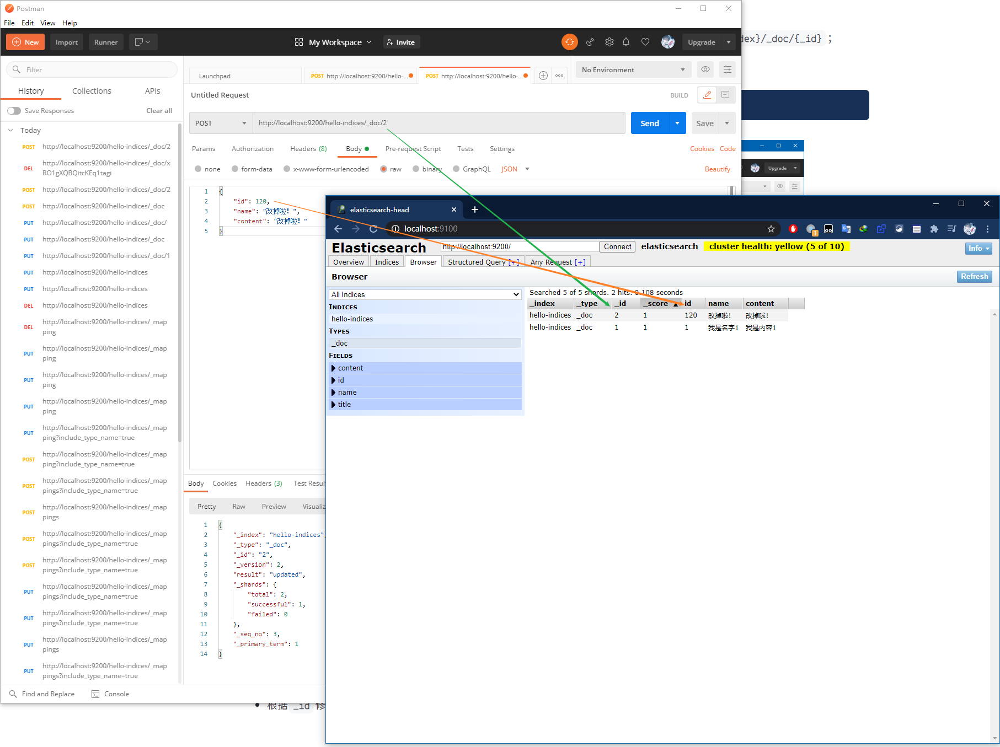

- `ElasticSearch`提供了一种新的更新文档的方式：

```http
POST http://localhost:9200/hello-indices/_doc/2/_update
```

- 对应的数据格式为：

```json
{
	"doc": {
        "id": 120
    }
}
```

## 4. 从索引库中查询文档

### a. 根据_id查询

- `ElasticSearch`未来的版本中不再有`Type`的概念，需要从索引库中查询文档，使用格式：`GET {index}/_doc/{_id}`；

- 根据`_id`查询文档。

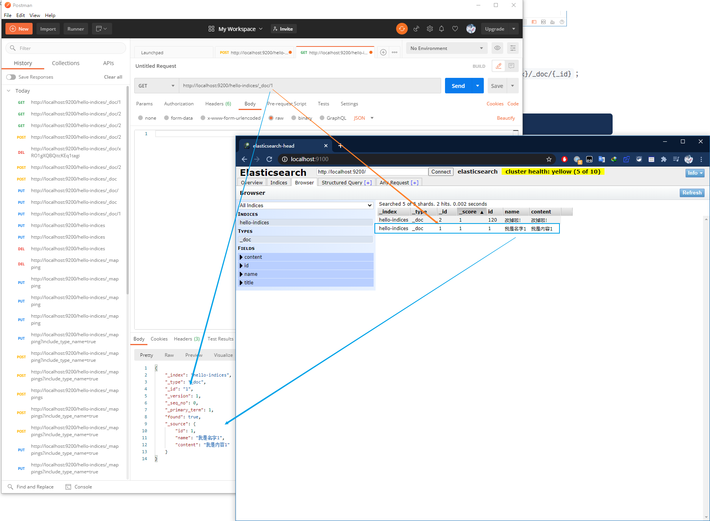

### b. 根据关键字查询

- `ElasticSearch`未来的版本中不再有`Type`的概念，需要从索引库中查询文档，使用格式：`GET {index}/_doc/_search`；
- 根据`关键字`查询文档。

```http
GET http://localhost:9200/hello-indices/_doc/_search
```

```json
// 查询条件，查询name字段中包含“改”的文档（document）
{
    "query": {
        "term": {
            "name": "改" // 根据根据关键字查询，默认是不对中文进行分词的
        }
    }
}
```

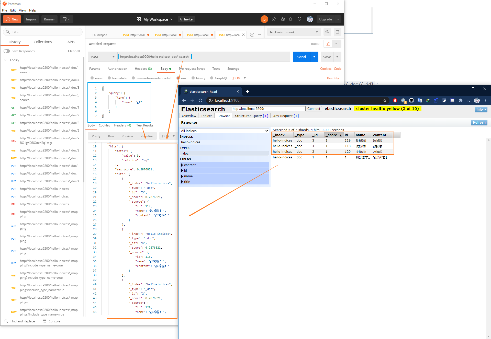

### c. 使用query_string查询

- `ElasticSearch`未来的版本中不再有`Type`的概念，需要从索引库中查询文档，使用格式：`GET {index}/_doc/_search`；
- 根据`query_string`查询文档，可以进行分词。

```http
GET http://localhost:9200/hello-indices/_doc/_search
```

```json
// 原本如果只想要检索“改名”的结果，但其实包含“改”和“名”的结果也是会被检索出来的
{
    "query": {
        "query_string": {
            "default_field": "name",
            "query": "改名" // 将对中文进行分词，使用普通的term查询是无结果的，使用query_string可以获得全部4条结果
        }
    }
}
```

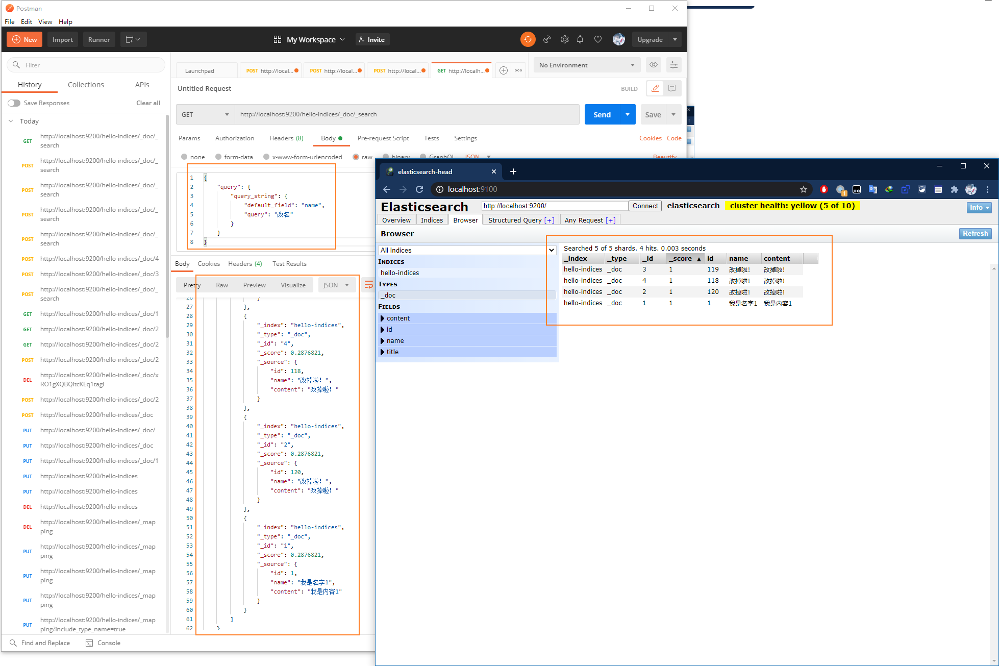

### d. 更多查询方式

- 官方`API`提供更多种查询方式，更多请访问：`https://www.elastic.co/guide/en/elasticsearch/reference/7.9/query-dsl.html`

# ElasticSearch分析器

## 1. 在ES中查看分词效果

- 可以通过`http`请求的方式，查看`Analyzer`对目标文本的分词效果：

```http
POST http://localhost:9200/_analyze
```

```json
{
    "analyzer": "standard",
    "text": "天气不错呢"
}
```

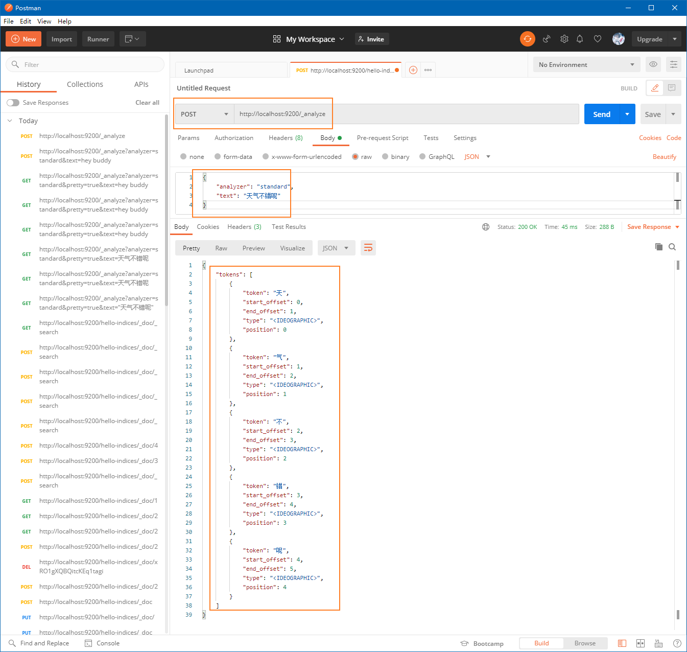

## 2. 安装ik-analyzer插件

- `GitHub`项目地址：`https://github.com/medcl/elasticsearch-analysis-ik`，其中有详尽的使用方法。
- `ElasticSearch`中默认的分词器，无法很好地支持中文分词，我们仍然需要使用`ik-analyzer`，我们使用`ElasticSearch-Plugin`命令进行插件的安装（`elasticsearch-analysis-ik`自`5.5.1`版本开始支持此安装方法）。

### a. 使用ElasticSearch插件安装

- 需要首先进入`ElasticSearch`的`bin`目录下使用其`elasticsearch-plugin.bat`进行插件的安装，代码如下：

```bash
# 进入目录elasticsearch-7.9.1\bin下运行命令
elasticsearch-plugin install https://github.com/medcl/elasticsearch-analysis-ik/releases/download/v7.9.1/elasticsearch-analysis-ik-7.9.1.zip
# 使用以下命令可以查看已安装插件列表
elasticsearch-plugin list
```

- 安装成功图示：

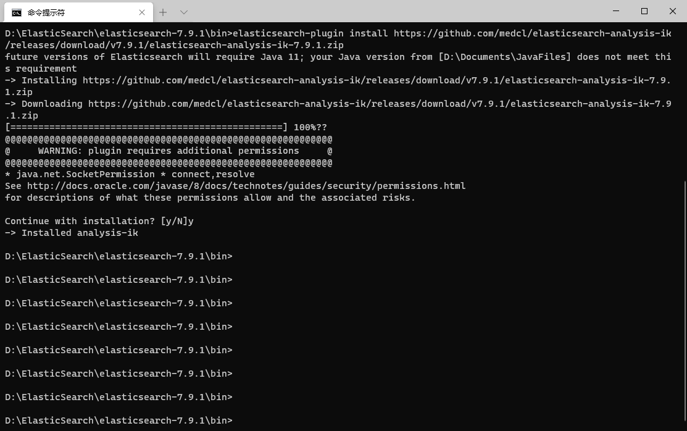

- 查看`plugins`目录是否有指定插件：


- 需要重启`ElasticSearch`使插件生效。

### b. 下载自行解压安装

- 需要前往`GitHub`项目地址，下载`Release`版本的插件（注意版本匹配！！！），或直接到以下地址下载已编译安装包：`https://github.com/medcl/elasticsearch-analysis-ik/releases`


- 下载完成后，将文件解压缩到`elasticsearch-7.9.1\plugins`目录下，重启`ElasticSearch`即可使用：


- **任何的目录都不要带空格，会出现奇怪的异常！！！**

## 3. ik分析器的分词效果

- `elasticsearch-analysis-ik`自`5.5.0`起，移除名为`ik`的`analyzer`和`tokenizer`，改为使用`ik_smart`和`ik_max_word`；
- `ik_smart`分词效果：

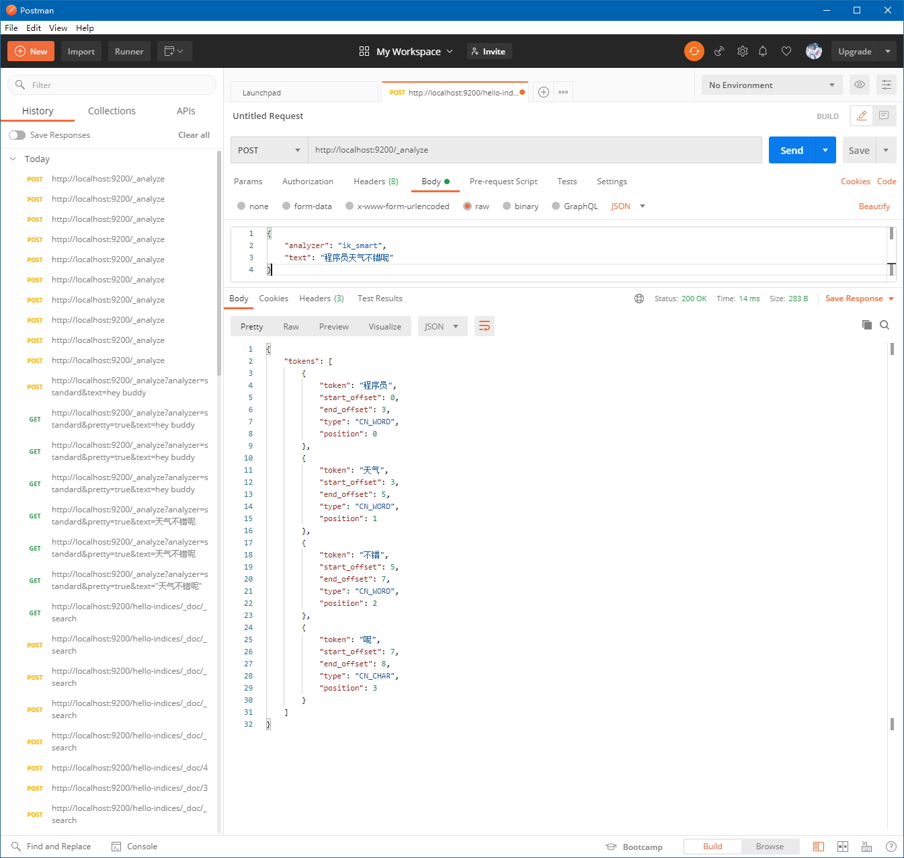

- `ik_max_word`分词效果：

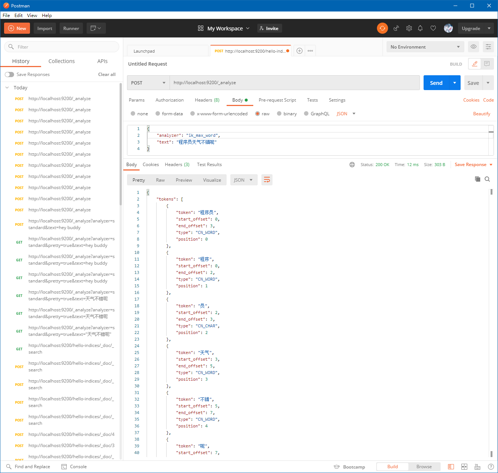

- 如果使用的是`Kibana`，使用`Restful`的方式查看分词效果（其中“傻逼”为自定义分词）：


- 关于自定义分词和停用词等，在`analysis-ik-x.x.x/config`目录下添加相应`.dic`文件，然后在`IKAnalyzer.cfg.xml`文档中添加指定的`.dic`文件即可：

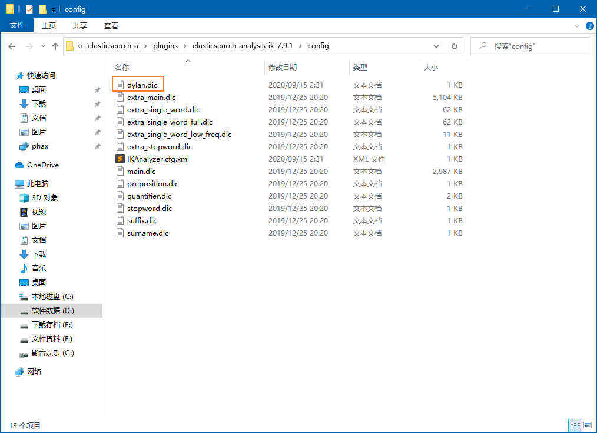


## 4. ik分析器的使用效果

- 分析器既可以用在`Field`上，也可以用在查询的词条上。

- 创建包含基于`ik_smart`分析器字段的`Mapping`，及其索引库：

```http
PUT http://localhost:9200/ik-indices
```

```json
{
    "settings": {
        // 默认分片数量
        "number_of_shards": 3,
        // 默认复制数量
        "number_of_replicas": 1
    },
    "mappings": {
        "properties": {
            "id": {
                "type": "text",
                "store": true
            },
            "title": {
                "type": "text",
                "store": true,
                "index": true,
                "analyzer": "ik_smart" // 使用ik分词
            },
            "content": {
                "type": "text",
                "store": true,
                "index": true,
                "analyzer": "ik_smart" // 使用ik分词
            }
        }
    }
}
```

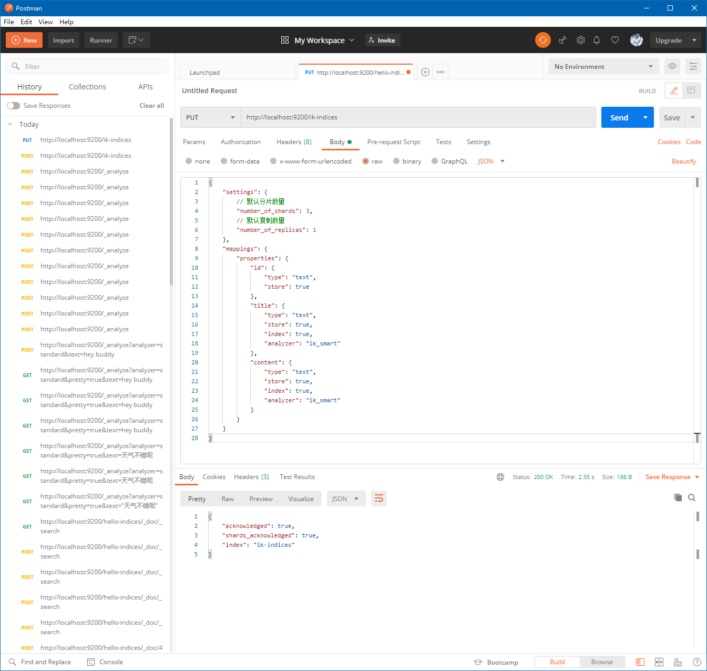

- 索引库创建完毕：

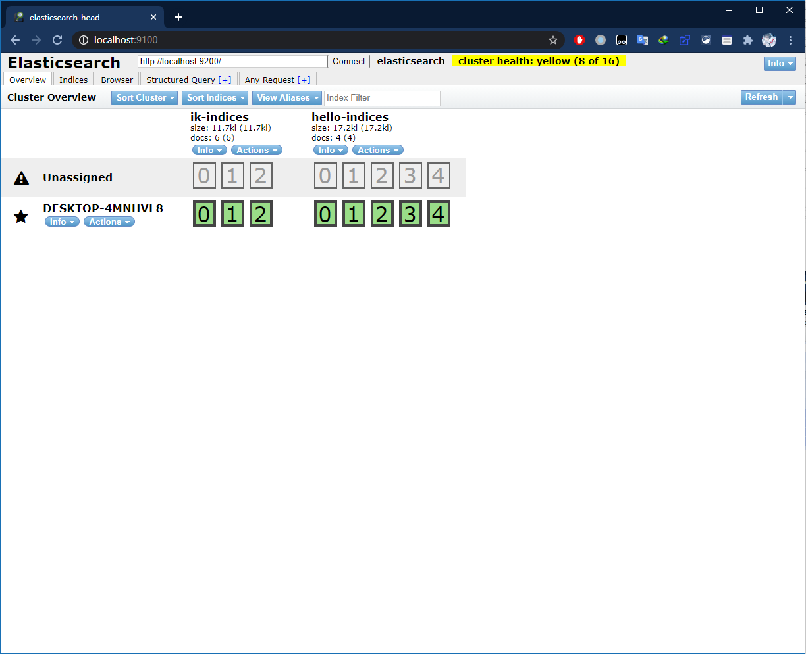

- 插入适当数据检验查询结果：

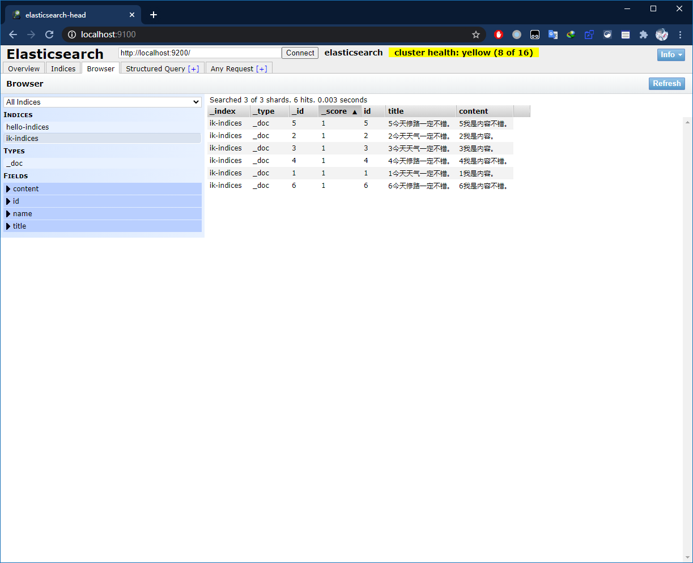

- 本题会出现搜索`"title": "天气"`的时候没有结果，事实上使用`ik_smart`对“今天天气一定不错”。进行分词的时候，不会出现“天气”的词条，如果希望出现该分词词条，使用`ik_max_word`更适合：

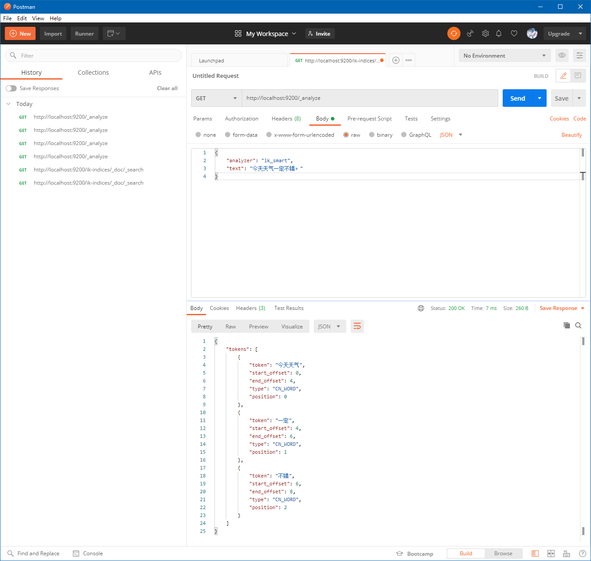

- 使用普通`term`搜索，注意使用`term`的时候，是不会对检索词条进行分词操作的，你的检索条件必须要符合`document`经过分词之后的其中一个词条：

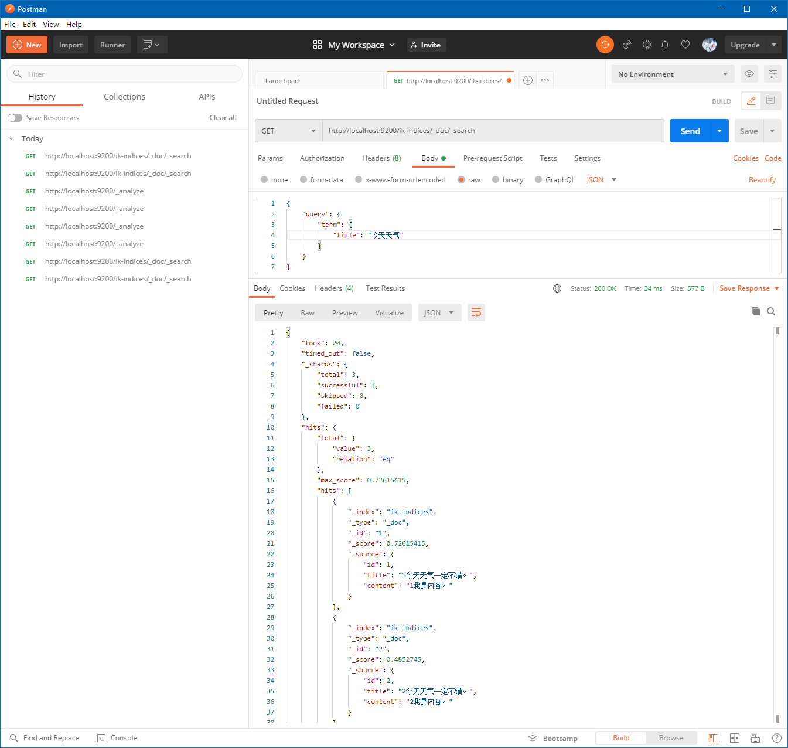

- 使用`query_string`进行检索，默认会对检索条件进行分词：

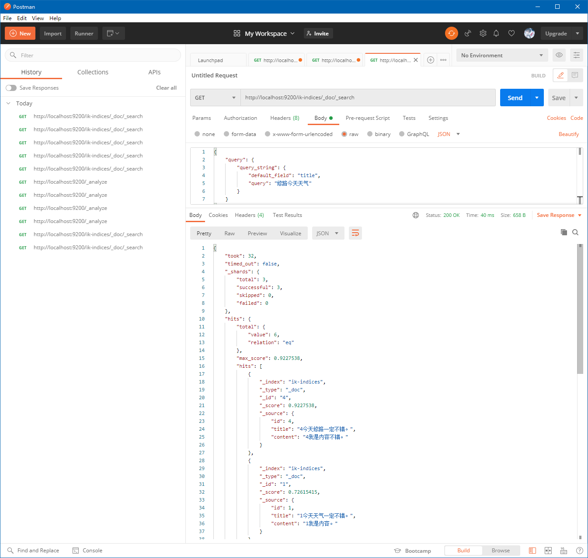

# ElasticSearch集群

- `ES`集群是一个`P2P`类型（使用`gossip`协议）的分布式系统，除了集群状态管理以外，其他所有的请求都是可以发送到集群内任意一台节点上，这个节点可以自己找到需要转发给哪些节点，并且直接跟这些节点通信。
- 所以从网络架构及服务配置上来说，构建集群所需要的配置极其简单。在`ElasticSearch 2.0`之前，无阻碍的网络下，所有配置了相同`cluster.name`的节点都会自动归属到一个集群中。
- `2.0`版本之后，基于安全的考虑避免开发环境过于随便造成麻烦，从`2.0`版本开始，默认的自动发现方式改为了单播`unicast`方式。配置里提供几台节点的地址，`ES`将其视作`gossip router`角色，借以完成集群的发现。
- 由于这只是`ES`内一个很小的功能，所以`gossip router`角色并不需要单独配置，每个`ES`节点都可以担任。因此采用单播方式的集群，各节点都配置相同的几个节点列表作为`router`即可。
- 集群中节点数量没有限制，一般大于等于2个节点就可以看做是集群了。一般出于高性能及高可用方面来考虑，集群中的节点数量都是`3`个及`3`个以上。

## 1. 模拟集群环境

- 使用修改配置端口的方式，在同一台电脑上开启三个`ElasticSearch`，并将它们配置成为一个集群`cluster`，准备三个纯净的`ElasticSearch`：


- 修改每个节点中的`elasticsearch.yml`文档，添加以下条件，注意`yml`文档的编码一定要是无`BOM`的`UTF-8`，否则启动会抛出异常，并启动失败，并且`yml`文档的冒号`:`之后一定要添加空格，否则文档将同样无法使用：

```yml
# ElasticSearch 7.x 版本之后elasticsearch.yml的配置稍微有点变化，按照以下配置搭建单机集群
# 目标集群的名称，用于加入集群
cluster.name: my-esCluster
# 节点名称，单机部署下必须要保持不一样
node.name: node-x
# 该节点时候为master主节点
node.master: true
# 是否运行该节点存储索引数据
node.data: true
# 该节点的地址，为0.0.0.0的时候相当与本机地址
network.host: 0.0.0.0
# 该节点的http端口，默认为9200
http.port: 9201
# TCP的默认监听端口，默认为9300
transport.tcp.port: 9301
# 集群主机列表，实测当9301主机列表仅配置了9301/9302主机列表时，此时新加9303主机并列表内有9301/9302/9303
# 此时使用head连接http://localhost:9201时，仍然是能够搜索到9203主机上的节点
discovery.seed_hosts: ["127.0.0.1:9301", "127.0.0.1:9302", "127.0.0.1:9303"]
# es 7.x 之后新增配置，初始化一个新的集群时，需要此配置来选举master
cluster.initial_master_nodes: ["node1", "node2"]
# 是否支持跨域，使用head插件需要此配置
http.cors.enabled: true
# 允许来自跨域的那些地址的访问，使用head插件需要此配置
http.cors.allow-origin: "*"

bootstrap.memory_lock: false
bootstrap.system_call_filter: false
```

- 同时启用三个`ElasticSearch`，之后使用`ES-Head`连接任意一个节点，即可连接上集群：

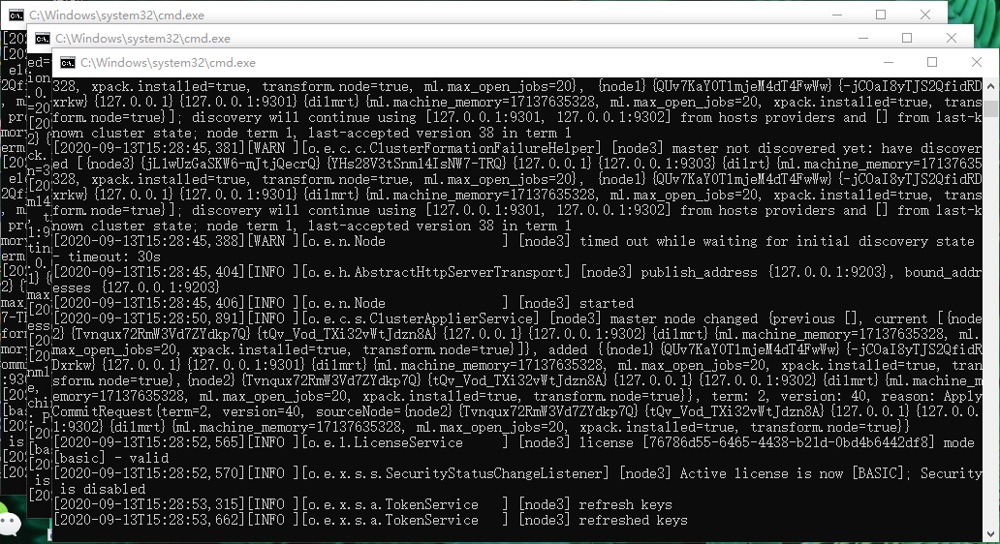

- `ES-Head`插件详情：


## 2. 创建索引库及Mappings

- 创建方法和之前的一样，此处省略。

## 3. 集群分片与复制详情

- `ElasticSearch`不会在同一个节点上放置相同的分片，当然此时要满足复制数量小于或等于集群中总节点的数量，这种情况下即便是某一个节点所在的服务器宕机，也不会造成分片索引的不可访问，因为该服务器上的所有分片或复制分片都至少会在一个其他节点上存在，保证了数据的可靠性。
- 其中`node2`为主节点，是随机的，在此前的`yml`文档设置中有这样一条`cluster.initial_master_nodes: ["node1", "node2"]`，`ElasticSearch`会随机设置主节点。

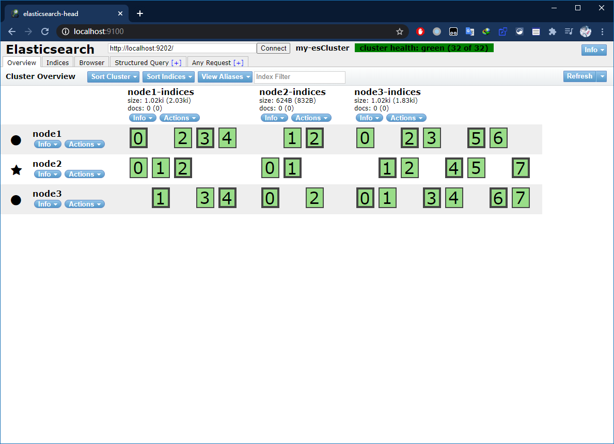