# 前言

> - 本篇将通俗了解一下环境变量。

# 引例

- 我们用`Java JDK`作为例子，宇宙人都知道在`Windows`中，`javac.exe`就是`Java Compile`编译器，它可以把`xxx.java`文件编译成`JVM`所能理解的字节码文件`xxx.class`，而`java.exe`可以把该字节码文件转为二进制机器码。
- 最终这些二进制机器码就是电脑所能理解的语言，它会根据这些二进制机器码来按部就班地执行一些你编写好的指定操作。

# 命令行

- 从前教学里，会直接让你下载安装`Java JDK`，之后让你进入`/bin`目录下，你就能看到`javac.exe`和`java.exe`这两个可执行文件了。
- 然后老师就让你在此目录下写一个`HelloWorld.java`文件：

```java
public class HelloWorld {
    public static void main(String[] args) {
        System.out.println("Hello, world!");
    }
}
```

- 接着老师就让你直接在此处打开终端（`Windows下是cmd`），然后键入以下命令去编译和运行，有了以下代码：

```bash
javac HelloWorld.java
java HelloWorld
```

- 最后就啥都没有解释，就去配置环境变量啦，然后开`IDEA`啦，开始写啦巴拉巴拉。

# 可执行程序

- 先说说可执行程序，举个例子`NotePad++`。双击点开`NotePad++`，你可以在进程管理器中看到它的进程`notepad++.exe`，这个就是可执行程序。

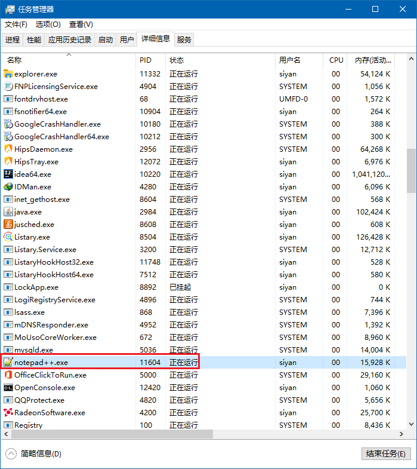

- 而所有的可执行程序都可以在终端中使用命令的方式执行，产生和类似鼠标双击打开软件的效果。
- 我们找到`notepad++.exe`所在的路径`C:\Program Files\Notepad++\notepad++.exe`，并在终端中敲入以下命令：


- 注意，如果可执行程序的绝对路径中有空格，则需要将路径包裹在双引号`""`中，否则`cmd`无法识别。所以大家还是早日舍弃`cmd`吧，太坑了。
- 回车运行命令，你会发现一个新的`notepad++`窗口打开了，这完全等同于鼠标双击`notepad++`软件快捷方式的操作。
- 如果你想打开一个`notepad++`文档呢？假如桌面上有一个`notepad++`文档`abc.txt`，使用鼠标，你可以轻松右键指定它在`notepad++`中打开，那么使用终端，如何完成一样的操作？
- 很简单，通过添加参数即可，某种程度上来说，它可以比鼠标操作得更快：

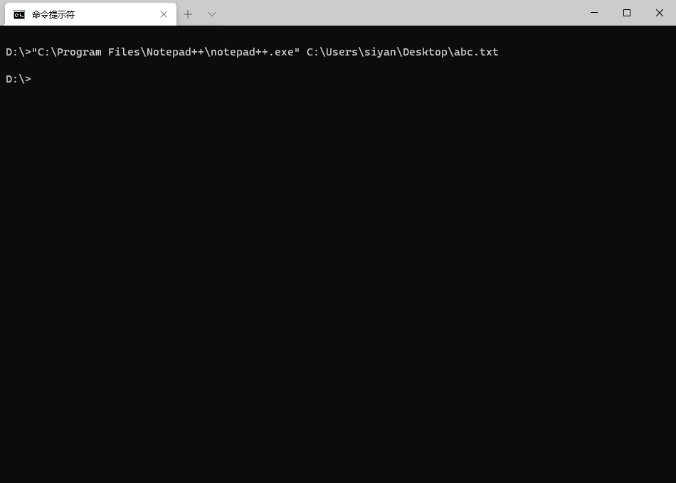

- 其中，`C:\Program Files\Notepad++\notepad++.exe`是可执行程序的绝对路径，在它后面添加参数`C:\Users\siyan\Desktop\abc.txt`，该参数为指定文档的绝对路径，敲击回车键后即可打开目标文档`abc.txt`。
- 目前可以理解为，可执行程序就是一些以`.exe`为后缀的文件，可以单独使用它们，也可以通过添加参数使用它们。
- 而一些特定的可执行程序如`javac.exe`、`java.exe`等，无法单独运行，必须通过指定参数或选项才能使用它们。

# 终端里的可执行程序

- 以下都以`Windows`为例子。
- 所有可在终端`cmd`中运行的可执行程序，都需要存在于当前的路径下或者存在于系统环境变量中的`Path`变量下。否则你只能使用相对或绝对路径找到该可执行程序并调用该可执行程序，即使用可执行程序有三种方法：
  1. 去到该程序所在的目录下，打开终端，可以直接调用该可执行程序；
  2. 不进入程序所在的目录，但在终端中，使用相对路径或绝对路径找到该程序，之后调用该可执行程序；（前一小节的方法）
  3. 如果你既不想进入该程序所在的目录，也不想使用相对路径或绝对路径调用，也就是你想在任何地方都可以通过可执行程序的名字去调用指定的可执行程序，那么你就需把目标可执行程序的绝对路径，添加到环境变量中的`Path`里。
- 在`Path`中添加绝对路径之后，你在任何地方输入可执行程序的名字，系统会优先判断你是否使用了相对路径或绝对路径调用可执行程序，如果没有，系统则接着会在此终端所在的当前目录下找这个可执行程序，如果找不到，则最终会到`Path`中配置的所有绝对路径中找这个可执行程序，如果还是没有则提示没有该命令（也就是没有目标可执行程序）。

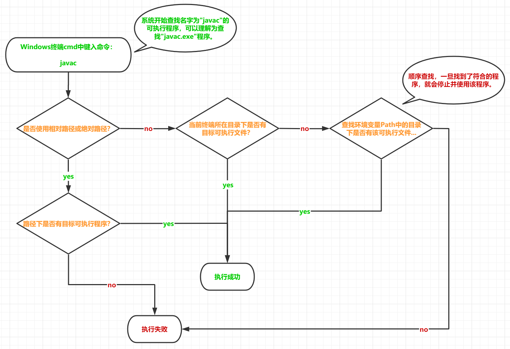

- 所以配置环境变量，是为了更快捷地操作，也是为了一些软件可以快速调用相关的命令进行文件的编译和执行，如同`IDEA`一样，`IDEA`需要依赖`Java JDK`环境，它编译和执行`Java`代码的时候，肯定不是使用图形界面的，底层还是命令行。`IDEA`在项目结构中就会要求使用者输入完整的`JDK`路径，事实上`IDEA`编译和执行程序使用的就是这个绝对路径。
- 像`Maven`或者`Tomcat`这种，它不要求你提供完整的`JDK`路径，但要求你要有一个`JAVA_HOME`的环境变量，`JAVA_HOME`变量存储的值实际上就是`JDK`的绝对路径，相当于间接提供了`JDK`的绝对路径。
- 扩展，并不是所有的终端都是按照流程图中的顺序来检索可执行命令的，例如`Windows`下如果你使用的是`Git Bash`，他不会优先检索当前目录下是否有该执行文件，而是优先检索环境变量`Path`目录中是否有符合要求的目录拥有该执行文件。

# 详细的示例

- 将使用三种方式调用`javac.exe`编译`HelloWorld.java`，同时使用`java.exe`执行`HelloWorld.class`。
- 我的`JDK`目录位于`D:\Document\JavaFiles`下，版本为`9.0.4`。

## 1. 进入目录调用程序

- 进入可执行程序`javac.exe`和`java.exe`所在的目录`D:\Document\JavaFiles\bin`下：

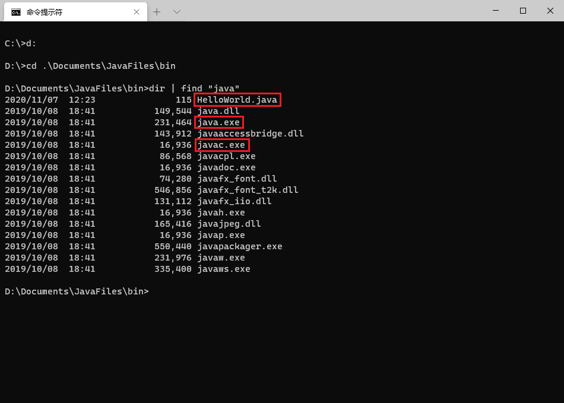

- 查看当前目录下的文件，可以看到`javac.exe`、`java.exe`和`HelloWorld.java`文件都在同一个目录下，使用`javac.ext`命令编译`.java`文件，并使用`java.exe`执行`.class`文件：

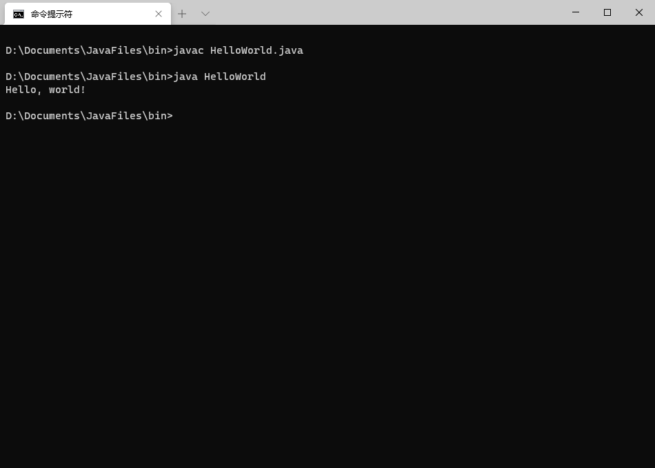

- 其中需要说明的是，可执行程序的后缀`.exe`在调用时可以省略，也就是你也可以写上后缀，都是允许的：

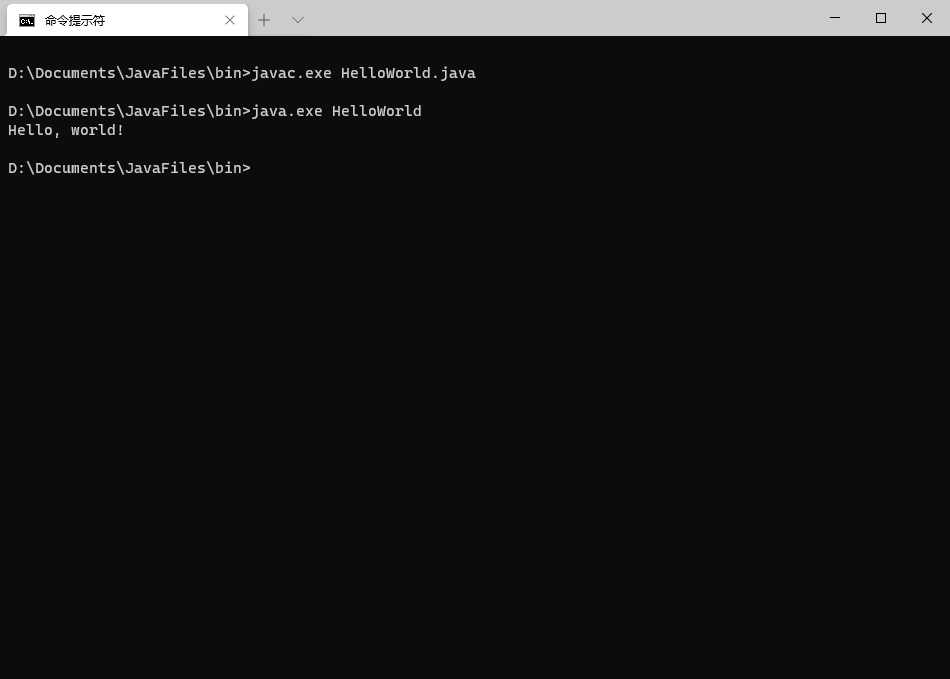

- 而执行二进制文件`.class`的时候，不允许带上`.class`的后缀，这是非法的，一旦写上了会报错：

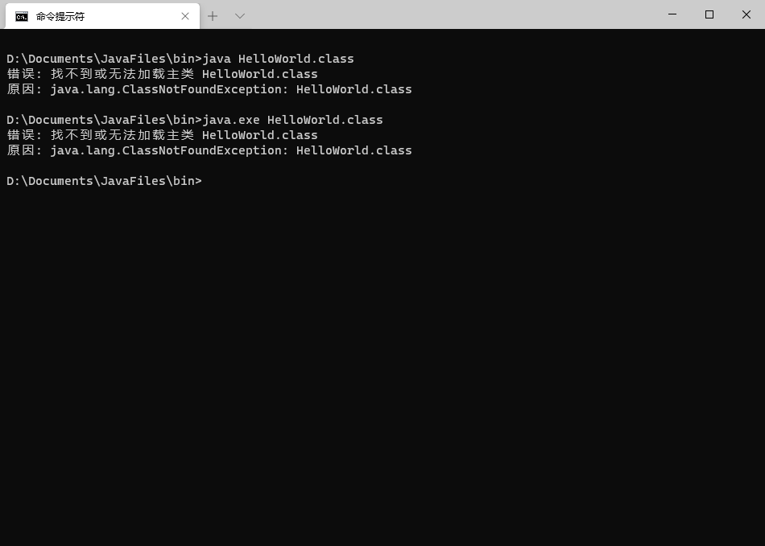

## 2. 使用路径调用程序

- 接下来我们在`E`盘中调用位于`D`盘中的`Java`编译和执行程序。
- 由于位于不同的系统盘下，只能使用绝对路径，命令如下：

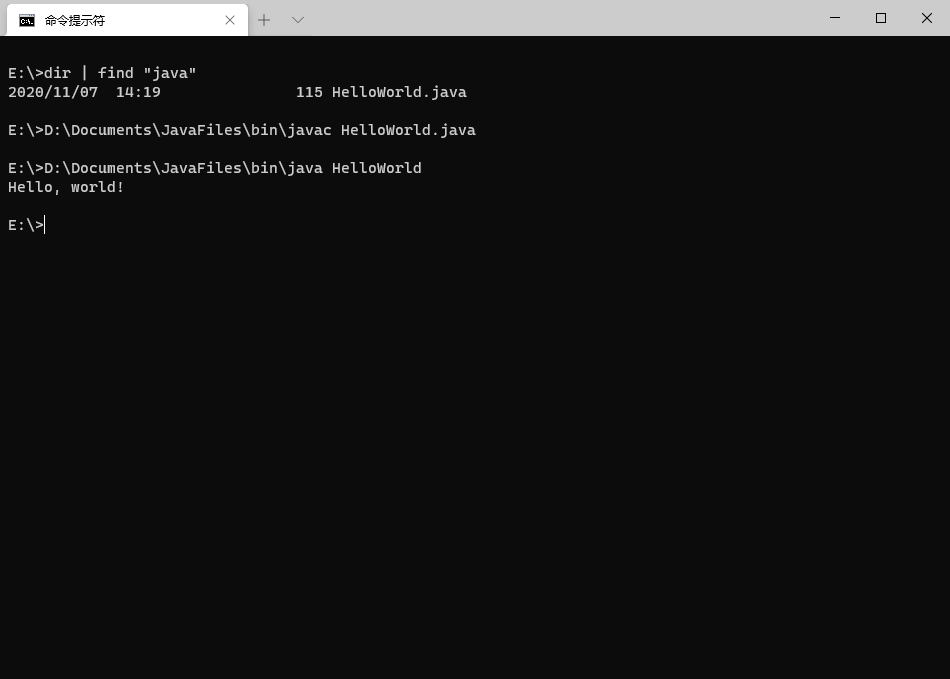

- 我们使用了绝对路径`D:\Documents\JavaFiles\bin\javac`和`D:\Documents\JavaFiles\bin\java`分别编译和执行了当前目录下的`HelloWorld.java`程序，其中编译后的`HelloWorld.class`文件也在当前目录下：

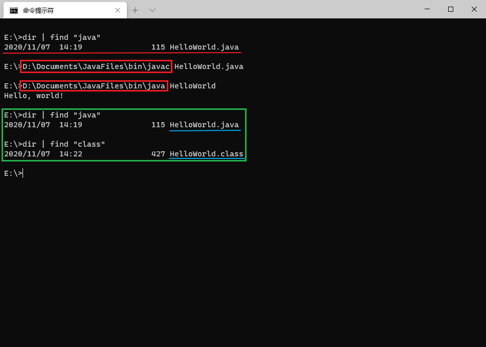

- 相对路径是一样的操作，只要`.java`在`JDK`所在的目录即可使用相对路径。
- 需要注意的是，手动测试的时候`.java`文件尽量不要使用相对路径或绝对路径，这涉及到需要修改`.java`中的`package`，虽然可以，但是没必要。平时添加`package`是`IDEA`帮忙完成的，但是你可能不知道其实这是`JVM`需要读取路径。
- `package`将作为扩展知识，在配置完环境变量的时候作讲解。

## 3. 配置环境变量调用程序

- 如果你既不想要每次编译`.java`文件的时候进入目录，或者在任意目录下编译文件的时候输入冗长的相对路径或绝对路径，那么你需要将`javac.exe`和`java.exe`所在的目录，添加到系统环境变量`Path`中。

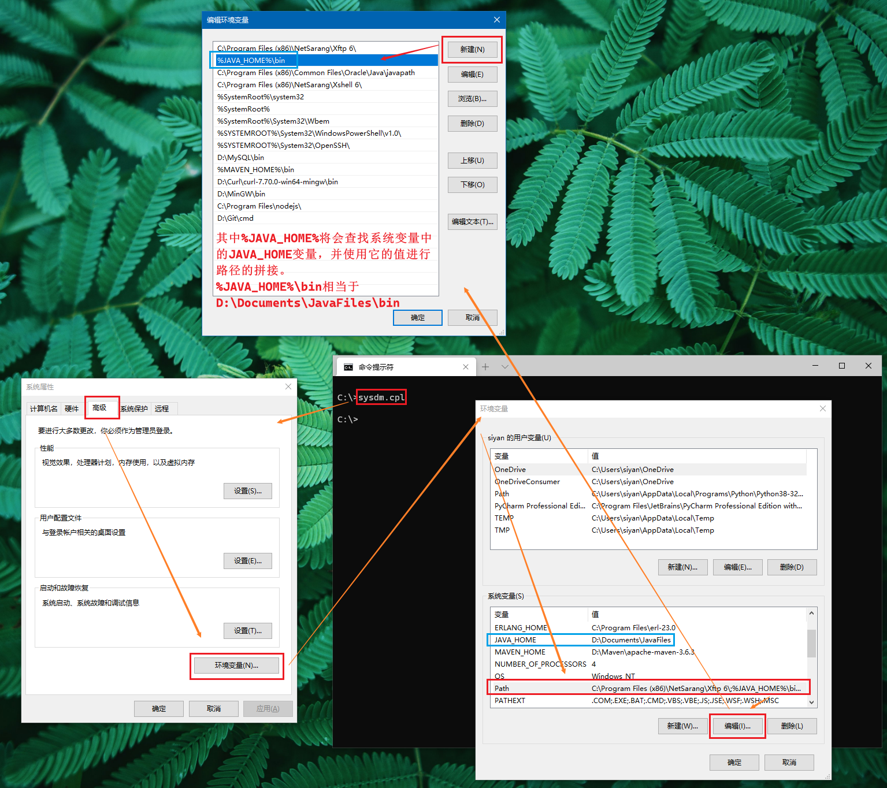

- 环境变量中的系统变量指的是全局变量，不论你登录用户是谁，都可以使用系统变量中配置的东西；而用户变量指的是当前登录用于所能使用的变量。一般我们进行`Java`配置都会直接配置系统变量。
- 其中系统变量中的变量`Path`，就是终端`cmd`中查找可执行程序的目录集合。
- `JAVA_HOME`变量是一些软件要去提供的环境变量，因此需要配置上，这个是`JDK`的根目录。自然，在配置`Path`变量的时候，我们可以引用`JAVA_HOME`变量，与`\bin`目录作拼接，那么就相当于在`Path`中添加了路径`D:\Documents\JavaFiles\bin`。

- 至此，我们可以在任何地方打开终端，直接输入可执行程序的名称`javac`或`java`，都可以通过环境变量Path自动搜索定位到目录`D:\Documents\JavaFiles\bin`下的可执行程序`javac.exe`或`java.exe`。

- 许多依赖`JDK`环境的程序，实际上都是使用命令的方式使用`java`，它们不会自己主动去寻找可执行程序，所以用户你至少需要告诉它们的是`JDK`目录在哪（`JAVA_HOME`变量：`D:\Documents\JavaFiles`），或者是`javac.exe`和`java.exe`在哪（`Path`变量：`%JAVA_HOME%\bin`），这就是配置环境的意思。
- 同样我们使用`HelloWorld.java`作为示例，现在我们可以在任意地方直接使用命令（或者称为可执行程序）`javac`和`java`了，配置了环境变量`Path`后，系统会自动定位命令所在的位置：

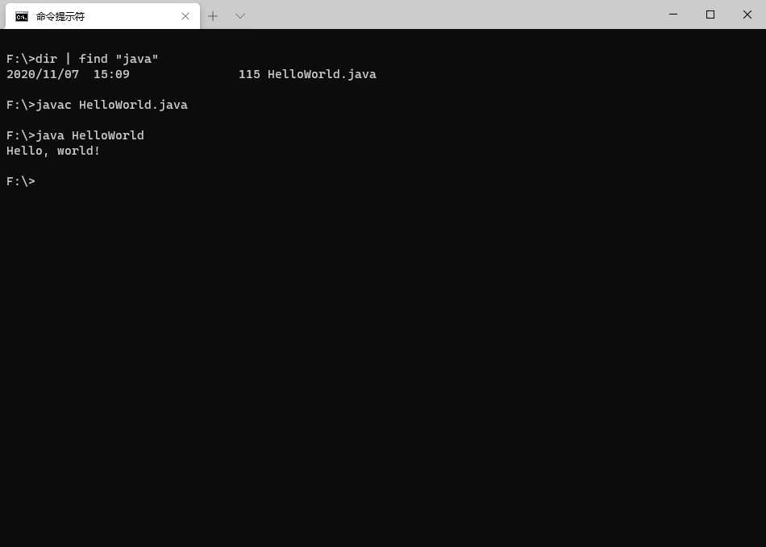

# 扩展

## 1. 关于自动定位程序

- 我们知道了配置了环境变量`Path`之后，终端会自动在`Path`中的路径里，找到命令所在的目录。那么假如`Path`中配置了两个目录，里面有相同的可执行程序，而恰巧你在终端中用到了该命令，会发生什么？

- 现实中是有可能发生这样的情况，例如在我环境变量中，有这样两个`Path`值：

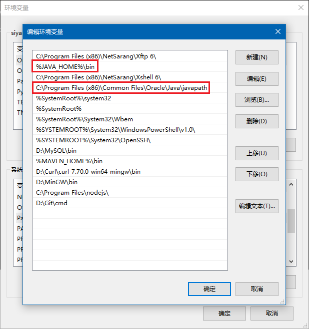

- 进入相关的目录会发现，这两个环境变量值所指向的目录中，都拥有一个可执行程序`java.exe`，也就是用于执行`.class`文件的可执行程序，并且一个为`Java 9`版本，而一个是`Java 1.8`版本：

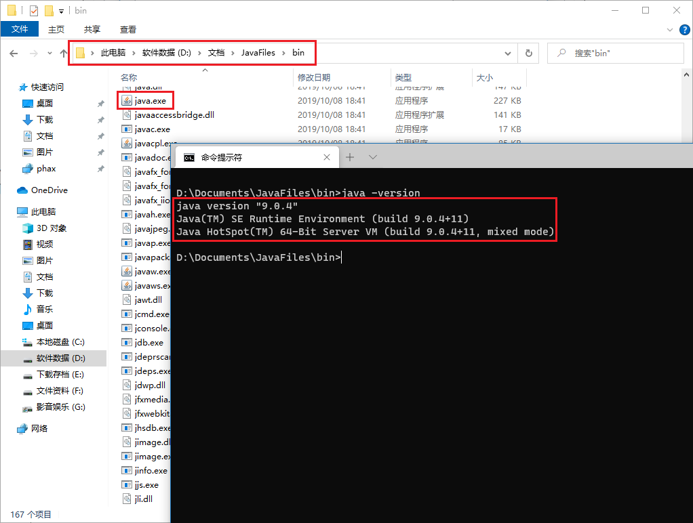

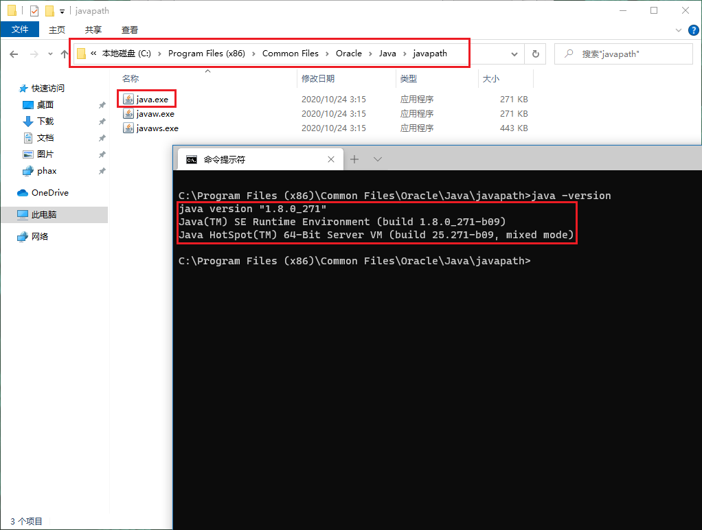

- 假设我们需要编译一个文件`Happy.java`并使用`java`命令执行编译后的`.class`文件，在不改变环境变量配置顺序的情况下，我们去到`F`盘中编译并运行，我们会得到以下的结果：

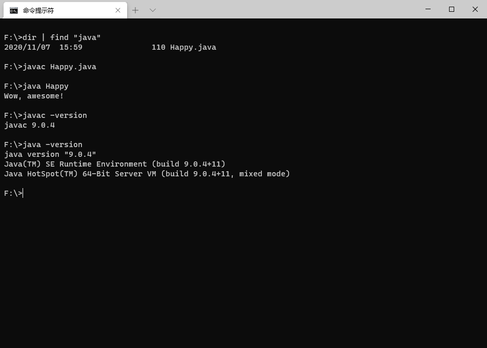

- 会发现并没有问题，此时我们查看一下`javac.exe`和`java.exe`的版本，同为`9.0.4`没问题。
- 但现在我修改一下`Path`环境变量中，都拥有`java.exe`可执行文件的目录的顺序，修改成以下顺序：

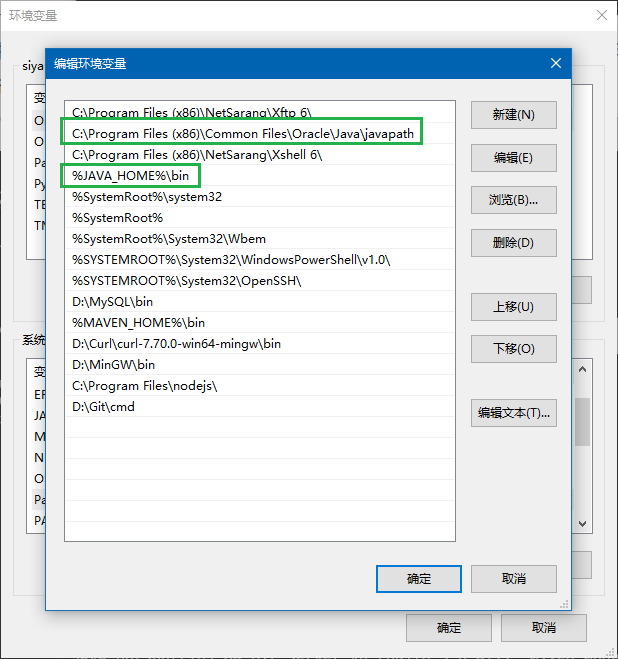

- 修改环境变量后，需要重启终端才能使设置生效，否则当前终端将沿用未更改前的环境变量配置。
- 重新打开终端，并进入`F`盘中，再次执行命令，会发现报错了：

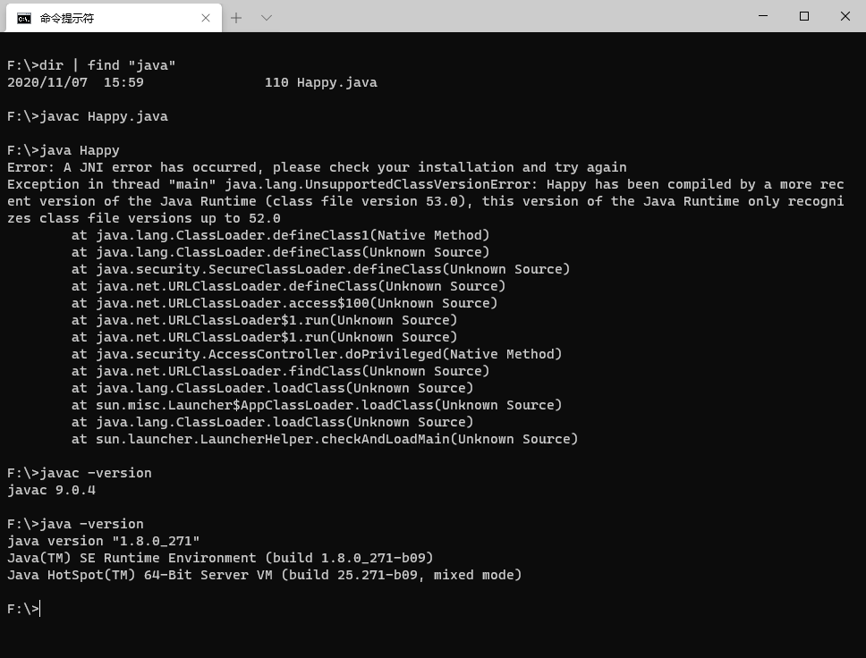

- 此时`java.exe`的版本与编译`.java`文件的版本不一致，导致了此后的执行出错。
- 由此也证明了，终端`cmd`中查找命令的方式是顺序查找，一旦找到了就会停止并使用当前所查找到的命令，因此需要务必需要注意环境变量`Path`中的目录顺序。

## 2. 关于package包路径

- 此前我们编译的`.java`文件都是没有设置包名的，也都是通过直接在当前目录下创建并编译执行的方式去做实验，那么包名代表着什么呢？假设有一个`Fan.java`文件，其中配置了`package`，如下：

```java
package House;

public class Fan {
	public static void main(String[] args) {
		System.out.println("Hey, it's fan here.");
	}
}
```

- 同样的我们使用Java来编译并执行它，会发现程序在执行的时候报错了：

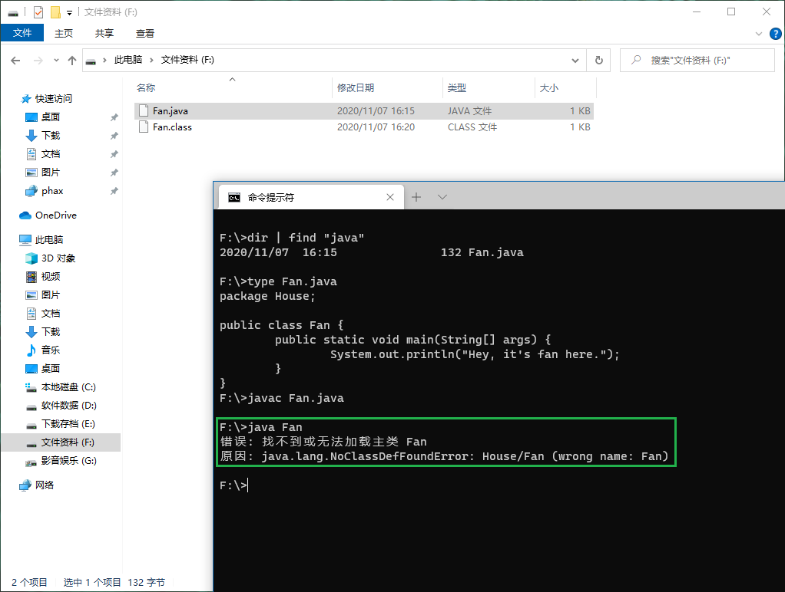

- 原因是无法找到该类，怎么回事，`Fan.class`就存在于当前目录下，为什么找不到？
- 原因很简单，是因为`.java`中设置了`package`为`House`。那么默认情况下，执行`java.exe`程序的位置必须拥有`House`目录且目录中必须要包含`Fan.class`文件。
- 可以理解为，`package`参数定义了可执行程序`java.exe`和二进制文件`Fan.class`的相对位置。

- 为了验证，我们在桌面上创建了一个目录`House`，并将编译好的`Fan.class`文件放入`House`目录中，同时我们在桌面路径上使用`java.exe`执行`House`目录中的`Fan.class`：

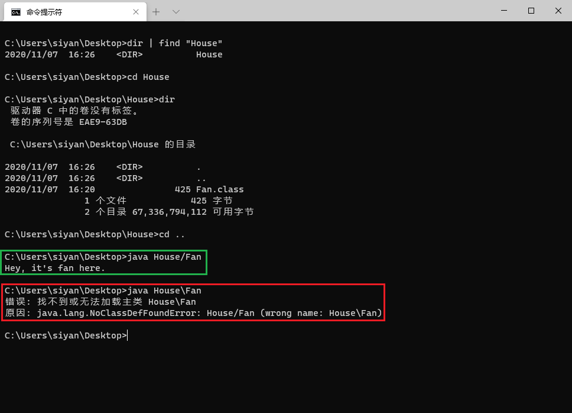

- 需要务必注意的是，此时调用`Fan.class`文件的相对路径，不能使用反斜杠`\`，否则会报错。

- 因此在你知道了报名`package`和相对路径之间的关系之后，也可以选不在当前终端所在的目录下编译和执行`Java`文件了，但仍然无法实现的是在不同盘符下编译和执行`Java`文件。
- 因为`Windows`系统中不存在根目录`/`的概念，如果运行终端的位置位于`C`盘，而`.java`文件位于`D`盘，那么必须要通过盘符定位到`.java`文件所在的目录，同样需要通过盘符定位到`.class`所在的目录，而`package`不本身并不支持盘符路径。

