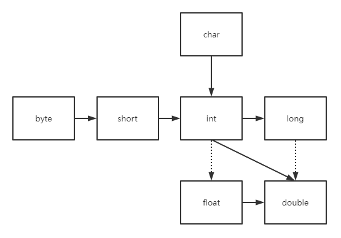

### Java 概述

1. Java 是一门面向对象的编程语言；
2. Java 主要用于编写网络应用程序的后台逻辑，如网页的后台、Windows 应用程序或手机 App 等，它们一般的后台逻辑主要都是使用 Java 进行编写的；
3. Java 是一门高级的编程语言。所谓的高级语言，都是由基础语言编写而成的，Java 也不例外；
4. Java 的代码运行在 JVM 上，其之所以拥有多平台的可移植性也基于这点。

### 数据类型

学习任何一门计算机语言，其伊始的步骤是了解该门语言中的数据类型。了解了数据类型，你才能更好地声明、赋值和使用它们。

 Java 中的数据类型分为两大类，也仅有这两类：

1. 基本数据类型；
2. 引用数据类型。

以下是基本数据类型的具体分类：

|         类型         |                          大小及范围                          |
| :------------------: | :----------------------------------------------------------: |
|    byte（字节型）    |                      1 个字节，-128~127                      |
|   short（短整型）    |                    2 个字节，-32768~32767                    |
| int（整型/默认类型） |                   4 个字节，-2^31^~2^31^-1                   |
|    long（长整型）    |                   8 个字节，-2^63^~2^63^-1                   |
| float（单精度浮点）  | 4 个字节，-3.40282347E+38F\~3.40282347E+38F（有效位数 6~7 位） |
| double（高精度浮点） | 8 个字节，-1.79769313486231570E+308~1.79769313486231570E+308（有效位数 15 位） |
|     char（字符）     |                      2 个字节，0~65535                       |
|  boolean（布尔型）   |                     1 个字节，true/false                     |

各基本数据类型间的转换关系，实线表示可以安全进行转换，虚线则表示会丢失部分精度。



除开基本数据类型之外的所有类型，都是引用数据类型（包括数组，数组算一种特殊的类）。

### 流程控制

学习完数据类型之后，需要了解如何控制代码的逻辑，Java 中所提供的流程控制语句主要有三类：判断、选择、循环。

#### 1. 判断语句

关键字：if、else、else if

```Java
public class Demo03IfExample {
    public static void main(String[] args) {
        int num = 10;

        if (num < 0) {
            System.out.println("It's less than zero.");
        } else if (num >= 0 && num < 10){
            System.out.println("It's more than zero but less than ten.");
        } else {
            System.out.println("It's at least equal to ten.");
        }
    }
}
```

#### 2. 选择语句

关键字：switch、case、break

```Java
public class Demo03SwitchExample {
    public static void main(String[] args) {
        int num = 4;

        switch (num) {
            case 1:
                System.out.println("It's one.");
                break;
            case 2:
                System.out.println("It's two.");
                break;
            case 3:
                System.out.println("It's three.");
                break;
            default:
                System.out.println("I don't know.");
                break;
        }
    }
}
```

#### 3. 循环语句

关键字：for

```Java
public class Demo03ForExample {
    public static void main(String[] args) {
        for (int num = 3; num > 0; num--) {
            System.out.println("Now is " + num); // 3、2、1
        }
    }
}
```

关键字：while、do...while

```Java
public class Demo03WhileExample {
    public static void main(String[] args) {
        int num = 3;

        while (num-- > 0) {
            System.out.println("I am " + num); // 2、1、0
        }

        System.out.println("================");

        do {
            System.out.println("I am " + num); // -1、0、1、2、3
        } while (num++ < 3);

        System.out.println("================");
        System.out.println("Finally, I am " + num); // 4
    }
}
```

流程控制过程中，一般还会涉及到 break、continue 两个用于中断流程的关键字，但一般情况下较少使用。

### 类的构成

类通常具有两个重要的元素，其分别是：字段/变量、方法。除开字段与方法之外，类中还可编写内部类、内部枚举类、内部抽象类、嵌入/内部接口和内部注解等类型。

类中的字段与方法，将根据其是否由关键字 static 修饰，而被进一步细分为成员变量、成员方法和静态变量、静态方法。

注意，通常这些称谓并不是唯一的，变量也被称作字段，静态二字也可以被替换为类。

```Java
public class Some {
    static int classField; // 静态变量
    int instanceField; // 成员变量

    static void classMethod() {
        // 静态方法
    }

    void instanceMethod() {
        // 成员方法
    }

    private void sample() {
        class MethodInnerClass {
            // 方法内部类  
        }
        MethodInnerClass methodInnerClass = new MethodInnerClass();
    }

    enum NormalEnum {
        // 内部枚举类
    }

    interface NormalInterface {
        // 嵌入/内部接口
    }

    @Target(ElementType.METHOD)
    @Retention(RetentionPolicy.RUNTIME)
    @interface Any {
        // 内部注解
    }

    class NormalClass {
        // 内部类
    }

    abstract class AbstractClass {
        // 内部抽象类
    }
}
```

其中，需要注意的是方法内部类：

- 方法内部类的定义必须在其实例化代码之前，否则编译器将报错。

### 访问修饰符

访问修饰符（Access Modifier）是 Java 中的四个关键字，可以看作是访问权限的关键字，同时访问修饰符不可同时在同一变量、方法或类上使用。

访问修饰符的类型及作用如下：（假设所有的普通类均由 public 关键字修饰，此时访问修饰符仅作用于成员变量、成员方法及内部类）

| Access Modifier |              Usage               |
| :-------------: | :------------------------------: |
|     public      |   所有同包、非同包的类均可访问   |
|    protected    | 仅限同包的类、非同包的子类可访问 |
|    (default)    |        仅限同包的类可访问        |
|     private     |          仅限当前类访问          |

对于普通类（非内部类）而言，仅有 public、默认修饰符适用。

```Java
public class Some {
    // 访问修饰符用于修饰成员变量
    public int a = 1;
    protected int b = 2;
    int c = 3;
    private int d = 4;
    
    // 访问修饰符用于修饰成员方法
    public void methodA() {
        System.out.println("MethodA.");
    }
    
    protected void methodB() {
        System.out.println("MethodB.");
    }
    
    void methodC() {
        System.out.println("MethodC.");
    }
    
    private void methodD() {
        System.out.println("MethodD.");
    }
    
    // 访问修饰符用于修饰内部类
    public class InnerClassA {
        //..
    }
    
    protected class InnerClassB {
        // ..
    }
    
    class InnerClassC {
        // ..
    }
    
    private class InnerClassD {
        // ..
    }
}
```

问：为什么普通类不可以使用 protected 或 private 修饰？

对于子类继承父类，如果此时两个类位于不同的包，那么父类必然是使用 public 关键字修饰的普通类。换言之，如果一个类使用了非 public 关键字修饰，那么该类的子类必然不会存在于本包之外。

假设一个类允许使用 protected 修饰，根据该关键字的定义，它必须要满足非同包的子类可访问；而有且仅有类使用 public 关键字修饰的情况下，它才可能拥有非同包的子类。显然，这有悖于 protected 关键字的使用原则。

同样地，假设一个类允许使用 private 修饰，那么这表示有且仅有它自己能访问自己，没有任何一个其他的类具有本类的访问权，以至于它无法在任何一个类中进行初始化操作，显然该类的存在没有任何意义，因此 private 修饰普通类也是不合理的。

因此，有且仅有使用 public、默认访问修饰符等关键字时，可以在不违背其修饰符定义的前提下，完成对普通类的修饰。

### 常用关键字

Java 中还会经常出现以下三个常用关键字：static、final、abstract。

#### 1. static

关键字 static 通常用于修饰变量、方法或内部类等。被 static 关键字修饰的元素，是属于类的元素，通常被称为静态变量、静态方法、静态内部类，亦可称作类变量、类方法、类内部类。

在访问权限（Access Modifier）允许的情况下，其他类可以直接通过类名加对应 static 关键字修饰的元素名称，完成对对应变量、方法或内部类的访问。

```Java
public class Some {
    public static int a = 1;

    static void methodSome() {
        System.out.println("MethodSome.");
    }

    static class InnerClass {
        private void methodSome() {
            // 与方法访问成员变量的规则一致，在不存在对应局部变量的情况下，会向上查找相关的成员变量
            System.out.println(a);
        }
    }
}

// 同一文件下的其他非public修饰的类，算做同包下的其他类
class OutsideClass {
    Some.InnerClass innerClass = new Some.InnerClass();

    public void methodSome() {
        System.out.println(innerClass);
    }
}
```

项目在加载后，在需要用到这些类元素的地方，可以通过类名加对应元素的名称进行调用。仅有非 static 修饰的元素，需要通过实例化对象进行调用，因为这些元素是属于对象的。

内部接口 interface 视为特殊的静态内部类，所有在类中的 interface 均已默认使用 static 进行修饰：

```Java
public class Some {
    int num = 1;

    Else.InnerInterface innerInterface = () -> {
        // lambda表达允许修改非final修饰的基本数据类型的成员变量的值，局部变量在Java8后默认使用final进行修饰，因此不可更改
        num = 2;
    };

    @Test
    public void test() {
        innerInterface.abstractMethod();
        Assert.assertEquals(2, num);
    }
}

class Else {
    interface InnerInterface {
        void abstractMethod();
    }
}
```

在一个类中，由于加载先后的问题，使用 static 修饰的字段、方法或内部类中，不可以引用无 static 修饰的字段、方法或内部类。因为类的加载总是先于类的实例化，而类在加载时就会初始化所有使用 static 修饰的元素，此时无 static 修饰的元素是无法越过类的加载去优先进行实例化的，此条为 Java 中代码的既定规则。

相反，无 static 修饰的字段、方法或内部类，可自由调用使用了 static 修饰的字段、成员方法或内部类。类加载总是优先于类的实例化，因此有 static 修饰的字段、方法或内部类早已在类实例化前完成了加载操作。

#### 2. final

关键字 final 可用于修饰变量、方法和类，这里的类不局限于内部类，普通类亦可使用 final 修饰。

关键字 final 用于修饰变量时，根据变量类型的不同，而有所差异：

1. 当修饰的变量是基本数据类型时，则表示该变量的值不可变；
2. 当修饰的变量是引用数据类型时，则表示改变量的地址不可变。

```Java
public class Some {
    private final int a = 1;
    private final int[] b = new int[]{1};

    @Test
    public void test() {
        // a = 2; 无法通过编译器检查
        b[0] = 2;

        Assert.assertEquals(1, a);
        Assert.assertEquals(2, b[0]);
    }
}
```

关键字 final 用于修饰方法时，表示该方法不可被覆写（override）。

```Java
public class Some {
    final void method() {
		// ..
    }
}

class Else extends Some {
    // void method() {} 编译报错，无法override
}
```

关键字 final 用于修饰类时，表示该类不可被继承（extends）。String 类就是典型的 final 类，该类不可被继承。覆写的前提是继承，如果类无法被继承，自然类中的方法均无法被覆写。

#### 3. abstract

关键字 abstract 无法与关键字 static 一起使用，从类加载的角度看，类在完成实例化前，就必须先加载所有的静态元素。类加载时无法人为进行干扰，如果此时某个静态方法是抽象方法，会导致类加载直接失败。由此可见，抽象方法不可能是静态方法。

关键字 abstract 共有两个用法：

1. 用于声明一个方法是抽象方法，有且仅有抽象类或接口中可以拥有抽象方法；
2. 用于声明一个类是抽象类，该类可以是内部类。

以下代码会在一个抽象类中编写一个抽象方法，并在同包的其他类中使用匿名内部类实例化该类：

```Java
public class Some {
    @Test
    public void test() {
        // 使用匿名内部类的方式去实例化Some对象，注意仅有接口可以使用lambda表达式简化实例化过程
        Else elseInstance =new Else() {
            @Override
            void specialMethod() {
                System.out.println("..");
            }
        };
    }
}

abstract class Else {
    // 包含抽象方法的类一定是抽象类，但抽象类不一定包含抽象方法
    abstract void specialMethod();
}
```

对于抽象类的实例化，要么是编写一个继承抽象类的实体类，去实例化该实体类；要么就是借助匿名内部类的方式，在实例化的同时覆写该抽象类中的抽象方法。

以下代码会在一个接口中编写一个抽象方法，并在同包的其他类中使用 lambda 表达是实例化该接口：

```Java
public class Some {
    @Test
    public void test() {
        Else elseInstance = () -> System.out.println("..");
    }
}

interface Else {
    // 接口中的抽象方法默认已使用public static abstract进行修饰，可省略代码的编写
    void specialMethod();
}
```

假如在抽象类中的是抽象内部类，那么会发生什么？

以下代码会在一个抽象类中，编写一个抽象的内部类，并试图在另一个类中对该抽象内部类进行实例化操作：

```Java
public class Some {
    @Test
    public void test() {
        Else elseInstance = new Else() {
        };

        // 非静态内部类的实例化，格式为：new Object().new ObjectInnerClass()
        Else.NormalInnerClass normalInnerClass = elseInstance.new NormalInnerClass();
        
        Else.InnerClass innerClass = elseInstance.new InnerClass() {
            @Override
            void innerMethod() {
                System.out.println("..");
            }
        };
    }
}

abstract class Else {
    class NormalInnerClass {

    }

    abstract class InnerClass {
        abstract void innerMethod();
    }
}
```

此时内部类没有使用 static 修饰，意味着该内部类属于对象，而非类。那么此时如果需要获取 InnerClass 的实例化对象，那么需要先获取到 Else 的实例化对象。

最后，对于 abstract 关键字在类上的使用，有几点需要注意的地方：

1. 使用 abstract 关键字修饰的类，是抽象类，但抽象类可以不具有抽象方法；
2. 具有抽象方法的类，一定是抽象类，必须使用 abstract 关键字进行修饰；
3. 仅具有抽象内部类的类，并不是抽象类，不需要使用 abstract 关键字进行修饰。

### 抽象类

什么是抽象类？使用 abstract 关键字修饰的类就是抽象类。抽象类与普通类有两点区别：

1. 抽象类无法直接实例化，而普通类则可以；
2. 抽象类中可以定义抽象方法，而普通类则不可以。

抽象类的实例化方式共有两种：

1. 借助抽象类的子类，让该子类覆写抽象类中所有的抽象方法为普通的成员方法；
2. 借助匿名内部类，在实例化该类时覆写其中的所有抽象方法。

问：抽象类与普通类的区别？

1. 抽象类中可以包含普通类中可以拥有的所有元素，唯一不同点是抽象类中可以具有抽象方法，而普通类则不行；
2. 抽象类无法直接进行实例化，而普通类可以。

### 接口

接口在 Java 编程语言中是一个抽象类型，是抽象方法的集合，通常以 interface 来声明。一个类通过实现接口的方式，来覆写接口中的抽象方法。注意，接口并不是类，编写接口的方式和类很相似，但是它们属于不同的概念。

问：接口中可以拥有的常用元素有哪些？

|          元素           |                    备注                    |
| :---------------------: | :----------------------------------------: |
|          常量           |   隐式使用 public static final 进行修饰    |
|        抽象方法         |     隐式使用 public abstract 进行修饰      |
| 静态方法（Java 8 新增） | 显式使用 static、隐式使用 public 进行修饰  |
| 默认方法（Java 8 新增） | 显式使用 default、隐式使用 public 进行修饰 |
| 私有方法（Java 9 新增） |         显式使用 private 进行修饰          |

```Java
public interface Sample {

    int CONSTANT_NUM = 2;
    
    void abstractMethod();
    
    static void staticMethod() {
        // ..
    }
    
    default void defaultMethod() {
        // ..
    }
    
    private void privateMethod() {
        // ..
    }
}
```

与类相同，除开字段与方法之外，接口中还可编写内部类、内部枚举类、内部抽象类、嵌入/内部接口和内部注解等类型，这些类型无法选择访问修饰符的类型，默认值为 public，且同时隐式使用 static 进行修饰（枚举类例外，但亦可通过接口名直接访问）。

```Java
public interface Some {
    enum NormalEnum {
        // 内部枚举类
    }

    interface NormalInterface {
        // 嵌入/内部接口
    }

    @Target(ElementType.METHOD)
    @Retention(RetentionPolicy.RUNTIME)
    @interface Any {
        // 内部注解
    }

    class NormalClass {
        // 内部类
    }

    abstract class AbstractClass {
        // 内部抽象类
    }
}
```

问：接口与类的区别：

1. 接口可直接进行实例化；
2. 接口不具有构造方法；
3. 接口不具有静态代码块或代码块
4. Java 8 之前，接口中所有的方法必须是抽象方法；Java 8 新增了静态方法和默认方法，Java 9 新增了私有方法；
5. 接口中的变量只能是使用 public static final 修饰的常量；
6. 接口不能被类继承了，但需要被类实现；
7. 接口支持多实现，类仅支持单继承；
8. 接口中除开私有方法外，其他所有方法其使用的访问修饰符有且只能是 public，它也是默认的隐式访问修饰符；
9. 接口中声明的内部元素均隐式使用 public 修饰；除内部枚举类外，其他内部元素同时隐式使用 static 修饰。

接口与抽象类的区别，基本上等同于问接口与类的区别。

### 枚举类

枚举类是一个特殊的类，一般表示一组常量。关于枚举类的声明如下：

```Java
public class EnumTest {

    @Test
    public void test() {
        String currentSymbol = "EXTRA_LARGE";
        Size size = Enum.valueOf(Size.class, currentSymbol);

        // 比较两个枚举类型的值时，不需要使用equals，注意Size.EXTRA_LARGE的类型是Size，而不是String
        Assert.assertSame(size, Size.EXTRA_LARGE);
        
        // 额外信息为String类型
        Assert.assertEquals("XL", size.getExtraInfo());
        
        // 枚举类中的成员方法name()可以取出对应枚举类实例化对象所代表的值的String表示形式
        Assert.assertEquals(Size.EXTRA_LARGE.name(), SimpleSize.EXTRA_LARGE.name());
    }
}

/**
 * 枚举类Size中包含四个常量，其中可以使用小括号去定义该常量的一个或多个额外信息，该额外信息以String类型进行存储，
 * 需要作为私有构造器显式参数（形参）传入。因此，如果具备额外信息，则必须提供有参构造。
 * 此时定义Size类的私有字段extraInfo，将用于保存当前私有构造所传入的显式参数，即对应常量的额外信息。
 */
enum Size {

    SMALL("S"), MEDIUM("M"), LARGE("L"), EXTRA_LARGE("XL");

    private final String extraInfo;

    Size(String extraInfo) {
        this.extraInfo = extraInfo;
    }

    public String getExtraInfo() {
        return this.extraInfo;
    }
}

/**
 * 简单的枚举类。
 */
enum SimpleSize {
    SMALL, MEDIUM, LARGE, EXTRA_LARGE;
}
```

枚举类常用的获取实例化对象的方式有三种：

1. 枚举类中的枚举对象，实际相当于普通类中的常量，即可以直接通过类名加枚举常量名称获取；
2. 通过 Enum 中的静态方法 valueOf(..)，可以获取指定枚举类中指定名称的枚举类对象；
3. 通过指定枚举类的静态方法 valueOf(..)，可以获取指定名称的枚举类对象。

```Java
public class EnumTest {

    @Test
    public void test() {
        SimpleSize simpleSizeA = Enum.valueOf(SimpleSize.class, "MEDIUM");
        SimpleSize simpleSizeB = SimpleSize.valueOf("EXTRA_LARGE");

        Assert.assertSame(SimpleSize.MEDIUM, simpleSizeA);
        Assert.assertSame(SimpleSize.EXTRA_LARGE, simpleSizeB);

        int index = SimpleSize.SMALL.ordinal();
        Assert.assertEquals(0, index);

        SimpleSize[] values = SimpleSize.values();
        Assert.assertEquals(4, values.length);
    }
}

enum SimpleSize {
    SMALL, MEDIUM, LARGE, EXTRA_LARGE;
}
```

枚举类对象在对应枚举类中的索引位置，可以通过成员方法 ordinal() 获取；而指定枚举类中所提供的所有枚举类型，可以通过其提供的静态方法 values() 获取到对应的枚举类型数组。

### 注解

注解（Annotation）又称 Java 标注，是 JDK 5.0 引入的一种注释机制。Java 语言中的类、方法、变量、参数和包等都可以被标注。

Java 标注可以通过反射获取标注内容。在编译器生成类文件时，标注可以被嵌入到字节码中。

Java 虚拟机可以保留标注内容，在运行时可以获取到标注内容 ，当然它也支持自定义 Java 标注。

注解就像一个预设信息清单，程序如果需要自定义注解，那么必然会有对应的反射代码嵌入在程序内，用于获取对应注解对象。成功获取对应注解对象后，即可通过注解中提供的方法，获取到相关的当前预设信息。

```Java
@Target(ElementType.METHOD)
@Retention(RetentionPolicy.RUNTIME)
@interface Simple {
    String value() default "dylan";
}

public class AnnotationTest {

    @Test
    public void test() {
        try {
            Method annotationMethod = AnnotationTest.class
                    .getDeclaredMethod("annotationMethod");
            Simple simple = annotationMethod.getAnnotation(Simple.class);
            Assert.assertEquals("rose", simple.value());
        } catch (NoSuchMethodException e) {
            e.printStackTrace();
        }
    }

    @Simple("rose")
    public void annotationMethod() {

    }
}
```

注解事实上类似于接口，但不同的是注解中不支持声明静态方法、默认方法或私有方法。既然与接口类似，注解是否可以采用匿名内部类的方式获取到注解对象？答案是肯定的。

```Java
@Target(ElementType.METHOD)
@Retention(RetentionPolicy.RUNTIME)
@interface Simple {
    String value() default "dylan";
}

public class AnnotationTest {

    @Test
    public void test() {
        Simple simple = new Simple() {
            @Override
            public String value() {
                return "dylan";
            }

            @Override
            public Class<? extends Annotation> annotationType() {
                return Simple.class;
            }
        };

        Assert.assertEquals("dylan", simple.value());
        Assert.assertEquals("Simple", simple.annotationType().getSimpleName());
        Assert.assertNotEquals("Simple", simple.getClass().getSimpleName());
    }
}
```

其中，无法通过注解接口对象获取到对应的注解 class 对象。必须自行覆写注解中的抽象方法 annotationType()，自行定义此时的注解类型是什么。

事实上，注解如果在方法上被使用，那么该方法被加载时，Java 实际上默默完成了该注解实例化的过程。以上匿名内部类的实例化过程，其实完全等同于注解默认被加载的过程：

```Java
@Target(ElementType.METHOD)
@Retention(RetentionPolicy.RUNTIME)
@interface Simple {
    String value() default "dylan";
}

public class AnnotationTest {

    @Test
    @Simple
    public void test() {
        try {
            Method test = AnnotationTest.class.getMethod("test");
            Simple simple = test.getAnnotation(Simple.class);

            Assert.assertEquals("dylan", simple.value());
            Assert.assertEquals("Simple", simple.annotationType().getSimpleName());
            Assert.assertNotEquals("Simple", simple.getClass().getSimpleName());
        } catch (NoSuchMethodException e) {
            e.printStackTrace();
        }
    }
}
```

所有注解默认继承 Annotation 接口，注解继承自 Annotaion 接口的抽象方法 annotationType() 会在指定注解被加载时自动覆写，用于返回当前注解的 class 对象。

最后，关于关键字 default。它除了能应用在接口中的默认方法声明外，还能应用于注解中抽象方法默认值的定义。直接在抽象方法名之后使用 default 关键字，紧接着声明与此方法返回值类型对应的默认值即可。

