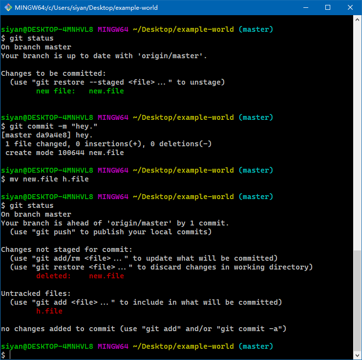

# 前言

> - 本篇将介绍如何使用Git。
> - Git Pro书籍：`https://git-scm.com/book/zh/v2`

# 版本控制

- 什么是“版本控制”？我为什么要关心它呢？ 版本控制是一种记录一个或若干文件内容变化，以便将来查阅特定版本修订情况的系统。在本书所展示的例子中，我们对保存着软件源代码的文件作版本控制，但实际上，你可以对任何类型的文件进行版本控制。
- 如果你是位图形或网页设计师，可能会需要保存某一幅图片或页面布局文件的所有修订版本（这或许是你非常渴望拥有的功能），采用版本控制系统`VCS`是个明智的选择。有了它你就可以将选定的文件回溯到之前的状态，甚至将整个项目都回退到过去某个时间点的状态，你可以比较文件的变化细节，查出最后是谁修改了哪个地方，从而找出导致怪异问题出现的原因，又是谁在何时报告了某个功能缺陷等等。使用版本控制系统通常还意味着，就算你乱来一气把整个项目中的文件改的改删的删，你也照样可以轻松恢复到原先的样子。但额外增加的工作量却微乎其微。

- 在编程中，版本控制`Revision Control`是一种在开发过程中用于管理我们对文件、目录或工程等内容的修改历史，方便查看更改历史记录，备份以便恢复以前的版本的软件工程技术，简单地说，就是用于管理多人协同开发项目的技术。
  - 实现跨区域多人协同开发
  - 追踪和记载一个或者多个文件的历史记录
  - 组织和保护你的源代码和文档
  - 统计工作量
  - 并行开发、提高开发效率
  - 跟踪记录整个软件的开发过程
  - 减轻开发人员的负担，节省时间，同时减低认为错误

- 没有进行版本控制或者版本控制本身缺乏正确的流程管理，在软件开发过程中将会导致很多问题的发生，如软件代码的一致性、软件内容的冗余、软件过程的事务性、软件开发过程中的并发性、软件源代码的安全性，以及软件的整合等问题。

# 什么是Git？

- `Git`是一个开源的分布式版本控制系统，用于敏捷高效地处理任何或小或大的项目。
- `Git`是`Linus Torvalds`为了帮助管理`Linux`内核开发而开发的一个开放源码的版本控制软件。
- `Git`与常用的版本控制工具`CVS`、`Subversion`等不同，它采用了分布式版本库的方式，不必服务器端软件的支持。

# 关于Git的特点

- `Git`直接记录快照，而非差异比较
  - `Git`和其他版本控制系统（包括Subversion和近似工具）的主要差别在于`Git`对待数据的方式。从概念上讲，其他大部分系统以文件变更列表的方式存储信息，这类系统（`CVS`、`Subversion`、`Perforce`、`Bazaar`等等）将它们存储的信息看作是一组基本文件和每个文件随时间逐步积累的差异（它们通常称作**基于差异`delta-based`**的版本控制）。


- `Git`存储每个文件与原始版本的差异
  - `Git`不按照以上方式对待或保存数据。反之，`Git`更像是把数据看作是对小型文件系统的一些列快照。在`Git`中，每当你提交更新或保存项目状态时，它基本上就会对当时的全部文件创建一个快照并保存这个快照的索引。为了效率，如果文件没有修改，`Git`不在重新存储该文件，而是只保留一个链接指向之前存储的文件。`Git`对待数据更像是一个**快照流**。


- 存储项目随时间改变的快照
  - 这是`Git`与几乎所有其他版本控制系统的重要区别。因此`Git`重新考虑了以前每一代版本控制系统延续下来的诸多方面。`Git`更像是一个小型的文件系统，提供了许多以此为基础构建的超强工具，而不是一个简单的`VCS`。
- 近乎所有操作都是本地执行
  - 在`Git `中的绝大多数操作都只需要访问本地文件和资源，一般不需要来自网络上其它计算机的信息。如果你习惯于所有操作都有网络延时开销的集中式版本控制系统，`Git`在这方面会让你感到速度之神赐给了`Git`超凡的能量。因为你在本地磁盘上就有项目的完整历史，所以大部分操作看起来瞬间完成。
  - 举个例子，要浏览项目的历史，`Git`不需外连到服务器去获取历史，然后再显示出来——它只需直接从本地数据库中读取。你能立即看到项目历史。如果你想查看当前版本与一个月前的版本之间引入的修改，`Git`会查找到一个月前的文件做一次本地的差异计算，而不是由远程服务器处理或从远程服务器拉回旧版本文件再来本地处理。
  - 这也意味着你在离线或者没有`VPN`时，几乎可以进行任何操作。如你在飞机或火车上想做些工作，就能愉快地提交（到你的**本地**副本，还记得吗？），直到有网络连接时再上传。如你回家后`VPN`客户端不正常，那么也仍能工作。使用其它系统的话，做到这些是不可能或很费力的。
  - 比如，用`Perforce`的话，没有连接服务器时几乎不能做什么事；而用`Subversion`和`CVS`的话，你能修改文件，但不能向数据库提交修改（因为你的本地数据库离线了）。这样似乎问题不大，但是你可能会惊喜地发现它带来的巨大的不同。
- `Git`保证完整性
  - `Git`中所有的数据在存储钱都计算校验和，然后以校验和来引用。这一位置不可能在Git不知情时更改任何文件内容或目录内容。这个功能建构在Git底层，是构成Git哲学不可或缺的部分。若你在传送过程中丢失信息或损坏文件，Git就能发现。
  - `Git`用以计算校验和的机制叫做`SHA-1`散列（`hash`，哈希）。这是一个由四十个十六进制字符组成的字符串，基于`Git`中文件的内容或目录结构计算出来。`Git`中使用这种哈希值的情况很多，你将经常看到这种哈希值。 实际上，`Git`数据库中保存的信息都是以文件内容的哈希值来索引，而不是文件名。`SHA-1`哈希看起来是这样的：

```bash
24b9da6552252987aa493b52f8696cd6d3b00373
```

- `Git`一般只添加数据
  - 你执行的`Git`操作，几乎只往`Git`数据库中**添加**数据。你很难让`Git`执行任何不可逆操作，或者让它以任何方式清除数据 同别的`VCS`一样，未提交更新时有可能丢失或弄乱修改的内容。但是一旦你提交快照到`Git`中，就难以再丢失数据，特别是如果你定期的推送数据库到其它仓库的话。

# 常见的版本控制工具

- 主流的版本控制器有如下几个：
  - `Git`
  - `SVN（Subversion）`
  - `CVS（Concurent Versions System）`
  - `VSS（Microsoft Visual SourceSafe）`
  - `TFS（Team Foundation Server）`
  - `Visual Studio Online`
- 版本控制产品非常多（Perforce、Rational ClearCase、RCS（GNU Revision Control System）、Serena Dimention、SVK、BitKeeper、Monotone、Bazaar、Mercurial、SourceGear Vault），现在影响力最大且使用最广泛的是`Git`和`SVN`。

# Git和SVN区别

- `Git`不仅仅是个版本控制系统，它也是个内容管理系统`CMS`、工作管理系统等。
- `Git`和`SVN`区别点：
  1. `Git`是分布式的，`SVN`不是：这是`Git`和其它非分布式的版本控制系统，例如`SVN`、`CVS`等，最核心的区别；
  2. `Git`把内容按元数据方式存储，而`SVN`是按文件：所有的资源控制系统都是把文件的元信息隐藏在一个类似`.svn`、`.cvs`这样的文件夹里；
  3. `Git`分支和`SVN`的分支不同：分支在`SVN`中一点都不特别，其实它就是版本库中的另外一个目录；
  4. `Git`没有一个全局的版本号，而`SVN`有：目前为止，这是跟`SVN`相比`Git`缺少的最大的一个特征；
  5. `Git`的内容完整性要优于`SVN`：`Git`的内容存储使用的是`SHA-1`哈希算法。这能确保代码内容的完整性，确保在遇到磁盘故障和网络问题时，降低对版本库的破坏。


# 版本控制的种类

## 1. 本地版本控制

- 许多人习惯用复制整个项目目录的方式来保存不同的版本，或许还会改名加上备份时间以示区别。这么做唯一的好处就是简单，但是特别容易犯错。有时候会混淆所在的工作目录，一不小心会写错文件或者覆盖意想外的文件。为了解决这个问题，人们很久以前就开发了许多种本地版本控制系统，大多都是采用某种简单的数据库来记录文件的历次更新差异。


- 其中最流行的一种叫做`RCS`，现今许多计算机系统上都还看得到它的踪影。`RCS`的工作原理是在硬盘上保存补丁集（补丁是指文件修订前后的变化）；通过应用所有的补丁，可以重新计算出各个版本的文件内容。

## 2. 集中版本控制

- 接下来人们又遇到一个问题，如何让在不同系统上的开发者协同工作？ 于是，集中化的版本控制系统（`Centralized Version Control Systems`，简称 `CVCS`）应运而生。这类系统，诸如 `CVS`、`Subversion `以及`Perforce`等，都有一个单一的集中管理的服务器，保存所有文件的修订版本，而协同工作的人们都通过客户端连到这台服务器，取出最新的文件或者提交更新。多年以来，这已成为版本控制系统的标准做法。


- 这种做法带来了许多好处，特别是相较于老式的本地`VCS`来说。现在，每个人都可以在一定程度上看到项目中的其他人正在做些什么。而管理员也可以轻松掌控每个开发者的权限，并且管理一个`CVCS`要远比在各个客户端上维护本地数据库来得轻松容易。
- 事分两面，有好有坏。这么做最显而易见的缺点是中央服务器的单点故障。如果宕机一小时，那么在这一小时内，谁都无法提交更新，也就无法协同工作。如果中心数据库所在的磁盘发生损坏，又没有做恰当备份，毫无疑问你将丢失所有数据——包括项目的整个变更历史，只剩下人们在各自机器上保留的单独快照。本地版本控制系统也存在类似问题，只要整个项目的历史记录被保存在单一位置，就有丢失所有历史更新记录的风险。

## 3. 分布式版本控制

- 于是分布式版本控制系统（`Distributed Version Control System`，简称`DVCS`）面世了。在这类系统中，像`Git`、`Mercurial`、`Bazaar `以及`Darcs`等，客户端并不只提取最新版本的文件快照，而是把代码仓库完整地镜像下来，包括完整的历史记录。这么一来，任何一处协同工作用的服务器发生故障，事后都可以用任何一个镜像出来的本地仓库恢复。因为每一次的克隆操作，实际上都是一次对代码仓库的完整备份。


- 更进一步，许多这类系统都可以指定和若干不同的远端代码仓库进行交互。籍此，你就可以在同一个项目中，分别和不同工作小组的人相互协作。你可以根据需要设定不同的协作流程，比如层次模型式的工作流，而这在以前的集中式系统中是无法实现的。

# Git的三种状态

- `Git`有三种状态，你的文件可能处于其中之一：已提交`committed`、已修改`modified`和已暂存`staged`。
  - 已提交表示数据已经安全地保存在本地数据库中；
  - 已修改表示修改了文件，但还没有保存到数据库中；
  - 已暂存表示对一个已修改文件的当前版本做了标记，使之包含在下次提交的快照中。

- 这会让我们的`Git`项目拥有三个阶段：工作区、暂存区以及`Git`目录。


- `working directroy`（工作区）
  - 是对项目的某个版本独立提取出来的内容。
  - 这些从`Git`仓库的压缩数据库中提取出来的文件，放在磁盘上供你使用或修改。
- `staging area`（暂存区）
  - 是一个文件，保存了下次将要提交的文件列表信息，一般在`Git`仓库目录中。
  - 按照`Git`的术语叫做“索引”，不过一般说法还是叫“暂存区”。
- `.git directory`（本地仓库）
  - 是`Git`用来保存项目的元数据和对象数据库的地方。
  - 这是Git中最重要的部分，从其他计算机克隆仓库时，复制的就是这里的数据。
- 基本的`Git`工作流程如下：
  1. 在工作区中修改文件；
  2. 将你想要下次提交的更改，选择性地暂存，这样只会将更改的部分添加到暂存区；
  3. 提交更新，找到暂存区的文件，将快照永久性地存储到`Git`目录。

- 如果`Git`目录中保存着特定版本的文件，就属于**已提交**状态。如果文件已修改并放入暂存区，就属于**已暂存**状态。如果自上次检出后，作了修改但还没有放到暂存区域，就是**已修改**状态。

# Git基本命令

## 1. 获取Git仓库

- 通常有两种获取`Git`项目仓库的方式：
  1. 将尚未进行版本控制的本地目录转换为`Git`仓库；
  2. 从其他服务器克隆一个已存在的`Git`仓库。
- 两种方式都会在你本地机器上得到一个工作就绪的`Git`仓库。

## 2. 从已存在目录中初始化仓库

- 如果你有一个尚未进行版本控制的目录，想要用`Git`来控制它，那首先需要进入该项目目录中。
- 之后执行以下命令：

```bash
git init
```

- 该命令将创建一个名为`.git`的子目录，这个子目录含有你初始化的`Git`仓库中所有必须文件，这些文件是`Git`仓库的骨干。但是这个时候，我们仅仅是做了一个初始化的操作，你的项目你的文件还没有被跟踪。
- 如果你在一个已存在的文件的文件夹（非空文件夹）中进行版本控制，你应该开始追踪这些文件并进行初始提交。可以通过`git add`命令来指定所需要的文件来进行跟踪，然后执行`git commit`：

```bash
git add .
git add LICENSE
git commit -m "initial project version"
```

## 3. 克隆现有仓库

- 如果你想要获得一份已存在的`Git`仓库拷贝，比如说，你想为某个开源项目共享自己的一分力，这时你要用的命令是`git clone`。
- 如果你对其它的`VCS`系统（比如说`Subversion`）很熟悉，请留心一下你所使用的命令是`clone`而不是`checkout`。这是`Git`区别于其它版本控制系统的一个重要特性，`Git`克隆的是该`Git`仓库服务器上的几乎所有数据，而不是仅仅复制完成你的工作所需要文件。
- 当你执行`git clone`命令的时候，默认配置下远程`Git`仓库中的每一个文件的每一个版本都将被拉取下来。事实上，如果你的服务器的磁盘坏掉了，你通常可以使用任何一个克隆下来的用户端来重建服务器上的仓库（虽然可能会丢失某些服务器端的钩子`hook`设置，但是所有版本的数据仍在）。

- 克隆仓库的命令是`git clone <url>`。

```bash
git clone https://github.com/libgit2/libgit2
```

- 这条命令将在当前目录下创建一个名为`libgit2`的目录，并在这个目录下初始化一个`.git`文件夹，从远程仓库拉取所有数据放入`.git`文件夹，然后从中读取最新版本的文件拷贝。如果你进入这个新建的`libgit2`文件夹，你会发现所有的项目文件已经在里面，并准备就绪等待后续的开发和使用。
- 如果你想在克隆远程仓库的时候，自定义本地仓库的名字，你可以通过额外的参数指定新的目录名：

```bash
git clone https://github.com/libgit2/libgit2 mylibgit
```

- 这将会执行同样的克隆操作，但创建的目标目录名变为了`mylibgit`。
- `Git`支持多种数据传输协议。以上例子使用的是`https://`协议，你也可以使用`git://`协议或者使用`SSH`传输协议，比如：`user@server:path/to/repo.git`。

# Git相关操作

- 在你的工作目录下，每一个文件都不外乎是两种状态：已跟踪和未跟踪。
- 已跟踪的文件是指那些被纳入了版本控制的文件，在上一次快照中有它们的记录，在工作一段时间后，它们的状态可能是未修改、已修改或已放入暂存区。简而言之，已跟踪的文件就是Git已经知道的文件。
- 工作目录中除了已跟踪文件外的其他文件，都属于未跟踪文件，它们既不存在于上次快照记录中，也没有被放入暂存区。初次克隆某个仓库的时候，工作目录中的所有文件都属于已跟踪文件，并处于未修改状态，因为Git刚刚检出了它们，而你尚未编辑过它们。

- 编辑过某些文件之后，由于自上次提交后你对它们做了修改，Git将它们标记为已修改文件。在工作时，你可以选择性地讲这些修改过的文件放入暂存区，然后提交所有已暂存的修改，如此反复。


- 基本命令示例：

```bash
git add <file|dir> # 将文件添加到暂存区
git commit -m "message that what changes you make." # 将文件提交到本地仓库
git push [<remote> <remote-branch>] # 将分支提交到远程仓库
git pull [<remote> <remote-branch>] # 将分支从远程仓库拉取到工作目录分支
git fetch [<remote> <remote-branch>] # 将分支从远程仓库拉取到本地仓库，会创建一个远程分支
git merge <branch> # 将branch合并到当前分支
git rebase <branch> 
git log # 查看提交日志
```


- 其他命令示例：

```bash
git add . # 将当前目录所有的文件或文件夹添加到暂存区stage
git add new.txt # 将文件new.txt添加到暂存区stage
git status # 查看当前分支中各个文件的状态
git restore --staged <file> # 将已存在暂存区的文件移除
```


```bash
touch <file> # 创建一个文件
git add <file|dir/> # 将未追踪或已修改的文件添加到暂存区
git commit -m <message that describe the commit> # 提交暂存区中文件作出的修改
git push <remote-name> <remote-branch>:<local-branch> # 将本地仓库同步到远程仓库
```


- 相关的移除文件操作：

```bash
rm [-rf] <file|directory> # 可以将文件或目录从硬盘上删除，但不添加删除记录到暂存区
git rm [-rf] <file|directory> # 可以将文件或目录从硬盘上删除，同时将删除记录添加到暂存区
git rm --cached <file|directory> # 可以将文件或目录从版本管理中移除，目标文件或目录会被标记为未跟踪，同时删除记录被添加到暂存区
```


- 相关移动文件操作：

```bash
mv <oldfile-name> <newfile-name> # 将表现为将旧文件删除并添加了一个新文件，均未被写入暂存区
git mv <oldfile-name> <newfile-name> # 将表现为修改文件renamed，并会自动写入暂存区
```




- 对于已跟踪的文件的修改，可以跳过暂存直接提交：

```bash
git commit -a -m "hey, hello world." # -a: commit all change
```

- 下图是Git基本命令作用于各种状态之后的转换图解：


# Git分支的概念

- 分支是用来标记特定代码的提交，每一个分支通过SHA1SUM值来标识，所以对分支的操作是轻量级的，你改变的仅仅是SHA1SUM值。
- 如下图所示，有两个分支：其中`A、C、E`属于`master`分支，而`A、B、D、F`属于`dev`分支。


- 它们的`head`指针分别指向`E`和`F`，对上述分支进行以下操作：

```bash
git checkout master
git merge dev
```

- 此时将切换到`master`分支中，并将`dev`分支合并到当前分支`master`中，合并完成后如下所示：


- 现在`A、B、C、D、E、F、G`都属于`master`节点，`G`是一次合并后的最终结果，是将E和F的代码合并后的结果。其中合并有可能会产生冲突，需要手动解决，例如`B`和`C`同时对一段`A`中已有的代码进行了不同的修改，最终合并时就有可能会产生冲突。
- 分支`dev`中的代码合并到`master`中，仍然可以继续在`dev`的分支上进行开发：


# 生成SSH公钥

- 使用以下命令，可以自动生成`SSH`密钥对，密钥对名称将自动被命名为`pc_username@pc_name`：

```bash
ssh-keygen -o
```

- 你可以使用以下命令，自定义生成密钥的加密算法及该密钥对的名称`your_email@example.com`：

```bash
ssh-keygen -t rsa -C "your_email@example.com"
```

- 生成密钥对会出现以下选项，可以自行选择填写：

```bash
> Enter a file in which to save the key (/c/Users/you/.ssh/id_rsa):[Press enter]
> Enter passphrase (empty for no passphrase): [Type a passphrase]
> Enter same passphrase again: [Type passphrase again]
```

- **存放密钥的路径，不影响`SSH`自动找寻私钥用于用户认证。**

# GitHub中关联SSH公钥

- 找到目标密钥对目录，找到以`.pub`结尾的`SSH`公钥。


- 在`GitHub`设置中配置即可：


- 在`GitHub`创建的远程仓库，默认分支`main`是可以更改名称的：


# 关联GitHub项目

- 已知有一个`GitHub`远程仓库，仓库中有一个文件`.gitignore`，`GitHub`中有两个公钥；同时你的电脑上拥有两个SSH密钥对（包含`GitHub`中的两个公钥），但不在默认路径`~/.ssh/`目录下。假如你现在有一个项目（至少拥有一个文件），需要使用此`GitHub`远程仓库，你需要保留本地仓库与远程仓库的内容，请使用代码行完成连接和配置。
- `GitHub`远程仓库如下：


- `Git`中的基本配置如下：


- 运行以下命令，在任意位置创建一个本地仓库`.git`：

```bash
git init
```

- 如图所示，注意此时`GitHub`上的默认分支只有`main`；`git`创建的本地仓库默认分支为`master`，但只要没有任何文件在此分支上进行`commit`操作，该分支不会被真实创建，因此可以选择直接更换`git`的默认分支名称：
- 采用分支重命名的方式，注意在初始化的分支上如果没有任何的`commit`操作，该分支无法被重命名：

```bash
git branch -m <old-branch-name> <new-branch-name>
```


- 采用创建新分支`main`删除旧分支`master`的方式：


- 使用以下命令，可以创建一个新的分支并跳转到该分支上：

```bash
git checkout -b main
```

- 需要注意的是，初始化的本地仓库，无法使用以下命令创建新分支：

```bash
git branch main
```

- 而从分支查看命令`git branch -a`中，可以看出初始分支发生`commit`之前，是不会在分支列表中出现的：


- 当分支列表中存在分支后，可以正常使用命令`git branch master`创建其他的分支，使用命令`git branch -d master`可以删除对应名称的分支：


## 1. 使用HTTPS连接

### a. 使用命令行合并

- 需要先为当前本地仓库设置远程仓库的`origin`，使用以下命令可以添加指定的`HTTPS`协议的远程仓库链接：

```bash
git remote add <user-define-origin-name> https://example.com
```

- 如果添加有误，使用以下命令可以删除`origin`：

```bash
git remote remove <user-define-origin-name>
```

- 示例如图：


- 在这种情况下合并两个分支，相当于两个没有共同祖先的分支的合并操作，可以使用`rebase`，也可以使用带参数`--allow-unrelated-histories`的`merge`，操作的代码如下：

```bash
# 首先查看文件状态，此前已经创建touch了文件New-File，并对其进行跟踪add、提交commit。
git status
# 添加远程仓库的https地址，后续操作中可能需要输入GitHub的用户名或密码
git remote add github https://github.com/2phangx-dylan/example-project.git
# 查看远程仓库列表
git remote -v
# 两个没有相同祖先的分支（也就是毫无相关的两个仓库），不能直接使用pull来拉取代码
# 我们知道使用pull相当于使用fetch将远程仓库代码拉到本地仓库之后，再使用merge把本地仓库代码合并到工作目录
# 合并的前提是两个分支需要有关系related，但如果没有共同的主线分支，那么将无法进行merge
# 直接使用pull会出现non-fast-forward警告，merge操作将失效，只会进行fetch操作
git fetch github main
# fetch操作会将远程仓库的代码拉到一个remotes/<origin-name>/<branch-name>的远程分支中
git branch -a
# 此时存在于remotes/github/main中的代码仍然没有和本地代码进行合并
# 但直接使用merge操作将从远程分支和本地分支进行合并，会出现错误：fatal: refusing to merge unrelated histories
git merge remotes/github/main
# merge操作可以通过添加参数--allow-unrelated-histories强行合并
# 也可以使用rebase将两个分支合并，因为它们是毫不相关的两个分支
git merge remotes/github/main --allow-unrelated-histories
# 合并merge或变基rebase之后的所有文件都是已提交状态的，可以直接push到远程仓库
git push github master:main
```

- 关于`fetch`操作的更多细节：

```bash
# 显示所有的分支，包括本地分支和远程分支
$ git branch -a
* master

# 使用fetch可以让本机远程访问到远程仓库的分支，会在分支列表中创建一个远程分支
$ git fetch github main
From https://github.com/2phangx-dylan/example-project
 * branch            main       -> FETCH_HEAD
 * [new branch]      main       -> github/main

# remotes/github/main不是一个本地分支，是一个远程分支
$ git branch -a
* master
  remotes/github/main

# 使用checkout可以根据远程分支创建一个新的本地分支，并跳转到该分支中
$ git checkout -b main github/main
Switched to a new branch 'main'
Branch 'main' set up to track remote branch 'main' from 'github'.

# 本地分支main已被创建
$ git branch -a
* main
  master
  remotes/github/main

# 使用以下命令可以删除远程分支
$ git branch -r -d github/main
Deleted remote-tracking branch github/main (was e2cda2d).

# 使用以下命令可以跳转到其他分支或删除本地分支
$ git checkout master && git branch -d main
Switched to branch 'master'
Deleted branch main (was e2cda2d).

# 显示所有的分支，包括本地分支和远程分支
$ git branch -a
* master
```

### b. 通过添加文件合并

- 合并不相关的项目，最简单的方式是使用git clone的方式，将远程仓库`remote repository`克隆到本地仓库`local repository`，再将该克隆仓库中的所有文件，复制到目标工作目录`workspace directory`中，注意，目标工作目录不应该进行初始化仓库操作。

```bash
git clone git@github.com:2phangx-dylan/example-project.git
```

- 克隆下来的仓库中默认的配置文件已经存在`remote`和`branch`的配置，此处使用的是`SSH`连接，需要保证在目录`~/.ssh`下拥有相匹配的名为`id_rsa`的私钥文件，才能正常与远程仓库建立连接：


## 2. 使用SSH连接

- 使用`HTTPS`连接，需要不定时键入`GitHub`等远程仓库的用户名和密码，但如果你的`GitHub`上配置了`SSH`公钥，那么可以通过`SSH`进行远程连接。
- 在`Git Bash`下，可以通过以下命令，测试`SSH`的与`GitHub`的连通性：

```bash
ssh -T git@github.com
```

- 其中`git@github.com`的格式本质上是`user@hostname`，之后的私钥配置文件中，可以使用自定义配置的`host`，达到替换此`url`的目的，从而可以实现在同一个`Git`中建立多个`SSH`连接。

### a. 默认SSH密钥目录连接

- 在`Git`中进行默认`SSH`连接，需要将对应用于用户认证的私钥放置于默认的私钥目录下`~/.ssh/`。这里的默认的`SSH`连接，指远程连接的`SSH`地址是以`git@github.com`作为链接头的时候。
- 如果我们获取远程仓库中的文件，并建立远程分支，参考以下命令：

```bash
# 添加远程仓库的SSH链接
git remote add github git@github.com:2phangx-dylan/example-project.git
# 此时如果直接进行fetch，SSH会在默认目录下~/.ssh/中创建known hosts文件，记录目标主机与密钥信息
# 同时会在默认目录下，寻找名为id_rsa的私钥文件，注意，文件名只能是id_rsa
# 为了实验效果，当前默认~/.ssh/目录下没有任何文件，密钥对均被存储于D:\Git\.ssh\目录下
# 因此该命令会出现 git@github.com: Permission denied (publickey).
git fetch github main
# 也可以使用ssh命令测试目标服务器的连通性
# 此命令会同样会出现 git@github.com: Permission denied (publickey).
ssh -T git@github.com
# 直接把需要进行身份验证的私钥拷贝到默认目录~/.ssh/下，并重命名为id_rsa
cp /d/Git/.ssh/id_rsa_work ~/.ssh/id_rsa
# 再次运行ssh命令测试连通性，连接成功
# 将显示以下消息：You've successfully authenticated...
ssh -T git@github.com
# fetch之后，你可以使用命令查看当前远程分支时候存在
git fetch github main
git branch -r
```

- 当与远程仓库建立连接，并成功获取到远程分支之后，其余的合并工作和此前的相同。

### b. 自定义SSH私钥配置文件

- 假如我们有如下情况：
  - 本地仓库`project`，远程仓库`git@github.com:2phangx-dylan/example-project.git`，远程仓库公钥`id_rsa_work.pub`；
  - 本地仓库`ex`，远程仓库`git@github.com:dylan/message-chat`，远程仓库公钥`id_rsa_study.pub`。

- 此时我们需要在同一个`Git`中，创建两个远程分支，该如何操作。
- 由于默认`SSH`目录中有且只能有一个`id_rsa`，我们可以通过多次修改默认目录中的`id_rsa`文件，来更改用于验证的私钥，但如果此时的远程仓库不止两个，同时需要验证的`SSH`密钥也不止两个？显然一直进行`cp`的操作是繁琐的。
- 我们可以通过在默认`~/.ssh/`目录下配置一个`config`解决单用户多远程仓库的情况，其中默认远程仓库使用的用于用户认证的密钥对是不同的。如果远程仓库使用相同的`SSH`密钥对，就不必要配置`config`了。
- 配置文件`config`具体配置内容，远程链接只需要通过使用不同的`Host`，就可实现使用不同的私钥进行用户认证的目的：

```yaml
# When using git@github.com:xxx/xxx to access, host fill "github.com"
# The host name can be filled by other alias
Host github.com
HostName github.com
User git
IdentityFile D:/Git/.ssh/id_rsa_work

# When meet Host (github-x), it will be replaced by User@HostName (git@github.com)
Host github-x.xom
HostName github.com
User git
IdentityFile D:/Git/.ssh/id_rsa_study
```

- 使用`SSH`命令测试`Host`的连通性，键入`Host`会被静默替换为`User@HostName`，所以以下测试针对的其实都是同一个远程服务仓库地址`git@github.com`：

```bash
ssh -T github.com # 默认测试连通性，通过测试，远程链接可以使用git@github.com
ssh -T github-x.xom # 使用Host测试连通性，通过测试
```

- 此时，只需要对应更改远程仓库的链接即可，其中远程链接中的`git@`可写可不写，因为`config`中已经配置了`User git`条目，不写将自动将`Host`替换为`User@HostName`；如果写了则只会将`Host`部分替换为`HostName`：

```bash
git remote add github git@github.com:2phangx-dylan/example-project.git # 使用私钥id_rsa_work
git remote add wow-x git@github-x.xom:dylan/message-chat # 使用私钥id_rsa_study
```

- 再次提示，如果远程仓库都使用同样的公钥，那么不需要配置`config`，只需要将用于验证的私钥放置于目录`~/.ssh/`下即可。

# Git忽略文件规则

- 一般我们总会有些无法纳入`Git`的管理，也不希望它们总是出现在未跟踪文件列表。通常都是些自动生成的文件，比如日志文件，或编译过程中创建的临时文件等。在这种情况下，我们可以创建一个名为`.gitignore`的文件，列出要忽略的文件的模式。

- 实际的`.gitignore`例子：

```bash
*.[oa]
*~
```

- 第一行告诉`Git`忽略所有以`.o`或`.a`结尾的文件。一般这类对象文件和存档文件都是编译过程中出现的。
- 第二行告诉`Git`忽略所有名字以波浪符`~`结尾的文件，许多文本编辑软件如`Emacs`都使用这样的文件名保存副本。

- 此外你可能还需要忽略`log`、`tmp`或者`pid`目录，以及自动生成的文档等等。要养成一开始就为你的心仓库设置好`.gitignore`文件的习惯，以免将来误提交这类无用的文件。

- 文件`.gitignore`的格式规范如下：
  - 所有空行或者以`#`开头的行都会被Git忽略；
  - 可以使用标准的`glob`模式匹配，它会递归地应用到整个工作区中；
  - 匹配模式可以以`/`开头返回值递归；
  - 匹配模式可以以`/`结尾指定目录；
  - 要忽略指定模式以外的文件或目录，可以在模式前加上叹号`!`取反。

- 所谓的`glob`模式是指`shell`所使用的简化了的正则表达式。
  - 星号`*`匹配另个或多个任意字符；
  - `[abc]`匹配任何一个列在方括号中的字符；
  - 问号`?`只匹配一个任意字符；
  - 如果在方括号中使用短划线风格两个字符，表示所有在这两个字符范围内的都可以匹配，如`[0-9]`表示匹配所有`0~9`之间的数字；
  - 使用两个星号`**`表示匹配任意中间目录，如`a/**/z`可以匹配`a/z`、`a/b/z`或`a/b/c/z`等。
- 以下为例子：

```bash
# 忽略所有.a文件
*.a
# 跟踪所有的lib.a，即便你在前面忽略了.a文件
!lib.a
# 只忽略当前目录下的TODO文件，而不忽略subdir/TODO
/TODO
# 忽略任何目录下名为build的文件夹
build/
# 忽略doc/notes.txt，但不忽略doc/server/arch.txt
doc/*.txt
# 忽略doc/目录及其所有子目录下的.pdf文件
doc/**/*.pdf
```