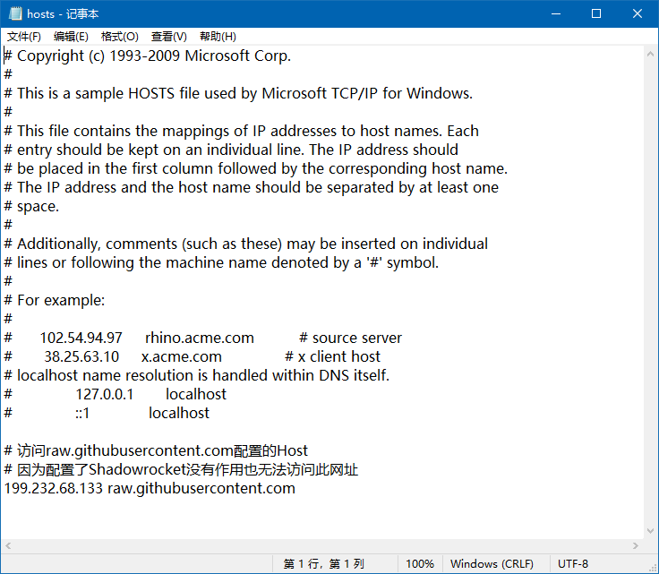

# 前言

> - 本篇是关于`Host`的知识。

# 什么是Hosts？

- `Hosts`是一个没有扩展名的系统文件，可以使用记事本等工具打开，其主要的作用就是将一些常用的网址域名与其对应的`IP`地址建立一个关联的“数据库”。
- 当用户在浏览器输入一个需要登录的网址时，系统会首先自动从`Hosts`文件中寻找对应的`IP`地址：
  - 如果一旦找到，系统会立即打开对应的网页
  - 如果没有找到，则系统会将网址提交到`DNS`域名解析服务器，进行`IP`地址的解析。



# Hosts的历史发展

- 在引入`DNS`（`Domain Name System`，域名系统）之前，网络中的主机，是将容易记忆的域名映射到`IP`地址，并将它保存在一个共享的静态文件`hosts`中，再由`hosts`文件来实现网络中域名的管理。
- 最初`Internet`非常小，仅使用这个集中管理的文件，就可以通过`FTP`为连入`Internet`的站点和主机提供域名的发布和下载。每个`Internet`站点将定期地更新其主机文件的副本，并且发布主机文件的更新版来反映网络的变化。
- 但是，当`Internet`上的计算机迅速增加时，通过一个中心授权机构为所有`Internet`主机管理一个主机文件的工作将无法进行。文件会随着时间的推移而增大，这样按当前和更新的形式维持文件以及将文件分配至所有站点将变得非常困难，甚至无法完成，于是便产生了`DNS`服务器。

# 工作原理

- 浏览器访问网站，要首先通过`DNS`服务器把要访问的网络域名解析成其指定的`IP`地址，之后，浏览器才能对此网站进行定位，并且访问其数据。
- 操作系统规定，在进行`DNS`请求前，需要先检查自己系统中的`Hosts`文件中是否有这个域名和`IP`地址的映射关系。
  - 如果有，则直接访问这个`IP`地址指定的网络位置；
  - 如果没有，再向已知的`DNS`服务器提出域名解析请求。

- 总结：
  - 即本机`Hosts`中的`IP`解析优先级要比`DNS`高。

#  存储位置

- `Window XP/2000/Vista/7/8/8.1/10`：
  - `C:\windows\system32\drivers\etc\`
  - 提示：`XP`系统无法使用bat批处理命令直接替换`hosts`，需要手动替换后重新插拔网线或重启方式使`hosts`生效
  - 提示：可更改`\HKEY_LOCAL_MACHINE\SYSTEM\CurrentControlSet\Services\Tcpip\Parameters\DataBasePath`项修改`host`位置

- `Window 95/98/Me`：
  - `%WinDir%\` （其实就是`C:\WINDOWS`）

- `Linux`及其他类`Unix`操作系统：
  - `/etc/`
- `Android`：
  - `/system/etc/`

- `Mac OS X`：
  - `/private/etc`

- `iPhone OS`：
  - `/etc/`(需要越狱)

- `iPad OS`：
  - `/private/etc`

# 文件内容

- `Windows`版本`host`文件内容：

```reStructuredText
# Copyright (c) 1993-2009 Microsoft Corp.
#
# This is a sample HOSTS file used by Microsoft TCP/IP for Windows.
#
# This file contains the mappings of IP addresses to host names. Each
# entry should be kept on an individual line. The IP address should
# be placed in the first column followed by the corresponding host name.
# The IP address and the host name should be separated by at least one
# space.
#
# Additionally, comments (such as these) may be inserted on individual
# lines or following the machine name denoted by a '#' symbol.
#
# For example:
#
# 102.54.94.97 rhino.acme.com # source server
# 38.25.63.10 x.acme.com # x client host
# localhost name resolution is handled within DNS itself.
# 127.0.0.1 localhost
# ::1 localhost
```

- 如果怀疑`hosts`文件被病毒或木马修改，可使用上述内容替换文档。
- `#（hash）`后的都是注释。也就是清空`hosts`文件对系统正常运行是没有影响的。

# 具体作用

## 1. 加快域名解析

- 对于要经常访问的网站，我们可以通过在`Hosts`中配置域名和`IP`的映射关系，提高域名解析速度。由于有了映射关系，当我们输入域名，计算机就能很快地解析出`IP`，而不需要请求网络上的`DNS`服务器。

## 2. 方便局域网用户

- 在很多单位的局域网中，会有服务器提供给用户使用。但由于局域网中一般很少架设`DNS`服务器，访问这些服务器时，要输入难记的`IP`地址。
- 可以分别给这些服务器取个容易记住的名字，然后在`Hosts`中建立IP映射，这样以后访问的时候，只要输入这个服务器的名字就行了。

## 3. 屏蔽网站（域名重定向）

- 有很多网站不经过用户同意就将各种各样的插件安装到你的计算机中，其中有些说不定就是木马或病毒。对于这些网站我们可以利用`Hosts`把该网站的域名映射到错误的`IP`或本地计算机的`IP`，这样就不用访问了。
- 在`Windows`系统中：
  - `127.0.0.1`为本地计算机的`IP`地址；
  - `0.0.0.0`为错误的`IP`地址。

- 例如，在`Hosts`中写入以下内容：

```reStructuredText
127.0.0.1 需要屏蔽的A网站的域名
0.0.0.0 需要屏蔽的B网站的域名
```

- 这样，我们的计算机在解析域名`A`、`B`的时候，就只会解析到本机`IP`和错误`IP`，达到屏蔽网站`A`、`B`的目的。

## 4. 顺利连接系统

- 对于`Lotus`的服务器和一些数据库服务器，在访问时若果直接输入`IP`地址是无法访问的，只能通过服务器名访问。那么配置好`Hosts`文件，就能顺利连接了。

## 5. 虚拟域名

- 很多时候，网站建设者需要把“软环境”搭建好，再进行上传调试。但类似于邮件服务，则需要使用域名来辅助调试，这时候可以将本地`IP`地址与一个“虚拟域名”做地址指向，就可以达到要求的效果，且无需花费。

```reStructuredText
127.0.0.1 网站域名
```

- 接着使用网站域名即可。

- 注意：对于`HTTP`请求默认的端口号是`80`，对于`HTTPS`请求默认的端口号是`443`，浏览器会对这两个端口进行隐藏的操作。
  - 也就是`Hosts`文件中，带端口进行映射是没有用的。在浏览器中输入不带端口号的网站域名，浏览器会自动使用`80`或`443`端口进行访问，端口将被忽略；
  - 使用浏览器如果访问的目标网站不是`80`或`443`端口，需要显式指定域名或`IP`地址的端口。

# 使Hosts修改生效

## 1. 主要原因

- 修改失效的原因是因为`HTTP`协议存在`keep-alive`，次要的原因是浏览器和系统存在`DNS`缓存。
- 响应头`Connection: keep-alive`的情况下，客户端会和服务器保持长连接，只要连接不断开，页面在请求的时候就不会重新解析域名。

- 需要注意以下几点：
  1. 浏览器如果使用代理工具`SwitchyOmega`、`pac`文件，浏览器会优先考虑代理工具，解析域名的时候不会优先考虑`Hosts`文件；·
  2. 浏览器`DNS`缓存会导致即使重启浏览器，`Hosts`配置文件也无法生效；除此之外系统也存在`DNS`缓存，也会导致配置失效。关于这些缓存，一般拥有默认的失效时间，一般是`60s`。

## 2. 解决方法

### a. 不重启浏览器

- 对于`Chrome`浏览器来说，我们可以进入`chrome://net-internals`中，选择`Sockets`，点击`Close idle sockets`来断开所有的长连接。

### b. 重启浏览器

- 重启浏览器之后，所有的连接（包括长连接）都会断开，`Hosts`自然就生效了。

### c. 隐私模式下打开

- 隐私模式下不会复用`TCP`连接，新开连接的时候，会重新解析`DNS`域名。

### d. 使用iHosts管理器

- 使用`iHosts`管理器修改`hosts`文件的时候，会重启网络服务，这个时候必然会断开所有的`TCP`连接（重启网络服务，差不多相当于先断网再联网。)

### e. 等一小会

- 你有时间可以使用最后这种方式，就是等待系统自动将各种`DNS`缓存或长连接断开了。