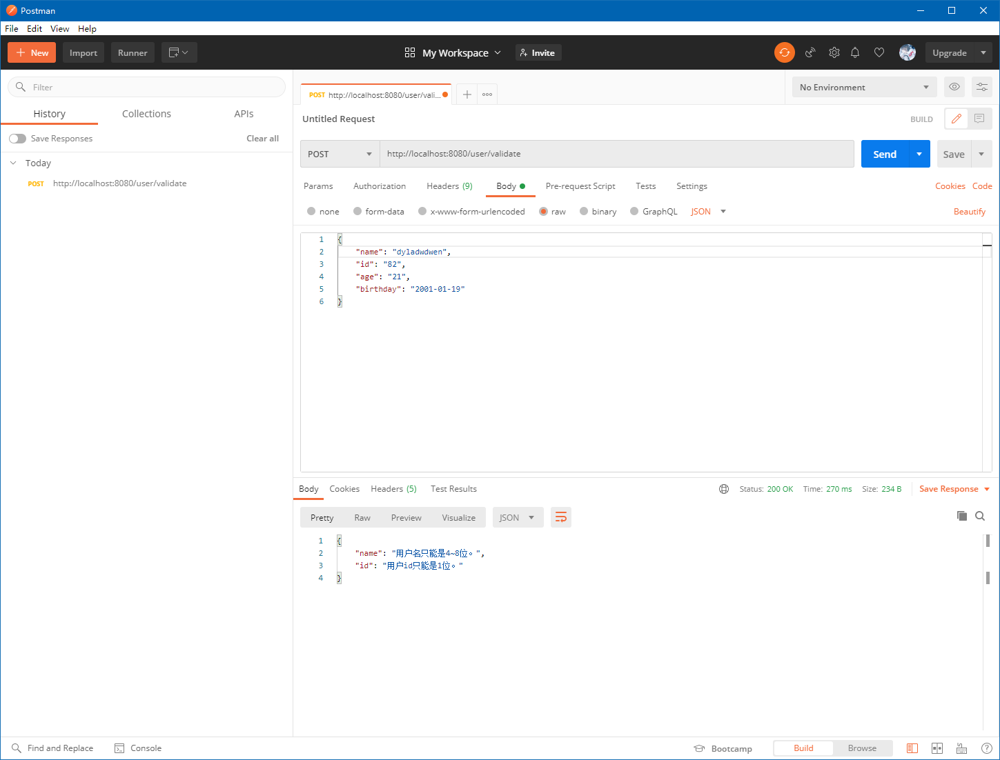
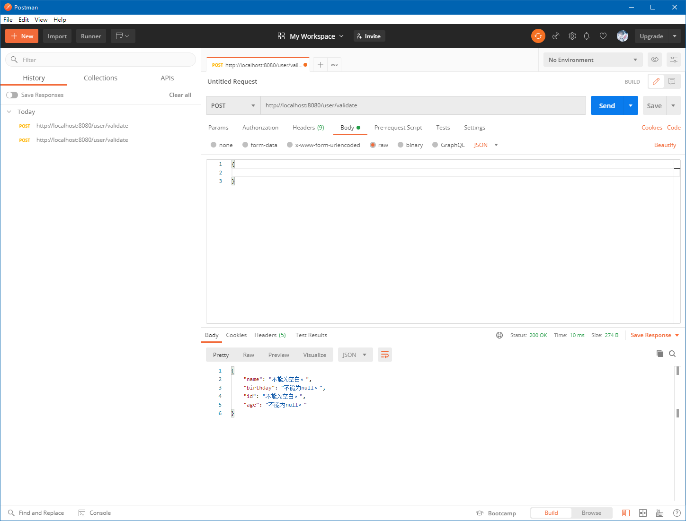
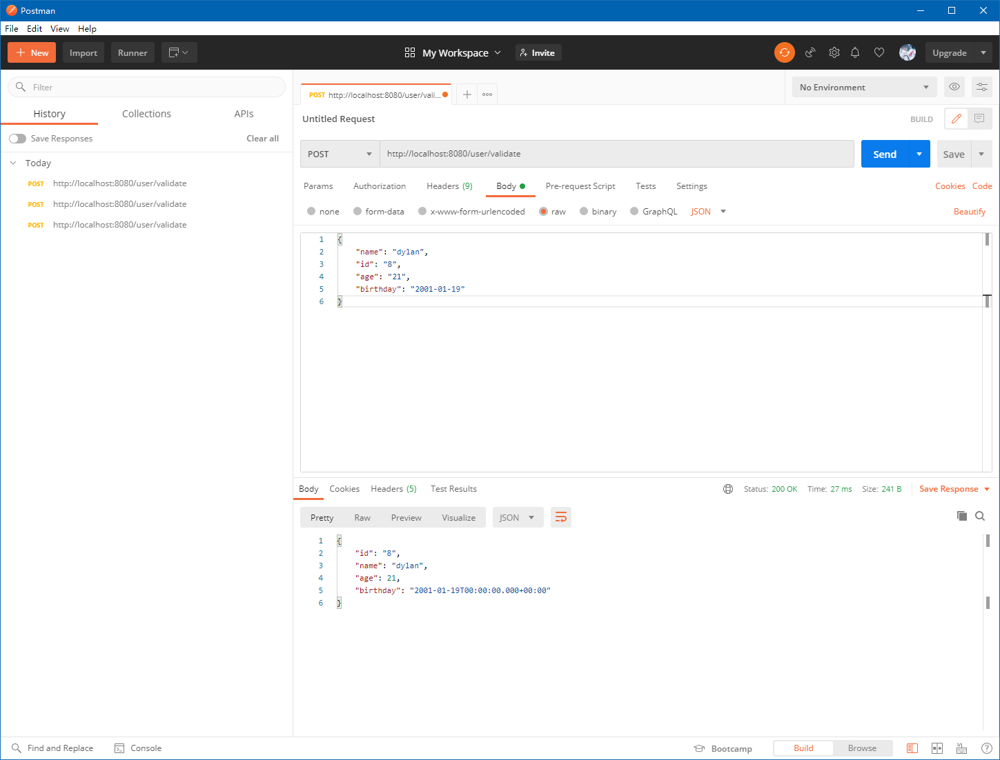
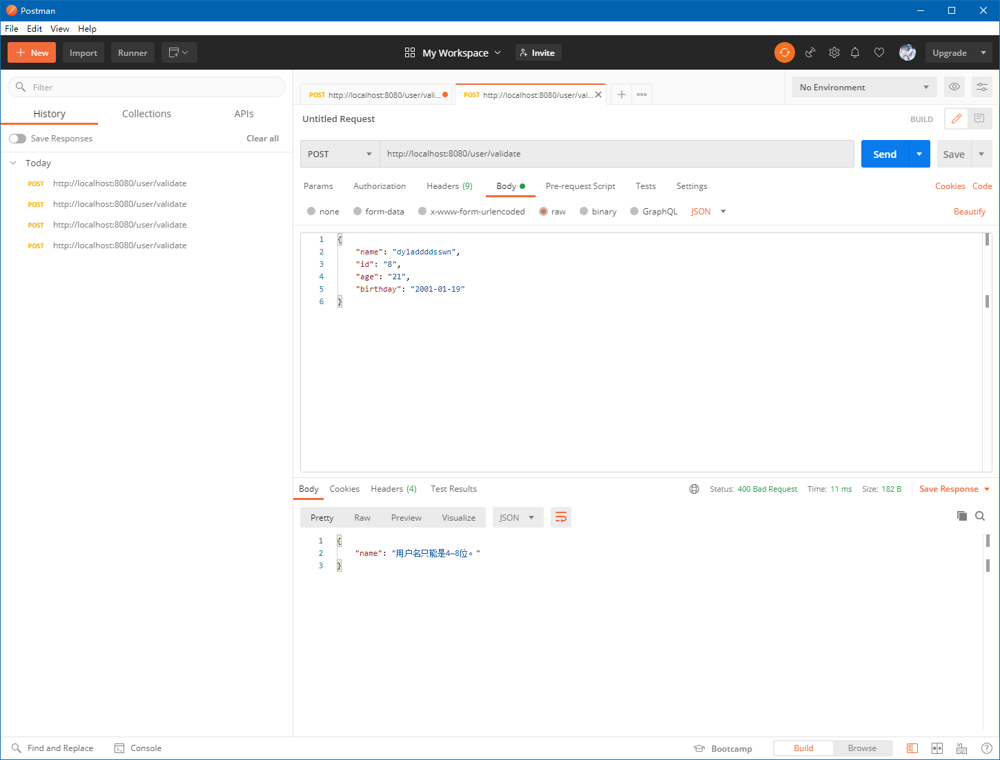

# 简介

- 本篇介绍如何对类的字段进行合法性校验。

# 关于JSR-303

- `JSR-303`是`JAVA EE 6`中的一项子规范，叫做`Bean Validation`。

- 相关注解如下：

|             注解             |                           描述                           |
| :--------------------------: | :------------------------------------------------------: |
|           `@Null`            |                 被注释的元素必须为`null`                 |
|          `@NotNull`          |                被注释的元素必须不为`null`                |
|        `@AssertTrue`         |                 被注释的元素必须为`true`                 |
|        `@AssertFalse`        |                被注释的元素必须为`false`                 |
|        `@Min(value)`         | 被注释的元素必须是一个数字，其值必须大于等于指定的最小值 |
|        `@Max(value)`         | 被注释的元素必须是一个数字，其值必须小于等于指定的最大值 |
|     `@DecimalMin(value)`     | 被注释的元素必须是一个数字，其值必须大于等于指定的最小值 |
|     `@DecimalMax(value)`     | 被注释的元素必须是一个数字，其值必须小于等于指定的最大值 |
|      `@Size(max, min)`       |            被注释的元素的大小必须在指定范围内            |
| `@Digits(integer, fraction)` |   被注释的元素必须是一个数字，其值必须在可接受的范围内   |
|           `@Past`            |             被注释的元素必须是一个过去的日期             |
|          `@Future`           |             被注释的元素必须是一个将来的日期             |
|      `@Pattern(value)`       |           被注释的元素必须符合指定的正则表达式           |

# Hibernate对JSR-303的实现

- `Hibernate Validator`是`Bean Validation`的参考实现。`Hibernate Validator`提供了`JSR 303`规范中所有内置`constraint`的实现，除此之外还有一些附加的`constraint`。

- 相关注解如下：

|    注解     |                  描述                  |
| :---------: | :------------------------------------: |
|  `@Email`   |     被注释的元素必须是电子邮箱地址     |
|  `@Length`  | 被注释的字符串的大小必须在指定的范围内 |
| `@NotEmpty` |         被注释的字符串必须非空         |
|  `@Range`   |     被注释的元素必须在合适的范围内     |

# 项目依赖

- 普通`Maven`项目可以使用`hibernate`所提供的验证依赖包`hibernate-validator`：

```xml
<dependency>
    <groupId>org.hibernate.validator</groupId>
    <artifactId>hibernate-validator</artifactId>
    <version>6.1.6.Final</version>
</dependency>
```

- 如果是`SpringBoot`项目，则可以使用其所提供的`spring-boot-starter-validation`：

```xml
<dependency>
    <groupId>org.springframework.boot</groupId>
    <artifactId>spring-boot-starter-validation</artifactId>
    <version>2.3.6.RELEASE</version>
</dependency>
```

# 使用范例

- 校验的注解多数情况下，被使用在`pojo`类的字段上，以下为一个简单的`User`类源码：

```java
package cn.dylanphang.pojo;

import lombok.Data;
import org.hibernate.validator.constraints.Range;
import org.springframework.stereotype.Repository;

import javax.validation.constraints.*;
import java.util.Date;

/**
 * @author dylan
 */
@Repository
@Data
public class User {
    @NotBlank(message = "不能为空白。")
    @Size(min = 1, max = 1, message = "用户id只能是1位。")
    private String id;

    @NotBlank(message = "不能为空白。")
    @Size(min = 4, max = 8, message = "用户名只能是4~8位。")
    private String name;

    @NotNull(message = "不能为null。")
    @Range(min = 0, max = 99, message = "用户年龄只能在0~99之间。")
    private Integer age;
    
    @NotNull(message = "不能为null。")
    @Past(message = "不能是未来的日期。")
    private Date birthday;
}
```

- 其中一些需要明确一些事实：
  1. `@NotBlank`中包含了`@NotNull`注解的意思，即不为空的同时不为`null`；
  2. `4`个字段中的`@NotBlank`和`@NotNull`都是有必要的；
  3. `@Size`、`@Range`及`@Past`都无法保证客户端提交非`null`的数据；
  4. `message`属性表示校验失败时，应提供的提示信息；如果不进行设置，会使用内置的默认提示信息。
- 关于以上事实，均是通过`Postman`提交数据测试出来的，有兴趣的朋友可以自行测试一下。
- 另附个人观点，使用`MockMvc`运用代码来测试，远没有`Postman`来得直观快捷。

# 验证方式

- 知道如何在字段上使用验证注解后，那么如何进行使用呢？
- 为了增加验证复杂性，我们使用一个新的`pojo`类，其中的一个字段为另一个`pojo`类，如下`Order`类和`Product`类源码：

```java
package cn.dylanphang.pojo;

import cn.dylanphang.anno.Status;
import lombok.Data;

import javax.validation.Valid;
import javax.validation.constraints.*;
import java.util.Date;

/**
 * @author dylan
 */
@Data
public class Order {
    /**
     * 对于实际应用来说，我们必须要明确知道哪个地方的数据不符合要求。
     * 如果通过检验，Set<ConstraintViolation<Order>>的size()将等于零；
     * 如果未通过检验，则需要告诉用户，哪个地方有问题，通过ConstraintViolation<Order>中的getMessage()方法获取注解中标注的message。
     */
    @NotNull(message = "OrderId can't be null.")
    @Size(min = 10, max = 10, message = "OrderId size must be 10.")
    private String orderId;

    @NotEmpty(message = "Customer name must not be empty.")
    private String customer;

    @Email(message = "Your email is illegal.")
    private String email;

    @NotEmpty(message = "Address must not be empty.")
    private String address;

    @NotNull(message = "Status cannot be null.")
    @Status
    private String status;

    @NotNull(message = "CreateDate can't be null.")
    private Date createDate;

    /**
     * 注解表示该字段需要认证，使用Product中的验证注解，嵌套验证。
     * 我们必须要保证Order类的所有字段都是符合要求的。
     */
    @Valid
    private Product product;
}
```

```java
package cn.dylanphang.pojo;

import cn.dylanphang.anno.CheckCase;
import lombok.Data;
import org.hibernate.validator.constraints.Range;

import javax.validation.constraints.NotEmpty;
import javax.validation.constraints.NotNull;

/**
 * @author dylan
 */
@Data
public class Product {

    @CheckCase(value = CheckCase.CaseMode.LOWER, message = "Product name must be lower case.")
    @NotEmpty(message = "Product name must not be empty.")
    private String productName;

    /**
     * 使用@Price无法自定义注解，当字段使用引用数据类型的时候，应该验证是否为空。基本数据类型是有初始化值的。
     */
    @NotNull(message = "Price can't be null.")
    @Range(min = 8000, max = 10000, message = "Illegal price, price must between 8000 to 10000.")
    private Float price;
}
```

- 其中`Order`类中使用了自定义注解`@Status`源码如下：

```java
package cn.dylanphang.anno;

import cn.dylanphang.validator.StatusValidator;

import javax.validation.Constraint;
import javax.validation.Payload;
import java.lang.annotation.ElementType;
import java.lang.annotation.Retention;
import java.lang.annotation.RetentionPolicy;
import java.lang.annotation.Target;

/**
 * @author dylan
 */
@Constraint(validatedBy = {StatusValidator.class})
@Target({ElementType.ANNOTATION_TYPE, ElementType.METHOD, ElementType.FIELD})
@Retention(RetentionPolicy.RUNTIME)
public @interface Status {
    String message() default "Incorrect status! Status should be one of 'created', 'paid', shipped', closed'.";

    Class<?>[] groups() default {};

    Class<? extends Payload>[] payload() default {};
}
```

- 注解`@Status`需要使用`StatusValidator`作为验证类，其源码如下：

```java
package cn.dylanphang.validator;

import cn.dylanphang.anno.Status;

import javax.validation.ConstraintValidator;
import javax.validation.ConstraintValidatorContext;
import java.util.Arrays;

/**
 * @author dylan
 */
public class StatusValidator implements ConstraintValidator<Status, String> {

    private final String[] ALL_STATUS = {"created", "paid", "shipped", "closed"};

    @Override
    public void initialize(Status status) {
        // TODO：如果有利用到注解Status内的信息，则需要定义一个字段用于接收status参数。
    }

    @Override
    public boolean isValid(String value, ConstraintValidatorContext context) {
        return Arrays.asList(ALL_STATUS).contains(value);
    }
}
```

- 关于验证类的注意事项：
  - 验证类`Validator`需要实现`ConstraintValidator<A extends Annotation, T>`类，其中第一个参数为使用此实现类进行校验的注解类，而第二个参数则为注解类注释字段的实际类型；
  - 验证类`Validator`需要至少覆写其中的`isValid()`方法；
  - 注解类注释的字段被赋值之后，该字段的值将同时赋值给`isValid()`中的入参`value`。当方法返回`false`时，表明数据不符合校验要求；否则，即符合校验要求；
  - 从校验类中可以知道，`@Status`注解注释的字段的值，只能是校验类中`ALL_STATUS`提供的默认值之一。
- 附上`ConstraintValidator<A extends Annotation, T>`源码供参考：

```java
/*
 * Jakarta Bean Validation API
 *
 * License: Apache License, Version 2.0
 * See the license.txt file in the root directory or <http://www.apache.org/licenses/LICENSE-2.0>.
 */
package javax.validation;

import java.lang.annotation.Annotation;

import javax.validation.constraintvalidation.SupportedValidationTarget;

/**
 * Defines the logic to validate a given constraint {@code A}
 * for a given object type {@code T}.
 * <p>
 * Implementations must comply to the following restriction:
 * <ul>
 *     <li>{@code T} must resolve to a non parameterized type</li>
 *     <li>or generic parameters of {@code T} must be unbounded
 *     wildcard types</li>
 * </ul>
 * <p>
 * The annotation {@link SupportedValidationTarget} can be put on a
 * {@code ConstraintValidator} implementation to mark it as supporting
 * cross-parameter constraints. Check out {@link SupportedValidationTarget}
 * and {@link Constraint} for more information.
 *
 * @param <A> the annotation type handled by an implementation
 * @param <T> the target type supported by an implementation
 *
 * @author Emmanuel Bernard
 * @author Hardy Ferentschik
 */
public interface ConstraintValidator<A extends Annotation, T> {

   /**
    * Initializes the validator in preparation for
    * {@link #isValid(Object, ConstraintValidatorContext)} calls.
    * The constraint annotation for a given constraint declaration
    * is passed.
    * <p>
    * This method is guaranteed to be called before any use of this instance for
    * validation.
    * <p>
    * The default implementation is a no-op.
    *
    * @param constraintAnnotation annotation instance for a given constraint declaration
    */
   default void initialize(A constraintAnnotation) {
   }

   /**
    * Implements the validation logic.
    * The state of {@code value} must not be altered.
    * <p>
    * This method can be accessed concurrently, thread-safety must be ensured
    * by the implementation.
    *
    * @param value object to validate
    * @param context context in which the constraint is evaluated
    *
    * @return {@code false} if {@code value} does not pass the constraint
    */
   boolean isValid(T value, ConstraintValidatorContext context);
}
```

- 而`Product`类中使用的自定义注解`@CheckCase`源码如下：

```java
package cn.dylanphang.anno;


import cn.dylanphang.validator.CheckCaseValidator;

import javax.validation.Constraint;
import javax.validation.Payload;
import java.lang.annotation.ElementType;
import java.lang.annotation.Retention;
import java.lang.annotation.RetentionPolicy;
import java.lang.annotation.Target;

/**
 * @author dylan
 */
@Constraint(validatedBy = CheckCaseValidator.class)
@Target({ElementType.ANNOTATION_TYPE, ElementType.METHOD, ElementType.FIELD})
@Retention(RetentionPolicy.RUNTIME)
public @interface CheckCase {
    String message() default "";

    Class<?>[] groups() default {};

    Class<? extends Payload>[] payload() default {};

    CaseMode value();

    enum CaseMode {
        /**
         * UPPER：大写模式
         * LOWER：小写模式
         */
        UPPER,
        LOWER
    }
}
```

- 注解`@CheckCase`用于校验传入值是否符合预设的`CaseMode`，如果`CaseMode.value() == "UPPER"`，则表示被此注解注释的字段只能是大写形式，此时传入小写单词，`isValid()`方法将会返回`false`，即校验失败。
- 同样需要为其创建验证类`CheckCaseValidator`，源码如下：

```java
package cn.dylanphang.validator;

import cn.dylanphang.anno.CheckCase;

import javax.validation.ConstraintValidator;
import javax.validation.ConstraintValidatorContext;

/**
 * @author dylan
 */
public class CheckCaseValidator implements ConstraintValidator<CheckCase, String> {
    private CheckCase checkCase;

    @Override
    public void initialize(CheckCase checkCase) {
        this.checkCase = checkCase;
    }

    @Override
    public boolean isValid(String value, ConstraintValidatorContext context) {
        if (CheckCase.CaseMode.UPPER.equals(checkCase.value())) {
            return value.equals(value.toUpperCase());
        } else {
            return value.equals(value.toLowerCase());
        }
    }
}
```

- 一个完整的校验过程如下：
  1. 获取验证工厂对象`ValidatorFactory`；
  2. 使用工厂对象获取校验器`Validator`；
  3. 使用校验器校验对象获得`Set<ConstraintViolation<T>>`对象，其中`ConstraintViolation<T>`为“违反约束”对象：
     1. `getPropertyPath()`方法可以获取到校验失败的字段名称；
     2. `getMessage()`可以获取到对应校验失败字段的验证注解中，`message`属性所设置的消息内容。
- 最后，创建测试类`SaleOrderControllerTest`，其源码如下：

```java
package cn.dylanphang.controller;

import cn.dylanphang.pojo.Order;
import cn.dylanphang.pojo.Product;
import org.hibernate.validator.HibernateValidator;
import org.junit.jupiter.api.BeforeEach;
import org.junit.jupiter.api.Test;
import org.springframework.boot.test.context.SpringBootTest;

import javax.validation.ConstraintViolation;
import javax.validation.Validation;
import javax.validation.Validator;
import javax.validation.ValidatorFactory;
import java.util.Date;
import java.util.Set;

@SpringBootTest
public class SaleOrderControllerTest {

    private final Product product = new Product();
    private final Order order = new Order();

    @BeforeEach
    public void before() {

        this.product.setProductName("nEi.");
        this.product.setPrice(Float.valueOf("2000"));

        this.order.setOrderId("7847823");
        this.order.setCustomer("dylan");
        this.order.setEmail("jack");
        this.order.setAddress("hey.");
        this.order.setStatus("paidX");
        this.order.setCreateDate(new Date());
        this.order.setProduct(product);
    }

    /**
     * 基础的验证模式。
     */
    @Test
    public void testA() {

        // 1.创建验证工厂对象
        final ValidatorFactory validatorFactory = Validation.buildDefaultValidatorFactory();

        // 2.使用验证工厂对象获取校验器
        final Validator validator = validatorFactory.getValidator();

        // 3.使用校验器校验对象并返回包含违反约束的集
        final Set<ConstraintViolation<Order>> validate = validator.validate(this.order);

        // 4.如果集的长度不为零，则表明存在校验错误的字段
        // *.实际操作中，可能需要将错误的信息返回给客户端机，进行反馈。
        if (validate.size() != 0) {
            validate.forEach((cv) -> {
                // 5.在控制台打印错误的信息
                System.out.println(cv.getPropertyPath() + ": " + cv.getMessage());
            });
        } else {
            // 6.如果长度为零，则表明校验通过
            System.out.println("Successful!!!");
        }
    }

    /**
     * 快速验证，使用HibernateValidator快速验证，即只要有一个失败，那就返回失败。
     */
    @Test
    public void testB() {

        // 1.创建验证工厂对象，提供HibernateValidator对象并开启快速验证模式failFast(true)
        final ValidatorFactory validatorFactory = Validation
                .byProvider(HibernateValidator.class)
                .configure()
                // .addProperty("hibernate.validator.fail_fast", "true") 等价于 .failFast(true)
                .failFast(true)
                .buildValidatorFactory();

        // 2.使用验证工厂对象获取校验器
        final Validator validator = validatorFactory.getValidator();

        // 3.使用校验器校验对象并返回包含违反约束的集
        final Set<ConstraintViolation<Order>> validate = validator.validate(this.order);

        // 4.使用快速验证，此时只要检测到一个不符合验证的参数，即可返回，因此错误消息只有一条。
        if (validate.size() != 0) {
            validate.forEach((cv) -> {
                // 5.有且仅有一个ConstraintViolation<Order>>对象
                System.out.println(cv.getPropertyPath() + ": " + cv.getMessage());
            });
        } else {
            // 6.如果长度为零，则表明校验通过
            System.out.println("Successful!!!");
        }
    }
}

```

# 实际应用

- 多数情况下，可以使用编写工具类的形式，去校验客户端所提供的的参数，但考虑到`Spring MVC`中的`Controller`控制层，我们也许需要使用更为高效的验证方式，或者说是更为优雅的方式。
- 即在`Controller`中的方法形参中需要被校验的`Bean`前，使用注解`@Valid`或`@Validated`。

- 此时，如果出现校验失败，客户端会得到一个`404`的响应，但不会获得任何的错误信息。因此，`Spring MVC`提供了另一个方法的入参`BindingResult`对象，该对象必须要紧跟在`@Valid`或`@Validated`注解注释的形参之后才能生效。

- 示例使用此前的`User`类，源码如下：

```java
package cn.dylanphang.pojo;

import lombok.Data;
import org.hibernate.validator.constraints.Range;
import org.springframework.stereotype.Repository;

import javax.validation.constraints.*;
import java.util.Date;

/**
 * @author dylan
 */
@Repository
@Data
public class User {
    @NotBlank(message = "不能为空白。")
    @Size(min = 1, max = 1, message = "用户id只能是1位。")
    private String id;

    @NotBlank(message = "不能为空白。")
    @Size(min = 4, max = 8, message = "用户名只能是4~8位。")
    private String name;

    @NotNull(message = "不能为null。")
    @Range(min = 0, max = 99, message = "用户年龄只能在0~99之间。")
    private Integer age;

    @NotNull(message = "不能为null。")
    @Past(message = "不能是未来的日期。")
    private Date birthday;
}
```

- 与之对应的`UserController`源码如下：

```java
package cn.dylanphang.controller;

import cn.dylanphang.pojo.User;
import cn.dylanphang.service.UserService;
import org.springframework.stereotype.Controller;
import org.springframework.validation.BindingResult;
import org.springframework.validation.annotation.Validated;
import org.springframework.web.bind.annotation.RequestBody;
import org.springframework.web.bind.annotation.RequestMapping;
import org.springframework.web.bind.annotation.ResponseBody;

import java.util.Date;
import java.util.HashMap;

/**
 * @author dylan
 */
@Controller
@RequestMapping("/user")
public class UserController {

    private final UserService userService;

    public UserController(UserService userService) {
        this.userService = userService;
    }

    /**
     * 1.@ResponseBody表示响应的数据将以JSON格式呈现；
     * 2.@RequestBody表示提交的数据在请求体中；
     * 3.@Valid或@Validated可以校验数据是否合法；
     * 4.BindingResult对象用于判断是否出现校验错误，如果出现错误，可以通过它返回错误信息；
     * 5.@Valid或@Validated和BindingResult是一对一的关系，如果有多个需要校验，则需要入参多个BindingResult对象。
     *
     * @param user          user
     * @param bindingResult bindingResult
     * @return object
     */
    @RequestMapping("/validate")
    @ResponseBody
    public Object validate(@Validated @RequestBody User user, BindingResult bindingResult) {
        if (bindingResult.hasErrors()) {
            final HashMap<String, String> hashMap = new HashMap<>(bindingResult.getFieldErrorCount());
            bindingResult.getFieldErrors().forEach(fieldError -> {
                hashMap.put(fieldError.getField(), fieldError.getDefaultMessage());
            });
            return hashMap;
        }
        System.out.println(user);
        return user;
    }
}
```

- 此时运行项目，并使用`Postman`进行测试。
- 客户端提交的参数中，`name`与`id`不符合校验要求时：



- 客户端提交的参数为空时：



- 客户端提交的参数均符合校验时：



- 关于`Controller`中代码的重点总结（均是通过实验得到的结论）：
  1. `@ResponseBody`表示响应的数据将以`JSON`格式呈现；
  2. `@RequestBody`表示提交的数据在请求体中，对于普通浏览器来说，意为限制使用的提交方法为`POST`；
  3. `@Valid`或`@Validated`可以校验数据是否合法；
  4. `BindingResult`对象用于判断是否出现校验错误。如果出现错误，可以通过它返回错误信息；
  5. `@Valid`或`@Validated`和`BindingResult`是一对一的关系，如果有多个入参需要进行校验，则需要入参同样多个的`BindingResult`对象。

# 细节问题

- 此前经过`Postman`的测试，我们可以很直观地看到验证失败时，服务器准确地向客户端返回了错误的信息，但是其中有一个地方是不正常的。即在验证失败时，服务器端返回的状态码仍然是`200`，其表示正常`OK`。
- 如果希望更为直观地控制状态码的响应，则需要稍微修改一下`Controller`中的返回值类型，如下：

```java
package cn.dylanphang.controller;

import cn.dylanphang.pojo.User;
import cn.dylanphang.service.UserService;
import org.springframework.stereotype.Controller;
import org.springframework.validation.BindingResult;
import org.springframework.validation.annotation.Validated;
import org.springframework.web.bind.annotation.RequestBody;
import org.springframework.web.bind.annotation.RequestMapping;
import org.springframework.web.bind.annotation.ResponseBody;

import java.util.Date;
import java.util.HashMap;

/**
 * @author dylan
 */
@Controller
@RequestMapping("/user")
public class UserController {

    private final UserService userService;

    public UserController(UserService userService) {
        this.userService = userService;
    }

    @RequestMapping("/validate")
    // @ResponseBody
    public ResponseEntity<Object> validate(@Validated @RequestBody User user, BindingResult bindingResult) {
        if (bindingResult.hasErrors()) {
            final HashMap<String, String> hashMap = new HashMap<>(bindingResult.getFieldErrorCount());
            bindingResult.getFieldErrors().forEach(fieldError -> {
                hashMap.put(fieldError.getField(), fieldError.getDefaultMessage());
            });
            return new ResponseEntity<>(hashMap, HttpStatus.BAD_REQUEST);
        }
        System.out.println(user);
        return ResponseEntity.ok(user);
    }
}
```

- 其中作出的关键修改说明：
  1. 使用`ResponseEntity<Object>`封装需要返回的对象，并提供相应的状态码；
  2. 此时，可以省略`@ResponseBody`注解，使用`ResponseEntity<Object>`封装的数据会被转为`JSON`数据；
  3. 如果返回的是字符串，则客户端只会接收到字符串数据，如`ResponseEntity.ok("Successful.");`。
- 再次使用错误信息提交请求，获得以下结果：



- 状态码即为代码中所设置的`400`，表示`Bad Request`。
- 显然，大多数前后端分离的情况下，前端大部分时间不需要知道状态码是什么，而只需要知道发生的错误信息。
- 但了解一下`ResponEntity<T>`的使用方法，对于知识的积累上和代码的阅读来说，会更加有益。

# 总结

- 以上为使用`JSR-303`的所有介绍。
- 实际使用中，在未知校验注解的功能性前，最好先进行一些简单的测试，以免校验出现错误。
- 校验注解中还有一些其他的有趣的属性，后续也许会进行简单地介绍。