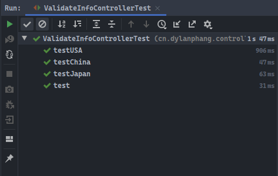

# 简介

- 本篇介绍一个`JSR303`中校验注解的`groups`属性。

# 背景

- 关于`groups`的了解之路，来源于一个朋友的解决思路。
- 项目实际需要根据国家来区分用户，进而对用户资料进行验证。对来自不同国家的用户来说，其拥有不一样的验证字段，比如中国要求用户必须提供身份证信息，而日本可能不需要提供身份证信息。
- 在这个要求的基础上，无论如何进行验证操作，首先需要判断的都是该用户来自于哪个国家，进而才能根据所属的国家信息，指定相关的验证操作。
- 即通俗地讲，除非你在一个单独的`Controller`中使用`@ModelAttribute`注解的方法判断用户来自于哪个国家，并为每个国家编写特定的实体类，才能在`Controller`的验证方法入参中使用`@Valid`或`@Validated`注解进行一步到位的验证操作。
- 稍作考虑，则目前的解决方案可能有以下两种：
  1. 为来自于不同国家的用户建立不同的用于记录该国家用户信息的`Bean`对象，在这些`Bean`对象中使用验证注解注释字段；
  2. 将用户信息集中在同一个`Bean`对象中，使用验证类提供的`groups`属性进行验证分组。
- 关于第一种方式，大部分的人应该都知道该如何编写，因此本篇将考虑第二种方式。在使用这种方式前，需要首先了解一下标记接口`Java Marker Interface`。

# 标记接口

- 什么是`Java Marker Interface`标记接口呢？类似于`Serializable`，它就是`JDK`中的一个标记接口。
- 对于标记接口来说，需要明确这不是`Java`语言所特有的，而是计算机科学中一种通用的设计理念。
- 程序往往可以通过判断对象是否实现了某些标记接口，而判定该对象是否具有某些特征，使程序编写更为灵活。
- 标记接口不具有任何的字段或方法，是一个空接口。

# groups属性

- 在介绍`JSR303`时，细心的人一定会发现一个细节，所有的验证注解中都存在两个属性：`groups`和`payload`。
- 以下为`@NotNull`注解的源码：

```java
/*
 * Jakarta Bean Validation API
 *
 * License: Apache License, Version 2.0
 * See the license.txt file in the root directory or <http://www.apache.org/licenses/LICENSE-2.0>.
 */
package javax.validation.constraints;

import static java.lang.annotation.ElementType.ANNOTATION_TYPE;
import static java.lang.annotation.ElementType.CONSTRUCTOR;
import static java.lang.annotation.ElementType.FIELD;
import static java.lang.annotation.ElementType.METHOD;
import static java.lang.annotation.ElementType.PARAMETER;
import static java.lang.annotation.ElementType.TYPE_USE;
import static java.lang.annotation.RetentionPolicy.RUNTIME;

import java.lang.annotation.Documented;
import java.lang.annotation.Repeatable;
import java.lang.annotation.Retention;
import java.lang.annotation.Target;

import javax.validation.Constraint;
import javax.validation.Payload;
import javax.validation.constraints.NotNull.List;

/**
 * The annotated element must not be {@code null}.
 * Accepts any type.
 *
 * @author Emmanuel Bernard
 */
@Target({ METHOD, FIELD, ANNOTATION_TYPE, CONSTRUCTOR, PARAMETER, TYPE_USE })
@Retention(RUNTIME)
@Repeatable(List.class)
@Documented
@Constraint(validatedBy = { })
public @interface NotNull {

   String message() default "{javax.validation.constraints.NotNull.message}";

   Class<?>[] groups() default { };

   Class<? extends Payload>[] payload() default { };

   /**
    * Defines several {@link NotNull} annotations on the same element.
    *
    * @see javax.validation.constraints.NotNull
    */
   @Target({ METHOD, FIELD, ANNOTATION_TYPE, CONSTRUCTOR, PARAMETER, TYPE_USE })
   @Retention(RUNTIME)
   @Documented
   @interface List {

      NotNull[] value();
   }
}
```

- 本篇不关注`payload`的用法，可以发现`@NotNull`中的确包含了`groups`属性。
- `groups`属性用作分组校验，在使用`Validator`对实体类进行校验时，可以传入的参数不仅仅是实体类对象。
- 结合参考`Validator`类中提供的`validate()`方法的源码：

```java
/**
 * Validates all constraints on {@code object}.
 *
 * @param object object to validate
 * @param groups the group or list of groups targeted for validation (defaults to
 *        {@link Default})
 * @param <T> the type of the object to validate
 * @return constraint violations or an empty set if none
 * @throws IllegalArgumentException if object is {@code null}
 *         or if {@code null} is passed to the varargs groups
 * @throws ValidationException if a non recoverable error happens
 *         during the validation process
 */
<T> Set<ConstraintViolation<T>> validate(T object, Class<?>... groups);
```

- 可以从源码中清晰地看到，`validate`可以接收`Class`对象作为额外的参数，而这个`Class`对象指的就是`groups`。
- 程序在对`object`进行校验前，会首先根据`groups`信息提前筛选出需要进行校验的字段，然后再对`object`进行校验操作。
- 即`groups`所要完成的使命，就是标记该验证类注解所在字段的分组详情。

# 简单案例

- 在对`groups`进行初步剖析后，可能仍然不太明白其中的工作原理。
- 考虑问题：假如学校有一个人员信息类`Person`，其中记录着学生`Student`和老师`Teacher`的信息，但对于学生来说，需要提供名字、学号和班级的信息，而对于老师来说只需要提供名字信息即可。不考虑现实合理性问题，此时如何编写`Person`类？
- 无疑在`Person`类中，我们需要添加验证类注解，以确保字段的合法性，同时通过注解的`groups`属性，将验证字段分为两组，一组为`Student`，另一组为`Teacher`；另一方面，在验证环节需要告诉验证器此时验证的对象是`Student`还是`Teacher`。
- 标记接口`Student`和`Teacher`如下：

```java
package cn.dylanphang.mark;

public interface Student {
}
```

```java
package cn.dylanphang.mark;

public interface Teacher {
}
```

- 实体类`Person`如下：

```java
package cn.dylanphang.pojo;

import cn.dylanphang.mark.Student;
import cn.dylanphang.mark.Teacher;
import lombok.Data;

import javax.validation.constraints.NotBlank;

/**
 * @author dylan
 */
@Data
public class Person {

    @NotBlank(groups = {Student.class, Teacher.class})
    private String name;

    @NotBlank(groups = {Student.class})
    private String className;

    @NotBlank(groups = {Student.class})
    private String studentNo;
}
```

- 实体类`Person`的字段上，使用`groups`进行分组，`groups`所接收的参数为`Class<?>[]`。
- 对应地，在进行验证时，需要提前判定需要验证的数据的分组情况。
- 在此基础上，编写测试类如下：

```java
package cn.dylanphang.controller;

import cn.dylanphang.mark.Student;
import cn.dylanphang.mark.Teacher;
import cn.dylanphang.pojo.Person;
import org.junit.Assert;
import org.junit.Before;
import org.junit.Test;

import javax.validation.ConstraintViolation;
import javax.validation.Validation;
import javax.validation.Validator;
import javax.validation.ValidatorFactory;
import java.util.Set;

/**
 * @author dylan
 */
public class PersonValidateTest {

    private Person person;
    private Validator validator;

    @Before
    public void init() {
        this.person = new Person();

        final ValidatorFactory validatorFactory = Validation.buildDefaultValidatorFactory();
        this.validator = validatorFactory.getValidator();
    }

    @Test
    public void testStudent() {
        this.person.setName("dylan");
        this.person.setClassName("anyClass");
        this.person.setStudentNo("11250401128");

        final Set<ConstraintViolation<Person>> validate = this.validator.validate(this.person, Student.class);
        Assert.assertEquals(0, validate.size());
    }

    @Test
    public void testTeacher() {
        this.person.setName("kevin");

        final Set<ConstraintViolation<Person>> validate = this.validator.validate(this.person, Teacher.class);
        Assert.assertEquals(0, validate.size());
    }

    @Test
    public void testEmpty() {
        final Set<ConstraintViolation<Person>> validateA = this.validator.validate(this.person, Student.class);
        Assert.assertEquals(3, validateA.size());

        final Set<ConstraintViolation<Person>> validateB = this.validator.validate(this.person, Teacher.class);
        Assert.assertEquals(1, validateB.size());
    }

    /**
     * 值得注意，此时Person对象不为null，但其中的各项字段均为null。由于没有指定groups，对this.person来说，等于没有任何需要验证的字段。
     */
    @Test
    public void testNoGroups() {
        final Set<ConstraintViolation<Person>> validate = this.validator.validate(this.person);
        Assert.assertEquals(0, validate.size());
    }
}
```

- 运行测试，均通过：


- 值得注意的是，当实体类中的所有字段均进行分组操作后，使用`validate`方法进行验证时，如果不传入相关的分组信息，则表明当前传入的对象不需要进行验证。
- 即传入对象中所有的字段均可以为`null`，此时验证也能通过。那么如何避免这种情况呢？其实在此前的`validate()`源码中就已经出现了答案。我们再看一次`validate()`的源码：

```java
/**
 * Validates all constraints on {@code object}.
 *
 * @param object object to validate
 * @param groups the group or list of groups targeted for validation (defaults to
 *        {@link Default})
 * @param <T> the type of the object to validate
 * @return constraint violations or an empty set if none
 * @throws IllegalArgumentException if object is {@code null}
 *         or if {@code null} is passed to the varargs groups
 * @throws ValidationException if a non recoverable error happens
 *         during the validation process
 */
<T> Set<ConstraintViolation<T>> validate(T object, Class<?>... groups);
```

- 在注释中，可以发现这样一行信息：
  - `@param groups the group or list of groups targeted for validation (defaults to{@link Default})`
- 即在分组信息属性`groups`没有值的时候，它具有默认值`Default.class`。在此前没有加入分组信息，使用`validate()`进行校验时，程序都会自动地添加一个默认的分组`Default.class`。
- 在知道了原理之后，只需要稍微修改`Person`实体类中的`groups`属性：

```java
package cn.dylanphang.pojo;

import cn.dylanphang.mark.Student;
import cn.dylanphang.mark.Teacher;
import lombok.Data;

import javax.validation.constraints.NotBlank;

/**
 * @author dylan
 */
@Data
public class Person {

    @NotBlank(groups = {Student.class, Teacher.class, Default.class})
    private String name;

    @NotBlank(groups = {Student.class, Default.class})
    private String className;

    @NotBlank(groups = {Student.class, Default.class})
    private String studentNo;
}
```

- 同时测试类也稍作修改：

```java
@Test
public void testNoGroups() {
    final Set<ConstraintViolation<Person>> validate = this.validator.validate(this.person);
    Assert.assertEquals(3, validate.size());
}
```

- 单独运行`testNoGroups()`查看结果：


- 测试通过。
- 当存在必要的其他分组信息时，需要在分组属性`groups`中添加`Default.class`以确保在`validate()`不提供任何标记接口的情况下，也会对当前传入对象的字段进行合法性校验。此时对象字段所属的校验组别为`Default.class`。

# 案例编写

- 对标记接口异或`groups`用法都了解后，可以开始针对开篇的案例进行代码的编写。
- 对于第一种解决方案不再多做赘述。本篇主要为了展示验证类注解中`groups`属性用法，因此案例编写将针对第二种解决方案。

- 假设此时有中国`China`、日本`Japan`和美国`USA`三个国家的用户的信息需要进行校验，那么首先应该具备三个标记接口，这三个标记接口均继承了名为`Country`的标记接口。（提示：接口是无法实现接口的哟。）

- `Country`标记接口：

```java
package cn.dylanphang.mark.supers;

public interface Country {
}
```

- `China`标记接口：

```java
package cn.dylanphang.mark.supers;

public interface China extends Country {
}
```

- `Japan`标记接口：

```java
package cn.dylanphang.mark.supers;

public interface Japan extends Country {
}
```

- `USA`标记接口：

```java
package cn.dylanphang.mark.supers;

public interface USA extends Country {
}
```

- 标记接口编写完毕后，可以编写用户存放用户信息的`PersonInfo`类，同时在验证注解中列举分组信息：

```java
package cn.dylanphang.pojo;

import cn.dylanphang.mark.China;
import cn.dylanphang.mark.Japan;
import cn.dylanphang.mark.USA;
import lombok.Data;
import org.hibernate.validator.constraints.Length;
import org.hibernate.validator.constraints.Range;

import javax.validation.constraints.NotBlank;

/**
 * 测试标记接口分组。
 * 即使某一个国家提供了额外的验证信息，数据库也不会写入，只要必要信息提供即可，也只会写入必要的数据到MySQL中。
 *
 * @author dylan
 */
@Data
public class PersonInfo {

    @NotBlank(message = "名字不能为空。", groups = {China.class, Japan.class, USA.class, Default.class})
    @Length(min = 1, max = 16, message = "名字最大长度不可超过16.", groups = {China.class, Japan.class, USA.class, Default.class})
    private String name;

    @NotBlank(message = "身份编号不能为空。", groups = {China.class, USA.class, Default.class})
    @Length(min = 18, max = 18, message = "China身份编号只能是18位的。", groups = {China.class, Default.class})
    @Length(min = 12, max = 12, message = "USA身份编号只能是12位的。", groups = {USA.class})
    private String id;

    @Range(min = 0, max = 99, message = "非法年龄！", groups = {China.class, Japan.class, Default.class})
    private Integer age;

    @NotBlank(message = "兴趣没有填，快写！", groups = {Japan.class})
    private String hobby;
}
```

- 从验证类注解中，可以看出不同国家的用户，所需要提供的信息是不同的：
  - `China.class`：用户需提供`1~16`位的用户名`name`、`18`位的身份证号`id`、`0~99`之间的年龄`age`，无需提供爱好；
  - `Japan.class`：用户需提供`1~16`位的用户名`name`、`0~99`之间的年龄`age`、不为空的爱好，无需提供身份证号；
  - `USA.class`：用户需提供`1~16`位的用户名`name`、`12`位的身份证号`id`、`0~99`之间的年龄`age`，无需提供爱好；
- 以上代码中，`Default.class`与`China.class`均被置于同一个`groups`中。如果`validate()`默认不提供校验分组时，默认需要校验的是分组则为`Default.class`的字段，即等同于校验分组为`China.class`的字段。
- 除了设定默认校验情况外，也可以不使用`Default.class`进行分组标记。
- 因为程序代码总是由开发人员进行编写的，不会说出现`validate()`要求`groups`信息时，编写代码却不提供`groups`的情况。
- 甚至一般情况下，开发人员会强制使用`validate()`时必须携带`groups`信息。此时可以使用工具类包装`validate()`方法，提供一个必须携带`groups`信息的验证方法以供开发人员使用。

- 为了对验证类是否生效进行测试，此处提供了一个`ValidateInfoController`，进一步模拟当需要验证的参数来源于提交的数据时，应该如何编写：

```java
package cn.dylanphang.controller;

import cn.dylanphang.mark.supers.Country;
import cn.dylanphang.pojo.PersonInfo;
import cn.dylanphang.util.CountryUtils;
import org.springframework.stereotype.Controller;
import org.springframework.web.bind.annotation.PathVariable;
import org.springframework.web.bind.annotation.RequestMapping;
import org.springframework.web.bind.annotation.RestController;

import javax.validation.ConstraintViolation;
import javax.validation.Validation;
import javax.validation.Validator;
import javax.validation.ValidatorFactory;
import java.util.Set;

/**
 * @author dylan
 */
@Controller
@RestController
public class ValidateInfoController {
	
    @RequestMapping("/validate/{country}")
    public boolean validate(@PathVariable("country") String country, PersonInfo person) {
        final Class<? extends Country> countryClass = CountryUtils.getCountry(country);
        if (countryClass == null) {
            return false;
        }

        final ValidatorFactory validatorFactory = Validation.buildDefaultValidatorFactory();
        final Validator validator = validatorFactory.getValidator();
        final Set<ConstraintViolation<PersonInfo>> validate = validator.validate(person, countryClass);

        return validate.size() == 0;
    }
}
```

- 其中`CountryUtils`用于根据`country`的字符串数据，获取相应的标记接口的类对象：

```java
package cn.dylanphang.util;

import cn.dylanphang.mark.China;
import cn.dylanphang.mark.Japan;
import cn.dylanphang.mark.USA;
import cn.dylanphang.mark.supers.Country;

import java.util.HashMap;

/**
 * @author dylan
 */
public class CountryUtils {

    private static final HashMap<String, Class<? extends Country>> HASH_MAP;

    static {
        HASH_MAP = new HashMap<>();
        HASH_MAP.put("CHINA", China.class);
        HASH_MAP.put("JAPAN", Japan.class);
        HASH_MAP.put("USA", USA.class);
    }

    public static Class<? extends Country> getCountry(String country) {
        return country == null ? null : HASH_MAP.get(country.toUpperCase());
    }
}
```

- 最后编写测试类：

```java
package cn.dylanphang.controller;

import cn.dylanphang.pojo.PersonInfo;
import org.junit.Assert;
import org.junit.Before;
import org.junit.Test;

public class ValidateInfoControllerTest {
    private ValidateInfoController validateInfoController;
    private PersonInfo person;

    @Before
    public void init() {
        // *.测试为了免去启动SpringBoot，这里直接使用new关键字创建ValidateInfoController对象，为了调用validate方法
        this.validateInfoController = new ValidateInfoController();
        this.person = new PersonInfo();
    }

    @Test
    public void testChina() {
        this.person.setName("dylan");
        this.person.setId("442648399474623047");
        this.person.setAge(18);

        boolean result = this.validateInfoController.validate("china", this.person);
        Assert.assertTrue(result);

        this.person.setId("648204658392");
        result = this.validateInfoController.validate("china", this.person);
        Assert.assertFalse(result);
    }

    @Test
    public void testJapan() {
        this.person.setName("dylan");
        this.person.setAge(18);
        this.person.setHobby("coding.");

        boolean result = this.validateInfoController.validate("japan", this.person);
        Assert.assertTrue(result);

        this.person.setHobby(null);
        result = this.validateInfoController.validate("japan", this.person);
        Assert.assertFalse(result);
    }

    @Test
    public void testUSA() {
        this.person.setName("dylan");
        this.person.setId("648204658392");

        boolean result = this.validateInfoController.validate("usa", this.person);
        Assert.assertTrue(result);

        this.person.setName(null);
        result = this.validateInfoController.validate("usa", this.person);
        Assert.assertFalse(result);
    }

    @Test
    public void test() {
        boolean result = this.validateInfoController.validate("", this.person);
        Assert.assertFalse(result);

        result = this.validateInfoController.validate(null, this.person);
        Assert.assertFalse(result);

        this.person.setName("dylan");
        this.person.setId("442648399474623047");
        this.person.setAge(18);

        result = this.validateInfoController.validate("china", this.person);
        Assert.assertTrue(result);
    }
}
```

- 运行测试：



- 所有校验均通过，实验完毕。

# 总结

- 校验注解中提供`groups`信息，可以完成分组校验的操作。
- 启用分组校验，需要在相应字段的校验注解中提供`groups`属性信息，同时在校验对象时，一并携带`groups`信息。
- 在`validate()`中如果未携带任何校验分组`groups`信息，程序将自动赋予一个默认的`Default.class`分组。