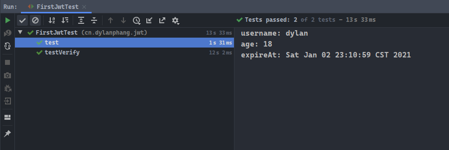
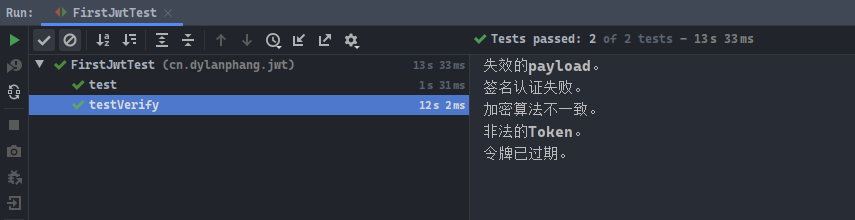

# 前言

- 本篇关于`JWT`。

# 什么是JWT？

- `JSON Web Token`是为了在网络应用环境间传递声明而执行的一种基于`JSON`的开放标准`RFC7519`。该`token`被设计为紧凑且安全的，特别适用于分布式站点的单点登录`SSO`场景。
- `JWT`的声明一般被用来在身份提供者和服务提供者间传递被认证的用户身份信息，以便于从资源服务器获取资源，也可以增加一些额外的其它业务逻辑所必须的声明信息，该`token`也可直接被用于认证，也可被加密。

# 传统的Session认证

- 我们知道，`http`协议本省是一种无状态的协议，而这就意味着如果用户向我们的应用提供了用户名和密码用作用户认证，那么下一次请求时，用户还要再一次进行用户认证。因为根据`http`协议，我们并不能知道是哪个用户发出的请求。
- 因此为了让应用能识别是那个用户发出的请求，我们只能在服务器存储一份用户的登录信息。这份登录信息保存在`Session`中，并通过`Cookie`的方式保存并传递该`Session`的`JSESSIONID`。
- 此时已登录的用户会携带键为`JSESSIONID`的`Cookie`进行下一次请求，服务器端只需要检查指定`ID`的`Session`是否包含该用户的成功登录信息即可完成认证`Authentication`。
- 以上便是基于`Session`的认证操作。但是这种基于`Session`的认证，使应用本身很难得到扩展，随着不同客户端用户的增加，独立的服务器已经无法承载更多的用户，而这时使用基于`Session`认证的问题就会暴露出来。

# 基于Session认证的问题

## 1. Session

- 每个用户经过应用认证之后，应用都要在服务端做一次记录，以方便用户下次请求的鉴别。通常而言`Session`都是保存在内存中的，而随着认证用户的增多，服务端的开销会明显增大。

## 2. 扩展性

- 用户认证之后，服务端做认证操作。如果认证的记录被保存内存中，这意味着用户下次请求必须要在保存了`Session`的服务器上，这样用户才能成功认证并获得相关的授权资源。这很大程度上影响了应用的扩展，如分布式系统。

## 3. CSRF

- `CSRF`跨站请求伪造攻击，因为请求总是基于`Cookie`来进行用户识别与认证，此时一旦`Cookie`被截获，用户就很容易会受到扩展请求伪造的攻击。

# 基于Token的授权机制

- 基于`Token`的授权机制类似于`http`协议一般也是无状态的，它不需要在服务器端中保留用户的认证信息或会话`Session`信息。这就意味着基于`Token`认证机制的应用，不需要考虑用户在哪一台服务器登录，为应用扩展提供了便利。
- 其主要流程是：
  1. 用户使用用户名、密码请求登录服务器；
  2. 服务器对用户信息进行校验；
  3. 校验成功后将响应用户一个`Token`；
  4. 客户端存储该`Token`，并在之后的每次请求中都携带该`Token`；
  5. 服务端会在用户请求时，校验该`Token`是否合法。

- 该`Token`必须要在每次请求时传递给服务器端，它应该被保存在请求头`Request Header`中。另外，服务器端需要指出`CORS`跨域资源共享策略，一般在服务器端配置`Access-Control-Allow-Origin: *`即可。

# JWT的构成

- `JWT`由三部分构成：
  1. `header`：头部，用于存储两类信息：声明类型、声明加密的算法。
  2. `payload`：载荷，用于存放有效信息的部分。通常包含标准中注册的声明、公共的声明和私有的声明。
  3. `signature`：签名，`header`和`payload`经过`BASE64`加密后的信息的字符串结合`header`中声明的加密方式，进一步进行加盐`secret`组合加密后得到的内容，即为签名部分的信息。
- 其中`secret`信息是保存在服务器端的，同时`JWT`的签发也是在服务器端。`secret`相当于服务器端的私钥，该私钥在任何场景下都不应该泄露出去。一旦用户知道该`secret`的值，那意味着客户端可以自行签发`JWT`。

## 头部header

- `JWT`的头部一般包含两类信息，即：声明类型、声明加密的算法。
- 一个完整的`header`可以表示为如下形式：

```json
{
    'typ': 'JWT',
    'alg': 'HS256'
}
```

- 其中`typ`表示`type`，即加密的类型，而`alg`为`algorithm`，即加密算法的类型。

## 载荷payload

- `payload`载荷中一般包含标准中注册的声明、公共的声明和私有的声明。

- 标准中注册的声明（建议但不强制使用）：
  1. `iss`：`JWT`签发者；
  2. `sub`：`JWT`所面向的用户；
  3. `aud`：接收`JWT`的一方；
  4. `exp`：`JWT`的过期时间，这个过期时间必须要大于签发时间；
  5. `nbf`：定义在什么时间之前，该`JWT`不可用；
  6. `iat`：`JWT`的签发时间；
  7. `jti`：`JWT`的唯一身份标识，主要用来作为一次性`token`，从而回避重放攻击。
- 公共的声明：
  - 该声明可以添加任何的信息，一般添加用户的相关信息或其他业务需要的必要信息。但不建议添加敏感信息，如用户密码等，因为该部分在客户端是可以被解密的。
- 私有的声明：
  - 该声明是提供者和消费者所共同定义的声明，同样不建议存放敏感信息，该部分也是可以在客户端被解密的。
- 一个简单的`payload`可以表示为如下形式：

```json
{
    'sub': 'PC-77932',
    'name': 'dylan',
    'admin': true
}
```

## 签名signature

- `JWT`的最后一部分为签名`signature`。该部分是通过结合`header`与`payload`两部分的`Base64`加密后的字符串，并最后根据`header`中提供的加密算法及特地的盐`salt`加密该字符串最终得到的。

# Maven实例

- 入门的代码使用一个简单的`Maven`项目作为演示，需要在`pom.xml`文件中添加`JWT`的相关依赖：

```xml
<dependency>
    <groupId>com.auth0</groupId>
    <artifactId>java-jwt</artifactId>
    <version>3.10.3</version>
</dependency>
```

- 测试类`FirstJwtTest`源码如下，采用直接打印的方式输出结果：
  1. 其中包含了`JWT`对象的基本使用；
  2. 同时包含了认证`token`时可能会出现的异常测试。

```java
package cn.dylanphang.jwt;

import com.auth0.jwt.JWT;
import com.auth0.jwt.JWTVerifier;
import com.auth0.jwt.algorithms.Algorithm;
import com.auth0.jwt.exceptions.*;
import com.auth0.jwt.interfaces.DecodedJWT;
import org.junit.Test;

import java.util.Calendar;
import java.util.Date;

/**
 * @author dylan
 * @date 2020/12/21
 */
@SuppressWarnings("all")
public class FirstJwtTest {

    public static final String SECRET = "DJFOWNERO#@#$";

    @Test
    public void test() {
        // 0.date对象
        final Calendar calendar = Calendar.getInstance();
        calendar.add(Calendar.SECOND, 5);

        // 1.签发token
        final String token = JWT.create()
                .withClaim("username", "dylan")
                .withClaim("age", 18)
                .withExpiresAt(calendar.getTime())
                .sign(Algorithm.HMAC256(SECRET));

        // 2.验证token
        final JWTVerifier verifier = JWT.require(Algorithm.HMAC256(SECRET)).build();
        final DecodedJWT jwt = verifier.verify(token);

        // 3.获取token中的信息
        System.out.println("username: " + jwt.getClaim("username").asString());
        System.out.println("age: " + jwt.getClaim("age").asInt());
        System.out.println("expireAt: " + jwt.getExpiresAt());
    }

    @Test
    public void testVerify() throws InterruptedException {
        // *.date对象
        final Calendar calendar = Calendar.getInstance();
        calendar.add(Calendar.SECOND, 5);
        final Date startTime = calendar.getTime();
        calendar.add(Calendar.SECOND, 5);
        final Date endTime = calendar.getTime();

        // *.签发token
        final String token = JWT.create()
                .withClaim("username", "dylan") // payload中存放的数据
                .withNotBefore(startTime) // 5秒后启用
                .withExpiresAt(endTime) // 10秒后启用
                .sign(Algorithm.HMAC256(SECRET)); // token采用的加密算法

        // 1.token未启用，尝试认证，产生InvalidClaimException异常
        this.verify(token, Algorithm.HMAC256(SECRET));
        Thread.sleep(6000);

        // 2.伪造token或提供不一致的盐salt，产生SignatureVerificationException异常
        this.verify(token, Algorithm.HMAC256(SECRET + "d"));

        // 3.提供非加密的算法，产生AlgorithmMismatchException异常
        this.verify(token, Algorithm.HMAC384(SECRET));

        // 4.提供非法的token，产生JWTDecodeException异常
        final String illegalToken = token.replace('.', '#');
        this.verify(illegalToken, Algorithm.HMAC256(SECRET));

        // 5.等待过期后测试，产生TokenExpiredException异常
        Thread.sleep(6000);
        this.verify(token, Algorithm.HMAC256(SECRET));
    }

    /**
     * 认证中会出现的异常。
     *
     * @param token     token
     * @param algorithm algorithm
     */
    public void verify(String token, Algorithm algorithm) {
        final JWTVerifier verifier = JWT.require(algorithm).build();
        try {
            final DecodedJWT jwt = verifier.verify(token);
        } catch (InvalidClaimException e) {
            System.out.println("失效的payload。");
        } catch (SignatureVerificationException e) {
            System.out.println("签名认证失败。");
        } catch (AlgorithmMismatchException e) {
            System.out.println("加密算法不一致。");
        } catch (JWTDecodeException e) {
            System.out.println("非法的Token。");
        } catch (TokenExpiredException e) {
            System.out.println("令牌已过期。");
        } catch (Exception e) {
            e.printStackTrace();
        }

    }
}
```

- 方法`test()`测试输出：



- 方法`testVerify()`测试输出：



- 关于认证可能出现的异常对象说明：
  1. `InvalidClaimException`：服务器端签发`token`时，可以设置`token`的启用时间，如果未到启用时间却去认证`token`，则会出现此异常；
  2. `SignatureVerificationException`：签名认证异常，该异常通常发生在`token`被恶意篡改或认证盐不正确的情况；
  3. `AlgorithmMismatchException`：算法错误异常，当服务器端使用非加密算法对`token`进行认证时，会出现此异常；
  4. `JWTDecodeException`：此异常通常发生在提供了一个非法`token`的情况，也就是提供的`token`不符合相关`token`的定义格式；
  5. `TokenExpiredException`：`token`过期异常，当服务器端对一个已过期的`token`进行认证时，将抛出此异常。
- 在实际开发中，可以将`JWT`封装为工具类：

```java
package cn.dylanphang.util;

import com.auth0.jwt.JWT;
import com.auth0.jwt.JWTCreator;
import com.auth0.jwt.JWTVerifier;
import com.auth0.jwt.algorithms.Algorithm;
import com.auth0.jwt.interfaces.DecodedJWT;

import java.util.Calendar;
import java.util.Map;

/**
 * @author dylan
 * @date 2020/12/21
 */
@SuppressWarnings("All")
public class JWTUtils {
    public static final String SALT = "#&HEO#^$KF(^(@#HN";

    /**
     * 方法的形参为payload中的数据。
     *
     * @param map map
     * @return token
     */
    public static String getToken(Map<String, String> map) {
        final Calendar calendar = Calendar.getInstance();
        calendar.add(Calendar.DATE, 7);

        final JWTCreator.Builder builder = JWT.create();
        map.forEach(builder::withClaim);

        return builder.withExpiresAt(calendar.getTime()).sign(Algorithm.HMAC256(SALT));
    }

    /**
     * 只检查token合法性。
     *
     * @param token token
     * @return boolean
     */
    public static boolean verify(String token) {
        try {
            final JWTVerifier verifier = JWT.require(Algorithm.HMAC256(SALT)).build();
            verifier.verify(token);
        } catch (Exception e) {
            return false;
        }
        return true;
    }

    /**
     * 使用验证对象验证token合法性同时返回decodedJWT对象。
     *
     * @param token token
     * @return decodeJWT
     */
    public static DecodedJWT getDecodedJWT(String token) {
        return JWT.require(Algorithm.HMAC256(SALT)).build().verify(token);
    }
}
```

# SpringBoot实例

- 待续...

# 安全相关

- 不应该在`JWT`中的`payload`部分存放敏感信息；
- 关于盐加密中的盐`salt`（或`secret`）不能泄露，该密钥只能够保存在服务器端；
- 如果可以，尽量使用`https`协议。