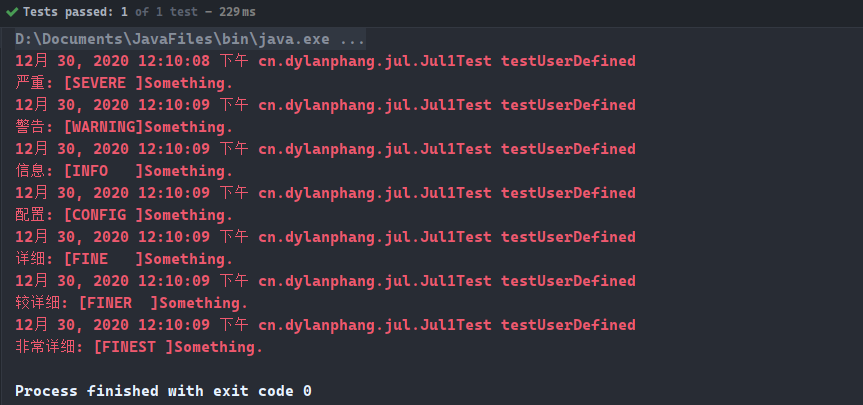
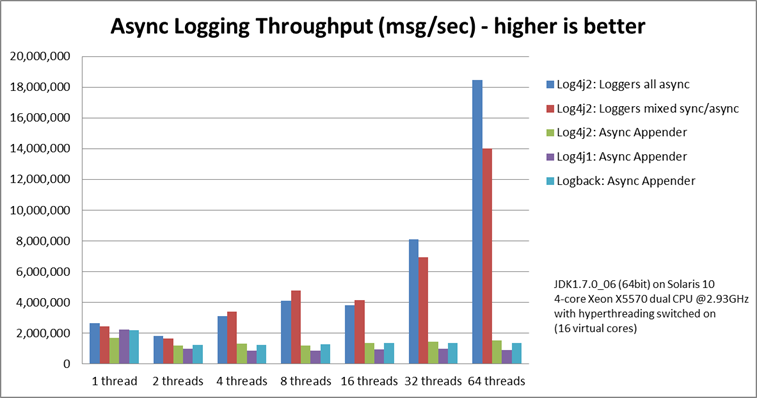

# 简介

- 本篇将介绍日志门面`JCL`、`slf4J`，以及日志实现`JUL`、`log4j`、`logback`、`log4j2`。
- 篇幅较长，但内容会比较详尽。

# JUL日志实现

- `JUL`全称`Java Util Logging`，是`Java`原生的日志实现，使用时不需要另外引入第三方类库，相对于其他日志实现来说其特点是使用方便，能够在小型应用中灵活应用。
- `JUL`日志实现使用的频率并不高，但一旦需要解除此类的代码，仍然要求开发人员能够迅速看懂代码，并理解。

## 1. 框架结构

- 结构图：


- `Loggers`：被称为记录器，应用程序通过获取`Logger`对象，调用其`API`来发布日志信息，`Logger`通常是应用程序访问日志系统的入口程序；
- `Appenders`：也被称为`Handlers`，每个`Logger`都会关联一组`Handlers`，`Logger`会将日志交给关联的`Handlers`处理，由`Handlers`负责将日志记录；`Handlers`在此是一个抽象类，由其具体的实现决定日志记录的位置是控制台、文件、网络上的其他日志服务异或是操作系统日志；
- `Layouts`：也被称为`Formatters`，它负责对日志事件中的数据进行转换和格式化，`Layouts`决定了记录的数据在一条日志记录中的最终显示形式；
- `Level`：每条日志消息都有一个关联的日志级别。该级别粗略指导了日志消息的重要性和紧迫，可以将`Level`和`Loggers`或`Appenders`做关联以便于我们过滤消息；
- `Filters`：过滤器，根据需要定制哪些信息会被记录，哪些信息会被放过。
- 一个完整的日志记录过程如下：
  1. 用户使用`Logger`来进行日志记录的行为，`Logger`可以同时持有若干个`Handler`，日志输出操作是由`Handler`完成的；
  2. 在`Handler`输出日志前，会经过`Filter`的过滤，判断哪些日志级别放行、哪些拦截，`Handler`会将日志内容输出到指定位置（日志文件、控制台等）；
  3. `Handler`在输出日志时会使用`Layout`对日志内容进行排版，之后再输出到指定的位置。

## 2. 入门案例

- 示例代码：

```java
@Test
public void testQuick() {
    // 1.创建JUL Logger对象无法传入class对象，迂回战术可以获取该类之后获取名字
    Logger logger = Logger.getLogger(JulTest.class.getName());

    // 2.输出日志的两种方式，其中日志级别共有7种，还有2种特殊级别
    logger.info("Hello, here is Java Util Logging");
    logger.log(Level.INFO, "You can also use this way to output log.");

    // 3.尽量不采用拼接字符串的形式，采用占位符的形式，占位符中需要填写索引编号
    String name = "dylan";
    int age = 12;

    logger.log(Level.INFO, "[USER]:{0} [AGE]:{1}", new Object[]{name, age});
}
```

## 3. 日志级别

- `JUL`内置工`7`种日志级别，另外有`2`中特殊级别：
- `java.util.logging.Level`中定义了`7`种日志级别：
  1. `SEVERE`（最高等级）
  2. `WARNING`
  3. `INFO`（默认等级）
  4. `CONFIG`
  5. `FINE`
  6. `FINER`
  7. `FINEST`（最低等级）
- 还有`2`种特殊日志级别，用于开关日志：
  1. `OFF`：可用于关闭日志记录；
  2. `ALL`：启用所有消息的日志记录。
- 示例代码：
  1. 默认的日志级别是由`RootLogger`决定的，所有的`Logger`对象默认都会继承并使用`RootLogger`所提供的控制台输出处理器对象`ConsoleHandler`；
  2. 同时，`RootLogger`的默认日志输出等级为`INFO`，则所有未经配置的`Logger`默认也是使用该日志级别。

```java
/**
 * JUL默认的日志级别是Info，所有级别高于等于Info的日志都会被输出控制台。
*/
@Test
public void testLogLevel() {
    // 1.获取日志记录器对象，其中getLogger的参数name是此日志对象Logger的名称，可以由logger.getName()取出
    final Logger logger = Logger.getLogger("cn.dylanphang.jul.JulTest");

    // 2.使用默认的ConsoleHandler输出各级别的日志，默认情况下只有Server、Warning和Info会输出到控制台
    logger.severe("Level Severe.");
    logger.warning("Level Warning.");
    logger.info("Level Info.");
    logger.config("Level Config.");
    logger.fine("Level Fine.");
    logger.finer("Level Finer.");
    logger.finest("Level Finest");
}
```

- 运行输出：


- 尽管代码中定义了输出`INFO`等级以下的日志，但实际控制台中并没有相关的日志信息，这是因为此时创建的`Logger`对象继承并使用了`RootLogger`中的日志等级和处理器对象。
- 考虑以下代码：

```java
@Test
public void testFindDefault() {
    final Logger logger = Logger.getLogger("cn.dylanphang.jul.JulTest");

    System.out.println("Default Logger's Level: " + logger.getLevel());
    System.out.println("Default Logger's Handlers' Quantity: "  + logger.getHandlers().length);
}
```

- 其中采用更为直观的方式打印当前`Logger`对象的日志等级，和与其关联的处理器对象数量。运行输出，得到：


- 这并不意外，默认情况下由于`Logger`继承并使用`RootLogger`中的日志等级与处理器对象，因此对于它自身来说，并不拥有任何的日志等级信息与处理器对象。
- 考虑以下代码：

```java
@Test
public void testParentLogger() {
    final Logger logger = Logger.getLogger("cn.dylanphang.jul.JulTest");
    final Logger loggerParent = logger.getParent();

    System.out.println("Logger's Default Parent Logger is: " + loggerParent.getClass().getSimpleName());
    System.out.println("Parent Logger's Level: " + loggerParent.getLevel());
    System.out.println("Parent Logger's Handlers' Quantity: " + loggerParent.getHandlers().length);

    for (Handler handler : loggerParent.getHandlers()) {
        System.out.println("Default " + handler.getClass().getSimpleName() + "'s Level: " + handler.getLevel());
    }
}
```

- 同样采用更直观的方式打印当前`Logger`的父日志相关信息，得到以下输出：


- 至此，不难推断出`Logger`的日志输出等级取决于`RootLogger`。
- 还有一个定论，即`Logger`和`Handler`的日志等级是相互牵制的，其中等级较高一方的配置生效。
- 通过更改`RootLogger`中的日志级别及其`ConsoleHandler`的日志级别，编写以下代码：

```java
@Test
public void testLevel() {
    // 0.准备工作
    final Logger logger = Logger.getLogger("cn.dylanphang.jul.JulTest");
    final Logger parent = logger.getParent();

    // 1.RootLogger日志等级高于ConsoleHandler日志等级
    parent.setLevel(Level.WARNING);
    parent.getHandlers()[0].setLevel(Level.CONFIG);

    logger.severe("[SEVERE ]Something.");
    logger.warning("[WARNING]Something.");
    logger.info("[INFO   ]Something.");
    logger.config("[CONFIG ]Something.");

    System.out.println("=============================================");

    // 2.RootLogger日志等级小于ConsoleHandler日志等级
    parent.setLevel(Level.FINER);

    logger.severe("[SEVERE ]Something.");
    logger.warning("[WARNING]Something.");
    logger.info("[INFO   ]Something.");
    logger.config("[CONFIG ]Something.");
    logger.fine("[FINE   ]Something.");
    logger.finer("[FINER  ]Something.");
}
```

- 运行输出：


- 程序的输出与此前的定论一致。

## 4. 自定义配置

- 通常会在单独的配置文件中去配置`Logger`的日志等级和处理器类型等，但作为入门，需要了解如何在`Java`代码中，通过更改`Logger`日志级别和配置自定义`ConsoleHandler`的方式，去影响日志输出。
- 如果不希望`Logger`对象使用`RootLogger`中的日志级别进行输出，则需要对`Logger`进行以下配置：
  1. 重新设置`Logger`的日志输出等级；
  2. 重新配置`Logger`的处理器`Handler`类型，并不再使用`RootLogger`中提供的默认处理器。
- 测试类`testUserDefined`源码如下：

```java
@Test
public void testUserDefined() {
    // 1.获取日志记录器对象
    Logger logger = Logger.getLogger("cn.dylanphang.jul.JulTest");

    // 2.配置Logger使其不再继承使用RootLogger中的所有Handler
    logger.setUseParentHandlers(false);

    // 3.自定义ConsoleHandler对象，并配置该处理器的日志等级
    ConsoleHandler consoleHandler = new ConsoleHandler();
    consoleHandler.setLevel(Level.ALL);

    // 4.为Logger添加自定义的ConsoleHandler
    logger.addHandler(consoleHandler);

    // 5.由于Logger默认会使用RootLogger的日志等级，如果希望输出Level.ALL的日志，同时需要设置Logger的日志等级也为Level.ALL
    // *.否则，Logger将会使用RootLogger的默认日志等级INFO，最终日志只会输出等级高于或等于INFO的内容
    logger.setLevel(Level.ALL);

    // 6.分别输出各等级的日志
    logger.severe("[SEVERE ]Something.");
    logger.warning("[WARNING]Something.");
    logger.info("[INFO   ]Something.");
    logger.config("[CONFIG ]Something.");
    logger.fine("[FINE   ]Something.");
    logger.finer("[FINER  ]Something.");
    logger.finest("[FINEST ]Something.");
}
```

- 运行输出：



- 而开发中较为经常的使用方式，是通过`logging.properties`文件的方式进行配置：
  1. 程序中需要编写代码去显示加载`logging.properties`文件以启用自定义的配置；
  2. 配置文件中，`Handler`是单独进行配置的，开发人员可以单独定义控制台输出日志的处理器对象`ConsoleHandler`或文件输出日志的处理器对象`FileHandler`等；
  3. 具备相关自定义`Handler`后，需要将`Logger`与`Handler`进行关联，配置文件支持`RootLogger`或指定名称的`Logger`与自定义`Handler`进行关联；
  4. 无论任何时候，都需要明确日志最终的输出等级，是同时由`Logger`与其相关联的`Handler`所决定的。

```properties
# RootLogger的日志级别（默认INFO)，所有的Handler都受限于此日志级别，Handler的日志级别可以比RootLogger的日志级别高
.level=ALL
# RootLogger默认的处理器，可以配置多个，所有非手动解除父日志的子日志都将使用这些处理器
handlers=java.util.logging.ConsoleHandler, java.util.logging.FileHandler

# ConsoleHandler控制台输出处理器配置
# 指定ConsoleHandler默认日志级别
java.util.logging.ConsoleHandler.level=ALL
java.util.logging.ConsoleHandler.encoding=UTF-8

# FileHandler文件输出处理器配置
# 指定FileHandler默认日志级别
java.util.logging.FileHandler.level=INFO
# 日志文件输出路径
java.util.logging.FileHandler.pattern=/dylan%u.log
# 单个日志文件大小，单位是bit，1024bit即为1kb
java.util.logging.FileHandler.limit=1024*1024*10
# 日志文件数量，如果数量为2，则会生成dylan.log.0文件和dylan.log.1文件，总容量为: (limit * count)bit
java.util.logging.FileHandler.count=1
# FileHandler持有的最大并发锁数
java.util.logging.FileHandler.maxLocks=100
# 指定要使用的Formatter类的名称，FileHandler默认使用的是XMLFormatter
java.util.logging.FileHandler.formatter=java.util.logging.SimpleFormatter
# 涉及中文日志就最好加上编码集
java.util.logging.FileHandler.encoding=UTF-8
# 是否以追加方式添加日志内容
java.util.logging.FileHandler.append=true
# SimpleFormatter的输出格式配置
java.util.logging.SimpleFormatter.format=%4$s: %5$s [%1$tc]%n

# 自定义日志级别，其中”cn.hanna“指的是Logger.getLogger(String name)中的入参name！！！
cn.hanna.handlers=java.util.logging.ConsoleHandler
cn.hanna.level=INFO
# 如果此时不关闭名为cn.hanna的Logger的父日志处理器，则在控制台会同时出现父日志处理器和自定义的处理器，消息将重复输出
cn.hanna.useParentHandlers=false
```

- 测试类`test()`的加载过程如下：
  1. 项目是通过`Maven`构建的，默认使用`getResourceAsStream(String fileName)`将读取`resource`目录下的配置文件；
  2. 其中`LogManager`对象是用于全局配置日志的管理对象，它是单例的，使用它来加载应用配置文件；
  3. 配置文件使用`readConfiguration(InputStream is)`加载应用后，`RootLogger`的日志级别和与之关联的`Handler`及其日志级别就已经配置完毕，与`logging.properties`中一致；
  4. 同时特殊名称`cn.hanna`的`Logger`会遵循配置文件中设置的日志等级`INFO`，其关闭依赖`RootLogger`，同时仅仅将日志输出到控制台中。

```java
@Test
public void testUserDefined() throws IOException {
    // 1.读取配置文件
    final InputStream is =
        Jul2Test.class.getClassLoader().getResourceAsStream("logging.properties");

    // 2.获取LogManager，LogManager是单例对象，并加载应用配置文件logging.properties
    final LogManager logManager = LogManager.getLogManager();
    logManager.readConfiguration(is);

    // 4.正常输出日志
    final Logger loggerNormal = Logger.getLogger(this.getClass().getName());

    loggerNormal.severe("[SEVERE ]Something.");
    loggerNormal.warning("[WARNING]Something.");
    loggerNormal.info("[INFO   ]Something.");
    loggerNormal.config("[CONFIG ]Something.");
    loggerNormal.fine("[FINE   ]Something.");
    loggerNormal.finer("[FINER  ]Something.");
    loggerNormal.finest("[FINEST ]Something.");

    System.out.println("=============================================");

    // 5.指定日志对象的名称，配置文件中对cn.hanna名称的Logger进行了特殊配置
    final Logger loggerSpecial = Logger.getLogger("cn.hanna");

    loggerSpecial.severe("[SEVERE ]Something.");
    loggerSpecial.warning("[WARNING]Something.");
    loggerSpecial.info("[INFO   ]Something.");
    loggerSpecial.config("[CONFIG ]Something.");
    loggerSpecial.fine("[FINE   ]Something.");
    loggerSpecial.finer("[FINER  ]Something.");
    loggerSpecial.finest("[FINEST ]Something.");
}
```

- 运行测试，控制台输出：


- 日志文件`dylan0.log`输出：


## 4. 占位符相关

- 留意到配置内`formatter`中的包含了相关占位符，如果希望掌握这一部分的含义，需要首先了解`String.format()`的使用。
- 考虑以下代码：

```java
@Test
public void test() {
    String name = "Mike";
    double score = 89;
    Calendar calendar = Calendar.getInstance();
    calendar.set(1992, Calendar.JANUARY, 3);

    final String formatA = String.format("[%1$-5s] %2$tF score: (%3$-8.2f)", name, calendar, score);
    final String formatB = String.format("[%1$-5s] %2$tY-%2$tm-%2$td score: (%3$8.2f)", name, calendar, score);

    System.out.println(formatA);
    System.out.println(formatB);
}
```

- 运行输出：


- 可以看到，`String.format`可以将数据按照指定的格式转换为`String`类型的数据，其中需要遵循以下规则：
  - `%[argument_index$][flags][width][.precision]conversion`
- 参数说明：

|       参数        |                             描述                             |
| :---------------: | :----------------------------------------------------------: |
| `argument_index$` |  格式化参数在`String.format`中的索引位置，从`1`开始计算索引  |
|      `flags`      | 关于此格式化数据的额外格式设定，如左对齐`-`、是否显示正负数符号`+` |
|      `width`      | 此格式数据所占用的宽度。当宽度大于参数的实际宽度时，会自动将格式化数据右对齐 |
|   `.precision`    | 需要格式化的是一个浮点数时，可以自定义该浮点数格式化后所需保留的小数点位数 |
|   `conversion`    |                 表示需要格式的数据类型是什么                 |

- 关于`String.format`的详细内容，可以参考以下网址，其中提供了大量的关于各种类型的各种格式化占位符信息：
  - https://docs.oracle.com/javase/7/docs/api/java/util/Formatter.html
- 了解`String.format`后，需要知道其实日志记录的格式化，内部使用的也是`String.format`，形式如下：
  - `String.format(format, date, source, logger, level, message, thrown);`
- 参数说明：

|   参数    |                             描述                             |
| :-------: | :----------------------------------------------------------: |
| `format`  | `SimpleFormatter.format`中使用的格式，也是配置文件`logging.properties`中定义的格式 |
|  `date`   |                        日志的输出日期                        |
| `source`  |        日志的调用者，如果不存在则会输出日志对象的名称        |
| `logger`  |                        日志对象的名称                        |
|  `level`  |                           日志等级                           |
| `message` |                           日志信息                           |
| `thrown`  |  当有异常时，会在日志信息中包含异常信息，如果不存在则不输出  |

- 关于`SimpleFormatter`的详细内容，可以参考以下网址，其中包含了更详细的说明与示例：
  - https://docs.oracle.com/javase/7/docs/api/java/util/logging/SimpleFormatter.html
- 初步了解相关原理后，重新审视配置文件中的`%4$s: %5$s [%1$tc]%n`：
  1. `%4$s`：索引位`4`是`level`，表示日志等级，数据类型是`String`，使用的`conversion`为`s`；
  2. `%5$s`：索引位`5`是`message`，表示日志信息，数据类型是`String`，使用的`conversion`为`s`；
  3. `%1$tc`：索引位`1`是`date`，表示日志输出日期，数据类型是`Date`，使用的`conversion`为`tc`；
  4. `%n`：换行符。
- 因此，当运行代码`logger.severe("[SEVERE ]Something.");`，将得到日志记录，对比自定义格式：


- 格式与日志输出格式一致。

## 5. 过滤器配置

- 关于`Filter`过滤器，了解即可。
- 代码中需要使用`Logger`对象中的`setFilter`方法，配置一个`Filter`对象，其源码如下：

```java
@FunctionalInterface
public interface Filter {

    /**
     * Check if a given log record should be published.
     * @param record  a LogRecord
     * @return true if the log record should be published.
     */
    public boolean isLoggable(LogRecord record);
}
```

- 其中真正控制日志是否运行记录的对象是`LogRecord`，使用其中的`getMessage()`可以获取到日志信息。
- 当方法`isLoggable`返回`false`时，不记录日志；返回`true`则记录日志。
- 测试代码如下：
  - 其中使用`lambda`表达式，返回的结果为`!record.getMessage().contains("What")`，即如果日志记录包含了关键字`What`，则返回`false`，表示过滤该条日志信息，不进行记录操作。
```java
@Test
public void test() throws IOException {
    final InputStream is =
        Jul3Test.class.getClassLoader().getResourceAsStream("logging.properties");
    final LogManager logManager = LogManager.getLogManager();
    logManager.readConfiguration(is);

    final Logger logger = Logger.getLogger(this.getClass().getName());

    logger.severe("[SEVERE ]Something What.");
    logger.warning("[WARNING]Something.");
    logger.info("[INFO   ]Something.");
    logger.config("[CONFIG ]Something.");
    logger.fine("[FINE   ]Something What.");
    logger.finer("[FINER  ]Something.");
    logger.finest("[FINEST ]Something What.");

    System.out.println("=============================================");

    // *.配置过滤器Filter
    logger.setFilter((x) -> !x.getMessage().contains("What"));

    logger.severe("[SEVERE ]Something What.");
    logger.warning("[WARNING]Something.");
    logger.info("[INFO   ]Something.");
    logger.config("[CONFIG ]Something.");
    logger.fine("[FINE   ]Something What.");
    logger.finer("[FINER  ]Something.");
    logger.finest("[FINEST ]Something What.");
}
```

- 运行输出：


- `Filter`生效并成功将包含`What`的日志记录过滤。

## 6. 完整的配置文件示例

- 最后贴一个`JUL`可用的配置文件示例，其中`RootLogger`仅使用了`ConsoleHandler`输出日志：

```properties
.level=ALL
handlers=java.util.logging.ConsoleHandler

java.util.logging.ConsoleHandler.level=ALL
java.util.logging.ConsoleHandler.encoding=UTF-8

java.util.logging.FileHandler.level=INFO
java.util.logging.FileHandler.pattern=/sample%u.log
java.util.logging.FileHandler.limit=1024*1024*10
java.util.logging.FileHandler.count=1
java.util.logging.FileHandler.maxLocks=100
java.util.logging.FileHandler.formatter=java.util.logging.SimpleFormatter
java.util.logging.FileHandler.encoding=UTF-8
java.util.logging.FileHandler.append=true
java.util.logging.SimpleFormatter.format=%4$s: %5$s [%1$tc]%n

cn.xyz.handlers=java.util.logging.ConsoleHandler, java.util.logging.FileHandler
cn.xyz.level=INFO
cn.xyz.useParentHandlers=false
```

- 关于其他的`Handler`不作演示了，因为实际遇到的情况很少，有需要的时候查阅相关官方资料即可。

# Log4j日志实现

- `Log4j`全称是`Log for Java`，它是`Apache`的一个开源项目，通过使用`Log4j`，我们可以控制日志信息输出的位置是控制台、文件还是`GUI`组件，输出位置甚至可以是套接口服务器、`NT`的事件记录器、`UNIX Syslog`守护进程等；
- 使用`Log4j`也可以控制每一条日志的输出格式；通过定义每一条日志信息的级别，我们能够更加细致地控制日志的生成过程。

## 1. 入门案例

- 所使用的项目使用`Maven`构建，需要引入`Log4j`依赖：

```xml
<dependency>
    <groupId>log4j</groupId>
    <artifactId>log4j</artifactId>
    <version>1.2.17</version>
</dependency>
```

- `Log4j`默认情况下是需要提供配置文件的，如果`resource`目录下不存在`log4j.properties`配置文件，则控制台中会输出相应的警告信息，考虑以下代码：

```java
@Test
public void test() {
	// 1.在没有log4j.properties的情况下，获取日志记录器对象Logger
    Logger logger = Logger.getLogger(Log4jTest.class);

    // 2.尝试输出日志记录
    logger.info("Hey, log4j.");
}
```
- 此时控制台输出为：


- 接触过`JUL`的都知道`RootLogger`的都知道普通的`Logger`如果没有进行额外的配置，默认继承并使用`RootLogger`的配置。
- 同样地，`Log4j`中也存在`RootLogger`，但由于默认情况下`RootLogger`不具有任何的`Appender`（即`Handler`）。
- 如果代码仅为了测试某项功能，并不想编写复杂的`log4j.properties`，可以使用`Log4j`提供的默认配置，在获取`Logger`前使用以下代码加载默认配置：
  - `BasicConfigurator.configure();`
- 查看`configure()`方法的源码：

```java
/**
   Add a {@link ConsoleAppender} that uses {@link PatternLayout}
   using the {@link PatternLayout#TTCC_CONVERSION_PATTERN} and
   prints to <code>System.out</code> to the root category.  */
static
public
void configure() {
  Logger root = Logger.getRootLogger();
  root.addAppender(new ConsoleAppender(
         new PatternLayout(PatternLayout.TTCC_CONVERSION_PATTERN)));
}
```

- 古早时期的源码格式有点不太现代，但意义明确：为`RootLogger`对象添加一个`Appender`，其中`Appender`的类型为控制器输出的`ConsoleAppender`，输出的格式使用`PatternLayout.TTCC_CONVERSION_PATTERN`。

- 以下为`PatternLayout.TTCC_CONVERSION_PATTERN`源码：

```java
/** A conversion pattern equivalent to the TTCCCLayout.
    Current value is <b>%r [%t] %p %c %x - %m%n</b>. */
public final static String TTCC_CONVERSION_PATTERN
                                           = "%r [%t] %p %c %x - %m%n";
```
- 关于`PatternLayout`的相关格式化规则，后续会列举出来。
- 于是，使用以下代码加载默认配置并输出日志：


```java
@Test
public void testQuick() {
    // 1.初始化配置信息，使用默认的配置，如果不加载默认配置同时不具有log4j.properties配置文件，程序将发出警告
    BasicConfigurator.configure();

    // 2.获取日志记录器对象Logger
    Logger logger = Logger.getLogger(Log4jTest.class);

    // 3.日志记录输出
    logger.info("Hey, log4j.");
}
```

- 此时控制台输出为：


## 2. 日志级别

- `Log4j`中的日志级别与`JUL`的不同，一共提供了`6`中日志级别：
  1. `FATAL`：严重错误，一般会造成系统崩溃并终止运行；
  2. `ERROR`：错误信息，不会影响系统运行；
  3. `WARN`：警告信息，可能会发生问题；
  4. `INFO`：运行信息，数据连接、网络连接、`I/O`操作等等；
  5. `DEBUG`：调试信息，一般在开发中使用，记录程序变量参数传递信息等等。默认级别；
  6. `TRACE`：追踪信息，记录程序所有的流程信息。
- 参考以下示例代码：

```java
@Test
public void testQuick() {
    // 1.初始化配置信息，使用默认的配置，如果不加载默认配置同时不具有log4j.properties配置文件，程序将发出警告
    BasicConfigurator.configure();

    // 2.获取日志记录器对象Logger
    Logger logger = Logger.getLogger(Log4jTest.class);

    // 3.日志级别测试
    logger.fatal("[FATAL] 严重错误，一般会造成系统崩溃并终止运行。");
    logger.error("[ERROR] 错误信息，不会影响系统运行。");
    logger.warn("[WARN] 警告信息，可能会发生问题。");
    logger.info("[INFO] 运行信息，数据连接、网络连接、I/O操作等等。");
    logger.debug("[DEBUG] 调试信息，一般在开发中使用，记录程序变量参数传递信息等等。默认级别。");
    logger.trace("[TRACE] 追踪信息，记录程序所有的流程信息。");
}
```

- 运行输出，得到：


- 输出的日志仍然由默认的日志级别所决定，其中默认级别为`DEBUG`。
- 为了测试默认日志级别，可以使用以下代码测试`RootLogger`：
  1. 使用`getRootLogger()`获取`RootLogger`对象；
  2. 使用`RootLogger`中的相关方法获取日志对象的日志等级及其关联的`Appender`详情。

```java
@Test
public void testDetails() {
    // 1.初始化配置信息，使用默认的配置，如果不加载默认配置，将无法正常运行
    BasicConfigurator.configure();

    // 2.获取日志记录器对象RootLogger
    final Logger rootLogger = Logger.getRootLogger();

    // 3.输出配置详情
    System.out.println("Logger level: " + rootLogger.getLevel());
    final Enumeration allAppenders = rootLogger.getAllAppenders();
    while (allAppenders != null && allAppenders.hasMoreElements()) {
        final Appender appender = (Appender) allAppenders.nextElement();
        System.out.println("Appender is: " +appender.getClass().getSimpleName());
    }
}
```

- 运行输出：


- 注意，对于`Log4j`中的`Appender`来说，它们不具有日志等级，只有`Logger`对象具有日志等级。

## 3. Log4j相关组件

- `Log4J`主要由`Loggers `(日志记录器)、`Appenders`（输出端）和`Layout`（日志格式化器）组成：
  - `Loggers`：控制日志的输出级别与日志是否输出；
  - `Appenders`：指定日志的输出方式（输出到控制台、文件等）；
  - `Layout`：控制日志信息的输出格式。

### a. Logger

- 日志记录器，负责收集处理日志记录，`Logger`的实例命名通常是类的全限定类名。
- `Logger`的名字大小写敏感，其命名有继承机制。
  - 例如：`name`为`org.apache.commons`的`logger`会继承`name`为`org.apache`的`logger`。
- 自`log4j 1.2`版以来， `Logger`类已经取代了`Category`类。对于熟悉早期版本的`log4j`的人来说，`Logger`类可以被视为`Category`类的别名。

### b. Appenders

- `Appender`用来指定日志输出到哪个地方，可以同时指定日志的输出目的地。
- `Log4j`常用的输出目的地有以下几种：

|         输出端类型         |                             作用                             |
| :------------------------: | :----------------------------------------------------------: |
|     `ConsoleAppender`      |                      将日志输出到控制台                      |
|       `FileAppender`       |                      将日志输出到文件中                      |
| `DailyRollingFileAppender` |        将日志输出到一个日志文件，周期为天，即每天输出        |
|   `RollingFileAppender`    | 将日志信息输出到一个日志文件，并且指定文件的大小，当超过指定大小，会自动将文件重命名，同时产生一个新的文件 |
|       `JDBCAppender`       |                   将日志信息保存到数据库中                   |

### c. Layouts

- 布局器`Layouts`用于控制日志输出内容的格式，我们可以使用各种自定义格式输出日志。
- `Log4j`常用的`Layouts`有以下几种:

|  格式化器类型   |                             作用                             |
| :-------------: | :----------------------------------------------------------: |
|  `HTMLLayout`   |                 格式化日志输出为HTML表格形式                 |
| `SimpleLayout`  |      简单的日志输出格式，打印的日志格式为`info-message`      |
| `PatternLayout` | 最强大的格式化方式，可以根据自定义格式输出日志，如果没有指定转换格式，则使用默认的转换格式 |

- `PatternLayout`中的格式化规则：

```pro
* log4j采用类似C语言的printf函数的打印格式格式化日志信息，具体的占位符及其含义如下：
    %m 	输出代码中指定的日志信息
    %p 	输出优先级，及DEBUG、INFO等
    %n 	换行符（Windows平台的换行符为"\n"，Unix平台为"\n"）
    %r 	输出自应用启动到输出该 log 信息耗费的毫秒数
    %c 	输出打印语句所属的类的全名
    %t 	输出产生该日志的线程全名
    %d 	输出服务器当前时间，默认为ISO8601，也可以指定格式，如：%d{yyyy年MM月dd日 HH:mm:ss}
    %l 	输出日志时间发生的位置，包括类名、线程、及在代码中的行数。如：Test.main(Test.java:10)
    %F 	输出日志消息产生时所在的文件名称
    %L 	输出代码中的行号
    %% 	输出一个"%"字符

* 可以在%与字符之间加上修饰符来控制最小宽度、最大宽度和文本的对其方式。如：
    %5c 	输出category名称，最小宽度是5，category<5，默认的情况下右对齐
    %-5c 	输出category名称，最小宽度是5，category<5，"-"号指定左对齐,会有空格
    %.5c 	输出category名称，最大宽度是5，category>5，就会将左边多出的字符截掉，<5不会有空格
    %20.30c category名称<20补空格，并且右对齐，>30字符，就从左边交远销出的字符截掉
```

## 4. 自定义配置

- 使用`Log4j`不需要显式地加载配置文件，对于`Maven`项目来说，程序会自动扫描`resources`目录下的`log4j.properties`配置文件。

- 自定义配置如下：
  1. 日志输出等级为`INFO`，此时`RootLogger`拥有三个`Appender`：
     1. `ConsoleAppender`：配置中的命名为`Console`；
     2. `DailyRollingFileAppender`：配置中的命名为`UserDefinedName`；
     3. `JDBCAppender`：配置中的命名为`logDB`。
  2. `RootLogger`的默认输出级别配置在`log4j.rootLogger`的首位，随后紧跟的是关联的`Appender`的名称，表示其默认支持输出的方式有哪些。

```properties
# 指定日志的输出级别与输出端
log4j.rootLogger=INFO, Console, UserDefinedName, logDB

# 控制台输出配置
log4j.appender.Console=org.apache.log4j.ConsoleAppender
log4j.appender.Console.layout=org.apache.log4j.PatternLayout
log4j.appender.Console.layout.ConversionPattern=%d [%t] %-5p [%c] - %m%n

# 文件输出配置
log4j.appender.UserDefinedName=org.apache.log4j.DailyRollingFileAppender
# 指定日志的输出路径
log4j.appender.UserDefinedName.File=log4j.log
# 是否以追加日志的形式添加
log4j.appender.UserDefinedName.Append=true
# 使用自定义日志格式化器
log4j.appender.UserDefinedName.layout=org.apache.log4j.PatternLayout
# 指定日志的输出格式
log4j.appender.UserDefinedName.layout.ConversionPattern=%-d{yyyy-MM-dd HH:mm:ss} [%t:%r] - [%p] %m%n
# 指定日志的文件编码
log4j.appender.UserDefinedName.encoding=UTF-8

# MySQL输出配置
log4j.appender.logDB=org.apache.log4j.jdbc.JDBCAppender
log4j.appender.logDB.layout=org.apache.log4j.PatternLayout
log4j.appender.logDB.Driver=com.mysql.cj.jdbc.Driver
log4j.appender.logDB.URL=jdbc:mysql://localhost:3306/test?serverTimezone=GMT%2B8&useAffectedRows=true
log4j.appender.logDB.User=root
log4j.appender.logDB.Password=root
log4j.appender.logDB.Sql=INSERT INTO log(project_name, create_date, level, category, file_name, thread_name, line, all_category, message) \
  values('log4j', '%d{yyyy-MM-dd HH:mm:ss}', '%p', '%c', '%F', '%t', '%L', '%l', '%m')
```

- 配置中包含了`sql`输出日志的方式，`log`表的创建代码为：

```sql
CREATE TABLE `log` (
	`log_id` INT ( 11 ) NOT NULL AUTO_INCREMENT,
	`project_name` VARCHAR ( 255 ) DEFAULT NULL COMMENT '项目名称',
	`create_date` VARCHAR ( 255 ) DEFAULT NULL COMMENT '创建时间',
	`level` VARCHAR ( 255 ) DEFAULT NULL COMMENT '优先级',
	`category` VARCHAR ( 255 ) DEFAULT NULL COMMENT '所在类的全名',
	`file_name` VARCHAR ( 255 ) DEFAULT NULL COMMENT '输出日志消息产生时所在的文件名称 ',
	`thread_name` VARCHAR ( 255 ) DEFAULT NULL COMMENT '日志事件的线程名',
	`line` VARCHAR ( 255 ) DEFAULT NULL COMMENT '行号',
	`all_category` VARCHAR ( 255 ) DEFAULT NULL COMMENT '日志事件的发生位置',
	`message` VARCHAR ( 4000 ) DEFAULT NULL COMMENT '输出代码中指定的消息',
	PRIMARY KEY ( `log_id` ) 
);
```

- 让特定名称的`logger`使用特定的配置：
  1. 一个`log4j.properties`中可以配置多个且可重复的`Appender`，但`Appender`的命名不可重复；
  2. 通过`log4j.logger.{loggerName}`的方式，让指定名为`loggerName`的`logger`使用该配置；
  3. 由于该`logger`仍然是隶属于`rootLogger`，因此输出是累加的形式：
     - 例：如果`RootLogger`使用了`ConsoleAppender`，同时`Logger`也使用了`ConsoleAppender`，此时控制台将输出两次日志记录，一次为`Logger`继承自`RootLogger`的输出，另一次则为`Logger`自身的输出。
  4. 但日志等级`level`则取决于子日志`Logger`与`RootLogger`，以等级高的一方为准。
     - 例：此时`RootLogger`和`Logger`同时使用了`ConsoleAppender`，但输出等级分别为`INFO`和`WARN`，此时控制台输出的日志等级仅有高于等于`WARN`的记录，即使此时`RootLogger`的等级为`INFO`。
- 有如下`log4j.properties`配置文件：
  - 其中`RootLogger`和名为`cn.hanna`的`Logger`使用同一个`ConsoleAppender`，但日志等级不一致。

```properties
# 指定日志的输出级别与输出端
log4j.rootLogger=INFO, Console

# 控制台输出配置
log4j.appender.Console=org.apache.log4j.ConsoleAppender
log4j.appender.Console.layout=org.apache.log4j.PatternLayout
log4j.appender.Console.layout.ConversionPattern=%d [%t] %-5p [%c] - %m%n

# 让名为“cn.hanna”的logger使用名为Another的Appender
# 此时仍会使用rootLogger中的控制台输出，而Level则以两者间较高的为准
log4j.logger.cn.hanna=WARN, Console
```

- 测试代码如下：

```java
@Test
public void testAnother() {
    // 1.获取日志记录器对象Logger
    Logger logger = Logger.getLogger("cn.hanna");

    // 2.日志级别测试
    logger.fatal("[FATAL] 严重错误，一般会造成系统崩溃并终止运行。");
    logger.error("[ERROR] 错误信息，不会影响系统运行。");
    logger.warn("[WARN] 警告信息，可能会发生问题。");
    logger.info("[INFO] 运行信息，数据连接、网络连接、I/O操作等等。");
    logger.debug("[DEBUG] 调试信息，一般在开发中使用，记录程序变量参数传递信息等等。默认级别。");
    logger.trace("[TRACE] 追踪信息，记录程序所有的流程信息。");
}
```

- 运行输出：


- 输出印证了之前所陈述的观点，不再赘述。
- 此时，如果一定需要使用`ConsoleAppender`，但不希望控制台输出两次记录，有两种方式：
  1. 摒弃`RootLogger`的输出，即断开指定`Logger`与`RootLogger`的继承关系；
  2. 摒弃`Logger`的输出，即指定名称的`Logger`直接使用`RootLogger`关联的`Appender`，不再额外指定。
- 如果选择断开指定`Logger`与`RootLogger`的继承关系，需修改配置文件如下：

```properties
# 指定日志的输出级别与输出端
log4j.rootLogger=INFO, Console

# 控制台输出配置
log4j.appender.Console=org.apache.log4j.ConsoleAppender
log4j.appender.Console.layout=org.apache.log4j.PatternLayout
log4j.appender.Console.layout.ConversionPattern=%d [%t] %-5p [%c] - %m%n

# 名为“cn.hanna”的Logger不再继承使用RootLogger中的Appender
log4j.additivity.cn.hanna=false
log4j.logger.cn.hanna=WARN, Console
```

- 如果选择直接使用`RootLogger`关联的`Appender`，需修改配置文件如下：

```Properties
# 指定日志的输出级别与输出端
log4j.rootLogger=INFO, Console

# 控制台输出配置
log4j.appender.Console=org.apache.log4j.ConsoleAppender
log4j.appender.Console.layout=org.apache.log4j.PatternLayout
log4j.appender.Console.layout.ConversionPattern=%d [%t] %-5p [%c] - %m%n

# 对于名称“cn.hanna”的Logger来说，将直接使用RootLogger中关联的Appender，但日志等级由自身决定
log4j.logger.cn.hanna=WARN
```

- 两种方式的测试类运行结果均为：


- 实际应用中，应该灵活选择适合与代码的方式，去编写配置文件。

## 5. 完整的配置文件示例

- 同样，在此给出一个完整的`log4j`配置文件示例：

```properties
log4j.rootLogger=INFO, Console

log4j.appender.Console=org.apache.log4j.ConsoleAppender
log4j.appender.Console.layout=org.apache.log4j.PatternLayout
log4j.appender.Console.layout.ConversionPattern=%d [%t] %-5p [%c] - %m%n

log4j.appender.UserDefinedName=org.apache.log4j.DailyRollingFileAppender
log4j.appender.UserDefinedName.File=log4j.log
log4j.appender.UserDefinedName.Append=true
log4j.appender.UserDefinedName.layout=org.apache.log4j.PatternLayout
log4j.appender.UserDefinedName.layout.ConversionPattern=%-d{yyyy-MM-dd HH:mm:ss} [%t:%r] - [%p] %m%n
log4j.appender.UserDefinedName.encoding=UTF-8

log4j.appender.logDB=org.apache.log4j.jdbc.JDBCAppender
log4j.appender.logDB.layout=org.apache.log4j.PatternLayout
log4j.appender.logDB.Driver=com.mysql.cj.jdbc.Driver
log4j.appender.logDB.URL=jdbc:mysql://localhost:3306/test?serverTimezone=GMT%2B8&useAffectedRows=true
log4j.appender.logDB.User=root
log4j.appender.logDB.Password=root
log4j.appender.logDB.Sql=INSERT INTO log(project_name, create_date, level, category, file_name, thread_name, line, all_category, message) \
  values('log4j', '%d{yyyy-MM-dd HH:mm:ss}', '%p', '%c', '%F', '%t', '%L', '%l', '%m')

log4j.appender.Another=org.apache.log4j.DailyRollingFileAppender
log4j.appender.Another.File=hanna.log
log4j.appender.Another.Append=true
log4j.appender.Another.layout=org.apache.log4j.PatternLayout
log4j.appender.Another.layout.ConversionPattern=%-d{yyyy-MM-dd HH:mm:ss} [%t:%r] - [%p] %m%n
log4j.appender.Another.encoding=UTF-8

log4j.logger.cn.xyz=WARN, Another
log4j.additivity.cn.xyz=false
```

- 说明：其中`log4j.appeder.APPENDER_NAME`中的`APPENDER_NAME`为相应`Appender`的名称，可以自行定义。

# JCL日志门面

- `JCL`全称`Jakarta Commons Logging`，是`Apache`提供的一个通用日志`API`。它为“所有的`Java`日志实现”提供了一个统一的接口，其自身也提供一个日志的实现`SimpleLog`，但是功能非常弱。所以一般不会单独使用它。


## 1. 入门案例

- 使用`JCL`需要导入依赖：

```xml
<dependency>
    <groupId>commons-logging</groupId>
    <artifactId>commons-logging</artifactId>
    <version>1.2</version>
</dependency>
```

- `JCL`是一套日志门面，在代码中使用`JCL`的代码获取`Log`对象，此时底层日志实现既可以使用`JUL`，也可以使用`Log4j`。
- 使用`JCL`只需要更改获取`Logger`的方式即可，此时需要调用静态方法`LogFactory.getLog()`获取日志记录器`Log`：
  1. `JCL`底层有一个用于存储其所支持的日志实现的全限定类名的数组，一旦按顺序成功创建了某个日志的实现，将不再继续往后创建其他的日志，默认使用当下创建成功的日志实现；
  2. 其中优先级是：`Log4JLogger`>`Jdk14Logger`>`Jdk13LumberjackLogger`>`SimpleLog`；
  3. 创建的规则不是根据是否存在配置文件，而是根据当前环境是否有该日志实现的依赖；例如此时环境中有`Log4j`的依赖，则`JCL`会默认使用`Log4j`，此时如果没有配置文件，就会出现警告，不会因此使用`JUL`日志实现；
  4. 如果希望使用的是`JUL`日志实现，只需要将`Log4j`的依赖从`pom.xml`中剔除并更新即可。

```java
package cn.dylanphang.jcl;

import org.apache.commons.logging.Log;
import org.apache.commons.logging.LogFactory;
import org.junit.Test;

/**
 * @author dylan
 * @date 2020/12/02
 */
public class JclTest {

    @Test
    public void testQuick() {
        // 1.创建日志记录器对象Log
        Log log = LogFactory.getLog(JclTest.class);

        // 2.日志级别测试
        log.fatal("[FATAL] 严重错误，一般会造成系统崩溃并终止运行。");
        log.error("[ERROR] 错误信息，不会影响系统运行。");
        log.warn("[WARN] 警告信息，可能会发生问题。");
        log.info("[INFO] 运行信息，数据连接、网络连接、I/O操作等等。");
        log.debug("[DEBUG] 调试信息，一般在开发中使用，记录程序变量参数传递信息等等。默认级别。");
        log.trace("[TRACE] 追踪信息，记录程序所有的流程信息。");
    }
}
```

- `JCL`日志门面支持的日志实现数组：

```java
private static final String[] classesToDiscover = 
    new String[]{"org.apache.commons.logging.impl.Log4JLogger", 
                 "org.apache.commons.logging.impl.Jdk14Logger", 
                 "org.apache.commons.logging.impl.Jdk13LumberjackLogger", 
                 "org.apache.commons.logging.impl.SimpleLog"};
```

- `JCL`获取具体日志实现的代码：

```java
for(int i = 0; i < classesToDiscover.length && result == null; ++i) {
	result = this.createLogFromClass(classesToDiscover[i], logCategory, true);
}
```

- 不难看出，`JCL`将会按照`String[] classesToDiscover`的顺序去创建`Logger`对象，一旦创建成功，则跳出`for`循环。

# 日志门面

- 当我们的系统变的更加复杂的时候，我们的日志就容易发生混乱。随着系统开发的进行，可能会更新不同的日志实现，造成当系统中存在不同的日志依赖，让我们难以统一的管理和控制。
- 就算我们强制要求所有的模块使用相同的日志实现，系统中也难以避免使用其他类似`spring`、`mybatis`等其他的第三方框架，它们依赖于我们规定不同的日志实现，而且他们自身的日志系统就有着不一致性，依然会出来日志体系的混乱。
- 所以我们需要借鉴`JDBC`的思想，为日志系统也提供一套门面，那么我们就可以面向这些接口规范来开发，避免了直接依赖具体的日志实现。这样我们的系统在日志中，就存在了日志的门面和日志的实现。
- 常见的日志门面：
  - `JCL`、`slf4j`
- 常见的日志实现：
  - `JUL`、`log4j`、`logback`、`log4j2`

- 日志实现或门面的出现顺序：
  - `log4j`=>`JUL`=>`JCL`=>`slf4j`=>`logback`=>`log4j2`

# Slf4j日志门面

- `slf4j`的全称是`Simple Logging Facade for Java`，简单日志门面主要是为了给`Java`日志访问提供一套标准、规范的`API`接口，其主要的意义在于提供接口，具体的实现可以交由其他日志实现，例如`log4j`或`logback`等。
- `slf4j`也有提供功能较为简单的日志实现，但一般不用。对于`Java`项目而言，日志实现会选择`sl4j-api`作为门面，再配上具体的日志实现`log4j`、`logback`等，并使用桥接器建立两者的联系。
- 为什么要使用`slf4j`作为日志门面？
  1. 使用`slf4j`框架，可以在部署时迁移到所需的日志记录框架；
  2. `slf4j`提供了对所有流行的日志实现的绑定，例如`log4j`、`JUL`、`logback`、`log4j2`等；
  3. 无论使用哪种绑定，`slf4j`都支持参数化日志记录消息。由于`slf4j`将应用程序和日志记录框架分离，因此可以轻松编写独立于日志记录框架的应用程序。而无需担心用于编写应用程序的日志记录框架；
  4. `slf4j`提供了一个简单的`Java`工具，称为迁移器。使用此工具，可以迁移现有使用日志实现`JCL`、`Log4j`或`JUL`的项目到`slf4j`。

## 1. 入门案例

- 将使用`slf4j`中的简单日志实现进行示例，需要引入依赖：

```xml
<dependency>
    <groupId>org.slf4j</groupId>
    <artifactId>slf4j-api</artifactId>
    <version>1.7.30</version>
</dependency>
<dependency>
    <groupId>org.slf4j</groupId>
    <artifactId>slf4j-simple</artifactId>
    <version>1.7.30</version>
</dependency>
```

- 示例代码：

```java
import org.junit.Test;
import org.slf4j.Logger;
import org.slf4j.LoggerFactory;

/**
 * @author dylan
 * @date 2020/12/02
 */
public class Slf4jTest {

    @Test
    public void testQuick() {
        // 1.创建日志记录器对象Logger
        Logger logger = LoggerFactory.getLogger(Slf4jTest.class);

        // 2.输出各等级日志，slf4j默认的日志等级是DEBUG
        logger.error("ERROR");
        logger.warn("WARN");
        logger.info("INFO");
        logger.debug("DEBUG");
        logger.trace("TRACE");

        // 3.使用占位符输出日志信息
        logger.info("用户信息：{}, {}", "dylan", 12);

        // 4.将异常信息写入日志
        try {
            @SuppressWarnings("all")
            int i = 1 / 0;
        } catch (Exception e) {
            logger.info("出现异常：", e);
        }
    }
}
```

## 2. 绑定日志实现

- 绑定`Binding`日志实现，是针对新开项目而言的，你可能在日后需要从`JUL`转为`log4j`，如果一开始选择使用`slf4j`日志门面，那么未来需要从`JUL`转为`log4j`日志实现时，无须改动代码，只需要更改依赖、添加`log4j.properties`配置文件即可。
- 通过日志绑定的方式，`slf4j`支持各种日志实现：
  1. 添加`slf4j-api`的依赖；
  2. 使用`slf4j`的`API`在项目中进行统一的日志记录；
  3. 绑定具体的日志实现框架：
     1. 绑定已经实现了`slf4j`的日志实现，直接添加对应依赖，如`logback`、`slf4j-simple`；
     2. 绑定没有实现`slf4j`的日志实现，先添加日志适配器，再添加实现类的依赖，如`log4j`、`JUL`。
  4. `slf4j`有且仅有一个日志实现框架的绑定（如果出现多个，则默认使用第一个日志实现依赖）。


- 相关依赖如下引入：

```xml
<!-- slf4j-api日志门面-->
<dependency>
    <groupId>org.slf4j</groupId>
    <artifactId>slf4j-api</artifactId>
    <version>1.7.30</version>
</dependency>

<!-- logback，自动引入了logback-core -->
<dependency>
    <groupId>ch.qos.logback</groupId>
    <artifactId>logback-classic</artifactId>
    <version>1.2.3</version>
    <exclusions>
        <exclusion>
            <groupId>org.slf4j</groupId>
            <artifactId>slf4j-api</artifactId>
        </exclusion>
    </exclusions>
</dependency>

<!-- slf4j-simple -->
<dependency>
    <groupId>org.slf4j</groupId>
    <artifactId>slf4j-simple</artifactId>
    <version>1.7.30</version>
</dependency>

<!-- log4j -->
<dependency>
    <groupId>org.slf4j</groupId>
    <artifactId>slf4j-log4j12</artifactId>
    <version>1.7.30</version>
</dependency>
<dependency>
    <groupId>log4j</groupId>
    <artifactId>log4j</artifactId>
    <version>1.2.17</version>
</dependency>

<!-- JUL -->
<dependency>
    <groupId>org.slf4j</groupId>
    <artifactId>slf4j-jdk14</artifactId>
    <version>1.7.25</version>
</dependency>

<!--
    JCL，
    如果不提供log4j的依赖，则默认使用JUL日志实现，那实际上直接使用slf4j-jdk14即可；
    如果提供了log4j的依赖，那实际上可以被替换slf4j-log4j12.
-->
<dependency>
    <groupId>org.slf4j</groupId>
    <artifactId>slf4j-jcl</artifactId>
    <version>1.7.30</version>
</dependency>
```

## 3. 桥接旧的日志实现

- 桥接`Bridging`则是针对与旧项目而已，旧项目没有选择使用`slf4j`作为日志门面时，那意味着项目使用的要么是`JCL`日志门面，要么则是直接使用了`log4j`日志实现或`JUL`日志实现。
- 项目一旦需要使用更为高效的日志实现`logback`或`log4j2`时，在不改动旧代码的情况下，可以使用`slf4j`提供的桥接功能，将`JCL`或`log4j`、`JUL`日志门面或实现桥接到`slf4j-api`中。
- 一旦桥接到`slf4j-api`后，就可以使用绑定功能，将日志无缝转换为新的日志实现。此时需要提供新日志实现的配置文件，同时需要保留旧的日志实现配置文件。
- 所以，为了防止从旧的日志门面或实现桥接为`slf4j-api`后，又通过绑定功能输出为原本旧的日志门面或实现的情况发生，以下依赖不能同时引入，否则将会造成`Out of Memory`错误：
  1. `jcl-over-slf4j.jar`和`slf4j-jcl.jar`；
  2. `log4j-over-slf4j.jar`和`slf4j-log4j12.jar`；
  3. `jul-to-slf4j.jar`和`slf4j-jdk14`。
- 桥接解决的是项目中日志遗留问题，当系统中存在之前的`API`，可以通过桥接转换到`slf4j`的实现：
  1. 先取出之前老的日志实现依赖；
  2. 添加`slf4j`提供的桥接组件；
  3. 为项目添加`slf4j`的具体实现。


- 如果项目使用的是`log4j2`的日志实现，此时需要使用的桥接器是`log4j-to-slf4j.jar`，该桥接器是用于`log4j2`桥接至`slf4j`日志门面的，`log4j-over-slf4j.jar`则是用于`log4j`桥接至`slf4j`日志门面。

# Logback日志实现

- `logback`是由`log4j`创始人设计的另一个开源日志组件，性能要比`log4j`好。
- `logback`主要分为三个模块：
  1. `logback-core`：其它两个模块的基础模块；
  2. `logback-classic`：它是`log4j`的一个改良版本，同时它完整实现了`slf4j`的`API`；
  3. `logback-access`：访问模块与`Servlet`容器继承提供通过`Http`来访问日志的功能。

## 1. 入门案例

- 导入依赖：
  1. 使用`logback`需要依赖于`logback-core`和`logback-classic`，其中`logback-core`已经被自动添加到了项目中；
  2. 可以选择性排除由`logback-classic`引入的`slf4j-api`，由此你也可以指定其实使用使用`logback`仅需要导入一个依赖，之所以显示导入`slf4j-api`看个人喜好，我认为这便于理解。
  3. 关于`logback-access`模块将在章节末进行介绍。

```xml
<dependency>
    <groupId>org.slf4j</groupId>
    <artifactId>slf4j-api</artifactId>
    <version>1.7.30</version>
</dependency>
<dependency>
    <groupId>ch.qos.logback</groupId>
    <artifactId>logback-classic</artifactId>
    <version>1.2.3</version>
    <exclusions>
        <exclusion>
            <groupId>org.slf4j</groupId>
            <artifactId>slf4j-api</artifactId>
        </exclusion>
    </exclusions>
</dependency>
```

- 由于都是使用`slf4j`日志门面，因此代码是没有区别的，只有配置文件需要学习：

```java
import org.junit.Test;
import org.slf4j.Logger;
import org.slf4j.LoggerFactory;

/**
 * @author dylan
 * @date 2020/12/03
 */
public class LogbackTest {
    @Test
    public void testQuick() {
        // 1.创建日志记录器对象Logger
        Logger logger = LoggerFactory.getLogger(LogbackTest.class);

        // 2.输出各等级日志，slf4j默认日志等级是DEBUG
        logger.error("ERROR");
        logger.warn("WARN");
        logger.info("INFO");
        logger.debug("DEBUG");
        logger.trace("TRACE");

        // 3.使用占位符输出日志信息
        logger.info("用户信息：{}, {}", "dylan", 12);

        // 4.将异常信息写入日志
        try {
            @SuppressWarnings("all")
            int i = 1 / 0;
        } catch (Exception e) {
            logger.info("出现异常：", e);
        }
    }
}
```

## 2. logback组件

- `Logger`：日志的记录器，把它关联到应用的对应的`context`上后，主要用于存放日志对象，也
  可以定义日志类型、级别。
- `Appender`：用于指定日志输出的目的地，目的地可以是控制台、文件、数据库等等。
- `Layout`：负责把事件转换成字符串，格式化的日志信息的输出。在`logback`中`Layout`对象被封
  装在`Encoder`中。

## 3. 配置文件

- `logback`会根据顺序读取以下配置文件：
  1. `logback-test.xml`；
  2. `logback.groovy`；
  3. `logback.xml`。
- 如果指定名称的配置文件均不存在，则会采用默认配置。

- 日志输出格式：

|            占位符             |    描述    |
| :---------------------------: | :--------: |
|           `%level`            |  日志等级  |
| `%d{yyyy-MM-dd HH:mm:ss.SSS}` | 日期和时间 |
|             `%c`              | 全限定类名 |
|             `%M`              |   方法名   |
|             `%L`              |    行号    |
|           `%thread`           |  线程名称  |
|         `%m`或`%msg`          |  日志信息  |
|              %n               |    换行    |

- 以下配置文件包括以下`Appender`：
  1. `ConsoleAppender`：日志将在控制台输出；
  2. `FileAppender`：日志将在文件输出；
  3. `RollingFileAppender`：日志可以根据日志文件大小进行拆分与压缩。

```xml
<?xml version="1.0" encoding="UTF-8"?>
<configuration>

    <!-- 通用的日志格式，使用占位符可以引用此格式 -->
    <property name="pattern" value="%d{yyyy-MM-dd HH:mm:ss.SSS} %c [%thread] %-5level %msg%n"/>
    <property name="htmlPattern" value="%level%d{yyyy-MM-dd HH:mm:ss}%c%M%L%thread%m"/>

    <!--
        Level：TRACE, DEBUG, INFO, WARN, ERROR, ALL, OFF
        Appender: 设置日志信息的去向,常用的有以下几个
            1. ch.qos.logback.core.ConsoleAppender (控制台)
            2. ch.qos.logback.core.FileAppender (文件)
            3. ch.qos.logback.core.rolling.RollingFileAppender (文件大小到达指定大小的时候将产生一个新文件)

    -->

    <!-- 控制台输出对象ConsoleAppender配置 -->
    <appender name="console" class="ch.qos.logback.core.ConsoleAppender">
        <!-- 输出流对象，默认System.out，更改为System.err后输出将变为红色 -->
        <target>System.err</target>
        <!-- 日志格式 -->
        <encoder class="ch.qos.logback.classic.encoder.PatternLayoutEncoder">
            <pattern>${pattern}</pattern>
        </encoder>
        <!-- LevelFilter设置，有且仅会输出指定等级的日志，例如设置为INFO时，只会输出INFO的日志 -->
        <filter class="ch.qos.logback.classic.filter.LevelFilter">
            <level>INFO</level>
            <onMatch>ACCEPT</onMatch>
            <onMismatch>DENY</onMismatch>
        </filter>
    </appender>

    <!-- 文件输出对象FileAppender配置，使用PatternLayoutEncoder只需要提供普通日志格式，即可生成文本日志 -->
    <appender name="file" class="ch.qos.logback.core.FileAppender">
        <!-- 日志格式 -->
        <encoder class="ch.qos.logback.classic.encoder.PatternLayoutEncoder">
            <pattern>${pattern}</pattern>
        </encoder>
        <!-- 日志输出路径-->
        <file>/logback.log</file>
    </appender>

    <!-- 文件输出对象FileAppender配置，使用LayoutWrappingEncoder并配置日志的HTML格式，日志文件将以HTML格式生成 -->
    <appender name="htmlFile" class="ch.qos.logback.core.FileAppender">
        <!-- 日志格式 -->
        <encoder class="ch.qos.logback.core.encoder.LayoutWrappingEncoder">
            <layout class="ch.qos.logback.classic.html.HTMLLayout">
                <pattern>${htmlPattern}</pattern>
            </layout>
        </encoder>
        <!-- 日志输出 -->
        <file>/logback.html</file>
    </appender>

    <!-- 日志文件拆分与归档对象RollingFileAppender配置 -->
    <appender name="rollFile" class="ch.qos.logback.core.rolling.RollingFileAppender">
        <!-- 日志格式 -->
        <encoder class="ch.qos.logback.classic.encoder.PatternLayoutEncoder">
            <pattern>${pattern}</pattern>
        </encoder>
        <!-- 日志输出路径 -->
        <file>/roll_logback.log</file>
        <!-- 指定日志文件拆分与归档规则 -->
        <rollingPolicy class="ch.qos.logback.core.rolling.SizeAndTimeBasedRollingPolicy">
            <!-- 当单个日志文件roll_logback.log大小到达1MB后，文件将进行压缩，roll_logback.log日志将重新开始记录 -->
            <maxFileSize>1MB</maxFileSize>
            <!-- 通过指定压缩文件名称，来确定压缩文件的命名方式，该名称也作为日志文件的名称，%i占位符默认从0开始以+1的方式自增 -->
            <fileNamePattern>/rolling.%d{yyyy-MM-dd}.log%i.gz</fileNamePattern>
        </rollingPolicy>
    </appender>

    <!--
        如果需要设置某一个包或者具体的某一个类的日志打印级别或指定它所使用的appender，可以使用<logger>标签。
        标签<logger>仅包含三个属性，其中name为必选属性，而level和additivity为可选属性。
            1. name：用来指定受此logger约束的某一个包或者某一个类；
            2. level：用来设置日志级别，大小写无关，如果未设置此属性，那么当前logger将会继承父日志的日志级别；
            3. additivity：默认值true。是否使用父日志的appender，为false时仅logger中的appender生效。
        标签<logger>可以包含零个或多个<appender-ref>标签，该标签用于指定该logger的appender。
    -->
    <logger name="cn.hanna" level="warn" additivity="true">
        <appender-ref ref="console"/>
    </logger>

    <!--
        标签<root>表示rootLogger对象，和<logger>标签一样，但只有一个可选属性level，用于设置日志级别，默认级别为debug。
        标签<root>可以包含零个或多个<appender-ref>标签，该标签用于指定该logger的appender。

        注意：logger与rootLogger的日志等级是以较高的为准，但存在特例。当rootLogger的等级为OFF，而logger等级为INFO时，
        logger的日志输出情况与rootLogger的日志等级为ALL时一致，即无法通过关闭rootLogger的日志去间接关闭logger的日志。
    -->
    <root level="ALL">
        <appender-ref ref="console"/>
        <appender-ref ref="file"/>
        <appender-ref ref="htmlFile"/>
        <appender-ref ref="rollFile"/>
    </root>
</configuration>
```

- 注意：
  1. `logger`与`rootLogger`的日志等级是以较高的为准，但存在特例。
     - 当`rootLogger`的等级为`OFF`，而`logger`等级为`INFO`时，`logger`的日志输出情况与`rootLogger`的日志等级为`ALL`时一致，即无法通过关闭`rootLogger`的日志去间接关闭`logger`的日志。
  2. `levelFilter`的使用，它有且仅作用于一种日志等级。

- 测试代码示例：

```java
import org.junit.Test;
import org.slf4j.Logger;
import org.slf4j.LoggerFactory;

/**
 * @author dylan
 * @date 2020/12/03
 */
public class LogbackTest {
    @Test
    public void testQuick() {
        // 1.创建日志记录器对象Logger
        Logger logger = LoggerFactory.getLogger(LogbackTest.class);

        // 2.输出各等级日志，slf4j默认日志等级是DEBUG
        logger.error("ERROR");
        logger.warn("WARN");
        logger.info("INFO");
        logger.debug("DEBUG");
        logger.trace("TRACE");

        // 3.使用占位符输出日志信息
        logger.info("用户信息：{}, {}", "dylan", 12);

        // 4.将异常信息写入日志
        try {
            @SuppressWarnings("all")
            int i = 1 / 0;
        } catch (Exception e) {
            logger.info("出现异常：", e);
        }
    }

    @Test
    public void testLogger() {
        // 1.创建日志记录器对象Logger
        Logger logger = LoggerFactory.getLogger("cn.hanna");

        // 2.cn.hanna的默认输出等级为WARN，该logger的appender为ConsoleAppender
        logger.error("ERROR");
        logger.warn("WARN");
        logger.info("INFO");
        logger.debug("DEBUG");
        logger.trace("TRACE");
    }
}
```

## 4. 异步日志

- 此前所有的日志输出都是同步的，使用`logback`提供的异步日志，可以增加日志的输出效率，需要使用`AsyncAppender`将其他的`Appender`设置为异步形式输出日志。
- 可以将某一个`appender`设置为异步日志，参考以下配置文件：

```xml
<?xml version="1.0" encoding="UTF-8"?>
<configuration>
    <property name="pattern" value="%d{yyyy-MM-dd HH:mm:ss.SSS} %c [%thread] %-5level %msg%n"/>

    <appender name="console" class="ch.qos.logback.core.ConsoleAppender">
        <target>System.err</target>
        <encoder class="ch.qos.logback.classic.encoder.PatternLayoutEncoder">
            <pattern>${pattern}</pattern>
        </encoder>
    </appender>

    <appender name="file" class="ch.qos.logback.core.FileAppender">
        <encoder class="ch.qos.logback.classic.encoder.PatternLayoutEncoder">
            <pattern>${pattern}</pattern>
        </encoder>
        <file>/logback.log</file>
    </appender>

    <!-- 异步日志 -->
    <appender name="async" class="ch.qos.logback.classic.AsyncAppender">
        <appender-ref ref="file"/>
    </appender>

    <root level="ALL">
        <appender-ref ref="console"/>
        <!-- 激活异步功能 -->
        <appender-ref ref="async"/>
    </root>
</configuration>
```

## 5. log-access模块

- `logback-access`模块与`Servlet`容器（如`Tomcat`和`Jetty`）集成，以提供`HTTP`访问日志功能。
- 我们可以使用`logback-access`模块来替换`tomcat`的访问日志。

# Log4j2日志实现

- `Apache Log4j 2`是对`Log4j`的升级版，参考了`logback`的一些优秀的设计，并且修复了一些问题，带来了一些重大的提升：
  1. 异常处理，在`logback`中，`Appender`中的异常不会被应用感知到，但是在`log4j2`中，提供了一些异常处理机制；
  2. 性能提升， `log4j2`相较于`log4j`和`logback`都具有很明显的性能提升；
  3. 自动重载配置，参考了`logback`的设计，当然会提供自动刷新参数配置，最实用的就是我们在生产上可以动态的修改日志的级别而不需要重启应用；
  4. 无垃圾机制，`log4j2`在大部分情况下，都可以使用其设计的一套无垃圾机制，避免频繁的日志收集导致的`jvm gc`。

## 1. 入门案例

- 单纯仅使用`log4j2`，则添加依赖：

```xml
<dependency>
    <groupId>org.apache.logging.log4j</groupId>
    <artifactId>log4j-core</artifactId>
    <version>2.13.3</version>
</dependency>
```

- 测试代码：

```java
import org.junit.Test;
import org.apache.logging.log4j.Logger;
import org.apache.logging.log4j.LogManager;

/**
 * @author dylan
 * @date 2020/12/03
 */
public class Log4j2Test {

    @Test
    public void testQuick() {
        // 1.创建日志记录器对象Logger
        Logger logger = LogManager.getLogger(Log4j2Test.class);

        // 2.输出各等级日志，log4j2默认日志等级是ERROR
        logger.error("ERROR");
        logger.warn("WARN");
        logger.info("INFO");
        logger.debug("DEBUG");
        logger.trace("TRACE");

        // 3.使用占位符输出日志信息
        logger.info("用户信息：{}, {}", "dylan", 12);

        // 4.将异常信息写入日志
        try {
            @SuppressWarnings("all")
            int i = 1 / 0;
        } catch (Exception e) {
            logger.info("出现异常：", e);
        }
    }
}
```

- 但实际上都会使用日志门面`slf4j`配合`log4j2`的形式，使用`slf4j`适配器可以实现连接，依赖如下：

```xml
<dependency>
    <groupId>org.slf4j</groupId>
    <artifactId>slf4j-api</artifactId>
    <version>1.7.30</version>
</dependency>
<dependency>
    <groupId>org.apache.logging.log4j</groupId>
    <artifactId>log4j-slf4j-impl</artifactId>
    <version>2.13.3</version>
</dependency>
<dependency>
    <groupId>org.apache.logging.log4j</groupId>
    <artifactId>log4j-core</artifactId>
    <version>2.13.3</version>
</dependency>
```

- 现在可以使用`slf4j`的`API`操作`log4j2`了，示例代码：

```java
import org.junit.Test;
import org.slf4j.Logger;
import org.slf4j.LoggerFactory;

/**
 * @author dylan
 * @date 2020/12/03
 */
public class Log4j2Test {

    @Test
    public void testQuick() {
        // 1.创建日志记录器对象Logger
        Logger logger = LoggerFactory.getLogger(Log4j2Test.class);

        // 2.输出各等级日志，log4j2默认日志等级是ERROR
        logger.error("ERROR");
        logger.warn("WARN");
        logger.info("INFO");
        logger.debug("DEBUG");
        logger.trace("TRACE");

        // 3.使用占位符输出日志信息
        logger.info("用户信息：{}, {}", "dylan", 12);

        // 4.将异常信息写入日志
        try {
            @SuppressWarnings("all")
            int i = 1 / 0;
        } catch (Exception e) {
            logger.info("出现异常：", e);
        }
    }
}
```

## 2. 配置文件

- 因为`log4j2`是参考`logback`设置的，其中组件基本相同，配置文件也大同小异，如下：
  - 唯一需要注意的是`ThresholdFilter`，该过滤器是会保留`level`等级及其以上等级的日志信息。

```xml
<?xml version="1.0" encoding="UTF-8"?>
<!--
    status：日志实现本身的日志输出等级；
    monitorInterval：自动重新载入配置文件的时间间隔。
-->
<Configuration status="OFF" monitorInterval="5">
    <properties>
        <property name="pattern">[%d{yyyy-MM-dd HH:mm:ss.SSS}] [%-5level] %l%c - %m%n</property>
        <property name="filePattern">d:/logs/$${date:yyyy-MM-dd}/rolling-%d{yyyy-MM-dd HH-mm-ss}-%i.log</property>
        <property name="logFile">d:/logs</property>
    </properties>

    <Appenders>
        <!-- 控制台输出日志 -->
        <Console name="console" target="SYSTEM_OUT">
            <PatternLayout pattern="%d{HH:mm:ss.SSS} [%t] [%-5level] %c:%L - %m%n"/>
        </Console>

        <!-- 文件输出日志 -->
        <!-- 关于ThresholdFilter中的等级level，指的是接受该等级或以上等级日志的输出，和logback中的levelFilter不太一样 -->
        <File name="file" fileName="${logFile}/log4j2.log">
            <ThresholdFilter level="DEBUG" onMatch="ACCEPT" onMismatch="DENY"/>
            <PatternLayout pattern="${pattern}"/>
        </File>

        <!-- 文件输出日志，但使用随机读写流，性能提高 -->
        <RandomAccessFile name="accessFile" fileName="${logFile}/log4j2-acc.log">
            <PatternLayout pattern="${pattern}"/>
        </RandomAccessFile>

        <!--
            文件输出，但会根据一定的规则将文件进行拆分与归档，需要压缩则将filePattern的后缀改为压缩文件后缀。

            关于filePattern：/$${date:yyyy-MM-dd}/rolling-%d{yyyy-MM-dd HH-mm-ss}-%i.log
            解析：是以天为单位创建文件夹，以秒为单位创建.log文件
        -->
        <RollingFile name="rollingFile" fileName="${logFile}/log4j2-rolling.log" filePattern="${filePattern}">
            <PatternLayout pattern="${pattern}"/>
            <Policies>
                <!-- 在系统启动时，触发拆分规则，产生新的日志文件，可以省略此标签 -->
                <OnStartupTriggeringPolicy/>
                <!-- 按照文件大小拆分，设置拆分大小，可以不被包裹在<Policies>标签中使用 -->
                <SizeBasedTriggeringPolicy size="10MB"/>
                <!-- 按照时间节点拆分，已经根据filePattern配置，可以省略此标签 -->
                <TimeBasedTriggeringPolicy/>
            </Policies>
            <!-- 指定在同一个目录下文件的最大个数，如果超过则会根据时间进行覆盖，防止文件日志过多 -->
            <DefaultRolloverStrategy max="30"/>
        </RollingFile>
    </Appenders>

    <Loggers>
        <!-- 配置rootLogger的日志级别和appender类型-->
        <Root level="TRACE">
            <AppenderRef ref="console"/>
            <AppenderRef ref="file"/>
            <AppenderRef ref="accessFile"/>
            <AppenderRef ref="rollingFile"/>
        </Root>
        <!-- 配置自定义logger中的日志级别和appender，属性、子标签的配置与logback一致-->
        <logger name="cn.hanna" level="WARN" additivity="false">
            <appender-ref ref="console"/>
        </logger>
    </Loggers>
</Configuration>
```

- 测试代码如下：

```java
import org.junit.Test;
import org.slf4j.Logger;
import org.slf4j.LoggerFactory;

/**
 * @author dylan
 * @date 2020/12/03
 */
public class Log4j2Test {

    @Test
    public void testQuick() {
        // 1.创建日志记录器对象Logger
        Logger logger = LoggerFactory.getLogger(Log4j2Test.class);

        // 2.输出各等级日志，log4j2默认日志等级是ERROR
        logger.error("ERROR");
        logger.warn("WARN");
        logger.info("INFO");
        logger.debug("DEBUG");
        logger.trace("TRACE");

        // 3.使用占位符输出日志信息
        logger.info("用户信息：{}, {}", "dylan", 12);

        // 4.将异常信息写入日志
        try {
            @SuppressWarnings("all")
            int i = 1 / 0;
        } catch (Exception e) {
            logger.info("出现异常：", e);
        }
    }

    @Test
    public void testLogger() {
        // 1.创建日志记录器对象Logger
        Logger logger = LoggerFactory.getLogger("cn.hanna");

        // 2.cn.hanna的默认输出等级为WARN，该logger的appender为Console
        logger.error("ERROR");
        logger.warn("WARN");
        logger.info("INFO");
        logger.debug("DEBUG");
        logger.trace("TRACE");
    }
}
```

## 3. 异步日志

- `log4j2`在异步日志上有较大的提升，主要得益于采用了`AsyncLogger`的方式，大大提高了异步日志的性能。



- `log4j2`支持两种种异步日志的实现，有：
  1. `AsyncAppender`：和`logback`中的异步日志形式一致，采用`appender`异步的方式实现；
  2. `AsyncLogger`：在`logger`层面上实现的异步日志，可以细分为两种：
     1. 全局异步：使所有的`logger`都采用异步的方式进行输出，通过`log4j2.component.properties`配置，不需要更改原配置文件的设置；
     2. 局部异步：使部分`logger`采用异步的方式进行输出，通过修改`log4j2.properties`设置实现。

- `AsyncAppender`和`AsyncLogger`同时使用时，性能与单独使用`AsyncAppender`时一致，因此更推荐使用`AsyncLogger`。

### a. AsyncAppender

- 通过在标签`<Appenders>`中添加子标签`<Async>`可以将以配置的`appender`设置为异步的`appender`：

```xml
<?xml version="1.0" encoding="UTF-8"?>
<Configuration status="OFF" monitorInterval="5">
    <properties>
        <property name="pattern">[%d{yyyy-MM-dd HH:mm:ss.SSS}] [%-5level] %l%c{36} - %m%n</property>
        <property name="logFile">d:/logs</property>
    </properties>

    <Appenders>
        <Console name="console" target="SYSTEM_OUT">
            <PatternLayout pattern="%d{HH:mm:ss.SSS} [%t] [%-5level] %c{36}:%L - %m%n"/>
        </Console>

        <File name="file" fileName="${logFile}/log4j2.log">
            <ThresholdFilter level="DEBUG" onMatch="ACCEPT" onMismatch="DENY"/>
            <PatternLayout pattern="${pattern}"/>
        </File>

        <!-- 异步日志 -->
        <Async name="async">
            <AppenderRef ref="file"/>
        </Async>
    </Appenders>

    <Loggers>
        <Root level="TRACE">
            <AppenderRef ref="console"/>
            <!-- 激活异步功能 -->
            <AppenderRef ref="async"/>
        </Root>

        <Logger name="cn.hanna" level="WARN" additivity="false">
            <AppenderRef ref="console"/>
        </Logger>
    </Loggers>
</Configuration>
```

### b. 全局异步

- 采用异步`logger`的形式，需要额外添加一个依赖：

```xml
<dependency>
    <groupId>com.lmax</groupId>
    <artifactId>disruptor</artifactId>
    <version>3.3.4</version>
</dependency>
```

- 配置全局异步，不需要改动原本的配置文件，额外添加一个`log4j2.component.properties`的配置文件即可：

```properties
# log4j2全局异步配置，当使用局部异步时，此文件不能共存
Log4jContextSelector=org.apache.logging.log4j.core.async.AsyncLoggerContextSelector
```

### c. 局部异步

- 多数情况下会使用局部异步的方式，此时全局异步必须关闭，否则局部异步无法生效。
- 采用异步`logger`的形式，需要额外添加一个依赖：

```xml
<dependency>
    <groupId>com.lmax</groupId>
    <artifactId>disruptor</artifactId>
    <version>3.3.4</version>
</dependency>
```

- 通过在标签`<Loggers>`中添加子标签`<AsyncLogger>`，通过其属性可以将指定名称的`logger`配置成异步`logger`，如下：
  - `includeLocation`：该属性表示是否输出行号，输出行号将降低异步日志器的性能，推荐关闭；
  - 即使此时`PatternLayout`包括行号`%L`，也不会输出行号信息。

```xml
<?xml version="1.0" encoding="UTF-8"?>
<Configuration status="OFF" monitorInterval="5">
    <properties>
        <property name="pattern">[%d{yyyy-MM-dd HH:mm:ss.SSS}] [%-5level] %l%c{36} - %m%n</property>
        <property name="logFile">d:/logs</property>
    </properties>

    <Appenders>
        <Console name="console" target="SYSTEM_OUT">
            <PatternLayout pattern="%d{HH:mm:ss.SSS} [%t] [%-5level] %c{36}:%L - %m%n"/>
        </Console>

        <File name="file" fileName="${logFile}/log4j2.log">
            <ThresholdFilter level="DEBUG" onMatch="ACCEPT" onMismatch="DENY"/>
            <PatternLayout pattern="${pattern}"/>
        </File>
    </Appenders>

    <Loggers>
        <Root level="TRACE">
            <AppenderRef ref="console"/>
            <AppenderRef ref="file"/>
        </Root>

        <!-- 异步logger，其中includeLocation属性为是否包含行号，是否输出行号将显著影响异步logger的性能，推荐关闭 -->
        <AsyncLogger name="cn.hanna" level="WARN" includeLocation="false" additivity="false">
            <AppenderRef ref="console"/>
        </AsyncLogger>
    </Loggers>
</Configuration>
```

## 4. 无垃圾记录模式

> - From version 2.6, Log4j runs in "garbage free" mode by default where objects and buffers are reused and no temporary objects are allocated as much as possible. 
> - There is also a "low garbage" mode which is not completely garbage free but does not use ThreadLocal fields. This is the default mode when Log4j detects it is running in a web application. 
> - Finally, it is possible to switch off all garbage-free logic and run in "classic mode" instead.

- `log4j2`自版本`2.6`之后默认开启`garbage free`无垃圾记录模式，在进行异步日志时，该模式有助于性能提升。


- 了解即可，更过的关于性能和无垃圾记录模式，可以访问以下链接：
  - https://logging.apache.org/log4j/2.x/performance.html
  - https://logging.apache.org/log4j/2.x/manual/garbagefree.html

# SpringBoot中的日志实现

- `SpringBoot`中使用了模块`spring-boot-starter-logging`用于管理日志，其结构如下：


- `SpringBoot`使用的日志实现是`logback`，而它默认的日志门面就是`slf4j`。

- `SpringBoot`中也支持使用`JUL`、`Log4j2`获取日志记录器`Logger`，但它们会被转为`slf4j`，并最终使用`logback`输出。

- `SpringBoot`中支持使用`JUL`、`Log4j2`获取日志记录器`Logger`，但它们会被转为`slf4j`，并最终使用`logback`输出。

  

## 1. 入门案例

- `SpringBoot`项目的默认依赖就会导入`spring-boot-starter-logging`模块：

```xml
<dependency>
    <groupId>org.springframework.boot</groupId>
    <artifactId>spring-boot-starter</artifactId>
</dependency>

<dependency>
    <groupId>org.springframework.boot</groupId>
    <artifactId>spring-boot-starter-test</artifactId>
    <scope>test</scope>
</dependency>
```

- 项目依赖：


- 测试代码：

```java
package cn.dylanphang.springbootlog;


import org.junit.jupiter.api.Test;
import org.springframework.boot.test.context.SpringBootTest;

@SpringBootTest
class SpringbootLogApplicationTests {

    @Test
    void testLog4j2() {
        org.apache.logging.log4j.Logger logger = org.apache.logging.log4j.LogManager.getLogger(SpringbootLogApplicationTests.class);
        logger.info("Using log4j2.");
    }

    @Test
    void testJul() {
        java.util.logging.Logger logger = java.util.logging.Logger.getLogger("cn.dylanphang.springbootlog.SpringbootLogApplicationTests");
        logger.info("Using JUL.");
    }

    @Test
    void testLogback() {
        org.slf4j.Logger logger = org.slf4j.LoggerFactory.getLogger(SpringbootLogApplicationTests.class);
        logger.info("Using Logback.");
    }
}
```

- 测试方法`testLog4j2`输出结果：


- 测试方法`testJul`输出结果：


- 测试方法`testLogback`输出结果：


- 可见，无论使用哪种日志门面，最终都会以同一种日志形式输出。

## 2. 配置文件

- `SpringBoot`可以解析`logback`的配置文件，以下按解析优先度排序：

|       配置文件       |      可接受的日志实现      |
| :------------------: | :------------------------: |
|    `logback.xml`     | `logback`、`log4j2`、`JUL` |
| `logback-spring.xml` | `logback`、`log4j2`、`JUL` |

- 目前使用的`SpringBoot`版本为`2.4.0`，在`resources`目录下放置`log4j2`或`JUL`的配置文件，`SpringBoot`无法识别。
- `logback.xml`和`logback-spring.xml`的区别是后者是支持被`SpringBoot`所解析的，你可以在`application.properties`配置处于特定生产环境所需要加载的特定规则，规则添加在`logback-spring.xml`中。
- 例如以下`logback-spring.xml`配置文件：

```xml
<?xml version="1.0" encoding="UTF-8"?>
<configuration>
    <property name="patternDev" value="%d{yyyy-MM-dd HH:mm:ss.SSS} %c [%thread] %-5level - [dev] %msg%n"/>
    <property name="patternPro" value="%d{yyyy-MM-dd HH:mm:ss.SSS} %c [%thread] %-5level - [pro] %msg%n"/>

    <appender name="console" class="ch.qos.logback.core.ConsoleAppender">
        <target>System.err</target>
        <encoder class="ch.qos.logback.classic.encoder.PatternLayoutEncoder">
            <springProfile name="dev">
                <pattern>${patternDev}</pattern>
            </springProfile>
            <springProfile name="pro">
                <pattern>${patternPro}</pattern>
            </springProfile>
        </encoder>
    </appender>

    <root level="INFO">
        <appender-ref ref="console"/>
    </root>
</configuration>
```

- 此时只需要在`application.properties`中配置`spring.profiles.active`属性，即可根据`dev`或`pro`的值加载不同配置。
- 使用`pro`环境下的日志格式，则配置如下：

```properties
spring.profiles.active=pro
```

- 使用`dev`环境下的日志格式，则配置如下：

```properties
spring.profiles.active=dev
```

## 3. application.properties

- `SpringBoot`除了可以使用相关日志实现的配置文件外，也可以在其默认的`application.properties`中自定义日志配置。
- 配置文件如下：
  - `SpringBoot`默认的日志文件为`Spring.log`。

```properties
# 配置控制台输出日志的格式
logging.pattern.console=%d{yyyy-MM-dd HH:mm:ss.SSS} %c [%thread] %-5level %msg%n

# 配置文件输出日志的格式及路径等
logging.file.path=d:/logs
logging.pattern.file=%d{yyyy-MM-dd HH:mm:ss.SSS} %c [%thread] %-5level %msg%n
logging.charset.file=UTF-8

# 为某些特定名字的logger设置日志等级，但输出的appender仍然是以上两个
logging.level.cn.hanna=trace
```

- 测试代码如下：

```java
package cn.dylanphang.springbootlog;

import org.junit.jupiter.api.Test;
import org.slf4j.Logger;
import org.slf4j.LoggerFactory;
import org.springframework.boot.test.context.SpringBootTest;

@SpringBootTest
class SpringbootLogApplicationTests {

    @Test
    void testLogback() {
        Logger logger = LoggerFactory.getLogger(SpringbootLogApplicationTests.class);
        logger.info("Using Logback.");

        Logger logger2 = LoggerFactory.getLogger("cn.hanna");
        logger2.trace("Cn hanna.");
    }
}
```

## 4. 使用log4j2替换logback

- 如果希望`SpringBoot`的底层不使用`logback`，首先需要改变`pom.xml`依赖：

```xml
<dependency>
    <groupId>org.springframework.boot</groupId>
    <artifactId>spring-boot-starter</artifactId>
    <!-- 排除原本的logging模块 -->
    <exclusions>
        <exclusion>
            <groupId>org.springframework.boot</groupId>
            <artifactId>spring-boot-starter-logging</artifactId>
        </exclusion>
    </exclusions>
</dependency>
<!-- 添加logj2日志模块 -->
<dependency>
    <groupId>org.springframework.boot</groupId>
    <artifactId>spring-boot-starter-log4j2</artifactId>
</dependency>
```

- 之后配置文件默认将识别`log4j2.xml`或`log4j2-spring.xml`，以下配置可用于测试：

```xml
<?xml version="1.0" encoding="UTF-8"?>
<!--
    status：日志实现本身的日志输出等级；
    monitorInterval：自动重新载入配置文件的时间间隔。
-->
<Configuration status="OFF" monitorInterval="5">
    <properties>
        <property name="pattern">[%d{yyyy-MM-dd HH:mm:ss.SSS}] [%-5level] %l%c - %m%n</property>
    </properties>

    <Appenders>
        <!-- 控制台输出日志 -->
        <Console name="console" target="SYSTEM_OUT">
            <PatternLayout pattern="%d{HH:mm:ss.SSS} [%t] [%-5level] %c:%L - %m%n"/>
        </Console>

    </Appenders>

    <Loggers>
        <!-- 配置rootLogger的日志级别和appender类型-->
        <Root level="INFO">
            <AppenderRef ref="console"/>
        </Root>
    </Loggers>
</Configuration>
```

## 5. 注意事项

- 当同时存在配置文件`logback.xml`和`application.properties`时，假设存在以下配置：

```XML
<?xml version="1.0" encoding="UTF-8"?>
<configuration>
    <property name="pattern" value="%d{yyyy-MM-dd HH:mm:ss.SSS} %c [%thread] %-5level ^ %msg%n"/>

    <appender name="console" class="ch.qos.logback.core.ConsoleAppender">
        <target>System.err</target>
        <encoder class="ch.qos.logback.classic.encoder.PatternLayoutEncoder">
            <pattern>${pattern}</pattern>
        </encoder>
    </appender>

    <root level="INFO">
        <appender-ref ref="console"/>
    </root>
    
    <logger name="cn.hanna" level="info" additivity="false">
        <appender-ref ref="console"/>
    </logger>
</configuration>
```

```properties
logging.pattern.console=%d{yyyy-MM-dd HH:mm:ss.SSS} %c [%thread] %-5level %msg%n

logging.file.path=d:/logs
logging.pattern.file=%d{yyyy-MM-dd HH:mm:ss.SSS} %c [%thread] %-5level %msg%n
logging.charset.file=UTF-8

logging.level.cn.hanna=trace
```

- 此时，`appender`的设置会被覆盖，但特定包所配置的特定日志等级`logging.level.cn.hanna=trace`不会被覆盖，即使你在配置文件`logback.xml`中再次指定了`cn.hanna`的日志等级为`INFO`，`SpringBoot`会以`application.properties`为准。
- 很多规则可以通过一些简单的测试得到结论，不需要记忆太多。