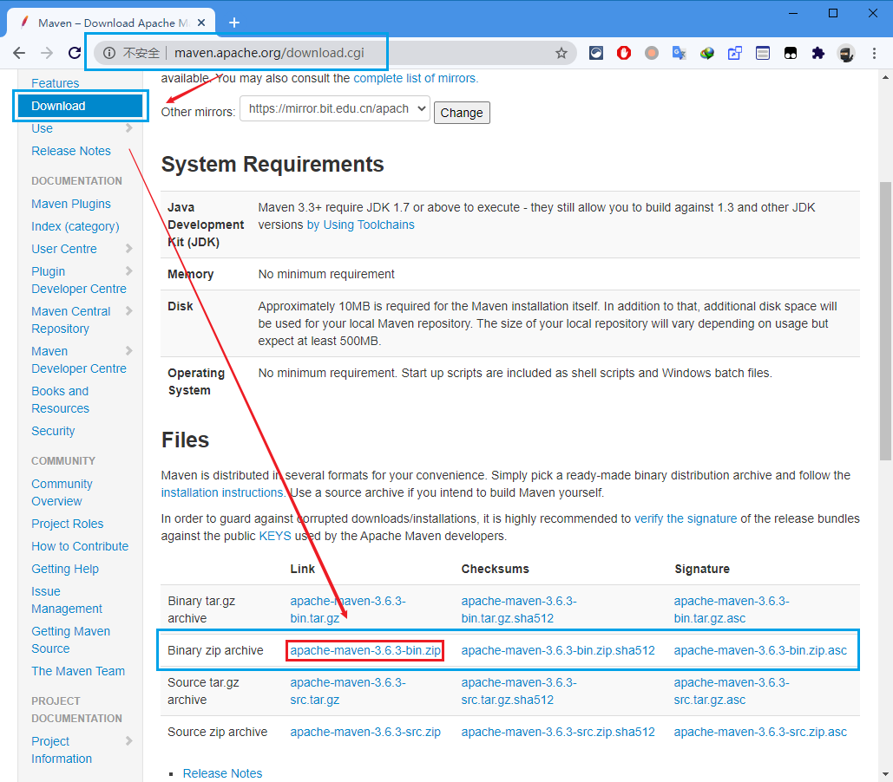
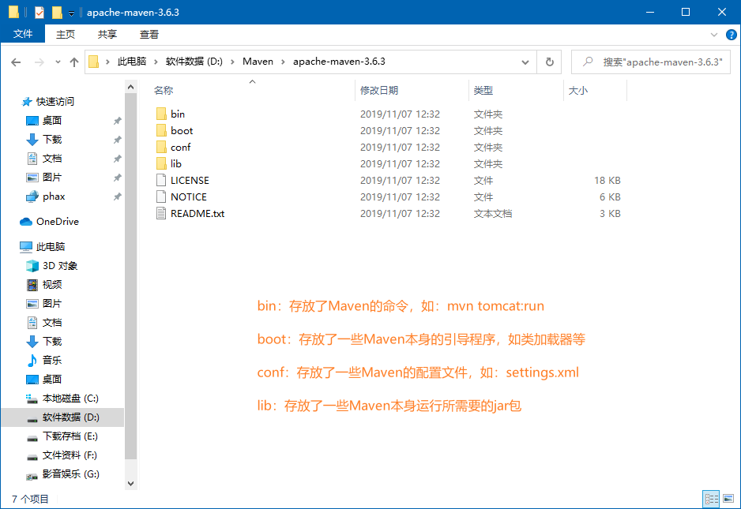
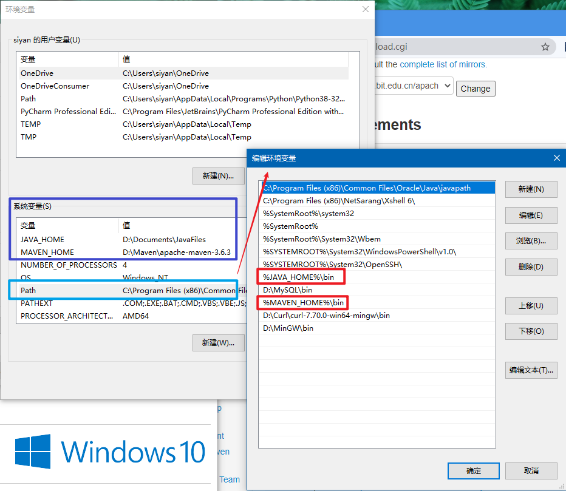
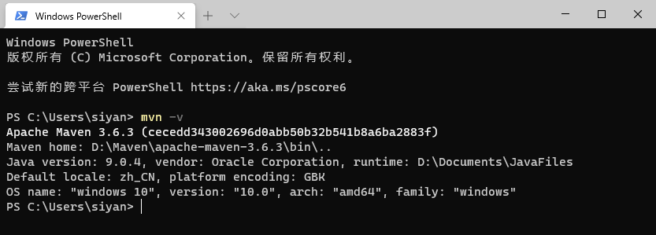
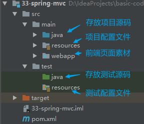
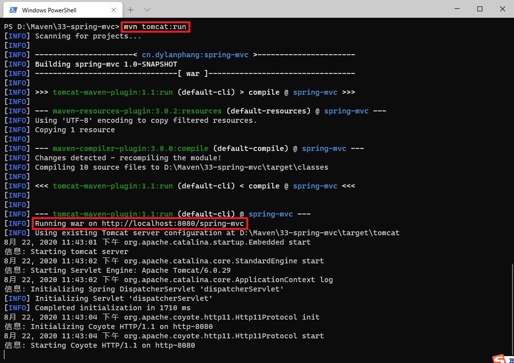
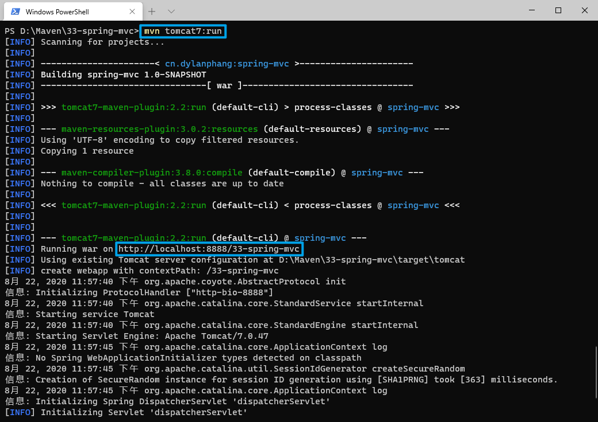
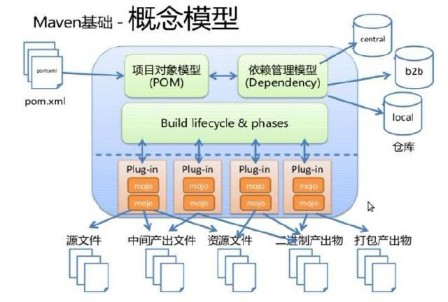

# 前言

> - 本篇来源于教程，较为基础。

# 什么是Maven？

> - Maven是一个项目管理工具，它包含了一个项目对象模型（POM：Project Object Model），一个标准集合，一个项目生命周期（Project Lifecycle），一个依赖管理逻辑系统（Dependency Management System），和用来运行定义在生命周期阶段（phase）中插件（plugin）目标（goal）的逻辑。

# Maven能解决什么问题？

> - 可以用更通俗的方式来说明。我们知道，项目开发不仅仅是写写代码而已，期间会伴随着各种必不可少的事情要做，下面列举几个感受一下：
>   1. 我们需要引用各种jar包，尤其是比较大的工程，引用的jar包往往有几十个乃至上百个， 每用到一种jar包，都需要手动引入工程目录，而且经常遇到各种让人抓狂的jar包冲突，版本冲突。
>   2. 我们辛辛苦苦写好了Java文件，可是只懂0和1的白痴电脑却完全读不懂，需要将它编译成二进制字节码。好歹现在这项工作可以由各种集成开发工具帮我们完成，Eclipse、IDEA等都可以将代码即时编译。当然，如果你嫌生命漫长，何不铺张，也可以用记事本来敲代码，然后用javac命令一个个地去编译，逗电脑玩。
>   3. 世界上没有不存在bug的代码，计算机喜欢bug就和人们总是喜欢美女帅哥一样。为了追求美为了减少bug，因此写完了代码，我们还要写一些单元测试，然后一个个的运行来检验代码质量。
>   4. 再优雅的代码也是要出来卖的。我们后面还需要把代码与各种配置文件、资源整合到一起，定型打包，如果是web项目，还需要将之发布到服务器，供人蹂躏。
> - 试想，如果现在有一种工具，可以把你从上面的繁琐工作中解放出来，能帮你构建工程，管理jar包，编译代码，还能帮你自动运行单元测试，打包，生成报表，甚至能帮你部署项目，生成Web站点，你会心动吗？Maven就可以解决上面所提到的这些问题。

# Maven的依赖管理

> - Maven的一个核心特性就是依赖管理。当我们涉及到多模块的项目（包含成百个模块或者子项目），管理依赖就变成一项困难的任务。Maven展示出了它对处理这种情形的高度控制。
> - 传统的WEB项目中，我们必须将工程所依赖的jar包复制到工程中，导致了工程的变得很大。那么maven工程是如何使得工程变得很少呢？
> - maven工程中不直接将jar包导入到工程中，而是通过在pom.xml文件中添加所需jar包的坐标，这样就很好的避免了jar直接引入进来，在需要用到jar包的时候，只要查找pom.xml文件，再通过pom.xml文件中的坐标，到一个专门用于“存放jar包的仓库”（maven仓库）中根据坐标从而找到这些jar包，再把这些jar包拿去运行。

> - 问题：通过读取pom.xml文件中的坐标，在到仓库中找到对应的jar包，会不会很慢？
> - 解决：通过pom.xml文件配置要引入的jar包的坐标，再读取坐标并到仓库中加载jar包，这样我们就可以直接使用jar包了，为了解决这个过程中速度慢的问题，maven中也有索引的概念，通过建立索引，可以大大提高加载jar包的速度，使得我们认为jar包基本跟放在本地的工程文件中再读取出来的速度是一样的。这个过程就好比我们查阅字典时，为了能够加快查找到内容，书前面的目录就好比是索引，有了这个目录我们就可以方便找到内容了，一样的在maven仓库中有了索引我们就可以认为可以快速找到jar包。

> - 项目通常情况下，都需要经历编译、测试、运行、打包、安装、部署等一系列的过程。
> - Maven为我们提供了项目的一键构建。
>   - 项目的编译、测试、运行、打包、安装、部署的整个过程，都交由Maven进行管理，这个过程称为构建。
>   - 而一键构建，则是指整个构建过程，使用Maven的一个命令就可以轻松完成。
> - Maven规范化构建流程：
>
> 

# Maven的软件安装

> - Maven软件的下载，参照下图即可：
>
> 
>
> - 将下载好的压缩包，解压缩到任意的位置，即完成Maven的安装操作：
>
> 
>
> - 使用Maven前，需要配置系统的两个环境变量JAVA_HOME/MAVEN_HOME，以及把相应的/bin目录添加到Path中，如下图所示即可：
>
> 
>
> - 最后，在终端里运行Maven版本检查的名称，测试配置是否成功：
>
> 

# Maven的仓库分类

> - 本地仓库 ：用来存储从远程仓库或中央仓库下载的插件和jar包，项目使用一些插件或jar包，优先从本地仓库查找。
>   - 默认本地仓库位置在 ${user.dir}/.m2/repository，${user.dir}表示windows用户目录。
>
> - 远程仓库：如果本地需要插件或者jar包，本地仓库没有，默认去远程仓库下载。
>   远程仓库可以在互联网内也可以在局域网内。
>
> - 中央仓库 ：在maven软件中内置一个远程仓库地址http://repo1.maven.org/maven2 ，它是中央仓库，服务于整个互联网，它是由Maven团队自己维护，里面存储了非常全的jar包，它包含了世界上大部分流行的开源项目构件。

# Maven本地仓库的配置

> - 在无网络的情况下，如果拥有一个自定义的仓库，假设在F:/repository下拥有一个Maven的仓库，我们可以通过更改Maven的配置文件settings.xml来添加这个仓库。
>
> ```xml
> <settings xmlns="http://maven.apache.org/SETTINGS/1.0.0"
>           xmlns:xsi="http://www.w3.org/2001/XMLSchema-instance"
>           xsi:schemaLocation="http://maven.apache.org/SETTINGS/1.0.0 http://maven.apache.org/xsd/settings-1.0.0.xsd">
>     <!-- localRepository
>    	| The path to the local repository maven will use to store artifacts.
>   	|
>    	| Default: ${user.home}/.m2/repository
>   	<localRepository>/path/to/local/repo</localRepository>
> 	-->
>     <localRepository>D:/repository</localRepository>
> </settings>
> ```
> - Maven仓库地址、私服等配置信息，都需要在settings.xml文件中进行配置，而配置文件分为：全局配置、用户配置。
> - 全局配置的settings.xml路径为：**$MAVEN_HOME/conf/settings.xml**
> - 用户配置的settings.xml路径为：**${user.home}/.m2/settings.xml**
> - Maven会首先找寻用户配置，如果用户配置中有目标的配置，则使用用户配置，否则会使用全局配置文件。

# Maven工程目录结构

> - 作为一个Maven工程，src目录和pom.xml文件是必要的。
> - src目录结构如下：
>
> 
>
> - src/main/java —— 用于存放项目的.java文件
> - src/main/resources —— 存放项目资源文件，如spring、jdbc等配置文件
> - src/test/java —— 存放所有单元测试.java文件，如Junit测试类
> - src/test/resources —— 测试资源文件
> - target —— 项目输出位置，编译后的class文件会输出到此目录
> - pom.xml —— Maven项目核心配置文件
> - src/main/webapp —— 用于存放前端页面素材，如js、css、html、jsp等
>   - 注：普通的java项目没有webapp目录。

# Maven工程的运行

> - 使用终端并进入Maven工程目录（带有pom.xml文件的目录），使用命令行：mvn tomcat:run，即可运行当前的Maven工程，如图所示：
>
> 
>
> - 但由于Maven工程本身使用的Tomcat版本为6，可能无法兼容某些jar包的运行，导致页面报500错误，此时我们需要使用较高版本的Tomcat，需要在pom.xml中配置Tomcat7的插件，如下：
>
> ```xml
> <!-- 在maven工程中键入命令tomcat7:run启动此tomcat服务 -->
> <plugin>
>     <groupId>org.apache.tomcat.maven</groupId>
>     <artifactId>tomcat7-maven-plugin</artifactId>
>     <version>2.2</version>
>     <configuration>
>     	<port>8888</port> <!-- 服务端口 -->
>     	<path>/33-spring-mvc</path> <!-- 虚拟目录 -->
>     	<uriEncoding>UTF-8</uriEncoding>
>     	<server>tomcat7</server> <!-- 启动命令行的关键字 -->
>     </configuration>
> </plugin>
> ```
>
> - 再次使用命令行：mvn tomcat7:run，启动服务器，如图所示：
>
> 

# Maven常用命令

> 1. compile
>    - compile是Maven工程的编译命令，作用是将src/main/java下的文件编译为class文件输出到target目录下
> 2. test
>    - test是Maven工程的测试命令，使用mvn test，会执行src/test/java下的单元测试类
> 3. clean
>    - clean是Maven工程的清理命令，执行clean会删除target目录及其内容
> 4. package
>    - package是Maven工程的打包命令，对于java工程而言会执行package打成jar包，对于web工程而言会达成war包
> 5. install
>    - install是Maven工程的安装命令，执行install可以将Maven打成jar包或war包发布到本地仓库

# Maven指令的生命周期

> - Maven对项目构建过程分为三套相互独立的生命周期，分别是：
>   1. Clean Lifecycle —— 在进行真正的构建之前，进行一些清理工作
>   2. Default Lifecycle —— 构建的核心部分，包括编译、测试、打包、部署等
>   3. Site Lifecycle —— 生成项目报告、站点及发布站点

# Maven的概念模型

> - Maven包含了一个项目对象模型（POM：Project Object Model），一个标准集合，一个项目生命周期（Project Lifecycle），一个依赖管理逻辑系统（Dependency Management System），和用来运行定义在生命周期阶段（phase）中插件（plugin）目标（goal）的逻辑。
>
> 
>
> - 项目对象模型（Project Object Model）
>   - 每一个Maven工程都至少有一个pom.xml文件，通过pom.xml文件定义**项目坐标**、**项目依赖**、**项目信息**及**插件目标**等
> - 依赖管理系统（Dependency Management System）
>   - 通过Maven的依赖管理对项目所依赖的jar包进行统一管理
>
> ```xml
> <!-- 依赖关系 -->
> <dependencies>
>     <!-- 此项目运行需要使用junit，因此该项目依赖junit -->
>     <dependency>
>         <!-- 所需依赖的项目名称 -->
>         <groupId>junit</groupId>
>         <!-- 所需依赖的模块名称 -->
>         <artifactId>junit</artifactId>
>         <!-- 所需依赖的版本 -->
>         <version>4.11</version>
>         <!-- 该依赖的作用范围：test表示仅测试时使用junit -->
>         <scope>test</scope>
>     </dependency>
> </dependencies>
> ```
>
> - 一个项目生命周期（Project Lifecycle）
>   - 使用Maven完成项目的构建，项目构建包括：清理、编译、测试、部署等过程，Maven将这些过程规范为一个生命周期，Maven通过执行一些简单的终端命令，即可实现生命周期中的各个过程，如mvn compile执行编译，mvn clean执行清理
>
> 
>
> - 一组标准集合
>   - Maven将整个项目管理过程定义为一组标准，通过Maven构建的工程，拥有标准的目录结构、标准的生命周期阶段，其依赖管理也有标准的坐标定义等
> - 插件目标（Plugin Goal）
>   - Maven管理项目生命周期过程都是基于插件完成的

# Maven的工程坐标

> - 每一个Maven工程都需要定义本工程的坐标，坐标是Maven对jar包身份的定义
>
> ```xml
> <?xml version="1.0" encoding="UTF-8"?>
> 
> <project xmlns="http://maven.apache.org/POM/4.0.0" xmlns:xsi="http://www.w3.org/2001/XMLSchema-instance"
>          xsi:schemaLocation="http://maven.apache.org/POM/4.0.0 http://maven.apache.org/xsd/maven-4.0.0.xsd">
>     <!-- 从Maven2开始的固定写法 -->
>     <modelVersion>4.0.0</modelVersion>
> 
>     <!-- 项目名称，定义为组织名+项目名，类似包名 -->    
>     <groupId>cn.dylanphang</groupId>
>     <!-- 模块名称 -->    
>     <artifactId>spring-mvc</artifactId>
>     <!-- 当前项目版本号，snapshot为快照版本，即非正式版本，release为正式发布版本 -->    
>     <version>1.0-SNAPSHOT</version>
>     <!-- 
> 	打包类型：
> 		jar:执行package会打成jar包
> 		war:执行package会达成war包
> 		pom:用于Maven工程的继承，通常父工程设置为pom
> 	-->    
>     <packaging>war</packaging>
> 
>     <!-- 右侧Maven控制面板显示的名称 -->    
>     <name>spring-mvc</name>
>     <!-- FIXME change it to the project's website -->
>     <url>http://www.example.com</url>
> </project>
> ```
> - pom基本配置
>   - \<project>：文件的根节点
>   - \<modelVersion>：pom.xml使用的对象模型版本
>   - \<groupId>：项目名称，一般写项目的域名
>   - \<artifactId>：模块名称，子项目名或模块名称
>   - \<version>：产品的版本号
>   - \<packaging>：打包类型，一般有jar、war、pom等
>   - \<name>：项目的显示名称，常用于Maven生成的文档
>   - \<description>：项目描述，常用于Maven生成的文档
>   - \<dependencies>：项目依赖构建配置，配置项目依赖构建的坐标
>   - \<build>：项目构建配置，配置编译、运行插件等

# Maven的依赖范围

> - 项目A依赖项目B，则需要在A的pom.xml中添加项目B的坐标，添加坐标时，需要指定该坐标的依赖范围，依赖范围包括以下几个：
>   - compile：编译范围，指A在编译时依赖B，此范围为**默认依赖范围**。编译范围的依赖会用在**编译**、**测试**、**运行**，由于运行时需要依赖于B，所以编译范围的依赖会被打包（package）
>   
>   - provided：provided依赖只有在当JDK或者一个容器已提供该依赖之后才使用，provided依赖在**编译**和**测试**时需要，在**运行**时不需要。如：servlet-api已经被tomcat容器所提供，它的依赖范围应该设置为provided
>   
>   - runtime：runtime依赖在**运行**和**测试**系统的时候需要，但在**编译**的时候不需要。如：jdbc的驱动包。由于**运行**时需要，所以runtime范围的依赖会被打包
>   
>   - test：test依赖在**编译**和**运行**时都不需要，它们只有在**测试**编译和**测试**运行阶段可用，如：junit。由于**运行**时不需要，所以test范围依赖不会被打包
>   
>   - system：system依赖与provided类似，但是你必须显式地提供一个对本地系统中jar文件的路径，需要指定systemPath磁盘路径，system依赖不推荐使用
> 
> | 依赖范围 | 对于编译classpath有效 | 对于测试classpath有效 | 对于运行classpath有效 |            例子             |
>| :------: | :-------------------: | :-------------------: | :-------------------: | :-------------------------: |
> | compile  |           Y           |           Y           |           Y           |         spring-core         |
> | provided |           Y           |           Y           |           -           |         servlet-api         |
> | runtime  |           -           |           Y           |           Y           |          JDBC驱动           |
> |   test   |           -           |           Y           |           -           |            junit            |
> |  system  |           Y           |           Y           |           -           | 本地的，Maven仓库之外的类库 |
> 
> - 在Maven Web工程中测试scope总结：
>  - 默认引入的jar包 —— compile，默认范围可省略，编译、测试、运行都有效
>   - servlet-api、jsp-api —— provided，编译、测试有效，运行时无效
>   - jdbc驱动jar包 —— runtime，测试、运行有效，编译无效
>   - junit —— test，仅测试有效
> - 依赖范围强弱顺序是：compile > provided > runtime > test