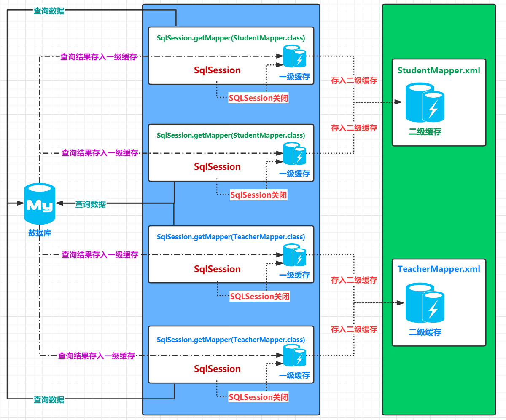

# 前言

> - 本篇关于配置MyBatis。

# XML配置

- `xml`配置指的就是`MapperConfig`。`MyBatis`的配置文件包含了会深深影响`MyBatis`行为的设置和属性信息。配置文档的顶层结构如下：

- `configuration`（配置）
  - `properties`（属性）
  - `settings`（设置）
  - `typeAliases`（类型别名）
  - `typeHandlers`（类型处理器）
  - `objectFactory`（对象工厂）
  - `plugins`（插件）
  - `environments`（环境配置）
    - `environment`（环境变量）
      - `transactionManager`（事务管理器）
      - `dataSource`（数据源）
  - `databaseIdProvider`（数据库厂商标识）
  - `mappers`（映射器）

- 其中`properties`、`settings`、`typeAliases`、`environments`和`mappers`为需要掌握的配置属性。

## 环境配置（environments)

### 1. 基本配置

- `MyBatis`可以配置成适应多种环境，这种机制有助于将`SQL`映射应用于多种数据库之中， 现实情况下有多种理由需要这么做。
- 例如，开发、测试和生产环境需要有不同的配置；或者想在具有相同`Schema`的多个生产数据库中使用相同的`SQL`映射。还有许多类似的使用场景。
- 不过需要记住：尽管可以配置多个环境，但是每个`SqlSessionFactory`实例只能选择一种环境。

- 一个基本的环境配置如下：

```xml
<environments default="development">
    <environment id="development">
        <transactionManager type="JDBC">
            <property name="..." value="..."/>
        </transactionManager>
        <dataSource type="POOLED">
            <property name="driver" value="${driver}"/>
            <property name="url" value="${url}"/>
            <property name="username" value="${username}"/>
            <property name="password" value="${password}"/>
        </dataSource>
    </environment>
    <environment id="test">
        <transactionManager type="JDBC">
            <property name="..." value="..."/>
        </transactionManager>
        <dataSource type="POOLED">
            <property name="driver" value="${driver}"/>
            <property name="url" value="${url}"/>
            <property name="username" value="${username}"/>
            <property name="password" value="${password}"/>
        </dataSource>
    </environment>
</environments>
```

- 此时拥有两个环境，一个是`development`环境，另一个则是`test`环境。
- 为了指定创建哪种环境，只要将它作为可选的参数传递给`SqlSessionFactoryBuilder`即可。
- 可以接受环境配置的两个方法签名是：

```java
SqlSessionFactory factory = new SqlSessionFactoryBuilder().build(reader, environment);
SqlSessionFactory factory = new SqlSessionFactoryBuilder().build(reader, environment, properties);
```

- 如果忽略了环境参数，那么将会加载默认环境，如下所示：

```java
SqlSessionFactory factory = new SqlSessionFactoryBuilder().build(reader);
SqlSessionFactory factory = new SqlSessionFactoryBuilder().build(reader, properties);
```

### 2. 事务管理器

- 在`MyBatis`中有两种类型的事务管理器，即`type="[JDBC|MANAGED]"`：
  - `JDBC`：这个配置直接使用了`JDBC`的提交和回滚设施，它依赖从数据源获得的连接来管理事务作用域。
  - `MANAGED`：这个配置几乎没做什么。它从不提交或回滚一个连接，而是让容器来管理事务的整个生命周期（比如`JEE`应用服务器的上下文）。知道即可。
-  如果你正在使用`Spring + MyBatis`，则没有必要配置事务管理器，因为`Spring`模块会使用自带的管理器覆盖前面的配置。
- 这两种事务管理器类型都不需要设置任何属性。它们其实是类型别名，换句话说，你可以用`TransactionFactory`接口实现类的全限定名或类型别名代替它们。

```java
public interface TransactionFactory {
    default void setProperties(Properties props) { // 从 3.5.2 开始，该方法为默认方法
        // 空实现
    }
    Transaction newTransaction(Connection conn);
    Transaction newTransaction(DataSource dataSource, TransactionIsolationLevel level, boolean autoCommit);
}
```

- 在事务管理器实例化后，所有在`XML`中配置的属性将会被传递给`setProperties()`方法。你的实现还需要创建一个`Transaction`接口的实现类，这个接口也很简单：

```java
public interface Transaction {
    Connection getConnection() throws SQLException;
    void commit() throws SQLException;
    void rollback() throws SQLException;
    void close() throws SQLException;
    Integer getTimeout() throws SQLException;
}
```

- 使用这两个接口，你可以完全自定义`MyBatis`对事务的处理。

### 3. 数据源

- `dataSource`元素使用标准的`JDBC`数据源接口来配置`JDBC`连接对象的资源。大多数`MyBatis`应用程序会按示例中的例子来配置数据源。虽然数据源配置是可选的，但如果要启用延迟加载特性，就必须配置数据源。
- 有三种内建的数据源类型，也就是`type="[UNPOOLED|POOLED|JNDI]"`：
  - `UNPOOLED`：这个数据源的实现会每次请求时打开和关闭连接。虽然有点慢，但对那些数据库连接可用性要求不高的简单应用程序来说，是一个很好的选择。性能表现则依赖于使用的数据库，对某些数据库来说，使用连接池并不重要，这个配置就很适合这种情形。
  - `POOLED`：这种数据源的实现利用“池”的概念将`JDBC`连接对象组织起来，避免了创建新的连接实例时所必需的初始化和认证时间。这种处理方式很流行，能使并发`Web`应用快速响应请求。
  - `JNDI`：这个数据源实现是为了能在如`EJB`或应用服务器这类容器中使用，容器可以集中或在外部配置数据源，然后放置一个`JNDI`上下文的数据源引用。

## 属性（properties）

- 配置属性可以在外部进行配置，并可以进行动态替换。你既可以在典型的`Java`属性文件中配置这些属性，也可以在`properties`元素的子元素中设置。
- 此时我们拥有配置文件`jdbc.properties`，配置如下：

```properties
jdbc.driver=com.mysql.cj.jdbc.Driver
jdbc.url=jdbc:mysql://localhost:3306/xxx?serverTimezone=GMT%2B8&amp;useSSL=true&useAffectedRows=true
username=root
password=root
```

- 同时我们拥有一个`MyBatis`配置文件，如下：

```xml
<!-- 属性配置 -->
<properties resource="jdbc.properties">
	<property name="username" value="root"/>
    <property name="password" value="123456"/>
</properties>

<!-- 环境配置 -->
<environments default="mysql">
    <!-- Mysql的环境配置-->
    <environment id="mysql">
        <!-- 事务类型配置，JDBC(Java DataBase Connectivity) -->
        <transactionManager type="JDBC"/>
        <!-- 数据源（连接池）配置-->
        <dataSource type="POOLED">
            <!-- 连接数据库的4个基本信息 -->
            <property name="driver" value="${jdbc.driver}"/>
            <property name="url" value="${jdbc.url}"/>
            <property name="username" value="${username}"/>
            <property name="password" value="${password}"/>
        </dataSource>
    </environment>
</environments>
```

- 我们使用`<properties>`标签可以导入外部的配置文件，可以选择自闭合，也可以在其中使用子标签`<property>`配置一些配置文档中不存在的属性。
- 此时如果配置文件和子标签`<property>`中的属性重名，会优先使用配置文件中的属性。
- `MyBatis`同时提供了在`SqlSessionFactoryBuilder.build()`方法中传入属性值的方式：

```java
SqlSessionFactory factory = new SqlSessionFactoryBuilder().build(reader, props);
// ... 或者 ...
SqlSessionFactory factory = new SqlSessionFactoryBuilder().build(reader, environment, props);
```

- 如果一个属性在不只一个地方进行了配置，官方给出的`MyBatis`属性加载顺序：
  1. 首先读取在`properties`元素体内指定的属性；
  2. 然后根据`properties`元素中的`resource`属性读取类路径下的属性文件，或根据`url`属性指定的路径读取属性文件，读取到的属性将覆盖之前读取过的同名属性；
  3. 最后读取作为方法参数传递的属性，并负载之前读取过的同名属性。
- 因此，通过方法参数传递的属性具有最高优先级，`resource/url`属性中指定的配置文件次之，最低优先级的是`properties`元素中指定的属性。

- 从`MyBatis 3.4.2`开始，你可以为占位符指定一个默认值。这个特性默认是关闭的。要启用这个特性，需要添加一个特定的属性来开启这个特性。具体配置如下：

```xml
<properties resource="org/mybatis/example/config.properties">
    <!-- ... -->
    <!-- 启用默认值特性 -->
    <property name="org.apache.ibatis.parsing.PropertyParser.enable-default-value" value="true"/>
</properties>

<!-- 环境配置 -->
<environments default="development">
    <!-- Mysql的环境配置-->
    <environment id="development">
        <!-- 事务类型配置，JDBC(Java DataBase Connectivity) -->
        <transactionManager type="JDBC"/>
        <!-- 数据源（连接池）配置-->
        <dataSource type="POOLED">
            <!-- ... -->
            <!-- 如果属性 'username' 没有被配置，'username' 属性的值将为 'ut_user' -->
            <property name="username" value="${username:ut_user}"/> 
        </dataSource>
    </environment>
</environments>
```

- 如果你在属性名中使用了`":"`字符（如：`db:username`），或者在`SQL`映射中使用了`OGNL`表达式的三元运算符（如：`${tableName != null ? tableName : 'global_constants'}`），就需要设置特定的属性来修改分隔属性名和默认值的字符。例如：

```xml
<properties resource="org/mybatis/example/config.properties">
    <!-- ... -->
    <!-- 启用默认值特性 -->
    <property name="org.apache.ibatis.parsing.PropertyParser.enable-default-value" value="true"/>
    <!-- 修改默认值的分隔符 -->
    <property name="org.apache.ibatis.parsing.PropertyParser.default-value-separator" value="?:"/>
</properties>

<environments default="development">
    <!-- Mysql的环境配置-->
    <environment id="development">
        <!-- 事务类型配置，JDBC(Java DataBase Connectivity) -->
        <transactionManager type="JDBC"/>
        <!-- 数据源（连接池）配置-->
        <dataSource type="POOLED">
            <!-- ... -->
            <!-- 如果属性 'username' 没有被配置，'username' 属性的值将为 'ut_user' -->
            <property name="username" value="${username?:ut_user}"/> 
        </dataSource>
    </environment>
</environments>
```

## 类型别名（typeAliases）

- 类型别名可为`Java`类型设置一个缩写名字。 它仅用于`XML`配置，意在降低冗余的全限定类名书写。例如：

```xml
<typeAliases>
    <typeAlias alias="Author" type="domain.blog.Author"/>
    <typeAlias alias="Blog" type="domain.blog.Blog"/>
    <typeAlias alias="Comment" type="domain.blog.Comment"/>
    <typeAlias alias="Post" type="domain.blog.Post"/>
    <typeAlias alias="Section" type="domain.blog.Section"/>
    <typeAlias alias="Tag" type="domain.blog.Tag"/>
</typeAliases>
```

- 当这样配置时，`Blog`可以用在任何使用`domain.blog.Blog`的地方。即类型别名可以在`Mapper`中使用。

- 也可以指定一个包名，`MyBatis`会在包名下面搜索需要的`Java Bean`，比如：

```xml
<typeAliases>
    <package name="domain.blog"/>
</typeAliases>
```

- 每一个在包`domain.blog`中的`Java Bean`，在没有注解的情况下，会使用`Bean`的首字母小写的非限定类名来作为它的别名。 比如`domain.blog.Author`的别名为`author`；若有注解，则别名为其注解值。见下面的例子：

```java
@Alias("Author")
public class Author {
    ...
}
```
- 下面是一些为常见的`Java`类型内建的类型别名。它们都是不区分大小写的，注意，为了应对原始类型的命名重复，采取了特殊的命名风格。


|    别名    | 映射的类型 |
| :--------: | :--------: |
|   _byte    |    byte    |
|   _long    |    long    |
|   _short   |   short    |
|    _int    |    int     |
|  _integer  |    int     |
|  _double   |   double   |
|   _float   |   float    |
|  _boolean  |  boolean   |
|   string   |   String   |
|    byte    |    Byte    |
|    long    |    Long    |
|   short    |   Short    |
|    int     |  Integer   |
|  integer   |  Integer   |
|   double   |   Double   |
|   float    |   Float    |
|  boolean   |  Boolean   |
|    date    |    Date    |
|  decimal   | BigDecimal |
| bigdecimal | BigDecimal |
|   object   |   Object   |
|    map     |    Map     |
|  hashmap   |  HashMap   |
|    list    |    List    |
| arraylist  | ArrayList  |
| collection | Collection |
|  iterator  |  Iterator  |

## 设置（settings）

- 这是`MyBatis`中极为重要的调整设置，它们会改变`MyBatis`的运行时行为。
- 但我们只需要了解其中的几个即可，如下表：

|          设置名          |                             描述                             |                            有效值                            | 默认值 |
| :----------------------: | :----------------------------------------------------------: | :----------------------------------------------------------: | :----: |
|       cacheEnabled       |   全局性地开启或关闭所有映射器配置文件中已配置的任何缓存。   |                         true\|false                          |  true  |
|    lazyLoadingEnabled    | 延迟加载的全局开关。当开启时，所有关联对象都会延迟加载。特定关联关系中，可通过设置`fetchType`属性来覆盖该项的开关状态。 |                         true\|false                          | false  |
|     useGeneratedKeys     | 允许`JDBC`支持自动生成主键，需要数据库驱动支持。如果设置为`true`，将强制使用自动生成主键。尽管一些数据库驱动不支持此特性，但仍可以正常工作。 |                         true\|false                          | false  |
| mapUnderscoreToCamelCase | 是否开启驼峰命名自动映射，即从经典数据库列名`A_COLUMN`映射到经典`Java`属性名`aColumn`。 |                         true\|false                          | false  |
|         logImpl          |    指定`MyBatis`所用日志的具体实现，未指定时将自动查找。     | SLF4J\|LOG4J\|LOG4J2\|JDK_LOGGING<br>COMMONS_LOGGING\|STDOUT_LOGGING<br>NO_LOGGING | noSet  |

- 关于为什么`MySQL`中表字段使用下划线`_`作为命名规范，是因为`Oracle`中会把所有的命名都转为大写，例如小驼峰形式的命名`userLoggingTime`会被转换为`USERLOGGINGTIME`，造成了可读性极其低下。
- 因此在`Oracle`中会习惯把命名写成带下划线`_`的形式，这样即使转换为大写形式`USER_LOGGING_TIME`，也没有问题。
- 自此很多人都会在命名表字段的时候，使用下划线`_`。
- 一个配置完整的`settings`元素的示例如下：

```xml
<settings>
    <setting name="cacheEnabled" value="true"/>
    <setting name="lazyLoadingEnabled" value="true"/>
    <setting name="multipleResultSetsEnabled" value="true"/>
    <setting name="useColumnLabel" value="true"/>
    <setting name="useGeneratedKeys" value="false"/>
    <setting name="autoMappingBehavior" value="PARTIAL"/>
    <setting name="autoMappingUnknownColumnBehavior" value="WARNING"/>
    <setting name="defaultExecutorType" value="SIMPLE"/>
    <setting name="defaultStatementTimeout" value="25"/>
    <setting name="defaultFetchSize" value="100"/>
    <setting name="safeRowBoundsEnabled" value="false"/>
    <setting name="mapUnderscoreToCamelCase" value="false"/>
    <setting name="localCacheScope" value="SESSION"/>
    <setting name="jdbcTypeForNull" value="OTHER"/>
    <setting name="lazyLoadTriggerMethods" value="equals,clone,hashCode,toString"/>
</settings>
```

## 映射器（Mapper）

- 既然`MyBatis`的行为已经由上述元素配置完了，我们现在就要来定义`SQL`映射语句了。 但首先，我们需要告诉`MyBatis`到哪里去找到这些语句。
- 在自动查找资源方面，`Java`并没有提供一个很好的解决方案，所以最好的办法是直接告诉`MyBatis`到哪里去找映射文件。 
- 你可以使用相对于类路径的资源引用，或完全限定资源定位符（包括`file:///`形式的`URL`），或类名和包名等。例如：

```xml
<!-- 使用相对于类路径的资源引用 -->
<mappers>
    <mapper resource="org/mybatis/builder/AuthorMapper.xml"/>
    <mapper resource="org/mybatis/builder/BlogMapper.xml"/>
    <mapper resource="org/mybatis/builder/PostMapper.xml"/>
</mappers>
```

```xml
<!-- 使用完全限定资源定位符（URL） -->
<mappers>
    <mapper url="file:///var/mappers/AuthorMapper.xml"/>
    <mapper url="file:///var/mappers/BlogMapper.xml"/>
    <mapper url="file:///var/mappers/PostMapper.xml"/>
</mappers>
```

```xml
<!-- 使用映射器接口实现类的完全限定类名 -->
<mappers>
    <mapper class="org.mybatis.builder.AuthorMapper"/>
    <mapper class="org.mybatis.builder.BlogMapper"/>
    <mapper class="org.mybatis.builder.PostMapper"/>
</mappers>
```

```xml
<!-- 将包内的映射器接口实现全部注册为映射器 -->
<mappers>
    <package name="org.mybatis.builder"/>
</mappers>
```

- 这些配置会告诉 MyBatis 去哪里找映射文件。
- 其中不推荐再使用完全限定资源定位符的方式了，这样会要求每台运行此项目的主机都在相同位置拥有同一个配置文件。
- 而当使用映射器接口实现类的完全限定类名或包扫描时，如果使用`Mapper.xml`的方式进行全部配置或部分配置（结合注解进行配置），此时`Mapper.xml`需要遵循以下几点要求，否则运行将报错：
  1. 映射文件`.xml`必须要和`dao`接口在同一个包下或`resources`下的同级目录下；
  2. 映射文件`.xml`必须要和`dao`接口的名字完全相同。
- 其中最为推荐的方式是使用相对于类路径的资源引用；或是`dao`接口使用注解配置的情况下，使用映射器接口实现类的完全限定类名或包扫描。

## 其他

- 类型处理器`typeHandlers`：`MyBatis`在设置预处理语句`PreparedStatement`中的参数或从结果集中取出一个值时， 都会用类型处理器将获取到的值以合适的方式转换成`Java`类型。下表描述了一些默认的类型处理器。

- 对象工厂`objectFactory`：每次`MyBatis`创建结果对象的新实例时，它都会使用一个对象工厂`ObjectFactory`实例来完成实例化工作。 默认的对象工厂需要做的仅仅是实例化目标类，要么通过默认无参构造方法，要么通过存在的参数映射来调用带有参数的构造方法。 如果想覆盖对象工厂的默认行为，可以通过创建自己的对象工厂来实现。
- 插件`plugins`：`MyBatis`允许你在映射语句执行过程中的某一点进行拦截调用。默认情况下，`MyBatis`允许使用插件来拦截的方法调用包括：
  - `Executor (update, query, flushStatements, commit, rollback, getTransaction, close, isClosed)`
  - `ParameterHandler (getParameterObject, setParameters)`
  - `ResultSetHandler (handleResultSets, handleOutputParameters)`
  - `StatementHandler (prepare, parameterize, batch, update, query)`

- 关于插件，很多经常使用的插件都是基于这个基础上所开发的，能让操作`MyBatis`更快。例如以下第三方插件：
  - `MyBatis Generator Core`：`MyBatis`代码生成器；
  - `MyBatis Plus`：`Mybatis`的增强工具包可简化开发；
  - `MyBatis Spring`：帮助你将`MyBatis`代码无缝地整合到`Spring`中。

# XML映射器

- 映射器也就是配置中的`Mapper`。`MyBatis`的真正强大在于它的语句映射，这是它的魔力所在。由于它的异常强大，映射器的`XML`文件就显得相对简单。
- 如果拿它跟具有相同功能的`JDBC`代码进行对比，你会立即发现省掉了将近`95%`的代码。`MyBatis`致力于减少使用成本，让用户能更专注于`SQL`代码。

- `SQL`映射文件只有很少的几个顶级元素（按照应被定义的顺序列出）：
  - `cache` – 该命名空间的缓存配置。
  - `cache-ref` – 引用其它命名空间的缓存配置。
  - `resultMap` – 描述如何从数据库结果集中加载对象，是最复杂也是最强大的元素。
  - `parameterMap` – 老式风格的参数映射。此元素已被废弃，并可能在将来被移除！请使用行内参数映射。文档中不会介绍此元素。
  - `sql` – 可被其它语句引用的可重用语句块。
  - `insert` – 映射插入语句。
  - `update` – 映射更新语句。
  - `delete` – 映射删除语句。
  - `select` – 映射查询语句。

# Lombok工具

- `lombok`是一个可以通过简单的注解的形式来帮助我们简化消除一些必须有但显得很臃肿的`Java`代码，`lombok`能够达到的效果就是在源码中不需要写一些通用的方法，但是在编译生成的字节码文件中会帮我们生成这些方法。

- 使用步骤：
  1. 在`Intellij IDEA`中安装`Lombok`插件；
  2. 在项目中导入`lombok`的`jar`包，`Maven`对应的项目名称是`Project Lombok`。

```xml
<!-- https://mvnrepository.com/artifact/org.projectlombok/lombok -->
<dependency>
    <groupId>org.projectlombok</groupId>
    <artifactId>lombok</artifactId>
    <version>1.18.12</version>
    <scope>provided</scope>
</dependency>
```

- 其中核心注解如下：
  - `@Getter and @Setter`：<u>生成字段中的`Getter`或`Setter`方法；</u>
  - `@FieldNameConstants`
  - `@ToString`：<u>生成`toString`方法；</u>
  - `@EqualsAndHashCode`：<u>生成`equals`和`hashCode`方法；</u>
  - `@AllArgsConstructor, @RequiredArgsConstructor and @NoArgsConstructor`：<u>生成有参或无参构造器；</u>
  - `@Log, @Log4j, @Log4j2, @Slf4j, @XSlf4j, @CommonsLog, @JBossLog, @Flogger, @CustomLog`
  - `@Data`：<u>生成字段中的`Getter`和`Setter`方法；</u>
  - `@Builder`
  - `@SuperBuilder`
  - `@Singular`
  - `@Delegate`
  - `@Value`
  - `@Accessors`
  - `@Wither`
  - `@With`
  - `@SneakyThrows`
  - `@val`
  - `@var`
  - `experimental @var`
  - `@UtilityClass`
  - `...`

- 常用的注解已经在上边标注出来了，可以在学习的阶段使用。
- 但其实并不推荐使用，注解大大降低了代码的可读性，实际开发中应该避免使用。

# 多对一查询

- 如果一个表中的外键关联了另一个表，此时你需要查询第一个表的内容，同时左联结第二个的内容，一并将所有的讯息查询并封装到pojo中，这就是多对一的查询。

- 多对一的查询需要在`<resultMap>`中使用一个新的标签`<association>`。

## 1. 方式一

- 现在我们拥有一个学生表`student`，其中拥有一个外键`fk_student_teacher`表示着本表的`tid`列关联着`teacher`表中的`id`列：

```sql
CREATE TABLE `student` (
    `id` int(11) NOT NULL,
    `name` varchar(20) DEFAULT NULL,
    `tid` int(11) DEFAULT NULL,
    PRIMARY KEY (`id`),
    KEY `fk_student_teacher` (`tid`),
    CONSTRAINT `fk_student_teacher` FOREIGN KEY (`tid`) REFERENCES `teacher` (`id`)
) ENGINE=InnoDB DEFAULT CHARSET=utf8
```

- 其中教师表`teacher`如下：

```sql
CREATE TABLE `teacher` (
    `id` int(11) NOT NULL,
    `name` varchar(20) DEFAULT NULL,
    PRIMARY KEY (`id`)
) ENGINE=InnoDB DEFAULT CHARSET=utf8
```

- 项目目录结构如下：


- 于是学生表`student`和教师表`teacher`对应着它们的`pojo`为：

```java
package cn.dylanphang.pojo;
import lombok.Data;

@Data
public class Student {

    private Integer id;
    private String name;

    // 假设需要一并将教师的信息查询出来，而不需要获取教师编号tid，于是这里应该为一个实体类字段，实体类中的id其实就是本表中的tid
    private Teacher teacher;
}
```

```java
package cn.dylanphang.pojo;
import lombok.Data;

@Data
public class Teacher {

    private Integer id;
    private String name;
}
```

- 同样它们对应着各自的`StudentMapper.java`和`TeacherMapper.java`，代码如下：

```java
package cn.dylanphang.mapper;
import cn.dylanphang.pojo.Student;
import org.apache.ibatis.annotations.Select;
import java.util.List;

public interface StudentMapper {
    /**
     * 返回所有学生。
     *
     * @return 学生列表
     */
    List<Student> findAll();

}
```

```java
package cn.dylanphang.mapper;
import cn.dylanphang.pojo.Teacher;
import org.apache.ibatis.annotations.Select;
import java.util.List;

public interface TeacherMapper {

    /**
     * 返回所有教师。
     *
     * @return 教师列表
     */
    @Select("SELECT * FROM teacher;")
    List<Teacher> findAll();
}
```

- 其中教师映射接口类`TeacherMapper.java`中已经使用了注解`@Select`配置了一个基本的查询语句。
- 此时我们需要做到完成以下的查询：
  - 查询学生表，并同时获取对应学生的老师信息，最终需要输出学生的编号、姓名和对应教师的编号、姓名。
- 此时，`StudentMapper.java`中的方法对应着的是一个复杂的查询，需要借助`<resultMap>`完成表字段和类字段的映射，因此不太适合使用注解开发。
- 因此，`StudentMapper.xml`编写如下，其中需要注意几点：
  1. 查询出来的表字段一定要设置别名，在`<resultMap>`中使用表字段别名进行映射；
  2. 使用标签`<association>`对查询结果中，需要封装进实体类字段的数据进行映射。

```xml
<?xml version="1.0" encoding="UTF-8" ?>
<!DOCTYPE mapper
        PUBLIC "-//mybatis.org//DTD Mapper 3.0//EN"
        "http://mybatis.org/dtd/mybatis-3-mapper.dtd">

<mapper namespace="cn.dylanphang.mapper.StudentMapper">
    <select id="findAll" resultMap="studentMap">
        SELECT a.id AS student_id, a.name AS student_name, b.id AS teacher_id, b.name AS teacher_name
        FROM student AS a
        LEFT JOIN teacher AS b
        ON a.tid = b.id;
    </select>

    <resultMap id="studentMap" type="student">
        <id column="student_id" property="id"/>
        <result column="student_name" property="name"/>
        <!-- property表示类字段的引用名，而javaType表示类字段的类型，这里使用的是SqlMapperConfig.xml中指定的别名 -->
        <association property="teacher" javaType="teacher">
            <id column="teacher_id" property="id"/>
            <result column="teacher_name" property="name"/>
        </association>
    </resultMap>
</mapper>
```

- 为了避免模糊，其中`SqlMapperConfig.xml`代码编写如下：

```xml
<?xml version="1.0" encoding="UTF-8"?>
<!DOCTYPE configuration
        PUBLIC "-//mybatis.org//DTD Config 3.0//EN"
        "http://mybatis.org/dtd/mybatis-3-config.dtd">

<!-- Mybatis的主配置文件-->
<configuration>
    <properties resource="jdbc.properties"/>

    <!-- 已经为两个类设置了别名 -->
    <typeAliases>
        <typeAlias type="cn.dylanphang.pojo.Teacher" alias="teacher"/>
        <typeAlias type="cn.dylanphang.pojo.Student" alias="student"/>
    </typeAliases>

    <environments default="mysql">
        <environment id="mysql">
            <transactionManager type="JDBC"/>
            <dataSource type="POOLED">
                <property name="driver" value="${jdbc.driver}"/>
                <property name="url" value="${jdbc.url}"/>
                <property name="username" value="${jdbc.username}"/>
                <property name="password" value="${jdbc.password}"/>
            </dataSource>
        </environment>
    </environments>

    <mappers>
        <mapper class="cn.dylanphang.mapper.TeacherMapper"/>
        <mapper class="cn.dylanphang.mapper.StudentMapper"/>
    </mappers>
</configuration>
```

- 从示例的`StudentMapper.xml`中可以看出，如果一个需要返回的类中包含其他的实体类，可以使用标签`<association>`进行映射，需要设置的属性类字段引用的名称`property`和类字段类型`javaType`。
- 而在`<association>`中的配置基本上和标签`<resultMap>`中的一致，主要是配置`<id>`和`<result>`两个标签。

- 测试类`RetrieveStudentTest.java`代码如下：

```java
package cn.dylanphang.client;

import cn.dylanphang.mapper.StudentMapper;
import cn.dylanphang.pojo.Student;
import cn.dylanphang.util.SqlSessionUtils;
import org.apache.ibatis.session.SqlSession;
import org.junit.After;
import org.junit.Assert;
import org.junit.Before;
import org.junit.Test;

import java.util.List;

public class RetrieveStudentTest {

    SqlSession sqlSession = null;

    @Test
    public void test() {
        final StudentMapper studentMapper = this.sqlSession.getMapper(StudentMapper.class);
        final List<Student> all = studentMapper.findAll();

        all.forEach(System.out::println);

        Assert.assertNotNull(all);
    }

    @Before
    public void init() {
        this.sqlSession = SqlSessionUtils.sqlSession();
    }

    @After
    public void destroy() {
        if (this.sqlSession != null) {
            this.sqlSession.commit();
            this.sqlSession.close();
        }
    }
}
```

- 输出内容如下：


- 其中，`StudentMapper.xml`中，也可以使用另外一个`<resultMap>`用于字段映射，而在`<association>`标签中使用属性`resultMap`去引用该`<resultMap>`，如下：

```xml
<?xml version="1.0" encoding="UTF-8" ?>
<!DOCTYPE mapper
        PUBLIC "-//mybatis.org//DTD Mapper 3.0//EN"
        "http://mybatis.org/dtd/mybatis-3-mapper.dtd">

<mapper namespace="cn.dylanphang.mapper.StudentMapper">
    <select id="findAll" resultMap="studentMap">
        SELECT a.id AS student_id, a.name AS student_name, b.id AS teacher_id, b.name AS teacher_name
        FROM student AS a
                 LEFT JOIN teacher AS b
                           ON a.tid = b.id;
    </select>

    <resultMap id="studentMap" type="student">
        <id column="student_id" property="id"/>
        <result column="student_name" property="name"/>
        <!-- property表示类字段的引用名，而javaType表示类字段的类型，这里使用的是SqlMapperConfig.xml中指定的别名 -->
        <association property="teacher" javaType="teacher" resultMap="teacherMap"/>
    </resultMap>

    <!-- 使用resultMap，这种方式课可能有点多余 -->
    <resultMap id="teacherMap" type="teacher">
        <id column="teacher_id" property="idT"/>
        <id column="teacher_name" property="nameT"/>
    </resultMap>
</mapper>
```

## 2. 方式二

- 方式二是一种关联的思想。
- 首先，我们需要拥有所有从`student`表中查出来的数据，编写第一个`<select>`标签；
- 其次，我们需要在`StudentMapper.xml`中配置另一个`<select>`标签，用来编写根据`id`查询`teacher`表中数据的`sql`语句，不需要在相应的`StudentMapper.java`中添加这个方法。

- 最后，我们需要编写一个`<resultMap>`用于关联这两个`<select>`标签，并在`<resultMap>`中的`<association>`标签属性中指定使用`student`中的`tid`列作为`select`属性指向的`sql`语句的参数，所有从`select`属性指向的`<select>`查询出来的数据将被封装为指定的`javaType`，并作为`property`的数据。
- 具体的`StudentMapper.xml`如下：

```xml
<?xml version="1.0" encoding="UTF-8" ?>
<!DOCTYPE mapper
        PUBLIC "-//mybatis.org//DTD Mapper 3.0//EN"
        "http://mybatis.org/dtd/mybatis-3-mapper.dtd">

<mapper namespace="cn.dylanphang.mapper.StudentMapper">
    <select id="findAll" resultMap="studentMap">
        SELECT *
        FROM student;
    </select>

    <resultMap id="studentMap" type="student">
        <id column="id" property="id"/>
        <result column="name" property="name"/>
        <association property="teacher" column="tid" select="getTeacher" javaType="teacher"/>
    </resultMap>

    <select id="getTeacher" resultType="teacher">
        SELECT *
        FROM teacher
        WHERE id = #{id};
    </select>
</mapper>
```

- 只需要明确`<association>`标签中以下几个属性的意义即可：
  - `property`：类字段；
  - `column`：用于查询的参数列；
  - `select`：用于查询数据的子句；
  - `javaType`：返回的类型是什么，将自动封装。

- 思考：如果`teacher`表与`Teacher`类的字段不一致怎么办？

- 我们将`Teacher.java`中的字段名更改一下：

```java
package cn.dylanphang.pojo;
import lombok.Data;

@Data
public class Teacher {

    private Integer idT;
    private String nameT;
}
```

- 此时需要在查询`teacher`表的`sql`语句中，使用`AS`子句作映射：

```XML
<?xml version="1.0" encoding="UTF-8" ?>
<!DOCTYPE mapper
        PUBLIC "-//mybatis.org//DTD Mapper 3.0//EN"
        "http://mybatis.org/dtd/mybatis-3-mapper.dtd">

<mapper namespace="cn.dylanphang.mapper.StudentMapper">
    <select id="findAll" resultMap="studentMap">
        SELECT *
        FROM student;
    </select>

    <resultMap id="studentMap" type="student">
        <id column="id" property="id"/>
        <result column="name" property="name"/>
        <association property="teacher" column="tid" select="getTeacher" javaType="teacher" />
    </resultMap>

    <select id="getTeacher" resultType="teacher">
        SELECT id AS idT, name AS nameT
        FROM teacher
        WHERE id = #{id};
    </select>
</mapper>
```

# 一对多查询

- 以上的示例中，每个学生对应着有一位教师，如果查询学生的信息，需要连带获取相关教师的信息，这就是多对一查询：
  - 多对一查询通常会将另一个表的信息封装成实体类；
- 那么只要将上面示例反过来，一个教师对应着多个学生，现在查询教师的信息，需要连带获取其教授的学生的信息，这就是所谓的一对多查询：
  - 一对多查询，因为查询会出现多条的信息，通常会将另一个表的信息封装成集合。

## 1. 方式一

- 我们修改一下学生表`student`和教师表`teacher`对应的`pojo`为：

```java
package cn.dylanphang.pojo;
import lombok.Data;

@Data
public class Student {

    private Integer id;
    private String name;
}
```

```java
package cn.dylanphang.pojo;
import lombok.Data;
import java.util.List;

@Data
public class Teacher {

    private Integer id;
    private String name;

    private List<Student> students;
}
```

- 同样修改一下各自的`StudentMapper.java`和`TeacherMapper.java`，代码如下：

```java
package cn.dylanphang.mapper;
import cn.dylanphang.pojo.Student;
import org.apache.ibatis.annotations.Select;
import java.util.List;

public interface StudentMapper {
    /**
     * 返回所有学生。
     *
     * @return 学生列表
     */
    @Select("SELECT * FROM student;")
    List<Student> findAll();

}
```

```java
package cn.dylanphang.mapper;
import cn.dylanphang.pojo.Teacher;
import org.apache.ibatis.annotations.Select;
import java.util.List;

public interface TeacherMapper {

    /**
     * 返回所有教师。
     *
     * @return 教师列表
     */
    List<Teacher> findAll();
}
```

- 我们需要使用`findAll`方法查询出来`Teacher.java`中的字段`students`，它是一个列表`List<Student>`，此时需要编写如下的`TeacherMapper.xml`：

```xml
<?xml version="1.0" encoding="UTF-8" ?>
<!DOCTYPE mapper
        PUBLIC "-//mybatis.org//DTD Mapper 3.0//EN"
        "http://mybatis.org/dtd/mybatis-3-mapper.dtd">

<mapper namespace="cn.dylanphang.mapper.TeacherMapper">
    <select id="findAll" resultMap="teacherMap">
        SELECT a.id AS teacher_id, a.name AS teacher_name, b.id AS student_id, b.name AS student_name
        FROM teacher AS a,
             student AS b
        WHERE a.id = b.tid;
    </select>

    <resultMap id="teacherMap" type="teacher">
        <id column="teacher_id" property="id"/>
        <result column="teacher_name" property="name"/>
        <collection property="students" ofType="student">
            <id column="student_id" property="id"/>
            <result column="student_name" property="name"/>
        </collection>
    </resultMap>
</mapper>
```

- 和多对一查询时候很相似，只是其中的标签换做了`<collection>`，而集合存放的类型需要使用属性`ofType`表明。
- 映射还是一样的映射，查询仍然需要使用自定义的别名作为返回，并在`<resultMap>`中使用。
- 与多对一查询一样，你也可以使用多一个`<resultMap>`作为`<collection>`属性`resultMap`的值，从而不需要使用`ofType`属性级配置`<collection>`中的子标签，代码如下：

```xml
<?xml version="1.0" encoding="UTF-8" ?>
<!DOCTYPE mapper
        PUBLIC "-//mybatis.org//DTD Mapper 3.0//EN"
        "http://mybatis.org/dtd/mybatis-3-mapper.dtd">

<mapper namespace="cn.dylanphang.mapper.TeacherMapper">
    <select id="findAll" resultMap="teacherMap">
        SELECT a.id AS teacher_id, a.name AS teacher_name, b.id AS student_id, b.name AS student_name
        FROM teacher AS a,
             student AS b
        WHERE a.id = b.tid;
    </select>

    <resultMap id="teacherMap" type="teacher">
        <id column="teacher_id" property="id"/>
        <result column="teacher_name" property="name"/>
        <collection property="students" resultMap="studentMap"/>
    </resultMap>

    <resultMap id="studentMap" type="student">
        <id column="student_id" property="id"/>
        <result column="student_name" property="name"/>
    </resultMap>
</mapper>
```

## 2. 方式二

- 和多对一查询一样，一对多查询也拥有第二种方式，以下是`TeacherMapper.xml`的代码：

```xml
<?xml version="1.0" encoding="UTF-8" ?>
<!DOCTYPE mapper
        PUBLIC "-//mybatis.org//DTD Mapper 3.0//EN"
        "http://mybatis.org/dtd/mybatis-3-mapper.dtd">

<mapper namespace="cn.dylanphang.mapper.TeacherMapper">
    <select id="findAll" resultMap="teacherMap">
        SELECT *
        FROM teacher;
    </select>

    <resultMap id="teacherMap" type="teacher">
        <result column="id" property="id"/>
        <collection property="students" javaType="collection" ofType="student" column="id" select="getStudent"/>
    </resultMap>

    <select id="getStudent" resultType="student">
        SELECT id, name
        FROM student
        WHERE tid = #{id};
    </select>
</mapper>
```

- 其中`ofType`属性指的是`Java`集合中封装的数据类型，其实可以省略不写。
- 而`id`列如果不映射则不会被查询出来，推测是因为在集合映射中该`id`列已被使用了；而`name`列因为重名的关系可以不作显式的映射。

# 动态sql

- 不是非要使用动态`sql`，所有条目只有你需要的时候，才去使用，不要因为要用而用，谨记使用动态`sql`的前提是需要而用。
- 动态`sql`包含以下条目：
  - `if`：用于判断参数是否符合某种条件；
  - `choose`、`when`、`otherwise`：三个是一起使用的，类似于`Java`中的`switch`选择条件语句；
  - `trim`、`where`、`set`：`trim`可用于`insert`拼接，`where`用于消除多余的前缀`AND|OR`，`set`用于消除多余的后缀`,`；
  - `foreach`：遍历`collection`或`array`，其中也可设置拼接属性；
  - `bind`：用于对参数进行拼接或计算。
- 将以综合示例的方式演示动态`sql`中的部分常用元素。
- 示例所用表格如下：

```sql
CREATE TABLE comprehensive (
	`id` INT(11) PRIMARY KEY NOT NULL COMMENT '编号',
	`name` VARCHAR(20) NOT NULL COMMENT '姓名',
	`age` INT(3) NOT NULL COMMENT '年龄'
) ENGINE=INNODB DEFAULT CHARSET=utf8;

INSERT INTO comprehensive (`id`, `name`, `age`)
VALUES
	(1, 'A', 17),
	(2, 'B', 21),
	(3, 'C', 12),
	(4, 'D', 17),
	(7, 'DD', 29);
```

- 我们将使用`MyBatis`进行插入操作，之后进行查询、更新和删除。
- `comprehensive`表对应的`pojo`类和`Mapper.java`如下：

```java
package cn.dylanphang.pojo;
import lombok.Data;

@Data
public class Comprehensive {

    private Integer id;
    private String name;
    private Integer age;
}
```

- 任何时候都需要根据实际的情况去编写对应的`Mapper.java`方法，`MyBatis`不允许方法的重载，因此要么是一个方法中使用动态`sql`提供多种查询方式，要么就是在`Mapper.java`中提供更多的方法。
- 但不论哪一种都会增加代码的臃肿度，尽可能保持代码简洁，能减少`bug`的存在。因此个人更为推荐的是，在`Mapper.java`中提供功能单一的多种方法，会更为合适，方法的命名需要具有可读性。

```java
package cn.dylanphang.mapper;
import cn.dylanphang.pojo.Comprehensive;
import org.apache.ibatis.annotations.Param;
import java.util.List;
import java.util.Map;
import java.util.Set;

/**
 * 实际会根据业务的需求来编写sql，不要想太多。
 *
 * @author dylan
 */
public interface ComprehensiveMapper {

    /**
     * 由于表字段均不可为null，因此本质上必须提供三个完整的插入参数，方法参数选用Comprehensive。
     * MyBatis不允许方法重载，使用动态sql可以插入一条数据。
     * <p>
     * 如果想要插入多条数据，不建议构建insertMore(List<Comprehensive> comprehensives)这样的参数。
     * 因为代码也可以多次调用insert(Comprehensive comprehensive)进行多条插入。
     * 看实际情况而提供更多的方法。
     *
     * @param comprehensive Comprehensive对象
     */
    void insert(Comprehensive comprehensive);

    /**
     * 查询所有数据条目。
     *
     * @return List对象
     */
    List<Comprehensive> findAll();

    /**
     * 仅查询一行数据，Map提供一个或多个条件。即使用AND拼接条件。
     *
     * @param map Map对象
     * @return List对象
     */
    Comprehensive findOneByMoreConditions(Map<String, Object> map);

    /**
     * 查询多条数据，Map中每个键值对都是一个单独的条件。即使用OR拼接条件。
     *
     * @param map Map对象
     * @return List对象
     */
    List<Comprehensive> findMoreByOneCondition(Map<String, Object> map);

    /**
     * 其中每个Map<String, Object>所使用的条件必选是相同的。
     * 即使用格式：WHERE xxx IN(...) OR xxx IN(...)。
     *
     * @param map Map对象
     * @return List对象
     */
    List<Comprehensive> findMoreByMoreConditions(Map<String, Set<Object>> map);

    /**
     * 更多的情况下会根据用户的某个特征数据去更新他的其他数据。
     *
     * @param id  用户id
     * @param map Map对象
     */
    void updateById(@Param("id") Integer id, @Param("map") Map<String, Object> map);

    /**
     * 根据用户的某个特征或某几个特征数据去删除他的其他数据。
     *
     * @param map Map对象
     */
    void delete(Map<String, Object> map);

}
```

- 对应我们编写好`Mapper.xml`，代码如下，其中有几点需要注意：
  1. 对于`foreach`来说，有效的遍历对象是`collection`或`array`，如果你的`map`中的`value`是一个可便利对象，通过键即可取出该对象，用于`foreach`的遍历；
  2. 从另一个方面说明了，当你使用一个`Map`作为你的方法参数时，你的`sql`其实是清楚其中`key`是什么的，也就是你在`sql`中可以直接使用这个`key`；情况就如同传入一个实体类一样，你可以直接使用诸如`id`、`name`等类字段；
  3. 对于传入多个参数，而其中一个为`Map`，使用注解`@Param`为该参数赋予一个别名`aliasMap`，使用`aliasMap.key`的方式取用`Map`中的`value`；
  4. 对于查询语句来说，应该首选使用`IN`子句而不是`OR`子句。

```xml
<?xml version="1.0" encoding="UTF-8" ?>
<!DOCTYPE mapper
        PUBLIC "-//mybatis.org//DTD Mapper 3.0//EN"
        "http://mybatis.org/dtd/mybatis-3-mapper.dtd">

<mapper namespace="cn.dylanphang.mapper.ComprehensiveMapper">
    <insert id="insert" parameterType="comprehensive">
        INSERT INTO comprehensive
        <trim prefix="(" suffix=")" suffixOverrides=",">
            <include refid="parameterA"/>
        </trim>
        VALUES
        <trim prefix="(" suffix=")" suffixOverrides=",">
            <include refid="parameterB"/>
        </trim>
    </insert>

    <select id="findAll" resultType="comprehensive">
        SELECT *
        FROM comprehensive;
    </select>

    <select id="findOneByMoreConditions" resultType="comprehensive" parameterType="map">
        SELECT id, name, age
        FROM comprehensive
        <where>
            <include refid="parameterC"/>
        </where>
    </select>

    <select id="findMoreByOneCondition" resultType="comprehensive" parameterType="map">
        SELECT id, name, age
        FROM comprehensive
        <where>
            <include refid="parameterD"/>
        </where>
    </select>

    <select id="findMoreByMoreConditions" resultType="comprehensive" parameterType="map">
        SELECT id, name, age
        FROM comprehensive
        <where>
            <if test="id != null">
                <foreach collection="id" item="item" open="id IN (" separator="," close=")">
                    #{item}
                </foreach>
            </if>
            <if test="name != null">
                <foreach collection="name" item="item" open="OR name IN (" separator="," close=")">
                    #{item}
                </foreach>
            </if>
            <if test="age != null">
                <foreach collection="age" item="item" open="OR age IN (" separator="," close=")">
                    #{item}
                </foreach>
            </if>
        </where>
    </select>

    <update id="updateById">
        UPDATE comprehensive
        <set>
            <if test="map.id != null">
                id = #{map.id}
            </if>
            <if test="map.name != null">
                name = #{map.name},
            </if>
            <if test="map.age != null">
                age = #{map.age},
            </if>
        </set>
        <where>
            id = #{id}
        </where>
    </update>

    <delete id="delete" parameterType="map">
        DELETE FROM comprehensive
        <where>
            <include refid="parameterC"/>
        </where>
    </delete>

    <sql id="parameterA">
        <if test="id != null and id gt 0">
            id,
        </if>
        <if test="name != null and name != ''">
            name,
        </if>
        <if test="age != null and age gt 0 and age lt 100">
            age,
        </if>
    </sql>

    <sql id="parameterB">
        <if test="id != null and id gt 0">
            #{id},
        </if>
        <if test="name != null and name != ''">
            #{name},
        </if>
        <if test="age != null and age gt 0 and age lt 100">
            #{age},
        </if>
    </sql>

    <sql id="parameterC">
        <if test="id != null and id gt 0">
            id = #{id}
        </if>
        <if test="name != null and name != ''">
            AND name = #{name}
        </if>
        <if test="age != null and age gt 0 and age lt 100">
            AND age = #{age}
        </if>
    </sql>

    <sql id="parameterD">
        <if test="id != null and id gt 0">
            id = #{id}
        </if>
        <if test="name != null and name != ''">
            OR name = #{name}
        </if>
        <if test="age != null and age gt 0 and age lt 100">
            OR age = #{age}
        </if>
    </sql>
</mapper>
```

- 再说一次，需要根据实际的业务需要去编写指定的`sql`语句。
- 测试类`RetrieveComprehensiveTest`代码如下：
  1. 其中注解`@FixMethodOrder(MethodSorters.NAME_ASCENDING)`将使类中带有注解`@Test`的方法按照方法的首字母顺序执行，因为测试需要增加并删除一条`id`相同的记录，所以用到此注解；
  2. 每一个`@Test`之前都会执行`@Before`方法，而`@Test`之后都会执行`@After`，测试都是单独进行的。

```java
package cn.dylanphang.client;

import cn.dylanphang.mapper.ComprehensiveMapper;
import cn.dylanphang.pojo.Comprehensive;
import cn.dylanphang.util.SqlSessionUtils;
import org.apache.ibatis.session.SqlSession;
import org.junit.*;
import org.junit.runners.MethodSorters;

import java.util.HashMap;
import java.util.HashSet;
import java.util.List;
import java.util.Set;

@FixMethodOrder(MethodSorters.NAME_ASCENDING)
public class RetrieveComprehensiveTest {

    SqlSession sqlSession = null;
    ComprehensiveMapper comprehensiveMapper = null;

    @Test
    public void deleteTest() {
        final HashMap<String, Object> hashMap = new HashMap<>();
        hashMap.put("id", 7);
        hashMap.put("name", "DD");

        this.comprehensiveMapper.delete(hashMap);
    }

    @Test
    public void findAllTest() {
        final List<Comprehensive> comprehensives = this.comprehensiveMapper.findAll();

        Assert.assertNotNull(comprehensives);
    }

    @Test
    public void findOneByMoreConditionsTest() {
        final HashMap<String, Object> hashMap = new HashMap<>();
        hashMap.put("id", 2);
        hashMap.put("age", 21);

        final Comprehensive comprehensive = this.comprehensiveMapper.findOneByMoreConditions(hashMap);

        Assert.assertNotNull(comprehensive);
    }


    @Test
    public void findMoreByOneConditionTest() {
        final HashMap<String, Object> hashMap = new HashMap<>();
        hashMap.put("id", 2);
        hashMap.put("age", 17);

        final List<Comprehensive> comprehensives = this.comprehensiveMapper.findMoreByOneCondition(hashMap);

        Assert.assertNotNull(comprehensives);
    }

    @Test
    public void findMoreByMoreConditionsTest() {
        final HashMap<String, Set<Object>> hashMap = new HashMap<>();

        final HashSet<Object> hashSetId = new HashSet<>();
        hashSetId.add(2);
        hashSetId.add(3);
        hashMap.put("id", hashSetId);

        final HashSet<Object> hashSetAge = new HashSet<>();
        hashSetAge.add(17);
        hashSetAge.add(12);
        hashMap.put("age", hashSetAge);

        final List<Comprehensive> comprehensives = this.comprehensiveMapper.findMoreByMoreConditions(hashMap);

        Assert.assertNotNull(comprehensives);
    }

    @Test
    public void insertTest() {
        final Comprehensive comprehensive = new Comprehensive();
        comprehensive.setId(7);
        comprehensive.setName("DD");
        comprehensive.setAge(43);

        this.comprehensiveMapper.insert(comprehensive);
    }

    @Test
    public void updateByIdTest() {
        final HashMap<String, Object> hashMap = new HashMap<>();
        hashMap.put("age", 78);

        this.comprehensiveMapper.updateById(7, hashMap);
    }

    @Before
    public void init() {
        this.sqlSession = SqlSessionUtils.sqlSession();
        this.comprehensiveMapper = this.sqlSession.getMapper(ComprehensiveMapper.class);
        System.out.println("init() runs.");

    }

    @After
    public void destroy() {
        if (this.sqlSession != null) {
            this.sqlSession.commit();
            this.sqlSession.close();
        }
        System.out.println("destroy() runs.");
    }
}
```

- 最后贴出`MyBatis`配置文件`SqlMapperConfig.xml`、用于生成`SqlSession`的工具类`SqlSessionUtils`和用于测试工具类的`SqlSessionUtilsTest`代码，如下所示：

```xml
<?xml version="1.0" encoding="UTF-8"?>
<!DOCTYPE configuration
        PUBLIC "-//mybatis.org//DTD Config 3.0//EN"
        "http://mybatis.org/dtd/mybatis-3-config.dtd">

<!-- Mybatis的主配置文件-->
<configuration>
    <properties resource="jdbc.properties"/>
    
    <!-- 日志将输出到控制台 -->
    <settings>
        <setting name="logImpl" value="STDOUT_LOGGING"/>
    </settings>

    <typeAliases>
        <typeAlias type="cn.dylanphang.pojo.Comprehensive" alias="comprehensive"/>
    </typeAliases>

    <environments default="mysql">
        <environment id="mysql">
            <transactionManager type="JDBC"/>
            <dataSource type="POOLED">
                <property name="driver" value="${jdbc.driver}"/>
                <property name="url" value="${jdbc.url}"/>
                <property name="username" value="${jdbc.username}"/>
                <property name="password" value="${jdbc.password}"/>
            </dataSource>
        </environment>
    </environments>

    <mappers>
        <mapper class="cn.dylanphang.mapper.ComprehensiveMapper"/>
    </mappers>
</configuration>
```

```java
package cn.dylanphang.util;

import org.apache.ibatis.io.Resources;
import org.apache.ibatis.session.SqlSession;
import org.apache.ibatis.session.SqlSessionFactory;
import org.apache.ibatis.session.SqlSessionFactoryBuilder;

import java.io.IOException;
import java.io.InputStream;

/**
 * @author dylan
 */
public class SqlSessionUtils {

    private static SqlSessionFactory sqlSessionFactory = null;

    static {
        try {
            final InputStream is = Resources.getResourceAsStream("SqlMapperConfig.xml");
            sqlSessionFactory = new SqlSessionFactoryBuilder().build(is);
        } catch (IOException e) {
            e.printStackTrace();
        }
    }

    public static SqlSession sqlSession() {
        return sqlSessionFactory.openSession();
    }
}
```

```javascript
package cn.dylanphang.util;

import org.apache.ibatis.session.SqlSession;
import org.junit.Assert;
import org.junit.Test;

public class SqlSessionUtilsTest {
    @Test
    public void test() {
        final SqlSession sqlSession = SqlSessionUtils.sqlSession();
        Assert.assertNotNull(sqlSession);
    }
}
```

# 缓存

- 什么是缓存`cache`？
  - 存储在内存中的临时数据；
  - 将用户经常访问的数据存放在缓存（内存）中，用户查询数据时，会优先在缓存中查找，如果没有找到才会去查询磁盘上的数据（关系型数据库数据文件）。从而提高了查询效率，解决了高并发系统的性能问题。
- 为什么使用缓存？
  - 减少和数据库的交互次数，减少系统开销，提高系统效率。
- 什么样的数据能使用缓存？
  - 经查查询并且不经常改变的数据。

## 1. MyBatis缓存

- `MyBatis`包含一个非常强大的查询缓存，它可以非常方便地定制和配置缓存，缓存可以极大提升查询效率。
- `MyBatis`系统中默认定义了两种缓存：一级缓存和二级缓存。
  - 默认请下，只有一级缓存开启，并且无法关闭。它是`SqlSession`级别的缓存，也称为本地缓存；
  - 二级缓存需要手动开启和配置，它是基于`namespace`级别的缓存；
  - 为了提高扩展性，`MyBatis`定义了缓存接口`Cache`，用户可以通过实现该接口自定义缓存。
- 缓存可以理解为一个映射，系统通过`sql`作为键，去找其值，而这个值就是当前`sql`的查询结果。
- 因此，你很容易联想到了一个非关系型数据库`Redis`，它也是典型的通过键去找值的工作机制。
- 由于`Redis`的高性能，它很适合用来做缓存。

## 2. 一级缓存

- 一级缓存也称为本地缓存：
  - 与数据库同义词会话期间，查询到的数据将会放在本地缓存中。
  - 以后如果需要获取相同的数据（`sql`一致），将直接从本地缓存中取，不会查询数据库。
- 实验准备：我们可以任意取用一个表，因为仅需要做查询处理，任何增删改的操作都会刷新缓存，不论是一级还是二级缓存。
- 测试类`RetrieveCacheTest`代码如下：

```java
package cn.dylanphang.client;
import cn.dylanphang.mapper.ComprehensiveMapper;
import cn.dylanphang.pojo.Comprehensive;
import cn.dylanphang.util.SqlSessionUtils;
import org.apache.ibatis.session.SqlSession;
import org.junit.Test;
import java.util.HashMap;

public class RetrieveCacheTest {

    @Test
    public void cacheL1Test() {
        final SqlSession sqlSession = SqlSessionUtils.sqlSession();
        final ComprehensiveMapper comprehensiveMapper = sqlSession.getMapper(ComprehensiveMapper.class);

        final HashMap<String, Object> hashMap = new HashMap<>();
        hashMap.put("id", 1);

        final Comprehensive comprehensiveA = comprehensiveMapper.findOneByMoreConditions(hashMap);
        final Comprehensive comprehensiveB = comprehensiveMapper.findOneByMoreConditions(hashMap);
        sqlSession.close();

        System.out.println(comprehensiveA);
        System.out.println(comprehensiveB);
        System.out.println("comprehensiveA == comprehensiveB: " + (comprehensiveA == comprehensiveB));
    }
}
```

- 此时控制台输出以下内容：


- 可以很清晰地看到，在关闭`SqlSession`前，我们进行了两次查询，但实际上真正连接数据库查询数据的只有第一次，而第二次使用的是`SqlSession`域中的缓存，也就是一级缓存。
- 而取出来的两个对象，也是地址值相同的对象，即代表完全指向同一个对象。
- 我们修改一下`Java`代码，添加一行代码`sqlSession.clearCache()`，在获取到第一个查询对象之后，我们立刻清楚当前会话`SqlSession`中的所有缓存：

```java
package cn.dylanphang.client;
import cn.dylanphang.mapper.ComprehensiveMapper;
import cn.dylanphang.pojo.Comprehensive;
import cn.dylanphang.util.SqlSessionUtils;
import org.apache.ibatis.session.SqlSession;
import org.junit.Test;
import java.util.HashMap;

public class RetrieveCacheTest {

    @Test
    public void cacheL1Test() {
        final SqlSession sqlSession = SqlSessionUtils.sqlSession();
        final ComprehensiveMapper comprehensiveMapper = sqlSession.getMapper(ComprehensiveMapper.class);

        final HashMap<String, Object> hashMap = new HashMap<>();
        hashMap.put("id", 1);

        final Comprehensive comprehensiveA = comprehensiveMapper.findOneByMoreConditions(hashMap);
        sqlSession.clearCache();
        final Comprehensive comprehensiveB = comprehensiveMapper.findOneByMoreConditions(hashMap);
        sqlSession.close();

        System.out.println(comprehensiveA);
        System.out.println(comprehensiveB);
        System.out.println("comprehensiveA == comprehensiveB: " + (comprehensiveA == comprehensiveB));
    }
}
```

- 此时控制台输出的日志如下：


- 能明显看到，两次都直接从数据库中查询数据，因为第一次查询中的一级缓存已经被清除，第二次查询时无法在一级缓存中找到记录，将再次请求数据库并查询数据。

## 3. 二级缓存

- 二级缓存也叫全局缓存，是由于一级缓存作用域太小了，才诞生了二级缓存。
- 二级缓存是基于`namespace`级别的缓存，一个命名空间对应着一个二级缓存。
- 在`Mapper.xml`中你可以通过标签`<cache-ref>`在多个命名空间中共享相同的缓存配置和实例：

```xml
<cache-ref namespace="com.someone.application.data.SomeMapper"/>
```

- 二级缓存工作机制：
  1. 一个会话查询的数据，将被放在一级缓存中；
  2. 如果当前配置了二级缓存，此时会话关闭了，一级缓存中的数据将被转移到二级缓存中；
  3. 新的会话查询，如果需要获取相同的数据（`sql`一致），将直接从二级缓存中取，不会经过一级缓存或数据库。
  4. 不同的`Mapper`查出来的数据会放在各自对应的缓存中。
- 二级缓存刷新机制：
  - 映射语句文件中的所有`select`语句的结果将会被缓存。
  - 映射语句文件中的所有`insert`、`update`和`delete`语句会刷新缓存。
  - 缓存会使用最近最少使用算法`LRU（Least Recently Used）`算法来清除不需要的缓存。
  - 缓存不会定时进行刷新（也就是说，没有刷新间隔）。
  - 缓存会保存列表或对象（无论查询方法返回哪种）的`1024`个引用。
  - 缓存会被视为读/写缓存，这意味着获取到的对象并不是共享的，可以安全地被调用者修改，而不干扰其他调用者或线程所做的潜在修改。
- 清除规则`eviction`：
  - `LRU` – 最近最少使用：移除最长时间不被使用的对象。
  - `FIFO` – 先进先出：按对象进入缓存的顺序来移除它们。
  - `SOFT` – 软引用：基于垃圾回收器状态和软引用规则移除对象。
  - `WEAK` – 弱引用：更积极地基于垃圾收集器状态和弱引用规则移除对象。
- 通过在`Mapper.xml`中使用标签`<cache/>`即可开启二级缓存，其中需要注意，如果不作如下配置：

```xml
<cache readOnly="true"/>
```

- 此时你的`pojo`类需要实现序列化接口`Serializable`，所以养成平时就将`pojo`类实现序列化接口的习惯会比较好。
- 更多自定义的`MyBatis`默认二级缓存的方式，请查看官方文档，因为很多时候我们并不适用默认的二级缓存，而会使用第三方缓存或自定义缓存。
- 实验准备：仍然任意取用一个表，因为仅需要做查询处理，任何增删改的操作都会刷新缓存，不论是一级还是二级缓存。
- 需要在`MyBatis`的配置文件`SqlMapperConfig.xml`中开启缓存支持，虽然默认是开启状态，但最好添加一下设置；以及同时在`Mapper.xml`中开启二级缓存。

```xml
<!-- SqlMapperConfig.xml -->
<settings>
    <setting name="logImpl" value="STDOUT_LOGGING"/>
    <setting name="cacheEnabled" value="true"/>
</settings>

<!-- Mapper.xml -->
<cache/>
```

- 测试类`RetrieveCacheTest`代码如下：

```java
package cn.dylanphang.client;
import cn.dylanphang.mapper.ComprehensiveMapper;
import cn.dylanphang.pojo.Comprehensive;
import cn.dylanphang.util.SqlSessionUtils;
import org.apache.ibatis.session.SqlSession;
import org.junit.Test;
import java.util.HashMap;

public class RetrieveCacheTest {

    @Test
    public void cacheL2Test() {
        final SqlSession sqlSessionA = SqlSessionUtils.sqlSession();
        final SqlSession sqlSessionB = SqlSessionUtils.sqlSession();
        final SqlSession sqlSessionC = SqlSessionUtils.sqlSession();
        final ComprehensiveMapper comprehensiveMapperA = sqlSessionA.getMapper(ComprehensiveMapper.class);
        final ComprehensiveMapper comprehensiveMapperB = sqlSessionB.getMapper(ComprehensiveMapper.class);
        final ComprehensiveMapper comprehensiveMapperC = sqlSessionC.getMapper(ComprehensiveMapper.class);

        final HashMap<String, Object> hashMap = new HashMap<>();
        hashMap.put("id", 2);

        final Comprehensive comprehensiveA = comprehensiveMapperA.findOneByMoreConditions(hashMap);
        sqlSessionA.close();

        final Comprehensive comprehensiveB = comprehensiveMapperB.findOneByMoreConditions(hashMap);
        final Comprehensive comprehensiveC = comprehensiveMapperC.findOneByMoreConditions(hashMap);
        sqlSessionB.close();
        sqlSessionC.close();

        System.out.println(comprehensiveA);
        System.out.println(comprehensiveB);
        System.out.println(comprehensiveC);
        System.out.println("comprehensiveA == comprehensiveB: " + (comprehensiveA == comprehensiveB));
        System.out.println("comprehensiveB == comprehensiveC: " + (comprehensiveB == comprehensiveC));
    }
}
```

- 我们同时开启三个会话`SqlSession`，在第一次查询结束之后，立刻关闭该会话，之后再进行第二、三次查询，查询后一并关闭它们俩的会话。
- 目的旨在确保第二、三次获取到的二级缓存是在第一次查询的时候产生的缓存，同时证明获取到的对象不是共享的。

- 运行测试类，此时控制台输出以下内容：


- 我们可以看到整个过程也只进行了一次数据库的查询，留意到控制台中的输出以下三句日志：
  - `Cache Hit Ratio [cn.dylanphang.mapper.ComprehensiveMapper]: 0.0`
  - `Cache Hit Ratio [cn.dylanphang.mapper.ComprehensiveMapper]: 0.5`
  - `Cache Hit Ratio [cn.dylanphang.mapper.ComprehensiveMapper]: 0.6666666666666666`
- 这三句就是在`ComprehensiveMapper`的二级缓存中检索当前用户用于查询的`sql`语句对应的查询结果，后面的数字表示命中率，如果存在这样的查询结果，命中率大于`0`；否则命中率为`0`。
- 同时我们可以看到，三个对象的地址是互不相同的，证明了从二级缓存中获取到的对象是不共享的。

## 4. 缓存原理

- 那么在开启二级缓存的情况下，会话做出查询之后，发生了什么事呢？
  1. 开启会话后，任何查询结果都会被保存在当前会话的缓存中，也就是一级缓存，或成为本地缓存；
  2. 当会话结束后，一级缓存中的数据将转移到二级缓存中。

- 具体流程如下图所示：



- 同样在开启二级缓存的情况下，用户查询数据的流程是怎样的呢？
  1. 用户发起查询请求，查询会优先在二级缓存中检索是否有符合要求的查询结果，如果有则直接返回二级缓存中的查询结果；
  2. 此时如果二级缓存中没有符合的查询结果，将进一步检索一级缓存中是否有符合要求的结果，如果有则返回该结果；
  3. 如果二级缓存中也没有符合的查询结果，此时将直接查询数据库。
- 具体流程如下图所示：

