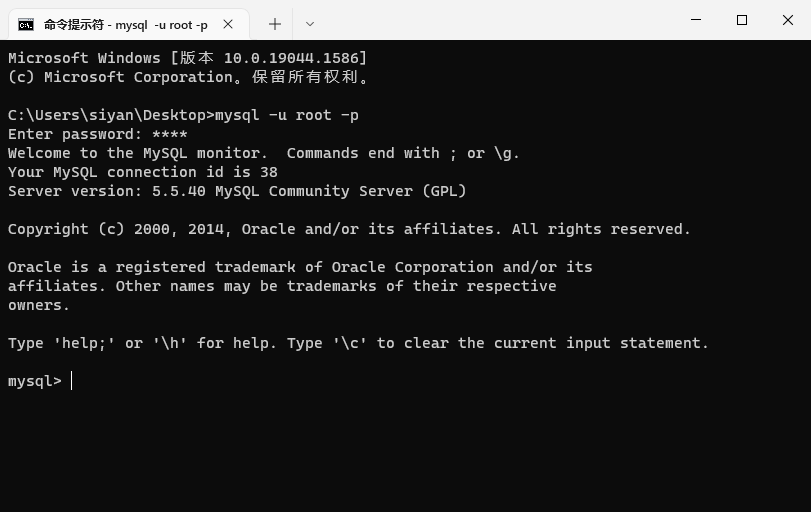
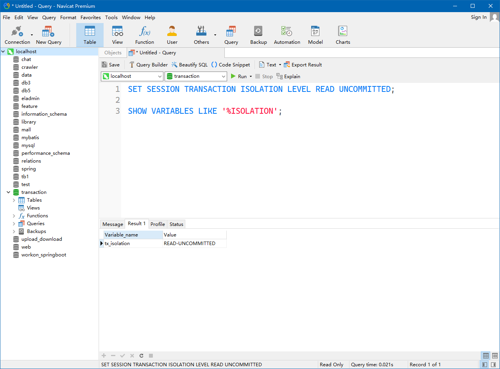
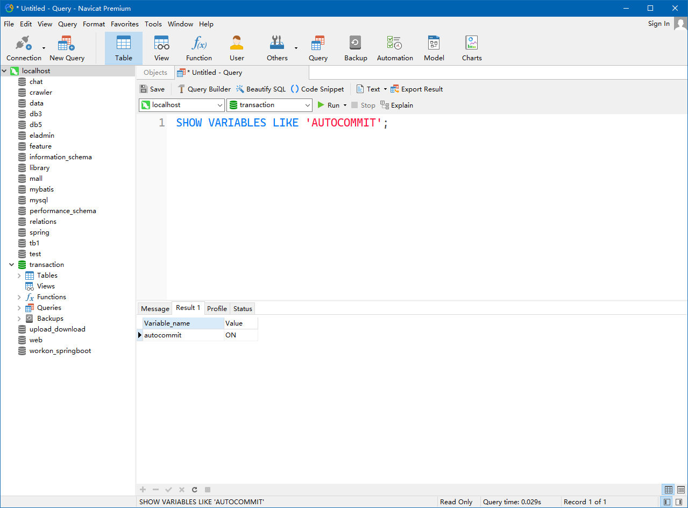

### 事务

在理解事务的概念之前，接触数据库系统的其他高级特性还言之过早。事务就是一组原子性的SQL查询，或者说一个独立的工作单元。如果数据库引擎能够成功地对数据库应用该组查询的全部语句，那么就执行该组查询。如果其中有任何一条语句因为崩溃或其他原因无法执行，那么所有的语句都不会执行。也就是说，事务内的语句，要么全部执行成功，要么全部执行失败。

银行应用是解释事务必要性的一个经典例子。假设一个银行的数据库有两张表：支票（checking）表和储蓄（savings）表。现在要从用户 Jane 的支票账户转移 200 美元到她的储蓄账户，那么需要至少三个步骤：

1. 检查支票账户的余额高于 200 美元。
2. 从支票账户余额中减去 200 美元。
3. 在储蓄账户余额中增加 200 美元。

上述三个步骤的操作必须打包在一个事务中，任何一个步骤失败，则必须回滚所有的步骤。

可以用 START TRANSACTION 语句开始一个事务，然后要么使用 COMMIT 提交事务将修改的数据持久保留，要么使用 ROLLBACK 撤销所有的修改。事务 SQL 的样本如下：

```SQL
START TRANSACTION;
SELECT balance FROM checking WHERE customer_id = 10233276;
UPDATE checking SET balance = balance - 200.00 WHERE customer_id = 10233276;
UPDATE savings SET balance = balance + 200.00 WHERE customer_id = 10233276;
COMMIT;
```

注意：关于 balance = balance - 200.00 代码行，通常对于数据库中的减一、增一的操作，它们会被放入 SQL 语句中。避免将这些操作放在 Service 内，可以很好地避免多 JAVA 多线程操作时可能出现的原子性问题。例如，某个线程内的事务尚未完成，此时另一个线程内的事务读取某值，该值本应在前一个线程事务完成时产生变化，但后一个线程内的事务并不知晓。

单纯的事务概念并不是故事的全部。试想一下，如果执行到第四条语句时服务器崩溃了，会发生什么？天知道，用户可能会损失 200 美元。再假如，在执行到第三条语句和第四条语句之间时，另外一个进程要删除支票账户的所有余额，那么结果可能就是银行在不知道这个逻辑的情况下白白将 200 美元给了 Jane。

除非系统通过严格的 ACID 测试，否则空谈事务的概念是不够的。ACID 表示原子性（Atomicity）、一致性（Consistency）、隔离性（Isolation）和持久性（Durability）。一个运行良好的事务处理系统，必须具备这些标准特征。

#### 1. 原子性（Atomicity）

一个事务必须被视为一个不可分割的最小工作单元，整个事务中的所有操作要么全部提交成功，要么全部失败回滚，对于一个事务来说，不可能只执行其中的一部分操作，这就是事务的原子性。

#### 2. 一致性（Consistency）

数据库总是从一个一致性的状态转换到另外一个一致性的状态。在前面的例子中，一致性确保了，即使在执行第三、四条语句之间时系统崩溃，支票账户中也不会损失200美元，因为事务最终没有提交，所以事务中所做的修改也不会保存到数据库中。

#### 3. 隔离性（Isolation）

**通常来说**，一个事务所做的修改在最终提交以前，对其他事务是不可见的。在前面的例子中，当执行完第三条语句、第四条语句还未开始时，此时有另外一个账户汇总程序开始运行，则其看到的支票账户的余额并没有被减去200美元。后面我们讨论隔离级别（Isolation level）的时候，会发现为什么我们要说“通常来说”是不可见的。

#### 4. 持久性（Durability）

一旦事务提交，则其所做的修改就会永久保存到数据库中。此时即使系统崩溃，修改的数据也不会丢失。持久性是个有点模糊的概念，因为实际上持久性也分很多不同的级别。有些持久性策略能够提供非常强的安全保障，而有些则未必。而且不可能有能做到 100％ 的持久性保证的策略（如果数据库本身就能做到真正的持久性，那么备份又怎么能增加持久性呢？）。

事务的 ACID 特性可以确保银行不会弄丢你的钱。而在应用逻辑中，要实现这一点非常难，甚至可以说是不可能完成的任务。一个兼容 ACID 的数据库系统，需要做很多复杂但可能用户并没有觉察到的工作，才能确保 ACID 的实现。

就像锁粒度的升级会增加系统开销一样，这种事务处理过程中额外的安全性，也会需要数据库系统做更多的额外工作。一个实现了 ACID 的数据库，相比没有实现 ACID 的数据库，通常会需要更强的 CPU 处理能力、更大的内存和更多的磁盘空间。正如本章不断重复的，这也正是 MySQL 的存储引擎架构可以发挥优势的地方。用户可以根据业务是否需要事务处理，来选择合适的存储引擎。对于一些不需要事务的查询类应用，选择一个非事务型的存储引擎，可以获得更高的性能。即使存储引擎不支持事务，也可以通过 LOCK TABLES 语句为应用提供一定程度的保护，这些选择用户都可以自主决定。

### 查看 MySQL 版本信息

不同的 MySQL 版本之间，其内含的命令可能会有所变化。例如，查询 MySQL 隔离级别时，你可能会得到以下的结果：

|     Variable_name     |     Value      |
| :-------------------: | :------------: |
| transaction_isolation | READ-COMMITTED |
|     tx_isolation      | READ-COMMITTED |

而实际上这中结果只会在某几个版本里面出现。其原因是，MySQL 官方从 5.7.20 版本开始，将 transaction_isolation 作为 tx_isolation 的别名引入了 MySQL 中，而 tx_isolation 在 MySQL 8.0 之后就被废弃了。

因此，无论是 transaction_isolation 还是 tx_isolation，它们其实表示的都是当前 MySQL 的隔离级别。但这种差别也造成了查询隔离级别时，其使用的命令会出现差异。

显然，获取 MySQL 版本信息对命令的使用会有所帮助。

#### 1. 登录显示

实际上，在 MySQL 安装完毕后，可以使用命令行登录 MySQL 数据库。在登录时，MySQL 就会显示相关的版本信息：



#### 2. 命令行查询

如果你不习惯使用终端的方式登录 MySQL，并且已经在使用一些第三方的数据库管理工具了，那么你可以通过命令查询 MySQL 版本信息：

```sql
SELECT VERSION() FROM DUAL;
```

### MySQL 中的事务管理

在了解事务管理之前，先学习如何更改会话中的隔离级别。所谓会话，以 Navicat 数据库管理工具为例，一次查询时所出现的窗口即视为一次会话：



#### 1. 查询、修改隔离级别

MySQL 默认的事务隔离级别为 REPEATABLE-READ，MySQL 中提供了更改独立会话中事务隔离级别的命令：

```sql
# READ-UNCOMMITTED/READ-COMMITTED/REPEATABLE-READ/SERIALIZABLE
SET SESSION TRANSACTION ISOLATION LEVEL READ UNCOMMITTED; # CHANGE INTO READ-UNCOMMITTED
```

查看当前会话中隔离级别的命令为：

```sql
SHOW VARIABLES LIKE '%ISOLATION'; # ANY VERSION

SELECT @@tx_isolation; # BEFORE MySQL 8.0 VERSION
SELECT @@transaction_isolation; # AFTER MySQL 5.7.20 VERSION
```

查看全局会话中隔离级别的命令为：

```sql
SELECT @@global.tx_isolation; # BEFORE MySQL 8.0 VERSION
SELECT @@global.transaction_isolation; # AFTER MySQL 5.7.20 VERSION
```

修改全局事务隔离级别的命令为：

```SQL
SET GLOBAL TRANSACTION ISOLATION LEVEL REPEATABLE READ; # CHANGE INTO REPEATABLE-READ
```

注意，并不推荐以修改 MySQL 全局配置的方式去更改事务的隔离级别，可能引发会话的查询异常。

#### 2. 事务控制语句

MySQL 默认使用 InnoDB 作为存储引擎，该引擎支持事务。但通常情况下，事务是自动开启并自动提交的。使用以下命令，查看事务自动提交功能的开启状态：

```SQL
SHOW VARIABLES LIKE 'AUTOCOMMIT';
```



如果希望禁用自动提交功能，可以通过以下命令完成：

```SQL
SET AUTOCOMMIT = 0;
```

AUTOCOMMIT 参数为 0 时，表示禁止自动提交；参数为 1 时，表示开启自动提交。

实际上，不论是否开启自动提交功能，你都可以显式的开启或关闭一个事务：

1. 开启事务：BEGIN 或 START TRANSACTION 用于显式地开启一个事务；
2. 提交事务：COMMIT 或 COMMIT WORK 用于提交事务；
3. 回滚事务：ROLLBACK 或 ROLLBACK WORK 用于回滚事务。

开启事务的命令总是需要和提交事务或回滚事务的命令一起使用。使用示例：

```SQL
BEGIN;
UPDATE `user` SET age = 18 WHERE id = 1;
COMMIT;

START TRANSACTION;
DELETE FROM `user` WHERE id = 1;
ROLLBACK WORK;
```

除此之外，事务开启与事务结束之间，可以设立保存点，使用相关命令可以将事务回滚至保存点：

1. 保存点：SAVEPOINT *identifier*，在事务中创建一个保存点，一个事务中可以有多个 SAVEPOINT；
2. 删除保存点：RELEASE SAVEPOINT *identifier*，可以删除一个保存点；
3. 回滚到保存点：ROLLBACK TO *identifier*，把事务回滚到保存点。

保存点的作用实际上不大，了解即可。


### 事务并发下引发的问题

本章节需要在不考虑任何事务隔离级别的情况下进行阅读。事务的隔离性表明，任何一个设计良好的事务系统，其事务内所作出的修改在最终提交之前，都不应该对外可见。

#### 更新丢失

两个事务都同时更新一行数据，一个事务对数据的更新把另一个事务对数据的更新覆盖了。这是因为系统没有执行任何的锁操作，因此并发事务并没有被隔离开来。

#### 脏读

一个事务读取到了另一个事务未提交的数据操作结果。这是相当危险的，因为很可能所有的操作都被回滚。

|              会话1               | 值1  |               会话2               | 值2  |
| :------------------------------: | :--: | :-------------------------------: | :--: |
|              BEGIN               |  -   |               BEGIN               |  -   |
|                -                 |  -   | SELECT age FROM user WHERE id=1;  |  5   |
|                -                 |  -   | UPDATE user SET age=10 WHER id=1; |  ok  |
| SELECT age FROM user WHERE id=1; |  10  |                 -                 |  -   |
|              COMMIT              |  ok  |             ROLLBACK              |  ok  |
|                -                 |  -   |              COMMIT               |  ok  |

#### 不可重复读

一个事务对同一行数据重复读取两次，但是却得到了不同的结果。

虚读：事务 T1 读取某一数据后，事务 T2 对其做了修改，当事务T1再次读该数据时得到与前一次不同的值。

|              会话1               | 值1  |               会话2               | 值2  |
| :------------------------------: | :--: | :-------------------------------: | :--: |
|              BEGIN               |  ok  |               BEGIN               |  ok  |
| SELECT age FROM user WHERE id=1; |  5   |                 -                 |  -   |
|                -                 |  -   | UPDATE user SET age=10 WHER id=1; |  ok  |
|                -                 |  -   |              COMMIT               |  ok  |
| SELECT age FROM user WHERE id=1; |  10  |                 -                 |  -   |
|              COMMIT              |  ok  |                 -                 |  -   |

幻读：事务在操作过程中进行两次查询，第二次查询的结果包含了第一次查询中未出现的数据或者缺少了第一次查询中出现的数据（这里并不要求两次查询的 SQL 语句相同）。这是因为在两次查询过程中有另外一个事务插入或删除数据造成的。

|            会话1            | 值1  |                       会话2                       | 值2  |
| :-------------------------: | :--: | :-----------------------------------------------: | :--: |
|            BEGIN            |  ok  |                       BEGIN                       |  ok  |
| SELECT COUNT(id) FROM user; |  3   |                         -                         |  -   |
|              -              |  -   | INSERT INTO user(id, username) VALUE(6, "dylan"); |  ok  |
|              -              |  -   |                      COMMIT                       |  ok  |
| SELECT COUNT(id) FROM user; |  4   |                         -                         |  -   |
|           COMMIT            |  ok  |                         -                         |  -   |

#### 幻读

这里的幻读是不可重复读的一种特殊情况。主要偏向于插入和删除数据。

|                       会话1                       | 值1  |                       会话2                       | 值2  |
| :-----------------------------------------------: | :--: | :-----------------------------------------------: | :--: |
|                       BEGIN                       |  ok  |                       BEGIN                       |  ⭕   |
|               SELECT \* FROM user;                |  no  |                         -                         |  -   |
|                         -                         |  -   | INSERT INTO user(id, username) VALUE(2, "dylan"); |  ⭕   |
|                         -                         |  -   |                         -                         |  -   |
|                         -                         |  -   |                      COMMIT                       |  ⭕   |
| INSERT INTO user(id, username) VALUE(2, "dylan"); |  ❌   |                         -                         |  -   |
|               SELECT \* FROM user;                |  ⭕   |                         -                         |  -   |
| INSERT INTO user(id, username) VALUE(2, "dylan"); |  ❌   |                         -                         |  -   |
|                     ROLLBACK                      |  ⭕   |                         -                         |  -   |

### 事务的隔离级别

MySQL 中使用 InnoDB 存储引擎，提供的事务隔离级别有 4 种：

#### READ UNCOMMITTED（读未提交）

允许脏读取，但不允许更新丢失。如果一个事务已经开始写数据，则另外一个事务则不允许同时进行写操作，但允许其他事务读此行数据。该隔离级别可以通过“排他写锁”实现。

#### READ COMMITTED（读提交）

允许不可重复读取不可重复读取)，但不允许脏读取。这可以通过“瞬间共享读锁”和“排他写锁”实现。读取数据的事务允许其他事务继续访问该行数据，但是未提交的写事务将会禁止其他事务访问该行。

#### REPEATABLE READ（可重复读）

禁止不可重复读取和脏读取，但是有时可能出现幻读数据。这可以通过“共享读锁”和“排他写锁”实现。读取数据的事务将会禁止写事务（但允许读事务），写事务则禁止任何其他事务。

#### SERIALIZABLE（串行化）

提供严格的事务隔离。它要求事务序列化执行，事务只能一个接着一个地执行，不能并发执行。仅仅通过“行级锁”是无法实现事务序列化的，必须通过其他机制保证新插入的数据不会被刚执行查询操作的事务访问到。

| 事务隔离级别                 | 脏读 | 不可重复读 | 幻读 |
| ---------------------------- | ---- | ---------- | ---- |
| READ UNCOMMITTED（读未提交） | 是   | 是         | 是   |
| READ COMMITTED（读提交）     | 否   | 是         | 是   |
| REPEATABLE READ（可重复读）  | 否   | 否         | 是   |
| SERIALIZABLE（串行化）       | 否   | 否         | 否   |

### MySQL中的REPEATABLE READ

MySQL 中的 REPEATABLE READ 是解决了部分幻读的问题：

- 它可以保证事务 1 在仅进行查询的情况下，无论事务 2 对同样的表进行何种增删改操作，事务 1 查询到的表数据都是一致的；

- 如果事务 1 开启，此时事务 2 开启并对表进行了增删改操作，之后事务 2 被提交，事务 1 紧接着进行增删改操作，并涉及到需要刷新行或刷新表数据的操作时，在事务 2 中被修改、增加或删除的数据，将有机会出现在事务 1 的查询中：

  - 事务 1 导致行刷新的操作中，包括了被事务 2 修改的行，那么在事务 1 中会出现新数据，或不变（相同修改的情况下）；
  - 事务 1 导致行刷新的操作中，包括了被事务 2 删除的行，那么该数据行将在事务 1 中呈现未成功更改的状况；
  - 事务 1 导致行刷新的操作和事务 2 增加行没有冲突，数据在事务 1 中查询结果没有变化；
  - 事务 1 导致表刷新的操作，会使事务 2 中所有修改、新增的数据出现在事务 1 的查询中，但事务 2 中被删除的数据将在事务 1 中呈现未成功更改的状况。

- 如果事务 1 开启，此时事务 2 开启并对表进行了增删改操作，之后事务 2 被提交，事务 1 紧接着进行增删改操作，但并未涉及到需要刷新行或刷新表数据的操作时，会出现以下情况：

  - 事务 1 删除事务 2 已删除的行，不会报错，但数据将呈现未成功删除的状况；

- 事务 1 正常地新增行，并得到与预期一样的结果。

### MySQL中的联结表

SQL join 字句可以基于这些表之间的共同字段，把来自两个或多个表的数据结合起来。

最常见的 join 字句类型：
1. INNER JOIN
2. LEFT JOIN
3. RIGHT JOIN
4. FULL JOIN

#### 数据表准备

```sql
CREATE TABLE username (
	id INT(10) NOT NULL AUTO_INCREMENT PRIMARY KEY,
	user_name VARCHAR(32) NOT NULL
);

CREATE TABLE useraddress (
	id INT(10) NOT NULL AUTO_INCREMENT PRIMARY KEY,
	user_address VARCHAR(32) NOT NULL
);

SELECT * FROM username;
SELECT * FROM useraddress;

INSERT INTO username(id, user_name)
VALUES
	(1, "Google"),
	(2, "Taobao"),
	(3, "Weibo"),
	(4, "Facebook");
	
INSERT INTO useraddress(id, user_address)
VALUES
	(1, "美国"),
	(5, "中国"),
	(3, "中国"),
	(6, "美国");
```

###### table.username

|  id  | user_name |
| :--: | :-------: |
|  1   |  Google   |
|  2   |  Taobao   |
|  3   |   Weibo   |
|  4   | Facebook  |

###### table.useraddress

|  id  | address |
| :--: | :-----: |
|  1   |  美国   |
|  5   |  中国   |
|  3   |  中国   |
|  6   |  美国   |

#### 联结表的种类与示例

##### INNER JOIN

内联结是最常见的一种联结，只要联结匹配即可。


```sql
# 使用where字句也可以实现内联结
SELECT username.id, username.user_name, useraddress.user_address FROM username, useraddress
WHERE username.id = useraddress.id;

# 使用inner join字句实现的内联结，inner join关键字等同于join，inner可省略
SELECT username.id, username.user_name, useraddress.user_address
FROM username
INNER JOIN useraddress
ON username.id = useraddress.id;
```

|  id  | user_name | user_address |
| :--: | :-------: | :----------: |
|  1   |  Google   |     美国     |
|  3   |   Weibo   |     中国     |

##### LEFT JOIN

LEFT JOIN 返回左表的全部行和右表满足 ON 条件的行，如果左表的行在右表中没有匹配，那么这一行右表中对应数据用 NULL 代替。


```sql
# left join外联结
SELECT username.*, useraddress.user_address
FROM username
LEFT JOIN useraddress
ON username.id = useraddress.id;
```

|  id  | user_name | user_address |
| :--: | :-------: | :----------: |
|  1   |  Google   |     美国     |
|  2   |  Taobao   |  *（NULL）*  |
|  3   |   Weibo   |     中国     |
|  4   | Facebook  |  *（NULL）*  |

##### RIGHT JOIN

RIGHT JOIN 返回右表的全部行和左表满足 ON 条件的行，如果右表的行在左表中没有匹配，那么这一行左表中对应数据用 NULL 代替。


```sql
# right join外联结
SELECT useraddress.*, username.user_name
FROM username
RIGHT JOIN useraddress
ON username.id = useraddress.id;
```

|  id  | user_address | user_name  |
| :--: | :----------: | :--------: |
|  1   |     美国     |   Google   |
|  3   |     中国     |   Weibo    |
|  5   |     中国     | *（NULL）* |
|  6   |     美国     | *（NULL）* |

##### FULL OUTER JOIN

MySQL 不支持 FULL OUTER JOIN。

FULL JOIN 会从左表和右表那里返回所有的行。如果其中一个表的数据行在另一个表中没有匹配的行，那么对面的数据用 NULL 代替。


### MySQL数据类型

#### 数值类型

MySQL 支持所有标准 sql 数值数据类型。

扩展，关于创建表时使用 INT(11)。INT 类型占用 4 个字节，也就是它的范围是：
- -2147483648~2147483647

而创建表示使用的 INT(11) 中的 11 表示字符显示宽度，显而易当一个 INT 类型取值最多占用的也就是 11 个字符的宽度，不可能再多了，诸如 INT(20) 之类的都不是特别严谨的写法。

|      类型      |              大小（bytes）              |     用途     |
| :------------: | :-------------------------------------: | :----------: |
|    TINYINT     |                    1                    |   小整数值   |
|    SMALLINT    |                    2                    |   大整数值   |
|   MEDIUMINT    |                    3                    |   大整数值   |
| INT 或 INTEGER |                    4                    |   大整数值   |
|     BIGINT     |                    8                    |  极大整数值  |
|     FLOAT      |                    4                    | 单精度浮点数 |
|     DOUBLE     |                    8                    | 双精度浮点数 |
|    DECIMAL     | DECIMAL(M, D)，M 为总位数，D 为小数位数 |    小数值    |

#### 日期和时间类型

表示时间值的日期和时间类型为 DATETIME、DATE、TIMESTAMP、TIME 和 YEAR。

|   类型    | 大小（bytes） |        格式         |           用途           |
| :-------: | :-----------: | :-----------------: | :----------------------: |
|   DATE    |       3       |     yyyy-MM-dd      |          日期值          |
|   TIME    |       3       |      HH:mm:ss       |     时间值或持续时间     |
|   YEAR    |       1       |        yyyy         |          年份值          |
| DATETIME  |       8       | yyyy-MM-dd HH:mm:ss |     混合日期和时间值     |
| TIMESTAMP |       4       | yyyy-MM-dd HH:mm:ss | 混合日期和时间值，时间戳 |

#### 字符串类型

字符串类型指 CHAR、VARCHAR、BINARY、VARBINARY、BLOB、TEXT、ENUM 和 SET。

CHAR(N) 和 VARCHAR(N) 中的 N 代表字符的个数，比如也就是中文字符或英文字符的数量，不代表字节数，例：CHAR(30) 可以存储 30 个字符。

根据字符集的不同，中文在 MySQL 中所占的字节数是不一样的：
- GBK：一个汉字占 2 个字节（byte）
- UTF-8：一个汉字占 3 个字节（byte）

大多数表使用的都是 UTF-8 的字符集，那么一个中文占 3 个字节。如果使用 VARCHAR 类型，大约可以存储 21845 个汉字，但一般情况下不会存储那么多个，除非你是很长的文章。

VARCHAR 类型实际上可以存储 21845 个汉字，但是这受限于你定义该表字段时所定义 VARCHAR(n) 中的 n 的大小，如果 n 为 30，那么也就是只能存 30 个汉字了。

byte，一般指字节。

|    类型    | 大小（byte） |             用途              |
| :--------: | :----------: | :---------------------------: |
|    CHAR    |    0~255     |          定长字符串           |
|  VARCHAR   |   0~65535    |          变长字符串           |
|  TINYTEXT  |    0~255     |         短文本字符串          |
|    TEXT    |   0~65535    |         长文本字符串          |
| MEDIUMTEXT |  0~16777215  |       中等长度文本数据        |
|  LONGTEXT  | 0~4294967295 |         极大文本数据          |
|  TINYBLOB  |    0~255     | 不超过255个字符的二进制字符串 |
|    BLOB    |   0~65535    |    二进制形式的长文本数据     |
| MEDIUMBLOB |  0~16777215  | 二进制形式的中等长度文本数据  |
|  LONGBLOB  | 0~4294967295 |   二进制形式的极大文本数据    |

### InnoDB 中的锁机制

MySQL 中的锁机制取决于表所使用的存储引擎，默认情况下，MySQL 使用的 InnoDB 存储引擎。

查看事务中关于锁的详细信息，可以查阅系统数据库 information_schema 中相关的的 InnoDB 信息表：

```sql
SELECT * FROM information_schema.INNODB_TRX; # TRX: transaction
SELECT * FROM information_schema.INNODB_LOCKS;
SELECT * FROM information_schema.INNODB_LOCK_WAITS;
```

#### 共享锁和排他锁

共享锁（Shared Locks）和排他锁（Exclusive Locks）是 InnoDB 引擎实现的两种标准的行级锁（row-level locking）。

- 共享锁允许持有该锁的事务读取一行数据；
- 排他锁允许持有该锁的事务更新或删除一行数据。


提示：关于锁的理解性问题，需要结合实际的 DML(Data Manipulation Language) 出发，来进行研究。且锁是事务性的，事务结束后，当前事务所持有的所有锁才会被释放。

例如：一个事务中，普通情况下的 SELECT 语句并不会请求任何类型的锁，而普通情况下的 UPDATE、DELETE、INSERT 语句，则均会请求并持有排他锁（Exclusive Locks），事务结束后，该事务当前持有的所有数据的锁才会被释放。