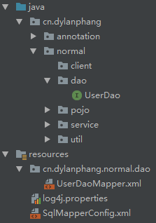

# 前言

> - 本篇关于MyBatis的基础知识与快速上手。

# 什么是MyBatis?

- 访问`https://mybatis.org/mybatis-3/zh/index.html`获取更多关于MyBatis的使用细则。

- `MyBatis`是一款优秀的持久层框架，它支持定制化`SQL`、存储过程以及高级映射。`MyBatis`避免了几乎所有的`JDBC`代码和手动设置参数以及获取结果集。`MyBatis`可以使用简单的`XML`或注解来配置和映射原生信息，将接口和`Java`的`POJOs`（`Plain Ordinary Java Object`，普通的`Java`对象）映射成数据库中的记录。

- 每个`MyBatis`应用程序主要都是使用`SqlSessionFactory`实例的，一个`SqlSessionFactory`实例可以通过`SqlSessionFactoryBuilder`获得。`SqlSessionFactoryBuilder`可以从一个`xml`配置文件或者一个预定义的配置类的实例获得。
- 用`xml`文件构建`SqlSessionFactory`实例是非常简单的事情。推荐在这个配置中使用类路径资源`classpath resource`，但你可以使用任何`Reader`实例，包括用文件路径或`file://`开头的`url`创建的实例。`MyBatis`有一个实用类`Resources`，它有很多方法，可以方便地从类路径及其它位置加载资源。
- 使用`MyBatis`需要在`Maven`项目中添加以下依赖：

```xml
<dependency>
    <groupId>org.mybatis</groupId>
    <artifactId>mybatis</artifactId>
    <version>3.4.6</version>
</dependency>
```

# MyBatis与JDBC编程比较

1. 数据库连接创建、释放频繁造成系统资源浪费，从而影响系统性能，如果使用数据库连接池可以解决此问题。`MyBatis`中提供了数据库连接池选项，可以在`SqlMapperConfig.xml`中配置数据库连接池，使用连接池来管理数据库的连接。
2. `sql`语句写在代码中造成代码不容易维护，实际应用`sql`变化的可能较大，`sql`变动即需要改变`Java`代码。`MyBatis`将`sql`语句配置`DaoMapper.xml`文件中，因此做到了与`Java`代码分离。
3. 向`sql`语句传参十分复杂，因为`sql`语句的`where`条件不一定，可能多也可能少，占位符需要和参数对应。`MyBatis`自动将`Java`对象映射至`sql`语句，通过`statement`中的`parameterType`定义输入参数的类型。
4. 对结果集解析复杂，`sql`变化导致解析代码变化，且解析前需要遍历，如果能将数据库记录封装成`pojo`对象，解析会更方便。`MyBatis`自动将`sql`执行结果映射至`Java`对象，通过`statement`中的`resultType`定义输出的结果类型。

# 基于配置文件的MyBatis

- `Maven`默认情况下，只会对`src/main/resources`目录下的资源进行打包，也就是当你的项目被打包成`jar`或`war`包之后，这些配置文件一并会出现在你的项目中，这是合理的，因此编译后的`Java`字节码文件`.class`也同时依赖这些文件的配置。
- 可以通过更改`Maven`中的`pom.xml`文件，对打包资源的默认目录进行更改或增加。

## 1. 默认方式

- 默认情况下，我们需要把资源集中在`src/main/resources`目录下。
- `MyBatis`依赖于配置文件，在使用之前我们需要对`MyBatis`进行配置：
  1. 普通的`Maven`项目中，我们需要在`resources`目录下创建`MyBatis`的配置文件`SqlMapperConfig.xml`；
  2. 同时需要在`resources`目录下建立与目标`dao`接口同级同名目录，并将`daoMapper.xml`放置在同级同名目录中（重要）。



- 必须要将`UserDao.java`和`UserDaoMapper.xml`放置于同级同名目录下，否则会导致程序报错失败。

## 2. 配置模式

- 如果不想把资源集中在目录`src/main/resources`下，譬如想把`MapperConfig.xml`放置在`resources`目录下，但是`Mapper.xml`想要放置在`UserDao.java`的同级目录下，那么需要配置`pom.xml`文件，更改`Maven`打包时对配置文件的默认规则，使得`Maven`可以在打包项目的时候，一并打包`src/main/java`目录下的配置文件。
- 需要在`pom.xml`中添加以下代码：

```xml
<build>  
    <resources>  
        <resource>  
            <directory>src/main/resources</directory>  
            <includes>  
                <include>**/*.properties</include>  
                <include>**/*.xml</include>  
            </includes>  
            <filtering>true</filtering>  
        </resource>  
        <resource>  
            <directory>src/main/java</directory>  
            <includes>  
                <include>**/*.properties</include>  
                <include>**/*.xml</include>  
            </includes>  
            <filtering>true</filtering>  
        </resource>  
    </resources>  
</build>
```

- 在`pom.xml`文件中添加该配置后，目录`src/main/resources`或`src/main/java`中的`.properties`或`.xml`文件均可以被识别并打包到`jar`或`war`中。
- 此时可以把`Mapper.xml`放置于`Dao.java`的同级目录下。

## 3. Mybatis开发环境

### a. 创建Maven工程

- 除了`MyBatis`之外，还需要添加数据库连接驱动、日志依赖和测试模块。

#### pom.xml

```xml
<?xml version="1.0" encoding="UTF-8"?>
<project xmlns="http://maven.apache.org/POM/4.0.0"
         xmlns:xsi="http://www.w3.org/2001/XMLSchema-instance"
         xsi:schemaLocation="http://maven.apache.org/POM/4.0.0 http://maven.apache.org/xsd/maven-4.0.0.xsd">
    <modelVersion>4.0.0</modelVersion>

    <groupId>cn.dylanphang</groupId>
    <artifactId>mybatis</artifactId>
    <version>1.0-SNAPSHOT</version>

    <packaging>jar</packaging>

    <dependencies>
        <!-- 本模块使用mybatis来读取数据库中的数据 -->
        <dependency>
            <groupId>org.mybatis</groupId>
            <artifactId>mybatis</artifactId>
            <version>3.4.6</version>
        </dependency>
        <!-- 数据库连接 -->
        <dependency>
            <groupId>mysql</groupId>
            <artifactId>mysql-connector-java</artifactId>
            <version>8.0.20</version>
        </dependency>
        <!-- 日志 -->
        <dependency>
            <groupId>log4j</groupId>
            <artifactId>log4j</artifactId>
            <version>1.2.17</version>
        </dependency>
        <!-- 测试 -->
        <dependency>
            <groupId>junit</groupId>
            <artifactId>junit</artifactId>
            <version>4.12</version>
            <scope>test</scope>
        </dependency>
    </dependencies>

    <build>
        <plugins>
            <!-- 指定maven编译的jdk版本，如果不指定，maven3默认使用jdk1.5，maven2默认使用jdk1.3 -->
            <plugin>
                <groupId>org.apache.maven.plugins</groupId>
                <artifactId>maven-compiler-plugin</artifactId>
                <configuration>
                    <!-- 一般而言，target与source是保持一致的 -->
                    <!-- 但是，有时候为了让程序能在其他版本的jdk中运行(对于低版本目标jdk，源代码中不能使用低版本jdk中不支持的语法)，会存在target不同于source的情况 -->
                    <source>1.8</source> <!-- 源代码使用的JDK版本 -->
                    <target>1.8</target> <!-- 编译class文件的JDK版本 -->
                    <encoding>UTF-8</encoding> <!-- 指定字符集编码 -->
                </configuration>
            </plugin>
        </plugins>
    </build>
</project>
```

#### log4j.properties

- `log4j`所依赖的配置文件，放置于`src/main/resources`目录下即可。
- `log4j.appender.LOGFILE.File`键最好设置为你项目的绝对路径，日志文件`axis.log`会在该绝对路径下生成。

```properties
# Set root category priority to INFO and its only appender to CONSOLE.
# log4j.rootCategory=INFO, CONSOLE, debug, info, warn, error, fatal
log4j.rootCategory=debug, CONSOLE, LOGFILE

# Set the enterprise logger category to FATAL and its only appender to CONSOLE.
log4j.logger.org.apache.axis.enterprise=FATAL, CONSOLE

# CONSOLE is set to be a ConsoleAppender using a PatternLayout.
log4j.appender.CONSOLE=org.apache.log4j.ConsoleAppender
log4j.appender.CONSOLE.layout=org.apache.log4j.PatternLayout
log4j.appender.CONSOLE.layout.ConversionPattern=%d{ISO8601} %-6r [%15.15t] %-5p %30.30c %x - %m\n

# LOGFILE is set to be a File appender using a PatternLayout.
log4j.appender.LOGFILE=org.apache.log4j.FileAppender
log4j.appender.LOGFILE.File=./axis.log
log4j.appender.LOGFILE.Append=true
log4j.appender.LOGFILE.layout=org.apache.log4j.PatternLayout
log4j.appender.LOGFILE.layout.ConversionPattern=%d{ISO8601} %-6r [%15.15t] %-5p %30.30c %x - %m\n
```

#### mysql

- `类型(n)`中的`n`代表字符长度。`INT`类型占用`4`个字节，即最长为`11`位，因此`INT(n)`中的`n`最大也就等于`11`。

```mysql
CREATE TABLE `user` (
  `id` int(11) NOT NULL AUTO_INCREMENT,
  `username` varchar(32) NOT NULL COMMENT '用户名称',
  `birthday` datetime DEFAULT NULL COMMENT '生日',
  `sex` char(1) DEFAULT NULL COMMENT '性别',
  `address` varchar(256) DEFAULT NULL COMMENT '地址',
  PRIMARY KEY (`id`)
) ENGINE=InnoDB AUTO_INCREMENT=50 DEFAULT CHARSET=utf8
```

### b. 实体类代码

#### User.java

- `pojo`，用于封装`user`对象。
- 持久层接口中的方法大多返回的都是`pojo`对象。

```java
package cn.dylanphang.normal.pojo;

import java.io.Serializable;
import java.util.Date;

public class User implements Serializable {
    private Integer id;
    private String username;
    private Date birthday;
    private String sex;
    private String address;

    public Integer getId() {
        return id;
    }

    public void setId(Integer id) {
        this.id = id;
    }

    public String getUsername() {
        return username;
    }

    public void setUsername(String username) {
        this.username = username;
    }

    public Date getBirthday() {
        return birthday;
    }

    public void setBirthday(Date birthday) {
        this.birthday = birthday;
    }

    public String getSex() {
        return sex;
    }

    public void setSex(String sex) {
        this.sex = sex;
    }

    public String getAddress() {
        return address;
    }

    public void setAddress(String address) {
        this.address = address;
    }

    @Override
    public String toString() {
        return "User{" +
                "id=" + id +
                ", username='" + username + '\'' +
                ", birthday=" + birthday +
                ", sex='" + sex + '\'' +
                ", address='" + address + '\'' +
                '}';
    }
}
```

### c. 持久层代码

#### UserDao.java

- 使用`MyBatis`只需要编写一个`Dao`接口类即可，其余的内部`sql`语句配置在`Mapper`中，或者使用注解的方式配置在`Dao`接口类中。
- `UserDao`以后可以命名为`UserMapper`。

```java
package cn.dylanphang.normal.dao;

import cn.dylanphang.normal.pojo.User;

import java.util.List;

/**
 * 用户的持久层接口。
 */
public interface UserDao {
    /**
     * 查询所有操作
     * @return
     */
    List<User> findAll();

    /**
     * 根据id查询
     * @param id
     * @return
     */
    User findById(Integer id);

    /**
     * 增加用户
     * @param user
     */
    void save(User user);

    /**
     * 删除用户
     * @param id
     */
    void del(Integer id);

    /**
     * 更新用户
     * @param user
     */
    void update(User user);

    /**
     * 根据名称进行模糊查询
     * @param username
     * @return
     */
    List<User> findByName(String username);

    /**
     * 查找总记录条数
     * @return
     */
    int findTotal();
}
```

### d. MyBatis核心配置

#### UserDaoFactory.java

- 使用`UserDaoFactory`可以创建出`UserDao`的动态代理对象，在业务层中使用`UserDaoFactory`得到`UserDao`对象。
- 此后可以将`UserDaoFactory`更名为更加精准的`UserMapperFactory`或`xxxUtils`。

```java
package cn.dylanphang.normal.util;

import cn.dylanphang.normal.dao.UserDao;
import org.apache.ibatis.io.Resources;
import org.apache.ibatis.session.SqlSession;
import org.apache.ibatis.session.SqlSessionFactory;
import org.apache.ibatis.session.SqlSessionFactoryBuilder;

import java.io.IOException;
import java.io.InputStream;

public class UserDaoFactory {
    private static InputStream is = null;
    private static SqlSession session = null;

    public static UserDao getUserDao() {
        try {
            // 1.读取配置文件
            is = Resources.getResourceAsStream("SqlMapperConfig.xml");

            // 2.获取构建者
            SqlSessionFactoryBuilder builder = new SqlSessionFactoryBuilder();

            // 3.获取工厂类
            SqlSessionFactory factory = builder.build(is);

            // 4.获取会话
            session = factory.openSession();

            // 5.获取dao对象
            return session.getMapper(UserDao.class);
        } catch (IOException e) {
            e.printStackTrace();
        }
        return null;
    }

    public static void close() {
        if (session != null) {
            session.commit(); // 增删改需要进行事务的提交
            session.close();
        }
        if (is != null) {
            try {
                is.close();
            } catch (IOException e) {
                e.printStackTrace();
            }
        }
    }
}
```

#### SqlMapperConfig.xml

- `MyBatis`核心配置文件，需要在其中进行数据库连接的配置等，同时使用`Mappers`标签配置`DaoMapper`的路径。
- 对其中数据库`url`中的参数作一点解析：
  - `serverTimezone=GMT%2B8`：将时区设置为东八区；
  - `useSSL=true`：使用安全连接；
  - `useAffectedRows=true`：返回受影响行数；
  - `useUnicode=true`：当数据库使用的字符集和项目不一致的时候，开启自动转换；
  - `characterEncoding=UTF-8`：指定自动转换时项目所使用的字符集类型。
- 例子：如果数据库使用的是`GBK`编码，而项目数据使用的是`UTF-8`编码。此时需要添加`useUnicode=true&amp;characterEncoding=UTF-8`参数，存取数据过程如下：
  - 存数据时：数据库存放数据时，将检测到`useUnicode=true`，则数据库会首先是用`characterEncoding`中的字符集`UTF-8`对需要存储的数据进行解码，获得字节码数据，而后会将字节码数据根据数据库实际的字符集`GBK`进行编码，最终存储到数据库中。
  - 取数据时：数据库首先检查到`useUnicode=true`，则会使用`characterEncoding`中指定的字符集对从数据库中解码的字节码进行编码，从而使程序能获得正确的字符。

```xml
<?xml version="1.0" encoding="UTF-8"?>
<!-- Mybatis主配置文件的约束 -->
<!DOCTYPE configuration
        PUBLIC "-//mybatis.org//DTD Config 3.0//EN"
        "http://mybatis.org/dtd/mybatis-3-config.dtd">

<!-- Mybatis的主配置文件-->
<configuration>
    <!-- 环境配置 -->
    <environments default="mysql">
        <!-- Mysql的环境配置-->
        <environment id="mysql">
            <!-- 事务类型配置，JDBC(Java DataBase Connectivity) -->
            <transactionManager type="JDBC"/>
            <!-- 数据源（连接池）配置-->
            <dataSource type="POOLED">
                <!-- 连接数据库的4个基本信息 -->
                <property name="driver" value="com.mysql.cj.jdbc.Driver"/>
                <property name="url" value="jdbc:mysql://localhost:3306/mybatis?serverTimezone=GMT%2B8&amp;useSSL=true&amp;useAffectedRows=true&amp;useUnicode=true&amp;characterEncoding=UTF-8"/>
                <property name="username" value="root"/>
                <property name="password" value="root"/>
            </dataSource>
        </environment>
    </environments>

    <!-- 指定映射配置文件的位置，映射配置文件指的是每个DAO的单独的配置文件-->
    <mappers>
        <!-- 这个地方指定的resource要使用斜杠分割，根目录是/resources -->
        <!-- 只要是resources属性，那么指向的一定是.xml文件，那么无论该文件在java目录还是resources目录，都需要使用斜杠"/"分割 -->
        <mapper resource="cn/dylanphang/normal/dao/UserDaoMapper.xml"/>
    </mappers>
</configuration>
```

#### UserDaoMapper.xml

- 在`DaoMapper`配置文件中，配置`sql`语句。
- 可以理解为`MyBatis`将通过`MapperConfig.xml`读取此`Mapper.xml`，并自动为`namespace`中指定的`dao`接口编写它实现类，并最终可以通过`SqlSession.getMapper(dao.class)`的方式获取到该接口实现的引用。

```xml
<?xml version="1.0" encoding="UTF-8"?>
<!-- Mybatis中mapper配置文件的约束 -->
<!DOCTYPE mapper
        PUBLIC "-//mybatis.org//DTD Mapper 3.0//EN"
        "http://mybatis.org/dtd/mybatis-3-mapper.dtd">

<!-- 配置指定DAO(namespace)中指定的Method(id)所要执行的sql语句，已经返回值类型(resultType) -->
<mapper namespace="cn.dylanphang.normal.dao.UserDao">

    <!-- 1.查找所有用户 -->
    <select id="findAll" resultType="cn.dylanphang.normal.pojo.User">SELECT * FROM user;</select>

    <!-- 2.根据id查找 -->
    <select id="findById" resultType="cn.dylanphang.normal.pojo.User"
            parameterType="int">SELECT * FROM user WHERE id=#{uid};</select>

    <!-- 3.保存操作 -->
    <insert id="save"
            parameterType="cn.dylanphang.normal.pojo.User">INSERT INTO user (username, birthday, sex, address) VALUES (#{username}, #{birthday}, #{sex}, #{address})</insert>

    <!-- 4.删除用户 -->
    <delete id="del" parameterType="int">DELETE FROM user WHERE id=#{uid}</delete>

    <!-- 5.更新用户 -->
    <update id="update"
            parameterType="cn.dylanphang.normal.pojo.User">UPDATE user SET username=#{username}, birthday=#{birthday}, sex=#{sex}, address=#{address} WHERE id=#{id}</update>
    <!-- 6.用户模糊查询 -->
    <select id="findByName" resultType="cn.dylanphang.normal.pojo.User" parameterType="String">
        <!-- 使用#{}的方式需要在传入参数的时候，在参数前后手动添加模糊查询匹配符"%" -->
        <!-- SELECT * FROM user WHERE username LIKE #{username}; -->
        <!-- 使用${}的法式不需要手动添加模糊查询匹配符"%"，并且${value}是固定写法不能改成其他名字 -->
        SELECT * FROM user WHERE username LIKE '%${value}%';
    </select>

    <!-- 7.查询使用聚合函数 -->
    <select id="findTotal" resultType="int"> SELECT COUNT(id) FROM user;</select>
</mapper>
```
### e. 业务层代码

#### UserService.java

- 业务层接口类。

```java
package cn.dylanphang.normal.service;

import cn.dylanphang.normal.pojo.User;

import java.util.List;

/**
 * 用户的业务层接口。
 */
public interface UserService {
    /**
     * 查询所有操作
     * @return
     */
    List<User> findAllUser();

    /**
     * 根据id查询
     * @param id
     * @return
     */
    User findUserById(Integer id);


    /**
     * 增加用户
     * @param user
     */
    void saveUser(User user);

    /**
     * 删除用户
     * @param id
     */
    void delUser(Integer id);

    /**
     * 更新用户
     * @param user
     */
    void updateUser(User user);

    /**
     * 根据名称进行模糊查询
     * @param username
     * @return
     */
    List<User> findUserByName(String username);
    /**
     * 查找总记录条数
     * @return
     */
    int findUserTotal();

}
```

#### UserServiceImpl.java

- 业务层接口的实现类。
- 持久层中访问数据库所提供的方法都是基本的`CRUD`方法，如果需要进行类似于转账的操作，多次使用`CRUD`方法，那么此转账方法应该在业务层中编写。

```java
package cn.dylanphang.normal.service.impl;

import cn.dylanphang.normal.dao.UserDao;
import cn.dylanphang.normal.pojo.User;
import cn.dylanphang.normal.service.UserService;
import cn.dylanphang.normal.util.UserDaoFactory;

import java.util.List;

public class UserServiceImpl implements UserService {
    private UserDao userDao = UserDaoFactory.getUserDao();

    @Override
    public List<User> findAllUser() {
        return this.userDao.findAll();
    }

    @Override
    public User findUserById(Integer id) {
        return this.userDao.findById(id);
    }

    @Override
    public void saveUser(User user) {
        this.userDao.save(user);
    }

    @Override
    public void delUser(Integer id) {
        this.userDao.del(id);
    }

    @Override
    public void updateUser(User user) {
        this.userDao.update(user);
    }

    @Override
    public List<User> findUserByName(String username) {
        return this.userDao.findByName(username);
    }

    @Override
    public int findUserTotal() {
        return this.userDao.findTotal();
    }
}
```

### f. 表现层代码（模拟）

#### UserServiceClient.java

- 以上`Dao`中的基础`CRUD`方法均通过测试。

```java
package cn.dylanphang.normal.client;

import cn.dylanphang.normal.pojo.User;
import cn.dylanphang.normal.service.UserService;
import cn.dylanphang.normal.service.impl.UserServiceImpl;
import cn.dylanphang.normal.util.UserDaoFactory;
import org.junit.After;
import org.junit.Test;

import java.util.Date;
import java.util.List;

public class UserServiceClient {
    UserService userService = new UserServiceImpl();

    @Test
    public void testA() {
        // 1.sql语句测试
        List<User> users = userService.findAllUser();

        for (User user : users) {
            System.out.println(user);
        }
    }

    @Test
    public void testB() {
        // 2.sql语句测试
        User user = userService.findUserById(46);
        System.out.println(user);
    }

    @Test
    public void testC() {
        // 3.sql语句测试
        User newUser = new User();
        newUser.setUsername("洪九");
        newUser.setBirthday(new Date());
        newUser.setSex("女");
        newUser.setAddress("海南");

        userService.saveUser(newUser);
        
        // 事实上此时事务仍未被提交
        for (User user : userService.findAllUser()) {
            System.out.println(user);
        }
    }

    @Test
    public void testD() {
        // 4.sql语句测试
        userService.delUser(49);
        
        // 事实上此时事务仍未被提交
        for (User user : userService.findAllUser()) {
            System.out.println(user);
        }
    }

    @Test
    public void testE() {
        // 5.sql语句测试
        User userModify = userService.findUserById(48);
        userModify.setSex("男");
        userService.updateUser(userModify);

        // 事实上此时事务仍未被提交
        for (User user : userService.findAllUser()) {
            System.out.println(user);
        }
    }

    @Test
    public void testF() {
        // 6.sql语句测试
        List<User> users = userService.findUserByName("八");

        for (User user : users) {
            System.out.println(user);
        }
    }

    @Test
    public void testG() {
        // 7.sql语句测试
        int totalUsers = userService.findUserTotal();

        System.out.println("Total: " + totalUsers);
    }

    @After
    public void destroy() {
        // *.释放资源，其中包括了提交事务代码
        UserDaoFactory.close();
    }
}
```

# 基于注解方式的MyBatis

- 原本`MyBatis`需要从持久层配置文件`Mapper.xml`中获取的要素有：
  1. 需要被代理的`dao`接口的全限定类名`namespace`；
  2. 需要被代理的方法名`id`；
  3. 需要被代理的方法所接收的参数类型`parameterType`；
  4. 需要被代理的方法的返回值类型`resultType`；
  5. 需要执行的`sql`语句。
- 当换用注解配置的时候，需要被代理的`dao`接口的全限定类名已经在`MapperConfig.xml`中的`<mappers>`标签中提供，而需要执行的`sql`语句也已经被配置在了`@Select`注解中了。
- 而剩下的方法三要素，`MyBatis`将通过反射技术，读取拥有`@Select`注解的方法，从而获取到需要代理的方法的方法名、参数类型和返回值类型。
- 至此，完全取代了配置文件`Mapper.xml`。
- 但于个人而言，如果存在`resultMap`等映射，使用`Mapper.xml`会优于使用注解的方式。

## 1. 注解配置和文件配置的区别

- 使用注解的方式，只需要把`DaoMapper`中的`sql`语句转移到对应方法上的`@Select`中即可。（目前来说）
- 要在`SqlMapperConfig.xml`中添加`UserDao`类的`Mapper`标签，采用全限定类名的方式。
- 注解可以和文件配置混合使用，此时需要在`SqlMapperConfig.xml`中添加的是全限定类名的`<Mapper>`标签，同时确保指定的`Mapper.xml`文件被置于`resources`或`java`的同级目录或同一目录中。

### a. 持久层代码

#### UserDao.java

- 使用注解`@Select`可以为指定的方法编写指定的`Sql`语句。
- 使用注解后，持久层接口的`Mapper.xml`不需要再编写，但需要在`SqlMapperConfig.xml`中的`<mappers>`中配置此接口的包名路径。

```java
package cn.dylanphang.annotation.dao;

import cn.dylanphang.annotation.pojo.User;
import org.apache.ibatis.annotations.Select;

import java.util.List;

/**
 * 用户的持久层接口。
 */
public interface UserDao {
    /**
     * 查询所有操作
     * @return
     */
    @Select("SELECT * FROM user;")
    List<User> findAll();

    /**
     * 根据id查询
     * @param id
     * @return
     */
    @Select("SELECT * FROM user WHERE id=#{uid};")
    User findById(Integer id);

    /**
     * 增加用户
     * @param user
     */
    @Select("INSERT INTO user (username, birthday, sex, address) VALUES (#{username}, #{birthday}, #{sex}, #{address})")
    void save(User user);

    /**
     * 删除用户
     * @param id
     */
    @Select("DELETE FROM user WHERE id=#{uid};")
    void del(Integer id);

    /**
     * 更新用户
     * @param user
     */
    @Select("UPDATE user SET username=#{username}, birthday=#{birthday}, sex=#{sex}, address=#{address} WHERE id=#{id};")
    void update(User user);

    /**
     * 根据名称进行模糊查询
     * @param username
     * @return
     */
    @Select("SELECT * FROM user WHERE username LIKE '%${value}%';")
    List<User> findByName(String username);

    /**
     * 查找总记录条数
     * @return
     */
    @Select("SELECT COUNT(id) FROM user;")
    int findTotal();
}
```

### b. MyBatis核心配置

#### SqlMapperConfig.xml

- 只需要在标签`<mappers>`中引用`<mapper class=.../>`即可。

```xml
<?xml version="1.0" encoding="UTF-8"?>
<!-- Mybatis主配置文件的约束 -->
<!DOCTYPE configuration
        PUBLIC "-//mybatis.org//DTD Config 3.0//EN"
        "http://mybatis.org/dtd/mybatis-3-config.dtd">

<!-- Mybatis的主配置文件-->
<configuration>
    <!-- 环境配置 -->
    <environments default="mysql">
        <!-- Mysql的环境配置-->
        <environment id="mysql">
            <!-- 事务类型配置，JDBC(Java DataBase Connectivity) -->
            <transactionManager type="JDBC"/>
            <!-- 数据源（连接池）配置-->
            <dataSource type="POOLED">
                <!-- 连接数据库的4个基本信息 -->
                <property name="driver" value="com.mysql.cj.jdbc.Driver"/>
                <property name="url" value="jdbc:mysql://localhost:3306/mybatis?serverTimezone=UTC"/>
                <property name="username" value="root"/>
                <property name="password" value="root"/>
            </dataSource>
        </environment>
    </environments>

    <!-- 指定映射配置文件的位置，映射配置文件指的是每个DAO的单独的配置文件-->
    <mappers>
        <!-- 使用@Select注解，指定持久层类的包路径 -->
        <mapper class="cn.dylanphang.annotation.dao.UserDao"/>
    </mappers>
</configuration>
```

# 配置与注解方式注意事项

- 使用配置文件对`dao`进行`daoMapper.xml`配置，`dao`中不能有`@Select`的注解；
- 同样的，`dao`中如果有`@Select`的注解，就不能使用`daoMapper.xml`的方式进行配置。

# 模糊查找

- 关于模糊查找，需要使用到特殊格式`%CONTENT%`，并使用`LIKE`子句。
- 当使用`#{}`引用参数时，我们只能通过`Java`代码，在参数前后添加上`%`之后，才能将参数作为最终传入方法的参数使用。

```xml
<!-- 用户模糊查询 -->
<select id="findByName" resultType="cn.dylanphang.normal.pojo.User" parameterType="String">
    <!-- 使用#{}的方式需要在传入参数的时候，在参数前后手动添加模糊查询匹配符"%" -->
    SELECT * FROM user WHERE username LIKE #{username};
</select>
```

- `MyBatis`提供另一种占位符`${value}`，可以通过在`LIKE`子句后添加`'%${value}%'`从而避免手动的拼接。但使用占位符`${}`的`sql`语句并不是预编译的`sql`语句，有可能造成`sql`注入：

```xml
<!-- 用户模糊查询 -->
<select id="findByName" resultType="cn.dylanphang.normal.pojo.User" parameterType="String">
    <!-- 使用${}的法式不需要手动添加模糊查询匹配符"%"，并且${value}是固定写法不能改成其他名字 -->
    SELECT * FROM user WHERE username LIKE '%${value}%';
</select>
```

- 防止`sql`注入的问题，可以选择在`Mapper`中对参数进行拼接，可以使用`<bind>`标签或`sql`提供的函数`CONCAT()`：

```xml
<!-- 用户模糊查询 -->
<select id="findByName" resultType="cn.dylanphang.normal.pojo.User" parameterType="String">
    <!-- 使用<bind>标签，防止sql注入 -->
    <bind name="finalname" value="'%' + #{username} + '%'" />
    SELECT * FROM user WHERE username LIKE #{finalname};
</select>

<select id="findByName" resultType="cn.dylanphang.normal.pojo.User" parameterType="String">
    <!-- 使用CONCAT()函数，防止sql注入 -->
    SELECT * FROM user WHERE username LIKE CONCAT(CONCAT('%', #{username}), '%');
</select>
```

