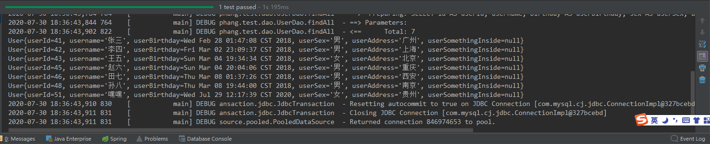
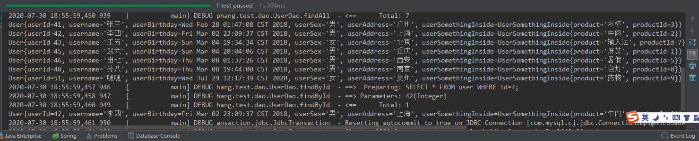

# 前言

> - 主要说明关于Mapper.xml中的parameterType、resultType与resultMap等属性.

# MyBatis配置文件参数深入

- 访问`https://mybatis.org/mybatis-3/zh/index.html`获取更多关于`MyBatis`的使用细则。
- 基础的`MyBatis`使用，多数情况下只传递一个`pojo`参数，返回的值也是一个`pojo`类，考虑以下问题：
- 如果输入的`parameterType`需要包含多种数据类型？
  - 例：使用`sql`语句中的`IN`字句，并需要同时传入`Integer[]`、`String[]`以及一个简单的`pojo`类。
  - 在这种情况下，`parameterType`只能够填入一个全限定类名，如何将数据进行包装尤为重要。
- 如果输出的`resultType`中包含了多种`pojo`类呢？
  - 例：使用联结的`sql`语句将两个表中的数据同时取出。
  - 在这种情况下，`resultType`也只能够填入一个全限定的类名，最简单的方式，我们可以在`resultType`中添加另一个自定义`pojo`类字段，但此时我们该如何将数据填充到其中呢。

# 关于parameterType参数设定

- `parameterType`有且仅接收一个全限定类名的情况下，我们需要为传入参数找到合适的传入载体。
- 关于`parameterType`属性，考虑以下情况：

```java
// 假设这是原始方法的参数列表
// 但其实很多时候，这是设计阶段才需要考虑的问题，持久层到底是采取多参数的传入方式，还是采取数组或集合方式，而或是采用POJO包装类方式
// 我认为，往往在写下了持久层中的查询方法之后，设计者就已经选择好了一种参数的传递方式了

List<User> findBySomeCondition(Integer[] ids, String address);
```

- 假设需要面对这样的一条持久层方法，而对应的`Mapper`中我们的`parameterType`是无法同时接收两种数据类型的，怎么办呢？以下解决方案：
  1. 不使用`parameterType`，在`Mapper`的`sql`语句中使用索引的方式表明该位置应该接受的参数是什么；
  2. 不使用`parameterType`，使用注解`@Param("xx")`在方法的参数列表前标明参数的别名，并在`Mapper`的`sql`语句中使用别名引用参数；
  3. 使用`parameterType`，将数据包装成为数组或集合的类型传入，但这需要修改`Dao`中的方法；
  4. 使用`parameterType`，将数据封装成`POJO`对象并传入，但这需要修改`Dao`中的方法。

- 以下我们将从这四方面着手解决参数传递的问题。

## 1. 索引方式映射目标参数类型

### UserDao.java

- 标准的传递两个参数的`dao`类。

```java
package cn.dylanphang.test3.dao;

import cn.dylanphang.test3.pojo.User;

import java.util.List;

/**
 * 用户的持久层接口。
 */
public interface UserDao {
    /**
     * 查询所有操作
     *
     * @return
     */
    List<User> findAll();


    List<User> findBySomeCondition(Integer[] ids, String address);
}
```

### UserDaoMapper.xml

- 当参数大于一个时，不再需要`parameterType`的属性，取而代之应该使用索引或别名引用参数。
- 根据`Available parameters are [arg1, arg0, param1, param2]`错误提示，可以推断出可以使用索引的方式对参数类型进行映射。
- `arg`方式接受从`0`开始的索引，而`param`方式接受从`1`开始的索引；
- 两种索引方式是可以混合使用的，但推荐选取其中一种。
- 值得注意的是，如果此时传入参数只有一个，你既不想使用`@Param`注解为参数添加别名，此时应该使用的默认别名为`_parameter`，而不是`arg0`或`param1`。

```xml
<?xml version="1.0" encoding="UTF-8"?>
<!-- Mybatis中mapper配置文件的约束 -->
<!DOCTYPE mapper
        PUBLIC "-//mybatis.org//DTD Mapper 3.0//EN"
        "http://mybatis.org/dtd/mybatis-3-mapper.dtd">

<!-- 配置指定DAO(namespace)中指定的Method(id)所要执行的sql语句，已经返回值类型(resultType) -->
<mapper namespace="cn.dylanphang.test2.dao.UserDao">

    <!-- 查找所有用户 -->
    <select id="findAll" resultType="cn.dylanphang.test2.pojo.User">
        <include refid="sqlStart"/>
    </select>

    <!-- 根据条件查询符合的用户 -->
    <select id="findBySomeCondition" resultType="cn.dylanphang.test2.pojo.User">
        <include refid="sqlStart"/>
        <where>
            <if test="param1 != null and arg0.length > 0">
                id IN
                <!-- 使用foreach将数组中的值取出来，open和close表示始末的括号，而separator表示使用什么分割 -->
                <foreach collection="arg0" item="id" open="(" separator="," close=")">
                    #{id}
                </foreach>
            </if>
            <if test="param2 != null and arg1 !=''">
                AND address = #{arg1}
            </if>
        </where>
    </select>

    <sql id="sqlStart">SELECT * FROM user</sql>
</mapper>
```

### ConditionsTest.java

- 测试使用数组和字符串参数，是否能正确从数据库中查询到目标数据。

```java
package cn.dylanphang.test2.domain;

import cn.dylanphang.test2.dao.UserDao;
import cn.dylanphang.test2.pojo.User;
import cn.dylanphang.test2.util.UserDaoFactory;
import org.junit.After;
import org.junit.Test;

import java.util.HashSet;
import java.util.List;
import java.util.Set;

public class ConditionsTest {
    /**
     * 使用索引的方式映射参数类型。
     */
    @Test
    public void test() {
        UserDao userDao = UserDaoFactory.getUserDao();
        // 年少无知我为什么要创建一个HashSet之后再转数组呢？直接创建ids数组不香吗？
        Set<Integer> idsSet = new HashSet<>();
        idsSet.add(41);
        idsSet.add(42);
        idsSet.add(51);

        Integer[] ids = idsSet.toArray(new Integer[idsSet.size()]);

        String address = "贵州";

        List<User> users = userDao.findBySomeCondition(ids, address);

        for (User user : users) {
            System.out.println(user);
        }
    }

    @After
    public void destroy() {
        UserDaoFactory.close();
    }
}
```

## 2. 注解方式映射目标参数类型

### UserDao.java

- 除了按照传入参数的顺序使用参数外，还可以通过注解`@Param`为参数添加别名的方式。
- 给变量添加别名后，该别名可以在`Mapper.xml`中被识别并使用。

```java
package cn.dylanphang.test2.dao;

import cn.dylanphang.test2.pojo.User;
import org.apache.ibatis.annotations.Param;

import java.util.List;

/**
 * 用户的持久层接口。
 */
public interface UserDao {
    /**
     * 查询所有操作
     * @return
     */
    List<User> findAll();

	// 别名ids和address可以在Mapper.xml中被使用了，不需要使用args0或param1按顺序指定
    List<User> findBySomeCondition(@Param("ids") Integer[] ids, @Param("address") String address);
}
```

### UserDaoMapper.xml

- 此版`Mapper`使用`@Param`注解中的别名进行配置。

```xml
<?xml version="1.0" encoding="UTF-8"?>
<!-- Mybatis中mapper配置文件的约束 -->
<!DOCTYPE mapper
        PUBLIC "-//mybatis.org//DTD Mapper 3.0//EN"
        "http://mybatis.org/dtd/mybatis-3-mapper.dtd">

<!-- 配置指定DAO(namespace)中指定的Method(id)所要执行的sql语句，已经返回值类型(resultType) -->
<mapper namespace="cn.dylanphang.test2.dao.UserDao">

    <!-- 查找所有用户 -->
    <select id="findAll" resultType="cn.dylanphang.test2.pojo.User">
        <include refid="sqlStart"/>
    </select>

    <!-- 根据条件查询符合的用户 -->
    <select id="findBySomeCondition" resultType="cn.dylanphang.test2.pojo.User">
        <include refid="sqlStart"/>
        <where>
            <if test="ids != null and ids.length > 0">
                id IN
                <foreach collection="ids" item="id" open="(" separator="," close=")">
                    #{id}
                </foreach>
            </if>
            <if test="address != null and address !=''">
                AND address = #{address}
            </if>
        </where>
    </select>

    <sql id="sqlStart">SELECT * FROM user</sql>
</mapper>
```
### ConditionsTest.java

- `ConditionsTest`与索引方式映射参数类型时一致。

```java
package cn.dylanphang.test2.domain;

import cn.dylanphang.test2.dao.UserDao;
import cn.dylanphang.test2.pojo.User;
import cn.dylanphang.test2.util.UserDaoFactory;
import org.junit.After;
import org.junit.Test;

import java.util.HashSet;
import java.util.List;
import java.util.Set;

public class ConditionsTest {
    /**
     * 使用索引的方式映射参数类型。
     */
    @Test
    public void test() {
        UserDao userDao = UserDaoFactory.getUserDao();
        Set<Integer> idsSet = new HashSet<>();
        idsSet.add(41);
        idsSet.add(42);
        idsSet.add(51);

        Integer[] ids = idsSet.toArray(new Integer[idsSet.size()]);

        String address = "贵州";

        List<User> users = userDao.findBySomeCondition(ids, address);

        for (User user : users) {
            System.out.println(user);
        }
    }

    @After
    public void destroy() {
        UserDaoFactory.close();
    }
}
```

## 3. 使用Array方式封装目标参数

- 将方法参数更改为对象数组`Object[] objects`，需要保证传入的参数和`Mapper.xml`中所需要的一致。

### UserDao.java

- 此版持久层`dao`类传入的参数为`Array`类型。

```java
package cn.dylanphang.test3.dao;

import cn.dylanphang.test3.pojo.User;

import java.util.List;

/**
 * 用户的持久层接口。
 */
public interface UserDao {
    /**
     * 查询所有操作
     *
     * @return
     */
    List<User> findAll();


    List<User> findBySomeCondition(Object[] objects);
}
```

### UserDaoMapper.xml

- 实际上，`<select>`标签中的方法，所接受的参数类型为`Object[] objects`，其中封装这一个`Integer[] ids`和一个`String address`。
- 传入的参数类型为数组`Array`，此时`parameterType`需要写入数组的全限定类名，但是数组是没有全限定名的，此时可以在`parameterType`中填入以下任意一个全限定类名：
  1. `java.util.Collection`（推荐）
  2. `java.util.List`
  3. `java.util.ArrayList`
  4. ...
- 此时只能使用`array`作为方法参数`Object[] objects`的别名在`Mapper.xml`中引用它；
- `<select>`标签内部如果需要引用该参数数组进行遍历或取值的操作，应当使用`array[index]`的格式；
- 数组类型的参数，可以通过在关键字后添加`.length`的方式获取数组的长度，因为数组只有`length`属性，而其他的一些数据结构诸如列表、集或映射等，是引用数据类型，它们拥有`size()`方法。
- 多说一句，对于`String`来说，它是拥有方法`length()`，因为它是引用数据类型。

```xml
<?xml version="1.0" encoding="UTF-8"?>
<!-- Mybatis中mapper配置文件的约束 -->
<!DOCTYPE mapper
        PUBLIC "-//mybatis.org//DTD Mapper 3.0//EN"
        "http://mybatis.org/dtd/mybatis-3-mapper.dtd">

<!-- 配置指定DAO(namespace)中指定的Method(id)所要执行的sql语句，已经返回值类型(resultType) -->
<mapper namespace="cn.dylanphang.test3.dao.UserDao">

    <!-- 查找所有用户 -->
    <select id="findAll" resultType="cn.dylanphang.test3.pojo.User">
        <include refid="sqlStart"/>
    </select>

    <!-- 根据条件查询符合的用户 -->
    <select id="findBySomeCondition" resultType="cn.dylanphang.test3.pojo.User"
        parameterType="java.util.Collection">
        <include refid="sqlStart"/>
        <where>
            <if test="array != null and array.length > 0">
                <if test="array[0] != null and array[0].length > 0">
                    AND id IN
                    <foreach collection="array[0]" item="id" open="(" separator="," close=")">
                        #{id}
                    </foreach>
                </if>
                <if test="array[1] != null and array[1] != ''">
                    AND address = #{array[1]}
                </if>
            </if>
        </where>
    </select>

    <sql id="sqlStart">SELECT * FROM user</sql>
</mapper>
```

### DataStructureTest.java

- 从测试类中，可以看出传入的参数为`Object[] objects`。

```java
package cn.dylanphang.test3.domain;

import cn.dylanphang.test3.dao.UserDao;
import cn.dylanphang.test3.pojo.User;
import cn.dylanphang.test3.util.UserDaoFactory;
import org.junit.After;
import org.junit.Test;

import java.util.HashSet;
import java.util.List;
import java.util.Set;

public class DataStructureTest {
    @Test
    public void test() {
        UserDao userDao = UserDaoFactory.getUserDao();

        Set<Integer> idsSet = new HashSet<>();
        idsSet.add(41);
        idsSet.add(42);
        idsSet.add(51);

        Integer[] ids = idsSet.toArray(new Integer[idsSet.size()]);
        String address = "贵州";

        // 封装为一个Object[]，Mapper.xml会根据预设的顺序对其中的元素进行读取，因此封装时需要注意数据的顺序
        Object[] objects = {ids, address};
        List<User> users = userDao.findBySomeCondition(objects);

        for (User user : users) {
            System.out.println(user);
        }
    }

    @After
    public void destroy() {
        UserDaoFactory.close();
    }

}
```

## 4. 使用List方式封装目标参数

### UserDao.java

- 此版持久层`dao`类传入`List`参数。

```java
package cn.dylanphang.test3.dao;

import cn.dylanphang.test3.pojo.User;

import java.util.List;

/**
 * 用户的持久层接口。
 */
public interface UserDao {
    /**
     * 查询所有操作
     *
     * @return
     */
    List<User> findAll();


    List<User> findBySomeCondition(List<Object> list);
}
```

### UserDaoMapper.xml

- 此版`Mapper`中`parameterType`可以接收以下参数：
  1. `java.util.Collection`（推荐）
  2. `java.util.List`
  3. `java.util.ArrayList`
  4. `java.util.LinkedList`
  5. ...
- 当传入的参数为`List`类型的时候，仍旧使用`list[index]`的方式来获取数组列表`List`中的值，可能`MyBatis`底层就认为传入的`List`类型都是`ArrayList`吧；
- 获取数组列表`List`的长度使用`.size()`方法。

```xml
<?xml version="1.0" encoding="UTF-8"?>
<!-- Mybatis中mapper配置文件的约束 -->
<!DOCTYPE mapper
        PUBLIC "-//mybatis.org//DTD Mapper 3.0//EN"
        "http://mybatis.org/dtd/mybatis-3-mapper.dtd">

<!-- 配置指定DAO(namespace)中指定的Method(id)所要执行的sql语句，已经返回值类型(resultType) -->
<mapper namespace="cn.dylanphang.test3.dao.UserDao">

    <!-- 查找所有用户 -->
    <select id="findAll" resultType="cn.dylanphang.test3.pojo.User">
        <include refid="sqlStart"/>
    </select>

    <!-- 根据条件查询符合的用户 -->
    <select id="findBySomeCondition" resultType="cn.dylanphang.test3.pojo.User"
            parameterType="java.util.Collection">
        <include refid="sqlStart"/>
        <where>
            <if test="list != null and list.size() > 0">
                <if test="list[0] != null and list[0].length > 0">
                    AND id IN
                    <foreach collection="list[0]" item="id" open="(" separator="," close=")">
                        #{id}
                    </foreach>
                </if>
                <if test="list[1] != null and list[1] != ''">
                    AND address = #{list[1]}
                </if>
            </if>
        </where>
    </select>

    <sql id="sqlStart">SELECT * FROM user</sql>
</mapper>
```

### DataStructureTest.java

- 从测试类中，可以看出传入的参数为`List<Object> list`。

```java
package cn.dylanphang.test3.domain;

import cn.dylanphang.test3.dao.UserDao;
import cn.dylanphang.test3.pojo.User;
import cn.dylanphang.test3.util.UserDaoFactory;
import org.junit.After;
import org.junit.Test;

import java.util.ArrayList;
import java.util.HashSet;
import java.util.List;
import java.util.Set;

public class DataStructureTest {
    @Test
    public void test() {
        UserDao userDao = UserDaoFactory.getUserDao();

        Set<Integer> idsSet = new HashSet<>();
        idsSet.add(41);
        idsSet.add(42);
        idsSet.add(51);

        Integer[] ids = idsSet.toArray(new Integer[idsSet.size()]);
        String address = "贵州";

        // 将数据封装为一个List<Object>，同样需要注意顺序，因为Mapper.xml中已经约定好了对列表元素的读取顺序
        List<Object> objects = new ArrayList<>();
        objects.add(ids);
        objects.add(address);

        List<User> users = userDao.findBySomeCondition(objects);

        for (User user : users) {
            System.out.println(user);
        }
    }

    @After
    public void destroy() {
        UserDaoFactory.close();
    }

}
```

## 5. 使用Map方式封装目标参数

- 对比起使用数组或列表的方式封装数据，更为推荐的是使用`Map`的方式将数据进行封装。
- 使用`Map`封装，其几乎完全等同于使用注解`@Param`为传入方法的参数设置别名，只是此时作为参数别名的是`Map`中的键。
- 每次使用不同的传入参数，都需要注意修改`Mapper.xml`中的`parameterType`。

### UserDao.java

- 此版持久层`dao`类传入`Map`参数。

```java
package cn.dylanphang.test3.dao;

import cn.dylanphang.test3.pojo.User;

import java.util.List;
import java.util.Map;

/**
 * 用户的持久层接口。
 */
public interface UserDao {
    /**
     * 查询所有操作
     *
     * @return
     */
    List<User> findAll();


    List<User> findBySomeCondition(Map<String, Object> map);
}
```

### UserDaoMapper.xml

- 使用`Map`作为数据载体的时候，不能使用`<if>`标签来检测`map`是否为`null`或长度为零。纵使你的检测条件没有问题，`<if>`标签内的语句正确，也不会正确执行，因此不能使用`<if>`标签检测数据完整性。
- `MyBatis`内部应该自行检测了`map`的完整性了，并自动绕过`map`为`null`或长度为零的情况。
- 使用`Map`作为数据载体的时候，`Map`中的`key`即为`<select>`标签中可直接使用的参数引用名。
- 同样的，此时`parameterType`中，可以选择性填入以下全限定类名：
  1. `java.util.Map`（推荐）
  2. `java.util.HashMap`
  3. `java.util.LinkedHashMap`
  4. ...

```xml
<?xml version="1.0" encoding="UTF-8"?>
<!-- Mybatis中mapper配置文件的约束 -->
<!DOCTYPE mapper
        PUBLIC "-//mybatis.org//DTD Mapper 3.0//EN"
        "http://mybatis.org/dtd/mybatis-3-mapper.dtd">

<!-- 配置指定DAO(namespace)中指定的Method(id)所要执行的sql语句，已经返回值类型(resultType) -->
<mapper namespace="cn.dylanphang.test3.dao.UserDao">

    <!-- 查找所有用户 -->
    <select id="findAll" resultType="cn.dylanphang.test3.pojo.User">
        <include refid="sqlStart"/>
    </select>

    <!-- 根据条件查询符合的用户 -->
    <select id="findBySomeCondition" resultType="cn.dylanphang.test3.pojo.User"
            parameterType="java.util.Map">
        <include refid="sqlStart"/>
        <where>
            <if test="ids != null and ids.length > 0">
                AND id IN
                <foreach collection="ids" item="id" open="(" separator="," close=")">
                    #{id}
                </foreach>
            </if>
            <if test="address != null and address != ''">
                AND address = #{address}
            </if>
        </where>
    </select>

    <sql id="sqlStart">SELECT *
                       FROM user</sql>
</mapper>
```

### DataStructureTest.java

- 从测试类中，可以看出传入的参数为`Map<String, Object> map`，结果可以获取到目标值。

```java
package cn.dylanphang.test3.domain;

import cn.dylanphang.test3.dao.UserDao;
import cn.dylanphang.test3.pojo.User;
import cn.dylanphang.test3.util.UserDaoFactory;
import org.junit.After;
import org.junit.Test;

import java.util.*;

public class DataStructureTest {
    @Test
    public void test() {
        UserDao userDao = UserDaoFactory.getUserDao();

        Set<Integer> idsSet = new HashSet<>();
        idsSet.add(41);
        idsSet.add(42);
        idsSet.add(51);

        Integer[] ids = idsSet.toArray(new Integer[idsSet.size()]);
        String address = "贵州";

        // 数据被封装为一个HashMap<Stirng, Object>
        HashMap<String, Object> map = new HashMap<>();
        map.put("ids", ids);
        map.put("address", address);

        List<User> users = userDao.findBySomeCondition(map);

        for (User user : users) {
            System.out.println(user);
        }
    }

    @After
    public void destroy() {
        UserDaoFactory.close();
    }

}
```

## 6. 使用包装类封装目标参数

### QueryVo.java

- 在`PoJo`包装类中，封装了`User`、`Integer`、`Integer[]`、`String`以及`List<Integer>`等数据；
- 可以在对应的`daoMapper.xml`中使用`parameterType`接受此包装类，从而使用其中封装的数据。

```java
package cn.dylanphang.test.pojo;

import java.util.List;

public class QueryVo {
    private User user;
    private Integer id;
    private Integer[] ids;
    private String sex;
    private List<Integer> idsList;

    public List<Integer> getIdsList() {
        return idsList;
    }

    public void setIdsList(List<Integer> idsList) {
        this.idsList = idsList;
    }

    public String getSex() {
        return sex;
    }

    public void setSex(String sex) {
        this.sex = sex;
    }

    public Integer[] getIds() {
        return ids;
    }

    public void setIds(Integer[] ids) {
        this.ids = ids;
    }

    public Integer getXid() {
        return id;
    }

    public void setXid(Integer id) {
        this.id = id;
    }

    public User getUser() {
        return user;
    }

    public void setUser(User user) {
        this.user = user;
    }
}
```

### UserDao.java

- 此版`Dao`接口类中，接受的参数为`PoJo`包装类`QueryVo`对象。

```java
package cn.dylanphang.test.dao;

import cn.dylanphang.test.pojo.QueryVo;
import cn.dylanphang.test.pojo.User;

import java.util.List;

/**
 * 用户的持久层接口。
 */
public interface UserDao {
    /**
     * 查询所有操作
     * @return
     */
    List<User> findAll();

    /**
     * 根据id查询
     * @param queryVo
     * @return
     */
    User findById(QueryVo queryVo);

    /**
     * 增加用户
     * @param queryVo
     */
    void save(QueryVo queryVo);

    /**
     * 根据指定条件查询符合的用户
     * @param queryVo
     * @return
     */
    List<User> findSomeById(QueryVo queryVo);
}
```

### UserDaoMapper.xml

- 使用`PoJo`包装类的注意事项：
  1. `SQL`语句中使用`#{...}`模式引用数据的时候，它只和`parameterType`中给出的类中的`Getter`方法有关，例子中根据id查找一项，成员变量名称为`id`，对应的`Getter`方法写为`getXid()`，因此在`sql`语句中使用此参数的对应写法为`#{xid}`，而不是`#{id}`；
  2. `SQL`语句中如果使用的是保证类中的自定义`pojo`对象，那么使用参数的格式对应为`#{pojo.param}`，例：`PoJo`包装类`QueryVo`中封装了简单的`pojo`类对象`User`，`User`中有成员变量`username`，如若使用此参数，格式为`#{user.username}`；
  3. `SQL`语句中的`#{...}`模式，`parameterType`中如果涉及到自定义类`QueryVo`，那么`#{...}`模式获取值的方式几乎都只和类中是否有对应的`Getter`方法相关，重要的从来都不是成员字段的名称，而是`Getter`方法的名称。
  4. 需要根据对应的数据类型，在`<if>`中使用对应的判定条件，`null`、为空或长度不为零等。
  5. `Map`类型的数据不需要进行`<if>`的判断。

```xml
<?xml version="1.0" encoding="UTF-8"?>
<!-- Mybatis中mapper配置文件的约束 -->
<!DOCTYPE mapper
        PUBLIC "-//mybatis.org//DTD Mapper 3.0//EN"
        "http://mybatis.org/dtd/mybatis-3-mapper.dtd">

<!-- 配置指定DAO(namespace)中指定的Method(id)所要执行的sql语句，已经返回值类型(resultType) -->
<mapper namespace="cn.dylanphang.test.dao.UserDao">

    <!-- 1.查找所有用户 -->
    <select id="findAll" resultType="cn.dylanphang.test.pojo.User">SELECT * FROM user;</select>

    <!-- 2.根据id查找 -->
    <select id="findById" resultType="cn.dylanphang.test.pojo.User"
            parameterType="cn.dylanphang.test.pojo.QueryVo">SELECT * FROM user WHERE id=#{xid};</select>

    <!-- 3.保存操作 -->
    <insert id="save"
            parameterType="cn.dylanphang.test.pojo.QueryVo">INSERT INTO user (username, birthday, sex, address) VALUES (#{user.username}, #{user.birthday}, #{user.sex}, #{user.address})</insert>

    <!-- 4.根据指定条件查询符合的用户 -->
    <select id="findSomeById" resultType="cn.dylanphang.test.pojo.User"
            parameterType="cn.dylanphang.test.pojo.QueryVo">
        SELECT * FROM user
        <where>
            <if test="ids != null and ids.length > 0">
                AND id IN
                <foreach collection="ids" item="id" open="(" separator="," close=")">
                    #{id}
                </foreach>
            </if>
            <if test="sex != null and sex != ''">
                AND sex=#{sex}
            </if>
            <if test="user != null and user.address != null and user.address != ''">
                AND address=#{user.address}
            </if>
            <if test="idsList != null and idsList.size() > 0">
                AND id IN
                <foreach collection="idsList" item="id" open="(" separator="," close=")">
                    #{id}
                </foreach>
            </if>
        </where>
    </select>
</mapper>
```

### QueryVoTest.java

- 此版测试类对所有`daoMapper.xml`中的方法进行了测试，测试通过。

```java
package cn.dylanphang.test.domain;

import cn.dylanphang.test.dao.UserDao;
import cn.dylanphang.test.pojo.QueryVo;

import cn.dylanphang.test.pojo.User;
import cn.dylanphang.test.util.UserDaoFactory;
import org.junit.After;
import org.junit.Test;

import java.util.*;

public class QueryVoTest {
    @Test
    public void testD() {
        UserDao userDao = UserDaoFactory.getUserDao();
        List<User> all = userDao.findAll();

        for (User user : all) {
            System.out.println(user);
        }
    }

    @Test
    public void testC() {
        QueryVo queryVo = new QueryVo();
        List<Integer> idsList = new ArrayList<>();

        idsList.add(42);
        idsList.add(41);
        idsList.add(51);

        queryVo.setIdsList(idsList);

        UserDao userDao = UserDaoFactory.getUserDao();
        List<User> someById = userDao.findSomeById(queryVo);

        for (User user : someById) {
            System.out.println(user);
        }
    }

    @Test
    public void testB() {
        QueryVo queryVo = new QueryVo();
        Set<Integer> idsSet = new HashSet<>();
        idsSet.add(48);
        idsSet.add(45);
        idsSet.add(43);

        Integer[] ids = idsSet.toArray(new Integer[idsSet.size()]);
        queryVo.setIds(ids);

        queryVo.setSex("");

        User userCondition = new User();
        userCondition.setAddress("南京");
        queryVo.setUser(userCondition);

        UserDao userDao = UserDaoFactory.getUserDao();
        List<User> someById = userDao.findSomeById(queryVo);
        for (User user : someById) {
            System.out.println(user);
        }
    }

    @Test
    public void testA() {
        QueryVo queryVo = new QueryVo();
        queryVo.setXid(46);

        UserDao userDao = UserDaoFactory.getUserDao();
        User daoById = userDao.findById(queryVo);
        System.out.println(daoById);

        User user = new User();
        user.setUsername("嘿嘿");
        user.setBirthday(new Date());
        user.setSex("女");
        user.setAddress("贵州");

        queryVo.setUser(user);
        userDao.save(queryVo);

        List<User> all = userDao.findAll();
        for (User insideUser : all) {
            System.out.println(insideUser);
        }
    }

    @After
    public void destroy() {
        UserDaoFactory.close();
    }
}
```

# 关于resultType参数设定

- 查询数据库所得到的数据，将被包装成指定的`resultType`对象，并返回。
- 关于`resultType`参数，考虑以下问题：
- 表中列字段与`resultType`中类的成员字段不一致的情况下，我们如何对它们进行合适的映射？
  1. 使用`SQL`语句中的`AS`字句，可以将查询得到的表字段指定为指定的类成员字段的名称；
  2. 使用`resultMap`的方式，`MyBatis`将自动映射表字段与类字段。
- 涉及到多表查询的情况下，我们可以通过何种方式，保证`resultType`格式正确的前提下，完成对查询数据的保存呢？
  - 数据封装。

## 1. 修改SQL语句更改默认映射规则

- 我们可以通过`MySQL`中的`AS`字句，将查询的列映射为指定`resultType`中的字段名。

### User.java

- 此版`dao`中`userId`和`userBirthday`只能通过构造器的方式初始化，不支持`Setter/Getter`的方式进行值的设置或获取；
- 但仍旧可以使用基本的`AS`字句进行映射，但无法为其中的自定义`pojo`对象中的字段设置值。

```java
package cn.dylanphang.test.pojo;


import java.io.Serializable;
import java.util.Date;

public class User implements Serializable {
    private Integer userId;
    private String username;
    private Date userBirthday;
    private String userSex;
    private String userAddress;
    
    private UserSomethingInside userSomethingInside;
    
    public User(){

    }

	public User(Date userBirthday) {
        this.userBirthday = userBirthday;
    }

    public User(Integer userId, Date userBirthday) {
        this.userId = userId;
        this.userBirthday = userBirthday;
    }    

    @Override
    public String toString() {
        return "User{" +
                "userId=" + userId +
                ", username='" + username + '\'' +
                ", userBirthday=" + userBirthday +
                ", userSex='" + userSex + '\'' +
                ", userAddress='" + userAddress + '\'' +
                ", userSomethingInside=" + userSomethingInside +
                '}';
    }   

    public String getUsername() {
        return username;
    }

    public void setUsername(String username) {
        this.username = username;
    }

    public String getUserSex() {
        return userSex;
    }

    public void setUserSex(String userSex) {
        this.userSex = userSex;
    }

    public String getUserAddress() {
        return userAddress;
    }

    public void setUserAddress(String userAddress) {
        this.userAddress = userAddress;
    }
    
    public UserSomethingInside getUserSomethingInside() {
        return userSomethingInside;
    }

    public void setUserSomethingInside(UserSomethingInside userSomethingInside) {
        this.userSomethingInside = userSomethingInside;
    }
}
```

### UserDaoMapper.xml

- 最基础的结果映射可以通过修改`sql`语句达到；
- 不需要进行映射的列（例：`username`），可以直接书写列名而不适用`AS`字句。

```xml
<?xml version="1.0" encoding="UTF-8"?>
<!-- Mybatis中mapper配置文件的约束 -->
<!DOCTYPE mapper
        PUBLIC "-//mybatis.org//DTD Mapper 3.0//EN"
        "http://mybatis.org/dtd/mybatis-3-mapper.dtd">

<!-- 配置指定DAO(namespace)中指定的Method(id)所要执行的sql语句，已经返回值类型(resultType) -->
<mapper namespace="cn.dylanphang.test.dao.UserDao">

    <!-- 查找所有用户 -->
    <select id="findAll" resultType="cn.dylanphang.test.pojo.User">
        SELECT id AS userId, username, birthday AS userBirthday, sex AS userSex, address AS userAddress 
        FROM user;
    </select>
</mapper>
```

### QueryVoTest.java

- 以下为测试类代码。

```java
package cn.dylanphang.test.domain;

import cn.dylanphang.test.dao.UserDao;
import cn.dylanphang.test.pojo.QueryVo;

import cn.dylanphang.test.pojo.User;
import cn.dylanphang.test.util.UserDaoFactory;
import org.junit.After;
import org.junit.Test;

import java.util.*;

public class QueryVoTest {
    @Test
    public void test() {
        UserDao userDao = UserDaoFactory.getUserDao();
        List<User> all = userDao.findAll();

        for (User user : all) {
            System.out.println(user);
        }
    }

    @After
    public void destroy() {
        UserDaoFactory.close();
    }
}
```

### Output Result

- 输出结果如下。




## 2. 创建映射规则\<resultMap>标签

- 但如果表中存在许多的字段呢？这样会造成`sql`语句复杂程度的提升，因此`MyBatis`提供了`<resultMap>`标签，我们可以在`<resultMap>`中配置列字段与类字段的映射关系。

### QueryVo.java

- `QueryVo`是用于封装各种查询条件的。
- `Mapper.xml`中的`parameterType`只需要填入`QueryVo`的全限定类名即可，此时`CRUD`标签体内需要什么查询条件，通过`QueryVo`中的字段名从`QueryVo`中取用即可。

```java
package cn.dylanphang.test.pojo;

import java.util.List;

public class QueryVo {
    private User user;
    private Integer id;
    private Integer[] ids;
    private String sex;
    private List<Integer> idsList;

    public List<Integer> getIdsList() {
        return idsList;
    }

    public void setIdsList(List<Integer> idsList) {
        this.idsList = idsList;
    }

    public String getSex() {
        return sex;
    }

    public void setSex(String sex) {
        this.sex = sex;
    }

    public Integer[] getIds() {
        return ids;
    }

    public void setIds(Integer[] ids) {
        this.ids = ids;
    }

    public Integer getXid() {
        return id;
    }

    public void setXid(Integer id) {
        this.id = id;
    }

    public User getUser() {
        return user;
    }

    public void setUser(User user) {
        this.user = user;
    }
}
```

### User.java

- 其中封装了`UserSomethingInside`类。
- `resultMap`对于使用构造器进行初始化的字段和使用`Setter`进行初始化的字段的映射标签是可以区分开来的。
- 其中如果使用构造器对字段进行初始化，需要注意构造器参数的顺序或选择给构造器参数赋予别名`@Param`。

```java
package cn.dylanphang.test.pojo;


import java.io.Serializable;
import java.util.Date;

public class User implements Serializable {
    private Integer userId;
    private String username;
    private Date userBirthday;
    private String userSex;
    private String userAddress;
    
    private UserSomethingInside userSomethingInside;

    public User() {

    }

    public User(Date userBirthday) {
        this.userBirthday = userBirthday;
    }

    public User(Integer userId, Date userBirthday) {
        this.userId = userId;
        this.userBirthday = userBirthday;
    }

    @Override
    public String toString() {
        return "User{" +
                "userId=" + userId +
                ", username='" + username + '\'' +
                ", userBirthday=" + userBirthday +
                ", userSex='" + userSex + '\'' +
                ", userAddress='" + userAddress + '\'' +
                ", userSomethingInside=" + userSomethingInside +
                '}';
    }
    
    public String getUsername() {
        return username;
    }

    public void setUsername(String username) {
        this.username = username;
    }

    public String getUserSex() {
        return userSex;
    }

    public void setUserSex(String userSex) {
        this.userSex = userSex;
    }

    public String getUserAddress() {
        return userAddress;
    }

    public void setUserAddress(String userAddress) {
        this.userAddress = userAddress;
    }

    public UserSomethingInside getUserSomethingInside() {
        return userSomethingInside;
    }

    public void setUserSomethingInside(UserSomethingInside userSomethingInside) {
        this.userSomethingInside = userSomethingInside;
    }
}
```

### UserSomethingInside.java

- 在`pojo`类`UserSomethingInside`中，仅两个成员变量`String product`和`Integer productId`，前者可以通过`Setter`的方式设置值，后者只能通过构造方法的方式设置值。
- 注解`@Param`中可以为传入的参数设置别名，别名可以设置为`<constructor>`标签中`<idArg>`、`<arg>`等标签中`name`属性的值，主要作用是使得`<constructor>`标签中的子标签，可以不需要再按照参数列表的顺序进行排序。

```java
package cn.dylanphang.test.pojo;

import org.apache.ibatis.annotations.Param;

public class UserSomethingInside {
    private String product;
    private Integer productId;

    public UserSomethingInside() {
    }

    public UserSomethingInside(@Param("productIdentify") Integer productId) {
        this.productId = productId;
    }

    public String getProduct() {
        return product;
    }

    public void setProduct(String product) {
        this.product = product;
    }

    @Override
    public String toString() {
        return "UserSomethingInside{" +
                "product='" + product + '\'' +
                ", productId=" + productId +
                '}';
    }
}
```

### UserDaoMapper.xml

- 此版使用`<resultMap>`标签对结果集进行映射，注意事项如下：
  1. 需要十分注意的是当存在`<association>`标签的时候，即使存在列字段与类字段同名的情况，也仍然需要编写映射规则，即`<result>`标签；
  2. 如果存在字段是通过构造器获取值的，既可以使用普通的`<result>`标签编写映射规则，也可以使用`<construtor>`标签编写映射规则；
  3. 目标类中存在其他的`pojo`类，使用`<association>`标签可以将目标结果集封装进指定的`pojo`类中，`<association>`中的`column`属性应该指定为当前表的外键，`javaType`属性为当前`pojo`类的全限定类名，而列字段和类字段的映射规则编写在`<association>`标签体内；

```xml
<?xml version="1.0" encoding="UTF-8"?>
<!-- Mybatis中mapper配置文件的约束 -->
<!DOCTYPE mapper
        PUBLIC "-//mybatis.org//DTD Mapper 3.0//EN"
        "http://mybatis.org/dtd/mybatis-3-mapper.dtd">

<!-- 配置指定DAO(namespace)中指定的Method(id)所要执行的sql语句，已经返回值类型(resultType) -->
<mapper namespace="cn.dylanphang.test.dao.UserDao">

    <!-- 1.查找所有用户 -->
    <select id="findAll" resultMap="userResultMap">
        SELECT * FROM user;
    </select>

    <!-- 2.根据id查找 -->
    <select id="findById" resultMap="userResultMap" parameterType="cn.dylanphang.test.pojo.QueryVo">
        SELECT * FROM user WHERE id=#{xid};
    </select>

    <!-- 将查询的sql列名映射到Java Bean的字段名上 -->
    <resultMap id="userResultMap" type="cn.dylanphang.test.pojo.User">
        <!-- <constructor>中的标签可以写作<result>标签，按普通的方法进行映射 -->
        <constructor>
            <!-- 参数不存在注解@Param的时候，构造器参数需要按顺序排列 -->
            <idArg column="id" javaType="int"/>
            <arg column="birthday" javaType="date"/>
        </constructor>
        <!-- 必要！列字段即使和类字段同名，在存在<association>标签的时候，都需要指定映射规则 -->
        <result column="username" property="username"/>
        <result column="sex" property="userSex"/>
        <result column="address" property="userAddress"/>
        <!-- <association>中的column属性值应该在user表中真实存在，但实际应用它为user表中的一个外键，而真实查询结果是通过联结实现的 -->
        <association property="userSomethingInside" column="foreigner_key" javaType="cn.dylanphang.test.pojo.UserSomethingInside">
            <constructor>
                <!-- 参数存在注解@Param的时候，构造器可以指定name属性值为@Param参数值，映射规则顺序可以打乱 -->
                <idArg column="product_id" javaType="int" name="productIdentify"/>
            </constructor>
            <result column="product" property="product"/>
        </association>
    </resultMap>
</mapper>
```

### QueryVoTest.java

- 测试类代码如下。

```java
package cn.dylanphang.test.domain;

import cn.dylanphang.test.dao.UserDao;
import cn.dylanphang.test.pojo.QueryVo;

import cn.dylanphang.test.pojo.User;
import cn.dylanphang.test.util.UserDaoFactory;
import org.junit.After;
import org.junit.Test;

import java.util.*;

public class QueryVoTest {
    @Test
    public void test() {
        UserDao userDao = UserDaoFactory.getUserDao();
        List<User> all = userDao.findAll();

        for (User user : all) {
            System.out.println(user);
        }

        QueryVo queryVo = new QueryVo();
        queryVo.setXid(42);
        System.out.println(userDao.findById(queryVo));
    }
    
    @After
    public void destroy() {
        UserDaoFactory.close();
    }
}
```

### Output Result

- 输出结果如下。



# 小结

## 1. parameterType

- 关于`parameterType`的使用，总括来说对数据库的操作一共只有增删改查四种，如果没有特殊的情况，`parameterType`的参数应当遵循以下几点：
  1. 查询操作`<select>`：
     1. 查询要求参数：如果`sql`语句不要求任何查询条件，即方法是无参的，通常情况下是查询整个表的数据，此时自然没有`parameterType`属性；
     2. 查询要求一个参数：如果`sql`语句要求一个查询条件，此时方法的参数既不是实体类也不是`Map`之类的容器，方法的参数将是一个基本数据类型或基本数据类型对应的包装类，`parameterType`不写的时候，使用索引或别名在`sql`中进行引用，`parameterType`写的时候，可以使用方法参数的名称在`sql`中进行引用；
     3. 查询要求多个参数：如果`sql`语句要求多个查询条件，此时方法的参数是一个实体类或数据容器，`parameterType`则需要是该实体类或数据容器的全限定类名。
     4. 技巧：技术上来说，可以直接使用实体类或数据容器作为方法的参数，只要利用`Mapper.xml`中所提供的条件判断标签，可以同时是想无条件查询或单条件查询。其次，关于实体类和数据容器的选择，应当首选的是数据容器，尤其是映射`Map<String, Object>`。
        1. 使用实体类固然也可以作为多条件查询的条件封装载体，但可能会造成耦合度高的问题。个人编写的实体类，如果是使用`Spring`构建项目，可以注入该实体类，但无疑是线程不安全的。在多个线程操作该实体类时，会造成数据紊乱甚至出错。如果假设在线程安全的方法中，使用关键字`new`创建实体类对象的引用，仍会导致耦合度过高，一旦实体类需要重构，可能导致问题。
        2. 而对于数据容器`Map`来说，问题可能是不存在的，我们使用其线程安全的`ConcurrentHashMap`类，构建一个字段即可。任何线程都可以访问这个字段，但不会出现线程不安全的问题，同时也不存在耦合度过高的问题。
  2. 插入操作`<insert>`：
     1. 技巧：插入操作至少需要提供一个参数，考虑到线程安全的问题，如果你的实体类是线程不同步的，使用线程安全的映射容器会比较妥当。
  3. 更新操作`<update>`：
     1. 更新要求至少需要提供两个参数，一个参数用于检索需要进行更新的目标行，其余的参数则用于对目标行中的全部或部分数据进行更新。
     2. 技巧：仍旧是使用线程安全的映射容器比较妥当。
  4. 删除操作`<delete>`：
     1. 技巧：删除要求至少需要提供一个参数，考虑到线程安全的问题，如果你的实体类是线程不同步的，推荐使用线程安全的映射容器会更为妥当。

- 如果选择使用`Map<String, Object>`这样的映射作为`parameterType`，需要考虑复杂性的问题。你当然可以选择让该方法拥有诸多的变形，譬如可以不接收变量、接收一个变量亦或接收很多个变量。
- 但一旦接收的变量拥有多样性，会增加对应`Mapper`的复杂性，作为编程者的你，不得不在`Mapper`中编写大量的判断标签，以此来满足`parameterType`中参数数量是可变的情况。
- 最优越的方式是权衡两者，在中间找到一个平衡，这需要靠个人的经验与能力。

## 2. resultType/resultMap

- 关于`resultType`或`resultMap`的使用，总括来说返回值类型只区分为：无返回值和有返回值。
- 无返回值：没有返回值的情况，一般出现在增删改的时候，这时候没有返回值。
  - 如果你想知道到底这个增删改语句影响了多少行，那么可以在配置`dataSource`的`url`时，在链接上加上参数`useAffectedRows=true`，这将默认返回`sql`语句造成的受影响的行数。
  - 此时仍不需要配置`resultType`或`resultMap`，但方法上需要添加返回值类型`Integer`或`int`。
- 有返回值：有返回值的情况，一般出现在查询语句上，这时候返回对应`resultType`或`resultMap`中提供的参数类型。一般为`pojo`或`pojo`的包装类`POJO`。
  - 常规的普通`Java`对象包装类`POJO`是要进行映射的，会较为复杂。例如以下`Mapper`代码所示：

```xml
<!-- 将查询的sql列名映射到Java Bean的字段名上 -->
<resultMap id="userResultMap" type="cn.dylanphang.test.pojo.User">
    <!-- <constructor>中的标签可以写作<result>标签，按普通的方法进行映射 -->
    <constructor>
        <!-- 参数不存在注解@Param的时候，构造器参数需要按顺序排列 -->
        <idArg column="id" javaType="int"/>
        <arg column="birthday" javaType="date"/>
    </constructor>
    <!-- 必要！列字段即使和类字段同名，在存在<association>标签的时候，都需要指定映射规则 -->
    <result column="username" property="username"/>
    <result column="sex" property="userSex"/>
    <result column="address" property="userAddress"/>
    <!-- <association>中的column属性值应该在user表中真实存在，但实际应用它为user表中的一个外键，而真实查询结果是通过联结实现的 -->
    <association property="userSomethingInside" column="foreigner_key" javaType="cn.dylanphang.test.pojo.UserSomethingInside">
        <constructor>
            <!-- 参数存在注解@Param的时候，构造器可以指定name属性值为@Param参数值，映射规则顺序可以打乱 -->
            <idArg column="product_id" javaType="int" name="productIdentify"/>
        </constructor>
    <result column="product" property="product"/>
    </association>
</resultMap>
```

- 因此是同样的问题，是否需要增加`Mapper`中代码的复杂性，使得`Java`中的实体类代码更加精简；还是选择减少`Mapper`中代码的复杂性使之更容易阅读，从而多编写几个用于接收数据的`pojo`类呢？
- 仍然需要看个人需要，极限编程的情况下，我认为越精简越好。但如果是团队开发，也许简单地增加`pojo`是更好的选择。

