# 前言

> - 本篇介绍nginx。

# 什么nginx？

- `nginx`是一个高性能的`HTTP`和反向代理`web`服务器，同时也提供了`IMAP/POP3/SMTP`服务。
- `nginx`是一款轻量级的`Web`服务器/反向代理服务器及电子邮件`IMAP/POP3`代理服务器，在`BSD-like`协议下发行。其特点是占有内存少，并发能力强，事实上`nginx`的并发能力在同类型的网页服务器中表现较好，中国大陆使用`nginx`网站用户有：百度、京东、新浪、网易、腾讯、淘宝等。
- `nginx`是一个很强大的高性能`web`和反向代理服务器，它能够支持高达`50000`个并发连接数的响应。

# 什么是代理服务器？

- 所谓代理服务器，是位于发起请求的客户端与原始服务器端之间的一台跳板服务器，正向代理可以隐藏客户端，反向代理可以隐藏原始服务器。

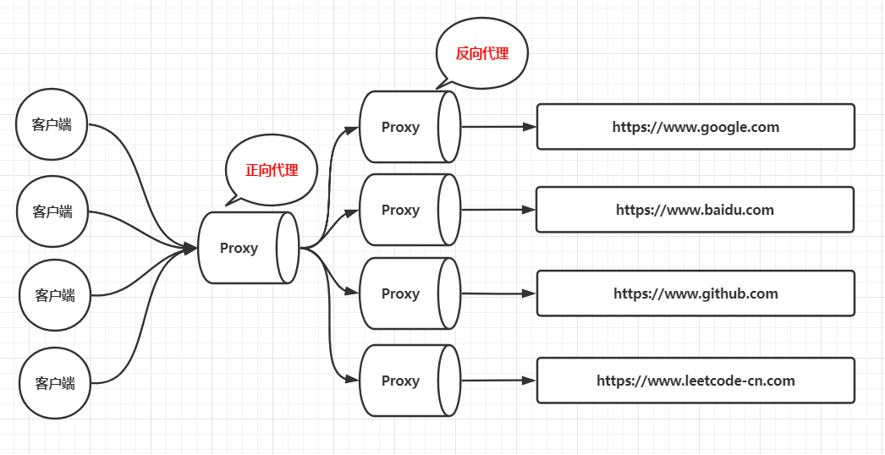

- 正向代理服务器的优点：
  - 提高访问速度：由于目标主机返回的数据会存放在代理服务器的硬盘中，因此下一次客户机再次访问相同的站点时，数据会直接从代理服务器硬盘中读取，起到了缓存的作用，尤其对于热门网站来说，能明显提高访问速度；
  - 防火墙作用：由于所有的客户机的请求都必须要通过代理服务器访问远程站点，因此可以在代理服务器上设限，过滤掉某些不安全信息。同时使用正向代理的用户，可以隐藏自己的真实`IP`，免受攻击。
  - 突破访问限制：使用代理服务器，可以实现科学上网。

# 正向代理

- 正向代理`Forward Proxy`，一个位于客户端和原始服务器之间的服务器，为了从原始服务器获取内容，客户端向代理发送了一个请求并制定目标（原始服务器），然后代理向原始服务器转发请求，并将从原始服务器获得的内容返回给客户端。只有客户端能使用正向代理。
- 之所以说正向代理可以隐藏客户端，是因为服务器只能接收到来自正向代理服务器中发出的请求，而并不知道真实发出该请求的客户端地址。
- 正向代理，代理客户端，服务端不知道实际发起请求的客户端。正向代理是架设在客户机和目标主机之间的。
- 正向代理的应用：
  - 访问原来无法访问的资源；
  - 用作缓存，加速访问速度；
  - 对客户端访问授权，上网进行认证；
  - 代理可以记录用户访问记录（上网行为管理），对外隐藏用户信息。

# 反向代理

- 反向代理`Reverse Proxy`，以代理服务器来接收`Internet`上的连接请求，然后将请求转发给内部网络上的服务器，并将从服务器上得到的结果通过代理服务器，返还给`Internet`上发出请求的客户端，此时代理服务器对外表现为一个反向代理服务器。
- 此前说的反向代理可以隐藏原始服务器，是因为服务器无论是直接对原始服务器发出请求还是使用正向代理服务器对原始服务器发出请求，都必须通过原始服务端所设置的反向代理服务器，该反向代理服务器会请求的不同，将请求分发至原始服务器。
- 反向代理，代理服务端，客户端不知道实际提供服务的服务端。反向代理是架设在服务器端的。
- 反向代理的应用：
  - 保护内网安全；
  - 负载均衡；
  - 缓存，减少服务器的压力。

# 负载均衡

- 负载均衡`Load Balance`建立在现有网络结构之上，它提供了一种廉价有效透明的方法扩展网络设备和服务器的带宽、增加吞吐量、加强网络数据处理能力、提高网络的灵活性和可用性。
- 负载均衡`Load Balance`的意思，就是分摊到多个操作单元上进行执行，例如`web`服务器、`ftp`服务器、企业关键应用服务器和其他关键任务服务器等，从而共同完成工作任务。

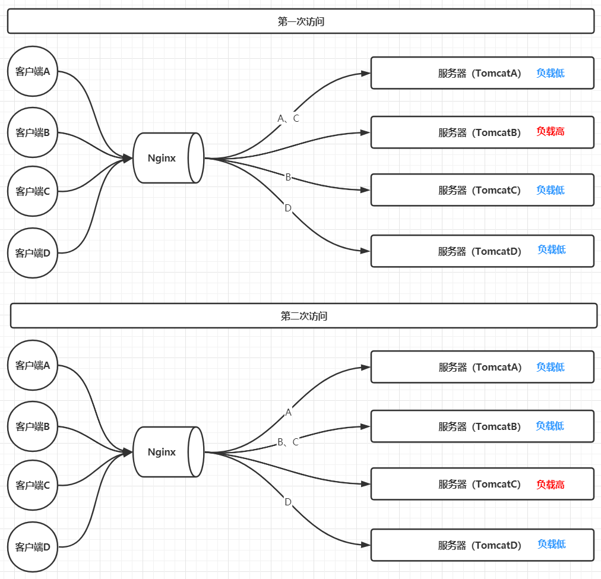

# 动静分离

- 动静分离是指在`web`服务器架构中，将静态页面与动态页面或者静态内容接口和动态内容接口分开不同系统访问的架构设计方法，进而提升整个服务访问性能和可维护性。

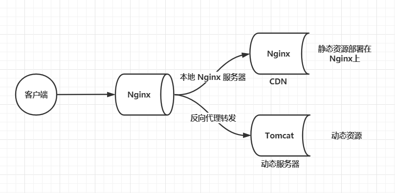

- 扩展：什么是`CDN`？
  - `CDN`的全程是`Content Delivery Network`，即内容分发网络。`CDN`是构建在现有网络基础之上的智能虚拟网络，依靠部署在各地的边缘服务器，通过中心平台负载均衡、内容分发、调度等功能模块，使用户就近获取所需内容，降低网络拥堵，提高用户访问响应速度和命中率。`CDN`的关键技术主要有内容存储和分发技术。

# 虚拟机上安装nginx

- 虚拟机上装`nginx`的复杂程度，取决于个人的细心程度，相比之下`docker`上直接拉取`nginx`镜像的方式，会方便很多。
- `nginx`的编译安装，需要同时使用到`openssl`、`zlib`和`pcre`的源码进行编译，因此需要获取它们的源码安装包，解压备用。
- 但实际上，主机上也是需要安装`openssl`、`zlib`和`pcre`三个软件的，似乎是因为`nginx`依赖这三个模块的源码进行编译，同时`nginx`的运行环境也需要这三个模块的支持。
- `pcre`库：
  - `PCRE`全程是`Perl Compatible Regular Expressions`，`Perl`兼容正则表达式。是有`Philip Hazel`开发的函数库，目前为很多软件所使用，该库支持正则表达式。它有`RegEx`演化而来，实际上，`Perl`正则表达式也是源自于`Henry Spencer`写的`RegEx`。
  - 如果我们在配置文件`nginx.conf`中使用了正则表达式，那么在编译`nginx`时，就必须要把`PCRE`库编译进入`nginx`，因为`nginx`的`HTTP`模块要靠它来解析正则表达式。
  - 如果你确认不会使用它，可以不需要安装它。`pcre-devel`是使用`PCRE`做二次开发时所需要的开发库，包括头文件等，这是`nginx`所必须使用的。
- `zlib`库：
  - `zlib`库用于对`HTTP`包的内容做`gzip`格式的压缩，如果我们在`nginx.conf`中配置了`gzip on`，并指定对于某些类型`content-type`的`HTTP`响应使用`gzip`来进行压缩以减少网络传输量，那么，在编译的时候必须要把`zlib`编译到`nginx`中。
  - 其中`zlib`是直接使用的库，`zlib-devel`是二次开发所需要的库（也就是nginx编译安装需要`zlib-devel`，`nginx`运行环境需要`zlib`）。
- `OpenSSL`开发库：
  - 有一些系统中会默认安装了`openssl`，但是不妨，可以再安装一次。
  - 如果我们的服务不只是要支持`HTTP`，还需要在更安全的`SSL`协议上传输`HTTP`，那么就需要拥有`OpenSSL`了。另外，如果我们想使用`MD5`、`SHA1`等散列函数，那么也需要安装它。
- 以上几个库，是完成`Web`服务器最基本功能所必需的。`nginx`是高度自由化的`Web`服务器，它的功能是由许多模块来支持的。而这些模块可根据我们的使用需求来定制，如果某些模块不需要使用则完全不必理会它。
- 同样，如果使用了某个模块，而这个模块使用了一些类似`zlib`或`OpenSSL`等的第三方库，那么就必须先安装这些软件。

## 1. 安装准备

- 下载`nginx`二进制编译安装包，下载地址：`http://nginx.org/download/nginx-1.18.0.tar.gz`
- 如果使用预编译安装，则不需要下载以下三个模块依赖型包。
- 模块依赖型`nginx`需要依赖以下三个包：
  1. `ssl`功能需要`openssl`库，下载地址：`https://www.openssl.org/source/openssl-fips-2.0.16.tar.gz`
  2. `gzip`模块需要`zlib`库，下载地址：`http://zlib.net/zlib-1.2.11.tar.gz`
  3. `rewrite`模块需要`pcre`库，下载地址：`https://ftp.pcre.org/pub/pcre/pcre-8.44.tar.gz`
- 可以使用下载工具`wget`下载到主机，也可以在电脑端下载完毕后，使用`xftp`将编译安装包放置于`CentOS7`目录，我这里选择`root`的家目录`/root`：


## 2. 安装选择

- 可以选择使用`yum`安装或者编译安装，使用`yum`安装的灵活性没有编译安装好，但是`yum`安装要比编译安装要来得快捷简便。
- 使用`yum`前最好更新一下`yum`源，否则可能出现下载缓慢等等问题。

### a. 预编译安装

- 也就是使用`yum`安装，`yum`安装是使用已经编译好的二进制包进行安装。

- 使用以下命令安装依赖，注意，仍需要下载`nginx`源码包进行编译安装：

```reStructuredText
# 安装必要环境，一定一定需要安装！！！
[root@localhost ~]# yum install -y make gcc-c++ libtool

# 安装openssl、zlib、pcre
[root@localhost ~]# yum install openssl openssl-devel zlib zlib-devel pcre pcre-devel -y

# 安装iginx
[root@localhost ~]# tar -zxvf nginx-1.18.0.tar.gz
[root@localhost ~]# cd nginx-1.18.0
[root@localhost nginx-1.18.0]# ./configure --prefix=/usr/local/nginx --with-http_ssl_module
[root@localhost nginx-1.18.0]# make
[root@localhost nginx-1.18.0]# make install
```

### b. 编译安装

- 示例中，将四个压缩包放置于家目录`/root`下，进行安装（必须严格按照以下步骤，以免出错）：

```reStructuredText
# 安装必要环境，一定一定需要安装！！！
[root@localhost ~]# yum install -y make gcc-c++ libtool

# 安装openssl
[root@localhost ~]# tar -zxvf openssl-fips-2.0.16.tar.gz
[root@localhost ~]# cd openssl-fips-2.0.16
[root@localhost openssl-fips-2.0.16]# ./config --prefix=/usr/local/openssl-fips
[root@localhost openssl-fips-2.0.16]# make
[root@localhost openssl-fips-2.0.16]# make install

# 安装zlib
[root@localhost ~]# tar -zxvf zlib-1.2.11.tar.gz
[root@localhost ~]# cd zlib-1.2.11
[root@localhost zlib-1.2.11]# ./configure --prefix=/usr/local/zlib
[root@localhost zlib-1.2.11]# make
[root@localhost zlib-1.2.11]# make install

# 安装pcre
[root@localhost ~]# tar -zxvf pcre-8.44.tar.gz
[root@localhost ~]# cd pcre-8.44
[root@localhost pcre-8.44]# ./configure --prefix=/usr/local/pcre
[root@localhost pcre-8.44]# make
[root@localhost pcre-8.44]# make install

# 安装nginx
[root@localhost ~]# tar -zxvf nginx-1.18.0.tar.gz
[root@localhost ~]# cd nginx-1.18.0
[root@localhost nginx-1.18.0]# ./configure --prefix=/usr/local/nginx --with-pcre=../pcre-8.44 --with-zlib=../zlib-1.2.11 --with-openssl=../openssl-fips-2.0.16
[root@localhost nginx-1.18.0]# make
[root@localhost nginx-1.18.0]# make install
```

- 安装完毕后，可前往安装目录`/usr/local/nginx`查看，其中`/usr/local/nginx/sbin`目录下放置了启动程序`nginx`：

```reStructuredText
# pwd命令显示当前所在目录的路径
[root@localhost sbin]# pwd && ll
/usr/local/nginx/sbin
total 3892
-rwxr-xr-x. 1 root root 3983560 Oct 29 10:53 nginx
```

## 3. 添加环境变量

- 安装完成后，推荐将`nginx`添加到`Linux`的环境变量中，方便访问：

```bash
# 编辑profile文件，添加环境变量
vim /etc/profile
# 在profile文件末位，添加以下代码
export PATH=$PATH:/usr/local/nginx/sbin
# 使用命令 :wq （write & quit）写入并退出
# 执行source命令使配置生效
source /etc/profile
# 可使用以下命令检查环境变量是否添加成功，此命令将显示所有的系统环境变量
echo $PATH
```

- 添加环境变量后，可以在任意目录使用`nginx`命令，而不需要每次都进入到`/usr/local/nginx/sbin`目录中调用命令：

```reStructuredText
[root@localhost pcre-8.44]# nginx -h
nginx version: nginx/1.18.0
Usage: nginx [-?hvVtTq] [-s signal] [-c filename] [-p prefix] [-g directives]

Options:
  -?,-h         : this help
  -v            : show version and exit
  -V            : show version and configure options then exit
  -t            : test configuration and exit
  -T            : test configuration, dump it and exit
  -q            : suppress non-error messages during configuration testing
  -s signal     : send signal to a master process: stop, quit, reopen, reload
  -p prefix     : set prefix path (default: /usr/install/nginx/)
  -c filename   : set configuration file (default: conf/nginx.conf)
  -g directives : set global directives out of configuration file
```

## 4. 基本操作命令

- 以下是基本的操作命令，通过`nginx -h`可以查看使用帮助，大致内容也是一致的：

```bash
# 使用以下命令可以查看nginx是否在运行
ps -ef | grep nginx

# 启动服务
nginx
# 退出服务
nginx -s quit
# 强制关闭服务
nginx -s stop
# 重载服务
nginx -s reload
# 验证配置文件
nginx -t
# 使用配置文件
nginx -c conf/nginx.conf
# 使用帮助
nginx -h
```

## 5. 开放防火墙端口

- `nginx`的默认端口是`80`，`CentOS7`默认防火墙是开启状态的，如果访问不到`nginx`，需要检查防火墙设置：

```bash
# 查看防火墙所有开放的端口
firewall-cmd --zone=public --list-ports
# 开放80端口
firewall-cmd --zone=public --add-port=80/tcp --permanent
# 关闭80端口
firewall-cmd --zone=public --remove-port=80/tcp --permanent
# 使开放/关闭端口操作立即生效
firewall-cmd --reload
```

- 开放端口后，重新启动`nginx`即可：

```bash
nginx -s reload
```

- 访问成功：

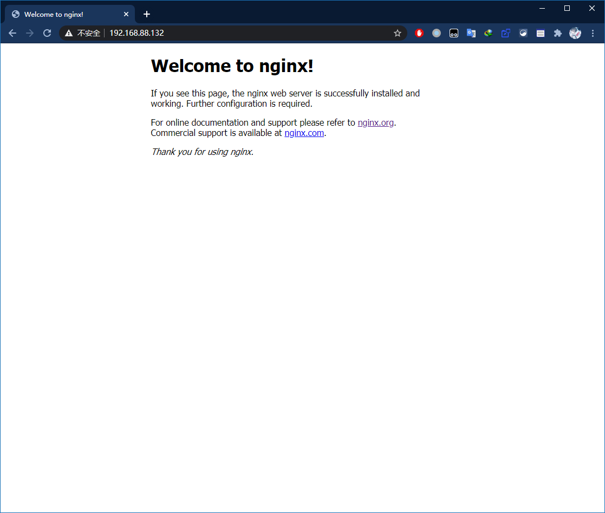

# docker上安装nginx

- 此前虚拟机上安装`nginx`的过程可以十分复杂，如果使用的操作系统部署`CentOS`，而是其他Linux发行版，可能会出现各种奇奇怪怪的错误。更为推荐的是，在`docker`上安装`nginx`，一条命令拉取`pull`，即安装完毕。

## 1. 安装准备

- 只需要在你的主机上安装docker即可，下一步开始安装。

## 2. 拉取安装

- 使用一下命令，从`dockerhub`中搜索`nginx`的镜像`image`：

```bash
docker search nginx
```

- 其中第一个就是我们要获取的`nginx`镜像：

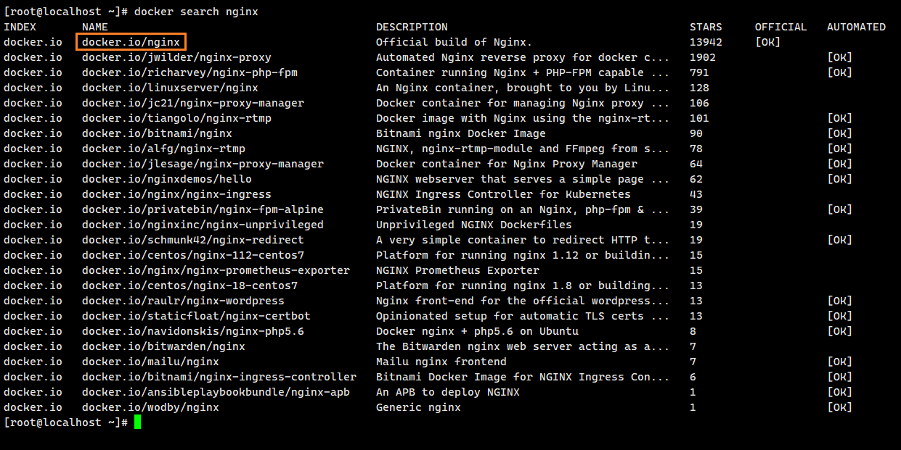

- 使用以下命令获取最新的`nginx`镜像：

```bash
docker pull nginx:latest
```

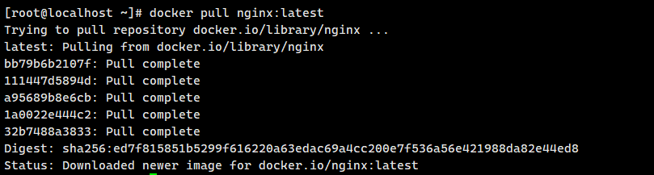

- 拉取完毕后，查看`nginx`镜像`image`是否已经存在于`docker`中：

```bash
docker images
```

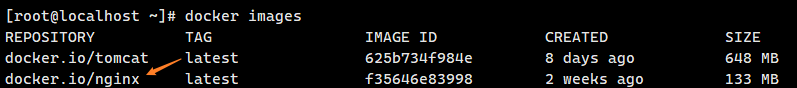

## 3. 配置运行

- 对于`docker`来说，所有的程序都运行在容器`container`中，使用`docker run`命令，指定镜像`image`与端口`port`映射规则，即可为该镜像创建一个独立于宿主机的容器。
- 如果你需要为`nginx`单独定制你的配置，你首先需要知道`nginx`配置文件在容器中的位置，其次你将有三种选择：
  1. 仅修改目标配置文件，创建容器后，进入容器的`bash`界面，手动修改容器配置文件，退出容器`bash`后重启容器；
  2. 拷贝容器中配置文件，自定义配置后，将修改后的文件重新拷贝回容器中，重启容器；
  3. 创建目录映射，将目标镜像的配置文件目录拷贝到宿主机上，在创建目标镜像的容器时，使用选项`-v`将该宿主机上的配置文件目录挂载到容器中对应的配置文件目录上。
- 我们以负载均衡为例子，分别实验以上三种方式的配置。（注：宿主机端口不要使用特殊的端口，会造成`tomcat`不可访问）

|  框架  |               服务器地址                | 宿主机端口:容器端口 | 防火墙端口状态 | tomcat部署环境 |
| :----: | :-------------------------------------: | :-----------------: | :------------: | :------------: |
| nginx  |             192.168.88.131              |      7743:5740      |    7743关闭    |     docker     |
| tomcat |             192.168.88.132              |  8001（无docker）   |    8001开启    |  CentOS虚拟机  |
| tomcat | 192.168.88.131(宿主机)/172.17.0.3(容器) |      7003:1064      |    7003关闭    |     docker     |

- 需要实现的效果是，当浏览器键入`访问地址`，可以通过`nginx`负载均衡访问到`真实地址`中的任意一个：

|                  访问地址                   |                  真实地址                   |
| :-----------------------------------------: | :-----------------------------------------: |
| http://192.168.88.131:7743/hello/index.html | http://192.168.88.131:7003/hello/index.html |
| http://192.168.88.131:7743/hello/index.html | http://192.168.88.132:8001/hello/index.html |

- `nginx`和`tomcat`相关配置目录如下：

|  框架  |   关键配置目录    |                         关键配置文件                         |
| :----: | :---------------: | :----------------------------------------------------------: |
| nginx  |    /etc/nginx     |    /etc/nginx/nginx.conf; /etc/nginx/conf.d/default.conf     |
| tomcat | /usr/local/tomcat | /usr/local/tomcat/conf/server.xml; /usr/local/tomcat/webapps |

- 需要在`tomcat`服务器`192.168.88.132:8001`的`/webapps`目录下，创建一个名为`/hello`的目录，并创建页面`index.html`用于测试，以下为直接访问时的效果图：


- 有人会问，那既然都可直接访问了，为什么你还有用`nginx`进行负载均衡，用户直接键入这个访问网址，你的负载均衡岂不是没有用了吗？答案是，用户并无法直接访问。我们的实验是基于局域网网络的，实际的场景是用户通过广域网访问，经由`DNS`解析系统，解析到我们服务器的公网`IP:port`之后，再经由本地路由器，继而才能解析到目标局域网内的`IP:port`。
- 实际上位于`192.168.88.132:8001`处的`tomcat`服务器，作为负载均衡的其中一个`upstream server`，它是不会在本地路由上被进行公网映射的。只有被映射到公网的局域网`ip:port`会被访问到，也就是说，局域网内的其他主机，即使开放了端口，如果没有在本地路由上进行公网内网映射，那么它只允许被局域网内的其他主机访问。

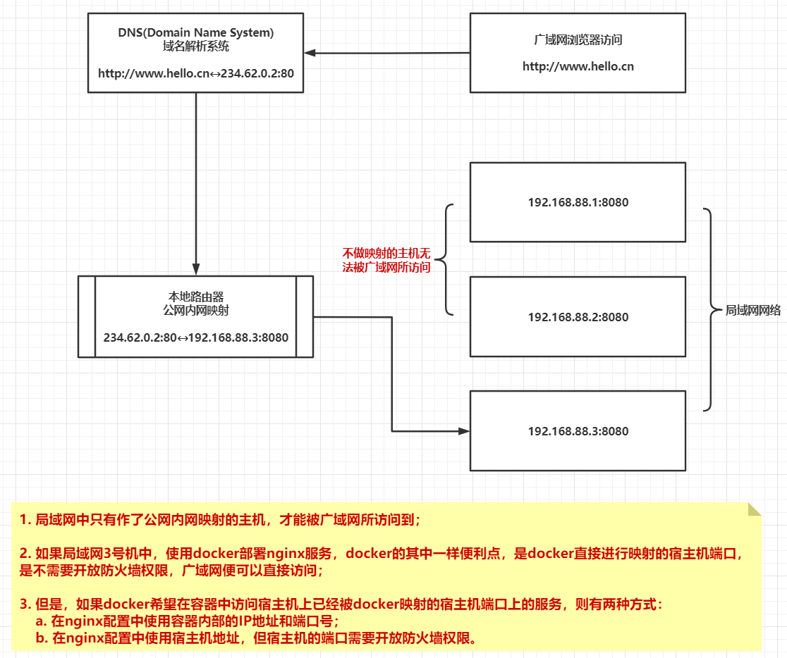

- 因此实际上我们做公网映射的内网`IP:port`地址只有`nginx`服务器的地址：`192.168.88.131:7743`。用户通过域名访问，域名经过`DNS`解析后得到了我们服务器的公网`IP:port`，假设为`xxx.xxx.xxx.xxx:80`。
- 那么该公网`IP:port`将经过服务提供商的本地路由器，进一步解析到`nginx`服务器的地址`192.168.88.131:7743`，由于只能解析到`nginx`服务器的地址，因此用户并不可能直接访问到任何一台部署在局域网中的`tomcat`服务器。
- 最后扩展一个腾讯云或各类其他的云服务器，当你购买了一台云服务器之后，你就相当于拥有了一台拥有公网IP的主机了。你可以在上面部署你的服务，例如`tomcat`服务器，默认端口为`8080`。当`tomcat`服务开启之后，用户可以通过广域网访问公网`IP`加`8080`端口，即可访问到你的服务器。
- 但就腾讯云来说，其对所有的公网端口都做了映射，和一般私人建站不一样。私人建站你可以选择公网的任意端口和内网指定主机的任意端口做映射，但在腾讯云中目前没有找到自定义端口映射的选项。因此，如果你将项目部署在腾讯云或其他类型的云服务器上，如果是`http`协议，最好将`tomcat`或`docker`的端口设置为`80`，如果是`https`协议的话，就将端口设置为`443`。
- 回到示例中，备配置另一台`tomcat`服务器，我们将在`docker`中配置此tomcat服务器，同时在同一个`docker`中配置`nginx`服务器，使用同样的方式获取`dockerhub`中的`tomcat`镜像，并同时使用以下命令，开启`tomcat`容器和`nginx`容器：

```bash
# 端口42为宿主机端口，端口1064为容器内端口
docker run --name normal-tomcat -p 7003:1064 -d tomcat
# 端口7743为宿主机端口，端口5720为容器内端口
docker run --name normal-nginx -p 7743:5720 -d nginx
```

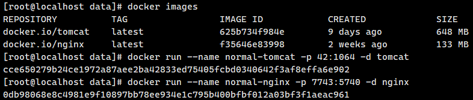

- 使用命令查看所有容器：

```bash
docker ps -a
```

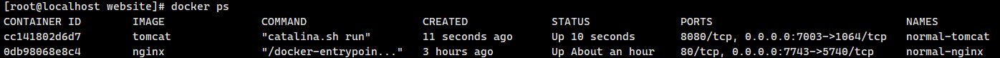

- 可以看到容器列表中的`PORTS`列显示了两个参数，其中格式`port/tcp`是容器内已开放监听的端口，而格式`0.0.0.0:port`的端口是指宿主机监听的端口。
- 以`tomcat`为例，容器中`tomcat`服务已经启动了，并运行在`8080/tcp`端口上，但我们并没有使用`docker`映射到该`8080/tcp`端口，而是使用了宿主机的`7003`端口去映射容器的`1064`端口。因此`PORTS`列显示了两种信息。因此我们需要修改`tomcat`中的默认运行端口为`1064`，并重启`normal-tomcat`容器。
- 采用第一种，进入容器`bash`界面修改容器内部配置文件的方式，我们修改`tomcat`的默认运行端口为`1064`，代码为：

```bash
# 进入到容器内的bash中
docker exec -it normal-tomcat bash
# 切入到tomcat的配置目录/conf下，我们需要修改其中的server.xml中关于默认端口的信息
cd /conf
# 但由于容器初始化的bash中既不包含vi也不包含vim，而且使用的是apt软件管理器，因此需要首先安装一下vim
# 需要先更新软件列表，巨慢警告
apt update
# 然后安装vim
apt install -y vim
# 使用vim编辑server.xml修改默认端口为1064
vim server.xml
# 退出容器bash
exit
# 重启normal-tomcat
docker restart normal-tomcat
```

- 同时我们在`normal-tomcat`中的`/webapps`目录下创建目录和文件`/hello/index.html`，打开浏览器键入`docker`宿主机地址及宿主机端口，并加上虚拟目录路径，即`192.168.88.131:7003/hello/index.html`，访问效果如下：


- 与虚拟机上部署`tomcat`不一样的是，运行`tomcat`容器的`docker`宿主机端口是`7003`，不需要开放`7003`端口的防火墙权限，即可通过宿主机地址加端口号访问到`tomcat`容器中的网页。如果是在虚拟机上部署的`tomcat`服务器，假如运行的端口是`7003`，那么是必须要开放`7003`端口的防火墙权限，才能通过地址加端口访问到`tomcat`服务器。
- 采用第二种方法，我们拷贝nginx容器中的关键配置文件，增加负载均衡配置之后，拷贝并覆盖nginx容器中的配置文件，最后重启并查看运行效果，拷贝配置文件的代码为：

```bash
docker cp normal-nginx:/etc/nginx/nginx.conf ./
docker cp normal-nginx:/etc/nginx/conf.d/default.conf ./
```

- 修改`nginx.conf`添加`upstream`，如下：

```bash
user  nginx;
worker_processes  1;

error_log  /var/log/nginx/error.log warn;
pid        /var/run/nginx.pid;


events {
    worker_connections  1024;
}


http {
    include       /etc/nginx/mime.types;
    default_type  application/octet-stream;

    log_format  main  '$remote_addr - $remote_user [$time_local] "$request" '
                      '$status $body_bytes_sent "$http_referer" '
                      '"$http_user_agent" "$http_x_forwarded_for"';

    access_log  /var/log/nginx/access.log  main;

    sendfile        on;
    #tcp_nopush     on;

    keepalive_timeout  65;

    #gzip  on;
	
	#添加的内容为upstream
    upstream normal-server {
    	#172.17.0.2:1064为容器内的地址，你可以把docker容器理解为一个局域网的环境，每个容器都有自己的IP
    	#如果需要配置为192.168.88.131:7003，需要在宿主机的防火墙开放7003端口
    	server 172.17.0.2:1064;
    	#192.168.88.132:8001为另一个tomcat地址，该虚拟机上的防火墙已经开放了8001端口
    	server 192.168.88.132:8001;
    }

    include /etc/nginx/conf.d/*.conf;
}
```

- 修改default.conf，添加以下内容：

```bash
server {
	#修改端口为5720
    listen       5740;
    listen  [::]:5740;
    server_name  localhost;

    #charset koi8-r;
    #access_log  /var/log/nginx/host.access.log  main;

    location / {
    	#添加proxy_pass
    	proxy_pass	http://normal-server;
        root   /usr/share/nginx/html;
        index  index.html index.htm;
    }

    #error_page  404              /404.html;

    # redirect server error pages to the static page /50x.html
    #
    error_page   500 502 503 504  /50x.html;
    location = /50x.html {
        root   /usr/share/nginx/html;
    }

    # proxy the PHP scripts to Apache listening on 127.0.0.1:80
    #
    #location ~ \.php$ {
    #    proxy_pass   http://127.0.0.1;
    #}

    # pass the PHP scripts to FastCGI server listening on 127.0.0.1:9000
    #
    #location ~ \.php$ {
    #    root           html;
    #    fastcgi_pass   127.0.0.1:9000;
    #    fastcgi_index  index.php;
    #    fastcgi_param  SCRIPT_FILENAME  /scripts$fastcgi_script_name;
    #    include        fastcgi_params;
    #}

    # deny access to .htaccess files, if Apache's document root
    # concurs with nginx's one
    #
    #location ~ /\.ht {
    #    deny  all;
    #}
}
```

- 重新将文件拷贝回容器中并重启容器`normal-nginx`：

```bash
docker cp ./nginx.conf normal-nginx:/etc/nginx/
docker cp ./default.conf normal-nginx:/etc/nginx/conf.d/
docker restart normal-nginx
```

- 使用浏览器访问`nginx`服务器`192.168.88.131:7743/hello.index.html`，此时已经实现了两个`tomcat`服务器的负载均衡：

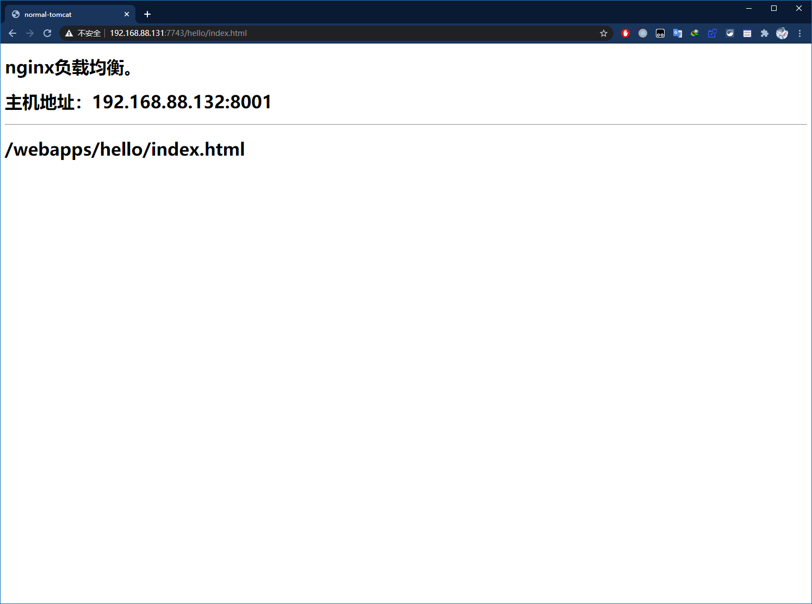

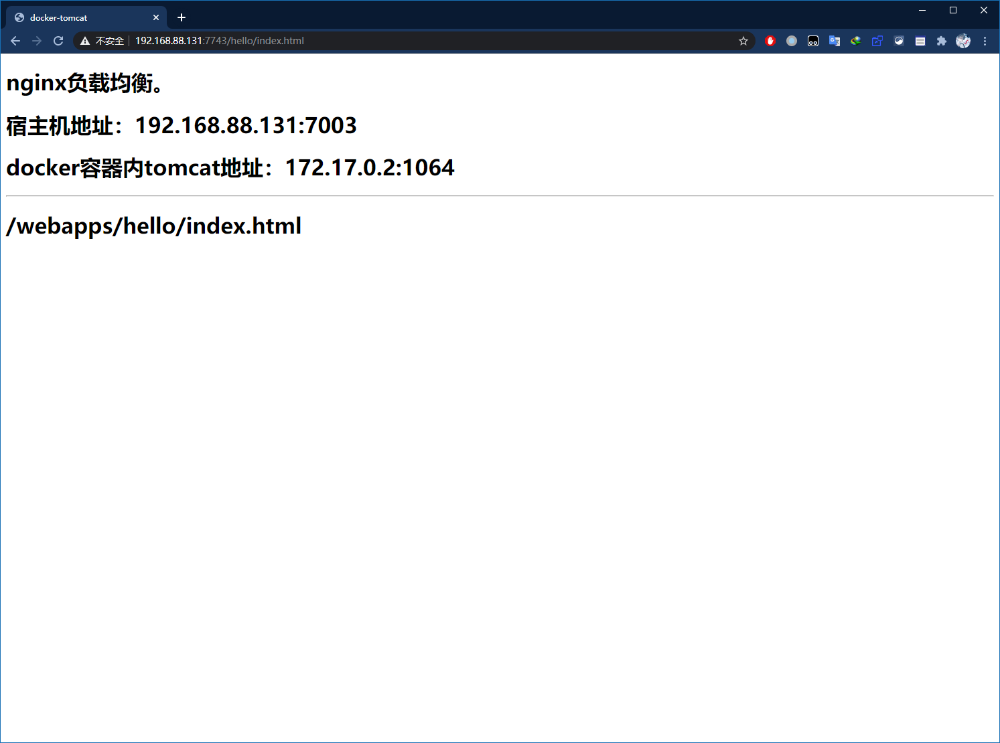

- 此时`192.168.88.132`服务器上的`8001`端口是开放状态的，而该`nginx`地址`192.168.88.131:7743`将作为实际项目部署的访问服务器，被映射到公网`IP`上，所有的用户通过域名访问到公网`IP`，最终只能访问到`nginx`服务地址，因此实际上不需要担心局域网中其他主机端口是否开放权限的问题。
- 至此我们完成了前两种修改docker中容器配置的方法展示，最为推荐的第三种方法，挂载目录，我们将在动静分离的章节，使用`docker`中的`nginx`作为示范。

# nginx配置实例

## 1. 反向代理

### a. 准备工作

- 在`Linux`虚拟机上部署一个`tomcat`服务器，使`nginx`成为反向代理服务器，通过访问`nginx`反向代理服务器，可以实现间接访问`tomcat`主页。
- 首先需要在`Linux`虚拟机上，部署一个`tomcat`的服务器，直接从官网下载压缩包，解压即可，同时进入`tomcat`目录中，启动`tomcat`服务器：

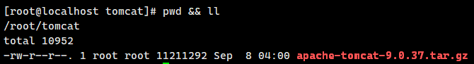

- 使用`tar -zxvf`命令解压，并进入`/bin`目录启动`tomcat`服务器，默认端口`8080`：

```bash
# -zxvf ：快速记忆，中(z)心(x)伏(volt)法(f)
tar -zxvf apache-tomcat-9.0.37.tar.gz
# pwd : print work directory / && ：可以顺序执行前后的bash命令
pwd && ./bin/startup.sh
```

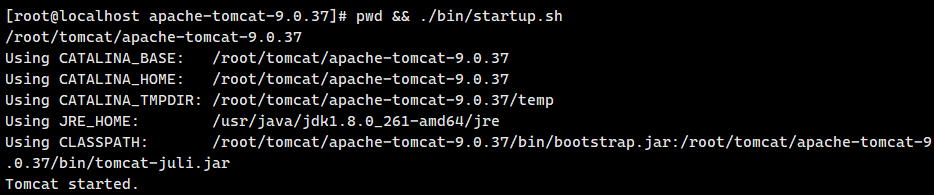

- 如果未开启虚拟机`8080`端口，访问`tomcat`服务器将失败，使用以下命令开放防火墙`8080`端口：

```bash
# 查看防火墙所有开放的端口
firewall-cmd --zone=public --list-ports
# 开放8080端口
firewall-cmd --zone=public --add-port=8080/tcp --permanent
# 使开放/关闭端口操作立即生效
firewall-cmd --reload
```

- 访问`tomcat`服务器：

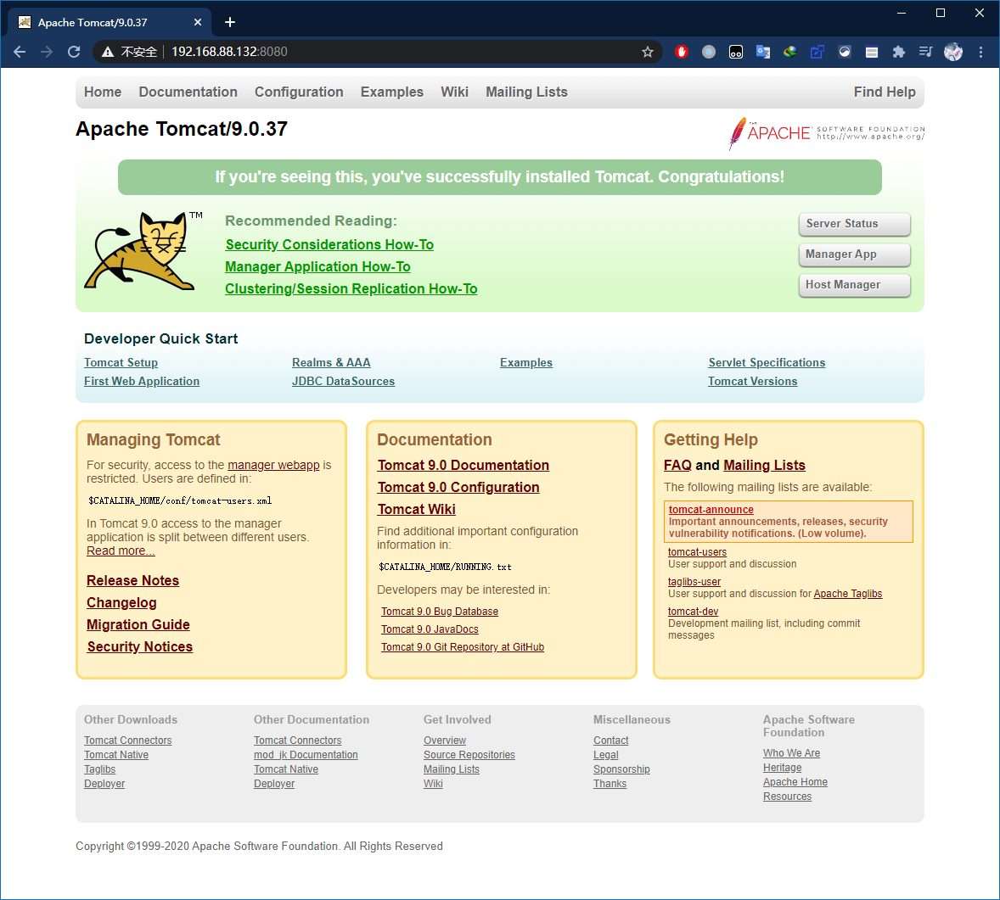

- 由于我们需要实现通过`nginx`反向代理访问`tomcat`服务器的功能，因此此处可以将从防火墙中关闭`8080`端口，即不开放`8080`端口，以试验代理效果。

```bash
# 关闭8080端口
firewall-cmd --zone=public --remove-port=8080/tcp --permanent
# 使开放/关闭端口操作立即生效
firewall-cmd --reload
```

### b. 实现效果

- 第一个示例，将使用nginx配置一个最简单的反向代理，客户端通过键入反向代理地址进行请求，服务器内部通过反向代理，间接访问到真实的tomcat服务器，访问过程如下图所示：


- 第二是示例，将使用nginx配置一个可以基于访问路径的不同，而选择跳转到不同tomcat服务器的反向代理，访问过程如下图所示：

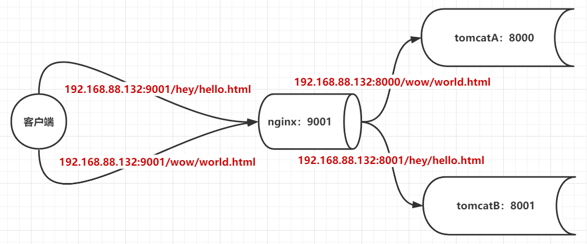

### c. nginx实现

#### ⅰ. 示例一

- 流程图如下：


- 修改`nginx`配置文件`nginx.conf`，该文件位于目录`/nginx/conf`下，需要修改或增加的字段有三处：
  - `listen`：表示`nginx`反向代理服务器的监听端口；
  - `server_name`：表示`nginx`反向代理服务器的访问地址；
  - `proxy_pass`：表示真实服务器地址，请求将被转发至`proxy_pass`中配置的服务器上。

```bash
server {
        listen       80; # nginx反向代理端口，默认端口是80
        server_name  localhost; # nginx反向代理地址，此处可以是localhost、127.0.0.1或本地主机真实地址

        #charset koi8-r;

        #access_log  logs/host.access.log  main;

        location / {
            root   html;
	    	proxy_pass	http://localhost:8080; # tomcat服务器地址，此处可以是localhost、127.0.0.1或本地主机真实地址
            index  index.html index.htm;
        }
```

- 所以图上的配置是：当客户端访问`localhost:80`时，会自动将请求转发至`localhost:8080`上，也就是`tomcat`服务器上。
- 使用以下命令重新加载`nginx`：

```bash
nginx -s reload
```

- 浏览器中键入`nginx`反向代理服务器的地址并指定端口为`80`，测试效果如下：

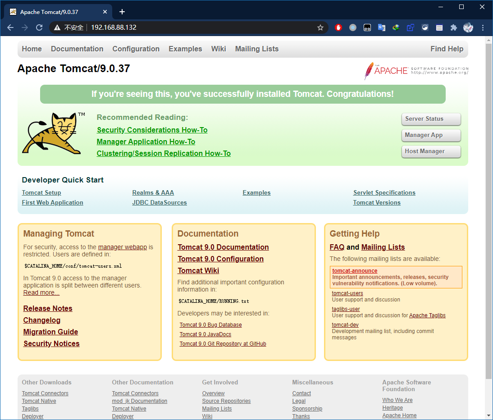

- 小扩展：`Tomcat`服务器中的主页指向的页面是`/webapps/ROOT/index.jsp`。

#### ⅱ. 示例二

- 流程图如下：


- 本示例需要启动两个`tomcat`服务器，且端口分别为`8000`和`8001`，修改`tomcat`中的`/conf/server.xml`文件，以更改`tomcat`服务器的默认端口，示例中使用的`tomcat`版本为`9`，只需要更改以下代码中的三个端口即可：

```xml
# Server port的默认端口为"8005"，自定义修改成其它端口，不要和虚拟机中其它的Tomcat服务器配置冲突即可
<Server port="8006" shutdown="SHUTDOWN">
    # Connector port的默认端口为8080，自定义修改成其它端口，不要和虚拟机中其它的Tomcat服务器配置冲突即可
    # redirectPort的默认端口为8443，自定义修改成其他端口，不要和虚拟机中其它的Tomcat服务器配置冲突即可
    <Connector port="8000" protocol="HTTP/1.1" # 默认端口为
               connectionTimeout="20000"
               redirectPort="8444" />
</Server>
```

- 如果需要测试`tomcat`服务器是否启动，需要在防火墙开放`connector port`的访问权限。但由于是通过nginx进行反向代理，不需要在防火墙处开放`tomcat`服务器端口的权限，只需要开放`nginx`监听端口的权限即可。
- 同时为了对比测试，我们在`tomcatA`和`tomcatB`中分别创建了`/wow/world.html`和`/hey/hello.html`目录与文件，与此同时在`/wow`和`/hey`目录下创建了一个同名但内容不一致的`index.html`文件：

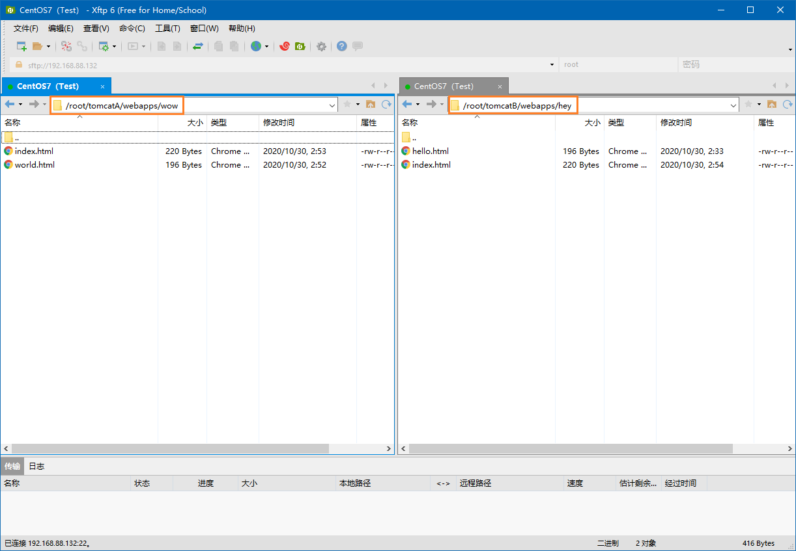

- 在`tomcat`环境准备完毕后，需要修改`nginx`配置文件`nginx.conf`，在http模块中添加一个新的server模块：
  - `location`语法：`location [=|~|~*|^~] /uri/ { … }`
  - `/`：通用匹配，任何请求都会匹配到；
  - `=`：表示精确匹配；
  - `^~`：表示uri以某个常规字符串开头，理解为匹配url路径即可；
  - `~`：表示区分大小写的正则匹配；
  - `~*`：表示不区分大小写的正则匹配；
  - `!~`或`!~*`：表示区分大小写的不进行匹配，及不区分大小写的不进行匹配。

```shell
server {
    listen       9001;
    server_name  localhost;

    location ~ /wow/ {
    proxy_pass   http://127.0.0.1:8000;
    }

    location ~ /hey/ {
    proxy_pass   http://127.0.0.1:8001;
	}
}
```

- 确认防火墙开启了`nginx`反向代理服务器`9001`监听端口的权限之后，启动`tomcatA`和`tomcatB`，同时启动`nginx`，在浏览器中进行测试。

- 访问`niginx`服务器，可以顺利连通，其中端口号为`9001`：

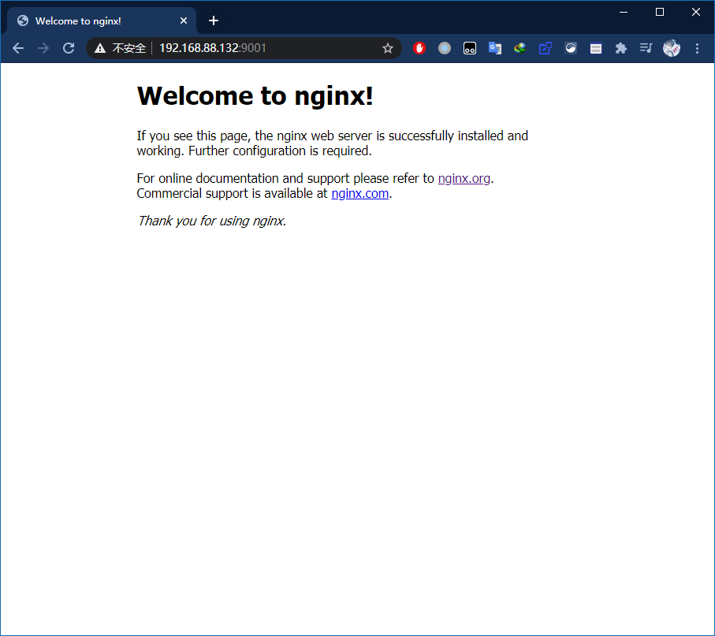

- 通过反向代理，访问`tomcatA`和`tomcatB`中的`index.html`，如下所示：

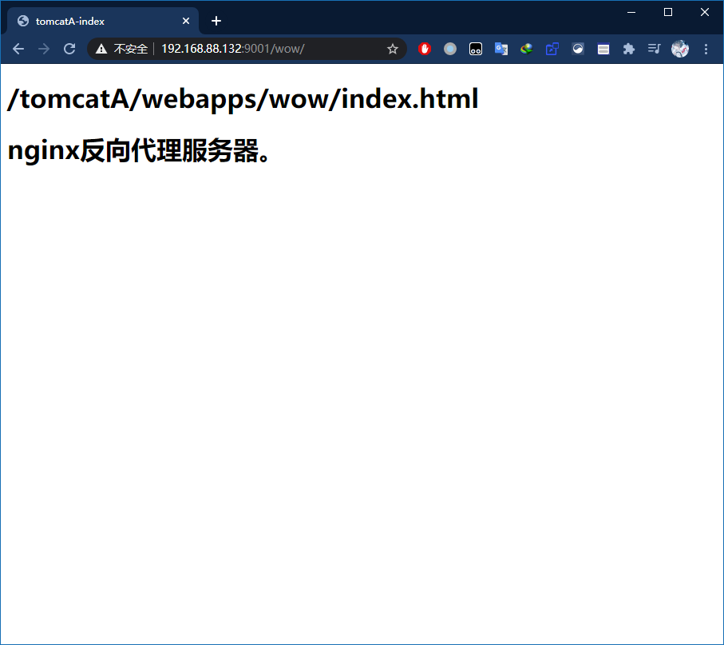

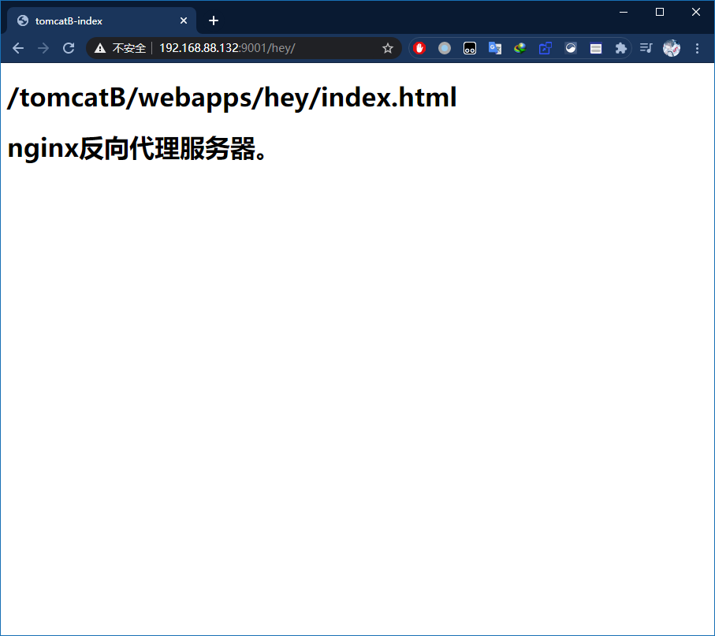

- 通过反向代理，访问`tomcatA`和`tomcatB`中的`/wow/world.html`和`/hey/hello.html`，如下所示：

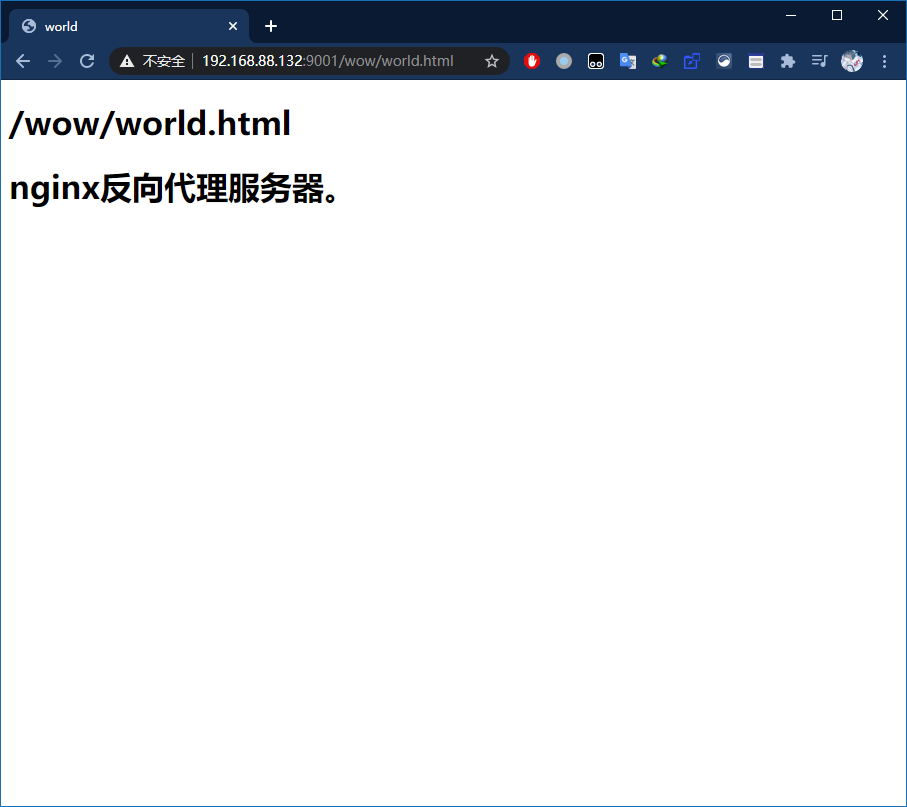


- 至此，我们实现了使用`nginx`对多个`tomcat`服务器的反向代理配置。

## 2. 负载均衡

- 想象一下，如果你写了某个网页，开始的时候，该网页的访问量不是很大，服务器中部署了一个`tomcat`，该服务器完全可以承载目前网页的访问量。
- 但慢慢地你的网页开始受欢迎，访问量日益增大，渐渐超过了服务器所能承受的范围，此时该怎么办呢？增加一台服务器需要怎样操作呢？
- 使用`nginx`中的负载均衡即可解决这个问题。如果你有两台以上的服务器，`nginx`可以将用户的请求通过一定的规则分布到你的各个服务器上，解决了服务器负载不均衡的情况。
- 基本配置流程可以参考`docker上安装nginx`中的`配置运行`章节。

- 负载均衡的分配方式（策略）：
  1. `轮询（默认）`：每个请求按时间逐一分配到不同的后端服务器，如果后端服务器挂掉了，能自动剔除；
  2. `权重（weight）`：权重默认为`1`，权重越高被分配的客户端越多；
  3. `ip_hash`：每个请求按访问`ip`的`hash`结果分配，每个访客固定访问一个后端服务器，可以解决`session`问题；
  4. `fair（第三方）`：按后端服务器的响应时间来分配请求，响应时间短的优先分配。

### a. 轮询

- 轮询是默认的负载均衡方式，配置方式如下：

```bash
upstream myserver {
    	server 172.17.0.2:1064;
    	server 192.168.88.132:8001;
}
```

### b. 权重

- 根据自定义的权重分配，配置方式如下：

```bash
upstream myserver {
    	server 172.17.0.2:1064 weight=1;
    	server 192.168.88.132:8001 weigth=3;
}
```

### c. 地址哈希

- ip_hash，根据用户的IP地址进行散列，用户如果IP不变，将访问到同一个后端服务器，解决了session跨域的问题，配置方式如下：

```bash
upstream myserver {
		ip_hash;
    	server 172.17.0.2:1064;
    	server 192.168.88.132:8001;
}
```

### d. 公平

- 响应速度最快的后端服务器优先被分配请求，配置方式如下：

```bash
upstream myserver {
    	server 172.17.0.2:1064;
    	server 192.168.88.132:8001;
    	fair;
}
```

## 3. 动静分离

- 动静分离可以理解为使用`nginx`作为静态资源服务器，在`docker`中的`nginx`容器中，路径`/usr/share/nginx/html`中可以放置静态资源，进入该目录，可以发现两个页面，分别是`nginx`的欢迎页面和`nginx`的错误页面。
- 为了使用第三种将目录挂载至容器内，我们需要首先使用以下命令，不太优雅地拷贝出容器中的关键配置目录和静态资源目录：

```bash
# 创建一个nginx容器，只用来拷贝目录
docker run --name myNginx -d nginx
# 拷贝静态资源目录html
docker cp myNginx:/usr/share/nginx/html ./
# 拷贝配置目录，其中包含了nginx.conf和default.conf
docker cp myNginx:/etc/nginx ./
# 拷贝完毕，停止容器并删除
docker stop myNginx && docker rm myNginx
```

- 预先拷贝出容器的配置目录，并在创建容器的时候使用参数`-v`进行目录映射（挂载），之后如果你需要对容器的配置进行修改，直接修改宿主机上已经进行映射的目录即可，目标容器重启后，配置就能同步到容器中。
- 使用目录映射，免去了进入容器`bash`修改配置文件，或使用`docker cp`将修改好的配置文件拷贝到容器中的繁琐操作。
- 现在，你可以进入配置目录中，提前将`default.conf`中`nginx`的默认监听端口改成其他的端口或配置反向代理，也可以提前在`nginx.conf`中配置使用nginx控制服务器的负载均衡了。
- 注意，容器的端口映射一旦创建，就不能更改，因此`nginx`的监听端口配置必须要要和容器的端口一致。
- 修改`default.conf`，监听端口更改为`1128`，配置容器中的`/html`为静态资源目录，并在拷贝出来的`/html`目录中放置用于测试的静态资源：一张图片、一个页面。
- 测试图片容器内完整路径：`/usr/share/nginx/html/images/hello.jpg`
- 测试页面容器内完整路径：`/usr/share/nginx/html/pages/nginx.html`
- 映射前宿主机目录结构如下：

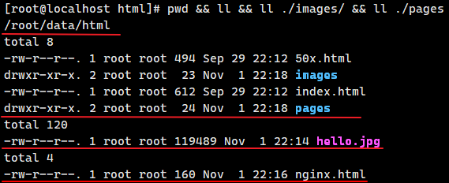

- 修改`default.conf`，增加两个`location`块，并修改端口为`1128`：

```bash
server {
    listen       1128;
    listen  [::]:1128;
    server_name  localhost;

    #charset koi8-r;
    #access_log  /var/log/nginx/host.access.log  main;

    location / {
        root   /usr/share/nginx/html;
        index  index.html index.htm;
    }

    location /images {
    	root	/usr/share/nginx/html;
    	autoindex on;
    }

    location /pages {
    	root	/usr/share/nginx/html;
    }

    #error_page  404              /404.html;

    # redirect server error pages to the static page /50x.html
    #
    error_page   500 502 503 504  /50x.html;
    location = /50x.html {
        root   /usr/share/nginx/html;
    }

    # proxy the PHP scripts to Apache listening on 127.0.0.1:80
    #
    #location ~ \.php$ {
    #    proxy_pass   http://127.0.0.1;
    #}

    # pass the PHP scripts to FastCGI server listening on 127.0.0.1:9000
    #
    #location ~ \.php$ {
    #    root           html;
    #    fastcgi_pass   127.0.0.1:9000;
    #    fastcgi_index  index.php;
    #    fastcgi_param  SCRIPT_FILENAME  /scripts$fastcgi_script_name;
    #    include        fastcgi_params;
    #}

    # deny access to .htaccess files, if Apache's document root
    # concurs with nginx's one
    #
    #location ~ /\.ht {
    #    deny  all;
    #}
}
```

- 使用命令开启`nginx`容器，需要进行两个目录的挂载操作，参数`:ro`表示`readonly`，容器无法对文件进行写入或删除操作：

```bash
docker run --name special-nginx -v /root/data/html:/usr/share/nginx/html:ro -v /root/data/nginx:/etc/nginx:ro -p 7147:1128 -d nginx
```

- 如果创建失败，使用以下命令查看`docker`状态：

```bash
systemctl status docker
```

- 出现如下错误，则需要更改`SELinux`的工作模式：

```reStructuredText
Nov 03 14:32:49 localhost.localdomain dockerd-current[54434]: 2020/11/03 06:32:49 [emerg] 1#1: open() "/etc/nginx/nginx.conf" failed (13: Permission denied)
Nov 03 14:32:49 localhost.localdomain dockerd-current[54434]: nginx: [emerg] open() "/etc/nginx/nginx.conf" failed (13: Permission denied)
```

- 使用以下命令更改`SELinux`的工作模式：

```bash
# 如果出现错误，需要更改SELinux的工作模式为宽容模式
setenfore 0

以下是相关SELinux工作模式的命令：
# 查看SELinux的工作模式
getenforce
# 更改SELinux的工作模式
setenforce [选项]

选项：
0：Permission，宽容模式
1：Enforcing，强制模式
```


- 其中将宿主机静态资源目录`/root/data/html`挂载到容器中的`/usr/share/nginx/html`目录下，宿主机配置目录`/root/data/nginx`挂载到了容器中的`/etc/nginx`目录下。
- 访问地址`http://192.168.88.131:7147/pages/nginx.html`，可以得到html页面：


- 访问地址`http://192.168.88.131:7147/images/`，可以看到图片`index`的界面，这里需要注意的是，访问地址中的最后一个`/`不能省略，即使你在`default.conf`中配置的`location`是`/images`，也不可省略`/`：


# nginx配置说明

- 在项目使用最多的三个核心功能是静态服务器、反向代理和负载均衡。
- 初始化文档内容：

```bash
#user  nobody;
worker_processes  1;

#error_log  logs/error.log;
#error_log  logs/error.log  notice;
#error_log  logs/error.log  info;

#pid        logs/nginx.pid;

events {
    worker_connections  1024;
}

http {
    include       mime.types;
    default_type  application/octet-stream;

    #log_format  main  '$remote_addr - $remote_user [$time_local] "$request" '
    #                  '$status $body_bytes_sent "$http_referer" '
    #                  '"$http_user_agent" "$http_x_forwarded_for"';

    #access_log  logs/access.log  main;

    sendfile        on;
    #tcp_nopush     on;

    #keepalive_timeout  0;
    keepalive_timeout  65;

    #gzip  on;

    server {
        listen       80;
        server_name  localhost;

        #charset koi8-r;

        #access_log  logs/host.access.log  main;

        location / {
            root   html;
            index  index.html index.htm;
        }

        #error_page  404              /404.html;

        # redirect server error pages to the static page /50x.html
        #
        error_page   500 502 503 504  /50x.html;
        location = /50x.html {
            root   html;
        }

        # proxy the PHP scripts to Apache listening on 127.0.0.1:80
        #
        #location ~ \.php$ {
        #    proxy_pass   http://127.0.0.1;
        #}

        # pass the PHP scripts to FastCGI server listening on 127.0.0.1:9000
        #
        #location ~ \.php$ {
        #    root           html;
        #    fastcgi_pass   127.0.0.1:9000;
        #    fastcgi_index  index.php;
        #    fastcgi_param  SCRIPT_FILENAME  /scripts$fastcgi_script_name;
        #    include        fastcgi_params;
        #}

        # deny access to .htaccess files, if Apache's document root
        # concurs with nginx's one
        #
        #location ~ /\.ht {
        #    deny  all;
        #}
    }

    # another virtual host using mix of IP-, name-, and port-based configuration
    #
    #server {
    #    listen       8000;
    #    listen       somename:8080;
    #    server_name  somename  alias  another.alias;

    #    location / {
    #        root   html;
    #        index  index.html index.htm;
    #    }
    #}

    # HTTPS server
    #
    #server {
    #    listen       443 ssl;
    #    server_name  localhost;

    #    ssl_certificate      cert.pem;
    #    ssl_certificate_key  cert.key;

    #    ssl_session_cache    shared:SSL:1m;
    #    ssl_session_timeout  5m;

    #    ssl_ciphers  HIGH:!aNULL:!MD5;
    #    ssl_prefer_server_ciphers  on;

    #    location / {
    #        root   html;
    #        index  index.html index.htm;
    #    }
    #}

}
```

- `nginx`文件结构：

```bash
...              #全局块

events {         #events块
   ...
}

http      #http块
{
    ...   #http全局块
    server        #server块
    { 
        ...       #server全局块
        location [PATTERN]   #location块
        {
            ...
        }
        location [PATTERN] 
        {
            ...
        }
    }
    server
    {
      ...
    }
    ...     #http全局块
}
```

## 1. 全局块

- 配置影响`nginx`全局的指令。一般有运行`nginx`服务器的用户组，`nginx`进程`pid`存放路径，日志存放路径，配置文件引入，允许生成`worker process`数等。

## 2. events块

- 配置影响`nginx`服务器或与用户的网络连接。有每个进程的最大连接数，选取哪种事件驱动模型处理连接请求，是否允许同时接受多个网路连接，开启多个网络连接序列化等。

## 3. http块

- 可以嵌套多个`server`，配置代理，缓存，日志定义等绝大多数功能和第三方模块的配置。如文件引入，`mime-type`定义，日志自定义，是否使用`sendfile`传输文件，连接超时时间，单连接请求数等。

## 4. server块

- 配置虚拟主机的相关参数，一个`http`中可以有多个`server`。

## 5. location块

- 配置请求的路由，以及各种页面的处理情况。

## 6. 配置实例

- 摘录自`https://www.runoob.com/w3cnote/nginx-setup-intro.html`；

```bash
########### 每个指令必须有分号结束。#################
#user administrator administrators;  #配置用户或者组，默认为nobody nobody。
#worker_processes 2;  #允许生成的进程数，默认为1
#pid /nginx/pid/nginx.pid;   #指定nginx进程运行文件存放地址
error_log log/error.log debug;  #制定日志路径，级别。这个设置可以放入全局块，http块，server块，级别以此为：debug|info|notice|warn|error|crit|alert|emerg
events {
    accept_mutex on;   #设置网路连接序列化，防止惊群现象发生，默认为on
    multi_accept on;  #设置一个进程是否同时接受多个网络连接，默认为off
    #use epoll;      #事件驱动模型，select|poll|kqueue|epoll|resig|/dev/poll|eventport
    worker_connections  1024;    #最大连接数，默认为512
}
http {
    include       mime.types;   #文件扩展名与文件类型映射表
    default_type  application/octet-stream; #默认文件类型，默认为text/plain
    #access_log off; #取消服务日志    
    log_format myFormat '$remote_addr–$remote_user [$time_local] $request $status $body_bytes_sent $http_referer $http_user_agent $http_x_forwarded_for'; #自定义格式
    access_log log/access.log myFormat;  #combined为日志格式的默认值
    sendfile on;   #允许sendfile方式传输文件，默认为off，可以在http块，server块，location块。
    sendfile_max_chunk 100k;  #每个进程每次调用传输数量不能大于设定的值，默认为0，即不设上限。
    keepalive_timeout 65;  #连接超时时间，默认为75s，可以在http，server，location块。

    upstream mysvr {   
      server 127.0.0.1:7878;
      server 192.168.10.121:3333 backup;  #热备
    }
    error_page 404 https://www.baidu.com; #错误页
    server {
        keepalive_requests 120; #单连接请求上限次数。
        listen       4545;   #监听端口
        server_name  127.0.0.1;   #监听地址       
        location  ~*^.+$ {       #请求的url过滤，正则匹配，~为区分大小写，~*为不区分大小写。
           #root path;  #根目录
           #index vv.txt;  #设置默认页
           proxy_pass  http://mysvr;  #请求转向mysvr 定义的服务器列表
           deny 127.0.0.1;  #拒绝的ip
           allow 172.18.5.54; #允许的ip           
        } 
    }
}
```

- `log_format`配置项解析：

|               参数               |               描述               |
| :------------------------------: | :------------------------------: |
| $remote_addr/$http_forwarded_for |        记录客户端的ip地址        |
|           $remote_user           |        记录客户端用户名称        |
|           $time_local            |        记录访问时间与时区        |
|             $request             |     记录请求的url与http协议      |
|             $status              |    记录请求状态；如成功是200     |
|         $body_bytes_sent         | 记录发送给客户端文件主体内容大小 |
|          $http_referer           |   记录从哪个页面链接过来的访问   |
|         $http_user_agent         |    记录客户端浏览器的相关信息    |

- 务必注意，每个指令都必须要有分号结束。

# nginx集群

- `nginx`的集群是为了避免单点故障的发生，如果你的服务器中只有一台`nginx`，那么该`nginx`一旦宕机，你的整个服务就会变成不可访问的状态，这是很危险的。
- `nginx`的集群意思就是在你的服务器网络中，部署多台备用的`nginx`，并能在主`nginx`宕机的时候，即使切换到备用的`nginx`，使服务一直处于可访问的状态。这时候我们需要用到`keepalived`。
- `keepalived`会产生一个虚拟的`IP（Virsual IP）`指向当前主机，并实时监控当前主机上`nginx`是否在线，并始终给服务可用且优先度较高的主机分配虚拟`IP`，用户则始终通过该虚拟`IP`访问服务器。
- 正常的状态下，负载机`MASTER`上的`keepalived`将检查`nginx`服务是否可以，如果可用，且负载机`MASTER`优先度大于备用机`BACKUP`，`keepalived`将给当前负载机`MASTER`分配一个虚拟`IP`，负载机`MASTER`进入`MASTER STATE`，此时备用机`BACKUP`将进入`BACKUP STATE`。
- 用户通过虚拟`IP`访问服务器，始终会通过进入`MASTER STATE`的主机。

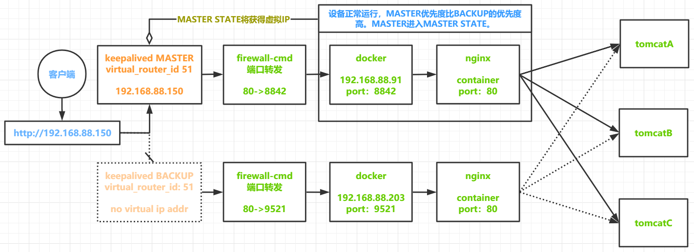

- 一旦发生负载机`MASTER`单点故障，`nginx`不可访问，`keepalived`会通过脚本检查该状态的发生，并在状态检查返回服务不可用时，降低自身优先度，使备用机`BACKUP`的优先度大于自身。
- 当备用机BACKUP的优先度大于原本的负载机`MASTER`时，负载就`MASTER`将失去虚拟`IP`，进入`BACKUP STATE`。此时备用机`BACKUP`将被推举为`MASTER`，进入`MASTER STATE`，并获得该虚拟`IP`。

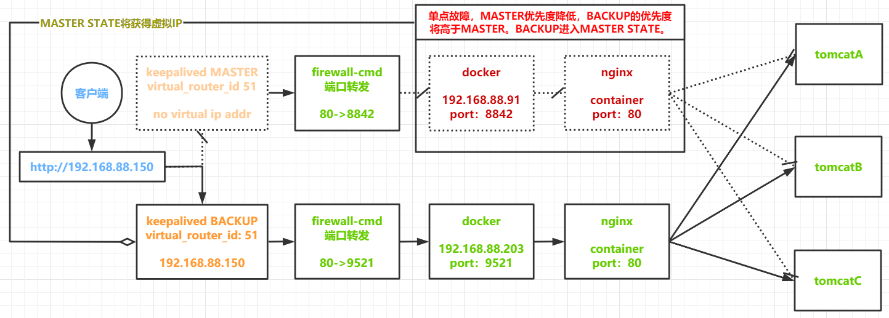

- 测试`keepalived`主从切换时，推荐监控日志文件，获取`keepalived`的输出消息：

```bash
tail -f /var/log/messages
```

## 1. 安装keepalived

- 可以使用`yum`命令安装`keepalived`，使用以下命令：

```bash
yum install -y keepalived
```

- 使用`yum`命令安装的`keepalived`，配置文件位于`/etc/keepalived`目录下。
- 以下将展示`keepalived`的编译安装方式。

- 采用`keepalived`的编译安装，从以下地址获取安装包，虚拟机连接网络的情况下使用`wget`获取安装包`https://keepalived.org/software/keepalived-2.1.5.tar.gz`；
- 编译安装前，需要安装依赖，编译需要用到`make`、`gcc`，软件编译依赖`libnl-devel`、`libnl3-devel`、`openssl-devel`，至于`libnl`、`openssl`本体，暂时不知道编译需要软件源码包的软件，是否需要该源码包软件的本体，因此选择安装。
- 使用以下命令查看本机是否存在使用`yum`安装的必要依赖：

```bash
yum list installed | grep -E 'gcc|libnl|make|openssl'
```

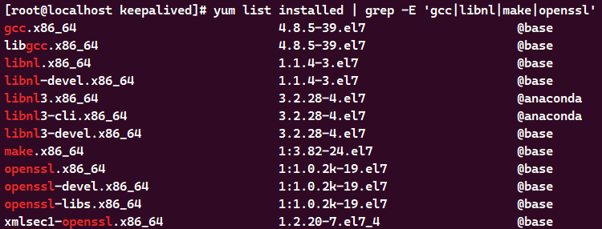

- 或这个命令：

```bash
yum list installed | grep -e gcc -e libnl -e make -e openssl
```

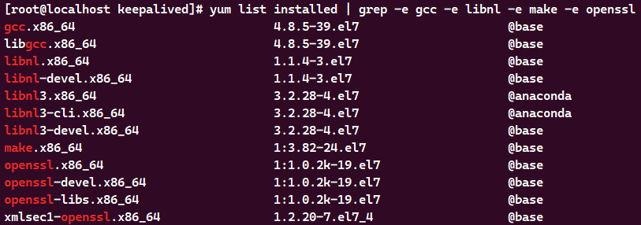

- 如果虚拟机上没有这些必要的依赖，使用`yum`安装：

```bash
yum install -y gcc libnl libnl-devel libnl3 libnl3-devel make openssl openssl-devel
```

- 以上准备完成后，下载并解压`keepalived`安装包并编译安装即可，命令如下：

```bash
# 获取keepalived安装包
wget https://keepalived.org/software/keepalived-2.1.5.tar.gz
# 解压缩
tar zxvf keepalived-2.1.5.tar.gz
# 进入目录
cd keepalived-2.1.5.tar.gz
# 生成Makefile文件，参数--prefix用于指定软件最终的安装路径，运行完make install后，目录会生成
./configure --prefix=/usr/local/keepalived
# 编译
make
# 安装
make install
```

- 安装完毕之后，目标目录`/usr/local/keepalive`下已经有目标软件了：

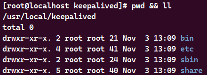

## 2. 安装docker

- 在`CentOS`中安装`docker`，使用`yum`安装，命令如下：

```bash
yum install docker -y
```

- 启动`docker`：

```bash
# 启动docker
systemctl start docker
# 查看docker状态，在容器创建失败的时候，也可使用此命令查看详情
systemctl status docker
```

## 3. 安装nginx

- 在`docker`中部署`nginx`，命令如下：

```bash
# 使用docker拉取nginx镜像的时候，最好更新一下dockerhub的源
vim /etc/docker/daemon.json
# 添加以下内容
{
  "registry-mirrors": ["https://9cpn8tt6.mirror.aliyuncs.com"]
}

# 重启docker
systemctl restart docker

# 拉取镜像
docker pull nginx:latest
```

- 在`docker`中启动`nginx`，并进入`nginx`目录，修改默认欢迎页，加入宿主机`IP`字段，用于辨别集群是否可运行：

```bash
docker run --name hey-nginx -p 8842:80 -d nginx
docker cp hey-nginx:/usr/share/nginx/html/index.html ./
vim index.html
docker cp ./index.html hey-nginx:/usr/share/nginx/html
```

- 同样在另一台虚拟机上选择`9521`作为`nginx`容器的宿主机端口，并做同样的操作：

```bash
docker run --name hey-nginx -p 9521:80 -d nginx
docker cp hey-nginx:/usr/share/nginx/html/index.html ./
vim index.html
docker cp ./index.html hey-nginx:/usr/share/nginx/html
```

- 在浏览器键入主从服务器地址后，均访问正常：

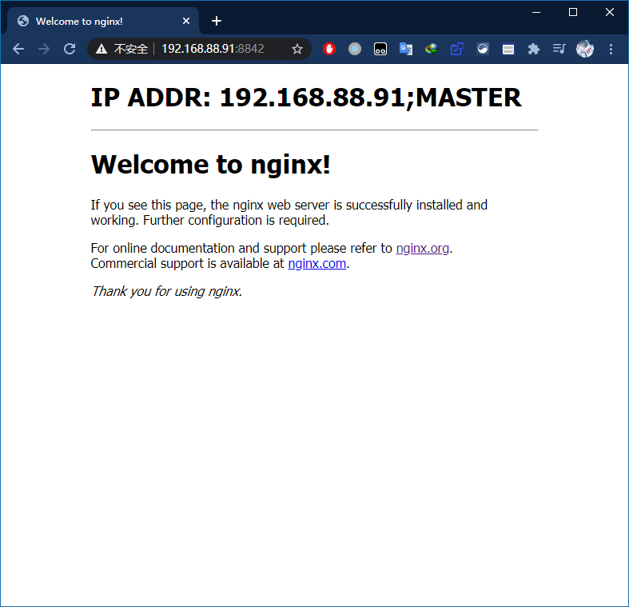


## 4. 配置keepalived

- 配置`keepalived`将包括通信端口权限、执行脚本格式及编写、配置文件格式及编写等内容。

### a. 通信端口权限

- `keepalived`在系统开启防火墙后，系统端口默认不处于开放状态，导致其各节点之间无法感知彼此的节点状态，集群出现`VIP`漂移失败等现象。因此我们需要开放`keepalived`通信端口`112`的防火墙权限。
- 可以选择直接永久开放防火墙`112`端口的权限，以下命令中的选项`--permanent`如果不添加，一旦重新加载防火墙配置之后，规则会被清空重置，为了实验方便性，推荐添加：

```bash
# 永久开放112端口，即在INPUT_direct、OUTPUT_direct及IN_public_allow链中均添加规则
firewall-cmd --zone=public --add-port=112/tcp --permanent
# 重新加载防火墙配置
firewall-cmd --reload

--------------------------------------------------------------------------------------
# 对应永久关闭112端口权限的命令
firewall-cmd --zone=public --remove-port=112/tcp --permanent
# 重新加载防火墙配置
firewall-cmd --reload
```

- 或者在`INPUT_direct`链和`OUTPUT_direct`链中直接添加进站/出站的规则，其中`keepalived`使用`vrrp`组播，默认地址为`224.0.0.18`：

```bash
# 永久允许112端口进站，即在INPUT_direct链中添加规则
firewall-cmd --direct --permanent --add-rule ipv4 filter INPUT 0 --destination 224.0.0.18 --protocol vrrp -j ACCEPT
# 永久允许112端口出站，即在OUTPUT_direct链中添加规则
firewall-cmd --direct --permanent --add-rule ipv4 filter OUTPUT 0 --destination 224.0.0.18 --protocol vrrp -j ACCEPT

--------------------------------------------------------------------------------------
# 重新加载防火墙配置
firewall-cmd --reload
```

- 使用第一种方法，会比第二种方法多添加一个`IN_public_allow`链的规则；
- 而另一个区别是，在使用查看防火墙开放端口列表命令时，使用第一种方法可以在列表中看到该端口的开放详情，而第二种是无法看到的，也就是在运行以下命令时：

```bash
# 查看防火墙所有开放的端口
firewall-cmd --zone=public --list-ports
```

- 第一种标准的方式将输出`112/tcp`；第二种在指定链中添加端口的方式将没有输出，但实际上`112`端口已开放。

- 添加完毕后，可以使用`iptables`命令查看具体防火墙规则表，并展示`-n`参数的效果比较：

```bash
iptables [选项]

选项：
-L：查看当前表的所有规则，默认查看的是filter表，如果要查看NAT表，可以加上-t NAT参数
-n：不对ip地址进行反查，加上这个参数显示速度会快很多
-v：输出详细信息，包含通过该规则的数据包数量，总字节数及相应的网络接口
--line-number：显示规则的序列号，这个参数在删除或修改规则的时候会用到

# 使用包含-n选项的命令
iptables -nvL --line-number

输出将包含以下两条内容：
--------------------------------------------------------------------------------------
Chain INPUT_direct (1 references)
num   pkts bytes target     prot opt in     out     source               destination         
1        0     0 ACCEPT     112  --  *      *       0.0.0.0/0            224.0.0.18
--------------------------------------------------------------------------------------
Chain OUTPUT_direct (1 references)
num   pkts bytes target     prot opt in     out     source               destination         
1        0     0 ACCEPT     112  --  *      *       0.0.0.0/0            224.0.0.18
--------------------------------------------------------------------------------------

# 不使用包含-n选项的命令
iptables -vL --line-number

输出将包含以下两条内容：
--------------------------------------------------------------------------------------
Chain INPUT_direct (1 references)
num   pkts bytes target     prot opt in     out     source               destination         
1        0     0 ACCEPT     vrrp --  any    any     anywhere             vrrp.mcast.net
--------------------------------------------------------------------------------------
Chain OUTPUT_direct (1 references)
num   pkts bytes target     prot opt in     out     source               destination         
1        0     0 ACCEPT     vrrp --  any    any     anywhere             vrrp.mcast.net
--------------------------------------------------------------------------------------

使用直接开放112端口防火墙权限的命令，会多看到一条以下内容：
--------------------------------------------------------------------------------------
Chain IN_public_allow (1 references)
num   pkts bytes target     prot opt in     out     source               destination         
n        0     0 ACCEPT     tcp  --  *      *       0.0.0.0/0            0.0.0.0/0            tcp dpt:112 ctstate NEW,UNTRACKED
--------------------------------------------------------------------------------------
```

- 不输出所有的规则表，可以使用准确查询，只需要在参数后添加指定表的名称即可，示例展示准确查询`iptables`中`INPUT_direct`链和`OUTPUT_direct`链中的规则，使用以下命令：

```bash
# 查询INPUT_direct链中的规则
iptables -nvL INPUT_direct --line-numbers

输出将包含以下一条内容：
--------------------------------------------------------------------------------------
Chain INPUT_direct (1 references)
num   pkts bytes target     prot opt in     out     source               destination         
1        0     0 ACCEPT     112  --  *      *       0.0.0.0/0            224.0.0.18
--------------------------------------------------------------------------------------

# 查询OUTPUT_direct链中的规则
iptables -nvL OUTPUT_direct --line-numbers

输出将包含以下一条内容：
--------------------------------------------------------------------------------------
Chain OUTPUT_direct (1 references)
num   pkts bytes target     prot opt in     out     source               destination         
1        0     0 ACCEPT     112  --  *      *       0.0.0.0/0            224.0.0.18 
--------------------------------------------------------------------------------------
```

- 如果使用指定链添加的方式，对应删除`_direct`链中的规则也需要指定进行，在删除命令中使用行号`num`进行规则删除，选项`-D`用于指定链名：

```bash
# 删除INPUT_direct链中行号为1的规则
iptables -D INPUT_direct 1
# 删除OUTPUT_direct链中行号为1的规则
iptables -D OUTPUT_direct 1
```

### b. 执行脚本格式

- 对于`Window`系统直传的可执行文件`.sh`，其格式需要为`unix`，如果`.sh`无法正确执行，需要查看文档中的`fileformat`，使用以下命令可以查看或设置`.sh`的`fileformat`，使用`vi`或`vim`打开文件后，在命令模式下使用：

```bash
# 命令模式下键入以下命令，可以查看fileformat
set ff

# 使用以下命令，可以设置文档的fileformat
set ff=unix
或
set ff=dos
```

### c. keepalived配置文件

- `MASTER`负载机配置文件一览：

```json
! Configuration File for keepalived

global_defs { # 全局定义部分。
   notification_email { # 设置报警通知的邮箱。
     acassen@firewall.loc # 邮箱地址。
     failover@firewall.loc
     sysadmin@firewall.loc
   }
   notification_email_from Alexandre.Cassen@firewall.loc # 设置发送邮件的服务器地址。
   smtp_server 192.168.200.1 # 邮箱相关，smtp server地址。
   smtp_connect_timeout 30 # 超时时间。
   router_id KEEPALIVED.192.168.88.91 # 主机标识，用于邮箱通知，最好是不一样的名字，方便辨识。
   vrrp_skip_check_adv_addr
   vrrp_strict
   vrrp_garp_interval 0
   vrrp_gna_interval 0
}

vrrp_script chk_http_port {
	script "/usr/local/src/chk_nginx.sh" # 服务器状态监测脚本，执行成功时：exit 0；执行失败时：exit 1.
	interval 2 # 间隔运行脚本的时间，单位：秒。
	weight -20 # 权重，默认为2。权重为正数或负数的时候，表现不同。但要保证权重的绝对值大于主从设备优先度之差的绝对值。
}

vrrp_instance VI_1 {
    state MASTER # 指定该节点的初始状态。
    interface ens33 # vrrp实例绑定的网卡名字，用于发送vrrp包。
    virtual_router_id 51 # 范围在0~255之间，vrrp实例ID，在同一个集群中的keepalived要设置为相同的ID。
    priority 100 # 优先度，MASTER的优先度应该始终比BACKUP的大，并使用vrrp_script中的权重weight来动态控制。
    advert_int 1 # 指定发送vrrp通告的间隔，单位：秒。
    authentication {
        auth_type PASS # 指定认证方式。PASS简单密码认证（推荐），AH:IPSEC认证（不推荐）。
        auth_pass 1111 # 指定认证所使用的密码，最多8位。
    }
    virtual_ipaddress { # 虚拟ip，格式：<IPADDR>/<MASK> brd <IPADDR> dev <STRING> scope <SCOPE> label <LABEL>
        192.168.88.150
    }
    track_script { # 使实例调用vrrp_script中配置的脚本。
		chk_http_port # 配置的脚本可以设置权重weight。格式：<SCRIPT_NAME> weight <-254~254>。
    }
}
```

- `BACKUP`备用机配置文件一览：

```json
! Configuration File for keepalived

global_defs {
   notification_email {
     acassen@firewall.loc
     failover@firewall.loc
     sysadmin@firewall.loc
   }
   notification_email_from Alexandre.Cassen@firewall.loc
   smtp_server 192.168.200.1
   smtp_connect_timeout 30
   router_id KEEPALIVED.192.168.88.203
   vrrp_skip_check_adv_addr
   vrrp_strict
   vrrp_garp_interval 0
   vrrp_gna_interval 0
}

vrrp_script chk_http_port {
	script "/usr/local/src/chk_nginx.sh" # 服务器状态监测脚本，执行成功时：exit 0；执行失败时：exit 1.
	interval 2 # 间隔运行脚本的时间，单位：秒。
	weight -20 # 权重，默认为2。权重为正数或负数的时候，表现不同。但要保证权重的绝对值大于主从设备优先度之差的绝对值。
}

vrrp_instance VI_1 {
    state BACKUP
    interface ens33
    virtual_router_id 51
    priority 90 # 优先度，MASTER的优先度应该始终比BACKUP的大，并使用vrrp_script中的权重weight来动态控制。
    advert_int 1
    authentication {
        auth_type PASS
        auth_pass 1111
    }
    virtual_ipaddress {
        192.168.88.150
    }
    track_script {
		chk_http_port
    }
}
```

- 在开始优先度`priority`和权重`weight`讲解前，需要明确的几点：
  1. 优先度可以分为原始优先度和实际优先度，实际优先度大的主机，将进入`MASTER STATE`作为负载机（提供服务的主机），而较低的主机都会进入`BACKUP STATE`作为备用机（等待状态的主机）；
  2. 每次执行完脚本之后，如果存在权重`weight`，那么与之进行计算的是原始优先度，而不是主机的实际优先度；
  3. 由以上规定支撑的情况下，主机的实际优先度仅仅取决于它的原始优先度和脚本权重`weight`，也就是说，即使脚本多次执行，也不会出现累加的情况；
  4. 优先度`priority`和权重`weight`的运算只有加法（大部分人所说的减法，其实只是主机恢复其自身原始优先度，而并不是什么减法）。
- 关于`vrrp_instance`中的`priority`和`vrrp_script`中的`weight`关系：
- 当`weight > 0`时，有以下关系：

|  主机  | 原始优先度 | 脚本权重 | 初始状态/脚本执行/实际优先度 | 状态/脚本执行/实际优先度 | 状态/脚本执行/实际优先度 |
| :----: | :--------: | :------: | :--------------------------: | :----------------------: | :----------------------: |
| MASTER |    100     |    20    |      正常/执行成功/120       |    故障/执行失败/100     |    恢复/执行成功/120     |
| BACKUP |     90     |    20    |      正常/执行成功/110       |    正常/执行成功/110     |    正常/执行成功/110     |

- 此时，当脚本执行成功时，主机实际优先度等于其原始优先度加上当前脚本权重；当脚本执行失败时，主机实际优先度等于其原始优先度。
- 从示例可以看到，当`MASTER`发生故障时，它的实际优先度将计算为它的原始优先度：`100`；而当`MASTER`从故障中恢复时，它的实际优先度将计算为：`100 + (20) = 120`。
- 当`weight < 0`时，有以下关系：

|  主机  | 原始优先度 | 脚本权重 | 初始状态/脚本执行/实际优先度 | 状态/脚本执行/实际优先度 | 状态/脚本执行/实际优先度 |
| :----: | :--------: | :------: | :--------------------------: | :----------------------: | :----------------------: |
| MASTER |    100     |   -20    |      正常/执行成功/100       |     故障/执行失败/80     |    恢复/执行成功/100     |
| BACKUP |     90     |   -20    |       正常/执行成功/90       |     正常/执行成功/90     |     正常/执行成功/90     |

- 此时，当脚本执行成功时，主机实际优先度等于其原始优先度；当脚本执行失败时，主机实际优先度等于其原始优先度加上当前脚本权重。
- 从示例可以看到，当`MASTER`发生故障时，它的实际优先度将计算为：`100 + (-20) = 80`；而当`MASTER`从故障中恢复时，它的实际优先度将恢复为它的原始优先度：`100`。
- 因此无论脚本权重`weight`如何变化，只要脚本执行失败，就会使当前主机的实际优先度降低。
- 需要确保主从机之间的原始优先度之差的绝对值，始终小于脚本权重的绝对值。否则当负载机出现故障时，权重会不足以降低负载机的实际优先度，导致虚拟`IP`漂移失败。

### d. 检测脚本.sh

- `chk_nginx.sh`脚本用于监测主从机的状态，配置如下：
- `MASTER`负载机配置：

```shell
#!/bin/bash

#该curl命令将检查在本机上部署的nginx是否在运行，通过访问nginx的主页，返回状态码判定
check=`curl -o /dev/null -s -w %{http_code} localhost:8842/index.html`

#如果该状态码不是200，而是0，则表示nginx不在线
if [ $check -eq 0 ];then
        #nginx不在线，我们使用docker命令重新启动nginx容器hey-nginx，重定向到/dev/null屏蔽输出
        docker restart hey-nginx > /dev/null 2>&1
        sleep 2

        #重新获取检查nginx是否在线
        recheck=`curl -o /dev/null -s -w %{http_code} localhost:8842/index.html`
        if [ $recheck -eq 0 ];then
        	#返回的状态码如果不为0，都是执行失败的意思
			exit 1
        fi
fi
#返回的状态码等于0，则是执行成功的意思
exit 0
```

- `BACKUP`备用机配置：

```bash
#!/bin/bash

#该curl命令将检查在本机上部署的nginx是否在运行，通过访问nginx的主页，返回状态码判定
check=`curl -o /dev/null -s -w %{http_code} localhost:9521/index.html`

#如果该状态码不是200，而是0，则表示nginx不在线
if [ $check -eq 0 ];then
        #nginx不在线，我们使用docker命令重新启动nginx容器hey-nginx，重定向到/dev/null屏蔽输出
        docker restart hey-nginx > /dev/null 2>&1
        sleep 2

        #重新获取检查nginx是否在线
        recheck=`curl -o /dev/null -s -w %{http_code} localhost:9521/index.html`
        if [ $recheck -eq 0 ];then
        	#返回的状态码如果不为0，都是执行失败的意思
			exit 1
        fi
fi
#返回的状态码等于0，则是执行成功的意思
exit 0
```

- 实验使用`docker`启动`nginx`，借助`curl`命令，我们可以检测出是否能正确连接上本机中的`nginx`服务器。主要通过检测`nginx`主页状态，如果状态码不为零，则表示`nginx`服务器在线；如果状态码为零，则表示`nginx`服务器异常或离线。
- `nginx`服务器在线时，脚本返回状态码`0`，即脚本执行成功；
- `nginx`服务器离线时，脚本将尝试重启`nginx`服务，等待`2`秒后再次检测，如果仍然无法连接，则脚本返回状态码`1`，即脚本执行失败。
- 可以按照机器的实际情况，编写更加符合逻辑的脚本，编写方法有很多种。例如，可以在脚本中直接监控你网站主页是否能正常访问，从而更加准确地控制主从机的`IP`漂移。
- 归根结底，脚本的其主要的目的是通过`shell`获取当前主机上`nginx`的状态，并在`nginx`确认异常的时候，让脚本发出执行失败的信号（即：`exit 1`），从而使`keepalived`能捕捉到该信号，对当前主机上的实际优先度作出及时的调整。

## 5. 单点故障测试

- 为了便于实验，我们将负载机上的`80`端口映射到负载机的`8842`端口上，即提供`nginx`服务的负载机`docker`端口；同时将备用机上的`80`端口映射到备用机的`9521`端口上，即提供`nginx`服务的备用机`docker`端口。

```shell
# 在192.168.88.91负载机上，作端口映射
firewall-cmd --add-forward-port=port=80:proto=tcp:toport=8842 --permanent
# 在192.168.88.203备用机上，作端口映射
firewall-cmd --add-forward-port=port=80:proto=tcp:toport=9521 --permanent
```

- 现在我们可以直接通过访问`http://192.168.88.91`和`http://192.168.88.203`访问到主备机上各自的`nginx`服务器。

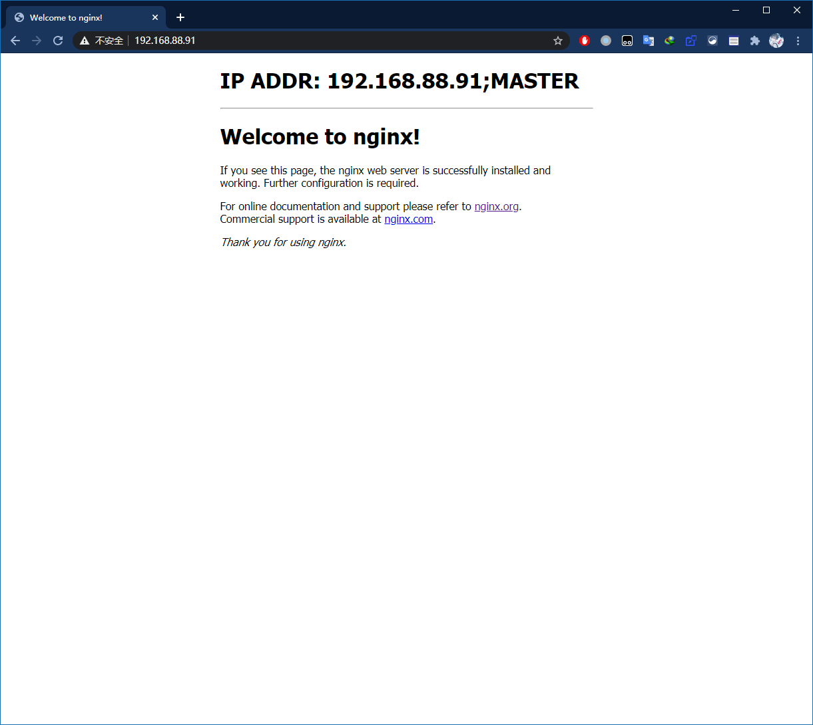


- 在负载机和备用机上，通过以下命令，启动`keepalived`，主备机上的`keepalived`会通过通信端口`112`和配置文件中的`virtual_router_id`进行集群匹配：

```bash
# 通过编译安装的keepalived，找到可执行文件keepalived，并使用选项-f指定启动的配置文件
/usr/local/keepalived/sbin/keepalived -f /usr/local/keepalived/etc/keepalived/keepalived.conf
```

- 此时查看负载机和备用机上的`ip`状态，如下：

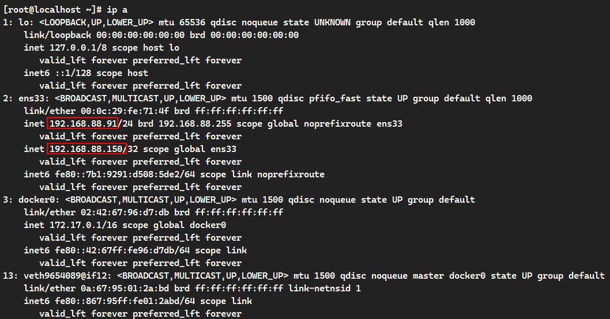

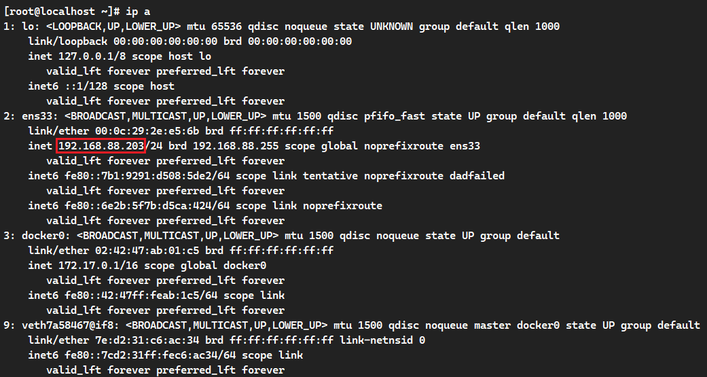

- 可以看到，负载机`MASTER`上获取到了虚拟`IP`地址`192.168.88.150`，而备用机`BACKUP`中没有获取到该虚拟`IP`。
- 重新查看流程图，状态符合正常情况下的虚拟`IP`分配状态，此时通过虚拟`IP`访问服务器，只能通过负载机中的`nginx`。


- 通过浏览器键入虚拟`IP`地址，我们的确只访问到了负载机上的`nginx`服务器：


- 接下来模拟单点故障，我们使用以下命令停止负载机`MASTER`上的`docker`，这会导致`nginx`服务关闭：

```bash
systemctl stop docker
```

- 同样回看流程图，此时负载机`MASTER`表现为单点故障，虚拟`IP`将转移到备用机`BACKUP`上。用户此时通过虚拟`IP`访问服务器，会通过备用机`BACKUP`上的`nginx`，而不再是负载机`MASTER`中的`nginx`。


- 通过浏览器键入虚拟`IP`地址，此时只访问到了备用机上的`nginx`服务器：

