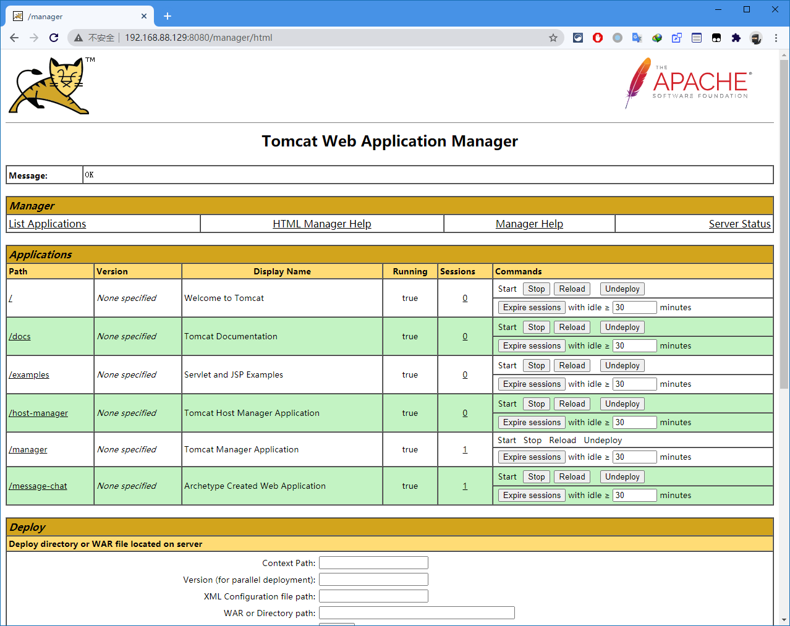

# 前言

> - 本篇记录在`Linux`上部署`Web`项目，用户可以通过服务器地址对项目进行自由访问，所使用的`Linux`发行版为`CentOS 7 Minimal Installation`。
> - 部署的项目是基于`SSM`架构，需要依赖以下模块：
>   - `Tomcat`
>   - `MySQL`
>   - `RabbitMQ`

# 项目打包

- 使用`Maven`可以很方便的将项目进行打包，将打包好的`war`格式文件，放置于`Tomcat`软件中的`webapp`目录下，即完成项目的部署；注意：这只是`web`项目的其中一种部署方式。

# 依赖环境

- 项目部署环境需要进行手动的配置，本次项目部署使用的是原始的`CentOS 7`环境，没有使用`docker`。
- 使用`XShell`连接`Linux`系统，进行各种环境的部署。

## 1. Tomcat

- 以下为`Tomcat`的安装步骤。

### a. 安装Java jdk1.8

- `Tomcat`的运行依赖于`jdk`环境，项目使用什么`Java`版本，`Linux`就安装什么`Java`版本；
- `jdk1.8`链接为：
  - https://www.oracle.com/cn/java/technologies/javase/javase-jdk8-downloads.html


- 在链接中可以下载`jdk1.8`，需要预先注册`Oracle`的账号，下载的包为`jdk-8u261-linux-x64.rpm`：
  - 如果明确下载链接，可以使用`wget`工具进行包下载。


- 返回`Xshell`，运行以下命令进行`jdk`的安装：

```shell
# 需要首先查询本机时候有安装java，为空即没有安装过
rpm -qa | grep java
# 安装jdk，需要进入rpm包所在的目录
rpm -ivh jdk-8u261-linux-x64.rpm
# 完成后可查看java版本信息
java -version
# 输出内容如下：
    java version "1.8.0_261"
    Java(TM) SE Runtime Environment (build 1.8.0_261-b12)
    Java HotSpot(TM) 64-Bit Server VM (build 25.261-b12, mixed mode)
```

### b. 配置JAVA_HOME

- 跟`Window`端一致，我们下载并安装完毕`Java`之后，需要配置系统的环境变量，才能使用命令行对`Java`进行调用，相关的软件如`IDEA`、`Tomcat`甚至于`Spring Boot`等都依赖于`JAVA_HOME`；
- 因此需要对`Linux`端进行同样的配置，在`Linux`配置文件中添加以下四行代码，`JAVA_HOME`安装目录根据个人的安装路径而变化，剩余三行配置代码则是固定的：

```shell
export JAVA_HOME=/usr/java/jdk1.8.0_261-amd64
export JRE_HOME=$JAVA_HOME/jre  
export PATH=$PATH:$JAVA_HOME/bin:$JRE_HOME/bin
export CLASSPATH=.:$JAVA_HOME/lib/dt.jar:$JAVA_HOME/lib/tools.jar:$JRE_HOME/lib
```

- `CentOS 7`的环境变量配置文件位于目录`/etc/profile`中，可以使用`vi`或`vim`命令进行编辑：

```shell
yum -y install vim
```

- 使用`vim`对目录文件`/etc/profile`进行编辑，在末尾添加上述四行代码即可，完整`profile`文件如下：

```shell
# /etc/profile

# System wide environment and startup programs, for login setup
# Functions and aliases go in /etc/bashrc

# It's NOT a good idea to change this file unless you know what you
# are doing. It's much better to create a custom.sh shell script in
# /etc/profile.d/ to make custom changes to your environment, as this
# will prevent the need for merging in future updates.

pathmunge () {
    case ":${PATH}:" in
        *:"$1":*)
            ;;
        *)
            if [ "$2" = "after" ] ; then
                PATH=$PATH:$1
            else
                PATH=$1:$PATH
            fi
    esac
}


if [ -x /usr/bin/id ]; then
    if [ -z "$EUID" ]; then
        # ksh workaround
        EUID=`/usr/bin/id -u`
        UID=`/usr/bin/id -ru`
    fi
    USER="`/usr/bin/id -un`"
    LOGNAME=$USER
    MAIL="/var/spool/mail/$USER"
fi

# Path manipulation
if [ "$EUID" = "0" ]; then
    pathmunge /usr/sbin
    pathmunge /usr/local/sbin
else
    pathmunge /usr/local/sbin after
    pathmunge /usr/sbin after
fi

HOSTNAME=`/usr/bin/hostname 2>/dev/null`
HISTSIZE=1000
if [ "$HISTCONTROL" = "ignorespace" ] ; then
    export HISTCONTROL=ignoreboth
else
    export HISTCONTROL=ignoredups
fi

export PATH USER LOGNAME MAIL HOSTNAME HISTSIZE HISTCONTROL

# By default, we want umask to get set. This sets it for login shell
# Current threshold for system reserved uid/gids is 200
# You could check uidgid reservation validity in
# /usr/share/doc/setup-*/uidgid file
if [ $UID -gt 199 ] && [ "`/usr/bin/id -gn`" = "`/usr/bin/id -un`" ]; then
    umask 002
else
    umask 022
fi

for i in /etc/profile.d/*.sh ; do
    if [ -r "$i" ]; then
        if [ "${-#*i}" != "$-" ]; then 
            . "$i"
        else
            . "$i" >/dev/null
        fi
    fi
done

unset i
unset -f pathmunge

# 此处为JAVA_HOME配置
export JAVA_HOME=/usr/java/jdk1.8.0_261-amd64
export JRE_HOME=$JAVA_HOME/jre  
export PATH=$PATH:$JAVA_HOME/bin:$JRE_HOME/bin
export CLASSPATH=.:$JAVA_HOME/lib/dt.jar:$JAVA_HOME/lib/tools.jar:$JRE_HOME/lib
```

- 使用命令行确认是否成功设置`JAVA_HOME`：

```shell
# 退出当前用户并重新连接
exit
# 查看JAVA_HOME路径
echo $JAVA_HOME
# 输出内容如下：
	/usr/java/jdk1.8.0_261-amd64
```

### c. 安装Tomcat 9.0.37

- 官网地址：http://tomcat.apache.org/
- 选择`tomcat 9.0.37`版本，因为`IDEA`中使用的也是`9`版本，且本项目在`8`版本下无法正常运行：


- 将压缩包转移至`CentOS`中：


- 切入目标目录中并解压`apache-tomcat-9.0.37.tar.gz` ：

```shell
tar -zxvf apache-tomcat-9.0.37.tar.gz 
```

- 成功获得解压缩后的目录，即安装成功，进入目录后使用以下命令开启或关闭`Tomcat`，使用方式和`Window`端一致，默认的端口`8080`：

```shell
# 开启tomcat服务器
./bin/startup.sh
# 关闭tomcat服务器
./bin/shutdown.sh
```

- 防火墙设置，可以选择关闭系统防火墙，或单独开启`8080`端口的入站规则，`permanent`为永久开放此端口：

```shell
# 关闭系统防火墙（不推荐）
systemctl stop firewalld

# 单独开启8080端口访问权限（推荐，熟悉防火墙规则）
firewall-cmd --zone=public --add-port=8080/tcp --permanent
# 开放8080端口后需要重新加载防火墙
firewall-cmd --reload
```

- 最后，浏览器输入地址`192.168.88.129:8080`查看安装是否成功：


### d. Tomcat配置

- 在客户端使用`http://ip_addr:8080`的方式对`tomcat`的项目进行统一的管理，需要修改`/tomcat/conf`目录下的`tomcat-user.xml`文件，在`<tomcat-users>`中添加：

```xml
<!-- 添加用户名为tomcat，密码为tomcat的用户，拥有5种角色 -->
<!-- 角色配置来源于网络途径，暂时不知道作用是什么 -->
<role rolename="tomcat"/>
<role rolename="manager-gui"/>
<role rolename="admin-gui"/>
<role rolename="manager-script"/>
<role rolename="admin-script"/>
<user username="tomcat" password="pyc930217@ABC" roles="tomcat,manager-gui,admin-gui,admin-script,manager-script"/>
```

- 配置文件`tomcat.xml`，具体添加位置如下：

```xml
<?xml version="1.0" encoding="UTF-8"?>
<!--
  Licensed to the Apache Software Foundation (ASF) under one or more
  contributor license agreements.  See the NOTICE file distributed with
  this work for additional information regarding copyright ownership.
  The ASF licenses this file to You under the Apache License, Version 2.0
  (the "License"); you may not use this file except in compliance with
  the License.  You may obtain a copy of the License at

      http://www.apache.org/licenses/LICENSE-2.0

  Unless required by applicable law or agreed to in writing, software
  distributed under the License is distributed on an "AS IS" BASIS,
  WITHOUT WARRANTIES OR CONDITIONS OF ANY KIND, either express or implied.
  See the License for the specific language governing permissions and
  limitations under the License.
-->
<tomcat-users xmlns="http://tomcat.apache.org/xml"
              xmlns:xsi="http://www.w3.org/2001/XMLSchema-instance"
              xsi:schemaLocation="http://tomcat.apache.org/xml tomcat-users.xsd"
              version="1.0">
<!--
  NOTE:  By default, no user is included in the "manager-gui" role required
  to operate the "/manager/html" web application.  If you wish to use this app,
  you must define such a user - the username and password are arbitrary. It is
  strongly recommended that you do NOT use one of the users in the commented out
  section below since they are intended for use with the examples web
  application.
-->
<!--
  NOTE:  The sample user and role entries below are intended for use with the
  examples web application. They are wrapped in a comment and thus are ignored
  when reading this file. If you wish to configure these users for use with the
  examples web application, do not forget to remove the <!.. ..> that surrounds
  them. You will also need to set the passwords to something appropriate.
-->
<!--
  <role rolename="tomcat"/>
  <role rolename="role1"/>
  <user username="tomcat" password="<must-be-changed>" roles="tomcat"/>
  <user username="both" password="<must-be-changed>" roles="tomcat,role1"/>
  <user username="role1" password="<must-be-changed>" roles="role1"/>
-->
<role rolename="tomcat"/>
<role rolename="manager-gui"/>
<role rolename="admin-gui"/>
<role rolename="manager-script"/>
<role rolename="admin-script"/>
<user username="tomcat" password="pyc930217@ABC" roles="tomcat,manager-gui,admin-gui,admin-script,manager-script"/>
</tomcat-users>
```

- 自`Tomcat8.5`之后，可能出现即使修改了`tomcat-users.xml`文件也无法进入`Manager App`的情况，我们需要再对以下两个文件做修改：
  - `apache-tomcat-9.0.37/webapps/host-manager/META-INF/context.xml`
  - `apache-tomcat-9.0.37/webapps/manager/META-INF/context.xml`
- 需要注释或修改其中的以下代码：

```xml
<!-- 从代码中可以看出来这是设置可远程tomcat服务器ip的标签，也可以自行修改此条件 -->
<!-- 其中192.168.88.1为要访问此tomcat管理页面的主机局域网地址 -->
<Valve className="org.apache.catalina.valves.RemoteAddrValve"
         allow="127\.\d+\.\d+\.\d+|::1|0:0:0:0:0:0:0:1|192.168.88.1" />
```

- 配置文件`context.xml`内容如下：

```xml
<?xml version="1.0" encoding="UTF-8"?>
<!--
  Licensed to the Apache Software Foundation (ASF) under one or more
  contributor license agreements.  See the NOTICE file distributed with
  this work for additional information regarding copyright ownership.
  The ASF licenses this file to You under the Apache License, Version 2.0
  (the "License"); you may not use this file except in compliance with
  the License.  You may obtain a copy of the License at

      http://www.apache.org/licenses/LICENSE-2.0

  Unless required by applicable law or agreed to in writing, software
  distributed under the License is distributed on an "AS IS" BASIS,
  WITHOUT WARRANTIES OR CONDITIONS OF ANY KIND, either express or implied.
  See the License for the specific language governing permissions and
  limitations under the License.
-->
<Context antiResourceLocking="false" privileged="true" >
  <Valve className="org.apache.catalina.valves.RemoteAddrValve"
         allow="127\.\d+\.\d+\.\d+|::1|0:0:0:0:0:0:0:1|192.168.88.1" />
  <Manager sessionAttributeValueClassNameFilter="java\.lang\.(?:Boolean|Integer|Long|Number|String)|org\.apache\.catalina\.filters\.CsrfPreventionFilter\$LruCache(?:\$1)?|java\.util\.(?:Linked)?HashMap"/>
</Context>
```

- 接下来，就可以通过`http://ip_addr:8080`中的`Manager App`中对项目进行管理：



## 2. MySQL

### a. 获取MySQL安装源

- 由于`CentOS7`的`yum`源中没有`mysql`，需要到`mysql`的官网下载`yum repo`配置文件：

```shell
# 默认CentOS是没有wget命令的，需要执行安装
yum -y install wget
# 获取mysql57-community-release-el7-9.noarch.rpm
wget https://dev.mysql.com/get/mysql57-community-release-el7-9.noarch.rpm
```

- [MySQL :: Download MySQL Yum Repository](https://dev.mysql.com/downloads/repo/yum/)
- 执行`yum`源的安装：

```shell
rpm -ivh mysql57-community-release-el7-9.noarch.rpm
```

### b. 安装MySQL

- 使用`yum`命令进行安装即可：

```shell
yum -y install mysql-server
```

### c. 启动/关闭MySQL

- 关于`MySQL`常用命令：

```shell
# 启动MySQL
systemctl start mysqld
# 关闭MySQL
systemctl stop mysqld
# 重启MySQL
systemctl restart mysqld
# 查看MySQL状态
systemctl status mysqld
# 设置MySQL开机自启动
systemctl enable mysqld
# 设置MySQL开机不启动
system 
```

### d. 配置MySQL

- 第一次安装需要获取`MySQL`的临时密码，获取完毕后使用临时密码登录`MySQL`：

```shell
# 留意控制台的输出，会有临时密码
grep 'temporary password' /var/log/mysqld.log
# 使用临时密码登录MySQL
mysql -u root -p （*下一步就是让你输入密码*）
```

- 进入`MySQL`后，做任何操作之前都需要先修改密码：

```sql
# 5.7及以上版本的MySQL对密码作了严格要求，需要同时包含大写、小写、数字及特殊字符
ALTER USER 'root'@'localhost' IDENTIFIED BY 'NEW_PASSWORD_WRITE_HERE';
ALTER USER 'root'@'localhost' IDENTIFIED BY 'pyc930217@ABC';
```

- 需要让远程的`MySQL`可视化管理工具连接到`CentOS`上的`MySQL`，需要进行赋权操作：

```sql
# 1.查看默认数据库
SHOW databases;
# 2.进入到mysql数据库中
USE mysql;
# 3.查看数据库用户信息
SELECT host, user FROM user;
# 4.默认情况下，MySQL只允许本地的登录，我们需要让某一个已存在的用户在任意主机上连接此数据库
GRANT ALL PRIVILEGES ON *.* TO 'root'@'%' IDENTIFIED BY 'ANOTHER_PASSWORD' WITH GRANT OPTION;
GRANT ALL PRIVILEGES ON *.* TO 'root'@'%' IDENTIFIED BY 'pyc930217@ABC' WITH GRANT OPTION;
# 5.刷新权限
FLUSH PRIVILEGES;
```

- 注意：此时的`ANOTHER_PASSWORD`也要遵循`MySQL`的密码规则。
- 修改防火墙入站规则，开放`3306`端口：

```shell
# 单独开启3306端口访问权限（推荐，熟悉防火墙规则）
firewall-cmd --zone=public --add-port=3306/tcp --permanent
# 开放3306端口后需要重新加载防火墙
firewall-cmd --reload
```

### e. 知识拓展

#### ⅰ. 修改密码强度

- 使用命令查看当前`MySQL`密码强度：

```sql
# 查看当前密码强度
SHOW VARIABLES LIKE 'validate_password%';

# 结果输出：
    +--------------------------------------+--------+
    | Variable_name                        | Value  |
    +--------------------------------------+--------+
    | validate_password_check_user_name    | OFF    |
    | validate_password_dictionary_file    |        |
    | validate_password_length             | 8      |
    | validate_password_mixed_case_count   | 1      |
    | validate_password_number_count       | 1      |
    | validate_password_policy             | MEDIUM |
    | validate_password_special_char_count | 1      |
    +--------------------------------------+--------+
    7 rows in set (0.53 sec)
```

- 其中`validate_password_length`表示最小的密码长度，`validate_password_policy`表示密码的安全等级，我们只需要更改这两项，就可以修改`MySQL`默认的密码强度了：

```sql
# 将密码安全等级改为low
SET GLOBAL validate_password_policy = 0;
# 将密码长度设置为最小4位
SET GLOBAL validate_password_length = 4;
```

- 最后，可以使用命令随意修改符合设定的密码：

```sql
# 修改用户root的在localhost上的登录密码为“1234”
ALTER USER 'root'@'localhost' IDENTIFIED BY '1234';
```

#### ⅱ. 写入中文乱码

- 在程序中对数据库进行`INSERT`或`UPDATE`操作的时候，如果需要写入中文，默认会出现乱码的情况，使用以下命令查看当前`MySQL`编码：

```sql
# 查看MySQL字符编码：
SHOW VARIABLES LIKE 'char%';

# 结果输出：
    +--------------------------+----------------------------+
    | Variable_name            | Value                      |
    +--------------------------+----------------------------+
    | character_set_client     | utf8                       | （*重点）
    | character_set_connection | utf8                       | （*重点）
    | character_set_database   | latin1                     |
    | character_set_filesystem | binary                     |
    | character_set_results    | utf8                       | （*重点）
    | character_set_server     | latin1                     | （*重点）
    | character_set_system     | utf8                       |
    | character_sets_dir       | /usr/share/mysql/charsets/ |
    +--------------------------+----------------------------+
    8 rows in set (0.00 sec)
```

- 我们需要将`character_set_server`的编码从`latin1`改为`utf8`，编辑一下MySQL配置文件`/etc/my.cnf`，添加一行：

```shell
character-set-server=utf8
```

- 配置文件`/etc/my.cnf`如下：

```shell
# For advice on how to change settings please see
# http://dev.mysql.com/doc/refman/5.7/en/server-configuration-defaults.html

[mysqld]
#
# Remove leading # and set to the amount of RAM for the most important data
# cache in MySQL. Start at 70% of total RAM for dedicated server, else 10%.
# innodb_buffer_pool_size = 128M
#
# Remove leading # to turn on a very important data integrity option: logging
# changes to the binary log between backups.
# log_bin
#
# Remove leading # to set options mainly useful for reporting servers.
# The server defaults are faster for transactions and fast SELECTs.
# Adjust sizes as needed, experiment to find the optimal values.
# join_buffer_size = 128M
# sort_buffer_size = 2M
# read_rnd_buffer_size = 2M
datadir=/var/lib/mysql
socket=/var/lib/mysql/mysql.sock

# Disabling symbolic-links is recommended to prevent assorted security risks
symbolic-links=0

log-error=/var/log/mysqld.log
pid-file=/var/run/mysqld/mysqld.pid

# 添加此行修改编码
character-set-server=utf8
```

- 最后重启`MySQL`使配置生效：

```shell
systemctl restart mysqld
```

## 3. RabbitMQ

### a. 安装RabbitMQ

- 安装`RabbitMQ`过程比较简单，代码如下：

```shell
# 更新epel源
yum -y install epel-release
# 下载RabbitMQ
yum -y install rabbitmq-server
# 查看已安装的插件
rabbitmq-plugins list
# 启动管理服务
rabbitmq-plugins enable rabbitmq_management
# 启动rabbitmq-server服务
systemctl start rabbitmq-server
```

### b. 开启防火墙端口

- `RabbitMQ`默认的远程管理页面端口为`15672`，开放端口权限：

```shell
# 单独开启15672端口访问权限（推荐，熟悉防火墙规则）
firewall-cmd --zone=public --add-port=15672/tcp --permanent
# 开放15672端口后需要重新加载防火墙
firewall-cmd --reload
```

- 默认访问远程管理页面的用户名、密码均为`guest`，可登陆远程管理页面：


> - 拓展知识：`Window`端如何打开远程管理页面。
>
> - `Window`端默认安装完`RabbitMQ`后，是无法直接打开远程管理页面的，需要通过`cmd`命令行，运行`RabbitMQ`的管理插件，之后才能通过访问`http://localhost:15672`访问管理页面：
>
> ```shell
> # 需要先切换到RabbitMQ目录下是sbin目录中
> rabbitmq-plugins enable rabbitmq_management
> ```

### c. 启动/关闭RabbitMQ

```shell
# 启动rabbitmq-server服务
systemctl start rabbitmq-server
# 关闭rabbitmq-server服务
systemctl stop rabbitmq-server
# 重启rabbitmq-server服务
systemctl restart rabbitmq-server
# 查看rabbitmq-server服务状态
systemctl status rabbitmq-server
```

### d. 注意事项

- 此版的`RabbitMQ`不需要额外装`erlang`，如果遇到了消息队列异常，重启一下`RabbitMQ`即可。

# 小节

- 需要注意，`war`项目可以直接部署在`tomcat`中的`webapp`目录下即可。