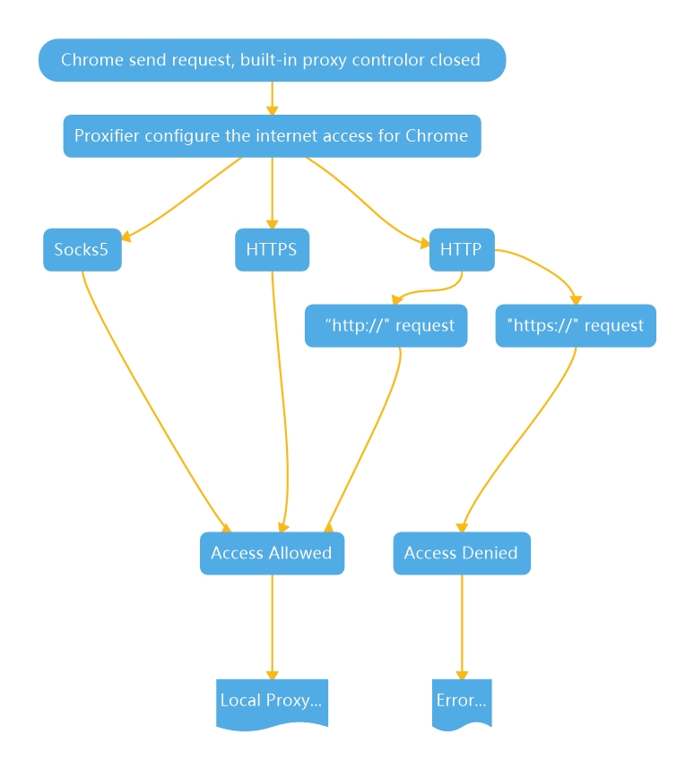
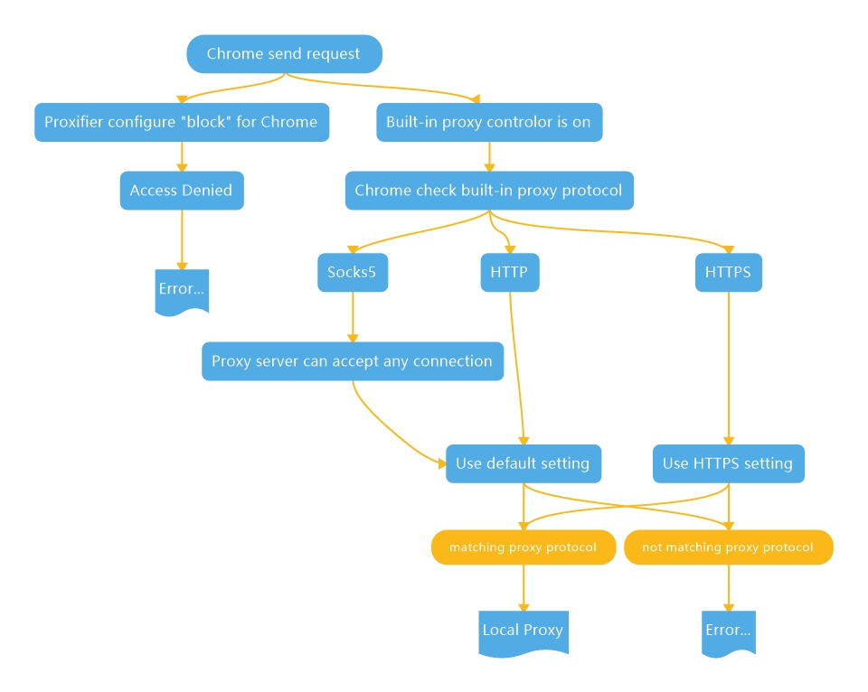

# 0. 前言

> - 本编是关于Proxifier与SwitchOmega中HTTP协议细节的解析，两者不是完全相同的。

# 1. ShadowsocksR

1. Sock5工作原理
   - Socks5客户端 <=socks5=> **Socks5服务器(代理服务器)** <=正常请求=> 目标主机
   - Socks5客户端在与Socks5服务器交互的整个过程是有可能暴露在整个互联网中的，因此很容易被监控到，根据协议特征也可以很容易识别出来。

2. Shadowsocks中Socks5工作原理
   - Socks5客户端 <=socks5=> **ss-local <=密文=> ss-server** <=正常请求=> 目标主机
   - Shadowsocks的处理方式是将Socks5客户端与Socks5服务器的连接提前：**Socks5协议的交互完全是在本地进行的，在网络中传输的完全是利用加密算法加密后的密文，这就很好的进行了去特征化，使得传输的数据不是很容易的被特征识别。**

3. Shadowsocks中Socks5的特点
   - **本地的ss-local**：ss-local对于Socks5客户端便是Socks5服务器，对于Socks5客户端是透明的，ss-local完成与Socks5客户端所有的交互。
   - **远程的ss-server**：ss-server对于目标主机同样也是Socks5服务器，对于目标主机是透明的，完成Socks5服务器与目标主机的所有操作。
   - **ss-local<=>ss-server**：ss-local接收到Socks5客户端发送的数据，会将数据加密，并将配置信息发送到ss-server；ss-server接收到配置信息进行权限验证，然后将数据进行解密，然后将明文发往目标主机；当目标主机响应ss-server，ss-server将接收到的数据进行解包，并将数据加密，发送到ss-local；ss-local接收到加密后的数据进行解密，再发送给Socks5客户端，这就完成了一次交互。

# 2. Proxifier

- 问题：为什么proxifier中http协议不能代理https://请求？

1. proxifier中的HTTPS协议（protocol）

> HTTPS — HTTP proxy with SSL support for arbitrary ports.
>
> HTTPS — 任意端口上都具备SSL支持的”HTTP代理“。

2. proxifier中的HTTP协议（protocol）

> It is a common misconception to confuse HTTP proxy and HTTPS proxy. HTTP  proxy servers can process HTTP connections (port 80). They can also support  HTTPS connections (SSL) but usually such connections are only allowed on port  443 (the standard port for HTTPS). 
>
> 混淆”HTTP代理“和”HTTPS代理“是较为常见错误想法。“HTTP代理服务器”可以处理HTTP连接（端口80）。它们也同时支持HTTPS连接（SSL），但通常这样的连接只在端口443（标准的HTTPS端口）中被允许。
>
> For example this is the default configuration  for Squid and Microsoft ISA proxy servers. **If an HTTP proxy allows HTTPS  connections on arbitrary ports, it can be called HTTPS proxy server (also called  CONNECT or SSL proxy).** In this case it can be used for generic TCP connections  like SOCKS v4/5 proxy.
>
> 举个例子，以下是Squid和Microsoft ISA代理服务器的默认配置：**如果一个“HTTP代理“允许在其任意端口上进行HTTPS连接，那么它可以被称为一个“HTTPS代理服务器（也被称为CONNECT或SSL代理）。**在这种情况下，它也可以用于像SOCKS v4/5这样的通用TCP连接。
>
> Proxifier can work with HTTP proxy servers that do not support HTTPS on  arbitrary ports. Due to the technical limitation of this protocol it is only  possible to process HTTP connections with such proxy servers. 
>
> Proxifier可以与在任意端口上都不支持HTTPS连接的“HTTP代理服务器”一起工作。由于该协议技术上的限制，这样的代理服务器只能处理HTTP连接。

3. 综述：HTTPS是在HTTP基础上的一个“增量”操作，可以理解为继承。HTTP支持的，HTTPS都支持，只HTTPS比HTTP更安全，因为多了一层SSL/TSL加密。
   - 当选择使用的协议为HTTPS的时候，该“HTTPS代理服务器”也就符合以下的配置：<u>**（论点未必是事实，但proxifier只关心结论。）**</u>
     - 目标（本地）代理服务器是一个HTTP代理服务器，**结论：可以处理HTTP连接；**
     - 目标（本地）代理服务器在任意端口上都支持HTTPS（SSL）连接，**结论：可以处理<u>所有的</u>HTTPS连接。**
   - 当选择使用的协议为HTTP的时候，该“HTTP代理服务器”也就符合以下的配置：<u>**（论点未必是事实，但proxifier只关心结论。）**</u>
     - 目标（本地）代理服务器是传统意义上的HTTP代理服务器，**结论：可以处理HTTP连接；**
     - 目标（本地）代理服务器在任意端口上都不支持HTTPS（SSL）连接，**结论：无法处理<u>任何的</u>HTTPS连接（包括443端口的HTTPS连接）。**

4. Proxifier中的协议仅仅是一种限制，和“目标（本地）代理服务器”本身所支持的协议无关。
   - 我所采用的ShadowsocksR支持Socks5协议，同时也支持HTTP协议（支持端口443的HTTPS协议）；
   - proxifier中的协议规则更像是一种对进入该Socks5代理服务器的“限制操作”。
     - 例：如果我进行了“https://”的访问，但是我的proxifier中代理服务器协议选择为http，那么此时proxifier将不会接受来自于浏览器的“https://”的访问请求，那么这个请求自然不会被转发到本地的代理服务器上。

5. 结论
   - **只要是proxifier协议结论的任何请求，都会“被放行”至目标（本地）代理服务器；**
   - **目标（本地）代理服务器支持SOCKS5，因此等同于所有“被放行”的请求它都能够处理。**

# 3. Chrome

- 问题：为什么SwitchyOmega中不能使用HTTPS协议？

1. Chrome中的代理细节
   - SwitchyOmega 并没有实现任何协议层的东西，协议层的东西都只是 Chrome 的内部实现：
     - 以用户访问的目标网站协议不同（http, https），浏览器可以按需选择不同的代理方式，其中 http 走明文传输请求，https 要走 TCP，只能用 CONNECT。
     - 以浏览器连接的代理服务器提供的协议不同，可以有 http, https 代理服务器。

|                 | HTTP 代理服务器                          | HTTPS 代理服务器                          |
| --------------- | ---------------------------------------- | ----------------------------------------- |
| 代理 HTTP 访问  | client `-HTTP->` proxy` -HTTP->` server  | client `-HTTPS->` proxy `-HTTP->` server  |
| 代理 HTTPS 访问 | client `-HTTP->` proxy` -HTTPS->` server | client `-HTTPS->` proxy `-HTTPS->` server |

- **注：proxy代表ss-local <=密文=> ss-server**

只要是代理 HTTPS 访问，浏览器与代理服务器之间只能用 CONNECT 方法；当然，如果你愿意，代理 HTTP 访问也是可以用 CONNECT 方法的，但是这样并不经济，因为 RTT 比前者多。

2. ShadowsocksR
   - ShadowsocksR支持Socks5协议，同时也支持HTTP协议（支持端口443的HTTPS协议）。
   - 因此可以解析直接解析“https://”也是正确的，大多数的“https://"都是443端口的。

3. Chrome中使用代理的访问流程

   1. Chrome根据SwitchyOmega中设定的本地代理服务器（ss-local）协议，而选择以不同的方式与本地代理服务器（ss-local）进行交互；

   2. 远程代理服务器（ss-server）根据Chrome发送的请求头中包含的目标Host来决定使用什么协议访问目标Host；

   3. 本地代理服务器（ss-local）和远程代理服务器（ss-server）的交互是加密的；

4. 综述

- 问题：为什么无法在SwitchyOmega中使用HTTPS协议？

- 猜想1：Chrome拥有一种发送请求的“默认方式”，适用于HTTP代理（允许443端口的HTTPS连接）、SOCKS5代理。
  1. 首先，使用proxifier的时候，Chrome实际上是不知道代理类型的，访问“https://”的时候就采用“默认方式”发送请求，此时proxifier中的协议只担当一种规则过滤器的角色，你的请求符合规则，那么你就可以连接到本地的代理服务器，接着代理服务器也可以接收Chrome采用“默认方式”发送的请求；

  2. 以上情况可以类比成，没有proxifier、switchyomega代理关闭、Shadowsocks全局/PAC代理的情况下，浏览器进行“https://”访问，此时Chrome也不知道代理服务器的类型，但是它可以与本地代理服务器进行交互；

  3. 其次，Chrome会读取内置代理SwitchyOmega中的配置信息，对不同的“代理协议”做出相应的请求调整：
     - SwitchyOmega中代理协议设置为HTTP的情况下，能访问“https://”是因为HTTP代理服务器原本也支持443端口的HTTPS连接，而许多的“https://”采用的都是443端口，毋庸置疑是可以访问的；
       - 以上这种情况，和ShadowsocksR全局模式下，浏览器直接访问“https://”是不一样的，因为上述情况已经明确告知Chrome要连接的代理服务器为HTTP协议；
       - 而全局模式下，ShadowsocksR使用了混合协议，访问“https://”是没有问题的，几乎可以通过代理访问任何的网页；
     - SwitchyOmega中代理协议设置为HTTPS的情况下，等于告知了Chrome所有的连接采用HTTPS协议进行请求，浏览器将向目标（本地）代理服务器发送采用HTTPS协议的连接请求，但是目标（本地）代理服务器（ss-local）不支持HTTPS协议。

- 猜想2：Chrome会检查当前SwitchyOmega中设置的代理的可用性。
  - ShadowsocksR支持Socks5协议，同时也支持HTTP协议（支持端口443的HTTPS协议），但不支持HTTPS协议：
    - 如果Chrome中存在预先检查机制的话，Socks5协议与HTTP协议的配置会通过内置的检测机制，但是HTTPS协议的配置会报错；
    - 连接会依旧尝试连接，但是该配置的代理已经是无用的状态了。

