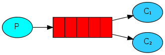
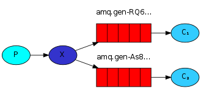
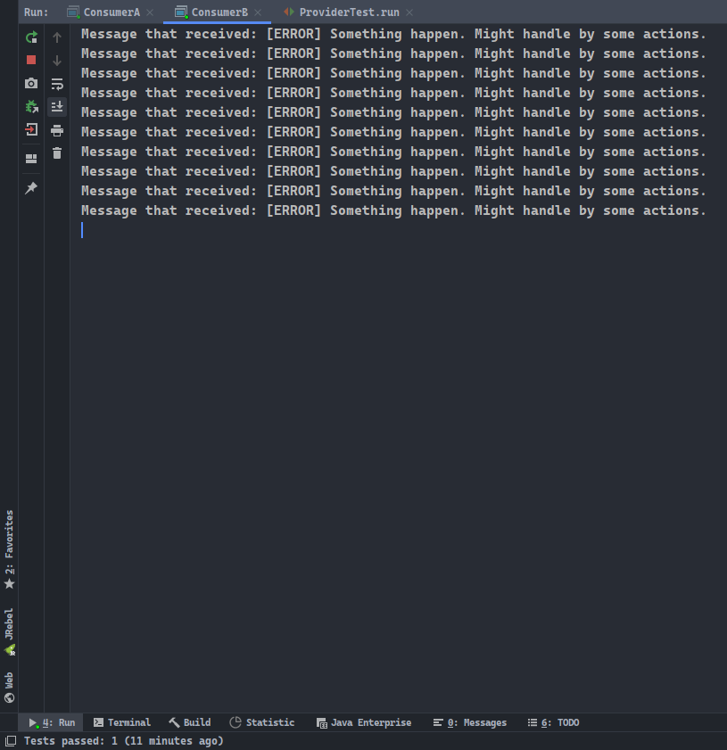

# 简介

本篇将仔细地入门`RabbitMQ`消息队列。

# 疑点梳理

`RabbitMQ`本质上是一个队列，一个`FIFO`的数据结构，其重点是：<u>原生的消息队列之间传输的是字节数据</u>。

对象如何转换为字节数据？可以通过两种方式：

1. 对于普通的`pojo`对象来说，有专门的工具类可以将其转换为`JSON`形式的字符串数据；反之，如果是`JSON`形式的字符串数据，也可以通过工具类获的对应的`Map`对象。而字符串可以通过其公共的`String#getBytes(String)`方法，得到字符串指定字符集的字节数据，注意字符到字节数据的过程是编码，字节数据到字符的过程是解码；
2. 其次，对于任意的对象来说，都可以通过对象输出流`ObjectOutputStream`、字节数组输出流`ByteArrayOutputStream`组合的方式，将对象转换为字节数组，获取字节数组之后必然可以通过创建`String`对象的方式，获取到指定字符集解码得到的字符串对象。

两种方式有什么不一样的地方呢？

1. 第一种方式只能转换`pojo`对象，但获取得到的`JSON`数据是直观的；
2. 第二种方式则能够转换任意的对象，但获取得到的数据是不直观的。

两种方式的共同点是，得到的数据进行反序列化的时候，必须要当前的环境中存在对应的类文件，才能顺利完成类型转换的操作。

简单的对象序列化为字符串及其反序列化的代码：

```java
public class Serializer<T> {

    @Test
    public void test() {
        Serializer<Person> serializer = new Serializer<>();
        Person person = new Person("rose", 12, "female");

        String str = serializer.serialize(person); // 序列化成字符串，就可以写入数据库了
        Person result = serializer.deserialize(str); // 反序列化得到对象

        Assert.assertEquals(person.name, result.name);
        Assert.assertEquals(person.age, result.age);
        Assert.assertNull(result.sexual);
    }

    private String serialize(T t) {
        byte[] bytes = null;
        try (ByteArrayOutputStream baos = new ByteArrayOutputStream();
             ObjectOutputStream oos = new ObjectOutputStream(baos)) {

            oos.writeObject(t);
            bytes = baos.toByteArray();
        } catch (IOException e) {
            e.printStackTrace();
        }

        assert bytes != null;
        return new String(bytes, StandardCharsets.ISO_8859_1); // 采用UTF-8可能导致字节无法解码成字符
    }

    private T deserialize(String str) {
        T t = null;
        byte[] bytes = str.getBytes(StandardCharsets.ISO_8859_1); // 采用UTF-16会使得头两位插入无用的标志数据
        try (ByteArrayInputStream bais = new ByteArrayInputStream(bytes);
             ObjectInputStream ois = new ObjectInputStream(bais)) {

            t = (T) ois.readObject();
        } catch (IOException | ClassNotFoundException e) {
            e.printStackTrace();
        }
        return t;
    }

    private static class Person implements Serializable {
        private String name;
        private Integer age;
        private transient String sexual;

        private Person(String name, Integer age, String sexual) {
            this.name = name;
            this.age = age;
            this.sexual = sexual;
        }
    }
}
```

但对于`SpringBoot`中的`RabbitTemplate`来说，使用其方法`convertAndSend(..)`所提供的消息类型为`Object`。这意味着所有类型的数据都支持传输，它可以是任意的对象。其意味着`SpringBoot`中内置了对象转换为字节数据、字节数据转换为对象的方法，只需要对应的`@RabbitListener`注解的方法能处理同类型的数据即可。

# 入门实例

入门实例是最简单的消息队列示例，生产者发布消息，通过消息队列，由消费者进行接收。


本篇所有代码需要在已安装`RabbitMQ`的情况下运行，安装过程不再演示。

关于创建用户`user`及虚拟机`virtual hosts`的操作：


最后为指定的用户`dylan`赋予访问指定虚拟机`/lesson_01`的权限：


注意，`RabbitMQ`中的虚拟机`virtual hosts`并不是传统意义上虚拟机的意思，你可以理解为存放队列的独立空间，它更像是一个队列空间的存在。

## 1. 导入依赖

创建普通的`Maven`项目即可。

```xml
<!-- rabbitmq消息队列 -->
<dependency>
    <groupId>com.rabbitmq</groupId>
    <artifactId>amqp-client</artifactId>
    <version>5.9.0</version>
</dependency>
<!-- 连接日志门面slf4j -->
<dependency>
    <groupId>org.apache.logging.log4j</groupId>
    <artifactId>log4j-slf4j-impl</artifactId>
    <version>2.13.3</version>
</dependency>
<!-- 日志实现log4j2 -->
<dependency>
    <groupId>org.apache.logging.log4j</groupId>
    <artifactId>log4j-core</artifactId>
    <version>2.13.3</version>
</dependency>
```

## 2. 相关配置

日志实现`log4j2`配置文件：

```xml
<?xml version="1.0" encoding="UTF-8"?>
<Configuration status="OFF" monitorInterval="5">
    <properties>
        <property name="pattern">[%d{yyyy-MM-dd HH:mm:ss.SSS}] [%-5level] %l%c{36} - %m%n</property>
        <property name="logFile">d:/logs</property>
    </properties>

    <Appenders>
        <Console name="console" target="SYSTEM_OUT">
            <PatternLayout pattern="%d{HH:mm:ss.SSS} [%t] [%-5level] %c{36}:%L - %m%n"/>
        </Console>

        <!-- 实际上未使用到文件输出 -->
        <File name="file" fileName="${logFile}/log4j2.log">
            <ThresholdFilter level="DEBUG" onMatch="ACCEPT" onMismatch="DENY"/>
            <PatternLayout pattern="${pattern}"/>
        </File>
    </Appenders>

    <Loggers>
        <Root level="INFO">
            <AppenderRef ref="console"/>
            <!--<AppenderRef ref="file"/>-->
        </Root>
    </Loggers>
</Configuration>
```

消息队列`RabbitMQ`连接参数文件：

```properties
# 可以选择性将rabbitmq的连接参数放置在.properties中
host=127.0.0.1
port=5672
username=dylan
password=123456
virtualHost=/lesson_01
```

## 3. 工具类

由于获取消息队列连接对象`Connection`的代码比较繁琐，我们可以使用`RabbitmqUtils`的方式获取。

`RabbitmqUtils`工具类的代码如下：

```java
package cn.dylanphang.rabbitmq.util;

import com.rabbitmq.client.Channel;
import com.rabbitmq.client.Connection;
import com.rabbitmq.client.ConnectionFactory;

import java.io.IOException;
import java.io.InputStream;
import java.util.Properties;
import java.util.concurrent.TimeoutException;

/**
 * @author dylan
 * @date 2020/12/13
 */
public class RabbitmqUtils {

    private static ConnectionFactory factory;

    static {
        try (InputStream is = RabbitmqUtils.class.getClassLoader().getResourceAsStream("rabbitmq.properties")) {

            Properties properties = new Properties();
            properties.load(is);

            String host = properties.getProperty("host");
            Integer port = Integer.valueOf(properties.getProperty("port"));
            String username = properties.getProperty("username");
            String password = properties.getProperty("password");
            String virtualHost = properties.getProperty("virtualHost");

            factory = new ConnectionFactory();
            factory.setHost(host);
            factory.setPort(port);
            factory.setUsername(username);
            factory.setPassword(password);
            factory.setVirtualHost(virtualHost);

        } catch (IOException e) {
            e.printStackTrace();
        }
    }

    public static Connection getConnection() {
        try {
            return factory.newConnection();
        } catch (IOException | TimeoutException e) {
            e.printStackTrace();
        }
        return null;
    }

    public static void close(Channel channel, Connection connection) {
        if (channel != null) {
            try {
                channel.close();
            } catch (IOException | TimeoutException e) {
                e.printStackTrace();
            }
        }
        if (connection != null) {
            try {
                connection.close();
            } catch (IOException e) {
                e.printStackTrace();
            }
        }
    }
}
```

## 4. 测试运行

消息发布者`provider`：
1. 使用连接对象`connection`获取到的通道`channel`，其使用`queueDeclare`的方式声明了一个队列：
   1. 参数-1：队列名称，如果该队列不存在，会创建该队列，如果存在同名队列，会检查该队列是否符合要求，否则报错；
   2. 参数-2：是否可持久化，该参数决定了重启`RabbitMQ`服务器后，队列是否仍然存在；
   3. 参数-3：是否排他，即是否允许多个消费者连接到此队列，多数情况下使用`false`；
   4. 参数-4：是否自动删除，当队列中不再有消息且无消费者连接到此队列时，是否自动删除此队列；
   5. 参数-5：未知。
2. 其中`basicPublish`方法进行了消息的发布操作：
   1. 参数-1：交换机名称，如果不存在交换机`exchange`，则传入空字符串；
   2. 参数-2：队列名称；
   3. 参数-3：消息属性，指定发布消息的属性；
   4. 参数-4：以`byte[]`形式传输的消息。

```java
package cn.dylanphang.rabbitmq.provide;

import cn.dylanphang.rabbitmq.util.RabbitmqUtils;
import com.rabbitmq.client.Channel;
import com.rabbitmq.client.Connection;

import java.io.IOException;
import java.nio.charset.StandardCharsets;

/**
 * @author dylan
 * @date 2020/12/13
 */
public class SimpleProvider {
    public static void main(String[] args) throws IOException {
        // 1.获取连接对象
        Connection connection = RabbitmqUtils.getConnection();
        if (null == connection) {
            return;
        }

        // 2.使用连接对象创建通道，并指定对应的队列queue
        Channel channel = connection.createChannel();
        channel.queueDeclare("hello", false, false, false, null);

        // 3.发布消息
        channel.basicPublish("", "hello", null, "Here is lesson one.".getBytes(StandardCharsets.UTF_8));

        // 4.释放资源
        RabbitmqUtils.close(channel, connection);
    }
}
```

消息接收者`consumer`：
1. 在此`consumer`中保留了原始为获取连接所需要编写的代码，作为参考；
2. 使用`queueDeclare`时需要保证获取消息的队列`hello`拥有相同的参数配置；
3. 其中`basicConsume`方法进行了消息的接收操作：
   1. 参数-1：队列名称；
   2. 参数-2：是否自动确认消息；
   3. 参数-3：消费者对象，用于完成处理消息等后续操作。
4. 对于消费者来说，一般不需要对通道`channel`和连接`connection`进行资源释放操作。

```java
package cn.dylanphang.rabbitmq.consume;

import com.rabbitmq.client.*;
import org.slf4j.Logger;
import org.slf4j.LoggerFactory;

import java.io.IOException;
import java.util.concurrent.TimeoutException;

/**
 * @author dylan
 * @date 2020/12/13
 */
public class Consumer {
    public final static Logger LOGGER = LoggerFactory.getLogger(Consumer.class);

    public static void main(String[] args) throws IOException, TimeoutException {
        // 1.获取连接工厂，并使用连接工厂设置主机地址、端口、用户名、密码及虚拟主机名称等信息
        ConnectionFactory factory = new ConnectionFactory();
        factory.setHost("127.0.0.1");
        factory.setPort(5672);
        factory.setUsername("dylan");
        factory.setPassword("123456");
        factory.setVirtualHost("/lesson_01");

        // 2.使用连接工厂获取连接
        Connection connection = factory.newConnection();

        // 3.使用连接对象创建通道，并指定对应的队列queue
        Channel channel = connection.createChannel();
        channel.queueDeclare("hello", false, false, false, null); // 当确认存在名称为hello的队列时，可以省略此行代码

        // 4.消费消息
        channel.basicConsume("hello", true, new DefaultConsumer(channel) {
            @Override
            public void handleDelivery(String consumerTag, Envelope envelope, AMQP.BasicProperties properties, byte[] body) {
                LOGGER.info("Message that received: " + new String(body));
            }
        });

        // 5.释放资源，但对于消费者来说，一般不需要关闭资源，否则无法接收后续消息了
        // channel.close();
        // connection.close();
    }
}
```

## 5. SpringBoot

每个小节末尾都会展示如何在`SpringBoot`中去完成本节的范例。

项目依赖，在创建`SpringBoot`的时候勾选`RabbitMQ`的依赖，或手动添加：
- 注：其中排除了原有的`logging`日志模块采用了`log4j2`，因此需要自行添加`log4j2`配置文件。

```xml
<dependencies>
    <dependency>
        <groupId>org.springframework.boot</groupId>
        <artifactId>spring-boot-starter-amqp</artifactId>
        <exclusions>
            <exclusion>
                <groupId>org.springframework.boot</groupId>
                <artifactId>spring-boot-starter-logging</artifactId>
            </exclusion>
        </exclusions>
    </dependency>
    <dependency>
        <groupId>org.springframework.boot</groupId>
        <artifactId>spring-boot-starter-log4j2</artifactId>
        <version>2.4.0</version>
    </dependency>
    <dependency>
        <groupId>org.springframework.boot</groupId>
        <artifactId>spring-boot-starter-web</artifactId>
    </dependency>

    <dependency>
        <groupId>org.springframework.boot</groupId>
        <artifactId>spring-boot-starter-test</artifactId>
        <scope>test</scope>
    </dependency>
    <dependency>
        <groupId>org.springframework.amqp</groupId>
        <artifactId>spring-rabbit-test</artifactId>
        <scope>test</scope>
    </dependency>
</dependencies>
```

以下附上`log4j2.xml`及`application.yml`文件的配置详情：

```xml
<?xml version="1.0" encoding="UTF-8"?>
<Configuration status="OFF" monitorInterval="5">
    <properties>
        <property name="pattern">[%d{yyyy-MM-dd HH:mm:ss.SSS}] [%-5level] %l%c{36} - %m%n</property>
        <property name="logFile">d:/logs</property>
    </properties>

    <Appenders>
        <Console name="console" target="SYSTEM_OUT">
            <PatternLayout pattern="%d{HH:mm:ss.SSS} [%-5level] %c{36}:%L - %m%n"/>
        </Console>
    </Appenders>

    <Loggers>
        <Root level="INFO">
            <AppenderRef ref="console"/>
        </Root>
    </Loggers>
</Configuration>
```

入门案例中，不需要进行过多的配置，只需要配置`rabbitmq`的属性即可，务必自行创建虚拟机`/rabbitmq-springboot`：

```yml
spring:
  application:
    name: rabbitmq-quickstart

  rabbitmq:
    host: 127.0.0.1
    port: 5672
    username: dylan
    password: 123456
    virtual-host: /rabbitmq-springboot
```

消息生产者测试类：
1. 其中`RabbitTemplate`模板对象是`SpringBoot`提供给我们的，可以直接注入并使用该对象进行消息的发布；
2. 方法`convertAndSend`中参数`1`为队列名称，参数`2`为消息主体。

```java
package cn.dylanphang.rabbitmq;

import org.junit.jupiter.api.Test;
import org.springframework.amqp.rabbit.core.RabbitTemplate;
import org.springframework.beans.factory.annotation.Autowired;
import org.springframework.boot.test.context.SpringBootTest;

@SpringBootTest
class RabbitmqApplicationTests {

    @Autowired
    private RabbitTemplate rabbitTemplate;

    @Test
    void testQuickstart() {
        this.rabbitTemplate.convertAndSend("hello", "Quick Start.");
    }

}
```

消息消费者：
1. 注解`@RabbitListener`可以作用于类或方法上，用于队列声明或交换机绑定，本示例只起到了队列声明的作用；
2. 务必保证虚拟机中没有同名的队列存在，如果同名则需要保证相关配置参数一致，否则都会出现异常；
3. 注解`@RabbitHandler`标注在方法上，表明该方法是一个消费者；
4. 消费者方法中的形参`String message`为该消费者接收到的信息，这里不仅仅只能传入一个形参。

```java
package cn.dylanphang.rabbitmq.listener.quickstart;

import org.slf4j.Logger;
import org.slf4j.LoggerFactory;
import org.springframework.amqp.rabbit.annotation.Queue;
import org.springframework.amqp.rabbit.annotation.RabbitHandler;
import org.springframework.amqp.rabbit.annotation.RabbitListener;
import org.springframework.stereotype.Component;

/**
 * 使用注解@RabbitListener创建的队列默认情况下是持久化的、非独占的、非自动删除的队列。
 * 在确保没有同名队列存在的情况下，可以更改队列的参数。如果存在同名队列，会去使用该队列并忽视配置的参数。
 *
 * @author dylan
 * @date 2020/12/15
 */

@RabbitListener(queuesToDeclare = @Queue(name = "hello", durable = "true", exclusive = "false", autoDelete = "true"))
@Component
public class QuickStart {

    private static final Logger LOGGER = LoggerFactory.getLogger(QuickStart.class);

    /**
     * 如果类中仅有一个用于处理消息的消费者，可以将@RabbitListener的注解放置在类上，同时使用@Rabbithandler去标记该消费者。
     *
     * @param message 接收的消息
     */
    @RabbitHandler
    public void receive(String message) {
        LOGGER.info("Receive message: " + message);
    }
}
```

测试结果：


# 工作队列（Work Queue）

入门案例中，有且仅存在一个消费者。实际上，消息队列允许多个消费者存在，它们就像是工人一样，会有序地在队列中获取消息，这种多消费者存在的模式也被称为工作队列。



`Work Queue`模式下，每一个消费者`Consumer`都会有序地从队列中获取消息，消息是不会被重复分配到不同的消费者中的，即消息有且仅会被一个消费者消费。

相关`Maven`依赖配置不再复述，以下将直接展示相关`RabbitMQ`的代码。

## 1.消息生产者

消费者测试类代码如下：
1. 关注到创建或获取队列`hello`时，我们使用的是可持久化队列，即参数`2`为`true`；
2. 其次在`basicPublish`中的参数`3`设置为`MessageProperties.PERSISTENT_TEXT_PLAIN`，即消息文本为可持久化的；
3. 以上两点必须同时设置，才能保证在重启`RabbitMQ`后，队列与队列中承载的所谓未处理消息仍然存在。

```java
package cn.dylanphang.rabbitmq.provide;

import cn.dylanphang.rabbitmq.util.RabbitmqUtils;
import com.rabbitmq.client.Channel;
import com.rabbitmq.client.Connection;
import com.rabbitmq.client.MessageProperties;
import org.junit.After;
import org.junit.Before;
import org.junit.Test;

import java.io.IOException;
import java.nio.charset.StandardCharsets;

/**
 * @author dylan
 * @date 2020/12/13
 */
public class ProviderTest {
    private Connection connection;
    private Channel channel;

    private static final int RUN_TIMES = 20;

    @Test
    public void run() throws IOException {
        for (int i = 1; i <= RUN_TIMES; i++) {
            // *.发布消息
            channel.basicPublish(
                    "",
                    "hello",
                    MessageProperties.PERSISTENT_TEXT_PLAIN,
                    ("Here is ProviderTest." + i).getBytes(StandardCharsets.UTF_8)
            );
        }
    }

    @Before
    public void init() throws IOException {
        // 1.获取连接对象
        this.connection = RabbitmqUtils.getConnection();
        if (null == this.connection) {
            return;
        }

        // 2.使用连接对象创建通道，并指定对应的队列queue
        this.channel = this.connection.createChannel();
        this.channel.queueDeclare("hello", true, false, false, null);
    }

    @After
    public void destroy() {
        // *.释放资源
        RabbitmqUtils.close(this.channel, this.connection);
    }
}
```

运行代码后，可以看到`RabbitMQ`的管理中心`Management`里，队列选项卡中所示：
1. 关注到`features`中被标注了字母`D`，表明该队列是持久化`durable`队列；
2. 其次`Ready`中为`20`，即当前队列中存在`20`条未处理消息。


但本次实验是需要先开启消费者端，如果先开启生产者端，积攒的消息会在任一消费者上线后被立即消费。实验存在两个消费者，如果前者消费速度较快，则后启动的消费者即使上线了，也可能无法获取到消息。

另外是关于消息自动确认机制，后续会提及。消息的自动确认机制，会导致先上线的消费者即使消费速度较慢的情况下，也会获取当前队列中所有消息的处理权。

## 2. 消息消费者

本次将使用`ConsumerA`与`ConsumerB`作为消息的消费者，代码如下：
1. 关于`channel.queueDeclare()`的使用，如果此前已经存在了指定的队列`hello`，则在生产者或消费者的代码中，可以不显式地声明队列`hello`，生产者或消费者会默认去寻找同名队列并使用它；
2. 假如在生产者或消费者运行前，不存在相关的同名队列，则需要显式地声明队列及其属性；
3. 如果相关同名队列的属性不符合消费者的要求，则需要考虑让队列使用其他的名字。

```java
package cn.dylanphang.rabbitmq.consume;

import cn.dylanphang.rabbitmq.util.RabbitmqUtils;
import com.rabbitmq.client.*;
import org.slf4j.Logger;
import org.slf4j.LoggerFactory;

import java.io.IOException;
import java.util.concurrent.TimeoutException;

/**
 * @author dylan
 * @date 2020/12/13
 */
public class ConsumerX {
    public final static Logger LOGGER = LoggerFactory.getLogger(ConsumerA.class);

    public static void main(String[] args) throws IOException, TimeoutException {
        // 1.获取连接对象
        Connection connection = RabbitmqUtils.getConnection();
        if (null == connection) {
            return;
        }

        // 2.使用连接对象创建通道，并指定对应的队列queue
        Channel channel = connection.createChannel();
        
        // 在确认存在符合要求的队列hello的情况下，可以省略队列声明代码
        // channel.queueDeclare("hello", true, false, false, null);

        // 3.消费消息
        channel.basicConsume("hello", true, new DefaultConsumer(channel) {
            @Override
            public void handleDelivery(String consumerTag, Envelope envelope, AMQP.BasicProperties properties, byte[] body) {
                LOGGER.info("Message that received: " + new String(body));
            }
        });
    }
}
```

两个消费者的代码是完全一致的。

启动`ConsumerA`和`ConsumerB`，之后再运行`ProviderTest`，观察控制台输出：


可以看到，消息基本上被平均地发布到了`ConsumerA`和`ConsumerB`上。

`RabbitMQ`默认情况下的消息分配机制是平均分配，其分配的数量与消费者处理消息的效率无关。即当有两个消费者在线上时，消息总是会平均且有序地分配到消费者中。

## 3. 处理数量与手动确认

由于默认采用平均的方式分配消息，同时队列开启了自动确认消息已被处理的功能，会导致两个问题：
1. 一旦某个消费者处理消息缓慢，则达不到最高的效率；
2. 一旦某个消费者处理消息中宕机，因为已经自动确认消息被处理了，会导致消息数据的丢失。

解决方法，需要同时关闭自动确认消息的功能且限制消费者一次处理消息的数量，同时由于关闭了消息的自动确认功能，需要在代码中编写手动的确认消息的代码：
1. `channel.basicQos(1);`：限制消费者一次处理的消息数量；
2. `channel.basicConsume("hello", false, ...)`：关闭消息自动确认；
3. `channel.basicAck(envelope.getDeliveryTag(), false);`：开启消息手动确认。

修改消费者代码，其中`ConsumerA`中模拟处理缓慢的情况，而`ConsumerB`中正常处理消息，代码如下：
1. 如果只开启了一次处理消息数量的限制，但未关闭消息自动确认，则消费者仍会在消息收到的一瞬间自动确认该消息已被处理并准备好接收下一条消息，相当于没有进行任何设置；
2. 如果只开启手动确认，由于未限制消费者处理消息的数据量，`RabbitMQ`仍然会根据平均的原则，将消息分配给消费者，即`Ready`显示为`0`，控制台中会看到`Unacked`数目缓慢降低的情况，即处理缓慢；
3. 综上，即需要同时限制消费者一次处理消息的数量，同时关闭自动确认功能，开启手动确认，才能达到最高的效率，此时控制台中表现为`Ready`和`Unacked`均为`0`的情况，而实际中性能较好的消费者处理了更多的消息。

```java
package cn.dylanphang.rabbitmq.consume;

import cn.dylanphang.rabbitmq.util.RabbitmqUtils;
import com.rabbitmq.client.*;
import org.slf4j.Logger;
import org.slf4j.LoggerFactory;

import java.io.IOException;
import java.util.concurrent.TimeoutException;

/**
 * @author dylan
 * @date 2020/12/13
 */
public class ConsumerA {
    public final static Logger LOGGER = LoggerFactory.getLogger(ConsumerA.class);

    public static void main(String[] args) throws IOException, TimeoutException {
        // 1.获取连接对象
        Connection connection = RabbitmqUtils.getConnection();
        if (null == connection) {
            return;
        }

        // 2.使用连接对象创建通道，并指定对应的队列queue
        Channel channel = connection.createChannel();

        // 3.设置此消费者每次仅处理一条消息
        channel.basicQos(1);

        // 4.消费消息
        channel.basicConsume("hello", false, new DefaultConsumer(channel) {
            @Override
            public void handleDelivery(String consumerTag, Envelope envelope, AMQP.BasicProperties properties, byte[] body) throws IOException {
                // *.模拟处理缓慢的情况
                try {
                    Thread.sleep(3000);
                } catch (InterruptedException e) {
                    e.printStackTrace();
                }
                LOGGER.info("Message that received: " + new String(body));

                // 5.手动确认
                channel.basicAck(envelope.getDeliveryTag(), false);
            }
        });
    }
}
```

```java
package cn.dylanphang.rabbitmq.consume;

import cn.dylanphang.rabbitmq.util.RabbitmqUtils;
import com.rabbitmq.client.*;
import org.slf4j.Logger;
import org.slf4j.LoggerFactory;

import java.io.IOException;
import java.util.concurrent.TimeoutException;

/**
 * @author dylan
 * @date 2020/12/13
 */
public class ConsumerB {
    public final static Logger LOGGER = LoggerFactory.getLogger(ConsumerB.class);

    public static void main(String[] args) throws IOException, TimeoutException {
        // 1.获取连接对象
        Connection connection = RabbitmqUtils.getConnection();
        if (null == connection) {
            return;
        }

        // 2.使用连接对象创建通道，并指定对应的队列queue
        Channel channel = connection.createChannel();

        // 3.设置此消费者每次仅处理一条消息
        channel.basicQos(1);

        // 4.消费消息
        channel.basicConsume("hello", false, new DefaultConsumer(channel) {
            @Override
            public void handleDelivery(String consumerTag, Envelope envelope, AMQP.BasicProperties properties, byte[] body) throws IOException {
                LOGGER.info("Message that received: " + new String(body));

                // 5.手动确认
                channel.basicAck(envelope.getDeliveryTag(), false);
            }
        });
    }
}
```

再次启动`ConsumerA`和`ConsumerB`，之后运行`ProviderTest`，观察控制台输出：
- 注：此处修改了控制台日志输出的格式，去除了线程名称信息的显示。


可以看到，消息不再是平均分配，并且效率更高的`ConsumerB`处理了更多的消息。

## 4. 本节小结

关于队列的声明`queueDeclare()`，如果在生产者或消费者运行前，存在同名且符合要求的队列，则在代码中可以省略该声明；如果存在的同名队列不符合要求或不存在同名队列，则需要进行显式地队列声明，队列不可与已存在的队列同名。

工作队列拥有多个消费者`Consumer`，默认情况下`Provider`会根据公平的原则进行消息的分配。

如果希望更有效率地进行消息的消费，则需要进行配置：
1. 让消费者每次仅处理一条消息；
2. 关闭消息自动确认，改为手动确认。

## 5. SpringBoot

此小小节将演示公平分配的情况下`SpringBoot`如何配置，以及追求效率的情况下`SpringBoot`应该如何配置。

### 1. 默认分配

`RabbitMQ`默认情况下的消息分配是采用平均的机制，关于日志配置等不再赘述，以下将直接贴代码及部分讲解排雷。

`application.yml`配置如下：

```yml
spring:
  application:
    name: rabbitmq-quickstart

  rabbitmq:
    host: 127.0.0.1
    port: 5672
    username: dylan
    password: 123456
    virtual-host: /rabbitmq-springboot
```

消息生产者测试类：
1. 务必保证名为`work`的队列是存在的，如果不存在则会默认创建该队列，队列默认是可持久化、非排它、非自动删除队列；
2. 在`@Test`中，如果不存在该队列，是不会自动创建的，实际生产过程中生产者是不会在测试类中的。

```java
package cn.dylanphang.rabbitmq;

import org.junit.jupiter.api.Test;
import org.springframework.amqp.rabbit.core.RabbitTemplate;
import org.springframework.beans.factory.annotation.Autowired;
import org.springframework.boot.test.context.SpringBootTest;

@SpringBootTest
class RabbitmqApplicationTests {

    @Autowired
    private RabbitTemplate rabbitTemplate;

    @Test
    void testWorkQueue() {
        for (int i = 1; i <= 20; i++) {
            this.rabbitTemplate.convertAndSend("work", "Work Queue." + i);
        }
    }

}
```

消息队列新建：

1. 如果不想使用代码创建名为`work`的消息队列，那么可以自行在对应的`/rabbitmq-springboot`虚拟机中创建该队列；
2. 由于实例使用的是`@SpringBootTest`，那么意味着项目的测试会伴随着`SpringBoot`项目的启动，因此配置类也会被加载。在`SpringBoot`中，队列的创建使用的是`@Configuration`配置类，消息队列的创建被视为`Queue`的`Bean`对象的创建。因此，可以编写对应的配置类，用于新建消息队列。

```java
@Configuration
public class RabbitmqConfig {

    private static final String QUEUE_NAME = "work";

    /**
     * 新建消息队列，用于@RabbitListener注解的类或方法接收信息。
     *
     * @return Queue
     */
    @Bean(QUEUE_NAME)
    public Queue orderQueue() {

        // *.使用默认方法创建的消息队列是可持久化、非排它、非自动删除的队列
        return new Queue(QUEUE_NAME);
    }
}
```

消息消费者：

- 当存在两个以上消费者时，点对点的消息发布，注解`@RabbitListener`需要写在方法上。

```java
package cn.dylanphang.rabbitmq.listener.workqueue;

import org.slf4j.Logger;
import org.slf4j.LoggerFactory;
import org.springframework.amqp.rabbit.annotation.Queue;
import org.springframework.amqp.rabbit.annotation.RabbitListener;
import org.springframework.stereotype.Component;

/**
 * 使用工作队列模式，需要将@RabbitListener标记在方法上。
 *
 * @author dylan
 * @date 2020/12/15
 */
@Component
public class WorkQueue {

    private static final Logger LOGGER = LoggerFactory.getLogger(WorkQueue.class);

    @RabbitListener(queuesToDeclare = @Queue("work"))
    public void workerA(String message) {
        LOGGER.info("WorkerA receive message: " + message);
    }

    @RabbitListener(queuesToDeclare = @Queue("work"))
    public void workerB(String message) {
        LOGGER.info("WorkerB receive message: " + message);
    }
}
```

测试结果：


### 2. 手动确认

- 从上小节中，不难看出默认分配是遵循轮询原则的。
- 此时如果`WorkerA`中存在延时`3`秒的操作，我们希望在空闲时`WorkerB`能够继续工作，则需要手动确认消息。
- 此时需要更改`application.yml`配置如下：
  1. `prefetch`：每次从生产者中取用消息的条目；
  2. `acknowledge-mode`：消息确认模式，选择手动`manual`。

```yml
spring:
  application:
    name: rabbitmq-quickstart

  rabbitmq:
    host: 127.0.0.1
    port: 5672
    username: dylan
    password: 123456
    virtual-host: /rabbitmq-springboot

    listener:
      simple:
        prefetch: 1
        acknowledge-mode: manual
```

- 消息生产者测试类：
  - 同样务必保证`work2`队列的可用性。

```java
package cn.dylanphang.rabbitmq;

import org.junit.jupiter.api.Test;
import org.springframework.amqp.rabbit.core.RabbitTemplate;
import org.springframework.beans.factory.annotation.Autowired;
import org.springframework.boot.test.context.SpringBootTest;

@SpringBootTest
class RabbitmqApplicationTests {

    @Autowired
    private RabbitTemplate rabbitTemplate;

    @Test
    void testWorkQueue2() {
        for (int i = 1; i <= 20; i++) {
            this.rabbitTemplate.convertAndSend("work2", "Work Queue." + i);
        }
    }

}
```

- 消息消费者：
  1. 在`WorkerA`中我们设置了程序睡眠`3000`毫秒，模拟处理缓慢的情况；
  2. 此时消费者的形参发生了变化，因为手动确认需要使用`Channel`对象，因此形参中添加了`Channel channel`；
  3. 而`channel`对象使用`basicAck`需要获取`deliveryTay`，通过在形参中添加`Message message`对象获取；
  4. 此时消息主体为`String msg`，方法`basicAck`的使用与此前无异；
  5. 所有的`Consumer`都务必在开启了手动确认消息的时候，进行手动确认消息代码的编写。如果无手动确认，`RabbitMQ`将任务该消息没有被处理，在消费者结束后，消息将回到生产者中。

```java
package cn.dylanphang.rabbitmq.listener.workqueue;

import com.rabbitmq.client.Channel;
import org.slf4j.Logger;
import org.slf4j.LoggerFactory;
import org.springframework.amqp.core.Message;
import org.springframework.amqp.rabbit.annotation.Queue;
import org.springframework.amqp.rabbit.annotation.RabbitListener;
import org.springframework.stereotype.Component;
import org.springframework.web.servlet.tags.MessageTag;

import java.io.IOException;

/**
 * 使用工作队列模式，需要将@RabbitListener标记在方法上。
 *
 * @author dylan
 * @date 2020/12/15
 */
@Component
public class WorkQueue2 {

    private static final Logger LOGGER = LoggerFactory.getLogger(WorkQueue2.class);

    @RabbitListener(queuesToDeclare = @Queue("work2"))
    public void workerA(Message message, Channel channel, String msg) throws InterruptedException, IOException {
        Thread.sleep(3000);
        LOGGER.info("WorkerA receive message: " + msg);

        channel.basicAck(message.getMessageProperties().getDeliveryTag(), false);
    }

    @RabbitListener(queuesToDeclare = @Queue("work2"))
    public void workerB(Message message, Channel channel, String msg) throws IOException {
        LOGGER.info("WorkerB receive message: " + msg);

        channel.basicAck(message.getMessageProperties().getDeliveryTag(), false);
    }
}
```

- 测试结果：


# 发布订阅（Publish/Subscribe）

发布订阅模型类似于消费者去订阅生产者的消息，只有订阅的消息的消费者，才能接收到消息。

此时，消息发布者不再直接将消息发布到队列中，取而代之将消息发送到交换机中`exchange`，而消费者只需要订阅相关的交换机，并创建自己的临时队列用于从交换机中接收消息即可。



本节需要明确三点：
1. 所有订阅了交换机`exchange`的消费者`Consumer`都能收到生产者`Provider`发布到交换机`exchage`中的消息，即在发布订阅模型中，在线的所有消费者在生产者发布了一条消息后，都能收到该消息，消息会被多个消费者进行消费；
2. 生产者`Provider`只会将消息发布到交换机`exchange`中；
3. 消费者`Consumer`消费的消息，需要从交换机`exchange`中获取，消费者需要提供临时队列用于消息的接收。

## 1. 消息生产者

- 消费者测试类代码如下：
  1. 由于生产者不再直接与队列进行联系，取而代之的是与交换机进行联系，因此在`@Before`中的队列声明代码修改为了交换机声明代码，同样的如果已存在符合要求的交换机，那么`exchageDeclare`可以省略；
  2. 方法`exchageDeclare`中的参数`2`为交换机类型，选择的类型为`fanout`模式，使用发布订阅模型需要使用该模式；
  3. 在`basicPublish`中，参数`1`需要提供目标交换机名称，而参数`2`中的`routingKey`留空即可，在`FANOUT`模式中，其值无任何影响。

```java
package cn.dylanphang.rabbitmq.provide;

import cn.dylanphang.rabbitmq.util.RabbitmqUtils;
import com.rabbitmq.client.BuiltinExchangeType;
import com.rabbitmq.client.Channel;
import com.rabbitmq.client.Connection;
import org.junit.After;
import org.junit.Before;
import org.junit.Test;

import java.io.IOException;
import java.nio.charset.StandardCharsets;

/**
 * @author dylan
 * @date 2020/12/13
 */
public class ProviderTest {
    private Connection connection;
    private Channel channel;

    private static final int RUN_TIMES = 10;

    @Test
    public void run() throws IOException {
        for (int i = 1; i <= RUN_TIMES; i++) {
            // *.发布消息
            channel.basicPublish(
                    "orders",
                    "",
                    null,
                    ("Here is FANOUT." + i).getBytes(StandardCharsets.UTF_8)
            );
        }
    }

    @Before
    public void init() throws IOException {
        // 1.获取连接对象
        this.connection = RabbitmqUtils.getConnection();
        if (null == this.connection) {
            return;
        }

        // 2.使用连接对象创建通道，并指定对应的交换机exchange
        this.channel = this.connection.createChannel();
        this.channel.exchangeDeclare("orders", BuiltinExchangeType.FANOUT);
    }

    @After
    public void destroy() {
        // *.释放资源
        RabbitmqUtils.close(this.channel, this.connection);
    }
}
```

## 2. 消息消费者

- 本次将使用`ConsumerA`与`ConsumerB`作为消息的消费者，代码如下：
  1. 发布订阅模型中，消费者需要使用临时的队列，不需要再显式地声明一个队列，`channel.queueDeclare().getQueue()`可以创建一个临时队列，并返回该临时队列的名称；
  2. 由于一般情况下是先从消费者开始运行的，因此`channel.exchangeDeclare("orders", BuiltinExchangeType.FANOUT);`交换机声明代码一般需要编写，在实际中如果存在该符合要求的交换机，可以省略该代码；
  3. 当交换机`exchange`与临时队列`queue`均准备完毕后，需要将它们进行绑定的操作，使用方法`channel.queueBind()`并提供临时队列的名称及交换机的名称即可，参数`3`为`routingKey`，在`FANOUT`模式中无作用，留空即可；
  4. 最后，消费消息的方法`basicCousume`中需要传入的队列名称为临时队列的名称`queueName`。

```java
package cn.dylanphang.rabbitmq.consume;

import cn.dylanphang.rabbitmq.util.RabbitmqUtils;
import com.rabbitmq.client.*;
import org.slf4j.Logger;
import org.slf4j.LoggerFactory;

import java.io.IOException;

/**
 * @author dylan
 * @date 2020/12/13
 */
public class ConsumerA {
    public final static Logger LOGGER = LoggerFactory.getLogger(ConsumerA.class);

    public static void main(String[] args) throws IOException {
        // 1.获取连接对象
        Connection connection = RabbitmqUtils.getConnection();
        if (null == connection) {
            return;
        }

        // 2.使用连接对象创建通道，并指定对应的队列queue
        Channel channel = connection.createChannel();

        // 3.创建exchange交换机
        channel.exchangeDeclare("orders", BuiltinExchangeType.FANOUT);

        // 4.创建临时队列并获取队列名称
        final String queueName = channel.queueDeclare().getQueue();

        // 5.将临时队列绑定到指定的exchange中
        channel.queueBind(queueName, "orders", "");

        // 6.设置此消费者每次仅处理一条消息
        channel.basicQos(1);

        // 7.消费消息
        channel.basicConsume(queueName, false, new DefaultConsumer(channel) {
            @Override
            public void handleDelivery(String consumerTag, Envelope envelope, AMQP.BasicProperties properties, byte[] body) throws IOException {
                LOGGER.info("Message that received: " + new String(body));

                // 8.手动确认
                channel.basicAck(envelope.getDeliveryTag(), false);
            }
        });
    }
}
```

- 注意，消费者`CousmerB`中没有显式声明交换机，因为`CousmerA`会先启动，此时`RabbitMQ`中已经存在符合要求的且其名称为`order`的交换机，`ConsumerB`会自动使用该交换机，并绑定它的临时队列。
```java
package cn.dylanphang.rabbitmq.consume;

import cn.dylanphang.rabbitmq.util.RabbitmqUtils;
import com.rabbitmq.client.*;
import org.slf4j.Logger;
import org.slf4j.LoggerFactory;

import java.io.IOException;

/**
 * @author dylan
 * @date 2020/12/13
 */
public class ConsumerB {
    public final static Logger LOGGER = LoggerFactory.getLogger(ConsumerB.class);

    public static void main(String[] args) throws IOException {
        // 1.获取连接对象
        Connection connection = RabbitmqUtils.getConnection();
        if (null == connection) {
            return;
        }

        // 2.使用连接对象创建通道，并指定对应的队列queue
        Channel channel = connection.createChannel();

        // 3.创建临时队列并获取队列名称
        final String queueName = channel.queueDeclare().getQueue();

        // 4.将临时队列绑定到指定的exchange中
        channel.queueBind(queueName, "orders", "");

        // 5.设置此消费者每次仅处理一条消息
        channel.basicQos(1);

        // 6.消费消息
        channel.basicConsume(queueName, false, new DefaultConsumer(channel) {
            @Override
            public void handleDelivery(String consumerTag, Envelope envelope, AMQP.BasicProperties properties, byte[] body) throws IOException {
                LOGGER.info("Message that received: " + new String(body));

                // 7.手动确认
                channel.basicAck(envelope.getDeliveryTag(), false);
            }
        });
    }
}
```

- 先启动`ConsumerA`后在启动`ConsumerB`，最后启动`ProviderTest`查看控制台输出：


- 与预期一致，`ConsumerA`和`ConsumerB`都能接收到来自于`ProviderTest`所发布的消息。

## 3. 临时队列

- 在发布订阅模型中，消费者使用的是临时队列，在`RabbitMQ`的管理界面中，可以看到该临时队列的信息：


- 此时可以留意到队列中的`Features`：
  - `AD`：`auto-delete: true`，在没有任何消费者使用此队列的时候，该队列将自动删除；
  - `Excl`：`exclusive: true`，该队列有且仅允许一个连接。
- 进入该临时队列查看相关的`Bindings`信息：


- 可以看到该队列是与名为`orders`的交换机进行绑定的。
- 那么，是否可以手动创建一个可持久化的队列呢？这样即使在`Consumer`不在线的情况下，消息也能被发布到其队列中，在`Consumer`上线时便可以获取“历史消息”了。
- 修改`ConsumerB`中的代码，不再获取临时队列，使用队列声明创建一个可持久化的、排它的、不自动删除的队列：

```java
package cn.dylanphang.rabbitmq.consume;

import cn.dylanphang.rabbitmq.util.RabbitmqUtils;
import com.rabbitmq.client.*;
import org.slf4j.Logger;
import org.slf4j.LoggerFactory;

import java.io.IOException;

/**
 * @author dylan
 * @date 2020/12/13
 */
public class ConsumerB {
    public final static Logger LOGGER = LoggerFactory.getLogger(ConsumerB.class);

    public static void main(String[] args) throws IOException {
        // 1.获取连接对象
        Connection connection = RabbitmqUtils.getConnection();
        if (null == connection) {
            return;
        }

        // 2.使用连接对象创建通道，并指定对应的队列queue
        Channel channel = connection.createChannel();

        // 3.创建持久化队列，但最终不会影响durableQueue是一个临时队列的事实
        String queueName = "durableQueue";
        channel.queueDeclare(queueName, false, true, false, null);

        // 4.将临时队列绑定到指定的exchange中
        channel.queueBind(queueName, "orders", "");

        // 5.设置此消费者每次仅处理一条消息
        channel.basicQos(1);

        // 6.消费消息
        channel.basicConsume(queueName, false, new DefaultConsumer(channel) {
            @Override
            public void handleDelivery(String consumerTag, Envelope envelope, AMQP.BasicProperties properties, byte[] body) throws IOException {
                LOGGER.info("Message that received: " + new String(body));

                // 7.手动确认
                channel.basicAck(envelope.getDeliveryTag(), false);
            }
        });
    }
}
```

- 此时启动`ConsumerA`和`ConsumerB`，观察`RabbitMQ`管理界面中的队列详情：


- 我们创建的队列似乎已经成功实现了不被自动删除的特性，此时关闭`ConsumerB`，观察队列详情：


- 队列居然还是被自动删除了。
- 实验证明自定义的队列即使声明了队列不会被自动删除，但如果队列连接的是一个交换机模式为`fanout`的`exchange`，那么该队列仍具有`auto-delete: true`的特性，而无视实际中代码的设定。
- 另外，`queueDeclare`中的`durable`参数的设定对队列也是没有影响的，无论怎样设置队列，该队列都是一个临时队列。

## 4. 本节小结

- 发布订阅模型中，交换机的类型为`FANOUT`。
- 不同于工作队列，发布订阅模型中所有在线且订阅了`exchange`的消费者都能接收到来自于生产者的消息。
- 关于交换机声明`exchageDeclare`，如果存在符合要求的同名交换机，可以省略交换机声明。
- 关于队列声明`queueDeclare`，其中的参数设定不会影响该队列最终仍是一个临时队列的事实。

## 5. SpringBoot

- 本小节及此后的`SpringBoot`范例将不采用手动确认的方式以减少繁琐的代码。

- 此时`application.yml`文件配置如下：

```yml
spring:
  application:
    name: rabbitmq-quickstart

  rabbitmq:
    host: 127.0.0.1
    port: 5672
    username: dylan
    password: 123456
    virtual-host: /rabbitmq-springboot
```

- 消息生产者测试类：
  1. 参数`1`为交换机名称；
  2. 参数`2`为`routingKey`，在`fanout`模式中不需要`routingKey`，即留空；
  3. 参数`3`为消息主体。

```java
package cn.dylanphang.rabbitmq;

import org.junit.jupiter.api.Test;
import org.springframework.amqp.rabbit.core.RabbitTemplate;
import org.springframework.beans.factory.annotation.Autowired;
import org.springframework.boot.test.context.SpringBootTest;

@SpringBootTest
class RabbitmqApplicationTests {

    @Autowired
    private RabbitTemplate rabbitTemplate;

    @Test
    void testBroadcast() {
        for (int i = 1; i <= 10; i++) {
            this.rabbitTemplate.convertAndSend("logs", "", "Broadcast fanout." + i);
        }
    }
}
```

- 消息消费者：
  1. 临时队列的创建使用无参数的注解`@Queue`即可；
  2. 交换机的声明使用注解`@Exchange`；
  3. 绑定队列与交换机则使用注解`@QueueBingding`，在`fanout`模式下不需要提供`routingKey`。

```java
package cn.dylanphang.rabbitmq.listener.broadcast;

import org.slf4j.Logger;
import org.slf4j.LoggerFactory;
import org.springframework.amqp.core.ExchangeTypes;
import org.springframework.amqp.rabbit.annotation.Exchange;
import org.springframework.amqp.rabbit.annotation.Queue;
import org.springframework.amqp.rabbit.annotation.QueueBinding;
import org.springframework.amqp.rabbit.annotation.RabbitListener;
import org.springframework.stereotype.Component;

/**
 * @author dylan
 * @date 2020/12/15
 */
@Component
public class Broadcast {
    private static final Logger LOGGER = LoggerFactory.getLogger(Broadcast.class);
    private static final String EXCHANGE_NAME = "logs";

    @RabbitListener(bindings = {
            @QueueBinding(
                    value = @Queue, // 无参数表示为临时队列
                    exchange = @Exchange(name = EXCHANGE_NAME, type = ExchangeTypes.FANOUT)
            )
    })
    public void receiverA(String message) {
        LOGGER.info("ReceiverA receive message: " + message);
    }

    @RabbitListener(bindings = {
            @QueueBinding(
                    value = @Queue, // 无参数表示为临时队列
                    exchange = @Exchange(name = EXCHANGE_NAME, type = ExchangeTypes.FANOUT)
            )
    })
    public void receiverB(String message) {
        LOGGER.info("ReceiverB receive message: " + message);
    }
}
```

- 测试结果：


# 路由模式（Routing）

- 路由模式在发布订阅模型的基础上，通过`routingKey`的方式完成了消费者的筛选接收，即消费者可以通过指定`routingKey`的方式选择性接收消息，生产者也可以通过指定`routingKey`的方式选择性地向部分消费者发送消息。
- 此时使用的`exchangeType`不再是`FANOUT`，而是`DIRECT`：
  1. 生产者需要在发布消息的时候指定该消息的`routingKey`；
  2. 消费者需要在绑定交换机的时候指定接收的消息应具备的`routingKey`，同一个消费者可以绑定多个`routingKey`。


- 本节需要明确三点：
  1. 路由模式所使用的交换机类型为`DIRECT`；
  2. 生产者需要在消息发布的时候，需要指定`routingKey`；
  3. 消费者在绑定交换机的时候，需要需要指定`routingKey`，同一个消费者可以绑定多个`routingKey`。

## 1. 消息生产者

- 消费者测试类代码如下：
  1. 代码模拟日志记录的同时，将相关日志发送到交换机中，消费者将根据不同等级的`routingKey`接收并处理相应的消息，例如将日志信息写入`ElasticSearch`中，用于后续展示；
  2. 需要注意的地方是，声明交换机`exchangeDeclare`时，所选用的`exchangeType`为`DIRECT`；
  3. 其次，每次发布消息时，需要指定参数`2`的`routingKey`值，消费者将根据该值判断是否接收处理此条消息。

```java
package cn.dylanphang.rabbitmq.provide;

import cn.dylanphang.rabbitmq.util.RabbitmqUtils;
import com.rabbitmq.client.BuiltinExchangeType;
import com.rabbitmq.client.Channel;
import com.rabbitmq.client.Connection;
import org.junit.After;
import org.junit.Before;
import org.junit.Test;
import org.slf4j.Logger;
import org.slf4j.LoggerFactory;

import java.io.IOException;
import java.nio.charset.StandardCharsets;
import java.util.Random;

/**
 * @author dylan
 * @date 2020/12/15
 */
public class ProviderTest {
    private static final Logger LOGGER = LoggerFactory.getLogger(ProviderTest.class);
    private static final int RUN_TIMES = 30;
    private static final String EXCHANGE_NAME = "logs";

    private Connection connection;
    private Channel channel;

    @Test
    public void run() throws IOException {
        final Random random = new Random();
        for (int i = 1; i <= RUN_TIMES; i++) {
            final int num = random.nextInt(3);

            if (num == 0) {
                this.sendMessage("info");
            } else if (num == 1) {
                this.sendMessage("warn");
            } else if (num == 2) {
                this.sendMessage("error");
            }
        }
    }

    private void sendMessage(String level) throws IOException {
        // 1.判断记录并记录日志
        String transferMessage = "";
        String transferLevel = "";

        if (Level.INFO.getLevel().equalsIgnoreCase(level)) {
            // *.需要发布的信息
            transferMessage = "[INFO ] Something happen.";
            transferLevel = Level.INFO.getLevel();
            // *.记录日志
            LOGGER.info("Something happen. Record {} message. Same time send to MQ.", "[INFO ]");

        } else if (Level.WARN.getLevel().equalsIgnoreCase(level)) {
            // *.需要发布的信息
            transferMessage = "[WARN ] Something happen.";
            transferLevel = Level.WARN.getLevel();
            // *.记录日志
            LOGGER.warn("Something happen. Record {} message. Same time send to MQ.", "[WARN ]");

        } else if (Level.ERROR.getLevel().equalsIgnoreCase(level)) {
            // *.需要发布的信息
            transferMessage = "[ERROR] Something happen.";
            transferLevel = Level.ERROR.getLevel();
            // *.记录日志
            LOGGER.error("Something happen. Record {} message. Same time send to MQ.", "[ERROR]");

        }

        // 2.发布消息
        this.channel.basicPublish(
                EXCHANGE_NAME,
                transferLevel,
                null,
                transferMessage.getBytes(StandardCharsets.UTF_8)
        );
    }

    @Before
    public void init() throws IOException {
        // 1.获取连接对象
        this.connection = RabbitmqUtils.getConnection();
        if (null == this.connection) {
            return;
        }

        // 2.使用连接对象创建通道，并指定对应的交换机exchange
        this.channel = this.connection.createChannel();
        this.channel.exchangeDeclare(EXCHANGE_NAME, BuiltinExchangeType.DIRECT);
    }

    @After
    public void destroy() {
        // *.释放资源
        RabbitmqUtils.close(this.channel, this.connection);
    }

    public enum Level {
        /**
         * 日志级别，Level.INFO返回的是一个Level对象，该对象使用构造器创建，参数即为括号中的默认日志级别字符串。
         */
        INFO("info"), WARN("warn"), ERROR("error");

        private final String level;

        Level(String level) {
            this.level = level;
        }

        public String getLevel() {
            return this.level;
        }
    }
}
```

## 2. 消息消费者

- 本次将使用两个消费者`ConsumerA`与`ConsumerB`作为消息的消费者，代码如下：
  1. 消费者`ConsumerA`中，`queueBind()`方法中指定了三个不同的`routingKey`，表明该`Consumer`将处理`INFO`、`WARN`和`ERROR`等消息；
  2. 消费者`ConsumerB`中，`queueBind()`方法中仅指定了一个`routingKey`，表明该`Consumer`仅处理`ERROR`的消息。

```java
package cn.dylanphang.rabbitmq.consume;

import cn.dylanphang.rabbitmq.provide.ProviderTest;
import cn.dylanphang.rabbitmq.util.RabbitmqUtils;
import com.rabbitmq.client.*;

import java.io.IOException;

/**
 * @author dylan
 * @date 2020/12/15
 */
public class ConsumerA {
    private static final String EXCHANGE_NAME = "logs";

    public static void main(String[] args) throws IOException {
        // 1.获取连接对象
        Connection connection = RabbitmqUtils.getConnection();
        if (null == connection) {
            return;
        }

        // 2.使用连接对象创建通道，并指定对应的队列queue
        Channel channel = connection.createChannel();

        // 3.创建exchange交换机
        channel.exchangeDeclare(EXCHANGE_NAME, BuiltinExchangeType.DIRECT);

        // 4.创建临时队列并获取队列名称
        final String queueName = channel.queueDeclare().getQueue();

        // 5.将临时队列绑定到指定的exchange中，并指定routingKey的值
        channel.queueBind(queueName, EXCHANGE_NAME, ProviderTest.Level.INFO.getLevel());
        channel.queueBind(queueName, EXCHANGE_NAME, ProviderTest.Level.WARN.getLevel());
        channel.queueBind(queueName, EXCHANGE_NAME, ProviderTest.Level.ERROR.getLevel());

        // 6.设置此消费者每次仅处理一条消息
        channel.basicQos(1);

        // 7.消费消息
        channel.basicConsume(queueName, false, new DefaultConsumer(channel) {
            @Override
            public void handleDelivery(String consumerTag, Envelope envelope, AMQP.BasicProperties properties, byte[] body) throws IOException {
                System.out.println(("Message that received: " + new String(body)) + " Might handle by some actions.");

                // 8.手动确认
                channel.basicAck(envelope.getDeliveryTag(), false);
            }
        });
    }
}
```

```java
package cn.dylanphang.rabbitmq.consume;

import cn.dylanphang.rabbitmq.provide.ProviderTest;
import cn.dylanphang.rabbitmq.util.RabbitmqUtils;
import com.rabbitmq.client.*;

import java.io.IOException;

/**
 * @author dylan
 * @date 2020/12/15
 */
public class ConsumerB {
    private static final String EXCHANGE_NAME = "logs";

    public static void main(String[] args) throws IOException {
        // 1.获取连接对象
        Connection connection = RabbitmqUtils.getConnection();
        if (null == connection) {
            return;
        }

        // 2.使用连接对象创建通道，并指定对应的队列queue
        Channel channel = connection.createChannel();

        // 3.创建临时队列并获取队列名称
        final String queueName = channel.queueDeclare().getQueue();

        // 4.将临时队列绑定到指定的exchange中，并指定routingKey的值
        channel.queueBind(queueName, EXCHANGE_NAME, ProviderTest.Level.ERROR.getLevel());

        // 5.设置此消费者每次仅处理一条消息
        channel.basicQos(1);

        // 6.消费消息
        channel.basicConsume(queueName, false, new DefaultConsumer(channel) {
            @Override
            public void handleDelivery(String consumerTag, Envelope envelope, AMQP.BasicProperties properties, byte[] body) throws IOException {
                System.out.println(("Message that received: " + new String(body)) + " Might handle by some actions.");

                // 7.手动确认
                channel.basicAck(envelope.getDeliveryTag(), false);
            }
        });
    }
}
```

- 先启动`ConsumerA`后在启动`ConsumerB`，最后启动`ProviderTest`查看控制台输出：
- `ProviderTest`中可以看到所有的日志输出信息：


- `ConsumerA`订阅的三种类型`INFO`、`WARN`和`ERROR`消息：


- `ConsumerB`订阅的一种类型`ERROR`消息：


- 不难看出，通过`routingKey`的方式，可以实现生产者对发布消息的筛选或消费者对接收消息的筛选。

## 3. 本节小结

- 路由模式中，交换机的类型为`DIRECT`。
- 其主要是在发布订阅模型的基础上，让生产者可以使用`routingKey`进行消息的定向发布，让消费者可以使用`routingKey`进行消息的定向接收。
- 关于队列声明`queueDeclare`，其中的参数设定不会影响该队列最终仍是一个临时队列的事实。

## 4. SpringBoot

- `application.yml`文件配置：

```yml
spring:
  application:
    name: rabbitmq-quickstart

  rabbitmq:
    host: 127.0.0.1
    port: 5672
    username: dylan
    password: 123456
    virtual-host: /rabbitmq-springboot
```

- 消息生产者测试类：

```java
package cn.dylanphang.rabbitmq;

import org.junit.jupiter.api.Test;
import org.springframework.amqp.rabbit.core.RabbitTemplate;
import org.springframework.beans.factory.annotation.Autowired;
import org.springframework.boot.test.context.SpringBootTest;

@SpringBootTest
class RabbitmqApplicationTests {

    @Autowired
    private RabbitTemplate rabbitTemplate;

    @Test
    void testRouter() {
        for (int i = 1; i <= 10; i++) {
            this.rabbitTemplate.convertAndSend("logs2", "info", "[INFO ]Router direct." + i);
        }
        for (int i = 1; i <= 10; i++) {
            this.rabbitTemplate.convertAndSend("logs2", "warn", "[WARN ]Router direct." + i);
        }
        for (int i = 1; i <= 10; i++) {
            this.rabbitTemplate.convertAndSend("logs2", "error", "[ERROR]Router direct." + i);
        }
    }

}
```

- 消息消费者：
  - 当交换机`exchange`模式为`direct`的时候，可以省略`@Exchange`的参数`type`。

```java
package cn.dylanphang.rabbitmq.listener.router;

import cn.dylanphang.rabbitmq.listener.broadcast.Broadcast;
import org.slf4j.Logger;
import org.slf4j.LoggerFactory;
import org.springframework.amqp.rabbit.annotation.Exchange;
import org.springframework.amqp.rabbit.annotation.Queue;
import org.springframework.amqp.rabbit.annotation.QueueBinding;
import org.springframework.amqp.rabbit.annotation.RabbitListener;
import org.springframework.stereotype.Component;

/**
 * @author dylan
 * @date 2020/12/15
 */
@Component
public class Router {

    private static final Logger LOGGER = LoggerFactory.getLogger(Broadcast.class);
    private static final String EXCHANGE_NAME = "logs2";

    @RabbitListener(bindings = {
            @QueueBinding(
                    value = @Queue, // 无参数表示为临时队列
                    exchange = @Exchange(name = EXCHANGE_NAME),
                    key = {"info", "warn", "error"}
            )
    })
    public void receiverA(String message) {
        LOGGER.info("ReceiverA receive message: " + message);
    }

    @RabbitListener(bindings = {
            @QueueBinding(
                    value = @Queue, // 无参数表示为临时队列
                    exchange = @Exchange(name = EXCHANGE_NAME),
                    key = {"error"}
            )
    })
    public void receiverB(String message) {
        LOGGER.info("ReceiverB receive message: " + message);
    }
}
```

- 测试结果：


# 动态路由（Topic）

- 动态路由顾名思义，是一种相较于路由模式来说的更为灵活的订阅方式。
- 动态路由使用的交换机类型为`TOPIC`。


- 它提供两种类型的通配符：
  1. `*`：匹配一个单词；
  2. `#`：匹配一个或多个单词。
- 动态路由更倾向于消费者中的`routingKey`配置，举例当交换机类型为`DIRECT`时：
  - 生产者向交换机发布了三条`routingKey`分别为`user.save`、`info.delete`、`user.find.getUsername`时，如果存在一个`Consumer`需要同时订阅这三条消息，则需要编写三条不同的`queueBind()`代码。
- 此时如果使用动态路由，交换机类型修改为`TOPIC`，则：
  - 生产者向交换机发布了三条`routingKey`分别为`user.save`、`info.delete`、`user.find.getUsername`时，如果存在一个`Consumer`需要同时订阅这三条消息，此时不需要再编写三条代码；
  - 生产者只需要编写`routingKey`为`user.#`和`info.delete`的`queueBind()`代码即可。
- 想象一下，如果存在大量的以`user.`开头的信息，但某个`Consumer`需要全部接收处理时，动态路由可以大大压缩代码量。

## 1. 消息生产者

- 消费者测试类代码如下：
  1. 代码仍旧使用路由模式中的例子，其中交换机名称更改为`logs2`，如果不想更改交换机名称，需要进入`RabbitMQ`管理界面手动清除名为`logs`的`exchange`后，再运行代码；
  2. 因为`exchangeDeclare`方法如果再次声明一个名为`logs`的交换机，将检查是否有同名交换机存在，此时会发现路由模式中使用的模式为`DIRECT`的交换机，此时模式不一致会默认抛出异常；
  3. 同时对枚举类及`sendMessage`中的参数进行调整，增加前缀`level.`。

```java
package cn.dylanphang.rabbitmq.provide;

import cn.dylanphang.rabbitmq.util.RabbitmqUtils;
import com.rabbitmq.client.BuiltinExchangeType;
import com.rabbitmq.client.Channel;
import com.rabbitmq.client.Connection;
import org.junit.After;
import org.junit.Before;
import org.junit.Test;
import org.slf4j.Logger;
import org.slf4j.LoggerFactory;

import java.io.IOException;
import java.nio.charset.StandardCharsets;
import java.util.Random;

/**
 * @author dylan
 * @date 2020/12/15
 */
public class ProviderTest {
    private static final Logger LOGGER = LoggerFactory.getLogger(ProviderTest.class);
    private static final int RUN_TIMES = 30;
    private static final String EXCHANGE_NAME = "logs2";

    private Connection connection;
    private Channel channel;


    @Test
    public void run() throws IOException {
        final Random random = new Random();
        for (int i = 1; i <= RUN_TIMES; i++) {
            final int num = random.nextInt(3);

            if (num == 0) {
                this.sendMessage("level.info");
            } else if (num == 1) {
                this.sendMessage("level.warn");
            } else if (num == 2) {
                this.sendMessage("level.error");
            }
        }
    }

    private void sendMessage(String level) throws IOException {
        // 1.判断记录并记录日志
        String transferMessage = "";
        String transferLevel = "";

        if (Level.INFO.getLevel().equalsIgnoreCase(level)) {
            // *.需要发布的信息
            transferMessage = "[INFO ] Something happen.";
            transferLevel = Level.INFO.getLevel();
            // *.记录日志
            LOGGER.info("Something happen. Record {} message. Same time send to MQ.", "[INFO ]");

        } else if (Level.WARN.getLevel().equalsIgnoreCase(level)) {
            // *.需要发布的信息
            transferMessage = "[WARN ] Something happen.";
            transferLevel = Level.WARN.getLevel();
            // *.记录日志
            LOGGER.warn("Something happen. Record {} message. Same time send to MQ.", "[WARN ]");

        } else if (Level.ERROR.getLevel().equalsIgnoreCase(level)) {
            // *.需要发布的信息
            transferMessage = "[ERROR] Something happen.";
            transferLevel = Level.ERROR.getLevel();
            // *.记录日志
            LOGGER.error("Something happen. Record {} message. Same time send to MQ.", "[ERROR]");

        }

        // 2.发布消息
        this.channel.basicPublish(
                EXCHANGE_NAME,
                transferLevel,
                null,
                transferMessage.getBytes(StandardCharsets.UTF_8)
        );
    }

    @Before
    public void init() throws IOException {
        // 1.获取连接对象
        this.connection = RabbitmqUtils.getConnection();
        if (null == this.connection) {
            return;
        }

        // 2.使用连接对象创建通道，并指定对应的交换机exchange
        this.channel = this.connection.createChannel();
        this.channel.exchangeDeclare(EXCHANGE_NAME, BuiltinExchangeType.TOPIC);
    }

    @After
    public void destroy() {
        // *.释放资源
        RabbitmqUtils.close(this.channel, this.connection);
    }

    public enum Level {
        /**
         * 日志级别，Level.INFO返回的是一个Level对象，该对象使用构造器创建，参数即为括号中的默认日志级别字符串。
         */
        INFO("level.info"), WARN("level.warn"), ERROR("level.error");

        private final String level;

        Level(String level) {
            this.level = level;
        }

        public String getLevel() {
            return this.level;
        }
    }
}
```

## 2. 消息消费者

- 本次将使用两个消费者`ConsumerA`与`ConsumerB`作为消息的消费者，代码如下：
  1. 其中`ConsumerA`中`queueBind`绑定的`routingKey`为`level.*`，而`ConsumerB`中不变仍旧为`level.error`；
  2. 两个消费者都需要将交换机的名称更改为`logs2`。

```java
package cn.dylanphang.rabbitmq.consume;

import cn.dylanphang.rabbitmq.provide.ProviderTest;
import cn.dylanphang.rabbitmq.util.RabbitmqUtils;
import com.rabbitmq.client.*;

import java.io.IOException;

/**
 * @author dylan
 * @date 2020/12/15
 */
public class ConsumerA {
    private static final String EXCHANGE_NAME = "logs2";

    public static void main(String[] args) throws IOException {
        // 1.获取连接对象
        Connection connection = RabbitmqUtils.getConnection();
        if (null == connection) {
            return;
        }

        // 2.使用连接对象创建通道，并指定对应的队列queue
        Channel channel = connection.createChannel();

        // 3.创建exchange交换机
        channel.exchangeDeclare(EXCHANGE_NAME, BuiltinExchangeType.TOPIC);

        // 4.创建临时队列并获取队列名称
        final String queueName = channel.queueDeclare().getQueue();

        // 5.将临时队列绑定到指定的exchange中，并指定routingKey的值
        channel.queueBind(queueName, EXCHANGE_NAME, "level.*");

        // 6.设置此消费者每次仅处理一条消息
        channel.basicQos(1);

        // 7.消费消息
        channel.basicConsume(queueName, false, new DefaultConsumer(channel) {
            @Override
            public void handleDelivery(String consumerTag, Envelope envelope, AMQP.BasicProperties properties, byte[] body) throws IOException {
                System.out.println(("Message that received: " + new String(body)) + " Might handle by some actions.");

                // 8.手动确认
                channel.basicAck(envelope.getDeliveryTag(), false);
            }
        });
    }
}
```

```java
package cn.dylanphang.rabbitmq.consume;

import cn.dylanphang.rabbitmq.provide.ProviderTest;
import cn.dylanphang.rabbitmq.util.RabbitmqUtils;
import com.rabbitmq.client.*;

import java.io.IOException;

/**
 * @author dylan
 * @date 2020/12/15
 */
public class ConsumerB {
    private static final String EXCHANGE_NAME = "logs2";

    public static void main(String[] args) throws IOException {
        // 1.获取连接对象
        Connection connection = RabbitmqUtils.getConnection();
        if (null == connection) {
            return;
        }

        // 2.使用连接对象创建通道，并指定对应的队列queue
        Channel channel = connection.createChannel();

        // 3.创建临时队列并获取队列名称
        final String queueName = channel.queueDeclare().getQueue();

        // 4.将临时队列绑定到指定的exchange中，并指定routingKey的值
        channel.queueBind(queueName, EXCHANGE_NAME, ProviderTest.Level.ERROR.getLevel());

        // 5.设置此消费者每次仅处理一条消息
        channel.basicQos(1);

        // 6.消费消息
        channel.basicConsume(queueName, false, new DefaultConsumer(channel) {
            @Override
            public void handleDelivery(String consumerTag, Envelope envelope, AMQP.BasicProperties properties, byte[] body) throws IOException {
                System.out.println(("Message that received: " + new String(body)) + " Might handle by some actions.");

                // 7.手动确认
                channel.basicAck(envelope.getDeliveryTag(), false);
            }
        });
    }
}
```

- 先启动`ConsumerA`后在启动`ConsumerB`，最后启动`ProviderTest`查看控制台输出：

- `ProviderTest`中可以看到所有的日志输出信息：


- `ConsumerA`同样完成了三种类型`INFO`、`WARN`和`ERROR`消息的订阅：


- `ConsumerB`完成了一种类型`ERROR`消息的订阅，证明同时也是支持类似于路由模式的订阅模型：



## 3. 本节小结

- 动态路由使用的交换机类型为`TOPIC`。
- 动态路由是路由模式的一种扩展，其主要为了解决消费者对多种消息订阅导致代码冗长的问题。
- 其提供两种通配符：
  1. `*`：匹配一个单词；
  2. `#`：匹配一个或多个单词。

## 4. SpringBoot

- `application.yml`文件配置：

```yml
spring:
  application:
    name: rabbitmq-quickstart

  rabbitmq:
    host: 127.0.0.1
    port: 5672
    username: dylan
    password: 123456
    virtual-host: /rabbitmq-springboot
```

- 消息生产者测试类：

```java
package cn.dylanphang.rabbitmq;

import org.junit.jupiter.api.Test;
import org.springframework.amqp.rabbit.core.RabbitTemplate;
import org.springframework.beans.factory.annotation.Autowired;
import org.springframework.boot.test.context.SpringBootTest;

@SpringBootTest
class RabbitmqApplicationTests {

    @Autowired
    private RabbitTemplate rabbitTemplate;

    @Test
    void testDynamicRouting() {
        for (int i = 1; i <= 10; i++) {
            this.rabbitTemplate.convertAndSend("logs3", "info", "[INFO ]Router direct." + i);
        }
        for (int i = 1; i <= 10; i++) {
            this.rabbitTemplate.convertAndSend("logs3", "warn", "[WARN ]Router direct." + i);
        }
        for (int i = 1; i <= 10; i++) {
            this.rabbitTemplate.convertAndSend("logs3", "error", "[ERROR]Router direct." + i);
        }
    }
}
```

- 消息消费者：
  1. 将注解`@Exchange`中的`type`属性改为`topic`即可；
  2. 此时`@QueueBinding`中的`key`属性支持通配符的形式。

```java
package cn.dylanphang.rabbitmq.listener.dynamic;

import cn.dylanphang.rabbitmq.listener.broadcast.Broadcast;
import org.slf4j.Logger;
import org.slf4j.LoggerFactory;
import org.springframework.amqp.core.ExchangeTypes;
import org.springframework.amqp.rabbit.annotation.Exchange;
import org.springframework.amqp.rabbit.annotation.Queue;
import org.springframework.amqp.rabbit.annotation.QueueBinding;
import org.springframework.amqp.rabbit.annotation.RabbitListener;
import org.springframework.stereotype.Component;

/**
 * @author dylan
 * @date 2020/12/15
 */
@Component
public class DynamicRouting {

    private static final Logger LOGGER = LoggerFactory.getLogger(Broadcast.class);
    private static final String EXCHANGE_NAME = "logs3";

    @RabbitListener(bindings = {
            @QueueBinding(
                    value = @Queue, // 无参数表示为临时队列
                    exchange = @Exchange(name = EXCHANGE_NAME, type = ExchangeTypes.TOPIC),
                    key = {"*"}
            )
    })
    public void receiverA(String message) {
        LOGGER.info("ReceiverA receive message: " + message);
    }

    @RabbitListener(bindings = {
            @QueueBinding(
                    value = @Queue, // 无参数表示为临时队列
                    exchange = @Exchange(name = EXCHANGE_NAME, type = ExchangeTypes.TOPIC),
                    key = {"error"}
            )
    })
    public void receiverB(String message) {
        LOGGER.info("ReceiverB receive message: " + message);
    }
}
```

- 测试结果：


# 应用场景

- 本小节是关于`RabbitMQ`的应用场景，关于在什么时候使用`RabbitMQ`和它能带来什么效果。

## 1. 异步处理

- 场景说明：用户注册后，需要发送注册邮件和注册短信，传统的做法有两种：
  1. 串行方式；
  2. 并行方式。
- 串行方式：将注册信息写入数据库后，发送注册邮件,再发送注册短信，以上三个任务全部完成后才返回给客户端。 这有一个问题是，邮件、短信并不是必须的，它只是一个通知，而这种做法让客户端等待没有必要等待的东西。


- 并行方式：将注册信息写入数据库后，发送邮件的同时发送短信，以上三个任务完成后，返回给客户端，并行的方式能提高处理的时间。 


- 消息队列：引入消息队列后，把发送邮件，短信不是必须的业务逻辑异步处理。


## 2. 应用解耦

- 场景说明：双11是购物狂节，用户下单后，订单系统需要通知库存系统，传统的做法就是订单系统调用库存系统的接口。


- 这种做法有两个缺点：
  1. 当库存系统出现故障时，订单就会失败；
  2. 订单系统和库存系统高耦合。
- 订单一般都需要确认拥有库存的情况下，成功扣取库存后，再响应用户的请求。在这里如果使用消息队列，可能的场景应该是在`Redis`中同步了相关商品的库存，通过查询`Redis`得知是否有库存。
- 无库存的情况下返回订单成功是不合理的。
- 此时引入消息队列：


- 订单系统：用户下单后，订单系统完成持久化处理，将消息写入消息队列，并与库存系统无关的库存记录后，响应用户订单成功；
- 库存系统：订阅下单成功的消息，获取下单消息进行库操作。
- 个人理解：用户所能看到的库存数量始终不是直接从库存系统上查询获取的。

## 3. 流量削峰

- 场景说明：秒杀活动，一般会因为流量过大，导致应用宕机。一般可以在应用前端加入消息队列，缓冲大量的请求。
- 作用：
  1. 可以控制活动人数，超过一定的阈值，订单将直接丢弃；
  2. 可以防止短时间的高流量压垮应用，应用程序按自己的最大出力能力获取订单。


- 用户请求：服务器收到之后，将请求写入消息队列，假如消息队列长度超过最大值，则直接抛弃用户请求或跳转到错误页面；秒杀业务根据消息队列中的请求信息，再做后续处理。

# 总结

- 关于消息队列，较为常用的模式是`Topic`，其可以理解为`Dircet`模式的增强版。
- `RabbitMQ`的特性是会自动使用同名同配置的交换机或临时队列。因此交换机`exchange`与临时队列`queue`常常在`SpringBoot`中被归为`Bean`对象，以便在系统启动之初，就在`RabbitMQ`中创建指定名称的交换机和临时队列。
- 此时如果其他代码需使用交换机或临时队列，只需要提供交换机或临时队列的名称即可。