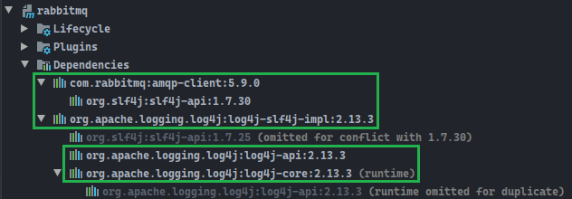
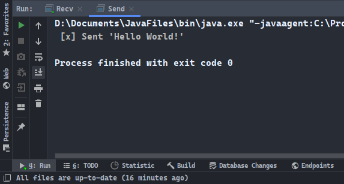
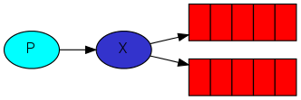
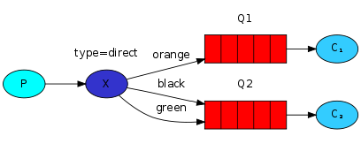

# 前言

> - 所有的内容均整理自：https://www.rabbitmq.com/getstarted.html。
> - 本篇内容的详细使用细则可能不是特别妥当。更为详细的内容，需要参考`RabbitMQ_Advanced.md`。

# 简介

RabbitMQ是实现了高级消息队列协议（AMQP）的开源消息代理软件（亦称面向消息的中间件）。RabbitMQ服务器是用Erlang语言编写的，而集群和故障转移是构建在开放电信平台框架上的。所有主要的编程语言均有与代理接口通讯的客户端库。

# 环境搭建

Window系统下，从官网下载安装包。


RabbitMQ服务依赖otp，安装RabbitMQ之前需要先安装otp：
- otp下载地址：https://www.erlang.org/downloads
- RabbitMQ下载地址：https://www.rabbitmq.com/download.html

安装完毕后，服务自动启用。


# 前言导读

关于RabbitMQ有三个概念需要理清：

1. Producing：Producer生产者发送的消息；
2. A queue：消息队列，用于传输消息；
3. Consuming：Consumer消费者接收的消息。

## 1. Producing

Producing意为发送消息，而用于发送消息的程序为producer生产者。


## 2. A queue

消息队列存在于RabbitMQ服务器中，我们所发送的消息不仅可以流经RabbitMQ和你的所编写的程序，它们还可以被存储在队列中。一个队列的大小仅受限与服务器的内存或硬盘的大小，因为它本质上是一个巨大的消息缓冲流。

多个producer可以发送消息给同一个queue队列，多个consumer也可以从同一个queue队列中接收消息。


## 3. Consuming

Consuming意为接收消息，也被称为消费消息。而用于接收消息的程序就是consumer消费者。


# 入门实例

简单的实例中，将使用Producer类Send.java，将字符串信息“Hello World！”发送给Consumer类Recv.java。对于RabbitMQ的环境来说，消费者类Recv.java在启动后是不能够结束的，它需要一直保存运行的状态以便接受消息（可以以Ctrl+C的方式可以强制结束运行状态）。

- 模式图解：


## 1. Maven项目依赖

项目中的所有依赖都可以通过导入两个坐标关联添加。



plugin中的编译版本是自动添加的。

```xml
<?xml version="1.0" encoding="UTF-8"?>
<project xmlns="http://maven.apache.org/POM/4.0.0"
         xmlns:xsi="http://www.w3.org/2001/XMLSchema-instance"
         xsi:schemaLocation="http://maven.apache.org/POM/4.0.0 http://maven.apache.org/xsd/maven-4.0.0.xsd">
    <modelVersion>4.0.0</modelVersion>

    <groupId>cn.dylanphang</groupId>
    <artifactId>rabbitmq</artifactId>
    <version>1.0-SNAPSHOT</version>
    
    <dependencies>
        <dependency>
            <groupId>com.rabbitmq</groupId>
            <artifactId>amqp-client</artifactId>
            <version>5.9.0</version>
        </dependency>
        <dependency>
            <groupId>org.apache.logging.log4j</groupId>
            <artifactId>log4j-slf4j-impl</artifactId>
            <version>2.13.3</version>
        </dependency>
    </dependencies>

    <build>
        <plugins>
            <plugin>
                <groupId>org.apache.maven.plugins</groupId>
                <artifactId>maven-compiler-plugin</artifactId>
                <configuration>
                    <source>9</source>
                    <target>9</target>
                </configuration>
            </plugin>
        </plugins>
    </build>
</project>
```

## 2. 编写发送类

- 模式图解：


- 基本步骤：
  1. 创建连接工厂类ConnectionFactory；
  2. 使用连接工厂类设置RabbitMQ的服务器地址；
  3. 由于Connection、Channel需要关闭资源，需要把这两个对象放置于try-with-resources结构中；
  4. 使用连接工厂类获取连接Connection；
  5. 使用连接对象获取信道Channel；
  6. 使用信道对象，声明队列属性：
     1. queue：队列名称；
     2. durable：持久化；
     3. exclusive：排它；
     4. autoDelete：自动删除；
     5. arguments：其他参数；
  7. 使用信道对象，向指定的队列发布消息：
     1. 当exchange为空字符串的时候，routingKey表示目标队列的名称；
     2. 当exchange不为空字符串的时候，routingKey表示bindingKey，也就是信道channel中queueBind方法的第三个参数。

```java
package cn.dylanphang.helloworld;

import com.rabbitmq.client.Channel;
import com.rabbitmq.client.Connection;
import com.rabbitmq.client.ConnectionFactory;

/**
 * Connection实现了Closeable接口；Channel实现了AutoCloseable接口。
 * 可以使用try-with-resources结构，因为这两个资源是需要关闭的，使用这个结构，资源将自动关闭。
 */

public class Send {
    private final static String QUEUE_NAME = "hello";

    public static void main(String[] args) throws Exception {
        ConnectionFactory factory = new ConnectionFactory();
        factory.setHost("localhost");
        
        try (Connection connection = factory.newConnection();
             Channel channel = connection.createChannel()) {

            // 声明队列
            channel.queueDeclare(QUEUE_NAME, false, false, false, null);
            String message = "Hello World!";
            
            // 使用信道发布消息，并传入队列的路由键routingKey
            channel.basicPublish("", QUEUE_NAME, null, message.getBytes());

            System.out.println(" [x] Sent '" + message + "'");
        }
    }
}
```

## 3. 编写接收类

- 模式图解：


- 基本步骤：
  1. 创建连接工厂类ConnectionFactory；
  2. 使用连接工厂类设置RabbitMQ的服务器地址；
  3. 由于Connection、Channel需要关闭资源，需要把这两个对象放置于try-with-resources结构中；
  4. 使用连接工厂类获取连接Connection；
  5. 使用连接对象获取信道Channel；
  6. 使用信道对象，声明队列属性：
     1. queue：队列名称；
     2. durable：持久化；
     3. exclusive：排它；
     4. autoDelete：自动删除；
     5. arguments：其他参数；

7. 创建消息回调对象DeliverCallback，覆写该对象中的handle方法，会开启一个新的线程：
   1. consumerTag：是消费者的唯一标签；
   2. delivery：使用该对象可以获得可以获得producer中通过basicPublish发布的消息中的各种属性；
  8. 放置在try结构中的DeliverCallback对象，由其中handle开启的新线程，不能够阻止main方法线程的结束，需要使用对象锁的方式，让mian方法所在的线程挂起，达到后台等待消息的效果：
     - 需要把对象锁（synchronized）的所有部分都置于try结构中，否则可能出现无法接收消息的现象；
  9. 最后，使用信道对象中的basicConsume对象，访问队列和回调对象：
     1. queue：队列名称；
     2. autoAck：是否开启消息自动确认；
     3. deliverCallback：等待消息传送；
     4. cancelCallback：取消等待消息传送。


```java
package cn.dylanphang.helloworld;

import com.rabbitmq.client.*;

import java.io.IOException;
import java.nio.charset.StandardCharsets;
import java.util.concurrent.TimeoutException;

public class Recv {
    private final static String QUEUE_NAME = "hello";

    @SuppressWarnings("All")
    public static void main(String[] args) throws IOException, TimeoutException {
        ConnectionFactory factory = new ConnectionFactory();
        factory.setHost("localhost");

        Object monitor = new Object();

        // Connection/Channel资源是需要关闭的，将需要释放的资源放在try-with-resources中，会导致main线程结束，
        try (Connection connection = factory.newConnection();
             Channel channel = connection.createChannel()) {

            // 使用queueDeclare声明队列属性
            channel.queueDeclare(QUEUE_NAME, false, false, false, null);
            System.out.println(" [*] Waiting for message. To exit press Ctrl+C.");

            // DeliverCallback会开启另一个线程，当有消息到达，该线程才会被唤醒。
            // Callback interface to be notified when a message is delivered.
            DeliverCallback deliverCallback = ((consumerTag, delivery) -> {
                String message = new String(delivery.getBody(), StandardCharsets.UTF_8);
                System.out.println(" [x] Received '" + message + "'");

                synchronized (monitor) {
                    monitor.notify();
                }
            });

            // 使用basicConsume访问队列
            channel.basicConsume(QUEUE_NAME, true, deliverCallback, consumerTag -> {
            });

            while (true) {
                synchronized (monitor) {
                    try {
                        monitor.wait();
                    } catch (InterruptedException e) {
                        e.printStackTrace();
                    }
                }
            }
        }
    }
}
```

## 4. 运行程序

- 首先需要运行Recv.java，然后再运行Send.java。
- 运行结果如下所示：




# 工作队列（Work Queue)

> Using **message acknowledgments** and **prefetchCount** you can set up a work queue. The **durability options** let the tasks survive even if RabbitMQ is restarted.
>
> For more information on **Channel methods** and **MessageProperties**, you can browse the [JavaDocs online](https://rabbitmq.github.io/rabbitmq-java-client/api/current/).

- 模式图解：


## 1. Maven项目依赖

- 在之前的案例中，我们使用一个Producer给一个Consumer发送message，在工作队列中，我们需要使用一个Producer多次地给同一个channel中的多个Consumer发送message。

- 与入门实例中的依赖一致。

## 2. 编写发送类

- 相较于入门程序来说，更改了接收的message类型，是为了通过控制台发送message。
- 基本步骤：
  1. 创建连接工厂类ConnectionFactory；
  2. 使用连接工厂类设置RabbitMQ的服务器地址；
  3. （本例省略）于Connection、Channel需要关闭资源，需要把这两个对象放置于try-with-resources结构中；
  4. 使用连接工厂类获取连接Connection；
  5. 使用连接对象获取信道Channel；
  6. 使用信道对象，声明队列属性：
     1. queue：队列名称；
     2. durable：持久化；
     3. exclusive：排它；
     4. autoDelete：自动删除；
     5. arguments：其他参数；
  7. 使用信道对象，向指定的队列发布消息：
     1. 当exchange为空字符串的时候，routingKey表示目标队列的名称；
     2. 当exchange不为空字符串的时候，routingKey表示bindingKey，也就是信道channel中queueBind方法的第三个参数。

```java
package cn.dylanphang.second;

import com.rabbitmq.client.Channel;
import com.rabbitmq.client.Connection;
import com.rabbitmq.client.ConnectionFactory;

public class NewTask {
    private final static String QUEUE_NAME = "hello";

    public static void main(String[] args) throws Exception {
        ConnectionFactory factory = new ConnectionFactory();
        factory.setHost("localhost");
        try (Connection connection = factory.newConnection();
             Channel channel = connection.createChannel()) {

            channel.queueDeclare(QUEUE_NAME, false, false, false, null);
            String message = String.join("", args);
            channel.basicPublish("", QUEUE_NAME, null, message.getBytes(StandardCharsets.UTF_8));

            System.out.println(" [x] Sent '" + message + "'");
        }
    }
}
```

## 3. 编写接收类

- 原本文档中使用两个终端开启两个Worker，但其实最终的目的是为了让同一个channel中有两个以上的Worker存在，所以在这里我们创建一个Work.java的副本文件并命名为Worker2.java，在实验的时候同时开启这两个Consumer即可。

- 基本步骤：

  1. 创建连接工厂类ConnectionFactory；
  2. 使用连接工厂类设置RabbitMQ的服务器地址；
  3. （本例省略）由于Connection、Channel需要关闭资源，需要把这两个对象放置于try-with-resources结构中；
  4. 使用连接工厂类获取连接Connection；
  5. 使用连接对象获取信道Channel；
  6. 使用信道对象，声明队列属性：
     1. queue：队列名称；
     2. durable：持久化；
     3. exclusive：排它；
     4. autoDelete：自动删除；
     5. arguments：其他参数；

  7. 使用信道开启信道中队列对公平派发的支持，channel.basicQos(int prefetch)；
  8. 创建消息回调对象DeliverCallback，覆写该对象中的handle方法，会开启一个新的线程：
     1. consumerTag：是消费者的唯一标签；
     2. delivery：使用该对象可以获得可以获得producer中通过basicPublish发布的消息中的各种属性；
  9. 使用信道配置队列手动确认收到消息，channel.basicAck(delivery.getEnvelope().getDeliveryTag(), false)；
    10. （本例省略）放置在try结构中的DeliverCallback对象，由其中handle开启的新线程，不能够阻止main方法线程的结束，需要使用对象锁的方式，让mian方法所在的线程挂起，达到后台等待消息的效果：
        - 需要把对象锁（synchronized）的所有部分都置于try结构中，否则可能出现无法接收消息的现象；
    11. 最后，使用信道对象中的basicConsume对象，访问队列和回调对象：
        1. queue：队列名称；
        2. autoAck：是否开启消息自动确认；
        3. deliverCallback：等待消息传送；
        4. cancelCallback：取消等待消息传送。

> - - ACK (Acknowledge character）即是确认字符，在数据通信中，接收站发给发送站的一种传输类控制字符。表示发来的数据已确认接收无误。
>   - 在TCP/IP协议中，如果接收方成功的接收到数据，那么会回复一个ACK数据。通常ACK信号有自己固定的格式,长度大小,由接收方回复给发送方。
> - 关于fair dispatch的图解：
>
> 

```java
package cn.dylanphang.second;

import com.rabbitmq.client.Channel;
import com.rabbitmq.client.Connection;
import com.rabbitmq.client.ConnectionFactory;
import com.rabbitmq.client.DeliverCallback;

import java.nio.charset.StandardCharsets;

/**
 * 通过设置channel.basicQos可以防止资源闲置；
 * 通过设置channel.basicAck/channel.consume(..,false,..,..)可以防止信息丢失。
 */
public class Worker {
    private final static String QUEUE_NAME = "hello";

    public static void main(String[] args) throws Exception {
        ConnectionFactory factory = new ConnectionFactory();
        factory.setHost("localhost");
        Connection connection = factory.newConnection();
        Channel channel = connection.createChannel();

        channel.queueDeclare(QUEUE_NAME, false, false, false, null);
        System.out.println(" [*] Waiting for message. To exit press Ctrl+C.");

        /*
         默认情况下，RabbitMQ总是会将message按队列的形式公平地分配给每一个Consumer，这导致了一个问题，
         如果其中某个ConsumerA处理的接收认为耗时较长，另一个ConsumerB即使已经完成了消息的处理，由于下一
         个message已经公平地派发给了ConsumerA,即使ConsumerB此时处于空闲状态，它也无法处理已经该已经被
         派发给ConsumerA的message。

         通过为chanel设置prefetchCount，可以控制RabbitMQ每次仅派发一个message，那么只要Consumer处于
         空闲状态，message queue中存在message，就会立即被派送给空闲的Consumer。

         通过设置channel.basicQos(1)，我们可以防止资源闲置。

         prefetchCount：表示每次派送message的数量。
         */
        channel.basicQos(1);

        DeliverCallback deliverCallback = ((consumerTag, delivery) -> {
            String message = new String(delivery.getBody(), StandardCharsets.UTF_8);
            System.out.println(" [x] Received '" + message + "'");

            try {
                doWork(message);
            } catch (InterruptedException e) {
                e.printStackTrace();
            } finally {
                System.out.println(" [x] Done");
                // 手动确认收到该消息
                channel.basicAck(delivery.getEnvelope().getDeliveryTag(), false);
            }
        });
        /*
        channel中的basicConsume接受的第二个参数为false，则表明开启对message acknowledgment的支持。

        开启channel对message acknowledgment的支持，可以防止某一个Consumer突然下线，导致信息的丢失。
        一般情况下，在没有进行channel.basicQos(1)设置的时候，服务器会公平地将mq中的message分配给所有
        的Consumer，此时如果其中一个或几个Consumer意外离线，那么分派到该Consumer上的message也会相应
        地丢失，这显然不是我们想要的。

        通过开启channel对ack的支持，我们可以防止message的丢失。即使任意Consumer掉线，消息会重回队列，
        同时如果相同channel下有其他的Consumer在线，消息将被派发到在线的Consumer上。
         */
        channel.basicConsume(QUEUE_NAME, false, deliverCallback, consumerTag -> {
        });
    }

    private static void doWork(String task) throws InterruptedException {
        for (char ch : task.toCharArray()) {
            if (ch == '.') {
                Thread.sleep(1000);
            }
        }
    }
}
```

## 4. 运行程序

- 我们对在IDEA中创建一个Worker.java的副本Worker2.java，并同时运行Worker、Worker2，同时编写一个测试类SendMessageTest.java模拟同时发送多条消息，同时监控Worker、Worker2的控制台输出情况。
- 字符串中的“.”代表处理当前message所需要的秒数。

### a. 普通情况

- 模拟同一channel中，同时存在两个Consumer的情况下，message是如何被接收处理的。
- 发送消息：


- ConsumerA和ConsumerB的接收情况如下：


### b. 特殊情况

- 模拟同一channel中，同时存在两个Consumer的情况下，其中一个Consumer在处理message的时候掉线，此时message是如何被接收处理的。

- 发送消息：


- ConsumerA接收并处理第一条消息后，手动离线，可以看到ConsumerA已经成功接收了First，但正在接收Fourth的时候，被手动终止了程序：


- ConsumerB仍在在线，没有被ConsumerA成功接收的Fourth，重新回到了队列中，并由仍然在线的位于同一个channel下的ConsumerB继续处理：


## 5. 讯息持久化

- RabbitMQ使用以上的方式，可以做到保证资源不会被浪费，同时消息不会丢失。
- 那么如果RabbitMQ的服务器出现的问题，导致了message丢失，该如何处理呢？官方也提供了相关的message durablility（讯息持久化）实现代码，参考如下：

### a. Producer

1. 队列需要使用关键字“task_queue”；
2. 使用信道中queueDeclare方法时，开启对message durability的支持；
3. 使用basicPublish时，属性prop设置有所变化：
   - MessageProperties类中存在一系列能够获取预设BasicProperties的静态方法。

```java
package cn.dylanphang.second;

import com.rabbitmq.client.Channel;
import com.rabbitmq.client.Connection;
import com.rabbitmq.client.ConnectionFactory;
import com.rabbitmq.client.MessageProperties;

import java.nio.charset.StandardCharsets;

public class Producer {

    // 更改队列的名称
    private final static String TASK_QUEUE_NAME = "task_queue";

    public static void main(String[] args) throws Exception {
        ConnectionFactory factory = new ConnectionFactory();
        factory.setHost("localhost");
        try (Connection connection = factory.newConnection();
             Channel channel = connection.createChannel()) {

            // 第二个属性durable即为开启message durability（讯息持久化）
            channel.queueDeclare(TASK_QUEUE_NAME, true, false, false, null);
            String message = String.join("", args);
            
            // 同时这里的属性稍有改变
            channel.basicPublish("", TASK_QUEUE_NAME, 
                    MessageProperties.PERSISTENT_TEXT_PLAIN, 
                    message.getBytes(StandardCharsets.UTF_8));

            System.out.println(" [x] Sent '" + message + "'");
        }
    }
}
```

### b. Consumer

- 主要变化：
  1. 队列需要使用关键字“task_queue”；
  2. 使用信道中queueDeclare方法时，开启对message durability的支持。

```java
package cn.dylanphang.second;

import com.rabbitmq.client.Channel;
import com.rabbitmq.client.Connection;
import com.rabbitmq.client.ConnectionFactory;
import com.rabbitmq.client.DeliverCallback;

import java.nio.charset.StandardCharsets;

public class Consumer {

    // 更改队列的名称
    private final static String TASK_QUEUE_NAME = "task_queue";

    public static void main(String[] args) throws Exception {
        ConnectionFactory factory = new ConnectionFactory();
        factory.setHost("localhost");
        
        // 添加final修饰符，不知道有什么用
        final Connection connection = factory.newConnection();
        final Channel channel = connection.createChannel();

        // 第二个属性durable即为开启message durability（讯息持久化）
        channel.queueDeclare(TASK_QUEUE_NAME, true, false, false, null);
        System.out.println(" [*] Waiting for message. To exit press Ctrl+C.");

        channel.basicQos(1);

        DeliverCallback deliverCallback = ((consumerTag, delivery) -> {
            String message = new String(delivery.getBody(), StandardCharsets.UTF_8);
            System.out.println(" [x] Received '" + message + "'");

            try {
                doWork(message);
            } catch (InterruptedException e) {
                e.printStackTrace();
            } finally {
                System.out.println(" [x] Done");
                channel.basicAck(delivery.getEnvelope().getDeliveryTag(), false);
            }
        });

        channel.basicConsume(TASK_QUEUE_NAME, false, deliverCallback, consumerTag -> {
        });
    }

    private static void doWork(String task) throws InterruptedException {
        for (char ch : task.toCharArray()) {
            if (ch == '.') {
                Thread.sleep(1000);
            }
        }
    }
}
```

# 发布订阅（Publish/Subscribe）

- 模式图解：



- 本节使用BuiltinExchangeType.FANOUT
- 之前的实验你，每个Producer发送的message只会被一个Consumer接收处理，而本节Publish/Subscribe指的是一个Producer发出的message，会被多个Consumer接收。
- 项目图解：


## 1. Maven项目依赖

- 与此前的相同。

## 2. 编写发送类

- 在FANOUT的模式下，使用交换器发送消息，所使用的传输队列是不重要的，所有的consumer都将接收到来自exchange发布的消息，所以在exchange中不需要声明队列，只需要声明交换器。

- 基本步骤：
  1. 创建连接工厂类ConnectionFactory；
  2. 使用连接工厂类设置RabbitMQ的服务器地址；
  3. 使用连接工厂类获取连接Connection；
  4. 使用连接对象获取信道Channel；
  5. 使用信道对象，声明交换器属性：
     1. exchange：交换器名称；
     2. type：交换方式；
  6. 使用信道对象，向指定的队列发布消息：
     1. 当exchange为空字符串的时候，routingKey表示目标队列的名称；
     2. 当exchange不为空字符串的时候，routingKey表示bindingKey，也就是信道channel中queueBind方法的第三个参数。

```java
package cn.dylanphang.third;

import com.rabbitmq.client.BuiltinExchangeType;
import com.rabbitmq.client.Channel;
import com.rabbitmq.client.Connection;
import com.rabbitmq.client.ConnectionFactory;

import java.nio.charset.StandardCharsets;

/**
 * 发送message的Exchange。
 */
public class EmitLog {
    private static final String EXCHANGE_NAME = "logs";

    public static void main(String[] args) throws Exception {
        ConnectionFactory factory = new ConnectionFactory();
        factory.setHost("localhost");

        try (Connection connection = factory.newConnection();
             final Channel channel = connection.createChannel()) {
            // ExchangeType一共有四种，对于exchange来说最重要的就是使用channel来声明exchange
            channel.exchangeDeclare(EXCHANGE_NAME, BuiltinExchangeType.FANOUT);

            String message = args.length < 1 ? "info: Hello World!" : String.join(" ", args);

            // routingKey之所以为空，是因为在BuiltinExchangeType.FANOUT的情况下，routingKey是会被忽略的
            // routingKey指的就是queue_name
            channel.basicPublish(EXCHANGE_NAME, "", null, message.getBytes(StandardCharsets.UTF_8));
            System.out.println(" [x] Sent '" + message + "'");
        }
    }
}
```

## 3. 编写接收类

- 同样的，对于exchange来说，队列只是用来传输和接收消息的“管道”，它可以是任何的随机名称的队列，RabbitMQ中可以使用channel.queueDeclare().getQueue()的方式，来创建一个临时的队列。

- 基本步骤：
  1. 创建连接工厂类ConnectionFactory；
  2. 使用连接工厂类设置RabbitMQ的服务器地址；
  3. 使用连接工厂类获取连接Connection；
  4. 使用连接对象获取信道Channel；
  5. 使用信道对象，声明交换器属性：
     1. exchange：交换器名称；
     2. type：交换方式；
  7. 创建一个临时队列temporary_queue，用于消息的传输；
  7. 使用信道对象，将临时队列与交换器绑定，FANOUT模式下不需要指定routingKey（或bindingKey）；
  8. 创建消息回调对象DeliverCallback，覆写该对象中的handle方法，会开启一个新的线程：
     1. consumerTag：是消费者的唯一标签；
     2. delivery：使用该对象可以获得可以获得producer中通过basicPublish发布的消息中的各种属性；
  9. 最后，使用信道对象中的basicConsume对象，访问队列和回调对象：
     1. queue：队列名称；
     2. autoAck：是否开启消息自动确认；
     3. deliverCallback：等待消息传送；
     4. cancelCallback：取消等待消息传送。
- 关于bindings的图解：


```java
package cn.dylanphang.third;

import com.rabbitmq.client.*;

import java.nio.charset.StandardCharsets;

/**
 * 接收message的Receiver。
 */
public class ReceiveLogs {
    private static final String EXCHANGE_NAME = "logs";

    public static void main(String[] args) throws Exception {
        final ConnectionFactory factory = new ConnectionFactory();
        factory.setHost("localhost");

        final Connection connection = factory.newConnection();
        final Channel channel = connection.createChannel();

        // ExchangeType一共有四种，对于exchange来书最重要的就是使用channel来声明exchange
        channel.exchangeDeclare(EXCHANGE_NAME, BuiltinExchangeType.FANOUT);

        // 创建临时队列，这个队列是不持久的、排他的并自动删除的
        // 这个操作是固定的，也就是说queueBind中的第一个参数目前来说都是临时队列
        final String temporary_queue = channel.queueDeclare().getQueue();
        // 需要将临时队列和exchange进行绑定操作，之前都没有这个操作，routingKey应该仍旧指的是queueDeclare中的第一个参数
        channel.queueBind(temporary_queue, EXCHANGE_NAME, "");

        System.out.println(" [*] Waiting for message. To exit press CTRL+C");

        // 这个接收并处理message的方法的写法十分固定
        DeliverCallback deliverCallback = ((consumerTag, delivery) -> {
            final String message = new String(delivery.getBody(), StandardCharsets.UTF_8);
            System.out.println(" [x] Received '" + message + "'");
        });

        // 注意这个地方禁用了ack，表明信息是允许丢失的，但对于logs来说，应该没什么所谓
        channel.basicConsume(temporary_queue, true, deliverCallback, consumerTag -> {
        });
    }
}
```

## 4. 运行程序

- 运行EmitLog进行消息的发布：


- 所有的ReceiveLogs都能收到EmitLog发布的消息：


# 路由模式（Routing）

- 模式图解：



- 本节使用BuiltinExchangeType.DIRECT
- 本节介绍信息的选择性接收，我们可以使用exchange和routingkey，将我们所发布的讯息，进行一定的筛选记录处理，在记录日志中，我们经常需要对诸如Error或Warning等记录继续写入文件操作
- 一个exchange可以绑定多个bindingKey，一个bindingKey可以供多个临时队列使用，图解如下：


- 项目图解：


## 1. Maven项目依赖

- 与此前的相同。

## 2. 编写producer发送类

- 此前使用FANOUT的方式，可以给所有绑定了该exchange交换器的信道channel中的consumer发送消息，同信道中的所有consumer都可以接受到来自指定exchange中发布出来的消息，接收是一视同仁全盘接收的；
- 本节中将使用DIRECT的方式，你可以在Producer发布消息的时候，设置一个routingKey，假设为警告等级，同时可以拥有多个Consumer用于接收吃Producer发出的消息，不同的是，Consumer会根据routingKey来进行信息的筛选，如指定的Consumer会接收warning警告等级的消息，另一些Consumer会接收error警告等级的消息。

- 例子中exchange同时作为普通的producer，对于不在目标警告等级中的其他消息，用if语句作适当的过滤操作，如果你仅有waring和error用于接收exchange中的消息，那么其他的消息如果不存在普通的consumer，该消息将被忽略，造成信息的丢失
- 基本步骤：
  1. 创建连接工厂类ConnectionFactory；
  2. 使用连接工厂类设置RabbitMQ的服务器地址；
  3. 使用连接工厂类获取连接Connection；
  4. 使用连接对象获取信道Channel；
  5. 使用信道对象，声明交换器属性：
     1. exchange：交换器名称；
     2. type：交换方式；
  6. 使用信道对象，向指定的队列发布消息：
     1. 当exchange为空字符串的时候，routingKey表示目标队列的名称；
     2. 当exchange不为空字符串的时候，routingKey表示bindingKey，也就是信道channel中queueBind方法的第三个参数。

```java
package cn.dylanphang.fourth;

import com.rabbitmq.client.Channel;
import com.rabbitmq.client.Connection;
import com.rabbitmq.client.ConnectionFactory;
import com.rabbitmq.client.MessageProperties;

import java.nio.charset.StandardCharsets;

public class EmitLogDirect {

    private final static String TASK_QUEUE_NAME = "task_queue";
    private static final String EXCHANGE_NAME = "direct_logs";

    public static void main(String[] args) throws Exception {
        final ConnectionFactory factory = new ConnectionFactory();
        factory.setHost("localhost");

        try (final Connection connection = factory.newConnection();
             final Channel channel = connection.createChannel()) {

            // 同时声明queueDeclare和exchangeDeclare
            channel.queueDeclare(TASK_QUEUE_NAME, true, false, false, null);
            channel.exchangeDeclare(EXCHANGE_NAME, "direct");

            // 可以在这个地方直接把消息发布到Consumer中，再进行下一步发送到ReceiveLogDirect中将必要的警告Message做记录
            // 我已经在ReceiveLogsDirect中再一次将消息发送给NormalConsumer了

            // 假设使用命令行传入的参数就是两个字符串
            String severity = getSeverity(args);
            String message = getMessage(args);

            // 相当于同时发布了severity等级和message信息
            if ("warning".equalsIgnoreCase(severity) || "error".equalsIgnoreCase(severity)) {
                channel.basicPublish(EXCHANGE_NAME, severity, null, message.getBytes(StandardCharsets.UTF_8));
            } else {
                channel.basicPublish("",
                        TASK_QUEUE_NAME,
                        MessageProperties.PERSISTENT_TEXT_PLAIN,
                        String.join(" ", args).getBytes(StandardCharsets.UTF_8));
            }
            System.out.println(" [x] Sent '" + severity + "':'" + message + "'");
        }
    }

    private static String getSeverity(String[] args) {
        return args[0];
    }

    private static String getMessage(String[] args) {
        return args[1];
    }

}
```

## 3. 编写exchange接收类

- 基本步骤：
  1. 创建连接工厂类ConnectionFactory；
  2. 使用连接工厂类设置RabbitMQ的服务器地址；
  3. 使用连接工厂类获取连接Connection；
  4. 使用连接对象获取信道Channel；
  5. 使用信道对象，声明交换器属性：
     1. exchange：交换器名称；
     2. type：交换方式；
  6. 创建一个临时队列queueName，用于消息的传输；
  7. 由于使用的是DIRECT模式，需要自定义接收的routingKey字符串，例中使用命令行参数的方式，传入了{"warning", "error"}；
  8. 使用信道对象，将临时队列和交换器与路由键做绑定，同一个consumer中可以绑定多个路由键routingKey；
  9. 创建消息回调对象DeliverCallback，覆写该对象中的handle方法，会开启一个新的线程：
     1. consumerTag：是消费者的唯一标签；
     2. delivery：使用该对象可以获得可以获得producer中通过basicPublish发布的消息中的各种属性；
  10. 最后，使用信道对象中的basicConsume对象，访问队列和回调对象：
      1. queue：队列名称；
      2. autoAck：是否开启消息自动确认；
      3. deliverCallback：等待消息传送；
      4. cancelCallback：取消等待消息传送。
  11. 额外代码：
      - 例子中，我们同时在exchange的consumer（DeliverCallback对象中handle方法）中使用了消息发布方法，在类中你只要符合并编写了producer的必要代码，那么该类即使是comsumer，也可以作为producer进行消息的发布。

```java
package cn.dylanphang.fourth;

import com.rabbitmq.client.*;

import java.io.FileOutputStream;
import java.net.URL;
import java.nio.charset.StandardCharsets;

public class ReceiveLogsDirect {
    private final static String TASK_QUEUE_NAME = "task_queue";
    private static final String EXCHANGE_NAME = "direct_logs";

    public static void main(String[] args) throws Exception {
        final ConnectionFactory factory = new ConnectionFactory();
        factory.setHost("localhost");

        final Connection connection = factory.newConnection();
        final Channel channel = connection.createChannel();

        channel.queueDeclare(TASK_QUEUE_NAME, true, false, false, null);
        channel.exchangeDeclare(EXCHANGE_NAME, "direct");

        // 临时队列
        String queueName = channel.queueDeclare().getQueue();

        if (args.length < 1) {
            System.out.println("Usage: ReceiveLogDirect [info] [warning] [error]");
            System.exit(1);
        }

        // 显示后台args参数包含什么讯息
        System.out.println(" [*] Program Arguments: " + String.join(" ", args));

        // 通过传入args参数的方式，定义这个ReceiveLog要处理的severity是什么
        for (String severity : args) {
            channel.queueBind(queueName, EXCHANGE_NAME, severity);
        }

        // 控制台可视化输出，可以不写
        System.out.println(" [*] Waiting for messages. To exit press CTRL+C");

        // 消息处理主体对象
        DeliverCallback deliverCallback = ((consumerTag, delivery) -> {

            // 获取message内容不包括警告级别，因为Producer并没有把全部的消息发送过来
            String message = new String(delivery.getBody(), StandardCharsets.UTF_8);

            // 可以在Consumer中继续得到的消息发布给下一个Consumer
            channel.basicPublish("",
                    TASK_QUEUE_NAME,
                    MessageProperties.PERSISTENT_TEXT_PLAIN,
                    (delivery.getEnvelope().getRoutingKey() + " " + message).getBytes(StandardCharsets.UTF_8));

            // delivery.getEnvelope().getRoutingKey()：获得警告级别，exchangeType为direct的时候会设置routingKey
            String logMessage = " [x] Received '" + delivery.getEnvelope().getRoutingKey() + "':'" + message + "'";

            // 控制台输出详情
            System.out.println(logMessage);

            // 创建输出流，将错误写入日志
            final FileOutputStream fos =
                    new FileOutputStream("D:/IdeaProjects/basic-code/34-rabbitmq/rabbit.log", true);
            fos.write(logMessage.getBytes(StandardCharsets.UTF_8));

            // 无法使用“/r/n”.getBytes()的方式插入换行符
            fos.write(System.getProperty("line.separator").getBytes(StandardCharsets.UTF_8));

            // 关闭输出流
            fos.close();
            System.out.println(" [*] More details in rabbit.log.");
        });

        channel.basicConsume(queueName, true, deliverCallback, consumerTag -> {
        });
    }
}
```

## 4. 编写consumer接收类

- 普通的持久化消息接收类consumer：
  - 持久化设置依赖于关键字“task_queue”；
  - 预取功能需要通过channel.basicQos(int prefetch)开启；
  - 消息手动确认功能，需要在channel.basicConsume中开启，在DeliverCallback对象中编写代码channel.basicAck手动确认消息已被consumer获取。

```java
package cn.dylanphang.fourth;

import com.rabbitmq.client.Channel;
import com.rabbitmq.client.Connection;
import com.rabbitmq.client.ConnectionFactory;
import com.rabbitmq.client.DeliverCallback;

import java.nio.charset.StandardCharsets;

public class NormalConsumer {
    private final static String TASK_QUEUE_NAME = "task_queue";

    public static void main(String[] args) throws Exception {
        ConnectionFactory factory = new ConnectionFactory();
        factory.setHost("localhost");
        final Connection connection = factory.newConnection();
        final Channel channel = connection.createChannel();

        // 第二个属性durable即为开启message durability（信息持久化）
        channel.queueDeclare(TASK_QUEUE_NAME, true, false, false, null);
        System.out.println(" [*] Waiting for message. To exit press Ctrl+C.");

        // 每次Consumer只会被派发一条message
        channel.basicQos(1);

        // delivery就是从Producer发过来的message
        DeliverCallback deliverCallback = ((consumerTag, delivery) -> {
            String message = new String(delivery.getBody(), StandardCharsets.UTF_8);

            // 控制台的可视化输出，可以不写
            System.out.println(" [*] Received '" + message + "'");

            // ack设置
            channel.basicAck(delivery.getEnvelope().getDeliveryTag(), false);

        });

        channel.basicConsume(TASK_QUEUE_NAME, false, deliverCallback, consumerTag -> {
        });
    }
}
```

## 5. 运行程序

- 模拟发送多条消息的测试类，参考代码：

```java
package cn.dylanphang.fourth;

import org.junit.Test;

public class SendMessageTest {

    @Test
    public void test() throws Exception {
        String[] strA = {"info", "'Normal information."};
        String[] strB = {"info", "'It\\'s running well.'"};
        String[] strC = {"error","'Seem something went wrong.'"};
        String[] strD = {"warning","'Better make some change to that file.'"};
        String[] strE = {"warning","'It\\'s not too much correct.'"};
        String[] strF = {"info","'Program running good.'"};

        String[][] allMessage = {strA, strB, strC, strD, strE, strF};

        for (String[] str : allMessage) {
            EmitLogDirect.main(str);
        }
    }
}
```

- 由测试类SendMessageTest发出多条消息：


- ReceiveLosgsDirect的接收情况：


- NormaConsumer的接收情况：


# 动态路由（Topic）

- 我们已经学习过exchange中的FANOUT/DIRECT模式：
  - FANOUT：所有的exchange类consumer会对所有的exchange类发出的所有消息进行无差别接收，即同一条消息可以群发给多个consumer；
  - DIRECT：exchange在消息发布的时候，会携带特殊的routingKey属性，只有绑定了指定routingKey的consumer才能接收该消息，即有选择性地接收消息；
- 思考：
  - 假设我们有三个consumerA、consumerB、consumerC，同时拥有一个exchange，第一条消息exchange只想发给A、B，而第二条消息exchange需要只发给B、C。
  - 在普通的DIRECT模式下，B必须绑定两个routingKey，但遗憾的是，consumer类是无法同时绑定两个routingKey的。有什么办法可以让B在绑定一个routingKey的情况下，也能接收订阅到这两条消息？

- 本节中我们介绍TOPIC模式：
  - TOPIC模式允许routingKey是由一组词组组成的，同样的问题，在TOPIC模式下，我们可以给以上例子中的consumer设置如下的routingKey：
    - consumerA：warning
    - consumerB：warning.error
    - consumerC：error
  - 此时我们只需要使用exchange发布消息，只需要带上routingKey="#.severity.#"，消息将精准地发布并被指定的consumer所接收。

- 模式图解：


- 关于topic的占位符（特殊符号）：
  - \*（star）：星号表示一个单词
  - #（hash）：井号表示零个或多个单词（包括一个）
- bindingKey格式：
  - ... \<keyword>.\<keyword>.\<keyword> ...
  - ... \<keyword>.\* ...
  - ... \<keyword>.\# ...
  - ...
- 注意：
  - 如果不在BuiltinExchangeType.TOPIC的情况下使用占位符，那么效果将和使用BuiltinExchangeType.DIRECT的时候一样；
  - 如果在BuiltinExchangeType.TOPIC的情况下，仅使用“#”占位符，那么效果将和使用BuiltinExchangeType.FANOUT的时候一样。

## 1. Maven项目依赖

- 与此前的相同。

## 2. 编写producer发送类

- 更改了exchangeDeclare中BuiltinExchangeType的类型为TOPIC

```java
package cn.dylanphang.topics;

import com.rabbitmq.client.*;

import java.nio.charset.StandardCharsets;

public class EmitLogTopic {
    private static final String EXCHANGE_NAME = "topic_logs";

    public static void main(String[] args) throws Exception {
        final ConnectionFactory factory = new ConnectionFactory();
        factory.setHost("localhost");

        try (final Connection connection = factory.newConnection();
             final Channel channel = connection.createChannel()) {
            channel.exchangeDeclare(EXCHANGE_NAME, BuiltinExchangeType.TOPIC);

            // 假设使用命令行传入的参数就是两个字符串
            String severity = getSeverity(args);
            String message = getMessage(args);

            // 相当于同时发布了severity等级和message信息
            channel.basicPublish(EXCHANGE_NAME, severity, null, message.getBytes(StandardCharsets.UTF_8));

            System.out.println(" [x] Sent '" + severity + "':'" + message + "'");
        }
    }

    private static String getSeverity(String[] args) {
        return args[0];
    }

    private static String getMessage(String[] args) {
        return args[1];
    }
}
```

## 3. 编写exchange接收类

- 更改了exchangeDeclare中BuiltinExchangeType的类型为TOPIC

```java
package cn.dylanphang.topics;

import com.rabbitmq.client.Channel;
import com.rabbitmq.client.Connection;
import com.rabbitmq.client.ConnectionFactory;
import com.rabbitmq.client.DeliverCallback;

import java.nio.charset.StandardCharsets;
import java.util.Collections;

public class ReceiveLogsTopic {

    private static final String EXCHANGE_NAME = "topic_logs";

    public static void main(String[] args) throws Exception {
        ConnectionFactory factory = new ConnectionFactory();
        factory.setHost("localhost");
        Connection connection = factory.newConnection();
        Channel channel = connection.createChannel();

        channel.exchangeDeclare(EXCHANGE_NAME, "topic");
        String queueName = channel.queueDeclare().getQueue();

        if (args.length < 1) {
            System.err.println("Usage: ReceiveLogsTopic [binding_key]...");
            System.exit(1);
        }

        final StringBuilder stringBuilder = new StringBuilder();
        for (String bindingKey : args) {
            channel.queueBind(queueName, EXCHANGE_NAME, bindingKey);
            stringBuilder.append("[").append(bindingKey).append("] ");
        }
        stringBuilder.deleteCharAt(stringBuilder.length() - 1);

        System.out.println(" [!] Listening for the messages: " + stringBuilder.toString());
        System.out.println(" [*] Waiting for messages. To exit press CTRL+C");

        DeliverCallback deliverCallback = (consumerTag, delivery) -> {
            String message = new String(delivery.getBody(), StandardCharsets.UTF_8);
            System.out.println(" [x] Received '" +
                    delivery.getEnvelope().getRoutingKey() + "':'" + message + "'");
        };
        channel.basicConsume(queueName, true, deliverCallback, consumerTag -> {
        });
    }
}
```

## 4. 运行程序

- 模拟发送多条消息的测试类，参考代码：

```java
package cn.dylanphang.topics;

import org.junit.Test;

public class SendMessageTest {

    @Test
    public void test() throws Exception {
        String[] strA = {"kern.critical", "A critical kernel error."};
        String[] strB = {"kern.something", "Hey it is kernel something."};
        String[] strC = {"something.critical","Hey it is something critical."};
        String[] strD = {"dylan.good","You will receive dylan good."};
        String[] strE = {"dylan.good.fit","You can't receive dylan good fit."};

        String[][] allMessage = {strA, strB, strC, strD, strE};

        for (String[] str : allMessage) {
            EmitLogTopic.main(str);
        }
    }
}
```

- 由测试类SendMessageTest发出多条消息：


- ReceiveLogsTopic的接收情况：


- ReceiveLogsTopic2的接收情况：


- ReceiveLogsTopic3的接收情况：


- ReceiveLogsTopic4的接收情况：


- ReceiveLogsTopic5的接收情况：


# 远程调用（RPC）

- 主要逻辑：
  1. producer（aka：client）使用RabbitMQ提供的rpc_queue队列，携带着BasicProperties对象将请求发布；
  2. consumer（aka：server）使用BasicProperties指定的临时序列，携带着BasicProperties对象将回复发布；
  3. BasicProperties对象只有在发送请求的时候，需要携带临时序列名称的数据；
  4. BasicProperties对象中始终存储着唯一的correlationId，用于识别该回复（response）是否为指定请求（request）所带来的回复。

- 此前在第二小节，我们知道了如何依靠工作队列，将任务分发给多个consumers，但如果我们需要在一个远程的计算机上运行一个函数，并等待它的回复呢？
- 在此小节中，我们将使用RabbitMQ来建造一个小型的RPC服务器。

> - 关于AMQP（Advanced Message Queuing Protocol）
>   - 一个提供统一消息服务的应用层标准高级消息队列协议，是应用层协议的一个开放标准，为面向消息的中间件设计。基于此协议的客户端与消息中间件可传递消息，并不受客户端/中间件不同产品，不同的开发语言等条件的限制。Erlang中的实现有RabbitMQ等。

- RPC运行逻辑：
  1. 对于我们RPC请求，我们的客户端会带着两个重要属性（properties）进行消息的发送：
     1. replyTo：一个仅仅为请求数据而创建的匿名排他队列（queue）；
     2. correlationId：为每个请求所设置的唯一值；
  2. 接着我们的请求（request）会被发送到rpc_queue（关键字）；
  3. 此时我们的RPC server已经开启并等待我们的请求到来。一旦请求被服务器接收，它会处理并通过replyTo域中设置的队列（queue），给服务器返回消息；
  4. 客户端会一直等待着从replyTo队列中的消息。当信息被收到的时候，客户端会检查信息中绑定correlationId属性，如果该属性符合从请求中发出的correlationId，客户端才会处理该消息。
- 项目图解：


## 1. Maven项目依赖

- 与此前的相同。

## 2. 编写client客户端

- 在RabbitMQ中，“rpc_queue”是关键字。
- 其中最为重要的是AMQP.BasicProperties的属性设置，需要在其中设置correlationId以及临时队列replayToQueue，并通过使用channel中的basicPublish，传递此参数给Server。
- 客户端流程：
  1. 建立连接（connection）以及信道（channel）；
  2. 其中的call方法是真正发出RPC请求的代码；
  3. 首先我们需要生成唯一的correlationId值并保存下来，稍后我们的consumer callback将使用该值去和适当的回复（response）做匹配；
  4. 接着我们创建了一个专用的排他队列，作为回复（response）的专用队列，同时订阅它（channel.basicConsume）；
  5. 下一步，我们发布请求消息，同时带着两个属性：replyTo、correlationId；
  6. 接着我们等待正确的回复到来；
  7. 因为我们的consumer delivery的处理是在另一个线程中运行的，在我们接收到回复之前，我们需要做点什么去暂时让我们的线程挂起。我们使用BlockingQueue的方式实现，因此我们创建一个容量设置为1的ArrayBlockingQueue，并等待一个来自服务器的响应；
  8. 我们的consumer要做的工作非常简单，它会检查每一个来自queue中的消息，校验它们的correlationId是否符合我们要当前程序找寻的correlationId，如果符合，则将值放入BlockingQueue中；
  9. 同时我们的主线程序main也在等待着回复，好从BlockingQueue中将值取出；
  10. 最后我们将回复返回给用户（main）。

```java
package cn.dylanphang.rpc;

import com.rabbitmq.client.*;

import java.io.IOException;
import java.nio.charset.StandardCharsets;
import java.util.UUID;
import java.util.concurrent.ArrayBlockingQueue;
import java.util.concurrent.BlockingQueue;
import java.util.concurrent.TimeoutException;

public class RPCClient implements AutoCloseable {

    private final Connection connection;
    private final Channel channel;
    private final String requestQueueName = "rpc_queue";

    /**
     * 本类的构造函数，在主方法main中创建了RPCClient的对象，调用了构造方法。
     * 在构造函数中，进了创建工厂、连接、信道等操作。
     *
     * @throws IOException 异常
     * @throws TimeoutException 异常
     */
    public RPCClient() throws IOException, TimeoutException {
        ConnectionFactory factory = new ConnectionFactory();
        factory.setHost("localhost");

        connection = factory.newConnection();
        channel = connection.createChannel();
    }

    public static void main(String[] argv) {
        // 使用new关键字创建了本类的对象，RPCClient构造函数被执行
        try (RPCClient fibonacciRpc = new RPCClient()) {
            for (int i = 0; i < 32; i++) {
                String i_str = Integer.toString(i);
                System.out.println(" [x] Requesting fib(" + i_str + ")");

                // 调用了主要的发送message的方法call
                String response = fibonacciRpc.call(i_str);
                System.out.println(" [.] Got '" + response + "'");
            }
        } catch (IOException | TimeoutException | InterruptedException e) {
            e.printStackTrace();
        }
    }

    public String call(String message) throws IOException, InterruptedException {
        final String corrId = UUID.randomUUID().toString();
        String replyQueueName = channel.queueDeclare().getQueue();

        // 获取channel方法basicPublish中的BasicPublish对象，使用链式编程设置发布属性
        AMQP.BasicProperties props = new AMQP.BasicProperties
                .Builder()
                .correlationId(corrId) // 设置correlationId，告诉Server此Client的唯一相关Id是什么
                .replyTo(replyQueueName) // 设置replyTo，告诉Server要给哪个队列queue发布消息
                .build();

        // 消息发布，通过rpc_queue队列，将我们的BasicProperties对象及Message的二进制数据发送给Server
        channel.basicPublish("", requestQueueName, props, message.getBytes(StandardCharsets.UTF_8));

        // 创建一个容量为1的队列用作存储response回复消息
        final BlockingQueue<String> response = new ArrayBlockingQueue<>(1);

        // 进入等待回复线程，它会监听所有通过rpc_queue队列传递过来的Message
        DeliverCallback deliverCallback = (consumerTag, delivery) -> {

            // 当获取到回复delivery之后，需要比对correlationId是否一致，如果一致则获取回复体，并将结果存入response队列中
            if (delivery.getProperties().getCorrelationId().equals(corrId)) {
                response.offer(new String(delivery.getBody(), StandardCharsets.UTF_8));
            }
        };

        String ctag = channel.basicConsume(replyQueueName, true, deliverCallback, consumerTag -> {
        });

        // 从队列中取出Message
        String result = response.take();
        channel.basicCancel(ctag);
        return result;
    }

    public void close() throws IOException {
        connection.close();
    }
}
```

## 3. 编写server服务器端

- 对于server端最重要的步骤，是对delivery中的correlationId进行获取，并重新设置到server中的AMQP.BasicProperties中，并在channel的basicPublish方法中使用此对象，让RabbitMQ的服务器可以正确地找到拥有唯一correlationId的Client；
- Client中只会对带有匹配的correlationId的message做处理，对于其他的在replyToQueue中出现的message，Client会忽视。
- 服务器端流程：
  1. 一如既往我们需要先建立连接、信道以及声明队列rpc_queue；
  2. 我们可能要运行多个服务器进程。为了将负载平均分配到多个服务器，我们需要在channel.basicQos中设置prefetchCount的为1；
  3. 我们使用basicConsume访问队列，在队列中我们以对象（DeliverCallback）的形式提供回调，该回调将完成工作并将响应发送回去。

```java
package cn.dylanphang.rpc;

import com.rabbitmq.client.*;

import java.nio.charset.StandardCharsets;

/**
 * 如果一个RPCServer的速度过慢，可以运行多个RPCServer。
 */
public class RPCServer {

    // 这个队列的名称rpc_queue是个关键字，需要使用锁synchronized来保持程序的运行
    private static final String RPC_QUEUE_NAME = "rpc_queue";

    /**
     * 仅用于计算斐波那契数。
     *
     * @param n 第几个斐波那契数
     * @return 当前查询的斐波那契数值
     */
    private static int fib(int n) {
        if (n == 0) return 0;
        if (n == 1) return 1;
        return fib(n - 1) + fib(n - 2);
    }

    public static void main(String[] argv) throws Exception {
        ConnectionFactory factory = new ConnectionFactory();
        factory.setHost("localhost");

        try (Connection connection = factory.newConnection();
             Channel channel = connection.createChannel()) {
            // 同样的需要声明队列
            channel.queueDeclare(RPC_QUEUE_NAME, false, false, false, null);

            // 可能是清除队列中的已有元素的意思，rpc_queue猜测是一个系统的关键字，所有程序都共用这个队列
            channel.queuePurge(RPC_QUEUE_NAME);

            // 设置此Server每次只能预取一个Message
            channel.basicQos(1);

            System.out.println(" [x] Awaiting RPC requests");

            Object monitor = new Object();

            // handle方法中的内容只有从producer接收到delivery之后才会开始运行
            DeliverCallback deliverCallback = (consumerTag, delivery) -> {
                // 获取BasicProperties对象并存入correlationId数据，用于basicPublish的参数传入
                // 此correlationId会被Client用作信息比对的，重要！
                AMQP.BasicProperties replyProps = new AMQP.BasicProperties
                        .Builder()
                        .correlationId(delivery.getProperties().getCorrelationId())
                        .build();

                String response = "";

                try {
                    // 以下就是基本的获取消息、数据转型、计算结果并记录结果
                    String message = new String(delivery.getBody(), StandardCharsets.UTF_8);
                    int n = Integer.parseInt(message);

                    System.out.println(" [.] fib(" + message + ")");
                    response += fib(n);
                } catch (RuntimeException e) {
                    System.out.println(" [.] " + e.toString());
                } finally {
                    // 消息回复（发布），Client中已经存入了replyTo的队列名称，我们需要从delivery中获取到，并传入basicPublish中
                    // replyProps中，存有唯一的识别Client的correlationId
                    channel.basicPublish("", delivery.getProperties().getReplyTo(), replyProps, response.getBytes(StandardCharsets.UTF_8));

                    // 设置channel的ack
                    channel.basicAck(delivery.getEnvelope().getDeliveryTag(), false);
                    // RabbitMq consumer worker thread notifies the RPC server owner thread
                    synchronized (monitor) {
                        monitor.notify();
                    }
                }
            };
            // basicConsume中开启了对ack的支持
            channel.basicConsume(RPC_QUEUE_NAME, false, deliverCallback, (consumerTag -> {
            }));

            // Wait and be prepared to consume the message from RPC client.
            // 因为使用了队列关键字rpc_queue，程序如果不使用锁，会立即退出
            while (true) {
                synchronized (monitor) {
                    try {
                        monitor.wait();
                    } catch (InterruptedException e) {
                        e.printStackTrace();
                    }
                }
            }
        }
    }
}
```

## 4. 运行程序

- 运行RPCClient发送请求并得到回复：


- 运行RPCServer接收请求并作出回复：

