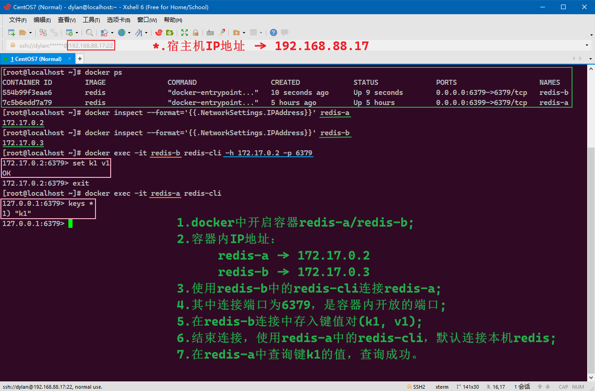
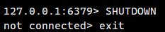
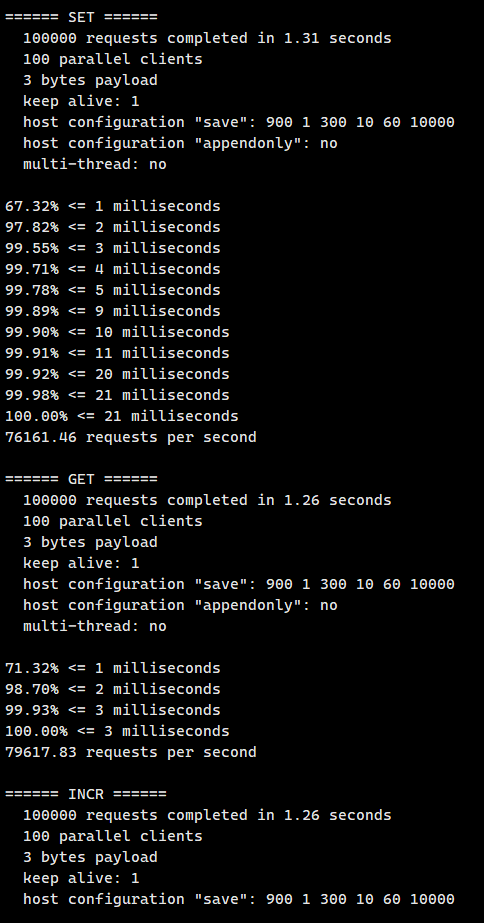

# 前言

> - 本篇是关于NoSQL（Not Only SQL）中的Redis（REmote DIrectory Server）的知识点。
> - 官方命令文档：`http://www.redis.cn/commands.html`

# 什么是Redis？

- Redis（Remote Dictionary Server )，即远程字典服务，是一个开源的使用ANSI C语言编写、支持网络、可基于内存亦可持久化的日志型、Key-Value数据库，并提供多种语言的API。
- Redis会周期性的把更新的数据写入磁盘或者把修改操作写入追加的记录文件，并且在此基础上实现了master-slave(主从)同步。

- Reids是免费和开源的，是当下最热门的NoSQL技术之一，NoSQL也被称为结构化数据库。

## 1. Redis的作用

1. 内存存储、持久化，内存中的数据是断电即失的，因此持久化是很重要的(RDB/AOF)；
2. 由于效率高，因此可用于高速缓存；
3. 用于发布订阅系统；
4. 用于进行地图信息分析；
5. 用于制作计时器、计数器。

## 2. Redis的特性

1. 提供多种数据类型；
2. 数据支持持久化；
3. 支持集群；
4. 支持事务。

## 3. 注意事项

- Redis官方建议在Linux上部署Redis服务，Window版本的Redis更新与维护都相对地慢。


# Docker部署Redis

- 可以选择在虚拟机或`VPS`上部署`Redis`，但目前最快的部署方式是`Docker`部署。

## 1. 获取镜像

- 只需要拉取`Redis`镜像即可。

```shell
docker search redis
docker pull redis:latest
```

## 2. 运行容器

- 运行`Redis`容器：

```bash
docker run --name {CONTAINER_NAME} -p 6399:6379 -d redis
```

- 当你使用`docker`运行了以上命令并成功部署了容器`{CONTAINER_NAME | CONTAINER_ID}`后，`redis-server`就已经在宿主机上的`6399`端口（容器内对应的是`6379`端口）上开启了`Redis`访问服务了。

## 3. 本地连接redis

- 连接`Redis`，服务默认在容器内端口`6379`运行，使用`redis-cli`启动客户端：

```bash
docker exec -it {CONTAINER_NAME | CONTAINER_ID} redis-cli

# 进入Redis后的标识符
127.0.0.1:6379>
```

## 4. 远程连接redis

- 远程连接`Redis`，示例中默认的`docker`宿主机端口是`6399`，如果你是使用`docker`中的其他`redis`容器访问此`redis`容器，则需要获取此`redis`容器`{CONTAINER_NAME | CONTAINER_ID}`的容器内`IP`地址，使用以下命令：

```bash
# 获取容器的所有信息
docker inspect {CONTAINER_NAME | CONTAINER_ID}

# 准确获取容器内的IP地址
docker inspect --format='{{.NetworkSettings.IPAddress}}' {CONTAINER_NAME | CONTAINER_ID}
```

- 假设`IP`为`172.17.0.2`，则位于同一`docker`下的`Redis`容器可以使用以下命令连接到此`Redis`容器：
  - 此时，位于同一`docker`中的`redis`容器相当于处于同一局域网中，因此可以直连。

```bash
docker exec -it {CONTAINER_NAME | CONTAINER_ID} redis-cli -h 172.17.0.2 -p 6379

# 进入Redis后的标识符
172.17.0.2:6379>
```



- 此处试图在`redis-b`中直接使用宿主机IP地址`192.168.88.17`，及其端口`6399`连接`redis-a`中的`redis`服务：


- 可以发现连接失败，但是：
  - 根据`Docker Community Forms`所提供的资料，这是一个已知的`bug`；
  - 因为来自于宿主机局域网中的其他主机中的`redis`容器的连接，是被允许的。
- 我们将请求连接的主机选择为宿主机局域网中的`redis`容器，譬如来自于主机`192.168.88.50`中的`redis`容器的连接请求：


- 很明显，连接没有任何问题，需要明确的是：
  1. 对于`docker`来说，端口映射后无需开放宿主机端口的权限，如`-p 6399:6379`来说，不必显式地开启宿主机`6399`端口的权限，其他主机也可以访问`6399`端口提供的服务；
  2. 但其中存在一个`bug`，对于宿主机本机中的容器来说，它们在使用宿主机`IP`请求宿主机上其他端口提供的容器服务时，是无法正常连接。
- 如何解决"自攻无法自受"的问题呢？答案是开放防火墙权限。使用以下代码，在`192.168.88.17`上开启`6399`端口的权限：

```bash
# 永久开放6399端口
firewall-cmd --zone=public --add-port=6399/tcp --permanent
# 重新加载防火墙
firewall-cmd --reload
```

- 我们再次在容器`redis-b`内使用宿主机`IP`及映射端口`6399`访问`redis-a`中的`redis`服务：


- 可见开放端口`6399`后，测试通过。
- 提示：
  1. 如果需要进行伪集群测试，可以通过开放映射端口权限的方式，让同一`docker`中的`redis`可以根据真实局域网`IP`互相访问，从而测试伪集群是否可用；
  2. 在实际开发中，一台服务器只会部署一个`docker`且开启一个`redis`容器；
     1. 因为即使部署再多的`redis`容器，一旦服务器宕机，所有的`redis`容器都是无法使用的；
     2. 多数情况下是使用哨兵模式去构建一个`redis`的集群，而每个`redis`都应该部署在单独的服务器上。
  3. 因此更多的是通过局域网`IP`加`docker`映射的`redis`端口去访问`redis`服务，毋需特意开启映射端口防火墙权限；
  4. `docker`下的`redis`默认生成的`dump.rdb`文件位于`/data`目录下，没有找到默认启动容器下的`redis.conf`文件，但服务默认会在容器内端口`6379`上运行。

## 5. 自定义服务端口

- 我们知道可以通过`redis.conf`的方式改变默认启动端口`6379`，那么在`docker`中的`redis`容器，如何改变默认的服务运行端口`6379`呢？简单地说，我们希望`redis`容器运行的时候，默认服务开启在容器内的其他端口上。
- 很遗憾，我没有发现可以更改容器`6379`端口默认配置的方法，但我们可以通过配置文件开启容器其他端口对`redis`的支持。
- 以下将使用`6381`端口作为示例，我们将在容器内`6381`端口上开启并配置自己的`redis`服务。
- `docker`中的`redis`容器默认没有提供配置文件，需要自行下载`redis`配置文件：

```bash
wget http://download.redis.io/redis-stable/redis.conf
```

- 更改`redis.conf`中的以下选项：

```bash
# 绑定容器内IP地址，注意此时本容器内不可以使用127.0.0.1来访问6381端口的redis服务，可以自行绑定多个值
bind 172.17.0.2
# 更改监听端口为6381，默认端口6379一直处于监听状态，一旦使用SHUTDOWN命令，redis容器也会退出
port 6381
# 守护模式需要关闭，简单来说yes的情况下，本来是会在后台运行的，但是docker不支持yes的模式，需要更改为no，但此时任务不会在后台执行
# 不过我们可以使用linux命令，使进程在后台运行
daemonize no
# 持久化文件.rdb的名字，前面说过了，默认端口6379生成的dump.rdb文件会在/data目录下
# 如果我们将redis.conf放置在/data目录下，那么端口6381生成的dump.rdb文件也会在/data目录下，以防万一，我们更改一下.rdb文件的名字
dbfilename dump_dylan.rdb
```

- 启动容器，并将文件拷贝到容器中：

```bash
docker run --name dylan-redis -p 6379:6379 -p 6381:6381 -d redis
docker cp ./data/redis.conf dylan-redis:/data/
```

- 使用配置文件启动`redis-server`，使`redis-server`在后台运行：

```bash
docker exec -it dylan-redis redis-server /data/redis.conf &
```

- 此时使用以下命令查看`docker`容器的后台进程：

```bash
docker top dylan-redis
```

- 可以看到默认的`redis-server`运行在端口`6379`，自定义的`redis-server`运行在端口`6381`：


- 我们使用另一台局域网内的主机连接这两个`redis-server`并写入数据：


- 尝试在宿主机中获取另一台主机写入的数据：


- 我们手动在`redis`中使用`save`命令生产`.rdb`文件：
  - 其中`dump.rdb`为默认在容器内端口`6379`开启的`redis-server`服务所生存的持久化文件；
  - 而`dump_dylan.rdb`则为自定义在容器内端口`6381`开启的`redis-server`服务所生存的持久化文件。


# 传统的Redis安装

## 1. 获取安装包

- 首先需要到官网上下载最新的安装包，官网地址为：`https://redis.io/`，点击下载即可得到以`.tar.gz`结尾的Linux安装包。


## 2. 基本坏境准备

- Redis是使用C++语言编写的，所以目标的部署系统，需要具备C++语言的环境，我们需要在系统中安装以下软件，使用以下命令进行安装：

1. 安装gcc套装（通常如果是新系统的话，gcc安装会不全面）

```shell
yum -y install cpp
yum -y install binutils
yum -y install glibc
yum -y install glibc-kernheaders
yum -y install glibc-common
yum -y install glibc-devel
yum -y install gcc
yum -y install make
```
2. 升级gcc

```shell
yum -y install centos-release-scl
yum -y install devtoolset-9-gcc devtoolset-9-gcc-c++ devtoolset-9-binutils
scl enable devtoolset-9 bash
```

## 3. 安装Redis

- 将目标的压缩安装包解压到目录下，一般临时文件或程序放置在`/opt`目录下：

```shell
tar -zxvf redis-6.0.8.tar.gz
```

- 进入解压后的目录中，运行`make`命令，过程会比较漫长，耐心等待：

```shell
make
```

- `make`完成之后，需要切到指定的当前目录下的`src`下运行`make install`命令完成安装：

```shell
cd src && make install
```

- 软件安装完毕之后，目标目录位于`/usr/local/bin/`下：


## 4. 配置Redis

- 需要将此前压缩包中的`redis.conf`拷贝到当前的目录中，作为启动`redis-server`的配置文件：

```shell
mkdir myconf && cp /root/redis/redis redis-6.0.8/redis.conf ./myconf/
```

- 使用vim命令（如果没有自行安装）修改配置文件`redis.conf`：

```shell
vim ./myconf/redis.conf
```

- 需要将服务更改为后台启动模式，将`daemonize`设置为`yes`：


## 5. 启动Redis

- 需要使用配置文件来启动`redis-server`，切换到`/usr/local/bin/`目录下使用以下命令行：

```shell
redis-server ./myconf/redis.conf
```

- 启动`redis-cli`连接本地服务器：

```shell
# 本地启动redis-cli不需要额外添加-h参数指定IP地址
redis-cli -p 6379
```

- 测试`redis`是否正常：

```shell
# 使用ping命令，如果返回PONG则Redis服务正在运行
ping
```


- 使用Linux命令查看后台是否有redis的进程：

```shell
ps -ef | grep redis
```


## 6. 关闭Redis

- 在`redis-cli`中使用命令关闭`redis-server`，同时使用`exit`用于退出`redis-cli`：

```shell
shutdown
exit
```



- 使用Linux命令查看后台是否有redis的进程：

```shell
ps -ef | grep redis
```


## 7. 性能测试

- 在`redis-server`开启的情况下，可以使用默认的工具`redis-benchmark`对你的`redis-server`的性能进行测试，相关参数如下：

| 序号 | 选项      | 描述                                          | 默认值    |
| :--- | :-------- | :-------------------------------------------- | :-------- |
| 1    | **-h**    | 指定服务器主机名                              | 127.0.0.1 |
| 2    | **-p**    | 指定服务器端口                                | 6379      |
| 3    | **-s**    | 指定服务器`socket`                            |           |
| 4    | **-c**    | 指定并发连接数                                | 50        |
| 5    | **-n**    | 指定请求数                                    | 10000     |
| 6    | **-d**    | 以字节的形式指定`SET/GET `值的数据大小        | 3         |
| 7    | **-k**    | `1=keep alive`；`0=reconnect`                 | 1         |
| 8    | **-r**    | `SET/GET/INCR`使用随机`key`,` SADD`使用随机值 |           |
| 9    | **-P**    | 通过管道传输` <numreq> `请求                  | 1         |
| 10   | **-q**    | 强制退出`redis`。仅显示`query/sec`值          |           |
| 11   | **--csv** | 以`CSV`格式输出                               |           |
| 12   | **-l**    | 生成循环，永久执行测试                        |           |
| 13   | **-t**    | 仅运行以逗号分隔的测试命令列表。              |           |
| 14   | **-I**    | `Idle`模式。仅打开`N`个`idle`连接并等待。     |           |

- 一般主要测试并发连接数和请求数量，其他的按照默认配置即可，使用以下命令测试：

```shell
redis-benchmark -h localhost -p 6379 -c 100 -n 100000
```

- `redis-benchmark`会对所有的写入、取出、删除命令进行测试，以下为虚拟机上部署Redis的部分性能测试结果：



# Redis基础知识

- Redis默认有16个数据库，默认使用的是第0个数据库，可以使用select命令进行数据库的切换：

```shell
select (DB_INDEX)

127.0.0.1:6379> select 8
OK
127.0.0.1:6379[8]> 
```


- 使用命令dbsize可以查看当前数据库的存储数据的大小：

```shell
# 查看当前数据库中存储的数据的条目
dbsize

127.0.0.1:6379> DBSIZE
(integer) 2
```

- 使用keys *可以查看当前数据库的所有key：

```shell
# 查看当前数据库中的所有keys
keys *

127.0.0.1:6379> keys *
1) "age"
2) "name"
```

- 使用flushdb可以清空当前数据库的数据：

```shell
# 清空当前数据库的数据
flushdb

127.0.0.1:6379> flushdb
OK
127.0.0.1:6379> keys *
(empty array)
```

- 使用flushall可以清空系统所有数据库中的数据：

```shell
# 清空所有数据库的数据
flushall

127.0.0.1:6379> set name dylan
OK
127.0.0.1:6379> get name
"dylan"
127.0.0.1:6379> select 8
OK
127.0.0.1:6379[8]> set name rose
OK
127.0.0.1:6379[8]> get name
"rose"
127.0.0.1:6379[8]> select 0
OK
127.0.0.1:6379> flushall
OK
127.0.0.1:6379> keys *
(empty array)
127.0.0.1:6379> select 8
OK
127.0.0.1:6379[8]> keys *
(empty array)
```

- Redis是单线程。

  - Redis很快，它的各种操作是基于内存的，CPU并不是Redis的性能瓶颈，Redis的瓶颈是本机内存和网络带宽。

  - Redis是C语言写的，官方提供的数据为100000+QPS，性能完全不比Memecache差。

- Redis为什么单线程还那么快？
  - 误区：高性能的服务器一定是多线程的；
  - 误区：多线程一定比单线程效率高；
  - Redis是将所有的数据放置在内存中的，使用单线程去操作效率就能达到最高，因为对于内存系统来说，没有CPU的上下文切换的效率就是最高的；而多线程会涉及到CPU的上下文切换操作，效率没有单线程来得高。

# Redis数据类型

- Reids的命令行会自动提示下一个位置应该键入什么数据，相当于帮助文档存在于命令行中，也可以前往官网中，查看命令的帮助文档，官方地址为：`http://www.redis.cn/commands.html`
- Redis 是一个开源（BSD许可）的，内存中的数据结构存储系统，它可以用作数据库、缓存和消息中间件。 它支持多种类型的数据结构，如 字符串（strings）， 散列（hashes）， 列表（lists）， 集合（sets）， 有序集合（sorted sets） 与范围查询， bitmaps， hyperloglogs 和 地理空间（geospatial） 索引半径查询。 Redis 内置了 复制（replication），LUA脚本（Lua scripting）， LRU驱动事件（LRU eviction），事务（transactions） 和不同级别的 磁盘持久化（persistence）， 并通过 Redis哨兵（Sentinel）和自动 分区（Cluster）提供高可用性（high availability）。
- Redis-Key基本操作，包括`set`、`get`、`exists`、`select`、`del`、`move`、`expire`、`type`、`keys`：

```shell
# 设置一个key为name的，value为dylan的键值对
127.0.0.1:6379> set name dylan
OK
127.0.0.1:6379> set age 1
OK
# keys * 可以查看当前数据库下的所有keys
127.0.0.1:6379> keys *
1) "age"
2) "name"
# 使用exists关键字可以判断一个key是否存在
127.0.0.1:6379> exists name
(integer) 1
127.0.0.1:6379> exists age
(integer) 1
# 不存在的key会输出0，存在则输出1
127.0.0.1:6379> exists air
(integer) 0
# 使用move将key为age的键值对移动到数据库1中
127.0.0.1:6379> move age 1
(integer) 1
127.0.0.1:6379> select 1
OK
127.0.0.1:6379[1]> get age
"1"
# 使用del关键字可以将指定名称的key删除
127.0.0.1:6379[1]> del age
(integer) 1
127.0.0.1:6379[1]> keys *
(empty array)
127.0.0.1:6379[1]> select 0
OK
127.0.0.1:6379> get name
"dylan"
# expire关键字可以为key设置过期时间，单位为秒
127.0.0.1:6379> expire name 5
(integer) 1
# ttl关键字可以查看指定key的剩余存活时间
127.0.0.1:6379> ttl name
(integer) 2
127.0.0.1:6379> ttl name
(integer) -2
127.0.0.1:6379> keys *
(empty array)
# 展示type命令
127.0.0.1:6379> set name dylan
OK
127.0.0.1:6379> set age 1
OK
127.0.0.1:6379> keys *
1) "age"
2) "name"
# 使用type命令可以查看指定key的value的数据类型
127.0.0.1:6379> type name
string
127.0.0.1:6379> type age
string
```

## 1. 五大数据类型

### a. String

- 关于字符串中的`append`、`strlen`命令：

```shell
127.0.0.1:6379> keys *
(empty array)
# 如果指定名称的key不存在，使用append则相当于使用set
127.0.0.1:6379> append name dylan
(integer) 5
# 使用strlen可以查看当前指定名称的key中存放的value的字符长度
127.0.0.1:6379> strlen name
(integer) 5
127.0.0.1:6379> set description hello
OK
127.0.0.1:6379> get description
"hello"
# append总是返回创建/添加之后的key中的string长度
127.0.0.1:6379> append description ,world
(integer) 11
127.0.0.1:6379> get description
"hello,world"
```

- 自增`incr`和自减`decr`命令，可设定步长的自增`incrby`和自减`decrby`命令：

```shell
127.0.0.1:6379> set views 0
OK
127.0.0.1:6379> incr views
(integer) 1
127.0.0.1:6379> incr views
(integer) 2
127.0.0.1:6379> incr views
(integer) 3
127.0.0.1:6379> get views
"3"
127.0.0.1:6379> decr views
(integer) 2
127.0.0.1:6379> decr views
(integer) 1
127.0.0.1:6379> get views
"1"
127.0.0.1:6379> incrby views 10
(integer) 11
127.0.0.1:6379> decrby views 11
(integer) 0
127.0.0.1:6379> get views
"0"
```

- 截取字符串操作`getrange`和字符串部分替换`setrange`命令：

```shell
127.0.0.1:6379> get description
"hello,world"
# 这里需要注意，截取的区间为[0, 5]，不是左闭右开，是左闭右闭
127.0.0.1:6379> getrange description 0 5
"hello,"
# 截取所有的字符串
127.0.0.1:6379> getrange description 0 -1
"hello,world"
# 替换字符串命令，只能替换从指定索引开始的字符，给多少个就替换多少个
127.0.0.1:6379> setrange description 2 xx
(integer) 11
127.0.0.1:6379> get description
"hexxo,world"
```

- `setex`在设置key的值的同时，为当前key添加过期时间(set with expire)，`setnx`如果当前key不存在，则创建，否则不创建(set if not exist)：

```shell
127.0.0.1:6379> keys *
1) "description"
2) "views"
3) "name"
# 创建了一个名为age的key，过期时间为60秒
127.0.0.1:6379> setex age 60 27
OK
127.0.0.1:6379> keys *
1) "description"
2) "age"
3) "views"
4) "name"
127.0.0.1:6379> ttl age
(integer) 51
# 创建了一个名为gender的key，并设置值为"male"，带上引号是好习惯
127.0.0.1:6379> setnx gender "male"
(integer) 1
127.0.0.1:6379> get gender
"male"
# 使用setnx试图创建一个名为gender的key，返回0即创建失败
127.0.0.1:6379> setnx gender "female"
(integer) 0
127.0.0.1:6379> get gender
"male"
127.0.0.1:6379> ttl age
(integer) -2
127.0.0.1:6379> keys *
1) "description"
2) "gender"
3) "views"
4) "name"
# 使用普通的set命令创建可以覆盖掉原本存在的名为gender的key的值
127.0.0.1:6379> set gender "female"
OK
127.0.0.1:6379> get gender
"female"
```

- 同时设置多个值`mset`，同时获取多个值`mget`，以及原子操作的`msetnx`（如果不存在则创建，只要其中一个存在，那么都不创建）命令：

```shell
# 使用mset可以同时设置多个值
127.0.0.1:6379> mset name "dylan" age 27 gender "male"
OK
127.0.0.1:6379> keys *
1) "age"
2) "gender"
3) "name"
# 使用mget可以同时获取多个值
127.0.0.1:6379> mget name age gender
1) "dylan"
2) "27"
3) "male"
# msetnx是一个原子操作的命令，要么都成功，要么都失败
127.0.0.1:6379> msetnx name "rose" telephone 18299990000
(integer) 0
127.0.0.1:6379> keys *
1) "age"
2) "gender"
3) "name"
```

- 关于key的命名是可以多样化的，可以使用`:`将key进行分层操作，相当于存储对象：

```shell
127.0.0.1:6379> msetnx user:A:name "dylan" user:A:age 27 user:B:name "rose" user:B:age 24
(integer) 1
127.0.0.1:6379> keys *
1) "user:A:name"
2) "user:B:age"
3) "user:B:name"
4) "user:A:age"
127.0.0.1:6379> mget user:A:name user:A:age
1) "dylan"
2) "27"
```

- 使用命令`getset`可以进行先获取再设置的操作：

```shell
127.0.0.1:6379> keys *
(empty array)
127.0.0.1:6379> getset name "dylan"
(nil)
127.0.0.1:6379> keys *
1) "name"
127.0.0.1:6379> getset name "rose"
"dylan"
127.0.0.1:6379> get name
"rose"
```

### b. List

- 在Redis中，可以把List当做栈、队列或阻塞队列使用，大部分的List命令都是使用`l`开头的；
- 在链表两边插入或改动其值，效率最高；对于修改中间的元素插入或修改来说，效率会低一些。
- 创建List并向其中添加数据使用命令`lpush`（left push）或`rpush`（right push），获取其中的内容可以使用`lrange`：

```shell
127.0.0.1:6379> lpush my_list "dylan" "rose"
(integer) 2
127.0.0.1:6379> lpush my_list "jack"
(integer) 3
127.0.0.1:6379> lpush my_list "john"
(integer) 4
127.0.0.1:6379> lrange my_list 0 -1
1) "john"
2) "jack"
3) "rose"
4) "dylan"
127.0.0.1:6379> lrange my_list 3 3
1) "dylan"
127.0.0.1:6379> rpush my_list "hanna" "dora"
(integer) 6
127.0.0.1:6379> lrange my_list 0 -1
1) "john"
2) "jack"
3) "rose"
4) "dylan"
5) "hanna"
6) "dora"
```

- 从List中移除列表头或列表尾的数据，使用命令`lpop`或`rpop`：

```shell
127.0.0.1:6379> lrange my_list 0 -1
1) "john"
2) "jack"
3) "rose"
4) "dylan"
5) "hanna"
6) "dora"
127.0.0.1:6379> lpop my_list
"john"
127.0.0.1:6379> rpop my_list
"dora"
127.0.0.1:6379> lrange my_list 0 -1
1) "jack"
2) "rose"
3) "dylan"
4) "hanna"
```

- 通过索引获取值使用`lindex`，获取列表长度使用`llen`：

```shell
127.0.0.1:6379> lrange my_list 0 -1
1) "jack"
2) "rose"
3) "dylan"
4) "hanna"
127.0.0.1:6379> lindex my_list 2
"dylan"
127.0.0.1:6379> llen my_list
(integer) 4
```

- 使用命令`lrem`可以移除list中指定数量的指定值：

```shell
127.0.0.1:6379> lrange my_list 0 -1
1) "jack"
2) "rose"
3) "rose"
4) "jack"
5) "rose"
6) "dylan"
7) "hanna"
127.0.0.1:6379> lrem my_list 2 "rose"
(integer) 2
127.0.0.1:6379> lrange my_list 0 -1
1) "jack"
2) "jack"
3) "rose"
4) "dylan"
5) "hanna"
127.0.0.1:6379> lrem my_list 1 "jack"
(integer) 1
127.0.0.1:6379> lrange my_list 0 -1
1) "jack"
2) "rose"
3) "dylan"
4) "hanna"
```

- 使用命令`ltrim`可以截取某一段的列表元素：

```shell
127.0.0.1:6379> lrange my_list 0 -1
1) "jack"
2) "rose"
3) "dylan"
4) "hanna"
127.0.0.1:6379> ltrim my_list 2 3
OK
127.0.0.1:6379> lrange my_list 0 -1
1) "dylan"
2) "hanna"
```

- 组合命令`rpoplpush`可以将一个列表中的尾部元素添加到另一个列表的头部中：

```shell
127.0.0.1:6379> lrange my_list 0 -1
1) "dylan"
2) "hanna"
3) "dora"
127.0.0.1:6379> rpoplpush my_list new_list
"dora"
127.0.0.1:6379> lrange my_list 0 -1
1) "dylan"
2) "hanna"
127.0.0.1:6379> lrange new_list 0 -1
1) "dora"
```

- 使用`exists`命令查看当前指定名称的列表key是否存在，将列表（列表需要存在或指定下标需要存在，否则程序会报错）指定下标的值更改为其他值，使用`lset`命令，相当于更新操作：

```shell
127.0.0.1:6379> exists some_list
(integer) 0
127.0.0.1:6379> exists my_list
(integer) 1
127.0.0.1:6379> lrange my_list 0 -1
1) "jack"
2) "dylan"
3) "hanna"
127.0.0.1:6379> lset some_list 0 "rose"
(error) ERR no such key
127.0.0.1:6379> lset my_list 3 "rose"
(error) ERR index out of range
127.0.0.1:6379> lset my_list 0 "rose"
OK
127.0.0.1:6379> lrange my_list 0 -1
1) "rose"
2) "dylan"
3) "hanna"
```

- 使用`linsert`命令可以在指定的列表值前/后插入指定的数据（不接受多个数据）：

```shell
127.0.0.1:6379> rpush oh_list "hello" "world"
(integer) 2
127.0.0.1:6379> lrange oh_list 0 -1
1) "hello"
2) "world"
127.0.0.1:6379> linsert oh_list before "world" "big"
(integer) 3
127.0.0.1:6379> linsert oh_list after "world" "!"
(integer) 4
127.0.0.1:6379> lrange oh_list 0 -1
1) "hello"
2) "big"
3) "world"
4) "!"
```

### c. Set

- Set中的值是不重复的、无序的。

- 使用`sadd`创建并向集合中添加一个或多个值，使用`smembers`可以打印当前集合，命令`sismember`可以判断集合中是否包含某元素，命令`scard`可以获取到集合的长度，使用命令`srem`可以从指定的集合中删除指定的值：

```shell
127.0.0.1:6379> sadd my_set "dylan" "hanna" "dora" "jack"
(integer) 4
127.0.0.1:6379> smembers my_set
1) "hanna"
2) "dora"
3) "jack"
4) "dylan"
127.0.0.1:6379> sismember my_set "rose"
(integer) 0
127.0.0.1:6379> sismember my_set "dylan"
(integer) 1
127.0.0.1:6379> scard my_set
(integer) 4
127.0.0.1:6379> srem my_set "jack"
(integer) 1
127.0.0.1:6379> smembers my_set
1) "hanna"
2) "dora"
3) "dylan"
```

- 使用命令`srandmember`可以从集合中随机获取到指定`[count]`数量的元素，使用命令`spop`可以从集合中随机删除指定`[count]`数量的元素：

```shell
127.0.0.1:6379> smembers my_set
1) "rose"
2) "dora"
3) "dylan"
4) "mike"
5) "hanna"
6) "jack"
127.0.0.1:6379> srandmember my_set
"rose"
127.0.0.1:6379> srandmember my_set
"jack"
127.0.0.1:6379> srandmember my_set 2
1) "jack"
2) "dylan"
127.0.0.1:6379> srandmember my_set 2
1) "dora"
2) "jack"
127.0.0.1:6379> spop my_set
"hanna"
127.0.0.1:6379> spop my_set 3
1) "jack"
2) "dylan"
3) "dora"
127.0.0.1:6379> smembers my_set
1) "mike"
2) "rose"
```

- 从集合中移动指定值的元素到另一个集合中使用命令`smove`：

```shell
127.0.0.1:6379> smembers my_set
1) "hanna"
2) "mike"
3) "rose"
4) "dora"
127.0.0.1:6379> keys *
1) "my_set"
127.0.0.1:6379> smove my_set new_set "mike"
(integer) 1
127.0.0.1:6379> keys *
1) "new_set"
2) "my_set"
127.0.0.1:6379> smembers new_set
1) "mike"
127.0.0.1:6379> smembers my_set
1) "hanna"
2) "rose"
3) "dora"
```

- 计算俩集合的差集`sdiff`、交集`sinter`、并集`sunion`，其中差集是以前一个集合为基准的：

```shell
127.0.0.1:6379> smembers my_set
1) "luna"
2) "hanna"
3) "rose"
4) "ivy"
5) "kevin"
6) "dora"
7) "dylan"
127.0.0.1:6379> smembers new_set
1) "hanna"
2) "mike"
3) "rose"
4) "dylan"
127.0.0.1:6379> sdiff my_set new_set
1) "luna"
2) "ivy"
3) "dora"
4) "kevin"
127.0.0.1:6379> sdiff new_set my_set
1) "mike"
127.0.0.1:6379> sinter my_set new_set
1) "hanna"
2) "rose"
3) "dylan"
127.0.0.1:6379> sunion my_set new_set
1) "rose"
2) "ivy"
3) "dora"
4) "kevin"
5) "dylan"
6) "hanna"
7) "luna"
8) "mike"
```

### d. Hash

- Hash的数据结构`key - <key-value>`，跟进一可以理解为`key-json`；而本质上Hash和String没有太大的区别，只是在Hash中的value变成了一个`<key-value>`，大部分的Hash命令都是以`h`开头的。
- 使用`hset`和`hget`设置、获取`key`中的`<key-value>`数据，使用`hmset`和`hmget`可以批量设置、获取`key`中的`<key-value>`数据，命令`hgetall`可以打印出Hash中的所有键值对数据：

```shell
127.0.0.1:6379> hset my_hash name "dylan"
(integer) 1
127.0.0.1:6379> hget my_hash name
"dylan"
127.0.0.1:6379> hmset my_hash name "rose" age 27
OK
127.0.0.1:6379> hmget my_hash name age
1) "rose"
2) "27"
127.0.0.1:6379> hgetall my_hash
1) "name"
2) "rose"
3) "age"
4) "27"
```

- 使用命令`hdel`可以根据`key - <key-value>`中值的键名，删除指定key中的`<key-value>`键值对，使用命令`hlen`可以查看当前Hash中包含多少个`<key-value>`键值对：

```shell
127.0.0.1:6379> hgetall my_hash
1) "name"
2) "rose"
3) "age"
4) "27"
127.0.0.1:6379> hdel my_hash name
(integer) 1
127.0.0.1:6379> hgetall my_hash
1) "age"
2) "27"
127.0.0.1:6379> hlen my_hash
(integer) 1
```

- 使用命令`hexists`判断当前键中是否包含拥有指定键名的键值对，使用`hkeys`可以获取当前Hash中的所有`<key-value>`中的`key`，使用`hvals`可以获取当前Hash中的所有`<key-value>`中的`value`：

```shell
127.0.0.1:6379> hgetall my_hash
1) "age"
2) "27"
3) "name"
4) "rose"
5) "gender"
6) "female"
127.0.0.1:6379> hexists my_hash gender
(integer) 1
127.0.0.1:6379> hexists my_hash telephone
(integer) 0
127.0.0.1:6379> hkeys my_hash
1) "age"
2) "name"
3) "gender"
127.0.0.1:6379> hvals my_hash
1) "27"
2) "rose"
3) "female"
```

- 使用命令`hincrby`可以设置数据的自增或自减，使用`hsetnx`可以在创建指定的`<key-value>`之前检查它是否存在，如果存在则创建失败，不存在则创建成功：

```shell
127.0.0.1:6379> hgetall my_hash
1) "age"
2) "27"
3) "name"
4) "rose"
5) "gender"
6) "female"
127.0.0.1:6379> hincrby my_hash age 2
(integer) 29
127.0.0.1:6379> hget my_hash age
"29"
127.0.0.1:6379> hincrby my_hash age -4
(integer) 25
127.0.0.1:6379> hget my_hash age
"25"
127.0.0.1:6379> hsetnx my_hash name "dylan"
(integer) 0
127.0.0.1:6379> hsetnx my_hash telephone 123456
(integer) 1
127.0.0.1:6379> hgetall my_hash
1) "age"
2) "25"
3) "name"
4) "rose"
5) "gender"
6) "female"
7) "telephone"
8) "123456"
```

- 由于Hash的数据特性，我们可以用它来存储需要变更的数据，例如用户信息：

```shell
127.0.0.1:6379> hmset userId name "dylan" age 27 gender "male"
OK
127.0.0.1:6379> hgetall userId
1) "name"
2) "dylan"
3) "age"
4) "27"
5) "gender"
6) "male"
127.0.0.1:6379> hmget userId name gender
1) "dylan"
2) "male"
```

### e. Zset

- Zset是一个不重复的、有序的集合，采用一个`score`标识，来为普通的`set`增加了排序的功能。
- 使用`zadd`命令可以给Zset添加数据，使用`zrange`命令可以获取到Zset中的数据：

```shell
127.0.0.1:6379> zadd my_zset 1 "dylan" 2 "hanna" 4 "dora" 3 "rose"
(integer) 4
127.0.0.1:6379> zrange my_zset 0 -1
1) "dylan"
2) "hanna"
3) "rose"
4) "dora"
```

- 使用命令`zrange`可以查看`score`从小到大的排序，使用命令`zrevrange`可以查看`score`从大到小的排序，`zrange`和`zrevrange`是基于索引下标的，如果想要按照`score`的大小排序，需要相应使用命令`zrangebyscore`或`zrevrangebyscore`，其中`-inf`表示负无穷，`+inf`表示正无穷：

```shell
127.0.0.1:6379> zadd user_salary 8000 "dylan" 6000 "hanna" 4000 "dora" 3000 "jack"
(integer) 4
127.0.0.1:6379> zadd user_salary 7000 "rose" 5500 "ivy"
(integer) 2
127.0.0.1:6379> zrange user_salary 0 -1
1) "jack"
2) "dora"
3) "ivy"
4) "hanna"
5) "rose"
6) "dylan"
127.0.0.1:6379> zrangebyscore user_salary -inf +inf
1) "jack"
2) "dora"
3) "ivy"
4) "hanna"
5) "rose"
6) "dylan"
127.0.0.1:6379> zrangebyscore user_salary -inf +inf withscores
 1) "jack"
 2) "3000"
 3) "dora"
 4) "4000"
 5) "ivy"
 6) "5500"
 7) "hanna"
 8) "6000"
 9) "rose"
10) "7000"
11) "dylan"
12) "8000"
127.0.0.1:6379> zrevrangebyscore user_salary +inf -inf
1) "dylan"
2) "rose"
3) "hanna"
4) "ivy"
5) "dora"
6) "jack"
127.0.0.1:6379> zrevrangebyscore user_salary 6000 3000 withscores
1) "hanna"
2) "6000"
3) "ivy"
4) "5500"
5) "dora"
6) "4000"
7) "jack"
8) "3000"
```

- 使用命令`zrem`可以从Zset中删除指定的值，使用命令`zcard`可以查看目标`Zset`包含的数据数量：

```shell
127.0.0.1:6379> zrange user_salary 0 -1
1) "jack"
2) "dora"
3) "ivy"
4) "hanna"
5) "rose"
6) "dylan"
127.0.0.1:6379> zrem user_salary "hanna"
(integer) 1
127.0.0.1:6379> zrange user_salary 0 -1
1) "jack"
2) "dora"
3) "ivy"
4) "rose"
5) "dylan"
127.0.0.1:6379> zcard user_salary
(integer) 5
```

- 使用命令`zcount`可以查看指定区间内包含多少符合的数据，其中使用`(5500`、`(8000`表示为开区间，也就是不包括`5500`、`8000`：

```shell
127.0.0.1:6379> zrange user_salary 0 -1 withscores
 1) "jack"
 2) "3000"
 3) "dora"
 4) "4000"
 5) "ivy"
 6) "5500"
 7) "rose"
 8) "7000"
 9) "dylan"
10) "8000"
127.0.0.1:6379> zcount user_salary 5000 8000
(integer) 3
127.0.0.1:6379> zcount user_salary (5500 8000
(integer) 2
127.0.0.1:6379> zcount user_salary (5500 (8000
(integer) 1
```

- 使用Zset可以作为成绩表、工资表或带权重数据的容器，实现排行榜（Top N）实例：

```shell
127.0.0.1:6379> zadd message 1 "[errorA]" 2 "[warningA]" 1 "[errorC]" 2 "[warningD]" 3 "[infoA]" 1 "[errorF]"
(integer) 6
127.0.0.1:6379> zrange message 0 -1
1) "[errorA]"
2) "[errorC]"
3) "[errorF]"
4) "[warningA]"
5) "[warningD]"
6) "[infoA]"
127.0.0.1:6379> zcount message 1 1
(integer) 3
127.0.0.1:6379> zcount message 2 2
(integer) 2
127.0.0.1:6379> zcount message 3 3
(integer) 1
127.0.0.1:6379> zrangebyscore message 1 1
1) "[errorA]"
2) "[errorC]"
3) "[errorF]"
```

## 2. 三种特殊数据类型

### a. geospatial

- `geospatial`可以将指定地理空间位置（`经度 longitude`、`纬度 latitude`、`名称 member`）添加到指定`key`中。这些数据将会存储到`sorted set`里，方便使用`georadius`和`georadiusbymember`命令对数据进行半径查询等操作。
- 相关规则：
  1. 有效的经度（longitude）从-180度到180度；
  2. 有效的纬度（latitude）从-85.05112878度到85.05112878度。
- 使用命令`geoadd`可以创建`geospatial`并向其中添加相关的经纬度数据，本质上`geospatial`是一个`zset`，因此可以使用`zset`的相关方法对`geospatial`的元素进行相关查询或删除的操作：

```shell
127.0.0.1:6379> geoadd china:city 113.280637 23.125178 "guangzhou" 121.472644 31.231706 "shanghai"
(integer) 2
127.0.0.1:6379> geoadd china:city 116.405285 39.904989 "beijing" 114.085947 22.547 "shenzhen"
(integer) 2
127.0.0.1:6379> geoadd china:city 106.504962 29.533155 "chongqing" 118.767413 32.041544 "nanjing"
(integer) 2
127.0.0.1:6379> zrange china:city 0 -1
1) "chongqing"
2) "shenzhen"
3) "guangzhou"
4) "shanghai"
5) "nanjing"
6) "beijing"
127.0.0.1:6379> geoadd china:city 100 50 something
(integer) 1
127.0.0.1:6379> zrange china:city 0 -1
1) "chongqing"
2) "shenzhen"
3) "guangzhou"
4) "shanghai"
5) "nanjing"
6) "beijing"
7) "something"
127.0.0.1:6379> zrem china:city something
(integer) 1
127.0.0.1:6379> zrange china:city 0 -1
1) "chongqing"
2) "shenzhen"
3) "guangzhou"
4) "shanghai"
5) "nanjing"
6) "beijing"
```

- 使用命令`geopos`命令可以查询一个或多个指定`member`的经纬度信息：

```shell
127.0.0.1:6379> geopos china:city "beijing" "shenzhen"
1) 1) "116.40528291463851929"
   2) "39.9049884229125027"
2) 1) "114.08594459295272827"
   2) "22.54699993773966327"
```

- 使用命令`geodist`命令可以查询两个`member`的直线距离，单位是可选的：
  - `m`：表示单位为米；
  - `km`：表示单位为千米；
  - `mi`：表示单位为英里；
  - `ft`：表示单位为英尺。

```shell
127.0.0.1:6379> geodist china:city "beijing" "guangzhou" km
"1889.3706"
127.0.0.1:6379> geodist china:city "nanjing" "shanghai" km
"271.5419"
```

- 使用命令`georadius`可以查询给定纬度的`radius`内的所有`members`，在`georadius`后面可以连接的可选参数有`[WITHCOORD]`、`[WITHDIST]`、`[WITHHASH]`、`[COUNT count]`：
  - `[WITHCOORD]`：输出的数据带经纬度；
  - `[WITHDIST]`：输出的数据带距离；
  - `[WITHHASH]`：输出的数据带经纬度的hash表达数据；
  - `[COUNT count]`：输出限制在`count`条以内包括`count`条。

```shell
127.0.0.1:6379> georadius china:city 116 39 1000 km
1) "nanjing"
2) "beijing"
3) "shanghai"
127.0.0.1:6379> georadius china:city 116 39 1000 km count 2
1) "beijing"
2) "nanjing"
127.0.0.1:6379> georadius china:city 116 39 1000 km withcoord count 2
1) 1) "beijing"
   2) 1) "116.40528291463851929"
      2) "39.9049884229125027"
2) 1) "nanjing"
   2) 1) "118.76741319894790649"
      2) "32.04154324806454923"
```

- 使用命令`georadiusbymember`可以使用`geospatial`中的已有坐标作为查询的条件，使用方法和`georadius`基本无差异：

```shell
127.0.0.1:6379> georadiusbymember china:city guangzhou 1000 km
1) "shenzhen"
2) "guangzhou"
3) "chongqing"
```

- 使用命令`geohash`可以获得一个或多个位置元素的`Geohash`表示，该命令将返回11个字符的`Geohash`字符串，了解即可基本上很少用到：

```shell
127.0.0.1:6379> geohash china:city "beijing" "guangzhou"
1) "wx4g0b7xrt0"
2) "ws0e9cb3yj0"
```

### b. hyperloglog

- `hyperloglog`使用用来做基数统计算法的，它的优点是，在输入元素的数量或者体积非常非常大的时候，计算基数所需的空间总是固定的、并且是很小的；
- 在`Redis`中，每个`hyperloglog`键只需要花费`12kb`的内存，就可以计算接近`2^64`个不同的元素的基数。这和计算基数时，元素越多耗费内存就越多的集合，形成鲜明的对比；
  - 什么是基数？
  - 比如数据集 `{1, 3, 5, 7, 5, 7, 8}`， 那么这个数据集的基数集为 `{1, 3, 5 ,7, 8}`, 基数(不重复元素)为`5`。 基数估计就是在误差可接受的范围内，快速计算基数。
- 但是，因为`hyperloglog`只会根据输入元素来计算基数，而不会存储输入元素的本身，所以`hyperloglog`不能像集合那样，返回输入的各个元素。

- `hyperloglog`只有三个命令，创建一个`hyperloglog`键并添加元素的命令`pfadd`、计算`hyperloglog`键中基数的命令`pfcount`以及合并两个或多个`hyperloglog`键的命令`pfmerge`：

```shell
127.0.0.1:6379> pfadd first_key "dylan" "rose" "jack" "kevin" "dylan" "dylan" "jack"
(integer) 1
127.0.0.1:6379> pfcount first_key
(integer) 4
127.0.0.1:6379> pfadd second_key "dylan" "rose" "hanna" "dora" "dora"
(integer) 1
127.0.0.1:6379> pfcount second_key
(integer) 4
127.0.0.1:6379> pfmerge merge_key first_key second_key
OK
127.0.0.1:6379> keys *
1) "second_key"
2) "first_key"
3) "merge_key"
127.0.0.1:6379> pfcount merge_key
(integer) 6
127.0.0.1:6379> pfcount first_key second_key
(integer) 6
```

- `hyperloglog`拥有`0.81%`的错误率，如果统计任务是允许容错的，那么可以使用`hyperloglog`；否则，应该选用`set`或自己的数据类型。

### c. bitmaps

- `Bitmaps`事实上并不是一个传统意义上的数据类型，它是在`String`类型的基础上的一种面向于位(`bit`)操作的类型。
- `String`类型的最大存储大小为`512MB`，也就是`2^39 bits`，对于基于`String`类型的面向位操作的`Bitmaps`来说，是完全足够存储`2^32 bits`大小的数据。
- 使用命令`setbit`可以创建一个bitmaps并向其中添加数据，使用命令其中字符`g`的`ASCII`码为`0110 0111`，字符`f`的`ASCII`码为`0110 0110`：

```shell
127.0.0.1:6379> setbit bit_key 0 0
(integer) 0
127.0.0.1:6379> setbit bit_key 1 1
(integer) 0
127.0.0.1:6379> setbit bit_key 2 1
(integer) 0
127.0.0.1:6379> setbit bit_key 3 0
(integer) 0
127.0.0.1:6379> setbit bit_key 4 0
(integer) 0
127.0.0.1:6379> setbit bit_key 5 1
(integer) 0
127.0.0.1:6379> setbit bit_key 6 1
(integer) 0
127.0.0.1:6379> setbit bit_key 7 1
(integer) 0
# 字符g的ascii编码为：0110 0111
127.0.0.1:6379> get bit_key
"g"
127.0.0.1:6379> setbit bit_key 7 0
(integer) 1
# 字符f的ascii编码为：0110 0110
127.0.0.1:6379> get bit_key
"f"
```

- 使用`bitcount`命令可以获取到目标`bitmaps`中有多少`bit`的值被设置为`1`，`bitcount`中的额外参数`[start end]`针对的是`bitmaps`的字符串形式数据下标值，而不是`bitmaps`本身的位值：

```shell
127.0.0.1:6379> set example_key "fff"
OK
127.0.0.1:6379> bitcount example_key
(integer) 12
127.0.0.1:6379> setbit example_key 7 1
(integer) 0
127.0.0.1:6379> bitcount example_key
(integer) 13
127.0.0.1:6379> get example_key
"gff"
# 其中[start, end]的设置为[0, 0]，指的就是字符g，字符g的ascii编码为：0110 0111，也就是5个1
127.0.0.1:6379> bitcount example_key 0 0
(integer) 5
# 其中[start, end]的设置为[2, 2]，指的就是字符f，字符f的ascii编码为：0110 0110，也就是4个1
127.0.0.1:6379> bitcount example_key 2 2
(integer) 4
```

# Redis中的事务

## 1. 事务执行

- `Redis`的单条命令是保证原子性的，但`Redis`的事务是不保证原子性的；
- `Redis`没有隔离级别的概念，所有的命令在事务中并没有被直接被执行，只有在发起执行命令的时候，才会被一次性执行；
- `Redis`事务可以一次执行多个命令，并带有三个重要的保证：
  1. 批量操作在发送`multi`后、`exec`前被放入队列缓存；
  2. 收到`exec`命令后，多个命令进入事务并被顺序执行，事务中的任意命令执行失败，其余的命令依然会被执行；
  3. 在事务执行的过程中，其他客户端提交的命令请求不会被插入到事务执行命令的序列中。
- `Reids`事务从开始到执行会经历以下三个阶段：
  1. 开始事务；
  2. 命令入队；
  3. 执行事务。
- 以下是`Redis`中一个普通事务的执行过程，使用命令`multi`开启一个事务，之后编写的若干命令会相继进入队列中，最后执行`exec`命令，`Redis`会按顺序地、一次性执行完队列中的所有命令：

```shell
127.0.0.1:6379> multi
OK
127.0.0.1:6379> set name "dylan"
QUEUED
127.0.0.1:6379> set age 27
QUEUED
127.0.0.1:6379> set gender "male"
QUEUED
127.0.0.1:6379> keys *
QUEUED
127.0.0.1:6379> exec
1) OK
2) OK
3) OK
4) 1) "gender"
   2) "age"
   3) "name"
```

- 当你使用`multi`开启了一个事务，并使命令入队之后，如果此时需要取消次事务，需要使用命令`discard`，`discard`将会退出这个事务：

```shell
127.0.0.1:6379> multi
OK
127.0.0.1:6379> set name "dylan"
QUEUED
127.0.0.1:6379> set age 27
QUEUED
127.0.0.1:6379> set gender "male"
QUEUED
127.0.0.1:6379> discard
OK
127.0.0.1:6379> keys *
(empty array)
```

- 如果事务出现编译型异常（可以理解为命令语法有误），即代码有问题，则事务中所有的命令都不会被执行：

```shell
# 开启事务
127.0.0.1:6379> multi
OK
127.0.0.1:6379> set name "dylan"
QUEUED
127.0.0.1:6379> set age 27
QUEUED
127.0.0.1:6379> set gender "male"
QUEUED
# 编译型的错误会实时被提示
127.0.0.1:6379> set something
(error) ERR wrong number of arguments for 'set' command
# 最终执行exec的结果是全部失败的
127.0.0.1:6379> exec
(error) EXECABORT Transaction discarded because of previous errors.
# 键name没有被设置成功
127.0.0.1:6379> get name
(nil)
```

- 如果事务出现运行时异常（可以理解为语法无误，但无法这样操作），虽然也是代码有问题，但除了这个运行时异常的命令之外，其他命令是会被执行：

```shell
# 开启事务
127.0.0.1:6379> multi
OK
127.0.0.1:6379> set name "dylan"
QUEUED
# incr命令不能作用于value是字符串类型的key上
127.0.0.1:6379> incr name
QUEUED
127.0.0.1:6379> set age 27
QUEUED
127.0.0.1:6379> set gender "male"
QUEUED
# 最终执行exec的结果是仅有运行时错误的该条命令会报错，其余的创建命令均被执行
127.0.0.1:6379> exec
1) OK
2) (error) ERR value is not an integer or out of range
3) OK
4) OK
# 查看其中一个key，已经创建成功了
127.0.0.1:6379> get name
"dylan"
```

## 2. 锁机制

- 关于锁的相关概念：
  - 悲观锁：认为无论什么时候都会出现问题，对所有的操作都会进行加锁处理；
  - 乐观锁：认为无论什么时候都不会出现问题，所以不会上锁，它在更新数据的时候会先判断当前需要修改的数据是否被修改过，如果没有则事务执行成功。
    - 获取`version`
    - 更新的时候比较`version`时候一致

- 以下展示`Redis`实现乐观锁的过程，事务是可以正常执行并成功的，使用`watch`命令监控目标`key`的版本`version`，在事务成功执行并结束的时候，会自动解除对`key`的监控：

```shell
127.0.0.1:6379> mget money_left money_spent
1) "100"
2) "0"
127.0.0.1:6379> watch money_left
OK
127.0.0.1:6379> multi
OK
127.0.0.1:6379> decrby money_left 20
QUEUED
127.0.0.1:6379> incrby money_spent 20
QUEUED
127.0.0.1:6379> exec
1) (integer) 80
2) (integer) 20
127.0.0.1:6379> mget money_left money_spent
1) "80"
2) "20"
```

- 如果在监控目标`key`的期间，事务提交执行之前，有另外一个线程对目标`key`进行了修改操作，则当前线程中的事务将全部提交失败，此时事务没有被成功执行，需要使用`unwatch`手动解锁，之后可以再次使用`watch`获取更新的`version`，再次监视：

```shell
# ======================== 线程A ======================== #
127.0.0.1:6379> mget money_left money_spent
1) "80"
2) "20"
127.0.0.1:6379> watch money_left
OK
127.0.0.1:6379> multi
OK
127.0.0.1:6379> decrby money_left 20
QUEUED
127.0.0.1:6379> incrby money_spent 20
QUEUED
# ======================== 线程B ======================== #
127.0.0.1:6379> get money_left
"80"
127.0.0.1:6379> incrby money_left 120
(integer) 200
127.0.0.1:6379> get money_left
"200"
# ======================== 线程A ======================== #
127.0.0.1:6379> exec
(nil)
127.0.0.1:6379> mget money_left money_spent
1) "200"
2) "20"
127.0.0.1:6379> unwatch
OK
```

# 什么是Jedis？

- `Jedis`是`Redis`官方推荐的`Java`连接开发工具，使用`Java`操作`Reids`的中间件。如果你要使用`Java`来操作`Redis`，那么一定要对`Jedis`十分熟悉。
- 如果需要虚拟机上的`Redis`作为`Jedis`的测试服务器，那么需要配置或添加一个`redis-remote.conf`的配置文件，更改其中的`bind`配置，并在启动`redis-server`的时候，加载该配置文件：


```shell
redis-server ./myconf/redis-remote.conf
```

- 默认最小化安装的`CentOS7`的防火墙是开启的，需要在服务器上开放`redis`的默认端口`6379`，才能使`jedis`连接上目标服务器：

```shell
# 查看防火墙所有开放的端口
firewall-cmd --zone=public --list-ports
# 开放6379端口
firewall-cmd --zone=public --add-port=6379/tcp --permanent
# 使开放/关闭端口操作立即生效
firewall-cmd --reload
```

- 使用`Jedis`需要添加以下`maven`坐标：

```xml
<dependency>
    <groupId>redis.clients</groupId>
    <artifactId>jedis</artifactId>
    <version>3.1.0</version>
</dependency>
```

- 运行测试代码，确保能正确连接上服务器：

```java
package cn.dylanphang;

import redis.clients.jedis.Jedis;

/**
 * @author dylan
 */
public class PingTest {
    public static void main(String[] args) {
        Jedis jedis = new Jedis("192.168.88.130", 6379);
        System.out.println(jedis.ping());

        jedis.close();
    }
}
```

- 控制台输出：


# Jedis基础知识

- 所有`Jedis`中的方法，基本上除了大小写之外，都与基本的命令无差异，因此不再赘述。

- 以下仅展示部分基本命令的代码，供参考：

```java
package cn.dylanphang;

import redis.clients.jedis.Jedis;

/**
 * @author dylan
 */
public class BasicCommands {
    public static void main(String[] args) {
        final Jedis jedis = new Jedis("192.168.88.130", 6379);

        System.out.println("flushDB() - 清空当前数据库中的数据：" + jedis.flushDB());
        System.out.println("flushAll() - 清空所有数据库中的数据：" + jedis.flushAll());

        System.out.println("exists(String key) - 判断某个键是否存在：" + jedis.exists("name"));
        System.out.println("set(String key, String value) - 新增键值对数据：" + jedis.set("name", "dylan"));
        System.out.println("set(String key, String value) - 新增键值对数据：" + jedis.set("age", "27"));
        System.out.println("set(String key, String value) - 新增键值对数据：" + jedis.set("gender", "male"));
        System.out.println("set(String key, String value) - 新增键值对数据：" + jedis.set("address", "Guangzhou"));

        System.out.print("keys(\"*\") - 查看目前DB中的所有键：");
        System.out.println(jedis.keys("*"));

        System.out.println("del(String key) - 删除指定名称的键：" + jedis.del("age"));
        System.out.println("exists(String key) - 判断某个键是否存在：" + jedis.exists("age"));

        System.out.println("type(String key) - 查看指定键中存放的value类型：" + jedis.type("name"));

        System.out.println("randomKey() - 随机方法当前DB中的一个key的名称：" + jedis.randomKey());
        System.out.println("randomKey() - 随机方法当前DB中的一个key的名称：" + jedis.randomKey());
        System.out.println("randomKey() - 随机方法当前DB中的一个key的名称：" + jedis.randomKey());

        System.out.println("rename(String oldKey, String newKey) - 重命名key的当前名字为指定的其他名字："
                        + jedis.rename("address", "addr"));

        System.out.println("get(String key) - 取出指定key中的value值：" + jedis.get("addr"));

        System.out.println("select(int index) - 切换到目标索引值8的数据库中：" + jedis.select(8));
        System.out.println("dbSize() - 返回当前数据库中的所有key的数量：" + jedis.dbSize());

        System.out.println("select(int index) - 切换到目标索引值0的数据库中：" + jedis.select(0));
        System.out.println("dbSize() - 返回当前数据库中的所有key的数量：" + jedis.dbSize());

        System.out.println("flushDB() - 清空当前数据库中的数据：" + jedis.flushDB());
        System.out.println("dbSize() - 返回当前数据库中的所有key的数量：" + jedis.dbSize());

        jedis.close();
    }
}
```

- 控制台输出如下：


# Jedis中的事务

## 1. 事务执行

- 和`Redis`中的事务稍稍不同的是，`Jedis`中没有存在编译型的错误，因为如果程序中使用的`Redis`语法是不正确的，`Java`会首先不通过编译型的错误，因此程序本身已经是无法通过检查，不可运行的。

```java
package cn.dylanphang;

import com.alibaba.fastjson.JSONObject;
import com.google.common.util.concurrent.ThreadFactoryBuilder;
import org.junit.After;
import org.junit.Before;
import org.junit.Test;
import redis.clients.jedis.Jedis;
import redis.clients.jedis.Response;
import redis.clients.jedis.Transaction;

import java.util.concurrent.*;

/**
 * @author dylan
 */
public class RedisTransactionTest {
    private JSONObject jsonObject;
    private Jedis jedis;

    @Test
    public void testA() {
        this.jsonObject.put("name", "dylan");
        this.jsonObject.put("age", 27);
        final String strA = jsonObject.toJSONString();
        this.jsonObject.clear();

        this.jsonObject.put("name", "rose");
        this.jsonObject.put("age", 21);
        final String strB = this.jsonObject.toJSONString();

        Transaction multi = this.jedis.multi();
        try {
            multi.set("userA", strA);
            multi.set("userB", strB);

            multi.exec();
        } catch (Exception e) {
            multi.discard();
            e.printStackTrace();
        } finally {
            System.out.println(this.jedis.get("userA"));
            System.out.println(this.jedis.get("userB"));
        }
    }

    @Before
    public void init() {
        this.jsonObject = new JSONObject();
        this.jedis = new Jedis("192.168.88.130", 6379);
    }

    @After
    public void destroy() {
        this.jedis.flushAll();
        this.jedis.close();
    }
}
```

## 2. 锁机制

- 同样在`Jedis`中也有乐观锁，在需要使用`Jedis`对象去调用相关`key`的`version`，并要保证是在事务开启前进行监控。

```java
package cn.dylanphang;

import com.alibaba.fastjson.JSONObject;
import com.google.common.util.concurrent.ThreadFactoryBuilder;
import org.junit.After;
import org.junit.Before;
import org.junit.Test;
import redis.clients.jedis.Jedis;
import redis.clients.jedis.Response;
import redis.clients.jedis.Transaction;

import java.util.concurrent.*;

/**
 * @author dylan
 */
public class RedisTransactionTest {
    private JSONObject jsonObject;
    private Jedis jedis;

    @Test
    public void testB() {
        this.jsonObject.put("name", "dylan");
        this.jsonObject.put("age", 27);
        final String strA = jsonObject.toJSONString();
        this.jsonObject.clear();

        this.jsonObject.put("name", "rose");
        this.jsonObject.put("age", 21);
        final String strB = this.jsonObject.toJSONString();

        Transaction multi = this.jedis.multi();
        try {
            multi.set("userA", strA);
            multi.set("userB", strB);

            @SuppressWarnings("All")
            // 该异常为Java的运行时异常，会直接被捕捉并对multi进行discard操作
            int i = 1 / 0;

            multi.exec();
        } catch (Exception e) {
            multi.discard();
            e.printStackTrace();
        } finally {
            System.out.println(this.jedis.get("userA"));
            System.out.println(this.jedis.get("userB"));
        }
    }

    @Test
    public void testC() throws InterruptedException {
        ThreadFactory threadFactory = new ThreadFactoryBuilder().setNameFormat("thread-pool-%d").build();
        ExecutorService threadPool = new ThreadPoolExecutor(1, 1, 0L,
                TimeUnit.MILLISECONDS,
                new LinkedBlockingDeque<>(1024), threadFactory, new ThreadPoolExecutor.AbortPolicy());

        this.jedis.set("money_left", "100");
        this.jedis.set("money_spent", "0");

        System.out.println("money_left: " + this.jedis.get("money_left"));
        System.out.println("money_spent: " + this.jedis.get("money_spent"));

        // 需要使用Jedis对象中的watch方法，必须在事务开启前使用
        this.jedis.watch("money_left");
        Transaction multi = this.jedis.multi();

        // 手动更改余额
        threadPool.execute(this::changeValue);
        Thread.sleep(1000);

        try {
            multi.decrBy("money_left", 20);
            multi.incrBy("money_spent", 20);

            multi.exec();
        } catch (Exception e) {
            multi.discard();
            e.printStackTrace();
        } finally {
            System.out.println("money_left: " + this.jedis.get("money_left"));
            System.out.println("money_spent: " + this.jedis.get("money_spent"));
        }
    }

    private void changeValue() {
        // 开启新线程，不能用同一个Redis连接，需要新开一个
        final Jedis jedis = new Jedis("192.168.88.130", 6379);

        jedis.incrBy("money_left", 100);
        System.out.println("money_left: " + jedis.get("money_left"));
        jedis.close();
    }

    @Test
    public void testD() {
        this.jsonObject.put("name", "dylan");
        this.jsonObject.put("age", 27);
        final String strA = jsonObject.toJSONString();
        this.jsonObject.clear();

        this.jsonObject.put("name", "rose");
        this.jsonObject.put("age", 21);
        final String strB = this.jsonObject.toJSONString();

        Transaction multi = this.jedis.multi();
        Response<Long> result = null;
        try {
            multi.set("userA", strA);
            multi.set("userB", strB);

            // 编译型的异常已经在Java中被屏蔽掉了，测试一下运行期异常
            result = multi.incr("userA");

            multi.exec();
        } catch (Exception e) {
            multi.discard();
            e.printStackTrace();
        } finally {
            System.out.println(this.jedis.get("userA"));
            System.out.println(this.jedis.get("userB"));
            try {
                if (result != null) {
                    // get方法会将命令运行的异常重新抛出
                    result.get();
                }
            } catch (Exception e) {
                e.printStackTrace();
            }
        }
    }

    @Before
    public void init() {
        this.jsonObject = new JSONObject();
        this.jedis = new Jedis("192.168.88.130", 6379);
    }

    @After
    public void destroy() {
        this.jedis.flushAll();
        this.jedis.close();
    }
}
```