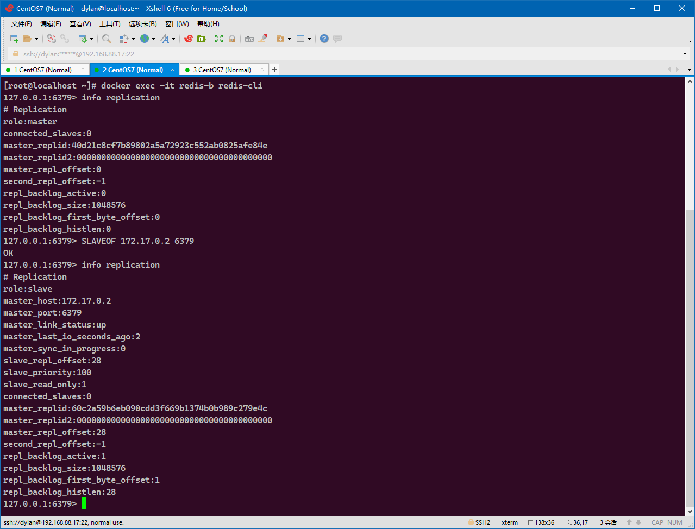

# 前言

> - 本节将记录关于Redis的更为深入的应用。

# 默认的RedisTemplate

- 本节介绍如何在`SpringBoot`中使用`Redis`。`SpringBoot`提供了一个`RedisTemplate`对象，以提供所有的可以操作`Redis`数据库的方法。
- 在虚拟机的`docker`中开启`redis`容器，`docker`将自动启用`6379`端口的`redis-server`服务，此时通过宿主机访问容器内服务的地址为`192.168.88.17:6379`，前期准备完成。


## 1. 新建工程

- 创建一个新的`SpringBoot`工程，并选中依赖`Spring Redis`。此时的`pom.xml`文件内容如下：

```xml
<?xml version="1.0" encoding="UTF-8"?>
<project xmlns="http://maven.apache.org/POM/4.0.0" xmlns:xsi="http://www.w3.org/2001/XMLSchema-instance"
         xsi:schemaLocation="http://maven.apache.org/POM/4.0.0 https://maven.apache.org/xsd/maven-4.0.0.xsd">
    <modelVersion>4.0.0</modelVersion>
    <parent>
        <groupId>org.springframework.boot</groupId>
        <artifactId>spring-boot-starter-parent</artifactId>
        <version>2.4.0</version>
        <relativePath/> <!-- lookup parent from repository -->
    </parent>
    <groupId>cn.dylanphang</groupId>
    <artifactId>spring-redis</artifactId>
    <version>0.0.1-SNAPSHOT</version>
    <name>spring-redis</name>
    <description>Demo project for Spring Boot</description>

    <properties>
        <java.version>1.8</java.version>
    </properties>

    <dependencies>
        <dependency>
            <groupId>org.springframework.boot</groupId>
            <artifactId>spring-boot-starter-data-redis</artifactId>
        </dependency>

        <dependency>
            <groupId>org.springframework.boot</groupId>
            <artifactId>spring-boot-starter-test</artifactId>
            <scope>test</scope>
        </dependency>
    </dependencies>

    <build>
        <plugins>
            <plugin>
                <groupId>org.springframework.boot</groupId>
                <artifactId>spring-boot-maven-plugin</artifactId>
            </plugin>
        </plugins>
    </build>

</project>
```

## 2. 配置文件

- 当你需要使用一个`spirng-boot-starter-xxx`的包时，需要立刻联想到`xxx`是依赖于`Spring`对`xxx`的初始配置，从而自动初始化并加载到`ApplicationContext`中的，所有的`xxx`都有一个`xxxAutoConfiguration.java`文件。
- 那么这个时候我们需要去找`RedisAutoConfiguration`类，源码如下：
  1. `@EnableConfigurationPropertis`：其中关联类中的字段，就是可以在`application.properties`中自定义的参数；
  2. `@ConditionalOnMissingBean`：该注解表示用户可以自定义一个`redisTemplate`的`bean`，只有当该`bean`不存在的时候会使用自动配置的`redistemplate`。

```java
//
// Source code recreated from a .class file by IntelliJ IDEA
// (powered by Fernflower decompiler)
//

package org.springframework.boot.autoconfigure.data.redis;

import org.springframework.boot.autoconfigure.condition.ConditionalOnClass;
import org.springframework.boot.autoconfigure.condition.ConditionalOnMissingBean;
import org.springframework.boot.autoconfigure.condition.ConditionalOnSingleCandidate;
import org.springframework.boot.context.properties.EnableConfigurationProperties;
import org.springframework.context.annotation.Bean;
import org.springframework.context.annotation.Configuration;
import org.springframework.context.annotation.Import;
import org.springframework.data.redis.connection.RedisConnectionFactory;
import org.springframework.data.redis.core.RedisOperations;
import org.springframework.data.redis.core.RedisTemplate;
import org.springframework.data.redis.core.StringRedisTemplate;

@Configuration(
    proxyBeanMethods = false
)
@ConditionalOnClass({RedisOperations.class})
@EnableConfigurationProperties({RedisProperties.class})
@Import({LettuceConnectionConfiguration.class, JedisConnectionConfiguration.class})
public class RedisAutoConfiguration {
    public RedisAutoConfiguration() {
    }

    @Bean
    @ConditionalOnMissingBean(
        name = {"redisTemplate"}
    )
    @ConditionalOnSingleCandidate(RedisConnectionFactory.class)
    public RedisTemplate<Object, Object> redisTemplate(RedisConnectionFactory redisConnectionFactory) {
        RedisTemplate<Object, Object> template = new RedisTemplate();
        template.setConnectionFactory(redisConnectionFactory);
        return template;
    }

    @Bean
    @ConditionalOnMissingBean
    @ConditionalOnSingleCandidate(RedisConnectionFactory.class)
    public StringRedisTemplate stringRedisTemplate(RedisConnectionFactory redisConnectionFactory) {
        StringRedisTemplate template = new StringRedisTemplate();
        template.setConnectionFactory(redisConnectionFactory);
        return template;
    }
}
```

- 从源码中可以得到的信息还有`SpringBoot`默认提供两种`redisTemplate`的实现：
  1. `RedisTemplate<Object, Object>`：键和值都是对象的`redis`模板；
  2. `StringRedisTemplate`：键和值都是字符串的`redis`模板。

```java
//
// Source code recreated from a .class file by IntelliJ IDEA
// (powered by Fernflower decompiler)
//

package org.springframework.data.redis.core;

import org.springframework.data.redis.connection.DefaultStringRedisConnection;
import org.springframework.data.redis.connection.RedisConnection;
import org.springframework.data.redis.connection.RedisConnectionFactory;
import org.springframework.data.redis.serializer.RedisSerializer;

public class StringRedisTemplate extends RedisTemplate<String, String> {
    public StringRedisTemplate() {
        this.setKeySerializer(RedisSerializer.string());
        this.setValueSerializer(RedisSerializer.string());
        this.setHashKeySerializer(RedisSerializer.string());
        this.setHashValueSerializer(RedisSerializer.string());
    }

    public StringRedisTemplate(RedisConnectionFactory connectionFactory) {
        this();
        this.setConnectionFactory(connectionFactory);
        this.afterPropertiesSet();
    }

    protected RedisConnection preProcessConnection(RedisConnection connection, boolean existingConnection) {
        return new DefaultStringRedisConnection(connection);
    }
}
```

- 我们继续看可供在`application.properties`中自定义的属性有哪些，查看`RedisProperties`类：
  - `@ConfigurationsProperties`：该注解中的`prefix`属性指定了属性前缀，使用`prefix.filed`的键值，可以在配置文件`application.properties`中自定义`redis`配置。

```java
//
// Source code recreated from a .class file by IntelliJ IDEA
// (powered by Fernflower decompiler)
//

package org.springframework.boot.autoconfigure.data.redis;

import java.time.Duration;
import java.util.List;
import org.springframework.boot.context.properties.ConfigurationProperties;

@ConfigurationProperties(
    prefix = "spring.redis"
)
public class RedisProperties {
    private int database = 0;
    private String url;
    private String host = "localhost";
    private String username;
    private String password;
    private int port = 6379;
    private boolean ssl;
    private Duration timeout;
    private Duration connectTimeout;
    private String clientName;
    private RedisProperties.ClientType clientType;
    private RedisProperties.Sentinel sentinel;
    private RedisProperties.Cluster cluster;
    private final RedisProperties.Jedis jedis = new RedisProperties.Jedis();
    private final RedisProperties.Lettuce lettuce = new RedisProperties.Lettuce();
    ...
}
```

- 那么我们只需要更改的默认配置是`spring.redis.host`，需要改为`192.168.88.17`，在`application.properties`中添加：

```properties
spring.redis.host=192.168.88.17
```

## 3. 测试

- 我们在测试类中注入`redisTemplate`对象，并使用这个对象写入一个键，并在另一个测试方法中获取该键：

```java
package cn.dylanphang.springredis;

import org.junit.jupiter.api.Assertions;
import org.junit.jupiter.api.Test;
import org.springframework.beans.factory.annotation.Autowired;
import org.springframework.boot.test.context.SpringBootTest;
import org.springframework.data.redis.core.RedisTemplate;

@SpringBootTest
class SpringRedisApplicationTests {

    @Autowired
    private RedisTemplate<Object, Object> redisTemplate;

    @Test
    void contextLoads() {
        this.redisTemplate.opsForValue().set("k1", "v1");
    }

    @Test
    void get() {
        final Object k1 = this.redisTemplate.opsForValue().get("k1");
        Assertions.assertEquals("v1", k1);
    }

}
```

- 测试通过，此时在`docker`中查询对应的键值对信息：


- 乱码和序列化相关，默认使用`jdk`的序列化，因此会产生乱码。

# 自定义SpringTemplate

- 在上一节中，我们看到序列化的方式会导致存入了一个乱码的键，探究`RedisTemplate`的部分源码：

```java
public class RedisTemplate<K, V> extends RedisAccessor implements RedisOperations<K, V>, BeanClassLoaderAware {
    private boolean enableTransactionSupport = false;
    private boolean exposeConnection = false;
    private boolean initialized = false;
    private boolean enableDefaultSerializer = true;
    @Nullable
    private RedisSerializer<?> defaultSerializer;
    @Nullable
    private ClassLoader classLoader;
    @Nullable
    private RedisSerializer keySerializer = null;
    @Nullable
    private RedisSerializer valueSerializer = null;
    @Nullable
    private RedisSerializer hashKeySerializer = null;
    @Nullable
    private RedisSerializer hashValueSerializer = null;
    private RedisSerializer<String> stringSerializer = RedisSerializer.string();
    @Nullable
    private ScriptExecutor<K> scriptExecutor;
    private final ValueOperations<K, V> valueOps = new DefaultValueOperations(this);
    private final ListOperations<K, V> listOps = new DefaultListOperations(this);
    private final SetOperations<K, V> setOps = new DefaultSetOperations(this);
    private final StreamOperations<K, ?, ?> streamOps = new DefaultStreamOperations(this, ObjectHashMapper.getSharedInstance());
    private final ZSetOperations<K, V> zSetOps = new DefaultZSetOperations(this);
    private final GeoOperations<K, V> geoOps = new DefaultGeoOperations(this);
    private final HyperLogLogOperations<K, V> hllOps = new DefaultHyperLogLogOperations(this);
    private final ClusterOperations<K, V> clusterOps = new DefaultClusterOperations(this);
    
    public RedisTemplate() {
    }

    public void afterPropertiesSet() {
        super.afterPropertiesSet();
        boolean defaultUsed = false;
        if (this.defaultSerializer == null) {
            this.defaultSerializer = new JdkSerializationRedisSerializer(this.classLoader != null ? this.classLoader : this.getClass().getClassLoader());
        }

        if (this.enableDefaultSerializer) {
            if (this.keySerializer == null) {
                this.keySerializer = this.defaultSerializer;
                defaultUsed = true;
            }

            if (this.valueSerializer == null) {
                this.valueSerializer = this.defaultSerializer;
                defaultUsed = true;
            }

            if (this.hashKeySerializer == null) {
                this.hashKeySerializer = this.defaultSerializer;
                defaultUsed = true;
            }

            if (this.hashValueSerializer == null) {
                this.hashValueSerializer = this.defaultSerializer;
                defaultUsed = true;
            }
        }

        if (this.enableDefaultSerializer && defaultUsed) {
            Assert.notNull(this.defaultSerializer, "default serializer null and not all serializers initialized");
        }

        if (this.scriptExecutor == null) {
            this.scriptExecutor = new DefaultScriptExecutor(this);
        }

        this.initialized = true;
    }
    ...
}
```

- 其中有一个字段是`RedisSerializer<?> defaultSerializer`，当我们不提供任何的序列化实现时，序列化会默认使用默认的序列化实现，这个默认的序列化实现是`JdkSerializationRedisSerializer`；

- `SpringBoot`中提供了几种默认的序列化方式：


- 在实际的开发中，我们常用的序列化实例是`Jackson2JsonRedisSerializer`，用于直接将对象存入`Redis`的值中。

## 1. 编写SpringConfiguration

- 通过查看`RedisTemplate`的源码，可以看到其中最重要的一个方法是`afterPropertiesSet()`，其中初始化了各种键值的序列化方式，我们需要做的是在创建`RedisTemplate`的`Bean`对象时，为以下四个字段添加默认值：
  1. `keySerializer`：推荐使用`StringRedisSerializer`；
  2. `valueSerializer`：存储已实现`Serializable`接口的`pojo`对象时，使用`Jackson2JsonRedisSerializer`将自动转换为`Json`形式的字符串；
  3. `hashKeySerializer`：推荐使用`StringRedisSerializer`；
  4. `hashValueSerializer`：存储已实现`Serializable`接口的`pojo`对象时，使用`Jackson2JsonRedisSerializer`将自动转换为`Json`形式的字符串。

- 具体关于这四个字段，日后再作解释。
- 创建`SpringConfigurtation`配置类：

```java
package cn.dylanphang.springredis.config;

import com.fasterxml.jackson.annotation.JsonAutoDetect;
import com.fasterxml.jackson.annotation.PropertyAccessor;
import com.fasterxml.jackson.databind.ObjectMapper;
import com.fasterxml.jackson.databind.jsontype.DefaultBaseTypeLimitingValidator;
import org.springframework.context.annotation.Bean;
import org.springframework.context.annotation.Configuration;
import org.springframework.data.redis.connection.RedisConnectionFactory;
import org.springframework.data.redis.core.RedisTemplate;
import org.springframework.data.redis.serializer.Jackson2JsonRedisSerializer;
import org.springframework.data.redis.serializer.StringRedisSerializer;

/**
 * 注解@Bean同时具有注入的功能。
 *
 * @author dylan
 */
@Configuration
public class RedisConfiguration {

    @Bean
    public RedisTemplate<String, Object> redisTemplate(RedisConnectionFactory redisConnectionFactory) {
        // 0.创建RedisTemplate对象并设置连接方式，默认是lettuce
        RedisTemplate<String, Object> template = new RedisTemplate<>();
        template.setConnectionFactory(redisConnectionFactory);

        // 1.字符串序列化和对象序列化
        final StringRedisSerializer stringRedisSerializer = new StringRedisSerializer();
        final Jackson2JsonRedisSerializer<Object> jackson2JsonRedisSerializer = new Jackson2JsonRedisSerializer<>(Object.class);

        // 2.将对象序列化为Json字符串格式的数据，需要为序列化实例设置一个ObjectMapper对象
        jackson2JsonRedisSerializer.setObjectMapper(new ObjectMapper());

        // 3.key采用String的方式序列化，value采用Jackson的方式序列化
        template.setKeySerializer(stringRedisSerializer);
        template.setValueSerializer(jackson2JsonRedisSerializer);
        template.setHashKeySerializer(stringRedisSerializer);
        template.setHashValueSerializer(jackson2JsonRedisSerializer);

        // 4.初始化RedisTemplate对象
        template.afterPropertiesSet();

        return template;
    }
}
```

## 2. 测试

- 普通字符串测试：

```java
package cn.dylanphang.springredis;

import org.junit.jupiter.api.Assertions;
import org.junit.jupiter.api.Test;
import org.springframework.beans.factory.annotation.Autowired;
import org.springframework.boot.test.context.SpringBootTest;
import org.springframework.data.redis.core.RedisTemplate;

@SpringBootTest
class SpringRedisApplicationTests {

    @Autowired
    private RedisTemplate<String, Object> redisTemplate;

    @Test
    void contextLoads() {
        this.redisTemplate.opsForValue().set("k2", "v2");
    }

    @Test
    void get() {
        final Object k2 = this.redisTemplate.opsForValue().get("k2");
        Assertions.assertEquals("v2", k2);
    }
}
```

- 测试通过，此时在`docker`中查询对应的键值对信息：


- 存入`pojo`类测试：
  1. 值得注意的是，从`Redis`中取回的数据是`LinkedHashMap`，这应该跟序列化实例的选择有关；
  2. 所使用的`pojo`类必须要实现`Serializerable`接口，否则存入`Redis`的数据还是会乱码。

```java
package cn.dylanphang.springredis;

import cn.dylanphang.springredis.pojo.Person;
import com.fasterxml.jackson.databind.ObjectMapper;
import org.junit.jupiter.api.Assertions;
import org.junit.jupiter.api.Test;
import org.springframework.beans.factory.annotation.Autowired;
import org.springframework.boot.test.context.SpringBootTest;
import org.springframework.data.redis.core.RedisTemplate;

import java.util.LinkedHashMap;

@SpringBootTest
class SpringRedisApplicationTests {

    @Autowired
    private RedisTemplate<String, Object> redisTemplate;

    @Test
    void contextLoads() {
        final Person person = new Person(1, "dylan", 18);
        this.redisTemplate.opsForValue().set("person", person);
    }

    @Test
    void get() {
        final Object search = this.redisTemplate.opsForValue().get("person");
        Assertions.assertEquals(LinkedHashMap.class, search.getClass());

        final LinkedHashMap<String, Object> linkedHashMap = new LinkedHashMap<>();
        linkedHashMap.put("id", 1);
        linkedHashMap.put("name", "dylan");
        linkedHashMap.put("age", 18);

        Assertions.assertEquals(linkedHashMap, search);

        final ObjectMapper objectMapper = new ObjectMapper();
        final Person convert = objectMapper.convertValue(search, Person.class);

        final Person person = new Person(1, "dylan", 18);
        Assertions.assertEquals(person, convert);
    }
}
```

- 其中`pojo`类必须要实现`Serializable`接口：

```java
package cn.dylanphang.springredis.pojo;

import lombok.AllArgsConstructor;
import lombok.Data;
import lombok.NoArgsConstructor;

import java.io.Serializable;

/**
 * @author dylan
 */
@Data
@AllArgsConstructor
@NoArgsConstructor
public class Person implements Serializable {
    private Integer id;
    private String name;
    private Integer age;
}
```

- 测试通过，此时在`docker`中查询对应的键值对信息：


- 实际工作中，是后端负责从`Redis`中查询是否有相关的缓存存在，将链接散列映射转为对象返回即可。

## 3. ObjectMapper配置

- 以上的`RedisTemplate`的配置中，其值只能保存标准的`JSON`数据，在程序中去出数据时，如果数据存在，则总会被解析为一个`LinkedHashMap`对象，如果我们需要直接使用该对象呢？
- 如上述例子，存入的对象为`Person`类，取出数据时`Person`对象变为了`LinkedHashMap`，如果我们需要进行操作的应该是一个`Person`类对象，此时不得不从`LinkedHashMap`中取出值，并使用其中的数据构建一个新的`Person`对象。
- 是否能够让存入的数据记录该数据的对象类型，并在取出数据时，自动将数据转换为对应的类型呢？答案是肯定的。
- 在自定义`RedisTemplate`时，需要对`ObjectMapper`对象进行一些额外的配置，为了方便阅读，此前的模板`RedisTemplate`对象将被重命名为`RedisTemplateDefault`，其中包含自定义`ObjectMapper`的模板则命名为`RedisTemplate`，如下：
  - 新的`redisTemplate`仅增加了`3`行代码，并将配置过的`ObjectMapper`设置到了序列化器中。

```java
package cn.dylanphang.springredis.config;

import com.fasterxml.jackson.annotation.JsonAutoDetect;
import com.fasterxml.jackson.annotation.PropertyAccessor;
import com.fasterxml.jackson.databind.ObjectMapper;
import com.fasterxml.jackson.databind.jsontype.impl.LaissezFaireSubTypeValidator;
import org.springframework.context.annotation.Bean;
import org.springframework.context.annotation.Configuration;
import org.springframework.data.redis.connection.RedisConnectionFactory;
import org.springframework.data.redis.core.RedisTemplate;
import org.springframework.data.redis.serializer.Jackson2JsonRedisSerializer;
import org.springframework.data.redis.serializer.StringRedisSerializer;

/**
 * 注解@Bean同时具有注入的功能。
 *
 * @author dylan
 */
@Configuration
public class RedisConfiguration {

    /**
     * 对ObjectMapper进行配置，redis的数据值可以保存对象的类型信息，并在取出数据时，不再自动转为LinkedHashMap类型。
     *
     * @param redisConnectionFactory redisConnectionFactory
     * @return RedisTemplate<String, Object>
     */
    @Bean
    public RedisTemplate<String, Object> redisTemplate(RedisConnectionFactory redisConnectionFactory) {
        // 0.创建RedisTemplate对象并设置连接方式，默认是lettuce
        RedisTemplate<String, Object> template = new RedisTemplate<>();
        template.setConnectionFactory(redisConnectionFactory);

        // 1.字符串序列化和对象序列化
        final StringRedisSerializer stringRedisSerializer = new StringRedisSerializer();
        final Jackson2JsonRedisSerializer<Object> jackson2JsonRedisSerializer = new Jackson2JsonRedisSerializer<>(Object.class);

        // 2.将对象序列化为Json字符串格式的数据，需要为序列化实例设置一个ObjectMapper对象
        final ObjectMapper objectMapper = new ObjectMapper();
        objectMapper.setVisibility(PropertyAccessor.ALL, JsonAutoDetect.Visibility.ANY);
        objectMapper.activateDefaultTyping(LaissezFaireSubTypeValidator.instance, ObjectMapper.DefaultTyping.NON_FINAL);

        jackson2JsonRedisSerializer.setObjectMapper(objectMapper);

        // 3.key采用String的方式序列化，value采用Jackson的方式序列化
        template.setKeySerializer(stringRedisSerializer);
        template.setValueSerializer(jackson2JsonRedisSerializer);
        template.setHashKeySerializer(stringRedisSerializer);
        template.setHashValueSerializer(jackson2JsonRedisSerializer);

        // 4.初始化RedisTemplate对象
        template.afterPropertiesSet();

        return template;
    }

    /**
     * 默认用于保存Json数据的redisTemplate对象。
     *
     * @param redisConnectionFactory redisConnectionFactory
     * @return RedisTemplate<String, Object>
     */
    @Bean("redisTemplateDefault")
    public RedisTemplate<String, Object> redisTemplateDefault(RedisConnectionFactory redisConnectionFactory) {
        // 0.创建RedisTemplate对象并设置连接方式，默认是lettuce
        RedisTemplate<String, Object> template = new RedisTemplate<>();
        template.setConnectionFactory(redisConnectionFactory);

        // 1.字符串序列化和对象序列化
        final StringRedisSerializer stringRedisSerializer = new StringRedisSerializer();
        final Jackson2JsonRedisSerializer<Object> jackson2JsonRedisSerializer = new Jackson2JsonRedisSerializer<>(Object.class);

        // 2.将对象序列化为Json字符串格式的数据，需要为序列化实例设置一个ObjectMapper对象
        jackson2JsonRedisSerializer.setObjectMapper(new ObjectMapper());

        // 3.key采用String的方式序列化，value采用Jackson的方式序列化
        template.setKeySerializer(stringRedisSerializer);
        template.setValueSerializer(jackson2JsonRedisSerializer);
        template.setHashKeySerializer(stringRedisSerializer);
        template.setHashValueSerializer(jackson2JsonRedisSerializer);

        // 4.初始化RedisTemplate对象
        template.afterPropertiesSet();

        return template;
    }
}
```

## 4. 再次测试

- 测试类编写如下：

```java
package cn.dylanphang.springredis;

import cn.dylanphang.springredis.pojo.Person;
import com.fasterxml.jackson.databind.ObjectMapper;
import org.junit.jupiter.api.Assertions;
import org.junit.jupiter.api.BeforeEach;
import org.junit.jupiter.api.Test;
import org.springframework.beans.factory.annotation.Autowired;
import org.springframework.boot.test.context.SpringBootTest;
import org.springframework.data.redis.core.RedisTemplate;

import java.util.LinkedHashMap;

@SpringBootTest
class SpringRedisApplicationTests {

    @Autowired
    private RedisTemplate<String, Object> redisTemplate;
    @Autowired
    private RedisTemplate<String, Object> redisTemplateDefault;

    /**
     * 分别使用对ObjectMapper进行配置的redisTemplate和未对ObjectMapper进行配置的redisTemplateDefault，向redis存入数据。
     */
    @BeforeEach
    void init() {
        final Person person = new Person(1, "dylan", 18);
        this.redisTemplate.opsForValue().set("person1", person);
        this.redisTemplateDefault.opsForValue().set("person2", person);
    }

    @Test
    void get() {
        // 1.分别使用对ObjectMapper进行配置的redisTemplate和未对ObjectMapper进行配置的redisTemplateDefault，向redis取出数据。
        final Object person1 = this.redisTemplate.opsForValue().get("person1");
        final Object person2 = this.redisTemplateDefault.opsForValue().get("person2");

        // 2.已配置的redisTemplate只能取出使用redisTemplate添加的数据，该数据存有对象信息，取出时会自动装换为对应的对象
        Assertions.assertEquals(Person.class, person1.getClass());

        // 3.相反，未配置的redisTemplateDefault只能取出使用redisTemplateDefault添加的数据，该数据是Json数据，不含有对象信息
        Assertions.assertEquals(LinkedHashMap.class, person2.getClass());

        // 4.以下为进一步的断言论证
        final Person example = new Person(1, "dylan", 18);
        final LinkedHashMap<String, Object> linkedHashMap = new LinkedHashMap<>();
        linkedHashMap.put("id", 1);
        linkedHashMap.put("name", "dylan");
        linkedHashMap.put("age", 18);

        Assertions.assertEquals(example, person1);
        Assertions.assertEquals(linkedHashMap, person2);

        final ObjectMapper objectMapper = new ObjectMapper();
        final Person convert = objectMapper.convertValue(person2, Person.class);
        Assertions.assertEquals(example, convert);
    }
}
```

- 测试通过，此时查看`redis`中的数据：


- 通过查看数据，可以清晰看到，经过配置的`ObjectMapper`可以在存入数据时，同时写入存入数据的对象信息。
- 通过测试可以知道，通过为`RedisTemplate`设置一个经过配置的`ObjectMapper`后，取出数据时，该对象将自动被转换为指定的对象（不再是`LinkedHashMap`），对象类型根据存入数据时的对象信息而定。

## 5. 详细说明

- 关键代码如下，其中注释附上详细说明：

```java
// 指定序列化的属性及权限修饰符范围，ALL为所有的属性，ANY为所有权限修饰符
objectMapper.setVisibility(PropertyAccessor.ALL, JsonAutoDetect.Visibility.ANY);

// 指定序列化接受的输入类型
objectMapper.activateDefaultTyping(LaissezFaireSubTypeValidator.instance, ObjectMapper.DefaultTyping.NON_FINAL);
```

- `PropertyAccessor`的相关类源码为：
  - 其中指定了`ObjectMapper`能接受序列化的属性的枚举信息。

```java
//
// Source code recreated from a .class file by IntelliJ IDEA
// (powered by Fernflower decompiler)
//

package com.fasterxml.jackson.annotation;

public enum PropertyAccessor {
    GETTER,
    SETTER,
    CREATOR,
    FIELD,
    IS_GETTER,
    NONE,
    ALL;

    private PropertyAccessor() {
    }

    public boolean creatorEnabled() {
        return this == CREATOR || this == ALL;
    }

    public boolean getterEnabled() {
        return this == GETTER || this == ALL;
    }

    public boolean isGetterEnabled() {
        return this == IS_GETTER || this == ALL;
    }

    public boolean setterEnabled() {
        return this == SETTER || this == ALL;
    }

    public boolean fieldEnabled() {
        return this == FIELD || this == ALL;
    }
}
```

- `JsonAutoDetect.Visibility`的相关类源码为：
  - 其中指定了`ObjectMapper`能接受序列化的权限修饰符的枚举信息。

```java
public static enum Visibility {
    ANY,
    NON_PRIVATE,
    PROTECTED_AND_PUBLIC,
    PUBLIC_ONLY,
    NONE,
    DEFAULT;

    private Visibility() {
    }

    public boolean isVisible(Member m) {
        switch(this) {
        case ANY:
            return true;
        case NONE:
            return false;
        case NON_PRIVATE:
            return !Modifier.isPrivate(m.getModifiers());
        case PROTECTED_AND_PUBLIC:
            if (Modifier.isProtected(m.getModifiers())) {
                return true;
            }
        case PUBLIC_ONLY:
            return Modifier.isPublic(m.getModifiers());
        default:
            return false;
        }
    }
}
```

## 6. 直接用例

- 稍作代码拆分后，以下为可以直接使用的`RedisTemplate<String, Object>`对象：

```java
package cn.dylanphang.springredis.config;

import com.fasterxml.jackson.annotation.JsonAutoDetect;
import com.fasterxml.jackson.annotation.PropertyAccessor;
import com.fasterxml.jackson.databind.ObjectMapper;
import com.fasterxml.jackson.databind.jsontype.impl.LaissezFaireSubTypeValidator;
import org.springframework.context.annotation.Bean;
import org.springframework.context.annotation.Configuration;
import org.springframework.data.redis.connection.RedisConnectionFactory;
import org.springframework.data.redis.core.RedisTemplate;
import org.springframework.data.redis.serializer.Jackson2JsonRedisSerializer;
import org.springframework.data.redis.serializer.StringRedisSerializer;

/**
 * @author dylan
 * @date 2020/12/25
 */
@Configuration
public class RedisConfig {

    @Bean
    public RedisTemplate<String, Object> redisTemplate(RedisConnectionFactory redisConnectionFactory, Jackson2JsonRedisSerializer<Object> jackson2JsonRedisSerializer) {
        final RedisTemplate<String, Object> redisTemplate = new RedisTemplate<>();
        final StringRedisSerializer stringRedisSerializer = new StringRedisSerializer();

        redisTemplate.setConnectionFactory(redisConnectionFactory);

        redisTemplate.setKeySerializer(stringRedisSerializer);
        redisTemplate.setHashKeySerializer(stringRedisSerializer);
        redisTemplate.setValueSerializer(jackson2JsonRedisSerializer);
        redisTemplate.setHashValueSerializer(jackson2JsonRedisSerializer);

        redisTemplate.afterPropertiesSet();

        return redisTemplate;
    }

    @Bean
    public Jackson2JsonRedisSerializer<Object> jackson2JsonRedisSerializer() {
        final Jackson2JsonRedisSerializer<Object> jackson2JsonRedisSerializer = new Jackson2JsonRedisSerializer<>(Object.class);
        final ObjectMapper objectMapper = new ObjectMapper();

        objectMapper.setVisibility(PropertyAccessor.ALL, JsonAutoDetect.Visibility.ANY);
        objectMapper.activateDefaultTyping(LaissezFaireSubTypeValidator.instance, ObjectMapper.DefaultTyping.NON_FINAL);
        jackson2JsonRedisSerializer.setObjectMapper(objectMapper);

        return jackson2JsonRedisSerializer;
    }
}
```

# Redis配置文件

- 本小节讲解`Redis`配置文件，源文件过于大，不导入源码，以截图的方式了解其中配置。

## 1. INCLUDES

1. 配置中的单位是不区分大小写的；
2. 配置文件中可以包含其他的配置文件。


## 2. NETWORK

1. `bind 172.17.0.2`：可以绑定一个或多个`IP`地址，该地址为`redis-server`启动的地址；
2. `port 6379`：默认的端口号是`6379`，可以通过改变端口号开启多个`redis-server`；
3. `protected-mode yes`：安全模块是默认开启的，没有必要关闭。


## 3. GENERAL

1. `daemonize no`：守护进程，开启状态下需要设置一个`pidfile`，默认是关闭状态，即前台运行；
2. `pidfile /var/run/redis_6379.pid`：开启守护进程需要的`pid`文件；
3. `loglevel notice`：所需要记录的日志级别；
4. `logfile ""`：存放日志文件的目录，默认是空，会被重定向至`/dev/null`；
5. `databases 16`：初始化数据库数量是`16`个；
6. `always-show-logo yes`：是否总是在非守护进程的时候显示`redis`图标。


## 4. SNAPSHOTTING

1. `save 900 1`：在`900`秒之后如果至少有一个键改变则保存快照；
2. `save 300 10`：在`300`秒之后如果至少有十个键改变则保存快照；
3. `save 60 10000`：在`60`秒之后如果至少有一万个键改变则保存快照；
4. `stop-writes-on-bgsave-error yes`：当存储快照出错时停止数据的写入；
5. `rdbcompression yes`：是否压缩`.rdb`文件；
6. `rdbchecksum yes`：是否校验`.rdb`文件的完整性；
7. `dbfilename dump_dylan.rdb`：默认存储`.rdb`文件的名称，默认为`dump.rdb`；
8. `rdb-del-sync-files no`：是否删除同步的`.rdb`文件；
9. `dir ./`：存放`.rdb`文件的目录。


## 5. REPLICAION

1. `replica-serve-stale-data yes`：从机如果没能及时从主机同步数据，此时从机是否提供非最新的数据；
2. `replica-read-only yes`：从机只能读不能写；


## 6. SECURITY

- `requirepass foobarde`：可以给`Redis`设置密码。


- 可以使用命令设置密码：


- 退出后再次登录，查询操作前需要进行认证：


- 再次调用命令设置空密码以删除现有密码：


## 7. CLIENTS

- `maxclientts 10000`：最大支持连接的客户端数量。


## 8. MEMORY MANAGEMENT

1. `maxmemory <bytes>`：配置最大内存容量；
2. `maxmemory-policy noeviction`：内存到达上限之后的处理策略。如下表所示：
   1. 如果我们的`Redis`只是作为缓存使用，那么可以使用`allkeys`开头的淘汰策略；
   2. 如果我们的`Redis`还有其他用途，做了持久化，那么我们就要使用`volatile`开头的淘汰策略。

| 序号 |    淘汰策略     |               意义               |
| :--: | :-------------: | :------------------------------: |
|  1   |   noeviction    |           无法继续写入           |
|  2   |   allkeys-lru   |    所有key中，最近最少访问的     |
|  3   |   allkeys-lfu   |  所有key中，最近访问频率最少的   |
|  4   | allkeys-random  |       所有key中，随机选择        |
|  5   |  volatile-ttl   |     有超时时间的，越早到期的     |
|  6   |  volatile-lru   |   有超时时间的，最近最少访问的   |
|  7   |  volatile-lfu   | 有超时时间的，最近访问频率最少的 |
|  8   | volatile-random |      有超时时间的，随机选择      |


## 9. APPEND ONLY MODE

1. `appendonly no`：是否开启`AOF`持久化模式；
2. `appendfilename "appendonly.aof"`：`AOF`持久化模式下的数据文件名字是什么；
3. `appendfsync everysec`：每隔一秒将数据追加到`.aof`中；
4. `no-appendfsync-on-rewrite no`：重写时是否不同步，推荐为`no`。


# Redis持久化

- `Redis`是内存数据库，如果不将数据序列化到硬盘上，那么一旦服务器宕机，数据将全部丢失。
- 因此`Redis`提供了持久化的功能，`Redis`支持两种持久化方式，分别是`rdb`和`aof`。

## 1. RDB

- `RDB`持久化是指在指定的时间间隔内将内存中的数据集快照写入磁盘，实际操作过程是`fork`一个子进程，先将数据集写入临时文件，写入成功后，再替换之前的文件，使用的是二进制压缩存储。

## 2. AOF

- `AOF`持久化以日志的形式记录服务器所处理的每一个写、删除操作，查询操作不会记录，以文本的方式记录，打开文件可以看到详细的操作记录。

## 3. RDB和AOF的优缺点

- `RDB`存在哪些优势呢？
  1. 一旦采用该方式，那么你的整个`Redis`数据库将只包含一个文件，这对于文件备份而言是非常完美的。
  2. 比如，你可能打算每个小时归档一次最近`24`小时的数据，同时还要每天归档一次最近`30`天的数据。通过这样的备份策略，一旦系统出现灾难性故障，我们可以非常容易的进行恢复。
  3. 对于灾难恢复而言，`RDB`是非常不错的选择。因为我们可以非常轻松的将一个单独的文件压缩后再转移到其它存储介质上。
  4. 性能最大化。对于Redis的服务进程而言，在开始持久化时，它唯一需要做的只是`fork`出子进程，之后再由子进程完成这些持久化的工作，这样就可以极大的避免服务进程执行`IO`操作了。
  5. 相比于`AOF`机制，如果数据集很大，`RDB`的启动效率会更高。

- `RDB`又存在哪些劣势呢？
  1. 如果你想保证数据的高可用性，即最大限度的避免数据丢失，那么`RDB`将不是一个很好的选择。因为系统一旦在定时持久化之前出现宕机现象，此前没有来得及写入磁盘的数据都将丢失。
  2. 由于`RDB`是通过`fork`子进程来协助完成数据持久化工作的，因此，如果当数据集较大时，可能会导致整个服务器停止服务几百毫秒，甚至是`1`秒钟。

- `AOF`的优势有哪些呢？
  1. 该机制可以带来更高的数据安全性，即数据持久性。`Redis`提供`3`种同步策略，即每秒同步、每修改同步和不同步。
  2. 事实上，每秒同步也是异步完成的，其效率也是非常高的，所差的是一旦系统出现宕机现象，那么这一秒钟之内修改的数据将会丢失。
  3. 而每修改同步，我们可以将其视为同步持久化，即每次发生的数据变化都会被立即记录到磁盘中。可以预见，这种方式在效率上是最低的。至于无同步，无需多言。
  4. 由于该机制对日志文件的写入操作采用的是`append`模式，因此在写入过程中即使出现宕机现象，也不会破坏日志文件中已经存在的内容。
  5. 然而如果我们本次操作只是写入了一半数据就出现了系统崩溃问题，不用担心，在`Redis`下一次启动之前，我们可以通过`redis-check-aof`工具来帮助我们解决数据一致性的问题。
  6. 如果日志过大，`Redis`可以自动启用`rewrite`机制。即`Redis`以`append`模式不断的将修改数据写入到老的磁盘文件中，同时`Redis`还会创建一个新的文件用于记录此期间有哪些修改命令被执行。
  7. 因此在进行`rewrite`切换时可以更好的保证数据安全性。
  8.  `AOF`包含一个格式清晰、易于理解的日志文件用于记录所有的修改操作。事实上，我们也可以通过该文件完成数据的重建。

- `AOF`的劣势有哪些呢？
  1. 对于相同数量的数据集而言，`AOF`文件通常要大于`RDB`文件。因此`RDB`在恢复大数据集时的速度，比`AOF`的恢复速度要快。
  2. 根据同步策略的不同，`AOF`在运行效率上往往会慢于`RDB`。总之，每秒同步策略的效率是比较高的。

## 4. 小结

- 二者选择的标准，就是看系统是愿意牺牲一些性能，换取更高的缓存一致性`aof`，还是愿意写操作频繁的时候，不启用备份来换取更高的性能，待手动运行`save`的时候，再做备份`rdb`。
- `rdb`这个就更有些`eventually consistent`的意思了。不过生产环境其实更多都是二者结合使用的。

# Redis发布订阅

- 使用`Redis`也可以完成和消息队列`MQ`一样的发布订阅功能。
- 只有订阅了消息发布者，才能收到消息发布者所发布的消息。消息订阅者和消息发布者需要在同一个`redis`中！！！

- 我们在`192.168.88.17`中开启订阅功能：


- 接着开启主机`192.168.88.50`并连接`192.168.88.17:6379`上的`redis`：


- 紧接着发布一条消息到`dylan_channel`：


- 回到主机`192.168.88.17`上，可以看到接受到了两条消息，分别是频道名称和消息本体：


- 关于更多消息订阅的功能，不再赘述，实际应用中，更多地会使用专业的消息队列，即消息中间件。

# Redis主从复制

- 主从复制，是指将一台`Redis`服务器的数据，复制到其他的`Redis`服务器。其中前者为主节点`master/leader`，后者为从节点`slave/follower`；
- 数据的复制是单向的，只能由主节点复制到从节点；其中`master`节点以写为主，`slave`节点以读为主，也就是读写分离；
- 默认情况下，每台`Redis`服务器都是主节点。一个主节点可以有零个或多个从节点，但一个从节点只能有一个主节点。
- 主从复制的作用：
  1. 数据冗余：主从复制实现了数据的热备份，是持久化之外的一种数据冗余方式；
  2. 故障恢复：当主节点出现问题，可以有从节点提供服务，实现快速的故障恢复；实际上是一种服务的冗余；
  3. 负载均衡：在主从复制的基础上，可以由主节点提供写服务，由从节点提供读服务，实现读写分离。因为大多数情况下，读的业务要比写的多得多，通过读写分离，可以有效地减轻服务器的负载，提高`redis`服务器的并发量；
  4. 高可用基石：主从复制是哨兵模式和集群能够实施的基础。
- 在实际项目中，仅使用一台`Redis`是不可能的：
  1. 从结构上，单个`Redis`服务器一旦发生单点故障，会导致整个服务的不可用；即使服务器不发生硬件上的故障，在仅有一台的情况下，一旦负载过高也容易造成缓存击穿；
  2. 从容量上，单个`Redis`服务器的容量是有限的，在数据到达上限的时候，仍旧需要增加更多的`Redis`服务器。（通过Nginx可以轻松实现。）

## 1. 环境搭建

- 在`docker`中新建三个`redis`容器，用作主从复制实例：


## 2. 主从复制

- 配置主从复制，只需要设置从节点即可，在从节点`redis-b`和`redis-c`中使用以下命令：

```bash
SLAVEOF 172.17.0.2 6379
```

- 即可将`redis-b`和`redis-c`配置为`redis-a`的从节点。
- 查看`redis-a`中的`replication`信息：
  - 可以看到，一开始默认情况下，节点角色是`master`但没有任何从节点的存在；
  - 在`redis-b`和`redis-c`中运行`SLAVEOF [host] [port]`命令之后，节点信息下新增了两个从节点信息。


- 查看`redis-b`中的`replication`信息：
  - 节点角色从`master`变为了`slave`，并显示`redis-a`是主节点。



- 查看`redis-c`中的`replication`信息：
  - 节点角色从`master`变为了`slave`，并显示`redis-a`是主节点。


## 3. 注意事项

- 之所以叫写服务是因为它包括了增删改，读服务则表示查询。

### a. 主机写服务

- 主从复制配置完成后，我们向主机中写入数据，所有的从机中都能够查询到。
- 我们现在主机中存入`String`数据：


- 之后登陆`redis-b`和`redis-c`中查询该键是否存在：


- 结果表明，主机写入数据后，所有的从机都能自动获得一个复制。

### b. 从机写服务

- 变为从节点的服务器不再提供写服务，连接从节点`redis-b`，测试写入服务是否运行：


- 使用局域网主机`192.168.88.50`通过`docker`映射端口`6380`访问到了`redis-b`中提供的`redis`服务，我们尝试写入一`String`类型的数据，出现了错误：

```bash
(error) READONLY You can't write against a read only replica.
```

- 即从机模式下，是无法写入数据的。

# Redis哨兵模式

- 主从复制所存在的问题：
  1. 一旦主机出现故障，从机虽然仍然可以提供正常的读服务，但服务器的写服务无法及时恢复；
  2. 在这种情况下可以采用链路的方式串联主机和从机，但这种结构下，一旦中间的从机出现故障，虽然不影响正常的写服务，但会影响到读服务，后续的从机将无法及时获得最新的数据。
- 以往在处理主从复制时，都会人为编写脚本进行判断与干预，即在主机出现故障的时候，人工切换未故障的从机为主机。
- 往往会造成服务一段时间不可用的情况。直到哨兵模式的出现。
- 哨兵模式是一种特殊的模式，首先`Redis`提供了哨兵的命令，哨兵是一个独立的进程，作为进程，它会独立运行。其原理是哨兵通过发送命令，等待`Redis`服务器响应，从而监控运行的多个`Redis`实例。


- 这里是哨兵有两个作用：
  1. 通过发送命令，让`Redis`服务器返回监控其运行状态，包括主服务器和从服务器。
  2. 当哨兵监测到`master`宕机，会自动选举其中的某个`slave`成为新的`master`，并通过发布订阅模式，通知其他的从服务器修改配置文件，让它们切换主机。
- 然而一个哨兵进程对Redis服务器进行监控，可能会出现问题，为此，我们可以使用多个哨兵进行监控。各个哨兵之间还会进行监控，这样就形成了多哨兵模式。


- 用文字描述一下故障切换（failover）的过程：
  1. 假设主服务器宕机，哨兵1先检测到这个结果，系统并不会马上进行failover过程，仅仅是哨兵1主观的认为主服务器不可用，这个现象成为主观下线。
  2. 当后面的哨兵也检测到主服务器不可用，并且数量达到一定值时，那么哨兵之间就会进行一次投票，投票的结果由一个哨兵发起，进行failover操作。
  3. 切换成功后，就会通过发布订阅模式，让各个哨兵把自己监控的从服务器实现切换主机，这个过程称为客观下线。这样对于客户端而言，一切都是透明的。

# Redis缓存穿透、击穿和雪崩

## 1. 缓存穿透

- 缓存穿透，是指查询一个数据库一定不存在的数据。
- 正常的使用缓存流程大致是，数据查询先进行缓存查询，如果`key`不存在或者`key`已经过期，再对数据库进行查询，并把查询到的对象，放进缓存。如果数据库查询对象为空，则不放进缓存。
- 想象一下这个情况，如果传入的参数为`-1`，会是怎么样？这个`-1`，就是一定不存在的对象。就会每次都去查询数据库，而每次查询都是空，每次又都不会进行缓存。
- 假如有恶意攻击，就可以利用这个漏洞，对数据库造成压力，甚至压垮数据库。即便是采用`UUID`，也是很容易找到一个不存在的`KEY`，进行攻击。

### a. 缓存空对象

- 实际工作中，可以采用缓存空值的方式去避免缓存穿透。即数据不存在，也将该数据放入缓存中，并设置一个较短的过期时间以避免频繁地对数据库进行查询。


```java
@Override
public Goods searchArticleById(Long goodsId) {
    // 1.查询缓存（redis）
    Object object = redisTemplate.opsForValue().get(String.valueOf(goodsId));
    if (object != null) {
    	return (Goods) object;
    }
    
    // 2.查询数据库
    Goods goods = goodsMapper.selectByPrimaryKey(goodsId);
    if (goods != null) {
        // 3.存在即设置缓存，过期时间为60分钟
        redisTemplate.opsForValue().set(String.valueOf(goodsId), goods, 60, TimeUnit.MINUTES);
    } else {
        // 4.不存在也设置缓存，过期时间为60秒
        redisTemplate.opsForValue().set(String.valueOf(goodsId), null, 60, TimeUnit.SECONDS);
    }
    // 5.无论如何都会返回该对象
    return goods;
}
```

- 当存储层不命中后，即使返回的空对象也将其缓存起来，同时会设置一个过期时间，之后再访问这个数据将会从缓存中获取，保护了后端数据源；
- 但是这种方法会存在两个问题：
  1. 如果空值能够被缓存起来，这就意味着缓存需要更多的空间存储更多的键，因为这当中可能会有很多的空值的键；
  2. 即使对空值设置了过期时间，还是会存在缓存层和存储层的数据会有一段时间窗口的不一致，这对于需要保持一致性的业务会有影响。

### b. 布隆过滤器

- 布隆过滤器是一种数据结构，垃圾网站和正常网站加起来全世界据统计也有几十亿个。网警要过滤这些垃圾网站，总不能到数据库里面一个一个去比较吧，这就可以使用布隆过滤器。假设我们存储一亿个垃圾网站地址。
- 可以先有一亿个二进制比特，然后网警用八个不同的随机数产生器`F1,F2, …,F8`产生八个信息指纹`f1, f2, …, f8`。接下来用一个随机数产生器`G`把这八个信息指纹映射到`1`到`1`亿中的八个自然数`g1, g2, …,g8`。
- 最后把这八个位置的二进制全部设置为一。过程如下：


- 有一天网警查到了一个可疑的网站，想判断一下是否是`XX`网站，首先将可疑网站通过哈希映射到`1`亿个比特数组上的`8`个点。如果`8`个点的其中有一个点不为`1`，则可以判断该元素一定不存在集合中。
- 那这个布隆过滤器是如何解决`redis`中的缓存穿透呢？很简单，首先也是对所有可能查询的参数以`hash`形式存储，当用户想要查询的时候，使用布隆过滤器发现不在集合中，就直接丢弃，不再对持久层查询。


## 2. 缓存击穿

- 在平常高并发的系统中，大量的请求同时查询一个 key 时，此时这个key正好失效了，就会导致大量的请求都打到数据库上面去。这种现象我们称为**缓存击穿**。
- 缓存击穿，是指一个`key`非常热点，在不停的扛着大并发，大并发集中对这一个点进行访问，当这个`key`在失效的瞬间，持续的大并发就穿破缓存，直接请求数据库，就像在一个屏障上凿开了一个洞。这个热点就类似于“爆款”。
- 其实，大多数情况下这种爆款很难对数据库服务器造成压垮性的压力。达到这个级别的公司没有几家的。
- 但秉承着可能发生的就要防范，将某些主打的商品设置为永不过期就好了，即使未来这些商品自己发酵成了爆款，也是不会造成缓存击穿。

## 3. 热点数据失效

- 热点数据集中失效，是指在某一个时间段，缓存集中过期失效。
- 比如马上就要到双十二零点，很快就会迎来一波抢购，而这波抢购的商品信息比较集中地放入了缓存，并设置了过期时间，假设为一个小时。
- 那么到了凌晨一点钟的时候，这批商品信息的缓存就都过期了。而对这批商品热度仍然没有下降，后续的访问查询就都落到了数据库上，对于数据库而言，这就是周期性的压力波峰。


- 实际工作中，可以通过分类使得热门缓存的持续时间更长，同时通过随机类为热门缓存设置不一致的过期时间。这样即保证了热点信息的持久性，也同时避免了热点信息的集体过期。

```java
@Override
public Goods searchArticleById(Long goodsId) {
    // 1.查询缓存（redis）
    Object object = redisTemplate.opsForValue().get(String.valueOf(goodsId));
    if (object != null) {
    	return (Goods) object;
    }
    
    // 2.查询数据库
    Goods goods = goodsMapper.selectByPrimaryKey(goodsId);
    if (goods != null) {
        Random random = new Random();
        int time = random.nextInt(1);
        
        if ("女装".equals(goods.getGoodsCategory())) {
            // 3.热门商品提供更长的缓存时间
            time = 3600 + random.nextInt(3600);
        }
        if ("图书".equals(goods.getGoodsCaategory())) {
            // 4.冷门商品提供较短的缓存时间
            time = 600 + random.nextInt(600);
        }
        redisTemplate.opsForValue().set(String.valueOf(goodsId), goods, time, TimeUnit.MINUTES);
    } else {
        // 5.不存在也设置缓存，过期时间为60秒
        redisTemplate.opsForValue().set(String.valueOf(goodsId), null, 60, TimeUnit.SECONDS);
    }
    // 6.无论如何都会返回该对象
    return goods;
}
```

## 4. 缓存雪崩

- 缓存雪崩的情况是说，当某一时刻发生大规模的缓存失效的情况，比如你的缓存服务宕机了，会有大量的请求进来直接打到数据库上面。结果数据库也撑不住挂掉，之后造成一些列服务挂掉的连锁反应。


### a. redis高可用（事前）

- 这个思想的含义是，既然redis有可能挂掉，那我多增设几台`redis`，这样一台挂掉之后其他的还可以继续工作，其实就是搭建的集群。

### b. 限流降级（事中）

- 缓存降级是指当访问量剧增、服务出现问题（如响应时间慢或不响应）或非核心服务影响到核心流程的性能时，仍然需要保证服务还是可用的，即使是有损服务。系统可以根据一些关键数据进行自动降级，也可以配置开关实现人工降级。
- 降级的最终目的是保证核心服务可用，即使是有损的。而且有些服务是无法降级的（如加入购物车、结算）。

### c. 开启Redis持久化（事后）

- 即尽快恢复服务，开启Redis持久化有助于快速恢复缓存服务并加载已被持久化的数据。


## 5. 其他

- 缓存预热也是一个比较常见的概念，缓存预热就是系统上线后，将相关的缓存数据直接加载到缓存系统。这样就可以避免在用户请求的时候，先查询数据库，然后再将数据缓存的问题。用户直接查询事先被预热的缓存数据。