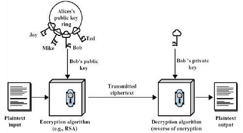

# 前言

> - 本篇将大致了解SSH中的公钥和私钥，以及它们的作用是什么。

# 加密与认证

- 什么是加密？
  - 加密是使用特殊的方式将数据资料进行编码，使得非法用户即时取得该加密信息，也无法获取真正的资料内容。因此数据加密可以保护数据，防止监听攻击等。其重点在于数据的安全性。
- 什么是认证？
  - 身份认证是用来判断某个身份的真实性，确认身份后，系统才可以依照不同的身份，给予不同的权限。目的在于鉴别用户的真实性。

# 公钥与私钥

- 在现代密码体系中，加密和解密是采用不同的密钥分别进行的，也就是俗称的非对称密钥密码系统，每个通信方均需要两个密钥，即公钥与私钥，这两把密钥可以互为加解密。
- 公钥是公开的，不需要保密；而私钥是由个人持有的，必须妥善保管与保密。
- 公钥与私钥的原则：
  1. 一个公钥对应一个私钥；
  2. 密钥对中，让大家都知道的是公钥；不能公开的、只有自己知道的是私钥；
  3. 如果用其中一个密钥对数据进行加密处理，则必定只有对应的另一个密钥才能对数据进行解密处理；
  4. 如果用其中一个密钥可以对数据进行解密，则该数据必然是对应着另一个密钥所进行加密的。

- 非对称密钥密码的主要应用，就是**公钥加密**和**公钥认证**，而公钥加密的过程和公钥认证的过程是不一样的。

# 基于公钥的加密过程

- 假如有两个用户`Alice`和`Bob`，`Alice`需要把一段明文，通过双钥加密技术发送给`Bob`，`Bob`有一对公钥和私钥，那么加密、解密的过程如下：
  1. `Bob`将他的公钥传送给`Alice`；
  2. `Alice`使用`Bob`的公钥加密她的消息，并传送给`Bob`；
  3. `Bob`使用他的私钥解密`Alice`的消息。



# 基于公钥的认证过程

- 认证的过程不同于加密，主要用于鉴别用户的真伪。只需要鉴别一个用户的私钥是正确的，就可以鉴别这个用户的真伪。
- 假如仍然有两个用户`Alice`和`Bob`，`Alice`需要让`Bob`知道自己是`Alice`，而不是假冒的。因此`Alice`需要使用自己的私钥对文件进行签名，并发送给`Bob`，`Bob`使用`Alice`的公钥对文件进行解密，如果解密成功，则证明`Alice`的私钥是正确的，从而完成了对`Alice`的身份认证。认证过程如下：
  1. `Alice`使用私钥对文件进行加密，从而对文件进行签名；
  2. `Alice`将签名的文件传送给`Bob`；
  3. `Bob`使用`Alice`的公钥解密文件，从而验证签名。


# 实例联想

- 使用`SSH`是可以生成一对公钥和私钥的，例如`Git`中可以使用以下命令创建公钥和私钥：

```bash
ssh-keygen -o
```

- 该命令会在`Git`中的`~/.ssh`目录下生成两个文件`id_dsa`、`id_dsa.pub`，分别为私钥和公钥。
- 在`GitHub`或`Gitee`中可以添加`SSH`公钥，用户可以使用私钥对文件进行签名传送到服务器进行用户认证；服务器也可以使用你的公钥对数据进行加密传输到用户的设备上，用户可以使用私钥对加密数据进行解密。