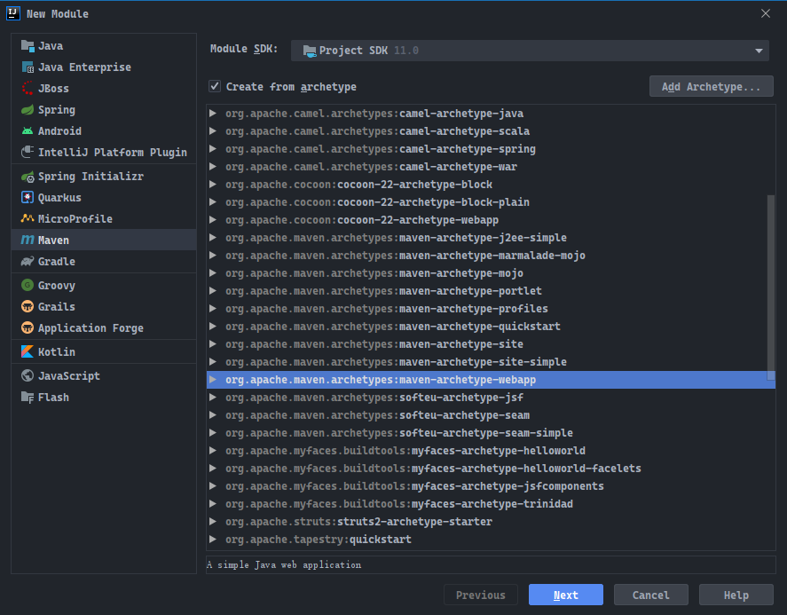
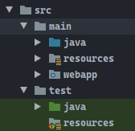
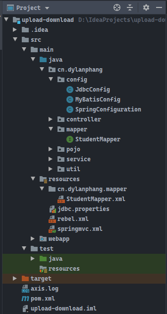

# 前言

> - 本篇使用Intellij IDEA进行快速搭建Spring + Spring MVC + MyBatis环境。

# Maven环境

- 多数项目已经默认使用`Maven`了，如果不使用，将所有项目依赖的`jar`包放入项目中的`lib`也可。

## 1. 创建项目

- 使用`Maven`骨架`archetype`快速搭建一个`Web`项目：



- 并创建相关的开发目录，诸如`java`和`resources`等等。



## 2. 导入依赖

- 使用`SSM`模式需要导入相关的依赖，必要的依赖如下：

```xml
<?xml version="1.0" encoding="UTF-8"?>

<project xmlns="http://maven.apache.org/POM/4.0.0" xmlns:xsi="http://www.w3.org/2001/XMLSchema-instance"
         xsi:schemaLocation="http://maven.apache.org/POM/4.0.0 http://maven.apache.org/xsd/maven-4.0.0.xsd">
    <modelVersion>4.0.0</modelVersion>

    <groupId>cn.dylanphang</groupId>
    <artifactId>upload-download</artifactId>
    <version>1.0-SNAPSHOT</version>
    <packaging>war</packaging>

    <name>upload-download</name>

    <!-- 告诉Maven你使用的Java版本，应该要和你使用骨架创建Maven项目时候选择的Java版本一致 -->
    <properties>
        <project.build.sourceEncoding>UTF-8</project.build.sourceEncoding>
        <maven.compiler.source>11</maven.compiler.source>
        <maven.compiler.target>11</maven.compiler.target>
    </properties>

    <dependencies>
        <!-- 数据库连接 -->
        <dependency>
            <groupId>mysql</groupId>
            <artifactId>mysql-connector-java</artifactId>
            <version>8.0.22</version>
        </dependency>
        <!-- 数据库连接池 -->
        <dependency>
            <groupId>com.mchange</groupId>
            <artifactId>c3p0</artifactId>
            <version>0.9.5.2</version>
        </dependency>
        <!-- MyBatis -->
        <dependency>
            <groupId>org.mybatis</groupId>
            <artifactId>mybatis</artifactId>
            <version>3.5.5</version>
        </dependency>
        <!-- 整合MyBatis和Spring -->
        <dependency>
            <groupId>org.mybatis</groupId>
            <artifactId>mybatis-spring</artifactId>
            <version>2.0.5</version>
        </dependency>
        <!-- 直接导入spring-webmvc，其他核心的Spring模块也会被导入项目 -->
        <dependency>
            <groupId>org.springframework</groupId>
            <artifactId>spring-webmvc</artifactId>
            <version>5.2.7.RELEASE</version>
        </dependency>
        <!-- 事务管理需要依赖spring-jdbc -->
        <dependency>
            <groupId>org.springframework</groupId>
            <artifactId>spring-jdbc</artifactId>
            <version>5.2.7.RELEASE</version>
        </dependency>
        <!-- 快速生成Getter/Setter -->
        <dependency>
            <groupId>org.projectlombok</groupId>
            <artifactId>lombok</artifactId>
            <version>1.18.12</version>
            <scope>provided</scope>
        </dependency>
        <!-- JSTL，在JSP页面使用c标签需要此以来 -->
        <dependency>
            <groupId>jstl</groupId>
            <artifactId>jstl</artifactId>
            <version>1.2</version>
        </dependency>
        <!-- 如果你要在Controller中使用HttpServlet作为方法参数，需要导入此依赖 -->
        <dependency>
            <groupId>javax.servlet</groupId>
            <artifactId>javax.servlet-api</artifactId>
            <version>3.1.0</version>
            <scope>provided</scope> <!-- Tomcat中包含该模块，需要设置为provided -->
        </dependency>
        <!-- Spring测试 -->
        <dependency>
            <groupId>org.springframework</groupId>
            <artifactId>spring-test</artifactId>
            <version>5.2.10.RELEASE</version>
            <scope>test</scope>
        </dependency>
        <!-- Spring测试中使用的junit版本必须要在4.12以上 -->
        <dependency>
            <groupId>junit</groupId>
            <artifactId>junit</artifactId>
            <version>4.12</version>
            <scope>test</scope>
        </dependency>
    </dependencies>

    <!-- 以下为创建项目自带的插件，可以不用管 -->
    <build>
        <finalName>upload-download</finalName>
        <pluginManagement><!-- lock down plugins versions to avoid using Maven defaults (may be moved to parent pom) -->
            <plugins>
                <plugin>
                    <artifactId>maven-clean-plugin</artifactId>
                    <version>3.1.0</version>
                </plugin>
                <!-- see http://maven.apache.org/ref/current/maven-core/default-bindings.html#Plugin_bindings_for_war_packaging -->
                <plugin>
                    <artifactId>maven-resources-plugin</artifactId>
                    <version>3.0.2</version>
                </plugin>
                <plugin>
                    <artifactId>maven-compiler-plugin</artifactId>
                    <version>3.8.0</version>
                </plugin>
                <plugin>
                    <artifactId>maven-surefire-plugin</artifactId>
                    <version>2.22.1</version>
                </plugin>
                <plugin>
                    <artifactId>maven-war-plugin</artifactId>
                    <version>3.2.2</version>
                </plugin>
                <plugin>
                    <artifactId>maven-install-plugin</artifactId>
                    <version>2.5.2</version>
                </plugin>
                <plugin>
                    <artifactId>maven-deploy-plugin</artifactId>
                    <version>2.8.2</version>
                </plugin>
            </plugins>
        </pluginManagement>
    </build>
</project>
```

- 依赖导入之后，就已经可以使用`Spring`的控制反转`IoC`了，也就是依赖注入`Dependency Inject`。
- 整个项目的架构如下：



# MyBatis框架配置

- `MyBatis`可使用`xml`配置，也可以使用`Java`配置类，两者可以无缝衔接。`SSM`架构需要自行配置数据源`DataSource`，以便使用`spring-jdbc`进行事务管理。
- 科普：`@Configuration`是`Java`原生的注解。
- 数据源`DataSource`配置文件`jdbc.properties`：

```properties
# 基本连接四要素，不多说了
jdbc.driver=com.mysql.cj.jdbc.Driver
jdbc.url=jdbc:mysql://localhost:3306/upload_download?serverTimezone=GMT%2B8&useAffectedRows=true
jdbc.username=root
jdbc.password=root

# 实际部署到服务器时，需要添加以下设置，防止8小时连接被自动断开
jdbc.testConnectionOnCheckout=false
jdbc.testConnectionOnCheckin=true
jdbc.idleConnectionTestPeriod=3600

# 其他的初始化参数
jdbc.initialPoolSize=10
jdbc.minPoolSize=10
jdbc.maxPoolSize=50
```

- 配置数据源`DataSource`配置类：

```java
package cn.dylanphang.config;

import com.mchange.v2.c3p0.ComboPooledDataSource;
import org.springframework.beans.factory.annotation.Value;
import org.springframework.context.annotation.Bean;
import org.springframework.context.annotation.PropertySource;

import javax.sql.DataSource;
import java.beans.PropertyVetoException;

/**
 * 创建数据库连接池Bean。
 */
@PropertySource("classpath:jdbc.properties")
public class JdbcConfig {
    @Value("${jdbc.driver}")
    private String driver;
    @Value("${jdbc.url}")
    private String url;
    @Value("${jdbc.username}")
    private String username;
    @Value("${jdbc.password}")
    private String password;
    @Value("${jdbc.testConnectionOnCheckout}")
    private boolean testConnectionOnCheckout;
    @Value("${jdbc.testConnectionOnCheckin}")
    private boolean textConnectionOnCheckin;
    @Value("${jdbc.idleConnectionTestPeriod}")
    private int idleConnectionTestPeriod;
    @Value("${jdbc.initialPoolSize}")
    private int initialPoolSize;
    @Value("${jdbc.minPoolSize}")
    private int minPoolSize;
    @Value("${jdbc.maxPoolSize}")
    private int maxPoolSize;


    /**
     * 使用c3p0连接池
     *
     * @return DataSource
     */
    @Bean(name = {"dataSource"})
    public DataSource dataSource() {
        try {
            ComboPooledDataSource cpds = new ComboPooledDataSource();

            cpds.setDriverClass(driver);
            cpds.setJdbcUrl(url);
            cpds.setUser(username);
            cpds.setPassword(password);

            cpds.setTestConnectionOnCheckout(testConnectionOnCheckout);
            cpds.setTestConnectionOnCheckin(textConnectionOnCheckin);
            cpds.setIdleConnectionTestPeriod(idleConnectionTestPeriod);

            cpds.setInitialPoolSize(initialPoolSize);
            cpds.setMinPoolSize(minPoolSize);
            cpds.setMaxPoolSize(maxPoolSize);

            return cpds;
        } catch (PropertyVetoException e) {
            e.printStackTrace();
        }
        return null;
    }
}
```

- 对于整合`MyBatis`来说，最重要的是获取`SqlSession`类的`Bean`对象，同样使用配置类：

```java
package cn.dylanphang.config;

import org.apache.ibatis.session.SqlSessionFactory;
import org.mybatis.spring.SqlSessionFactoryBean;
import org.mybatis.spring.SqlSessionTemplate;
import org.springframework.beans.factory.annotation.Autowired;
import org.springframework.context.annotation.Bean;
import org.springframework.context.annotation.Import;
import org.springframework.core.io.Resource;
import org.springframework.core.io.support.PathMatchingResourcePatternResolver;

import javax.sql.DataSource;

/**
 * 使用数据源DataSource可以获取SqlSessionFactory对象引用，该引用将用于创建sqlSessionTemplate，即SqlSession。
 */
@Import(JdbcConfig.class)
public class MyBatisConfig {

    private final DataSource dataSource;

    @Autowired
    public MyBatisConfig(DataSource dataSource) {
        this.dataSource = dataSource;
    }

    @Bean
    public SqlSessionFactory sqlSessionFactory() {
        try {
            SqlSessionFactoryBean sqlSessionFactoryBean = new SqlSessionFactoryBean();
            sqlSessionFactoryBean.setDataSource(dataSource);

            PathMatchingResourcePatternResolver resolver = new PathMatchingResourcePatternResolver();
            Resource[] resources = resolver.getResources("classpath*:cn/dylanphang/mapper/*Mapper.xml");
            sqlSessionFactoryBean.setMapperLocations(resources);

            return sqlSessionFactoryBean.getObject();
        } catch (Exception e) {
            e.printStackTrace();
        }
        return null;
    }

    @Bean("sqlSession")
    public SqlSessionTemplate sqlSessionTemplate(@Autowired SqlSessionFactory sqlSessionFactory) {
        return new SqlSessionTemplate(sqlSessionFactory);
    }
}
```

- 因为`MyBatisConfig`加载前，`DataSource`的`Bean`必须要存在，否则注入会失败。因此需要告诉`Spring`，在加载创建本类的`Bean`之前，需要先加载配置类`JdbcConfig.class`中的`Bean`，因为本类依赖其中的`Bean`。
- 使用注解`@Import(JdbcConfig.class)`告诉`Spring`先加载`JdbcConfig.class`中的`Bean`对象。

# Spring MVC框架配置

- `Spring MVC`将采用`springmvc.xml`配置文件的方法进行配置：

```xml
<?xml version="1.0" encoding="UTF-8"?>
<beans xmlns="http://www.springframework.org/schema/beans"
       xmlns:mvc="http://www.springframework.org/schema/mvc"
       xmlns:context="http://www.springframework.org/schema/context"
       xmlns:xsi="http://www.w3.org/2001/XMLSchema-instance"
       xsi:schemaLocation="
http://www.springframework.org/schema/beans
http://www.springframework.org/schema/beans/spring-beans.xsd
http://www.springframework.org/schema/mvc
http://www.springframework.org/schema/mvc/spring-mvc.xsd
http://www.springframework.org/schema/context
http://www.springframework.org/schema/context/spring-context.xsd">

    <!-- 配置spring创建容器时要扫描的包 -->
    <context:component-scan base-package="cn.dylanphang.controller">
        <context:include-filter type="annotation" expression="org.springframework.stereotype.Controller"/>
    </context:component-scan>

    <!-- 配置视图解析器 -->
    <bean id="viewResolver" class="org.springframework.web.servlet.view.InternalResourceViewResolver">
        <property name="prefix" value="/WEB-INF/page/"/>
        <property name="suffix" value=".jsp"/>
    </bean>

    <!-- 配置文件解析器对象，要求id名称必须为multipartResolver-->
    <bean id="multipartResolver" class="org.springframework.web.multipart.commons.CommonsMultipartResolver">
        <!-- 配置文件上传的最大size为10mb -->
        <property name="maxUploadSize" value="10485760"/>
    </bean>

    <!-- 配置spring开启注解mvc的支持 -->
    <mvc:annotation-driven/>
</beans>
```

- 其中较为重要的是`<context:componect-scan>`包扫描，我们只需要扫描`@Controller`标签；
- 视图解析器`ViewResolver`，当你的方法需要返回`String`的时候，需要使用到它；
- 扩展：`ModelAndView`对象用过吧，其实它里面封装了`ModelMap model`和`Object view`，当你存数据的时候，其实对象顶层用的就是`ModelMap`，当你设置方法需要跳转到那个页面的时候，底层调用的就是`view`存储你设置的页面`String`。
- 文件解析器`CommonsMultipartResolver`，当你`Controller`中的方法参数使用了`MultipartFile`对象，也就是文件上传依赖的`Spring MVC`类，你就需要配置文件解析器。
- 注意：文件解析器的`id`只能是`mutipartResolver`。

# Spring整合配置

- `Spring`严格来说只是整合了`MyBatis`，而`Srping`和`Spring MVC`只是合作的关系。
- `Spring`整合`MyBatis`，我们只需要用到一个配置类：

```java
package cn.dylanphang.config;

import org.springframework.context.annotation.ComponentScan;
import org.springframework.context.annotation.Configuration;
import org.springframework.context.annotation.FilterType;
import org.springframework.context.annotation.Import;
import org.springframework.stereotype.Controller;
import org.springframework.transaction.annotation.EnableTransactionManagement;

@Configuration
@ComponentScan(
        basePackages = "cn.dylanphang",
        excludeFilters = {
                @ComponentScan.Filter(type = FilterType.ANNOTATION, classes = {Controller.class})
        })
@Import({MyBatisConfig.class, TransactionManagerConfig.class})
@EnableTransactionManagement
public class SpringConfiguration {
}
```

- 其中较为重要的是，`@ComponectScan`注解，其中设置了需要扫描的包为`cn.dylanphang`，`excludeFilters`定义了不扫描的注解是`Controller.class`，注解也是一个`Java`类，也是有`.class`文件的。
- 整合`Mybatis`是由`@Import`注解完成的，只需要将之前的`MyBatisConfig.class`加入注解即可。
- 如果需要用到事务管理`@EnableTransactionManagement`，需要配置一个`TransactionManager`的`Bean`：

```java
package cn.dylanphang.config;

import org.springframework.beans.factory.annotation.Autowired;
import org.springframework.context.annotation.Bean;
import org.springframework.context.annotation.Import;
import org.springframework.jdbc.datasource.DataSourceTransactionManager;
import org.springframework.transaction.TransactionManager;

import javax.sql.DataSource;

/**
 * @author dylan
 */
@Import(JdbcConfig.class)
public class TransactionManagerConfig {
    private final DataSource dataSource;

    public TransactionManagerConfig(@Autowired DataSource dataSource) {
        this.dataSource = dataSource;
    }

    /**
     * 可以直接在业务层中使用注解Transactional对事务进行管理，该种事务管理要求抛出RuntimeException或Error，对于其他类型的异常，
     * 将不做回滚处理。需要扩大处理异常的范围，需要在注解中传入rollbackFor = Exception.class，扩大异常抓取的范围。
     *
     * @return DataSourceTransactionManager对象
     */
    @Bean
    public TransactionManager transactionManager() {
        return new DataSourceTransactionManager(dataSource);
    }
}
```

- 同样地，在`SpringConfiguration.class`中使用`@Import`注解添加此配置类即可。
- `JdbcConfig.class`不需要使用注解`@Import`添加，因为在`MyBatisConfig.class`和`TransactionManagerConfig.class`中我们已经向`Spring`声明了需要先加载这个配置类，因此加载`MyBatis`或`TransactionManager`的时候已经加载过了。
- 配置类很灵活，你可以将所有的配置类都整合在同一个`.java`文件中，这都是允许的。

# Web启动配置

- 我们完成了`Spring`的配置`SpringConfiguration.class`和`Spring MVC`的配置`springmvc.xml`，那么谁去负责帮我们加载它们呢？需要怎样告诉它们在哪里加载呢？

- 这里需要知道的是`web`容器，例如我们熟悉的`tomcat`。
- `tomcat`在启动后会读取`web.xml`配置并加载其中的配置，我们需要在这里地方配置如何加载`Spring`和`Spring MVC`。
- 大致的`web.xml`配置如下：

```xml
<!DOCTYPE web-app PUBLIC
        "-//Sun Microsystems, Inc.//DTD Web Application 2.3//EN"
        "http://java.sun.com/dtd/web-app_2_3.dtd" >

<web-app>
    <display-name>Archetype Created Web Application</display-name>

    <!-- 当Spring使用的是配置类时，需要提供一个用于加载配置类的对象AnnotationConfigWebApplicationContext -->
    <context-param>
        <param-name>contextClass</param-name>
        <param-value>org.springframework.web.context.support.AnnotationConfigWebApplicationContext</param-value>
    </context-param>
    <!-- contextConfigLocation中，即可以配置“classpath*：xxx.xml”文件，也可配置Java配置类 -->
    <context-param>
        <param-name>contextConfigLocation</param-name>
        <param-value>cn.dylanphang.config.SpringConfiguration</param-value>
    </context-param>

    <!--
        配置过滤器，解决中文乱码的问题；
        服务器启动的时候就会创建该Filter，将init-param中的参数加载，注入到CharacterEncodingFilter类中，
        浏览器每次发送请求都会经过这个过滤器，然后调用doFilterInternal方法
    -->
    <filter>
        <filter-name>characterEncodingFilter</filter-name>
        <filter-class>org.springframework.web.filter.CharacterEncodingFilter</filter-class>
        <!-- 指定字符集 -->
        <init-param>
            <param-name>encoding</param-name>
            <param-value>UTF-8</param-value>
        </init-param>
    </filter>
    <!-- 指定对哪些资源使用characterEncodingFilter规则 -->
    <!-- 配置为"/*"的时候，即对路径型url和后缀型url都会进行拦截 -->
    <filter-mapping>
        <filter-name>characterEncodingFilter</filter-name>
        <url-pattern>/*</url-pattern>
    </filter-mapping>

    <!-- listener监听器必须配置 -->
    <listener>
        <listener-class>org.springframework.web.context.ContextLoaderListener</listener-class>
    </listener>

    <!-- 前端/核心控制器加载Spring MVC -->
    <servlet>
        <servlet-name>dispatcherServlet</servlet-name>
        <servlet-class>org.springframework.web.servlet.DispatcherServlet</servlet-class>
        <!-- 配置Servlet的初始化参数，读取springmvc中的配置，并创建spring容器 -->
        <init-param>
            <param-name>contextConfigLocation</param-name>
            <param-value>classpath*:springmvc.xml</param-value>
        </init-param>
        <!-- 但为正整数的时候，即配置servlet启动时加载该DispatcherServlet对象 -->
        <load-on-startup>1</load-on-startup>
    </servlet>
    <!-- 配置为"/"的时候，即对路径型url进行拦截，但不会拦截后缀型url -->
    <servlet-mapping>
        <servlet-name>dispatcherServlet</servlet-name>
        <url-pattern>/</url-pattern>
    </servlet-mapping>
</web-app>

```

- 容器的初始化过程对于`web.xml`的加载过程是：
  1. `<content-param>`
  2. `<listener>`
  3. `<filter>`
  4. `<servlet>`
- `tomcat`在`web`项目启动时，会读取`web.xml`中的两个节点：`<listener>`和`<context-param>`。
- 可以看到在`<context-param>`中我们配置了`SpringConfiguration.class`，我们用它来加载`Spring`的配置文件，创建一系列的`Bean`；
- `Spring`的配置中也关联了`MyBatisConfig.class`等配置类和包扫描注解，`Spring`会一并将所有的`Bean`创建完毕，并放入`IoC`容器中。
- 而`Spring MVC`的配置文件则交由`<servlet>`加载。
- 至此，`SSM`环境搭建完毕。其中只是大致的讲解，更多的深层资料需要自行发掘啦。


