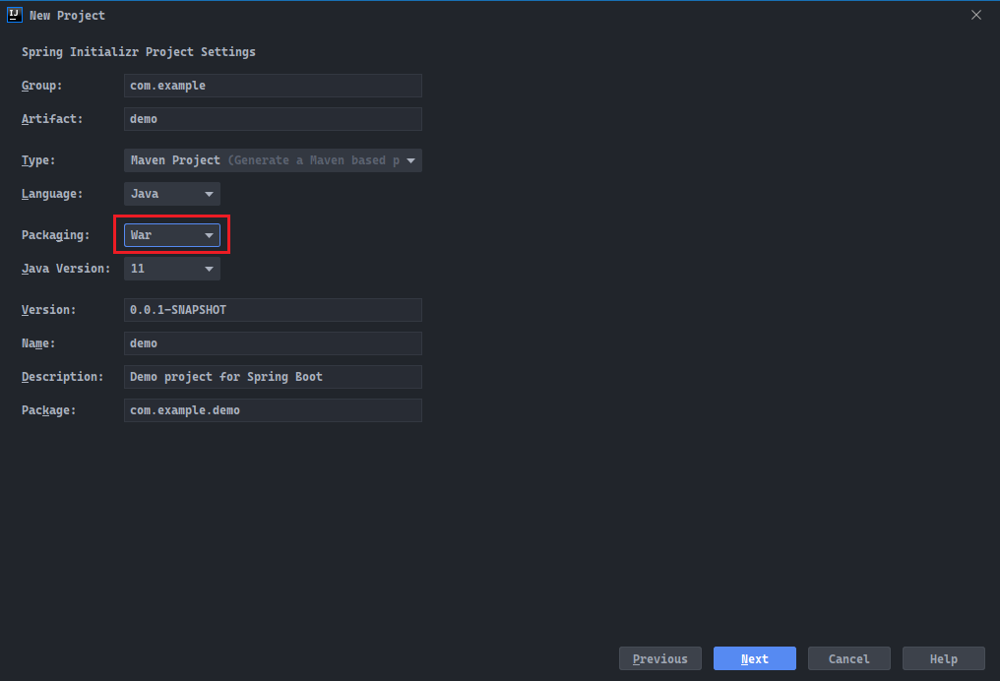
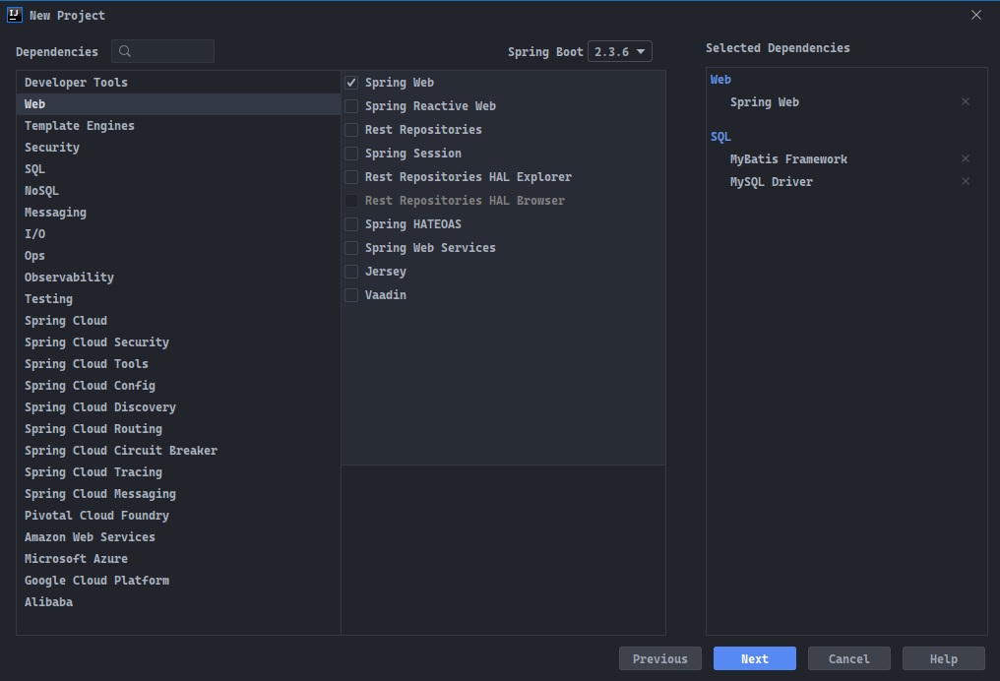

# 简介

- 本篇将介绍`SSM`项目的整合，以及`SSM`项目转`SpringBoot`项目的注意事项。

# SSM项目配置

- 对于传统的`SSM`项目来说，其中的要点就是整合`Spring`、`MyBatis`和`Spring MVC`三大框架。
- 而事实上，`SSM`项目的着重整合点是`Spring`和`MyBatis`，`Spring`与`Spring MVC`之间的联系，是交由`web.xml`文件去建立的；`Spring`相当于`MyBatis`与`Spring MVC`之间的粘合剂，其本质上是一种组合的关系。
- `SSM`项目整合的难点只有一个，即需要将原本`MyBatis`的`DataSource`、`SqlSession`交由`Spring`去控制和创建。
- 将`DataSource`交由`Spring`管理的另一个意义，是可以使用`Spring`的`TransactionManager`对数据库事务进行统一管理。

## 1. Spring、MyBatis整合

- 对于任何一种结构的项目来说，配置是最为重要的，首先需要进行整合的是`MyBatis`和`Spring`，步骤如下：
  1. 创建数据库连接池的对象`DataSource`，交由`Spring`容器管理；
  2. `MyBatis`将使用`DataSource`创建`SqlSession`对象，并交由`Spring`容器管理；
  3. `Spring`将使用`DataSource`创建`TransactionManager`对象，并交由`Spring`容器管理；
  4. 使用`Java`配置类`@Configuration`统一加载`@Import`包含以上`Bean`的类；
  5. 如果使用的是配置文件`.xml`形式配置`<bean>`对象，在`Java`配置类中可以使用`@ImportResource`注解加载进行加载。
- `JdbcConfig`中创建`DataSource`对象引用，会注册为`Spring Bean`，交由`Spring`容器管理，其中：
  1. `@PropertySource`：用于引入`resources`目录下的`jdbc.properties`配置文件，其中配置了相关的数据库源参数；
  2. `@Value`：使用占位符`${}`可以通过`.properties`配置文件中的键获取其值，程序将自动将值赋值到当前字段中；
  3. `@Bean`：方法返回的对象将被`Spring`容器管理。

```java
package cn.dylanphang.config;

import com.mchange.v2.c3p0.ComboPooledDataSource;
import org.springframework.beans.factory.annotation.Value;
import org.springframework.context.annotation.Bean;
import org.springframework.context.annotation.PropertySource;

import javax.sql.DataSource;
import java.beans.PropertyVetoException;

/**
 * 创建数据库连接池Bean。
 */
@PropertySource("classpath:jdbc.properties")
public class JdbcConfig {
    @Value("${jdbc.driver}")
    private String driver;
    @Value("${jdbc.url}")
    private String url;
    @Value("${jdbc.username}")
    private String username;
    @Value("${jdbc.password}")
    private String password;
    @Value("${jdbc.testConnectionOnCheckout}")
    private boolean testConnectionOnCheckout;
    @Value("${jdbc.testConnectionOnCheckin}")
    private boolean textConnectionOnCheckin;
    @Value("${jdbc.idleConnectionTestPeriod}")
    private int idleConnectionTestPeriod;
    @Value("${jdbc.initialPoolSize}")
    private int initialPoolSize;
    @Value("${jdbc.minPoolSize}")
    private int minPoolSize;
    @Value("${jdbc.maxPoolSize}")
    private int maxPoolSize;


    /**
     * 使用c3p0连接池
     *
     * @return DataSource
     */
    @Bean(name = {"dataSource"})
    public DataSource dataSource() {
        try {
            ComboPooledDataSource cpds = new ComboPooledDataSource();

            cpds.setDriverClass(driver);
            cpds.setJdbcUrl(url);
            cpds.setUser(username);
            cpds.setPassword(password);

            cpds.setTestConnectionOnCheckout(testConnectionOnCheckout);
            cpds.setTestConnectionOnCheckin(textConnectionOnCheckin);
            cpds.setIdleConnectionTestPeriod(idleConnectionTestPeriod);

            cpds.setInitialPoolSize(initialPoolSize);
            cpds.setMinPoolSize(minPoolSize);
            cpds.setMaxPoolSize(maxPoolSize);

            return cpds;
        } catch (PropertyVetoException e) {
            e.printStackTrace();
        }
        return null;
    }
}
```

- `MyBatis`使用`DataSource`创建`SqlSession`对象引用，注册为`Spring Bean`，交由`Spring`容器管理，其中：
  1. `classpath*:`：将在`resources`目录下查找指定的文件；
  2. `SqlSessionTemplate`：`Spring`所提供的`SqlSession`的实现类。

```java
package cn.dylanphang.config;

import org.apache.ibatis.session.SqlSessionFactory;
import org.mybatis.spring.SqlSessionFactoryBean;
import org.mybatis.spring.SqlSessionTemplate;
import org.springframework.beans.factory.annotation.Autowired;
import org.springframework.context.annotation.Bean;
import org.springframework.context.annotation.Import;
import org.springframework.core.io.Resource;
import org.springframework.core.io.support.PathMatchingResourcePatternResolver;

import javax.sql.DataSource;

@Import(JdbcConfig.class)
public class MyBatisConfig {

    private final DataSource dataSource;

    @Autowired
    public MyBatisConfig(DataSource dataSource) {
        this.dataSource = dataSource;
    }

    @Bean
    public SqlSessionFactory sqlSessionFactory() {
        try {
            SqlSessionFactoryBean sqlSessionFactoryBean = new SqlSessionFactoryBean();
            sqlSessionFactoryBean.setDataSource(dataSource);

            PathMatchingResourcePatternResolver resolver = new PathMatchingResourcePatternResolver();
            Resource[] resources = resolver.getResources("classpath*:cn/dylanphang/mapper/*Mapper.xml");
            sqlSessionFactoryBean.setMapperLocations(resources);

            return sqlSessionFactoryBean.getObject();
        } catch (Exception e) {
            e.printStackTrace();
        }
        return null;
    }

    @Bean("sqlSession")
    public SqlSessionTemplate sqlSessionTemplate(@Autowired SqlSessionFactory sqlSessionFactory) {
        return new SqlSessionTemplate(sqlSessionFactory);
    }
}
```

- `Spring`使用`DataSource`创建`TransactionManager`对象引用，注册为`Spring Bean`，交由`Spring`容器管理：

```java
package cn.dylanphang.config;

import org.springframework.beans.factory.annotation.Autowired;
import org.springframework.context.annotation.Bean;
import org.springframework.context.annotation.Import;
import org.springframework.jdbc.datasource.DataSourceTransactionManager;
import org.springframework.transaction.TransactionManager;

import javax.sql.DataSource;

/**
 * @author dylan
 */
@Import(JdbcConfig.class)
public class TransactionManagerConfig {
    private final DataSource dataSource;

    public TransactionManagerConfig(@Autowired DataSource dataSource) {
        this.dataSource = dataSource;
    }

    /**
     * 可以直接在业务层中使用注解Transactional对事务进行管理，该种事务管理要求抛出RuntimeException或Error，对于其他类型的异常，
     * 将不做回滚处理。需要扩大处理异常的范围，需要在注解中传入rollbackFor = Exception.class，扩大异常抓取的范围。
     *
     * @return DataSourceTransactionManager对象
     */
    @Bean
    public TransactionManager transactionManager() {
        return new DataSourceTransactionManager(dataSource);
    }
}
```

- 最后使用`Java`配置类统一加载以上配置类：
  1. 此配置类`SpringConfiguration`最终由`web.xml`配置，交由`web`容器加载；
  2. `@ComponentScan`：`Spring IoC`容器除了加载必要的环境所依赖的`Bean`对象之外，还需要加载用户自定义类的`Bean`对象，使用`@ComponentScan`设定`Spring`加载自定义`Bean`的包路径；
  3. `excludeFilters`：用于排除扫描指定注解。该属性接收一个`@Filter`类的参数，该类在`@ComponectScan`中，而`@Filter`类则默认接收一个注解类型的类对象作为参数；
  4. `@Import`：用于加载类文件，其中`Jdbc.class`已经在`MybatisConfig.class`和`TransactionManagerConfig.class`中加载过了，可以不再进行二次加载；
  5. `@EnableTransactionManagement`：是否允许`Spring`事务管理。

```java
package cn.dylanphang.config;

import org.springframework.context.annotation.*;
import org.springframework.stereotype.Controller;
import org.springframework.transaction.annotation.EnableTransactionManagement;

/**
 * @author dylan
 */
@Configuration
@ComponentScan(
        basePackages = "cn.dylanphang",
        excludeFilters = {
                @ComponentScan.Filter({Controller.class})
        })
@Import({MyBatisConfig.class, TransactionManagerConfig.class})
@EnableTransactionManagement
public class SpringConfiguration {
}
```

## 2. Spring MVC配置

- `Spring MVC`只需要完成标准配置即可，选用`.xml`配置的方式：
  1. `<context:component-scan>`：同样需要设置包扫描，并只需要管理`@Controller`注解；
  2. `<mvc:annotation-driven/>`：开启注解支持；
  3. `InternalResourceViewResolver`：视图解析器，当你需要返回一个逻辑视图并需要解析为物理视图时，需要配置；
  4. `CommonsMultipartResolver`：当你在`Controller`方法中使用对象`MutilpartFile`时，需要配置。

```xml
<?xml version="1.0" encoding="UTF-8"?>
<beans xmlns="http://www.springframework.org/schema/beans"
       xmlns:mvc="http://www.springframework.org/schema/mvc"
       xmlns:context="http://www.springframework.org/schema/context"
       xmlns:xsi="http://www.w3.org/2001/XMLSchema-instance"
       xsi:schemaLocation="
http://www.springframework.org/schema/beans
http://www.springframework.org/schema/beans/spring-beans.xsd
http://www.springframework.org/schema/mvc
http://www.springframework.org/schema/mvc/spring-mvc.xsd
http://www.springframework.org/schema/context
http://www.springframework.org/schema/context/spring-context.xsd">

    <!-- 配置spring创建容器时要扫描的包 -->
    <context:component-scan base-package="cn.dylanphang.controller">
        <context:include-filter type="annotation" expression="org.springframework.stereotype.Controller"/>
    </context:component-scan>

    <!-- 配置视图解析器 -->
    <bean id="viewResolver" class="org.springframework.web.servlet.view.InternalResourceViewResolver">
        <property name="prefix" value="/WEB-INF/page/"/>
        <property name="suffix" value=".jsp"/>
    </bean>

    <!-- 配置文件解析器对象，要求id名称必须为multipartResolver-->
    <bean id="multipartResolver" class="org.springframework.web.multipart.commons.CommonsMultipartResolver">
        <!-- 配置文件上传的最大size为10mb -->
        <property name="maxUploadSize" value="10485760"/>
    </bean>

    <!-- 配置spring开启注解mvc的支持 -->
    <mvc:annotation-driven/>
</beans>
```

- 注：许多新的项目已经摒弃了`jsp`视图了，如果使用`SpringBoot`构建项目，那么完全不会使用`jsp`视图。但即使如此，知道得越多总是越好的，至少在面对一些历史遗留的代码时，不会慌。
- 之后介绍`SpringBoot`构建时，会展示如何开启`SpringBoot`对`jsp`视图的支持。

## 3. SSM整合

- 当完成了`Spring`与`MyBatis`的整合，及`Spring MVC`的基础配置后，就可以开始最后的整合工作了。
- 使用`web.xml`文件将以上两部分进行整合即可，配置文件如下：
  1. `web`容器将加载`web.xml`配置文件，首先读取标签`<context-param>`和`<listener>`，此时`Spring`和`MyBatis`整合的配置类将被加载进内存，各种`Bean`会被创建出来并放入`Spring`的容器`ApplicationContext`中进行统一管理；
  2. `web`容器紧接着会读取`<filter>`标签并加载相关配置；
  3. `web`容器最后将读取`<servlet>`标签，此时会加载`Spring MVC`的配置文件，其中配置的`<bean>`也会被加载进内存。

```xml
<!DOCTYPE web-app PUBLIC
        "-//Sun Microsystems, Inc.//DTD Web Application 2.3//EN"
        "http://java.sun.com/dtd/web-app_2_3.dtd" >

<web-app>
    <display-name>Archetype Created Web Application</display-name>

    <!-- 当Spring使用的是配置类时，需要提供一个用于加载配置类的对象AnnotationConfigWebApplicationContext -->
    <context-param>
        <param-name>contextClass</param-name>
        <param-value>org.springframework.web.context.support.AnnotationConfigWebApplicationContext</param-value>
    </context-param>
    <!-- contextConfigLocation中，即可以配置“classpath*：xxx.xml”文件，也可配置Java配置类 -->
    <context-param>
        <param-name>contextConfigLocation</param-name>
        <param-value>cn.dylanphang.config.SpringConfiguration</param-value>
    </context-param>

    <!--
        配置过滤器，解决中文乱码的问题；
        服务器启动的时候就会创建该Filter，将init-param中的参数加载，注入到CharacterEncodingFilter类中，
        浏览器每次发送请求都会经过这个过滤器，然后调用doFilterInternal方法
    -->
    <filter>
        <filter-name>characterEncodingFilter</filter-name>
        <filter-class>org.springframework.web.filter.CharacterEncodingFilter</filter-class>
        <!-- 指定字符集 -->
        <init-param>
            <param-name>encoding</param-name>
            <param-value>UTF-8</param-value>
        </init-param>
    </filter>
    <!-- 指定对哪些资源使用characterEncodingFilter规则 -->
    <!-- 配置为"/*"的时候，即对路径型url和后缀型url都会进行拦截 -->
    <filter-mapping>
        <filter-name>characterEncodingFilter</filter-name>
        <url-pattern>/*</url-pattern>
    </filter-mapping>

    <!-- listener监听器必须配置 -->
    <listener>
        <listener-class>org.springframework.web.context.ContextLoaderListener</listener-class>
    </listener>

    <!-- 前端/核心控制器加载Spring MVC -->
    <servlet>
        <servlet-name>dispatcherServlet</servlet-name>
        <servlet-class>org.springframework.web.servlet.DispatcherServlet</servlet-class>
        <!-- 配置Servlet的初始化参数，读取springmvc中的配置，并创建spring容器 -->
        <init-param>
            <param-name>contextConfigLocation</param-name>
            <param-value>classpath*:springmvc.xml</param-value>
        </init-param>
        <!-- 但为正整数的时候，即配置servlet启动时加载该DispatcherServlet对象 -->
        <load-on-startup>1</load-on-startup>
    </servlet>
    <!-- 配置为"/"的时候，即对路径型url进行拦截，但不会拦截后缀型url -->
    <servlet-mapping>
        <servlet-name>dispatcherServlet</servlet-name>
        <url-pattern>/</url-pattern>
    </servlet-mapping>
</web-app>
```

- 至此，`SSM`环境已经搭建完毕。

# SpringBoot项目配置

- 那么如何获取一个完全等价的`SpringBoot`项目呢？在此之前，你需要了解一些前置知识。
- 对于`SpringBoot`来说，它已经帮我们整合了`web`容器、`Spring MVC`及`MyBatis`了，并且事务管理的对象也提前自动创建了，但这不意味着无事可做，你仍需要稍微进行一些自定义的配置。
- 需要额外进行的配置如下：
  1. 数据库连接池`DataSource`的参数配置，你仍然需要告诉`SpringBoot`你的数据库在哪、用户名密码是什么等；
  2. 配置`MyBatis`中`Mapper.xml`路径，需要告诉`SpringBoot`需要在哪个目录中查找你的`Mapper.xml`文件。
- 关于`SpringBoot`的自动配置，`SpringBoot`默认会使用一些初始参数加载相关的`Bean`对象，对于用户来说，我们完全可以在`application.properties`或`application.yml`中修改创建这些`Bean`的初始参数。

## 1. 创建SpringBoot项目

- 首先需要创建一个`SpringBoot`项目，你可以不引入任何的依赖，但如果后续你需要用到相关的支持自动配置的框架，则需要自行寻找并添加到项目的`pom.xml`文件中，在以下网址中，你可以看到一些`SpringBoot`支持自动配置的框架：
  - https://docs.spring.io/spring-boot/docs/2.4.0/reference/html/using-spring-boot.html#using-boot-starter
- 因此，你可以选择在项目创建之初，勾选相关需要使用到的框架，`SpringBoot`会在项目构建时添加这些框架的自动配置依赖到项目的`pom.xml`文件中，免去手动查找的繁琐步骤：
  1. 注意，对于打包类型为`war`包的`SpringBoot`项目来说，项目构建完毕会自动生成一个`ServletInitializer`类，该类实现了`WebApplicationInitializer`，可以看做是`web.xml`的替代，一般情况下用不上；
  2. 相关运行应用在`Application`类上的注解，也可以转移到`ServletInitializer`类上，但是没有必要；
  3. 因此，在一般情况下，选择打包成`jar`包，将配置注解标注在`Application`类上。





- `SpringBoot`将在项目的`pom.xml`中添加以下坐标：

```xml
<?xml version="1.0" encoding="UTF-8"?>
<project xmlns="http://maven.apache.org/POM/4.0.0" xmlns:xsi="http://www.w3.org/2001/XMLSchema-instance"
         xsi:schemaLocation="http://maven.apache.org/POM/4.0.0 https://maven.apache.org/xsd/maven-4.0.0.xsd">
    <modelVersion>4.0.0</modelVersion>
    <parent>
        <groupId>org.springframework.boot</groupId>
        <artifactId>spring-boot-starter-parent</artifactId>
        <version>2.3.6.RELEASE</version>
        <relativePath/> <!-- lookup parent from repository -->
    </parent>
    <groupId>com.example</groupId>
    <artifactId>demo</artifactId>
    <version>0.0.1-SNAPSHOT</version>
    <packaging>war</packaging>
    <name>demo</name>
    <description>Demo project for Spring Boot</description>

    <properties>
        <java.version>11</java.version>
    </properties>

    <dependencies>
        <dependency>
            <groupId>org.springframework.boot</groupId>
            <artifactId>spring-boot-starter-web</artifactId>
        </dependency>
        <dependency>
            <groupId>org.mybatis.spring.boot</groupId>
            <artifactId>mybatis-spring-boot-starter</artifactId>
            <version>2.1.3</version>
        </dependency>

        <dependency>
            <groupId>mysql</groupId>
            <artifactId>mysql-connector-java</artifactId>
            <scope>runtime</scope>
        </dependency>
        <dependency>
            <groupId>org.springframework.boot</groupId>
            <artifactId>spring-boot-starter-tomcat</artifactId>
            <scope>provided</scope>
        </dependency>
        <dependency>
            <groupId>org.springframework.boot</groupId>
            <artifactId>spring-boot-starter-test</artifactId>
            <scope>test</scope>
            <exclusions>
                <exclusion>
                    <groupId>org.junit.vintage</groupId>
                    <artifactId>junit-vintage-engine</artifactId>
                </exclusion>
            </exclusions>
        </dependency>
    </dependencies>

    <build>
        <plugins>
            <plugin>
                <groupId>org.springframework.boot</groupId>
                <artifactId>spring-boot-maven-plugin</artifactId>
            </plugin>
        </plugins>
    </build>
</project>
```

## 2. DataSource配置

- 在此前`SSM`项目中，我们使用了`c3p0`的数据库连接池（详细请参见`JdbcConfig.java`源码），由于是项目的迁移实验，因此需要同样的依赖到`SpringBoot`项目中。
- 但也许你希望更新一下`DataSource`，比如使用`druid`数据库连接池，在`pom.xml`中添加以下依赖引入`druid`坐标：

```xml
<dependency>
    <groupId>com.alibaba</groupId>
    <artifactId>druid</artifactId>
    <version>1.1.23</version>
</dependency>
```

- 需要`SpringBoot`连接到`MySQL`中，还需要提供`url`、`username`和`password`等信息。
- 找到`resources`目录下的`SpringBoot`配置文件`application.properties`，添加以下配置即可完成对`DataSource`配置：

```properties
spring.datasource.type=com.alibaba.druid.pool.DruidDataSource
spring.datasource.url=jdbc:mysql://localhost:3306/upload_download?serverTimezone=GMT%2B8&useAffectedRows=true
spring.datasource.username=root
spring.datasource.password=root
```

- 其中只需要表明需要使用的数据库池类型`spring.datasource.type`即可，不需要配置`driver`的信息，`SpringBoot`会自动查找并使用`MySQL`的驱动，当然你也可以选择手动配置驱动的全限定类名。
- 完成以上配置后，`SpringBoot`将自动使用以上的配置信息，去创建一个`DruidDataSource`。


## 3. MyBatis配置

- 如同配置`DataSource`一样简单，我们只需要在`application.properties`中添加以下代码：

```properties
mybatis.mapper-locations=classpath:mapper/*.xml
```

- 以上代码即等同于告诉`SpringBoot`存放`Mapper.xml`的路径在`resources/mapper/`目录下，`SpringBoot`将自动为相关的`Mapper`类匹配对应的`Mapper.xml`，此时仅要求`Mapper`类与其映射文件`Mapper.xml`同名。
- 关于如何让`SpringBoot`知道`Mapper.java`所在的包的位置，有两种方法：
  1. 在`Mapper.java`中使用`@Mapper`注解；
  2. 在`ServletInitializer`或`Application`类上使用`@MapperScan`注解。
- 可以选择在`Mapper`上添加注解`@Mapper`，如下：
  1. 此时如果不使用`@Repository`，会导致`@Autowried`注解的字段报错，但不会影响程序正常运行；
  2. 如果一定不希望使用`@Repository`注解，可以选择使用`@Resource`注解替代`@Autowried`，此时字段不会报错。

```java
package cn.dylanphang.uploaddownload2.mapper;

import cn.dylanphang.uploaddownload2.pojo.Student;
import org.apache.ibatis.annotations.Mapper;
import org.springframework.stereotype.Repository;

import java.util.List;

/**
 * @author dylan
 */
@Repository
@Mapper
public interface StudentMapper {

    /**
     * 查询所有信息。
     *
     * @return List对象
     */
    List<Student> findAll();

    /**
     * 保存所有信息
     *
     * @param list List对象
     */
    void saveAll(List<Student> list);
}
```

- 也可以选择在`ServletInitializer`上使用`@MapperScan`注解，配置`Mapper`类的包名：
  1. 使用`@MapperScan`注解，可以省去`Mapper`类中的`@Repository`和`@Mapper`注解；
  2. 此时`Mapper`的依赖注入，既可以使用`@Resource`，也可以使用`@Autowired`。

```java
package cn.dylanphang.uploaddownload2;

import org.mybatis.spring.annotation.MapperScan;
import org.springframework.boot.builder.SpringApplicationBuilder;
import org.springframework.boot.web.servlet.support.SpringBootServletInitializer;

/**
 * @author dylan
 */
@MapperScan({"cn.dylanphang.uploaddownload2.mapper"})
public class ServletInitializer extends SpringBootServletInitializer {

    @Override
    protected SpringApplicationBuilder configure(SpringApplicationBuilder application) {
        return application.sources(UploadDownload2Application.class);
    }

}
```

- 关于注解的使用方面，选择有很多，但在大多数协同办公的情况下，务必优先选择最为通俗易懂的注解。尽管某些情况下多一个注解并不会影响什么，但细节往往最能反映个人对知识点的理解是否透彻。

## 4. 遗留问题

- 至此，你的项目已经可以运行了。但扔存在遗留问题，`SpringBoot`中存放静态资源页面的目录一般是`resource/templates`，通过一些第三方的视图模板库如`Thymeleaf`，可以在静态页面中使用代码调用`Controller`中`Model`存储的数据。
- 但传统`SSM`大多使用的是`.jsp`，项目启动后默认的访问资源位于`webapp/`目录下，你只要将`index.jsp`或`index.html`放置于该目录下，页面即可被访问到。而`Spring MVC`视图解析器的配置，多数指向的是`/WEB-INF/**/.jsp`页面。

- 这导致了一个问题，`SpringBoot`默认并不支持`.jsp`视图，更不用提及根本不存在项目中的`webapp`目录了。
- 旧的`SSM`项目转为新的`SpringBoot`项目中，我们必须要解决这个问题。如何免去重新编写页面逻辑，直接使用原本的`jsp`视图呢？可以通过自定义`Spring MVC`视图解析器，以及添加支持`.jsp`视图的相关依赖解决这个问题。

### a. 自定义Spring MVC视图解析器

- `SpringBoot`支持部分个性化配置`Spring MVC`的功能，当然也支持全覆盖地配置，我们需要编写一个`Java`配置类，并让该配置类去实现`WebMvcConfigurer`接口：
  - 需要覆写其中的`configureViewResolvers`方法，并使用`ViewResolverRegistry`注册自定义的`jsp`视图解析器。

```java
package cn.dylanphang.uploaddownload2.config;

import org.springframework.context.annotation.Configuration;
import org.springframework.web.servlet.config.annotation.ViewResolverRegistry;
import org.springframework.web.servlet.config.annotation.WebMvcConfigurer;

/**
 * 如果你旧项目需要转SpringBoot，需要定义此配置类，覆盖默认的视图解析器。
 * 在此类中不添加@EnableWebMvc注解，则会保留SpringBoot原本的Mvc配置；否则，会覆盖所有的SpringBoot对Spring MVC的默认配置。
 *
 * 在application.properties中配置：spring.mvc.view.prefix/spring.mvc.view.suffix是没有作用的！！！
 *
 * @author dylan
 */
@Configuration
public class PersonalMvcConfig implements WebMvcConfigurer {

    @Override
    public void configureViewResolvers(ViewResolverRegistry registry) {
        registry.jsp("/WEB-INF/page/", ".jsp");
    }
}
```

- 完成以上操作后，我们需要创建一个`jsp`视图所指向的资源目录，因此需要在`main`目录下新建一个`webapp`目录，并在`webapp`目录下放置旧的`jsp`视图资源。
- 至此，我们所自定义的视图解析器所指向的根目录`webapp`创建完毕。

### b. 添加依赖

- 为了让`SpringBoot`至此`jsp`视图，需要额外添加支持`jsp`视图的依赖：

```xml
<!-- 转Spring Boot项目之后，原生不支持JSP，需要添加以下依赖，否则.jsp会跳转下载页面 -->
<dependency>
    <groupId>org.apache.tomcat.embed</groupId>
    <artifactId>tomcat-embed-jasper</artifactId>
    <version>9.0.39</version>
    <exclusions>
        <exclusion>
            <groupId>org.apache.tomcat.embed</groupId>
            <artifactId>tomcat-embed-core</artifactId>
        </exclusion>
    </exclusions>
</dependency>
```

- 其中`tomcat-embed-core`依赖已经被`spring-boot-starter-tomcat`关联了，可以使用`<exclusion>`排除它。
- 至此，所有问题都解决了，`SSM`项目已经完美转为`SpringBoot`项目。

# 注意事项

1. `SpringBoot`中总是优先访问`Controller`，如果你具有首页或登录页面，可以配置一个`RouterController`，在其中编写方法，当访问指定`url`的时候，跳转到指定的页面，如首页、登录页面；
2. 由于自定义视图解析器的存在，`Controller`跳转的页面总是在视图解析器指向的目录下；因此某些页面的`url`可能需要在转为新项目之后，作相关的调整，同样某些页面的存放路径，也需要进行调整；
3. 旧项目中的一些路径获取情况，在转到了新项目后，可能会发生变化，如使用`getRealPath`获取到的路径可能不一致，往路径中存放文件时，文件可能出现在意料之外的目录中，此时就需要对相关代码进行调整。

# 总结

- 使用`SpringBoot`创建项目更为推荐使用第三方的视图模板库，`Java Servlet Page`已经渐渐被淘汰了；
- 作为后端，对于视图模板库了解即可。在前后端分离的时代，数据交互一般使用`JSON`数据。