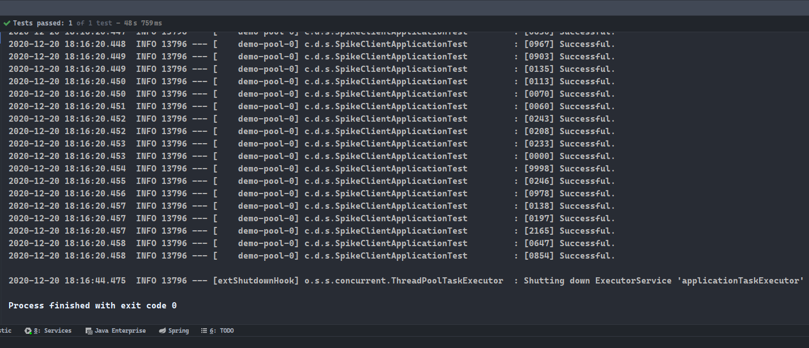

# 简介

- 阅读本篇，需要具备`RabbitMQ`的知识，以及其在`SpringBoot`中的应用。
- 本篇将使用`RabbitMQ`制作一个秒杀系统的雏形，其主要充当的作用是流量削峰。

# 系统架构图

- 秒杀逻辑分为两部分：
  1. `spike-client`：用于接收购买信息，查询`redis`并扣除库存，购买成功则将用户信息发送到`RabbitMQ`；
  2. `spike-server`：用于处理交换机`exchange`中的用户信息，程序将使用该信息完成扣库及订单生成操作。


- 在`redis`检查库存信息并确认用户具有购买资格后，可以在`redis`中使用相关的用户信息，创建一个`String`类型数据，待订单创建完成后，更新该数据的值为订单对象的`json`格式字符串数据即可。
  1. 客户端在得知购买成功后，需要持续请求个人的订单信息，该信息首先会在`redis`中查询，未持久化的订单只能获得空值；
  2. 待系统持久化完成并写入`redis`后，客户端将请求并获取到真正的订单信息；
  3. 客户端获取信息后，进入支付阶段。

# spike-server服务端

- 大部分是常规的项目代码，会着重介绍其中较为重要的关于`RabbitMQ`的部分。
- 模块架构：


- `spike_goods`的数据库表同`goods`数据库表一致：
  - 注意，这里没有编写`SpikeGoods.java`，该类和`Goods.java`源码是完全一致的。

```sql
CREATE TABLE `goods` (
  `id` int(11) NOT NULL AUTO_INCREMENT,
  `description` varchar(30) NOT NULL,
  `spu` varchar(30) NOT NULL,
  `sku` varchar(30) NOT NULL,
  `balance` int(11) NOT NULL,
  PRIMARY KEY (`id`)
) ENGINE=InnoDB AUTO_INCREMENT=2 DEFAULT CHARSET=utf8;
```

- `GoodsMapper.xml`及`GoodsServiceImpl.java`源码：

```xml
<?xml version="1.0" encoding="UTF-8" ?>
<!DOCTYPE mapper
        PUBLIC "-//mybatis.org//DTD Mapper 3.0//EN"
        "http://mybatis.org/dtd/mybatis-3-mapper.dtd">

<mapper namespace="cn.dylanphang.spikeserver.mapper.GoodsMapper">
    <select id="findBySku" resultType="goods" parameterType="string">
        SELECT *
        FROM goods
        WHERE sku = #{goodsSku};
    </select>

    <update id="modifyBalance">
        UPDATE goods
        SET balance = #{param2}
        WHERE sku = #{param1};
    </update>
</mapper>
```

```java
package cn.dylanphang.spikeserver.service.impl;

import cn.dylanphang.spikeserver.mapper.GoodsMapper;
import cn.dylanphang.spikeserver.pojo.Goods;
import cn.dylanphang.spikeserver.service.GoodsService;
import org.springframework.stereotype.Service;
import org.springframework.transaction.annotation.Transactional;

import javax.annotation.Resource;

/**
 * @author dylan
 * @date 2020/12/16
 */
@Service("goodsService")
@Transactional(rollbackFor = Exception.class)
public class GoodsServiceImpl implements GoodsService {

    @Resource
    private GoodsMapper goodsMapper;

    @Override
    public Goods findBySku(String goodsSku) {
        return this.goodsMapper.findBySku(goodsSku);
    }

    @Override
    public void modifyBalance(String goodsSku, Integer finalQuantity) {
        this.goodsMapper.modifyBalance(goodsSku, finalQuantity);
    }

    @Override
    public void changeBalance(String goodsSku, Integer changeQuantity) {
        int finalQuantity = this.findBySku(goodsSku).getBalance() - changeQuantity;
        if (finalQuantity < 0) {
            throw new RuntimeException("Balance is not enough.");
        }
        this.modifyBalance(goodsSku, finalQuantity);
    }
}
```

- `SpikeGoodsMapper.xml`及`SpikeGoodsMapperImpl.java`源码：
  1. 其中扣库的过程是先查询，后扣减，并没有将`sql`置于同一条语句中；
  2. 关于`FOR UPDATE`字句，该字句在使用队列的情况下，会造成一定的资源浪费，但后续使用非队列进行对比实验时，需要使用到此字句保存事务的一致性；
  3. 方法`modifyBalance`中手动延时`80ms`模拟处理缓慢的情况。

```xml
<?xml version="1.0" encoding="UTF-8" ?>
<!DOCTYPE mapper
        PUBLIC "-//mybatis.org//DTD Mapper 3.0//EN"
        "http://mybatis.org/dtd/mybatis-3-mapper.dtd">

<mapper namespace="cn.dylanphang.spikeserver.mapper.SpikeGoodsMapper">
    <select id="findBySku" resultType="goods" parameterType="string">
        SELECT *
        FROM spike_goods
        WHERE sku = #{goodsSku}
        FOR UPDATE;
    </select>

    <update id="modifyBalance">
        UPDATE spike_goods
        SET balance = #{param2}
        WHERE sku = #{param1};
    </update>

    <insert id="insert" parameterType="goods">
        INSERT INTO spike_goods (description, spu, sku, balance)
        VALUES (#{description}, #{spu}, #{sku}, #{balance});
    </insert>

    <delete id="truncate" parameterType="string">
        DELETE
        FROM spike_goods
        WHERE sku = #{goodsSku};
    </delete>
</mapper>
```

```java
package cn.dylanphang.spikeserver.service.impl;

import cn.dylanphang.spikeserver.mapper.SpikeGoodsMapper;
import cn.dylanphang.spikeserver.pojo.Goods;
import cn.dylanphang.spikeserver.service.GoodsService;
import cn.dylanphang.spikeserver.service.SpikeGoodsService;
import org.springframework.stereotype.Service;
import org.springframework.transaction.annotation.Transactional;

import javax.annotation.Resource;

/**
 * @author dylan
 * @date 2020/12/16
 */
@Service("spikeGoodsService")
@Transactional(rollbackFor = Exception.class)
public class SpikeGoodsServiceImpl implements SpikeGoodsService {

    @Resource
    private GoodsService goodsService;

    @Resource
    private SpikeGoodsMapper spikeGoodsMapper;

    @Override
    public Goods findBySku(String goodsSku) {
        return this.spikeGoodsMapper.findBySku(goodsSku);
    }

    @Override
    public void modifyBalance(String goodsSku, Integer finalQuantity) throws InterruptedException {
        // *.模拟扣库缓慢的情况
        Thread.sleep(80);
        this.spikeGoodsMapper.modifyBalance(goodsSku, finalQuantity);
    }

    @Override
    public void changeBalance(String goodsSku, Integer changeQuantity) throws InterruptedException {
        int finalQuantity = this.findBySku(goodsSku).getBalance() - changeQuantity;
        if (finalQuantity < 0) {
            throw new RuntimeException("Balance is not enough.");
        }
        this.modifyBalance(goodsSku, finalQuantity);
    }

    @Override
    public void insert(Goods goods) {
        this.spikeGoodsMapper.insert(goods);
    }

    @Override
    public void spikeGoods(String goodsSku, Integer quantity) {
        // 1.库存扣减
        this.goodsService.changeBalance(goodsSku, quantity);
        // 2.获取商品信息
        final Goods goods = this.goodsService.findBySku(goodsSku);
        goods.setBalance(quantity);
        // 3.设置秒杀商品
        this.insert(goods);
    }

    @Override
    public void truncate(String goodsSku) {
        this.spikeGoodsMapper.truncate(goodsSku);
    }
}
```

- `SpikeController`中提供了上架秒杀商品接口，及相关处理非队列实验时所需要的接口：

```java
package cn.dylanphang.spikeserver.controller;

import cn.dylanphang.spikeserver.pojo.Goods;
import cn.dylanphang.spikeserver.service.GoodsService;
import cn.dylanphang.spikeserver.service.SpikeGoodsService;
import lombok.extern.slf4j.Slf4j;
import org.springframework.data.redis.core.RedisTemplate;
import org.springframework.web.bind.annotation.RequestMapping;
import org.springframework.web.bind.annotation.RestController;

import javax.annotation.Resource;

/**
 * @author dylan
 * @date 2020/12/16
 */
@RestController
@Slf4j
public class SpikeController {

    @Resource
    private GoodsService goodsService;

    @Resource
    private SpikeGoodsService spikeGoodsService;

    @Resource
    private RedisTemplate<String, Object> redisTemplate;

    @RequestMapping("/find")
    public Goods find(String goodsSku) {
        return this.goodsService.findBySku(goodsSku);
    }

    /**
     * 决定指定商品用于秒杀的数量。并将该数量的sku和quantity写入redis用于预查询。
     *
     * @param goodsSku sku
     * @param quantity quantity
     */
    @RequestMapping("/spike")
    public void spike(String goodsSku, Integer quantity) {
        // *.以下两条业务代码需要放置在同一个Service中
        try {
            this.spikeGoodsService.spikeGoods(goodsSku, quantity);
            this.redisTemplate.opsForValue().set(goodsSku, quantity);
        } catch (Exception e) {
            log.info("库存不足");
        }
    }

    @RequestMapping("/rollback")
    public void rollback(String goodsSku, Integer quantity) {
        this.goodsService.modifyBalance(goodsSku, quantity);
        this.spikeGoodsService.truncate(goodsSku);
    }

    /**
     * 该接口提供直接购买的方式。用于测试2000并发下系统是否崩溃。
     *
     * @param identity id
     * @param goodsSku sku
     * @param quantity quantity
     */
    @RequestMapping("/directBuy")
    public String directBuy(String identity, String goodsSku, Integer quantity) {
        // *.在此方法中实际还需要创建订单并返回该订单的编号，在创建订单的方法中去修改库存，此处省略
        try {
            this.spikeGoodsService.changeBalance(goodsSku, quantity);
        } catch (Exception e) {
            log.info(identity + "购买失败。请稍后再试。");
            return "[" + identity + "] Failure. No stock.";
        }
        log.info(identity + "购买" + quantity + "个" + goodsSku + "等待支付。订单号为：BA[" + identity + "]3740027734074");
        return "[" + identity + "] Successful.";
    }
}
```

- `RabbitmqConfig.java`将在系统启动时，创建项目所需要的队列、交换机，及完成它们之间的绑定操作：

```java
package cn.dylanphang.spikeserver.config;

import org.springframework.amqp.core.*;
import org.springframework.context.annotation.Bean;
import org.springframework.context.annotation.Configuration;

/**
 * @author dylan
 * @date 2020/12/16
 */
@Configuration
public class RabbitmqConfig {

    private static final String QUEUE_NAME = "orderQueue";
    private static final String EXCHANGE_NAME = "orderExchange";
    private static final String ROUTING_KEY = "goods.order";

    /**
     * 该Queue是创建给spike-server中的@RabbitListener用于接收信息的。
     *
     * @return Queue
     */
    @Bean("orderQueue")
    public Queue orderQueue() {
        return new Queue(QUEUE_NAME);
    }

    /**
     * 该Exchange是创建给spike-client用于发布消息的。类型为Topic。
     *
     * @return Exchange
     */
    @Bean("orderExchange")
    public Exchange orderExchange() {
        return new TopicExchange(EXCHANGE_NAME);
    }

    /**
     * 绑定Queue与Exchange让队列明确需要到那个Exchange中接收消息，并指定该Queue的所接收信息必须携带的routingKey.
     *
     * @param orderQueue    Queue
     * @param orderExchange Exchange
     * @return Binding
     */
    @Bean
    public Binding binding(Queue orderQueue, Exchange orderExchange) {
        return BindingBuilder.bind(orderQueue).to(orderExchange).with(ROUTING_KEY).noargs();
    }
}
```

- `OrderListener`将从队列中有序地取出购买信息并处理：

```java
package cn.dylanphang.spikeserver.listener;

import cn.dylanphang.spikeserver.service.SpikeGoodsService;
import com.fasterxml.jackson.core.JsonProcessingException;
import com.fasterxml.jackson.databind.ObjectMapper;
import lombok.extern.slf4j.Slf4j;
import org.springframework.amqp.rabbit.annotation.RabbitListener;
import org.springframework.stereotype.Component;

import javax.annotation.Resource;
import java.util.Properties;

/**
 * @author dylan
 * @date 2020/12/16
 */
@Component
@Slf4j
public class OrderListener {
    private static final String QUEUE_NAME = "orderQueue";

    @Resource
    private SpikeGoodsService spikeGoodsService;

    @RabbitListener(queues = QUEUE_NAME)
    public void handleOrder(String message) {
        final ObjectMapper objectMapper = new ObjectMapper();
        try {
            final Properties properties = objectMapper.readValue(message, Properties.class);
            final String name = properties.getProperty("identity");
            final String sku = properties.getProperty("goodsSku");
            final Integer quantity = Integer.valueOf(properties.getProperty("quantity"));

            // *.在此方法中实际还需要创建订单并返回该订单的编号，在创建订单的方法中去修改库存，此处省略
            try {
                this.spikeGoodsService.changeBalance(sku, quantity);
            } catch (Exception e) {
                log.info(name + "购买失败。请稍后再试。");
                return;
            }
            log.info(name + "购买" + quantity + "个" + sku + "等待支付。订单号为：BA[" + name + "]3740027734074");
        } catch (JsonProcessingException e) {
            log.error(e.getMessage());
            throw new RuntimeException(e);
        }
    }
}
```

- `application.yml`中的配置如下：
  1. 使用了`druid`数据库连接池；
  2. `spike-server`服务端的启动端口为`9090`。

```yml
spring:
  datasource:
    druid:
      db-type: com.alibaba.druid.pool.DruidDataSource
      driver-class-name: com.mysql.cj.jdbc.Driver
      url: jdbc:mysql://localhost:3306/mall?serverTimezone=GMT%2B8&useAffectedRows=true
      username: root
      password: root
      # 初始连接数
      initial-size: 5
      # 最小连接数
      min-idle: 10
      # 最大连接数
      max-active: 20
      # 获取连接超时时间
      max-wait: 5000
      # 连接有效性检测时间
      time-between-eviction-runs-millis: 60000
      # 连接在池中最小生存的时间
      min-evictable-idle-time-millis: 300000
      # 连接在池中最大生存的时间
      max-evictable-idle-time-millis: 900000
      test-while-idle: true
      test-on-borrow: false
      test-on-return: false
      # 检测连接是否有效
      validation-query: select 1
  rabbitmq:
    host: 127.0.0.1
    port: 5672
    username: dylan
    password: 123456
    virtual-host: /spike-system
  redis:
    host: 192.168.88.210
    port: 6379
mybatis:
  mapper-locations: classpath:mapper/*xml
  type-aliases-package: cn.dylanphang.spikeserver.pojo
server:
  port: 9090
```

# spike-client客户端

- 此模块用于判定用户是否购买成功，并将相关购买成功的用户信息，发送到消息队列中。
- 模块架构：


- `RedisConfig.java`源码如下，用于自定义`RedisTemplate<String, Object>`对象：
  - 此配置类可以省略，实验存入`redis`的数据仅仅是商品库存信息，但多数情况下，项目都会构建此类，用于存储对象；
  - 需要知道`SpringBoot`默认不提供`RedisTemplate<String, Object>`对象；
  - `SpringBoot`仅提供自动配置的`RedisTemplate<Object, Object>`和`RedisTemplate<String, String>`对象。

```java
package cn.dylanphang.spikeclient.config;

import com.fasterxml.jackson.databind.ObjectMapper;
import org.springframework.context.annotation.Bean;
import org.springframework.context.annotation.Configuration;
import org.springframework.data.redis.connection.RedisConnectionFactory;
import org.springframework.data.redis.core.RedisTemplate;
import org.springframework.data.redis.serializer.Jackson2JsonRedisSerializer;
import org.springframework.data.redis.serializer.StringRedisSerializer;

/**
 * 本类用于自定义RedisTemplate，如果需要用于直接存储pojo类，那么该类需要进行序列化。
 * 数据需要在网路上进行传输，一般都需要进行序列化操作。
 * 其中主要目的是让value对象可以使用ObjectMapper进行转换后再序列化，重点是Jackson2JsonRedisSerializer<Object>与ObjectMapper。
 *
 * @author dylan
 * @date 2020/12/16
 */
@Configuration
public class RedisConfig {

    @Bean
    public RedisTemplate<String, Object> redisTemplate(RedisConnectionFactory redisConnectionFactory) {
        // 0.创建RedisTemplate对象并设置连接方式，默认是lettuce
        RedisTemplate<String, Object> template = new RedisTemplate<>();
        template.setConnectionFactory(redisConnectionFactory);

        // 1.字符串序列化和对象序列化
        final StringRedisSerializer stringRedisSerializer = new StringRedisSerializer();
        final Jackson2JsonRedisSerializer<Object> jackson2JsonRedisSerializer = new Jackson2JsonRedisSerializer<>(Object.class);

        // 2.将对象序列化为Json字符串格式的数据，需要为序列化实例设置一个ObjectMapper对象
        // *.如果不对ObjectMapper进行任何配置，那么从redis中取出来的对象会被封装在一个LinkedHashMap中
        jackson2JsonRedisSerializer.setObjectMapper(new ObjectMapper());

        // 3.key采用String的方式序列化，value采用Jackson的方式序列化
        template.setKeySerializer(stringRedisSerializer);
        template.setValueSerializer(jackson2JsonRedisSerializer);
        template.setHashKeySerializer(stringRedisSerializer);
        template.setHashValueSerializer(jackson2JsonRedisSerializer);

        // 4.初始化RedisTemplate对象
        template.afterPropertiesSet();

        return template;
    }
}
```

- `RedisServiceImpl.java`源码如下，使用`redisTemplate`对象操作`redis`中的数据：
  - 对于`redis`来说单条的语句可以保证事务的原子性的。

```java
package cn.dylanphang.spikeclient.service.impl;

import cn.dylanphang.spikeclient.service.RedisService;
import org.springframework.data.redis.core.RedisTemplate;
import org.springframework.stereotype.Service;

import javax.annotation.Resource;

/**
 * @author dylan
 * @date 2020/12/16
 */
@Service("redisService")
public class RedisServiceImpl implements RedisService {

    @Resource
    private RedisTemplate<String, Object> redisTemplate;

    @Override
    public void modify(String goodsSku, Integer quantity) {
        // *.秒杀自设置的一刻开始就会创建一个redis的String类型数据用于存储秒杀商品的库存信息，从redis中扣减数量
        final Long decrement = this.redisTemplate.opsForValue().decrement(goodsSku, quantity);
        if (decrement != null && decrement < 0) {
            throw new RuntimeException("No any stock.");
        }
    }
}
```

- `SpikeController.java`源码如下：
  1. 使用`redisService`检查`redis`中相关商品是否有库存；
  2. 使用`objectMapper`对象将数据包装为`json`格式的字符串；
  3. 使用`rabbitTemplate`中提供的 `converAndSend`方法，将包装后的数据发送到交换机`exchange`中。

```java
package cn.dylanphang.spikeclient.controller;

import cn.dylanphang.spikeclient.service.RedisService;
import com.fasterxml.jackson.core.JsonProcessingException;
import com.fasterxml.jackson.databind.ObjectMapper;
import lombok.extern.slf4j.Slf4j;
import org.springframework.amqp.rabbit.core.RabbitTemplate;
import org.springframework.web.bind.annotation.RequestMapping;
import org.springframework.web.bind.annotation.RestController;

import javax.annotation.Resource;
import java.util.HashMap;

/**
 * spike-client将需要处理的数据使用ObjectMapper进行处理，得到Json格式字符串，并发送到Exchange: orderExchange中。
 * spike-server中的@RabbitListener会通过orderQueue持续监听orderExchange中是否有消息，如果有则会被orderQueue所接收到。
 * routingKey是用于识别筛选orderQueue的标志，orderExchange采用的是Topic类型，那么routingKey的设定会更加灵活。
 *
 * @author dylan
 * @date 2020/12/16
 */
@RestController
@Slf4j
public class SpikeController {

    private static final String EXCHANGE_NAME = "orderExchange";
    private static final String ROUTING_KEY = "goods.order";

    @Resource
    private RedisService redisService;

    @Resource
    private RabbitTemplate rabbitTemplate;

    /**
     * Listener中采用线程休眠80ms模拟处理缓慢的情况，此时使用redis存储库存信息加以控制，因无库存而购买失败的用户会获得即时反馈。
     *
     * @param identity id
     * @param goodsSku sku
     * @param quantity quantity
     * @return string
     * @throws JsonProcessingException exception
     */
    @RequestMapping("/buy")
    public String buy(String identity, String goodsSku, Integer quantity) throws JsonProcessingException {
        // 1.修改redis中的库存信息，其中的库存信息在秒杀确认的时候被写入了redis中，如果抛出异常，则抢购失败
        try {
            this.redisService.modify(goodsSku, quantity);
        } catch (Exception e) {
            return "[" + identity + "] Failure. No stock.";
        }

        // 2.将参数转为Json格式的字符串，实际中形参可能是一个pojo类型，那么此时可以直接使用ObjectMapper转换为Json格式字符串
        final HashMap<String, Object> hashMap = new HashMap<>(3);
        hashMap.put("identity", identity);
        hashMap.put("goodsSku", goodsSku);
        hashMap.put("quantity", quantity);

        final ObjectMapper objectMapper = new ObjectMapper();
        final String message = objectMapper.writeValueAsString(hashMap);

        // 3.发送到消息队列中
        this.rabbitTemplate.convertAndSend(EXCHANGE_NAME, ROUTING_KEY, message);

        // 4.当前端收到本条信息后，需要持续请求另一个controller以获取已创建好的订单编号等信息，用于支付业务
        return "[" + identity + "] Successful.";
    }

    @RequestMapping("/getOrder")
    public void getOrder(String identity) {
        // *.考虑到成功抢购的人才会请求此接口，那么可以直接查询数据库，不需要建立新的队列了
        log.info("根据用户信息查询订单信息，返回给前端用于支付业务");
    }
}
```

# 项目测试

- 测试类写在了`spike-client`中，其中分为两部分测试：
  1. 不使用`RabbitMQ`，直接调用`spike-server`所提供的`/directBuy`接口；
  2. 使用`RabbitMQ`，将调用`spike-client`中所提供的`/buy`接口。

- 其中线程池使用了`Google`提供的`guava`包，线程池工具类`ThreadUtils.java`源码如下：

```java
package cn.dylanphang.spikeclient.util;

import com.google.common.util.concurrent.ThreadFactoryBuilder;

import java.util.concurrent.*;

/**
 * @author dylan
 */
public class ThreadUtils {
    public static void create(Runnable runnable) {

        ThreadFactory namedThreadFactory = new ThreadFactoryBuilder()
                .setNameFormat("demo-pool-%d").build();
        ExecutorService singleThreadPool = new ThreadPoolExecutor(2000, 4000,
                0L, TimeUnit.MILLISECONDS,
                new LinkedBlockingQueue<>(1024), namedThreadFactory, new ThreadPoolExecutor.AbortPolicy());

        singleThreadPool.execute(runnable);
    }
}
```

- 所使用的数据库表有两个，一个为`goods`，另一个为`spike_goods`。测试类会首先模拟查询表`goods`，获取目标商品的库存，并通过访问`spike-server`中的`/spike`接口，设置本商品的秒杀数量，该数据同时会写入`redis`和`spike_goods`。
- 关于测试的相关说明：
  - 事实上，所有的测试都应该是自动化进行的，但本实验中的部分测试非自动化，仅是为了能更好地理解；
  - 因此实际应用中，请以更为规范的方式去编写测试类。

## 1. 不使用RabbitMQ

- 测试类`SpikeClientNoRabbitMqTest.java`源码如下：
  1. 每次进行测试前都会重置数据，保证商品实际库存为`2000`，用于秒杀的数量为`1500`；
  2. 本次实验的并发数量为`10000`条请求，为了便于观察，其中编写了计数代码，在实验结束后程序会输出成功的次数。

```java
package cn.dylanphang.spikeclient;

import cn.dylanphang.spikeclient.util.ThreadUtils;
import com.fasterxml.jackson.core.JsonProcessingException;
import com.fasterxml.jackson.databind.ObjectMapper;
import lombok.extern.slf4j.Slf4j;
import org.junit.jupiter.api.BeforeEach;
import org.junit.jupiter.api.Test;
import org.springframework.boot.test.context.SpringBootTest;
import org.springframework.data.redis.core.RedisTemplate;
import org.springframework.http.HttpMethod;
import org.springframework.web.client.RestTemplate;

import javax.annotation.Resource;
import java.util.Properties;
import java.util.concurrent.CountDownLatch;

/**
 * @author dylan
 * @date 2020/12/17
 */
@Slf4j
@SpringBootTest
public class SpikeClientNoRabbitMqTest {

    public static final String FIND = "http://localhost:9090/find?goodsSku=7742994";
    public static final String SPIKE = "http://localhost:9090/spike?goodsSku=7742994&quantity=1500";
    public static final String ROLLBACK = "http://localhost:9090/rollback?goodsSku=7742994&quantity=2000";
    public static final String GOODS_SKU = "7742994";

    public static final int CONCURRENT_TIME = 10000;

    /**
     * RestTemplate中封装了httpclient和urlconnection。
     */
    private final RestTemplate restTemplate = new RestTemplate();
    private final CountDownLatch countDownLatch = new CountDownLatch(CONCURRENT_TIME);
    private final ObjectMapper objectMapper = new ObjectMapper();

    @Resource
    private RedisTemplate<String, Object> redisTemplate;

    @BeforeEach
    void init() throws JsonProcessingException {
        // 0.清空数据
        this.destroy();

        // 1.确认商品总数量
        String body = this.restTemplate.getForEntity(FIND, String.class).getBody();
        Properties properties = this.objectMapper.readValue(body, Properties.class);
        log.info("商品总数量为：{}", properties.getProperty("balance"));

        // 2.划分部分或全部用于秒杀
        this.restTemplate.execute(SPIKE, HttpMethod.GET, null, null);
        log.info("用于秒杀数量：{}", "1500");

        // 3.确认剩余数量
        body = this.restTemplate.getForEntity(FIND, String.class).getBody();
        properties = this.objectMapper.readValue(body, Properties.class);
        log.info("扣减后剩余为：{}", properties.getProperty("balance"));

        // 4.确认redis数据是否正常
        final Object exist = this.redisTemplate.opsForValue().get(GOODS_SKU);
        log.info("redis中存在数量为：{}", null == exist ? "NaN" : (int) exist);
    }

    void destroy() {
        // 1.恢复商品总数量与秒杀商品表
        this.restTemplate.execute(ROLLBACK, HttpMethod.GET, null, null);
        // 2.恢复redis
        this.redisTemplate.delete(GOODS_SKU);
    }

    /**
     * 在spike-server的SpikeGoodsServiceImpl类中的modifyBalance里，进行了扣库缓慢的模拟操作。
     * 此时spike-client中发出的请求受到了扣库缓慢的影响，部分用户因为等待超时而购买失败，部分用户就算购买成功，等待的时间也过长。
     *
     * @throws InterruptedException 异常
     */
    @Test
    void test() throws InterruptedException {
        int[] finalCounter = new int[]{0};
        for (int i = 0; i < CONCURRENT_TIME; i++) {
            final int counter = i;
            ThreadUtils.create(() -> {
                try {
                    // *.模拟10000台主机同时直接发出请求
                    final String url = this.urlBuild(counter);
                    final RestTemplate restTemplate = new RestTemplate();
                    countDownLatch.await();
                    final String str = restTemplate.getForEntity(url, String.class).getBody();
                    log.info(str);
                    // *.计算成功次数
                    if (str != null && str.contains("Successful")) {
                        finalCounter[0]++;
                    }
                } catch (Exception e) {
                    log.error(e.getMessage());
                }
            });
            this.countDownLatch.countDown();
        }
        // *.防止此方法结束，导致等待中的线程一同结束，需要休眠大概120秒（可以更短，根据性能而定）
        Thread.sleep(120000);
        // *.输出成功次数
        log.info("Successful times: {}", finalCounter[0]);
    }

    /**
     * 根据传入的数字拼接字符串。
     *
     * @param counter 数字
     * @return url
     */
    private String urlBuild(int counter) {
        String identity = "";

        if (counter < 10) {
            identity = "000" + counter;
        } else if (counter < 100) {
            identity = "00" + counter;
        } else if (counter < 1000) {
            identity = "0" + counter;
        } else {
            identity = "" + counter;
        }
        return "http://localhost:9090/directBuy?goodsSku=7742994&quantity=1&identity=" + identity;
    }
}
```

- 运行测试类，得到如下结果，其中仅有`864`条购买请求成功写入`MySQL`中：


- 对比数据库中`spike_goods`的数量：


- 显然用于秒杀的商品数量是符合事务的一致性，总数仍然为`864 + 636 = 1500`件。
- 但此时的购买失败率却惊人地高，观察控制台中的其他输出：
  1. 其中有直接因为服务器当前请求量过大，而直接被拒绝连接的请求所输出的错误日志，这个问题是很严重的，因为你当前系统一定不止这一个接口在提供服务，此时如果出现连接被拒绝，那么对于其他在用接口来说也会出现连接被拒绝的情况；
  2. 还有输出为`Failure. No stock`的，注意这里并不是因为没有库存，而是因为等待数据库连接对象超时导致的失败，我们的代码直接将等待超时抛出的异常归类为“失败，无库存。”，实际中需要进一步对异常进行细分处理。


- 提示：还记得之前在`SELECT`字句中使用的`FOR UPDATE`吗？如果此时不在`SELECT`中添加该字句，会导致事务失去一致性。
- 此时，不同的请求可能查询到同样的库存结果，显然这是不合理的。`FOR UPDATE`字句可以保证查询的数据需要用于更新，其保证了事务的一致性，但却消耗了不少的系统资源。

## 2. 使用RabbitMQ

- 实际项目中，我们需要解决的问题是：
  1. 首先，我们并不希望系统在一瞬间接受过多的请求，这可能会导致系统当前的其他接口的不可用性；
  2. 其次，即使在系统可以承受的请求范围内，我们的数据库`MySQL`也不应该在同一时间处理过多的业务，数据库连接池的最大连接数量是有限的，如果秒杀系统已经将所有的连接对象占用，也会导致其他需要使用连接对象的业务瘫痪；
  3. 最后，是事务的一致性问题，在直接请求系统接口进行购买的前提下，就必须要保证线程之间事务的一致性。
- 线程之间的事务是相互独立的，一个线程中的事务失败并不会导致另一个线程中的事务失败，如何保证线程事物的一致性呢？
  1. 在查询语句上使用`FOR UPDATE`来进行锁表的操作，表明查询的数据是用于更新的；
  2. 将操作写在同一个`sql`语句中，但这会造成一定的资源浪费，可能需要在`dao`层中添加额外的方法。
- 使用`RabbitMQ`可以解决以上所有的问题，`spike-client`配合`redis`中写入的库存信息，可以达到即时反馈用户是否购买成功的目的，同时通过`RabbitMQ`将消息发送到指定的交换机中，`spike-server`只需要从交换机中获取购买信息创建订单即可。
- 测试类`SpikeClientApplicationTest`如下：
  1. 并发请求数量仍然为`10000`条；
  2. 其中所有的线程都会请求`spike-client`中的`/buy`接口，以请求购买，只有库存尚存的情况下，请求才会被放行；
  3. 所有被放行的请求，数据都将被装换为`json`格式的字符串，并发送到指定的交换机`exchange`中；
  4. 而`spike-server`中的`OrderListener`则持续监听`orderQueue`中来自指定交换机`exchange`中获取的消息：
     1. 消息是逐条处理的；
     2. 消息只有完成持久化后，才会进行下一条消息的处理。

```java
package cn.dylanphang.spikeclient;

import cn.dylanphang.spikeclient.util.ThreadUtils;
import com.fasterxml.jackson.core.JsonProcessingException;
import com.fasterxml.jackson.databind.ObjectMapper;
import lombok.extern.slf4j.Slf4j;
import org.junit.jupiter.api.AfterEach;
import org.junit.jupiter.api.BeforeEach;
import org.junit.jupiter.api.Test;
import org.springframework.boot.test.context.SpringBootTest;
import org.springframework.data.redis.core.RedisTemplate;
import org.springframework.http.HttpMethod;
import org.springframework.test.web.servlet.MockMvc;
import org.springframework.test.web.servlet.request.MockHttpServletRequestBuilder;
import org.springframework.test.web.servlet.request.MockMvcRequestBuilders;
import org.springframework.test.web.servlet.setup.MockMvcBuilders;
import org.springframework.web.client.RestTemplate;
import org.springframework.web.context.WebApplicationContext;

import javax.annotation.Resource;
import java.util.Properties;
import java.util.concurrent.CountDownLatch;

@Slf4j
@SpringBootTest
class SpikeClientApplicationTest {

    public static final String FIND = "http://localhost:9090/find?goodsSku=7742994";
    public static final String SPIKE = "http://localhost:9090/spike?goodsSku=7742994&quantity=1500";
    public static final String ROLLBACK = "http://localhost:9090/rollback?goodsSku=7742994&quantity=2000";
    public static final String GOODS_SKU = "7742994";

    public static final int CONCURRENT_TIME = 10000;

    /**
     * RestTemplate中封装了httpclient和urlconnection。
     */
    private final RestTemplate restTemplate = new RestTemplate();
    private final CountDownLatch countDownLatch = new CountDownLatch(CONCURRENT_TIME);
    private final ObjectMapper objectMapper = new ObjectMapper();

    @Resource
    private WebApplicationContext wac;

    @Resource
    private RedisTemplate<String, Object> redisTemplate;

    @BeforeEach
    void init() throws JsonProcessingException {
        // 1.确认商品总数量
        String body = this.restTemplate.getForEntity(FIND, String.class).getBody();
        Properties properties = this.objectMapper.readValue(body, Properties.class);
        log.info("商品总数量为：{}", properties.getProperty("balance"));

        // 2.划分部分或全部用于秒杀
        this.restTemplate.execute(SPIKE, HttpMethod.GET, null, null);
        log.info("用于秒杀数量：{}", "1500");

        // 3.确认剩余数量
        body = this.restTemplate.getForEntity(FIND, String.class).getBody();
        properties = this.objectMapper.readValue(body, Properties.class);
        log.info("扣减后剩余为：{}", properties.getProperty("balance"));

        // 4.确认redis数据是否正常
        final Object exist = this.redisTemplate.opsForValue().get(GOODS_SKU);
        log.info("redis中存在数量为：{}", null == exist ? "NaN" : (int) exist);
    }

    @Test
    void destroy() {
        // 1.恢复商品总数量与秒杀商品表
        this.restTemplate.execute(ROLLBACK, HttpMethod.GET, null, null);
        // 2.恢复redis
        this.redisTemplate.delete(GOODS_SKU);
    }

    /**
     * 模拟高并发情况下，使用RabbitMQ削峰的过程。
     *
     * @throws InterruptedException 异常
     */
    @Test
    void contextLoads() throws InterruptedException {
        for (int i = 0; i < CONCURRENT_TIME; i++) {
            final int counter = i;
            ThreadUtils.create(() -> {
                try {
                    // *.测试并发的时候需要将MockMvc置入线程内，模拟2000台主机同时发出请求，不能写到线程之外
                    final MockMvc mockMvc = MockMvcBuilders.webAppContextSetup(this.wac).build();
                    final String url = this.urlBuild(counter);
                    final MockHttpServletRequestBuilder request = MockMvcRequestBuilders.get(url);

                    countDownLatch.await();
                    final String str = mockMvc.perform(request).andReturn().getResponse().getContentAsString();
                    log.info(str);
                } catch (Exception e) {
                    e.printStackTrace();
                }
            });
            this.countDownLatch.countDown();
        }
        // *.防止此方法结束，导致等待中的线程一同结束，需要休眠大概20秒（可以更短，根据性能而定）
        Thread.sleep(40000);
    }

    /**
     * 根据传入的数字拼接字符串。
     * @param counter 数字
     * @return url
     */
    private String urlBuild(int counter) {
        String identity = "";

        if (counter < 10) {
            identity = "000" + counter;
        } else if (counter < 100) {
            identity = "00" + counter;
        } else if (counter < 1000) {
            identity = "0" + counter;
        } else {
            identity = "" + counter;
        }
        return "http://localhost:8080/buy?goodsSku=7742994&quantity=1&identity=" + identity;
    }
}
```

- 运行测试类，可以观察到测试类中的所有线程，在测试线程休眠的`40`秒中，`spike-client`就已经完成了所有的操作，并立即响应给用户是否成功的结果，而在此期间也没有出现任何的异常。



- 此时的`spike-server`服务端正在有序地从队列中获取购买信息，并逐条进行持久化操作：


- 待`spike-server`处理完毕后，数据库中的秒杀商品数量清空，没有出现超卖的现象：


- 此时`RabbitMQ`中的消息也一并被处理完毕：


- 在使用`RabbitMQ`后，所有的并发请求由始至终只会占用了一个数据库连接对象（可能不是同一个）；
- 同时也不再需要添加`FOR UPDATE`字句，所有的任务都将有序地进行，同时不会影响到系统其它部分的正常运作。

# 总结

- 使用`RabbitMQ`能有效地达到流量削峰的目的，减轻系统的负担。