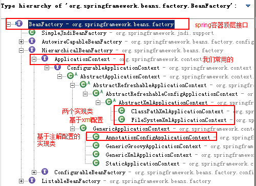
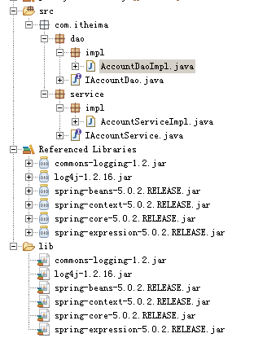

# 什么是Spring？

1. **Spring是什么？**
   - Spring是分层的Java SE/EE应用full-stack轻量级开源框架，以IoC（Inverse Of Control，反转控制）和AOP（Aspect Oriented Programming，面向切面编程）为内核，提供了表现层Spring MVC和持久层Spring JDBC以及业务层事务管理等众多的企业级应用技术，还能整合开源世界众多著名的第三方框架和类库，逐渐成为使用最多的Java EE企业应用开源框架。

2. **Spring的优势？**
1. 方便解耦，简化开发
      - 通过Spring 提供的IoC容器，可以将对象间的依赖关系交由Spring进行控制，避免硬编码所造成的过度程序耦合。用户不必再为单例模式类、属性文件解析等这些底层的需求编写代码，可以更专注与上层的应用。
   
2. AOP编程的支持
      - 通过Spring的AOP功能，方便进行面向切面的编程，许多不容易用传统OOP实现的功能可以通过AOP轻松应付。
   
3. 声明式事务的支持
      - 可以将我们从单调烦闷的事务管理代码中解脱出来，通过声明式方式灵活地进行事务的管理，提高开发效率和质量。
   
4. 方便程序的测试
      - 可以用非容器依赖的编程方式进行几乎所有的测试工作，测试不再是昂贵的操作，而是随手可做的事情。
   
5. 方便集成各种优秀框架
      - Spring可以降低各种框架的使用难度，提供了对各种优秀框架（Struts、Hibernate、Hessian、Quartz等）的直接支持。
   
6. 降低JavaEE API的使用难度
      - Spring对JavaEE API（如JDBC、JavaMail、远程调用等）进行了薄薄的封装，使这些API的使用难度大为降低。
   
7. Java源码是经典学习范例
      - Spring的源代码设计精妙、结构清晰、匠心独运，处处体现着大师对Java设计模式的灵活运用，以及对Java技术的高深造诣。它的源代码无疑是Java技术的最佳实践范例。

# Spring的体系结构


# IoC的概念和作用

1. **什么是Ioc？**
   - 控制反转（Inversion of Control，缩写为IoC），是面向对象编程中的一种设计原则，可以**用来减低计算机代码之间的耦合度**。其中最常见的方式叫做依赖注入（Dependency Injection，简称DI），还有一种方式叫“依赖查找”（Dependency Lookup）。通过控制反转，对象在被创建的时候，由一个调控系统内所有对象的外界实体将其所依赖的对象的引用传递给它。也可以说，依赖被注入到对象中。

2. **什么是程序的耦合？**
   - 传统的编程上，我们会在业务层使用new的方式来创建一个持久层的实现类的对象。业务层调用持久层，并且此时业务层在依赖持久层的接口和实现类。如果此时没有持久层实现类，那么编译将不能通过。
   - 这种编译器的依赖关系，应该在我们的开发过程中杜绝。我们需要优化代码以解决。
   - 再入早期JDBC进行注册驱动操作时，我们为什么不使用DriverManager中的register方法，传入一个驱动对象来注册驱动，而是采用Class.forName的方式？
   - 原因就在于我们的类依赖了数据库的具体驱动类（MySql），如果这个时候更换了其他数据库的品牌（如Oracle），则需要修改源码才能达到重新驱动数据库的目的。这显然不是我们想要的。

3. **解决程序耦合的思路与工厂模式的解耦**
- 解决程序耦合的思路
     - 借用JDBC使用反射技术来注册驱动：Class.forName("com.mysql.cj.jdbc.Driver");
     - 我们的类不再依赖具体的驱动类，此时就算删除mysql的驱动jar包，程序依旧可以编译（但不能运行）；
     - 但仍旧不完美，因为数据库驱动的全限定类名在类中被写死了，一旦需要更改，仍然需要修改源码。解决这个问题的方法，是使用配置文件。
   
- 工厂模式的解耦
     - 在实际开发中，我们可以把三层对象都使用配置文件配置起来。当启动服务器应用加载的时候，让一个类中的方法，通过读取配置文件的方式，把这些对象都创建出来并存起来。那么在接下来需要使用到它们的时候，直接取用即可。
     - 那么，这个读取配置文件、创建及获取三层对象的类，就是所谓的工厂。

# IoC控制反转

1. **关于IoC的作用？**
   - **削减计算机程序的耦合（即解除我们代码中的依赖关系）**
   - [个人观点]当我们需要修改程序行为的时候，不需要修改源码，只需要通过修改配置文件的方式，就可以达到修改程序行为的目的，而使用IoC就可以达到这种效果。
   - [个人观点]并且程序中除去必要的官方依赖之外 ，不会再因为自编写的类而出现编译期的错误，即程序是保证可以通过编译器检查的，但不一定可以运行。

2. **三层对象存放在哪里？**
   - 存放对象需要用到集合，可供选择的集合有Map和List。因为我们的寻找对象时有查找的需求，所有选择使用Map。
   - 在应用加载时，会创建一个Map集合，用于存放三层对象。这个Map就是我们所说的容器。通过key可以找到对应的对象（value）。

3. **什么是工厂？**
- **工厂就是负责从容器中获取指定对象的类。**
  
- 这时候我们获取对象的方式发生了改变：
  
  - 原来：我们在获取对象时，都是采用new的方式。是主动的。
   - 现在：我们获取对象时，问工厂要，有工厂为我们查找或创建对象。是被动的。

# IoC使用细节

## IoC中的工厂类

1. **Spring中工厂类的结构**



2. **关于BeanFactory和ApplicationContext的区别**
1. BeanFactory才是Spring容器中的顶层接口，ApplicationContext是BeanFactory的子接口；
   
2. BeanFactory和ApplicationContext的主要区别：创建对象的时间点不一样。
      - BeanFactory：什么时候使用，就什么时候创建对象。
      - ApplicationContext：只要读取配置文件，默认情况下就会创建对象。
   
3. **常用的三个ApplicationContext接口的实现类**
   1. **ClassPathXmlApplicationContext：从类的根路径下加载配置文件。（常用）**
   2. FileSystemXmlApplicationContext：从磁盘路径上加载配置文件，配置文件可以在磁盘的任意位置。
   3. AnnotationConfigApplicationContext：读取注解，当我们使用注解配置容器对象时，需要使用此类来创建spring容器。

## IoC中bean标签与管理对象

1. **bean标签的作用**

   - 用于配置对象，让Spring来创建其中配置好的对象。
   - 默认情况下，它调用的是类中的无参构造函数；在没有无参构造函数的情况下，需要进行额外的参数配置。

2. **bean标签的属性**

   - **id：对象在容器中的唯一标识，用于获取对象；**
   - **class：指定类的全限定类名。提供给Spring用于反射创建对象，默认情况下回调用对象的无参构造；**
   - scope：指定对象的作用范围。
     1. singleton：scope属性的默认值，指创建的当前对象为单例的；
     2. prototype：指创建的当前对象为多例的；
     3. request：WEB项目中，Spring创建一个Bean对象，并将该对象存入到request域中；
     4. session：WEB项目中，Spring创建一个Bean对象，并将该对象存入到session域中；
     5. global session：WEB项目中，应用在Portlet环境，如果没有Portlet环境，那么global session相当于session。

   - init-method：指定类中初始化方法的名称；
   - destroy-method：指定类中销毁方法的名称；

3. **bean标签的作用范围和生命周期**

   - **单例对象：scope="singleton"**
     - 一个应用只有一个对象的实例，它的作用范围就是整个引用。
     - 生命周期：
       1. 对象出生：当应用加载，创建容器时，对象就被创建了；
       2. 对象活着：只要容器存在，对象将一直存在；
       3. 对象死亡：当应用卸载，销毁容器时，对象就被销毁了。
   - **多例对象：scope="prototype"**
     - 每次访问对象时，都会重新创建对象的实例。
     - 生命周期：
       1. 对象出生：当使用对象时，新的对象实例被创建，对象出生；
       2. 对象活着：只要对象在使用中，就一直存在；
       3. 对象死亡：当对象长时间不用时，会被Java的垃圾回收期回收，对象死亡。

# IoC的基础配置与依赖注入

- **注意事项：**
  
  - Spring5版本是用jdk8编写的，所以要求我们的jdk版本是8以上；
- 同时tomcat的版本要求8.5及以上。
  
- **准备事项：**

  - 非Maven项目导入必备的jar包到工程中的lib中：

  

  - Maven项目则需要添加以下坐标：

```xml
<dependency>
    <groupId>org.springframework</groupId>
    <artifactId>spring-context</artifactId>
    <version>5.2.6.RELEASE</version>
</dependency>
```

- **xml配置文件路径：**
  - 非Maven项目在/src目录下创建任意名字的.xml文件即可；
  - Maven项目则在对应工程下的Resources目录下创建任意名字的.xml文件即可；

- **xml配置文件约束：**

```xml
<?xml version="1.0" encoding="UTF-8"?>
<beans xmlns="http://www.springframework.org/schema/beans"
    xmlns:xsi="http://www.w3.org/2001/XMLSchema-instance"
    xsi:schemaLocation="http://www.springframework.org/schema/beans
        https://www.springframework.org/schema/beans/spring-beans.xsd">

    <bean id="..." class="...">  
        <!-- collaborators and configuration for this bean go here -->
    </bean>

    <bean id="..." class="...">
        <!-- collaborators and configuration for this bean go here -->
    </bean>

    <!-- more bean definitions go here -->

</beans>
```

- 注：可以通过访问https://docs.spring.io/spring-framework/docs/current/spring-framework-reference/core.html找到IoC配置文件的约束。

## IoC基于Xml文件的依赖注入

1. **基于构造函数的依赖注入（Constructor-based dependency injection）**

   - Java代码

   ```java
   package cn.dylanphang.client;
   
   public class ClientTest {
       private String str;
       private int num;
       private AccountService accountService;
       
       public ClientTest(String str, int numAccountService accountService) {
   		this.str = str;
           this.num = num;
           this.accountService = accountService;
       }
   }
   ```

   - Xml配置

   ```xml
   <?xml version="1.0" encoding="UTF-8"?>
   <beans xmlns="http://www.springframework.org/schema/beans"
       xmlns:xsi="http://www.w3.org/2001/XMLSchema-instance"
       xsi:schemaLocation="http://www.springframework.org/schema/beans
           https://www.springframework.org/schema/beans/spring-beans.xsd">
   
       <bean id="clientTest" class="cn.dylanphang.client.ClientTest">
           <constructor-arg name="accountService" ref="accountService"></constructor-arg>
           <constructor-arg name="str" value="dylan"></constructor-arg>
           <constructor-ary name="num" value="21"></constructor-ary>
       </bean>
       
       <bean id="accountService" class="cn.dylanphang.service.AccountServiceImpl"></bean>
   </beans>
   ```

2. **基于Setter的依赖注入（Setter-based dependency injection）**

   - Java代码

   ```java
   package cn.dylanphang.client;
   
   public class ClientTest {
   	private String str;
       private int num;
       private AccountService accountService;
       
       public void setStr(String str) {
           this.str = str;
       }
       
       public void setNum(int num) {
           this.num = num;
       }
       
       public void setAccountService(AccountService accountService) {
           this.accountService = accountService;
       }
   }
   ```

   - Xml配置

   ```xml
   <?xml version="1.0" encoding="UTF-8"?>
   <beans xmlns="http://www.springframework.org/schema/beans"
       xmlns:xsi="http://www.w3.org/2001/XMLSchema-instance"
       xsi:schemaLocation="http://www.springframework.org/schema/beans
           https://www.springframework.org/schema/beans/spring-beans.xsd">
   
       <bean id="clientTest" class="cn.dylanphang.client.ClientTest">
           <property name="accountService" ref="accountService"></property>
           <property name="str" value="dylan"></property>
           <property name="num" value="21"></property>
       </bean>
       
       <bean id="accountService" class="cn.dylanphang.service.AccountServiceImpl"></bean>
   </beans>
   ```

   - Xml配置（使用p名称空间，本质仍然是调用类中的set方法）

   ```xml
   <?xml version="1.0" encoding="UTF-8"?>
   <beans xmlns="http://www.springframework.org/schema/beans"
       xmlns:p="http://www.springframework.org/schema/p"
       xmlns:xsi="http://www.w3.org/2001/XMLSchema-instance"
       xsi:schemaLocation="http://www.springframework.org/schema/beans
           https://www.springframework.org/schema/beans/spring-beans.xsd">
   
       <bean id="clientTest" class="cn.dylanphang.client.ClientTest" p:name="dylan" p:num="21" p:accountService-ref="accountService">
       </bean>
       
       <bean id="accountService" class="cn.dylanphang.service.AccountServiceImpl"></bean>
   </beans>
   ```


- **关于\<bean>标签内\<constructor-arg>与\<property>中的属性解析：**
- **使用构造函数注入的方式，需要在\<bean>标签内提供一个\<constructor-arg>标签：**
    - index：指定参数在构造函数参数列表中的索引位置**（了解）**；
    - type：指定参数在构造函数参数列表中的数据类型**（了解）**；
    - name：指定参数在构造函数参数列表中的名称**（掌握）**；
    - value：它能给基本数据类型和String类型进行赋值（**掌握）**；
    - ref：对于非基本数据类型及String类型之外的所有其他Bean类型，使用ref进行引用，引用的Bean类型必须是在.xml配置文件中配置过的Bean**（掌握）**；
  
- **使用Setter注入的方式，需要在\<bean>标签内提供一个\<property>标签：**
    - name：指的是目标类中Setter方法里“set”方法后面的部分；
    - value：它能给基本数据类型和String类型进行赋值（**掌握）**；
    - ref：对于非基本数据类型及String类型之外的所有其他Bean类型，使用ref进行引用，引用的Bean类型必须是在.xml配置文件中配置过的Bean**（掌握）**；

## IoC基于注解的依赖注入

1. **常用注解**

   1. **@Component（@Controller、@Service、@Repository）**

   - 用于创建对象的，相当于Xml配置：\<bean id="" class="">

     - @Component：
       - 作用：把资源让Spring来管理，相当于在Xml中配置了一个bean标签
       - 属性：value：指定bean的id。如果不指定value属性，默认bean的id是当前类的类名，首字母小写。

     - @Controller、@Service、@Repository：
       - 三个注解都是针对@Component的衍生注解，他们的作用及属性是一模一样的。
       - @Controller：一般用于表现层的注解；
       - @Service：一般用于业务层的注解；
       - @Repository：一般用于持久层的注解。

   2. **@Autowired、@Qualifier、@Value**

   - 用于注入数据的，相当于Xml配置：\<property name="" ref="">或\<property name="" value="">

     - @Autowired
       - 作用：自动按照类型注入。当使用注解注入属性时，构造函数或Setter可以省略，直接将该注解放在目标字段上即可。并且它只能注入其他bean类型。当有多个类型匹配时，会自动使用要注入的对象的变量名称作为bean的id，并在Spring容器中查找，找到了将自动注入，否则报错。
     - @Qualifier
       - 作用：在自动按照类型注入（@Autowired）的基础上，再按照bean的id注入。它在给字段注入时不能独立使用，必须要和@Autowired一起使用；但是给方法参数注入时，可以独立使用。
       - 属性：value：指定bean的id。

     - @Resource
       - 作用：直接按照bean的id注入。它也只能注入其他bean类型。
       - 属性：name：指定bean的id。
     - @Value
       - 作用：注入基本数据类型和String类型数据。
       - 属性：value：用于指定值。

   3. **@Scope**

   - 用于改变作用范围的，相当于Xml配置：\<bean id="" class="" scope="">
     - @Scope
       - 作用：指定bean的作用范围。
       - 属性：value：指定范围的值。
         - 取值：singleton、prototype、request、session、globalsession。

   4. **@PostConstruct、@PreDestroy**

   - 和生命周期相关的，相当于Xml配置：\<bean id="" class="" init-method="" destroy-method="">
     - @PostConstruct
       - 作用：用于指定初始化方法。
     - @PreDestroy
       - 作用：用于指定销毁方法。

2. **其他注解**
   1. **@Configuration**
      - 作用：用于指定当前类是一个Spring配置类，当创建容器时会从该类上加载注解。获取容器时需要使用AnnotationConfigApplicationContext(拥有@Configuration注解的类.class)。
      - 属性：value：用于指定配置类的字节码。
   2. **@ComponentScan**
      - 作用：用于指定Spring在初始化容器时要扫描的包。作用和在Spring的Xml配置文件中的：<context:component-scan base-package="cn.dylanphang"/>是一样的。
      - 属性：basePackages：用于指定要扫描的包。和该注解中的value属性作用一致。
      - 例：@ComponentScan("cn.dylanphang")
   3. **@Bean**
      - 作用：该注解只能写在方法上，表明使用此方法创建一个对象，并且放入Spring容器。
      - 属性：name：给当前@Bean注解方法创建的对象指定一个名称（及bean的id）。
   4. **@PropertySource**
      - 作用：用于加载.properties文件中的配置。例如我们配置数据源时，可以把连接数据库的信息记录在properties配置文件中，可以是此注解指定properties配置文件的位置。
      - 属性：value：用于指定一个或多个properties文件位置。如果是在类路径下，需要写上"classpath:"
      - 例：如果已经在类上使用了@PropertySource注解，可以配合@Value将properties配置文件中的数据注入到字段中，格式：@Value("${key}")，key从properties文件中来。
   5. **@Import**
      - 作用：用于导入其他配置类，在引入其他配置类时，可以不用再写@Configuration注解。当然，写上也是没有问题的。
      - 属性：value[]：用于指定其他配置类的字节码。
      - 例：@Import({JdbcConfig.class, DataSource.class})

3. **项目改造：部分采用Xml配置**

   - Xml配置（BeanForAnnotation.xml）

   ```xml
   <?xml version="1.0" encoding="UTF-8"?>
   <beans xmlns="http://www.springframework.org/schema/beans"
          xmlns:context="http://www.springframework.org/schema/context"
          xmlns:xsi="http://www.w3.org/2001/XMLSchema-instance"
          xsi:schemaLocation="http://www.springframework.org/schema/beans
           https://www.springframework.org/schema/beans/spring-beans.xsd
           http://www.springframework.org/schema/context
           http://www.springframework.org/schema/context/spring-context.xsd">
   	
       <!-- xmlns:context="http://www.springframework.org/schema/context" -->
       <!-- 告诉Spring创建容器时要扫描的包 -->
       <context:component-scan base-package="annotation.dylanphang"></context:component-scan>
       
       <!-- 配置如何创建dataSource对象 -->
       <bean id="dataSource" class="com.alibaba.druid.pool.DruidDataSourceFactory" factory-method="createDataSource">
           <constructor-arg>
               <props>
                   <prop key="driverClassName">com.mysql.cj.jdbc.Driver</prop>
                   <prop key="url">jdbc:mysql://localhost:3306/spring?serverTimezone=UTC</prop>
                   <prop key="username">root</prop>
                   <prop key="password">root</prop>
               </props>
           </constructor-arg>
       </bean>
   
       <!-- 配置如何创建JdbcTemplate对象 -->
       <bean id="JdbcTemplate" class="org.springframework.jdbc.core.JdbcTemplate">
           <constructor-arg name="dataSource" ref="dataSource"></constructor-arg>
       </bean>
   </beans>
   ```

   - 持久层Java代码

   ```java
   package annotation.dylanphang.dao;
   
   import annotation.dylanphang.pojo.User;
   
   import java.util.List;
   
   public interface UserDao {
   
       List<User> findAll();
   }
   ```

   ```java
   package annotation.dylanphang.dao.impl;
   
   import annotation.dylanphang.dao.UserDao;
   import annotation.dylanphang.pojo.User;
   import org.springframework.beans.factory.annotation.Autowired;
   import org.springframework.jdbc.core.BeanPropertyRowMapper;
   import org.springframework.jdbc.core.JdbcTemplate;
   import org.springframework.stereotype.Component;
   import org.springframework.stereotype.Repository;
   
   import java.util.List;
   
   @Repository("userDao")
   //@Component("userDao")
   public class UserDaoImpl implements UserDao {
       @Autowired
       private JdbcTemplate JdbcTemplate;
   
       /*
       @Autowired //也可以添加在这里，为构造函数注入参数
       public UserDaoImpl(JdbcTemplate JdbcTemplate) {
           this.JdbcTemplate = JdbcTemplate;
       }
       */
   
       public List<User> findAll() {
           List<User> users = JdbcTemplate.query("SELECT * FROM user", new BeanPropertyRowMapper<User>(User.class));
   
           return users;
       }
   }
   ```

   - 业务层Java代码

   ```java
   package annotation.dylanphang.service;
   
   import annotation.dylanphang.pojo.User;
   
   import java.util.List;
   
   public interface UserService {
   
       List<User> findAllUser();
   }
   ```

   ```java
   package annotation.dylanphang.service.impl;
   
   import annotation.dylanphang.dao.UserDao;
   import annotation.dylanphang.pojo.User;
   import annotation.dylanphang.service.UserService;
   import org.springframework.beans.factory.annotation.Autowired;
   import org.springframework.stereotype.Component;
   import org.springframework.stereotype.Service;
   
   import java.util.List;
   
   @Service("userService")
   //@Component("userService")
   public class UserServiceImpl implements UserService {
       @Autowired
       private UserDao userDao;
   
   
       /*public UserServiceImpl(UserDao userDao) {
           this.userDao = userDao;
       }*/
   
       public List<User> findAllUser() {
           return userDao.findAll();
       }
   }
   ```

   - 表现层Java代码（模拟表现层）

   ```java
   package annotation.dylanphang.client;
   
   import annotation.dylanphang.pojo.User;
   import annotation.dylanphang.service.impl.UserServiceImpl;
   import org.junit.Test;
   import org.springframework.context.support.ClassPathXmlApplicationContext;
   import org.springframework.stereotype.Controller;
   
   import java.util.List;
   
   @Controller
   public class UserServiceTest {
       @Test
       public void test() {
           // 1.加载配置文件
           ClassPathXmlApplicationContext applicationContext = new ClassPathXmlApplicationContext("BeanForAnnotation.xml");
           // 2.获取对象
           UserServiceImpl userService = applicationContext.getBean("userService", UserServiceImpl.class);
   		
           // 3.获取结果集
           List<User> users = userService.findAllUser();
   
           System.out.println(users);
           applicationContext.close();
       }
   }
   ```

4. **项目改造：完全采用注解配置**

   - 数据库.properties配置（JDBC.properties）

   ```properties
   jdbc.driver=com.mysql.cj.jdbc.Driver
   jdbc.url=jdbc:mysql://localhost:3306/spring?serverTimezone=UTC
   jdbc.username=root
   jdbc.password=root
   ```

   - 配置类

   ```java
   package full.dylanphang.config;
   
   import com.alibaba.druid.pool.DruidDataSourceFactory;
   import org.springframework.beans.factory.annotation.Value;
   import org.springframework.context.annotation.Bean;
   import org.springframework.context.annotation.Configuration;
   import org.springframework.context.annotation.PropertySource;
   import org.springframework.jdbc.core.JdbcTemplate;
   
   import javax.sql.DataSource;
   import java.util.Properties;
   
   @Configuration
   @PropertySource("classpath:JDBC.properties")
   public class JdbcConfig {
       @Value("${jdbc.driver}")
       private String driver;
       @Value("${jdbc.url}")
       private String url;
       @Value("${jdbc.username}")
       private String username;
       @Value("${jdbc.password}")
       private String password;
       
       @Autowired
       private DataSource dataSource;
   
       @Bean("dataSource")
       public DataSource createDataSource() {
           try {
               Properties properties = new Properties();
               properties.put("driverClassName", this.driver);
               properties.put("url", this.url);
               properties.put("username", this.username);
               properties.put("password", this.password);
   
               this.dataSource = DruidDataSourceFactory.createDataSource(properties);
   
               return dataSource;
           } catch (Exception e) {
               e.printStackTrace();
           }
           return null;
       }
   
       @Bean("JdbcTemplate")
       public JdbcTemplate createJdbcTemplate() {
           return new JdbcTemplate(this.dataSource);
       }
   }
   ```

   ```java
   package full.dylanphang.config;
   
   import org.springframework.context.annotation.ComponentScan;
   import org.springframework.context.annotation.Configuration;
   import org.springframework.context.annotation.Import;
   
   @Configuration
   @ComponentScan("full.dylanphang")
   @Import({JdbcConfig.class})
   public class SpringConfiguration {
   }
   ```

   - 持久层Java代码

   ```java
   package full.dylanphang.dao;
   
   import full.dylanphang.pojo.User;
   
   import java.util.List;
   
   public interface UserDao {
   
       List<User> findAll();
   }
   ```

   ```java
   package full.dylanphang.dao.impl;
   
   import full.dylanphang.dao.UserDao;
   import full.dylanphang.pojo.User;
   import org.springframework.beans.factory.annotation.Autowired;
   import org.springframework.jdbc.core.BeanPropertyRowMapper;
   import org.springframework.jdbc.core.JdbcTemplate;
   import org.springframework.stereotype.Component;
   import org.springframework.stereotype.Repository;
   import org.springframework.stereotype.Service;
   
   import java.util.List;
   
   @Repository("userDao")
   public class UserDaoImpl implements UserDao {
       @Autowired
       private JdbcTemplate JdbcTemplate;
   
       public List<User> findAll() {
           List<User> users = this.JdbcTemplate.query("SELECT * FROM user", new BeanPropertyRowMapper<>(User.class));
   
           return users;
       }
   }
   ```

   - 业务层Java代码

   ```java
   package full.dylanphang.service;
   
   import full.dylanphang.pojo.User;
   
   import java.util.List;
   
   public interface UserService {
   
       List<User> findAllUser();
   }
   ```

   ```java
   package full.dylanphang.service.impl;
   
   import full.dylanphang.dao.UserDao;
   import full.dylanphang.pojo.User;
   import full.dylanphang.service.UserService;
   import org.springframework.beans.factory.annotation.Autowired;
   import org.springframework.stereotype.Component;
   import org.springframework.stereotype.Service;
   
   import java.util.List;
   
   @Service("userService")
   public class UserServiceImpl implements UserService {
       @Autowired
       private UserDao userDao;
   
       public List<User> findAllUser() {
           return this.userDao.findAll();
       }
   }
   ```

   - 表现层Java代码（模拟表现层）

   ```java
   package full.dylanphang.client;
   
   import full.dylanphang.config.SpringConfiguration;
   import full.dylanphang.pojo.User;
   import full.dylanphang.service.impl.UserServiceImpl;
   import org.junit.Test;
   import org.springframework.context.ApplicationContext;
   import org.springframework.context.annotation.AnnotationConfigApplicationContext;
   import org.springframework.stereotype.Controller;
   
   import java.util.List;
   
   @Controller
   public class UserServiceTest {
       @Test
       public void test() {
           // 1.使用AnnotationConfigApplicationContext传入配置类字节码文件获取对象
           ApplicationContext applicationContext = new AnnotationConfigApplicationContext(SpringConfiguration.class);
           // 2.获取对象
           UserServiceImpl userService = applicationContext.getBean("userService", UserServiceImpl.class);
   		
           // 3.获取结果集
           List<User> users = userService.findAllUser();
   
           System.out.println(users);
           ((AnnotationConfigApplicationContext) applicationContext).close();
       }
   }
   ```

## Dependency Injection更多细节

1. **如何通过静态工厂类获取目标对象？**

   - Java代码

   ```java
   package cn.dylanphang.factory;
   
   public class ConnectFactory {
       private DatabaseSource databaseSource;
       
       public static connection getConnection(DatabaseSourc databaseSource) {
           ...
       	return connection;
       }
   }
   ```

   - Xml配置

   ```xml
   <?xml version="1.0" encoding="UTF-8"?>
   <beans xmlns="http://www.springframework.org/schema/beans"
       xmlns:xsi="http://www.w3.org/2001/XMLSchema-instance"
       xsi:schemaLocation="http://www.springframework.org/schema/beans
           https://www.springframework.org/schema/beans/spring-beans.xsd">
   
       <bean id="connection" class="cn.dylanphang.factory.ConnectFactory" factory-method="getConnection">
       	<construction-arg name="databaseSource" ref="databaseSource"></construction-arg>
       </bean>
       
       <bean id="databaseSource" class="cn.dylanphang.datasource.DatabaseSource"></bean>
   </beans>
   ```

   

2. **如何通过工厂类中的方法获取目标对象？**

   - Java代码

   ```java
   package cn.dylanphang.factory;
   
   public class ConnectFactory {
       private DatabaseSource databaseSource;
       
       private void setDatabaseSource(DatabaseSource databaseSource) {
           this.databaseSource = databaseSource;
       }
       
       public connection getConnection() {
           ...
       	return connection;
       }
   }
   ```

   - Xml配置

   ```xml
   <?xml version="1.0" encoding="UTF-8"?>
   <beans xmlns="http://www.springframework.org/schema/beans"
       xmlns:xsi="http://www.w3.org/2001/XMLSchema-instance"
       xsi:schemaLocation="http://www.springframework.org/schema/beans
           https://www.springframework.org/schema/beans/spring-beans.xsd">
   
       <bean id="connectFactory" class="cn.dylanphang.factory.ConnectFactory">
       	<property name="databaseSource" ref="databaseSource"></property>
       </bean>
       
       <bean id="conection" factory-bean="connectFactory" factory-method="getConnection"></bean>
       
       <bean id="databaseSource" class="cn.dylanphang.datasource.DatabaseSource"></bean>
   </beans>
   ```

   

3. **集合如何作为进行依赖注入的参数？**

   - Java代码

   ```java
   package cn.dylanphang.test;
   
   public class DataContainerTest {
       private String[] myArray;
       private List<String> myList;
   	private Set<String> mySet;
       
       private Map<String, Object> myMap;
       private Properties myProp;
       
       public void setMyArray(String[] myArray) {
           this.myArray = myArray;
       }
       
       public void setMyList(List<String> myList) {
           this.myList = myList;
       }
       
       public void setMySet(Set<String> mySet) {
           this.mySet = mySet;
       }
       
       public void setMyMap(Map<String, Object> myMap) {
           this.myMap = myMap;
       }
       
       public void setMyProp(Properties myProp) {
           this.myProp = myProp;
       }
   }
   ```

   - Xml配置

   ```xml
   <?xml version="1.0" encoding="UTF-8"?>
   <beans xmlns="http://www.springframework.org/schema/beans"
       xmlns:xsi="http://www.w3.org/2001/XMLSchema-instance"
       xsi:schemaLocation="http://www.springframework.org/schema/beans
           https://www.springframework.org/schema/beans/spring-beans.xsd">
   
       <bean id="dataContainerTest" class="cn.dylanphang.test.DataContainerTest">
       	<!-- 数组注入数据 -->
           <property name="myArray">
               <array>
               	<value>AAA</value>
                   <value>BBB</value>
                   <value>CCC</value>
               </array>
           </property> 
           <!-- list注入数据 -->
           <property name="myList">
           	<list>
               	<value>AAA</value>
                   <value>BBB</value>
                   <value>CCC</value>
               </list>
           </property>
           <!-- set注入数据 -->
           <property name="mySet">
           	<set>
               	<value>AAA</value>
                   <value>BBB</value>
                   <value>CCC</value>
               </set>
           </property>
           <!-- map注入数据 -->
           <property name="myMap">
           	<map>
               	<entry key="testA" value="aaa"></entry>
                   <entry key="testB">
                   	<value>bbb</value>
                   </entry>
               </map>
           </property>
           <!-- properties注入数据 -->
           <property name="myProp">
           	<props>
               	<prop key="testA">aaa</prop>
                   <prop key="testB">bbb</prop>
               </props>
           </property>
       </bean>
   </beans>
   ```

# Spring中整合的Junit

0. 整合Junit是为了使用注入Bean的方式为测试单元添加对象

1. 添加必要的jar包到lib目录或添加相应的Maven工程依赖坐标

```xml
<dependency>
    <groupId>org.springframework</groupId>
    <artifactId>spring-test</artifactId>
    <version>5.2.7.RELEASE</version>
    <scope>test</scope>
</dependency>
```

2. 使用@RunWith注解替换原有运行器

3. 使用@ContextConfiguration指定spring配置文件的位置
   - locations属性：用于指定配置文件的位置。如果是类路径下，需要用"classpath:"声明；
   - classes属性：用于指定注解的类。当不使用xml配置时，需要用此属性指定注解类的位置。

4. 使用@Autowired给测试类中的变量注入数据

```java
package annotation.dylanphang.client;

import annotation.dylanphang.pojo.User;
import annotation.dylanphang.service.impl.UserServiceImpl;
import org.junit.Test;
import org.junit.runner.RunWith;
import org.springframework.beans.factory.annotation.Autowired;
import org.springframework.stereotype.Controller;
import org.springframework.test.context.ContextConfiguration;
import org.springframework.test.context.junit4.SpringJUnit4ClassRunner;

import java.util.List;

@Controller
@RunWith(SpringJUnit4ClassRunner.class)
@ContextConfiguration(locations = {"classpath:BeanForAnnotation.xml"})
public class UserServiceTest {
    @Autowired
    UserServiceImpl userService;

    @Test // @Test仍然是必须要添加的注解！！！
    public void test() {
        // ClassPathXmlApplicationContext applicationContext = new ClassPathXmlApplicationContext("BeanForAnnotation.xml");
        // UserServiceImpl userService = applicationContext.getBean("userService", UserServiceImpl.class);

        List<User> users = userService.findAllUser();

        for (User user: users) {
            System.out.println(user);
        }

        //applicationContext.close();
    }
}
```

```java
package full.dylanphang.client;

import full.dylanphang.config.SpringConfiguration;
import full.dylanphang.pojo.User;
import full.dylanphang.service.impl.UserServiceImpl;
import org.junit.Test;
import org.junit.runner.RunWith;
import org.springframework.beans.factory.annotation.Autowired;
import org.springframework.stereotype.Controller;
import org.springframework.test.context.ContextConfiguration;
import org.springframework.test.context.junit4.SpringJUnit4ClassRunner;

import java.util.List;

@Controller
@RunWith(SpringJUnit4ClassRunner.class)
@ContextConfiguration(classes = {SpringConfiguration.class})
public class UserServiceTest {
    @Autowired
    private UserServiceImpl userService;

    @Test
    public void test() {
        // ApplicationContext applicationContext = new AnnotationConfigApplicationContext(SpringConfiguration.class);
        // UserServiceImpl userService = applicationContext.getBean("userService", UserServiceImpl.class);

        List<User> users = userService.findAllUser();

        for (User user: users) {
            System.out.println(user);
        }
        // ((AnnotationConfigApplicationContext) applicationContext).close();
    }
}
```
