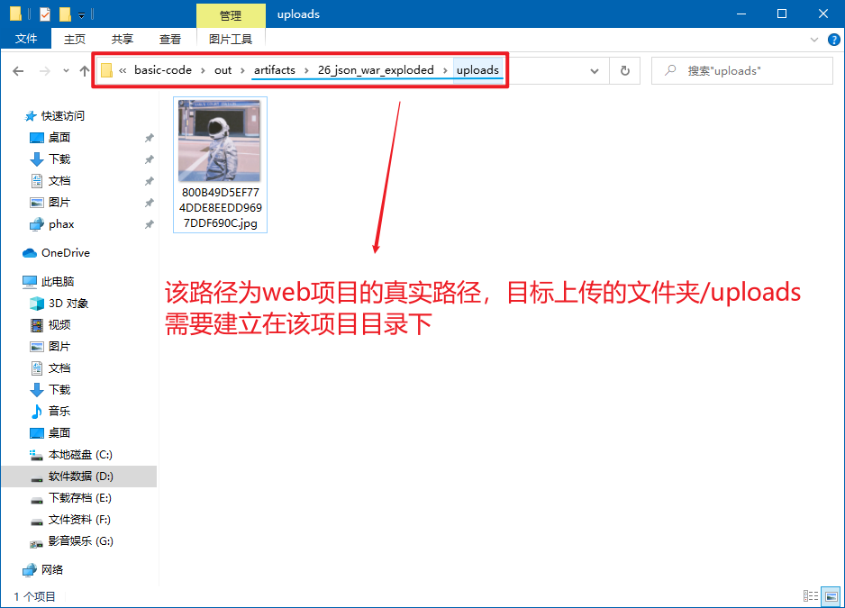
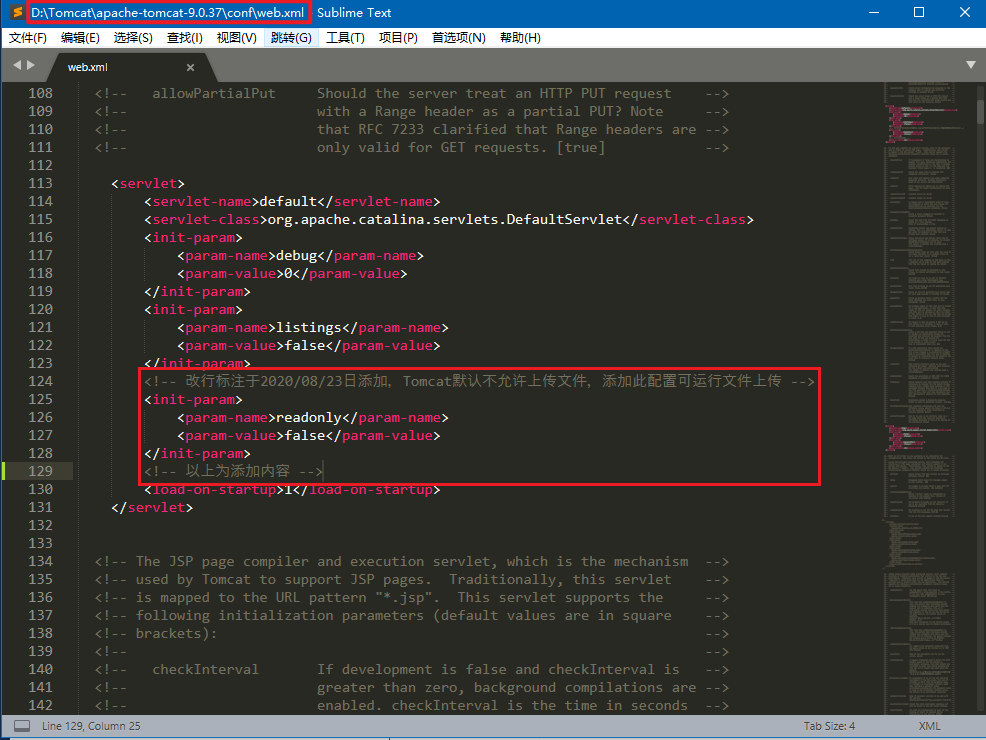
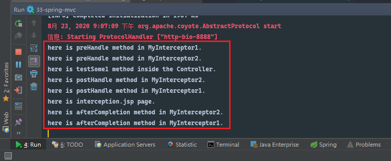
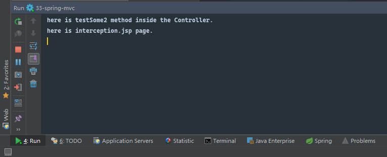

# 前言

> - 本篇关于Spring MVC的进阶理解。

# Spring MVC响应数据和结果视图

## 1. Controller的返回值分类

### a. 字符串

- `Controller`方法返回字符串，可以指定逻辑视图的名称，将根据视图解析器解析为物理视图地址，该视图将展示给用户；
- 此时需要在`springmvc.xml`中配置视图解析器，`Spring MVC`将根据视图解析器中的前缀和后缀，以及`Controller`方法返回的字符串，拼接获得目标网页的路径，并将该路径下的页面返回给用户。
- 当你使用`Ajax`进行请求的时候，`Ajax`将获得该`HTML`页面，你可以动态使用`jQurey`或`JavaScript`将该页面填充到当前页面中，或者直接在当前窗口或新窗口中打开页面。
- 如果是使用`HTML`链接等标签进行的请求，当前页面将自动跳转到`Controller`方法返回的页面上。
- 参考代码：

```xml
<?xml version="1.0" encoding="UTF-8"?>
<beans xmlns="http://www.springframework.org/schema/beans"
       xmlns:mvc="http://www.springframework.org/schema/mvc"
       xmlns:context="http://www.springframework.org/schema/context"
       xmlns:xsi="http://www.w3.org/2001/XMLSchema-instance"
       xsi:schemaLocation="
http://www.springframework.org/schema/beans
http://www.springframework.org/schema/beans/spring-beans.xsd
http://www.springframework.org/schema/mvc
http://www.springframework.org/schema/mvc/spring-mvc.xsd
http://www.springframework.org/schema/context
http://www.springframework.org/schema/context/spring-context.xsd">

    <!-- 配置spring创建容器时要扫描的包 -->
    <context:component-scan base-package="cn.dylanphang"/>

    <!-- 配置视图解析器 -->
    <bean id="viewResolver" class="org.springframework.web.servlet.view.InternalResourceViewResolver">
        <property name="prefix" value="/WEB-INF/pages/"/>
        <property name="suffix" value=".jsp"/>
    </bean>

    <!-- 配置spring开启注解mvc的支持 -->
    <mvc:annotation-driven/>
</beans>
```

- 此前已经了解过了对象`Model model`，你除了可以在使用注解`@SesssionAttributes`的时候，使用该形参对象存储可在`Session`域共享的数据之外，你还可以单独使用它，此时它只作为`Request`域的数据共享载体。
- 除了`Model`以外，还有几个数据结构可以作为`Request`域的数据共享载体：
  - `ModelMap`：同`Model`一样，它们的真实类型都是`BindingAwareModelMap`；
  - `Map`：也可以作为一次请求中数据共享的载体；
  - `ModelAndView`：同时具备跳转功能的对象，其底层也是使用`ModelMap`作为数据载体，因此也可以作为`Request`域数据共享的载体。
- 以下为部分实验代码，目标页面中已经可以通过`user`键获取到对应的值，通过值中的字段可以获取到最终数据。

```java
package cn.dylanphang.controller;

import cn.dylanphang.domain.User;
import org.springframework.stereotype.Controller;
import org.springframework.ui.Model;
import org.springframework.web.bind.annotation.RequestMapping;

import java.util.Date;

@Controller
@RequestMapping("/returnType")
public class ReturnTypeController {

    @RequestMapping("/testStringType")
    public String testStringType(Model model, User user) {
        // 获取用户名
        String username = user.getUsername();

        // 模拟查询数据库，并返回资料
        User findUser = new User();
        findUser.setUsername(username);
        findUser.setPassword("123456");
        findUser.setBirthday(new Date());

        // 存储数据
        model.addAttribute("user", findUser);
        
        return "show";
    }
}
```

```jsp
<%@ page contentType="text/html;charset=UTF-8" language="java" isELIgnored="false" %>
<html>
<head>
    <title>Show</title>
</head>
<body>
<table>
    <tr>
        <th>姓名</th>
        <th>密码</th>
        <th>生日</th>
    </tr>
    <tr>
        <%-- 需要开启对EL表达式的支持，isELIgnored="false" --%>
        <th>${user.username}</th>
        <th>${user.password}</th>
        <th>${user.birthday}</th>
    </tr>
</table>
</body>
</html>
```

### b. void

- 如果`Controller`控制器的方法返回值编写为`void`，执行程序将可能报`404`异常，即默认查找的`JSP`页面没有找到：
  - 此时因为没有`String`返回值，视图解析器无法进行`url`的拼接；
- 由于没有`url`的存在，程序将会跳转到`@RequestMapping(value)`中指向的`value`页面上；
  - 此时当然是没有所谓的`/value/index.jsp`或`/value/index.html`的存在，因此会报`404`服务器异常。
- 如果你指定的路径下拥有`index.jsp`或`index.html`用于错误跳转，可以继续返回`void`；
- 或者在方法参数上使用`HttpServletRequest`或`HttpServletResponse`对请求进行请求转发`forward`或重定向`redirect`，以此跳转到指定的页面上，避免出现`404`服务器异常；
- 如果即不进行请求转发`forward`，也不进行重定向`redirect`，可以选择使用`HttpServletResponse`对该请求返回`String`数据，此时不会触发视图解析器，服务器可以忽略该数据，从而避免出现`404`服务器异常。

#### ⅰ. forward请求转发

- 注意：使用请求转发不能使用`Model`存储数据，`JSP`页面无法读取到存储于`Model`中的数据，推荐使用`Request`存储数据：

```java
package cn.dylanphang.controller;

import cn.dylanphang.domain.User;
import org.springframework.stereotype.Controller;
import org.springframework.ui.Model;
import org.springframework.web.bind.annotation.RequestMapping;

import javax.servlet.ServletException;
import javax.servlet.http.HttpServletRequest;
import javax.servlet.http.HttpServletResponse;
import java.io.IOException;
import java.util.Date;

@Controller
@RequestMapping("/returnType")
public class ReturnTypeController {

    @RequestMapping("/testVoidType")
    public void testVoidType(
            User user,
            HttpServletRequest request,
            HttpServletResponse response) throws ServletException, IOException {
        // 获取用户名和密码
        String username = user.getUsername();
        String password = user.getPassword();

        // 模拟添加新用户，并返回该用户的注册时间
        User newUser = new User();
        newUser.setUsername(username);
        newUser.setPassword(password);
        newUser.setCreateDate(new Date());

        // 存储数据，不能使用Model对象
        request.setAttribute("user", newUser);

        // 请求转发
        request.getRequestDispatcher("/WEB-INF/pages/new.jsp").forward(request, response);
    }
}
```

```jsp
<%@ page contentType="text/html;charset=UTF-8" language="java" isELIgnored="false" %>
<html>
<head>
    <title>Title</title>
</head>
<body>
<table>
    <tr>
        <th>姓名</th>
        <th>密码</th>
        <th>注册日期</th>
    </tr>
    <tr>
        <%-- 数据存储在Request域中 --%>
        <th>${requestScope.user.username}</th>
        <th>${requestScope.user.password}</th>
        <th>${requestScope.user.createDate}</th>
    </tr>
</table>
</body>
</html>
```

#### ⅱ. redirect重定向

- 注意：
  1. `/WEB-INF`目录中的页面，可以通过请求转发将其中的页面返回到客户端机上，但不允许直接访问；
  2. 由于重定向是两次请求，因此无法重定向至`/WEB-INF`目录下的任何页面上；
  3. 和请求转发`forward`一样，此时无法使用`Model`进行数据的存储操作，推荐使用`Session`域，或直接向页面输出字符，此时需要设定`Response`字符集：
     - `response.setContentType("text/html;charset=utf-8");`

```java
package cn.dylanphang.controller;

import cn.dylanphang.domain.User;
import org.springframework.stereotype.Controller;
import org.springframework.ui.Model;
import org.springframework.web.bind.annotation.RequestMapping;

import javax.servlet.ServletException;
import javax.servlet.http.HttpServletRequest;
import javax.servlet.http.HttpServletResponse;
import javax.servlet.http.HttpSession;
import java.io.IOException;
import java.util.Date;

@Controller
@RequestMapping("/returnType")
public class ReturnTypeController {

    @RequestMapping("/testVoidType")
    public void testVoidType(
            User user,
            HttpServletRequest request,
            HttpServletResponse response) throws ServletException, IOException {
        // 获取用户名和密码
        String username = user.getUsername();
        String password = user.getPassword();

        // 模拟添加新用户，并返回该用户的注册时间
        User newUser = new User();
        newUser.setUsername(username);
        newUser.setPassword(password);
        newUser.setCreateDate(new Date());

        // 存储数据，不能使用Model对象
        HttpSession session = request.getSession();
        session.setAttribute("user", newUser);

        // 重定向
        response.sendRedirect(request.getContextPath() + "/new2.jsp");

        // 直接向页面输出数据，需要设定字符集，否则中文乱码
        // response.setContentType("text/html;charset=utf-8");
        // response.getWriter().println("你好，世界！");
    }
}
```

```jsp
<%@ page contentType="text/html;charset=UTF-8" language="java" isELIgnored="false" %>
<html>
<head>
    <title>Title</title>
</head>
<body>
<table>
    <tr>
        <th>姓名</th>
        <th>密码</th>
        <th>注册日期</th>
    </tr>
    <tr>
        <%-- 数据存储在Session域中 --%>
        <th>${sessionScope.user.username}</th>
        <th>${sessionScope.user.password}</th>
        <th>${sessionScope.user.createDate}</th>
    </tr>
</table>
</body>
</html>
```

### c. ModelAndView

- `ModelAndView`对象是`Spring MVC`提供的一个对象，可以用来调整具体的`JSP`视图；
- `ModelAndView`对象同时具有存储数据和跳转页面的功能。其底层还是使用`ModelMap`来进行数据的存储，也就是其数据的默认作用域为`Request`域。

```java
package cn.dylanphang.controller;

import cn.dylanphang.domain.User;
import org.springframework.stereotype.Controller;
import org.springframework.web.bind.annotation.RequestMapping;
import org.springframework.web.servlet.ModelAndView;

import java.util.ArrayList;

@Controller
@RequestMapping("/mv")
public class MvController {
    @RequestMapping("/testModelAndView")
    public ModelAndView testModelAndView(User user) {
        // 新建ModelAndView对象，并设置跳转页面为mv-show.jsp
        ModelAndView mv = new ModelAndView();
        mv.setViewName("mv-show");

        String address = user.getAddress();
        
        // 模拟从数据库查询地址为address的用户
        User user1 = new User();
        user1.setAddress(address);
        user1.setUsername("dylan");
        user1.setPassword("777777");

        User user2 = new User();
        user2.setAddress(address);
        user2.setUsername("mike");
        user2.setPassword("999999");

        // 封装User对象至List<User>
        ArrayList<User> users = new ArrayList<>();
        users.add(user1);
        users.add(user2);

        // 存储数据
        mv.addObject("users", users);

        // 返回对象
        return mv;
    }
}
```

```jsp
<%@ page contentType="text/html;charset=UTF-8" language="java" isELIgnored="false" %>
<%@ taglib prefix="c" uri="http://java.sun.com/jsp/jstl/core" %>
<html>
<head>
    <title>Mv Show</title>
</head>
<body>
<table>
    <tr>
        <th>姓名</th>
        <th>密码</th>
        <th>地址</th>
    </tr>
    <%-- 使用jstl需要引入依赖 --%>
    <c:forEach items="${users}" var="user">
        <tr>
            <th>${user.username}</th>
            <th>${user.password}</th>
            <th>${user.address}</th>
        </tr>
    </c:forEach>
</table>
</body>
</html>
```

## 2. Spring MVC提供的转发与重定向

- 除了在方法上提供`HttpServletRequest`和`HttpServletResponse`进行请求转发和重定向之外，`Spring MVC`为我们提供了一个以`Spring MVC`的方式进行请求转发和重定向的方法；
- `Controller`中的方法如果返回值类型为`String`，那么可以使用`Spring MVC`框架为我们提供的转发与重定向；

### a. forward请求转发

- 请求转发和普通的请求转发一样，既可以转发到`/WEB-INF`目录下的页面上，也可以将请求转发到其他`Controller`的方法中。
- 此时要求`Controller`方法返回值类型为`String`，数据返回格式为：`return "forward:url";`

```java
package cn.dylanphang.controller;

import org.springframework.stereotype.Controller;
import org.springframework.web.bind.annotation.RequestMapping;

import javax.servlet.http.HttpServletResponse;
import java.io.IOException;

@Controller
@RequestMapping("/forward")
public class ForwardController {

    @RequestMapping("/testForward1")
    public String testForward1() {
        System.out.println("Here is testForward method.");
        return "forward:/WEB-INF/pages/good.jsp";
    }

    @RequestMapping("/testForward2")
    public String testForward2() {
        System.out.println("Here is testForward method.");
        return "forward:/forward/catchForward";
    }

    @RequestMapping("/catchForward")
    public void catchForward(HttpServletResponse response) throws IOException {
        response.getWriter().println("<h1>CatchForward is successful.</h1>");
    }
}
```

### b. redirect重定向

- 使用`Spring MVC`中的重定向，不需要添加`request.getContextPath()`，即`Spring MVC`会自动获取虚拟目录；
- 再一次，重定向是两次请求，`/WEB-INF`中的页面是无法被重定向访问到的。
- 此时要求`Controller`方法的返回值类型为`String`，数据返回格式为：`return "redirect:url";`
- 注意，再声明一次，不需要添加虚拟目录。

```java
package cn.dylanphang.controller;

import org.springframework.stereotype.Controller;
import org.springframework.web.bind.annotation.RequestMapping;

import javax.servlet.http.HttpServletResponse;
import java.io.IOException;

@Controller
@RequestMapping("/redirect")
public class RedirectController {
    /**
     * 使用Spring MVC中的重定向，不需要添加request.getContextPath()
     *
     * @return 重定向至指定的页面
     */
    @RequestMapping("/testRedirect1")
    public String testRedirect1() {
        System.out.println("Here is testRedirect1 method.");
        return "redirect:/good2.jsp";
    }

    @RequestMapping("/testRedirect2")
    public String testRedirect2() {
        System.out.println("Here is testRedirect2 method.");
        return "redirect:/redirect/catchRedirect";
    }

    @RequestMapping("/catchRedirect")
    public void catchForward(HttpServletResponse response) throws IOException {
        response.getWriter().println("<h1>CatchRedirect is successful.</h1>");
    }
}
```

## 3. @ResponseBody返回Json数据

- 在方法的返回上使用`@ResponseBody`注解，可以让`Controller`返回`Json`数据；
- 作用范围：`@Target({ElementType.TYPE, ElementType.METHOD})`，该注解可以在类或方法上使用。
- 当一个方法被标记为`@ResponseBody`时，标志了该方法的返回值应该被直接回写到`HTTP`响应体中，而不应该被放置到`Model`中或被解释为一个视图名；
- 此时该方法需要输出其他的视图（`JSON/XML`），`Spring MVC`通过已定义的转化器做转换输出，默认输出为`JSON`。

### a. 引入依赖

- 如果是`Maven`项目，可以只需要引入`jackson-databind`一个依赖，`Maven`会自动将`jackson-core`、`jackson-annotations`等依赖关联进项目；
- 如果不是`Maven`项目，可以从`Maven`官网下载`jackson-databind`的`jar`包，页面上会提示需要的依赖，也就是`jackson-core`、`jackson-annotations`，可以在相关的页面中找打依赖的`jar`包，三个`jar`包需要一同加入项目的`/lib`目录下。

```xml
<!-- 通过右侧Maven项目面板，可以看到databind会自动关联core和annotations -->
<dependency>
    <groupId>com.fasterxml.jackson.core</groupId>
    <artifactId>jackson-databind</artifactId>
    <version>2.9.5</version>
    <!-- databind会自动引入annotations2.9.0依赖 -->
    <!-- 如果需要使用高版本的依赖，需要在依赖中将自动关联的低版本依赖排除 -->
    <exclusions>
        <exclusion>
            <groupId>com.fasterxml.jackson.core</groupId>
            <artifactId>jackson-annotations</artifactId>
        </exclusion>
    </exclusions>
</dependency>

<!-- 这里我们选择引入高版本的jackson-annotations -->
<dependency>
    <groupId>com.fasterxml.jackson.core</groupId>
    <artifactId>jackson-annotations</artifactId>
    <version>2.9.5</version>
</dependency>
```

- 通过`<dependency>`内的子标签`<exclusions>`可以将自动关联的依赖排除，从而做到高版本替代。如果不排除关联的依赖，更高版本的依赖可能无法被成功引入项目。

### b. 编写控制器

- `Controller`方法返回的类型是`pojo`对象，客户端异步请求需要接收的结果集是`JSON`数据，此时需要为目标方法添加`@ResponseBody`注解，`Spring MVC`会在内部使用`jackson`依赖中的某些类型装换对象，将`pojo`中的数据封装为`JSON`格式的数据并返回给客户端；
- 此时，`Controller`方法等同于返回`JSON`格式的数据，前端只需要处理返回的`JSON`数据即可。
- 相关示例代码如下：

```java
package cn.dylanphang.controller;

import cn.dylanphang.domain.User;
import org.springframework.stereotype.Controller;
import org.springframework.web.bind.annotation.RequestBody;
import org.springframework.web.bind.annotation.RequestMapping;
import org.springframework.web.bind.annotation.ResponseBody;

import java.util.Date;

@Controller
@RequestMapping("/json")
public class ReturnJsonController {

    /**
     * 页面发起Ajax异步请求,Spring MVC可以直接将JSON对象数据封装为User对象。
     * 此时Ajax使用的是默认的contentType："contentType="application/x-www-form-urlencoded;charset=UTF-8"；
     * 返回JSON格式的数据依赖@ResponseBody注解。
     *
     * @param user User用户集合
     * @return JSON格式数据
     */
    @RequestMapping("/testReturnJson1")
    @ResponseBody
    public User testReturnJson1(User user) {
        user.setCreateDate(new Date());
        return user;
    }

    /**
     * 只有post请求拥有RequestBody
     * 页面发起Ajax异步请求，Spring MVC通过@RequestBody注解检查请求头中contentType是什么类型，并会将该类型封装为目标pojo类User。
     * 此时Ajax使用的是自定义contentType："contentType="application/json;charset=UTF-8"；
     * 返回JSON格式的数据依赖@ResponseBody注解。
     *
     * @param user User用户集合
     * @return JSON格式数据
     */
    @RequestMapping("/testReturnJson2")
    @ResponseBody
    public User testReturnJson2(@RequestBody User user) {
        user.setCreateDate(new Date());
        return user;
    }

    /**
     * 只有post请求拥有RequestBody
     * 页面发起Ajax异步请求，Spring MVC通过@RequestBody注解检查请求头中contentType是什么类型，并会将该类型封装为目标pojo类User。
     * 此时Ajax使用的是自定义contentType："contentType="application/json;charset=UTF-8"；
     * 返回JSON格式的数据依赖@ResponseBody注解。
     *
     * @param user User用户集合
     * @return JSON格式数据
     */
    @RequestMapping("/testReturnJson3")
    @ResponseBody
    public User testReturnJson3(@RequestBody User user) {
        user.setCreateDate(new Date());
        return user;
    }
}
```

### c. 编写异步请求

- 由于`Spirng MVC`中的`DispatcherServlet`会拦截到所有的资源，导致了客户端对一些静态资源（`img`、`css`、`js`等）的请求也会被拦截，此时客户端会出现页面不正常等现象；
- 例：`JSP`页面中已经编写好了`post`的异步请求，但由于`DispatcherServlet`对静态资源的拦截，会导致浏览器控制台出现以下错误，同时异步请求也将失败：

```ConsoleLog
[WARNING] No mapping for GET /33-spring-mvc/plugins/jquery/jquery-3.5.1.min.js
```

- 此时，需要在`Spring MVC`的配置文件`springmvc.xml`中，将静态资源归为不进行拦截的条目中，使用`<mvc:resources>`标签进行相关的配置；
- `<mvc:resources>`标签属性：
  - `mapping`：表示以`/static`开头的所有请求路径，如`/static/a`或者`/static/b`；
  - `location`：表示`webapp`目录下的对应静态资源目录路径。

```xml
<!-- 配置拦截器不对静态资源进行拦截 -->
<mvc:resources mapping="/plugins/jquery/*" location="/plugins/jquery/"/>
```

- `Ajax`异步请求中需要十分注意的是，传给服务器的数据类型是什么。
- 异步请求默认的`contentType`是`application/x-www-form-urlencoded;charset=UTF-8`，这是在标明传输给服务器的内容是什么格式的，在默认`contentType`的情况下，我们可以传输`JSON`格式的数据，`Spring MVC`可以成功将传输的`JSON`数据封装为目标的`pojo`实体类，传输的`data`是一个`JSON`对象：
  - `{"username": "mike",  "password": "222222"}`
- 如果，你在`Controller`的方法参数上使用了`@RequestBody`注解，则需要在异步请求中标明`contenType`是什么，很大可能性此时你的`contentType`会设置为：`contentType="application/json;charset=UTF-8"`，相当于更该了默认`contentType`。
- 此时你需要传输给服务器的数据的类型是一个`JSON`数据，但你必须要传输的`data`是：字符串形式的`JSON`对象。
  - `JSON.stringify({"username": "mike",  "password": "222222"})`
  - `'{"username": "mike",  "password": "222222"}'`
- 其中：
  - `JSON.stringfy()`：将`JSON`对象转为`JSON`的字符串格式数据；
  - `JSON.parse()`：将`JSON`字符串格式数据转为`JSON`对象。

```jsp
<%@ page contentType="text/html;charset=UTF-8" language="java" isELIgnored="false" %>
<html>
<head>
    <title>Controller Return Json Data</title>
    <script type="text/javascript" src="./plugins/jquery/jquery-3.5.1.min.js"></script>
</head>
<body>
<h1>Access Link: json/testReturnJson1</h1>
<button type="button" id="button-1">点我进行异步请求~</button>

<h1>Access Link: json/testReturnJson2</h1>
<button type="button" id="button-2">点我进行异步请求~</button>

<h1>Access Link: json/testReturnJson3</h1>
<button type="button" id="button-3">点我进行异步请求~</button>

<script>
    /**
     * JSON.stringfy()：将JSON(JavaScript Object Notation)转为JSON的字符串格式数据
     * JSON.parse()：将JSON字符串格式数据转为JSON
     */
    $(function () {
        $("#button-1").on("click", function () {
            $.ajax({
                url: "${pageContext.request.contextPath}/json/testReturnJson1",
                // 这里的数据跟普通表单提交时候的数据格式是一样的，为普通JSON数据，SpringMVC可以自动将数据封装为对象
                // 默认contentType是"application/x-www-form-urlencoded;charset=UTF-8"，一般人不知道。
                data: {
                    "username": "dylan",
                    "password": "999999"
                },
                type: "post",
                dataType: "json",
                success: function (result) {
                    alert(JSON.stringify(result));

                    alert("username: " + result["username"]);
                    alert("password: " + result["password"]);
                    alert("createDate: " + result["createDate"]);
                },
                error: function () {
                    alert("Something went wrong.")
                }
            });
        });

        $("#button-2").on("click", function () {
            $.ajax({
                url: "${pageContext.request.contextPath}/json/testReturnJson2",
                // 我们将请求头contentType设置为发送JSON格式数据，告诉SpringMVC我们发送了一个json
                contentType: "application/json;charset=UTF-8",
                // 请求头设置完毕后，我们需要将JSON转为JSON字符串格式数据并向服务器发送请求
                data: JSON.stringify({
                    "username": "mike",
                    "password": "222222"
                }),
                type: "post",
                dataType: "json",
                success: function (result) {
                    alert(JSON.stringify(result));

                    alert("username: " + result["username"]);
                    alert("password: " + result["password"]);
                    alert("createDate: " + result["createDate"]);
                },
                error: function () {
                    alert("Something went wrong.")
                }
            });
        });

        $("#button-3").on("click", function () {
            $.ajax({
                url: "${pageContext.request.contextPath}/json/testReturnJson3",
                // 我们将请求头contentType设置为发送JSON格式数据，告诉SpringMVC我们发送了一个json
                contentType: "application/json;charset=UTF-8",
                // 直接使用单引号将数据包裹起来，传输JSON字符串格式数据
                data: '{"username": "rose", "password": "777777"}',
                type: "post",
                dataType: "json",
                success: function (result) {
                    alert(JSON.stringify(result));

                    alert("username: " + result["username"]);
                    alert("password: " + result["password"]);
                    alert("createDate: " + result["createDate"]);
                },
                error: function () {
                    alert("Something went wrong.")
                }
            });
        });
    })
</script>
</body>
</html>
```

### d. 表单数据测试

- 以下是关于`Controller`控制器中方法接收到的文本型数据的测试，；
- 测试结论：如果需要向服务器提交`JSON`数据，需要在`Ajax`异步请求中对`contentType`和`data`作出处理：
  1. `contentType: "application/json;charset=UTF-8"`
  2. `data: '{"username": "rose", "password": "777777"}'`
  3. 也可以通过`JSON.stringfy(object)`将`JavaScript`对象转为`JSON`字符串格式数据。
- 参考代码：

```java
package cn.dylanphang.controller;

import cn.dylanphang.domain.User;
import org.springframework.stereotype.Controller;
import org.springframework.web.bind.annotation.RequestBody;
import org.springframework.web.bind.annotation.RequestMapping;
import org.springframework.web.bind.annotation.ResponseBody;

import java.util.Date;

@Controller
@RequestMapping("/json")
public class ReturnJsonController {
    /**
     * 没有设置请求头contentType，提交的数据也为普通的表单数据：
     * 控制台输出：username=dylan&password=123456
     *
     * @param textBody 字符串形式的数据
     */
    @RequestMapping("/testParameterType1")
    public void testParameterType1(@RequestBody String textBody) {
        System.out.println(textBody);
    }

    /**
     * 请求头contentType为"application/json;charset=utf-8"，同时提交的数据必须是JSON字符串格式数据：
     * 控制台输出：{"username": "dylan", "password": "123456"}
     *
     * 如果不添加"application/json;charset=utf-8"，提交的JSON字符串格式数据将呈现乱码：
     * 控制台输出：%7B%22username%22%3A+%22dylan%22%2C+%22password%22%3A+%22123456%22%7D=
     *
     * 添加了请求头，但数据不是JSON字符串格式数据，数据将以普通表单数据提交格式一致:
     * 控制台输出：username=dylan&password=123456
     *
     * @param textBody 字符串形式的数据
     */
    @RequestMapping("/testParameterType2")
    public void testParameterType2(@RequestBody String textBody) {
        System.out.println(textBody);
    }
}
```

```jsp
<%@ page contentType="text/html;charset=UTF-8" language="java" isELIgnored="false" %>
<html>
<head>
    <title>Controller Accept Data Type</title>
    <script type="text/javascript" src="./plugins/jquery/jquery-3.5.1.min.js"></script>
</head>
<body>
<h1>Access Link: json/testParameterType1</h1>
<button type="button" id="button-x">点我进行异步请求~</button>

<h1>Access Link: json/testParameterType2</h1>
<button type="button" id="button-y">点我进行异步请求~</button>

<script>
    $(function () {
        $("#button-x").on("click", function () {
            $.ajax({
                url: "${pageContext.request.contextPath}/json/testParameterType1",
                data: {"username": "dylan", "password": "123456"},
                type: "post",
                dataType: "json"
            });
        });

        $("#button-y").on("click", function () {
            $.ajax({
                url: "${pageContext.request.contextPath}/json/testParameterType2",
                // 请求头是必须要添加的，指定了请求数据的格式与编码字符集
                contentType: "application/json;charset=utf-8",
                // 这里的数据是用单引号包裹的，必须要包裹起来
                data: '{"username": "dylan", "password": "123456"}',
                type: "post",
                dataType: "json"
            });
        });
    })
</script>
</body>
</html>
```

# Spring MVC文件上传

- 文件上传需要在`pom.xml`中添加以下坐标：

```xml
<!-- 文件读取写入工具类 -->
<dependency>
    <groupId>commons-io</groupId>
    <artifactId>commons-io</artifactId>
    <version>2.4</version>
</dependency>

<!-- 文件上传工具类 -->
<dependency>
    <groupId>commons-fileupload</groupId>
    <artifactId>commons-fileupload</artifactId>
    <version>1.3.3</version>
</dependency>
```

## 1. 传统的文件上传方式

- `enctype`属性规定在发送到服务器之前应该如何对表单数据进行编码。
- 默认地，表单数据会编码为`application/x-www-form-urlencoded`。就是说，在发送到服务器之前，所有的字符都会进行编码，规则是：空格转换为`+`加号，特殊符号转换为`ASCII HEX`值。

|                值                 |                             描述                             |
| :-------------------------------: | :----------------------------------------------------------: |
| application/x-www-form-urlencoded |                 在发送前编码所有字符（默认）                 |
|        multipart/form-data        | 不对字符编码。在使用包含文件上传控件的表单时，必须使用该值。 |
|            text/plain             |          空格转换为 "+" 加号，但不对特殊字符编码。           |

- 即如果表单包含提交文件的子标签`<input type="file" .../>`，则当前表单`<form>`必须要将属性`enctype`设置为`multipart/form-data`，这是规定。

```jsp
<%@ page contentType="text/html;charset=UTF-8" language="java" isELIgnored="false" %>
<html>
<head>
    <title>File Upload</title>
</head>
<body>
<h1>Access Link: fileUpload/traditionalWay</h1>
<form action="fileUpload/traditionalWay" method="post" enctype="multipart/form-data">
    choose a file for uploading：<input type="file" name="upload"><br/>
    <input type="submit" value="submit">
</form>
</body>
</html>
```

```java
package cn.dylanphang.controller;

import org.apache.commons.fileupload.FileItem;
import org.apache.commons.fileupload.disk.DiskFileItemFactory;
import org.apache.commons.fileupload.servlet.ServletFileUpload;
import org.springframework.stereotype.Controller;
import org.springframework.web.bind.annotation.RequestMapping;

import javax.servlet.http.HttpServletRequest;
import java.io.File;
import java.util.List;

@Controller
@RequestMapping("/fileUpload")
public class FileUploadController {

    @RequestMapping("/traditionalWay")
    public String traditionalWay(HttpServletRequest request) throws Exception {
        // 1.获取上传的文件目录的绝对路径
        String path = request.getSession().getServletContext().getRealPath("/uploads");

        // 2.使用绝对路径创建File对象，稍后向该路径指向的目录中上传文件
        File file = new File(path);

        // 3.判断目录是否存在，如果不存在则创建该目录
        if (!file.exists()) {
            boolean mkdirs = file.mkdirs();
            if (!mkdirs) {
                throw new RuntimeException("创建目录失败！");
            }
        }

        // 4.创建磁盘文件项工厂
        DiskFileItemFactory diskFileItemFactory = new DiskFileItemFactory();
        ServletFileUpload servletFileUpload = new ServletFileUpload(diskFileItemFactory);

        // 5.解析request对象
        List<FileItem> fileItems = servletFileUpload.parseRequest(request);

        // 6.遍历表单项，选择文件项进行处理，即需要筛选<input>标签中属性type="file"的表单项
        for (FileItem fileItem : fileItems) {
            if (!fileItem.isFormField()) {
                // a.如果是文件项，则保存处理
                String fileName = fileItem.getName();
                // b.上传文件，根据绝对路径创建的file和文件名fileName创建一个新的file对象并将文件项内容写入该新file对象中
                // *.本质是写入了字节码到新文件中
                fileItem.write(new File(file, fileName));
                // c.删除临时文件
                fileItem.delete();
            }
        }
        return "upload-success";
    }
}
```

- 普通文件上传方式作为了解即可。

## 2. Spring MVC文件上传

- `Spring MVC`框架提供了`MultipartFile`对象，该对象表示上传的文件，要求`Controller`方法中的`MutipartFile`参数名必须和表单`<input type="file" ...>`标签中的`name`属性的值同名。
- 要使用`Spring MVC`文件上传功能，还需要在`springmvc.xml`中配置文件解析对象`multipartResolver`；
- 此时`<bean>`中的`id`名必须是`multipartResolver`不能是别的名字！！！

```xml
<!-- 配置文件解析器对象，要求id名称必须为multipartResolver-->
<bean id="multipartResolver" class="org.springframework.web.multipart.commons.CommonsMultipartResolver">
    <!-- 配置文件上传的最大size为10mb -->
    <property name="maxUploadSize" value="10485760"/>
</bean>
```

- 测试代码如下：

```jsp
<%@ page contentType="text/html;charset=UTF-8" language="java" isELIgnored="false" %>
<html>
<head>
    <title>File Upload</title>
</head>
<body>
<h1>Access Link: fileUpload/springMvcWay</h1>
<form action="fileUpload/springMvcWay" method="post" enctype="multipart/form-data">
    choose a file for uploading：<input type="file" name="upload"><br/>
    <input type="submit" value="submit">
</form>
</body>
</html>
```

```java
package cn.dylanphang.controller;

import org.springframework.stereotype.Controller;
import org.springframework.web.bind.annotation.RequestMapping;
import org.springframework.web.multipart.MultipartFile;

import javax.servlet.http.HttpServletRequest;
import java.io.File;
import java.io.IOException;
import java.util.UUID;

@Controller
@RequestMapping("/fileUpload")
public class FileUploadController {

    @RequestMapping("/springMvcWay")
    public String springMvcWay(HttpServletRequest request, MultipartFile upload) throws IOException {
        // 1.同样需要获取上传的文件目录的绝对路径
        String path = request.getSession().getServletContext().getRealPath("/uploads");

        // 2.使用绝对路径创建File对象
        File file = new File(path);

        // 3.判断目录是否存在，如果不存在则创建该目录
        if (!file.exists()) {
            boolean mkdirs = file.mkdirs();
            if (!mkdirs) {
                throw new RuntimeException("创建目录失败！");
            }
        }

        // 4.直接通过MultipartFile对象引用可以获取到上传文件的文件名
        String fileName = upload.getOriginalFilename();

        // 5.判断是否存在上传的文件
        if (fileName != null) {

            // a.存在上传文件，我们要对文件进行重命名操作，则首先需要获取该文件的后缀名
            int dotIndex = fileName.lastIndexOf(".");
            String suffix = fileName.substring(dotIndex, fileName.length());

            // b.然后使用UUID+suffix的命名方式对上传的文件进行命名
            String newFileName = UUID.randomUUID().toString().replaceAll("-", "").toUpperCase() + suffix.toLowerCase();

            // c.MutipartFile对象提供transferTo方法，只需要提供上传路径的file对象和文件名，即可完成写入的操作
            upload.transferTo(new File(file, newFileName));

            return "upload-success";
        }
        return "upload-failure";
    }
}
```

## 3. Spirng MVC跨服务器文件上传

- 以上介绍的都是同域情况下的文件上传，但一般情况下，企业会有自己的文件服务器`file server`，通常情况下也不再同一个域中，此时我们需要考虑，如何进行跨域的文件上传。

### a. 配置设定

- 实验需要依赖`jersey 1.x`，但该项目已经在几年前更新到了`jersey 2.x`了，不过目前来说没有更好的方法。
- 本实验的网页服务器使用`Maven`工程部署，而文件服务器采用直接添加`Tomcat`服务的方式部署，因此需要对文件服务器进行一些必要的设置。

- 对于网页服务器，`Spring MVC`跨服务器上传文件，需要导入以下依赖：
- 严格来说是需要引入`jersey-client`和`jersey-core`，但`jersey-client`自身依赖于`jersey-core`，只添加前者即可。

```xml
<!-- 跨服务器上传文件依赖jersey-client和jersey-core，jersey-core已经被Maven自动关联了 -->
<dependency>
    <groupId>com.sun.jersey</groupId>
    <artifactId>jersey-client</artifactId>
    <version>1.19.4</version>
</dependency>
```

> - 关于异常 com.sun.jersey.api.client.UniformInterfaceException：
>   - 本次上传实验中，遇到了这个异常，报错信息分别有405/409等。
>   - 参阅网上的资料，对这个异常的说明是这样的：
>     - 如果报错信息为405/403，是因为目标Tomcat服务器不允许文件的上传，我们需要在Tomcat的web.xml中将readonly设置为false；
>     - 如果报错信息为409，那么是因为文件服务器的**项目文件夹**中没有目标上传文件夹的存在，你需要进入到**项目文件夹**中，创建该/uploads目录。

- 目标文件服务器采用自行配置的`Tomcat`服务，由于不是使用`Maven`创建的`web`项目，因此需要对目标文件服务器中使用的`Tomcat`服务进行以下的配置修改：
  1. 需要在该文件服务器的真实`web`项目的目录下，创建目标的上传目录`/uploads`；
  2. 需要修改文件服务器使用的`Tomcat`中的`web.xml`配置文件，该配置文件位于`${Tomcat服务根目录}/conf/`目录下。
- 参考图示：





- `Tomcat`默认是不允许上传文件的，因此需要修改`Tomcat`默认的`web.xml`配置文件，在里面添加如下代码，开启`Tomcat`服务器对上传文件的允许：

```xml
<init-param>
    <param-name>readonly</param-name>
    <param-value>false</param-value>
</init-param>
```

### b. 编写代码

- 采用`jersey 1.x`中的`API`，可以完成文件的跨服务器上传操作。
- 参考代码：

```java
package cn.dylanphang.controller;

import com.sun.jersey.api.client.Client;
import com.sun.jersey.api.client.WebResource;
import org.springframework.stereotype.Controller;
import org.springframework.web.bind.annotation.RequestMapping;
import org.springframework.web.multipart.MultipartFile;

import java.io.IOException;
import java.util.UUID;

@Controller
@RequestMapping("/fileUpload")
public class CrossServerUploadController {

    @RequestMapping("/crossServerUpload")
    public String crossServerUpload(MultipartFile fileUpload) throws IOException {
        // 1.需要知道目标文件服务器的上传目录uri
        String path = "http://localhost:8080/26-json/uploads/";

        // 2.获取上传文件的名字
        String fileName = fileUpload.getOriginalFilename();

        // 3.判断是否存在上传的文件
        if (fileName != null) {

            // a.存在上传文件，则获取该文件的后缀字符串
            int dotIndex = fileName.lastIndexOf(".");
            String suffix = fileName.substring(dotIndex, fileName.length());

            // b.使用UUID+suffix的命名方式对上传的文件进行命名
            String newFileName = UUID.randomUUID().toString().replaceAll("-", "").toUpperCase() + suffix.toLowerCase();

            // *.向图片服务器上传文件
            // *.使用Client类中的静态方法create()获取客户端对象client
            Client client = Client.create();

            // *.使用client中的resource方法，传入目标文件的全路径（path + newFileName）以连接图片服务器，获得webResource对象
            WebResource webResource = client.resource(path + newFileName);

            // *.使用webResource对象中的put方法，将字节码写入新建文件中，即完成了上传文件的操作
            webResource.put(fileUpload.getBytes());

            return "upload-success";
        }
        return "upload-failure";
    }
}
```

```jsp
<%@ page contentType="text/html;charset=UTF-8" language="java" isELIgnored="false" %>
<html>
<head>
    <title>File Upload</title>
</head>
<body>
<h1>Access Link: fileUpload/crossServerUpload</h1>
<!-- 注意：文件的上传需要添加enctype属性，并添加“multipart/form-data”属性 -->
<form action="fileUpload/crossServerUpload" method="post" enctype="multipart/form-data">
    choose a file for uploading：<input type="file" name="fileUpload"><br/>
    <input type="submit" value="submit">
</form>
</body>
</html>
```

# Spring MVC的异常处理

- `Controller`调用`Service`，`Service`调用`Dao`，而异常通常是向上抛出的，最终会由`DispatcherServlet`找到异常处理器，对抛出的异常进行统一的处理。

## 1. 自定义异常类

- 自定义异常类，主要是为了让异常具有语义化的特征：

```java
package cn.dylanphang.exception;

public class SomethingWrongException extends Exception {

    private String message;

    public SomethingWrongException(String message) {
        this.message = message;
    }

    @Override
    public String getMessage() {
        return message;
    }

    public void setMessage(String message) {
        this.message = message;
    }

    @Override
    public String toString() {
        return "SomethingWrongException{" +
                "message='" + message + '\'' +
                '}';
    }
}
```

## 2. 自定义异常处理器

- 自定义的异常处理器需要继承`org.springframework.web.servlet.HandlerExceptionResolver`，并覆写其中的`resolveExcepthon`方法；
- 通常就是对指定的异常进行抓取操作，并将该异常中存放的`message`，转存到`ModelAndView`中，给用户进行精确的反馈。
- `ModelAndView`的功能就是保存数据并跳转到指定的页面中，将错误信息保存到`ModelAndView`对象中，并跳转到指定的页面上，将错误信息写出到该页面中，用户可以获得更为精准的服务器状态描述。
- 需要使用自定义的异常处理器，还需要在`springmvc.xml`中将自定义的异常处理器配置为`bean`。

```java
package cn.dylanphang.resolver;

import cn.dylanphang.exception.SomethingWrongException;
import org.springframework.web.servlet.HandlerExceptionResolver;
import org.springframework.web.servlet.ModelAndView;

import javax.servlet.http.HttpServletRequest;
import javax.servlet.http.HttpServletResponse;

public class SomethingWrongExceptionResolver implements HandlerExceptionResolver {
    @Override
    public ModelAndView resolveException(HttpServletRequest request, HttpServletResponse response, Object handler, Exception ex) {
        ex.printStackTrace();

        SomethingWrongException e = null;

        if (ex instanceof SomethingWrongException) {
            e = (SomethingWrongException) ex;
        } else {
            e = new SomethingWrongException("Something went wrong. Try later.");
        }

        ModelAndView modelAndView = new ModelAndView();
        modelAndView.addObject("message", e.getMessage());
        modelAndView.setViewName("error");

        return modelAndView;
    }
}
```

## 3. 配置异常处理器

- 异常处理器`bean`的`id`为固定写法`sysExceptionResolver`，不能使用自定义的`id`，否则异常处理器将无效。
- 将自定义的异常处理器`SomethingWrongExceptionResolver`配置为`bean`对象，`id`只能命名为`sysExceptionResolver`。

```xml
<!-- 配置异常处理器 -->
<bean id="sysExceptionResolver" class="cn.dylanphang.resolver.SomethingWrongExceptionResolver"/>
```

## 4. 测试代码

- 代码分别测试异常处理器对指定异常和其他异常的抓取情况，以及用户最终看到的反馈页面显示情况。
- 异常向上抛出，最终会到达前端控制器`DispatcherServlet`，`DispatcherServlet`会找异常处理器进行处理：
  - 如果没有配置任何的异常处理器，默认`Spring MVC`不对异常作处理；
  - 如果`springmvc.xml`中配置了异常处理器，则会使用该异常处理器处理抛出的异常。

```java
package cn.dylanphang.controller;

import cn.dylanphang.exception.SomethingWrongException;
import org.springframework.stereotype.Controller;
import org.springframework.web.bind.annotation.RequestMapping;

@Controller
@RequestMapping("/error")
public class ThrowExceptionController {

    @RequestMapping("/testException")
    public void testException() throws SomethingWrongException {
        throw new SomethingWrongException("测试一下异常Resolver。");
    }

    @RequestMapping("testException2")
    public void testException2() {
        int i = 1 / 0;
    }
}
```

# Spring MVC中的拦截器

## 1. 概述

- `Spring MVC`框架中的拦截器，是用于对处理器进行处理和后处理的技术；
- 可以定义拦截器链，拦截器链就是将拦截器按一定的顺序连接成一条链，在访问被拦截的方法时，拦截器链中的拦截器会按照定义的顺序执行；
- 拦截器和过滤器的功能比较类似，但有区别：
  1. 过滤器是`Servlet`规范的一部分，任何框架都可以使用过滤器技术；
  2. 拦截器是`Spring MVC`框架独有的技术；
  3. 过滤器配置了`/*`，可以拦截任何的资源；
  4. 拦截器只会对控制器`Controller`中的方法进行拦截。
- 拦截器也是`AOP`思想的一种实现方式；
- 如果需要自定义拦截器，需要实现`HandlerInterceptor`接口。

## 2. 自定义拦截器

### a. 创建拦截器

- 本次创建两个拦截器`MyInterception1`、`MyInterception2`：

```java
package cn.dylanphang.interceptor;

import org.springframework.web.servlet.HandlerInterceptor;
import org.springframework.web.servlet.ModelAndView;

import javax.servlet.http.HttpServletRequest;
import javax.servlet.http.HttpServletResponse;

public class MyInterceptor1 implements HandlerInterceptor {

    /**
     * 返回布尔值，为true的意思是放行，为false的意思是拦截。
     *
     * @param request request对象，可以进行预处理
     * @param response response对象，可以进行预处理
     * @param handler handler对象
     * @return boolean
     */
    @Override
    public boolean preHandle(HttpServletRequest request, HttpServletResponse response, Object handler) {
        System.out.println("here is preHandle method in MyInterceptor1.");
        return true;
    }

    @Override
    public void postHandle(HttpServletRequest request, HttpServletResponse response, Object handler, ModelAndView modelAndView) {
        System.out.println("here is postHandle method in MyInterceptor1.");
    }

    @Override
    public void afterCompletion(HttpServletRequest request, HttpServletResponse response, Object handler, Exception ex) {
        System.out.println("here is afterCompletion method in MyInterceptor1.");
    }
}
```

```java
package cn.dylanphang.interceptor;

import org.springframework.web.servlet.HandlerInterceptor;
import org.springframework.web.servlet.ModelAndView;

import javax.servlet.http.HttpServletRequest;
import javax.servlet.http.HttpServletResponse;

public class MyInterceptor2 implements HandlerInterceptor {

    @Override
    public boolean preHandle(HttpServletRequest request, HttpServletResponse response, Object handler) {
        System.out.println("here is preHandle method in MyInterceptor2.");
        return true;
    }

    @Override
    public void postHandle(HttpServletRequest request, HttpServletResponse response, Object handler, ModelAndView modelAndView) {
        System.out.println("here is postHandle method in MyInterceptor2.");
    }

    @Override
    public void afterCompletion(HttpServletRequest request, HttpServletResponse response, Object handler, Exception ex) {
        System.out.println("here is afterCompletion method in MyInterceptor2.");
    }
}
```

### b. 配置拦截器

- 需要在`springmvc.xml`中配置拦截器，设置需要拦截的路径或不需要拦截的路径：

```xml
<!-- 配置拦截器 -->
<mvc:interceptors>
    <mvc:interceptor>
        <mvc:mapping path="/user/*.do"/>
        <mvc:exclude-mapping path="/user/*.action"/>
        <!-- 注册拦截器对象 -->
        <bean class="cn.dylanphang.interceptor.MyInterceptor1"/>
    </mvc:interceptor>
    <mvc:interceptor>
        <mvc:mapping path="/user/*.do"/>
        <mvc:exclude-mapping path="/user/*.action"/>
        <!-- 注册拦截器对象 -->
        <bean class="cn.dylanphang.interceptor.MyInterceptor2"/>
    </mvc:interceptor>
</mvc:interceptors>
```

### c. 测试代码

- 用于测试的`Controller`如下图所示：

```java
package cn.dylanphang.controller;

import org.springframework.stereotype.Controller;
import org.springframework.web.bind.annotation.RequestMapping;

@Controller
@RequestMapping("/user")
public class InterceptorController {

    @RequestMapping("/some.do")
    public String testSome1() {
        System.out.println("here is testSome1 method inside the Controller.");
        return "interception";
    }

    @RequestMapping("/some.action")
    public String testSome2() {
        System.out.println("here is testSome2 method inside the Controller.");
        return "interception";
    }
}
```

- 目标页面`interception.jsp`将会使用`Java`代码在控制台输出内容：

```java
<%@ page contentType="text/html;charset=UTF-8" language="java" isELIgnored="false" %>
<html>
<head>
    <title>Interception Testing</title>
</head>
<body>
<%
    System.out.println("here is interception.jsp page.");
%>
<h1>Interception Testing.</h1>
</body>
</html>
```

- 访问`/user/some.do`的结果如下：



- 为了方便记忆，可以理解为`preHandle`方法会按照拦截器链的定义顺序执行；而`postHandle`和`afterCompletion`方法则按照`preHandle`触发顺序的倒序执行。
- 其本质是因为触发`preHandle`方法的是客户端，而触发`postHandle`和`afterCompletion`的是服务器端。
- 需要留意是响应页面总是在`postHandle`方法之后，`afterCompletion`之前被执行。

- 访问`/user/some.action`的结果如下：



- 因为在拦截器链中，我们仅对路径`/user/*.do`作拦截，不作拦截的路径`/user/*.action`不会经过拦截器链。

## 3. HandlerInterceptor中的方法

### a. preHandler

- `preHandler`的功能类似于`Servlet`中的过滤器，通过设置`boolean`返回值的方式，决定是否放行；
- 在方法体中可以使用`request`或`response`跳转到指定的页面。

### b. postHandler

- 执行顺序位于`Controller`之后，可以使用`request`或`response`跳转到指定的页面；
- 也可以使用`ModelAndView`对象进行页面的跳转；
- 如果指定了跳转页面，那么`Controller`方法指定的跳转页面将不再显示。

### c. afterCompletion

- 该方法是在`JSP`页面加载之后执行的，此时不能再使用`request`或`response`跳转到指定的页面了；
- 如果强行转发或重定向，会出现`IllegalStateException`。