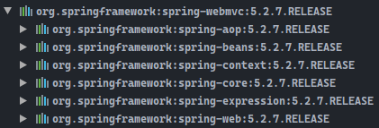
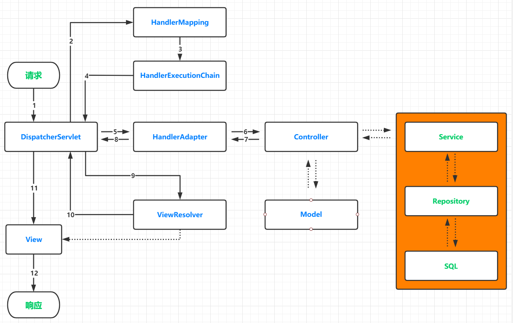
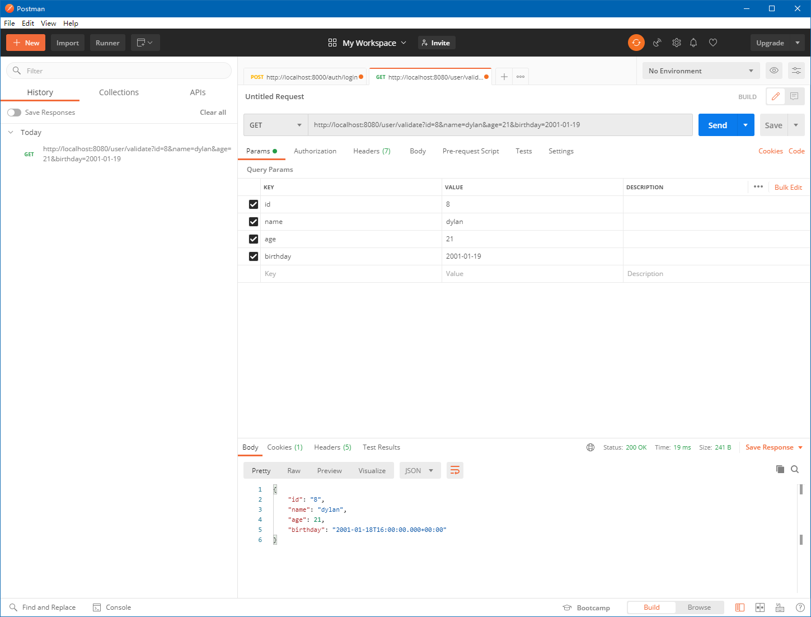
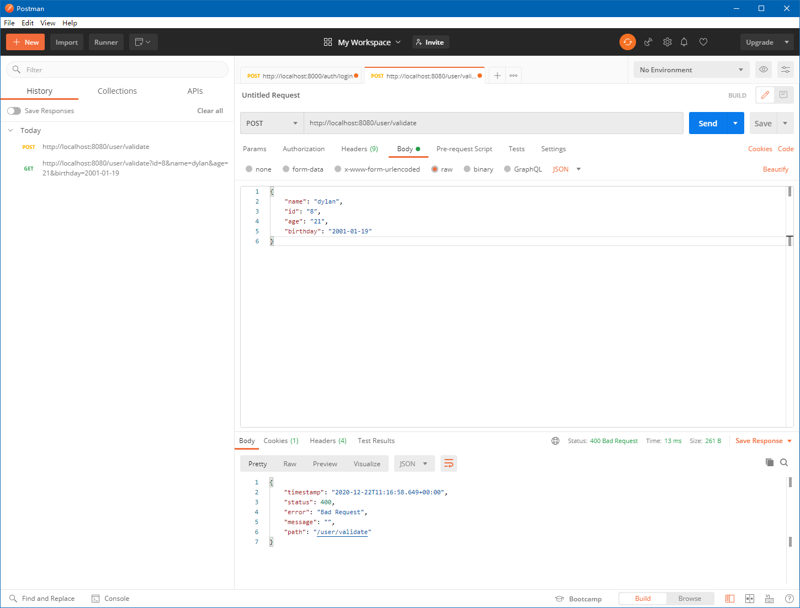
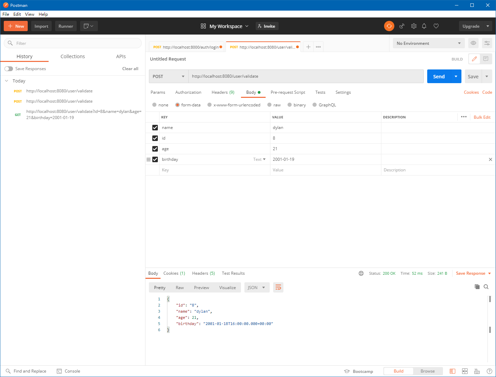
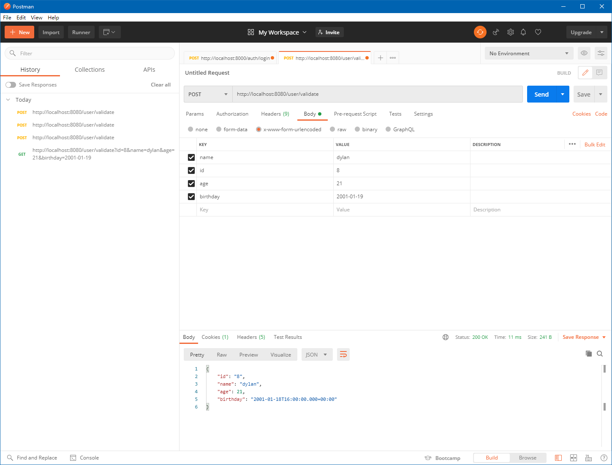
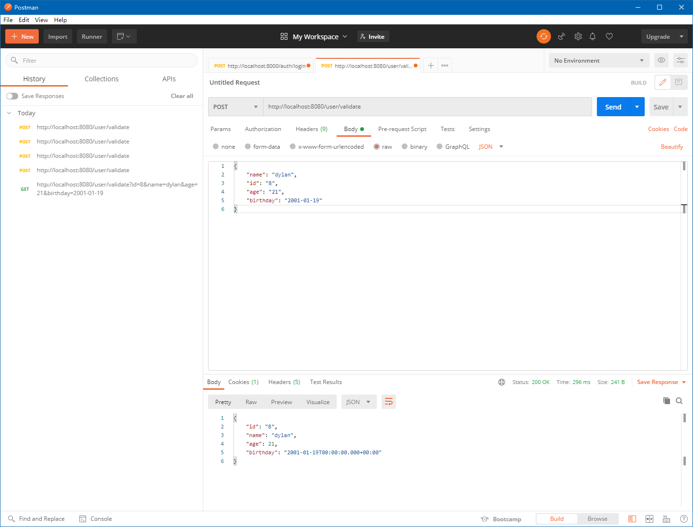
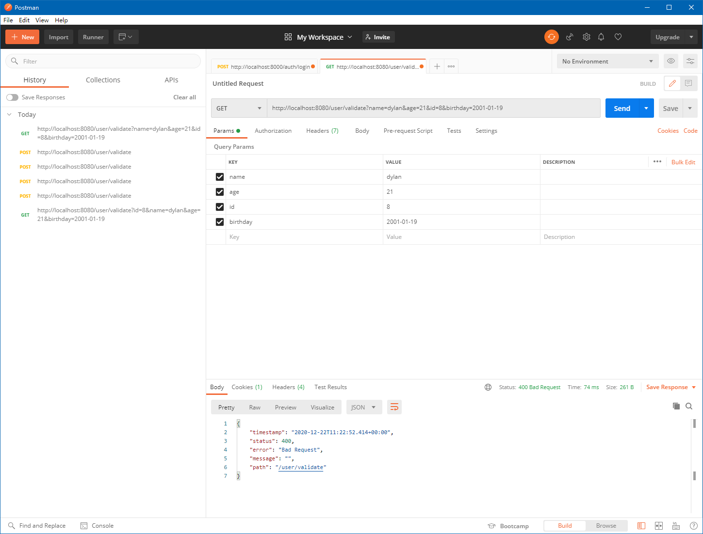
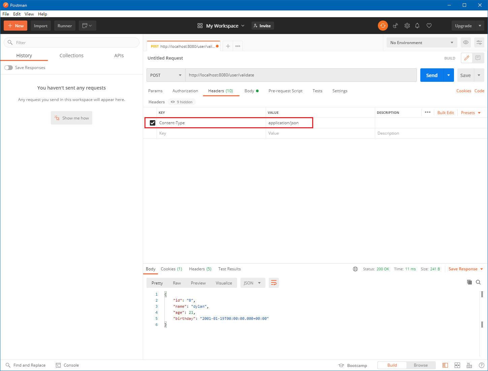

# 什么是Spring MVC?

> - Spring MVC属于SpringFrameWork的后续产品，已经融合在Spring Web Flow里面。Spring框架提供了构建Web应用程序的全功能MVC模块。
> - 使用Spring可插入的MVC结构，从而在使用Spring进行WEB开发时，可以选择使用Spring的Spring MVC框架或集成其他MVC开发框架，如Struts1（现在一般不用），Struts 2（一般老项目使用）等等。

- 需要使用`Spring MVC`，需要在项目中添加一个坐标即可：

```xml
<!-- spring-webmvc -->
<dependency>
    <groupId>org.springframework</groupId>
    <artifactId>spring-webmvc</artifactId>
    <version>5.2.7.RELEASE</version>
</dependency>
```

- 其他的依赖模块都会由`Maven`自动引入，基本上一个完整的`Spring`开发环境就齐全了：



# Spring MVC基本使用流程

- 基本流程如下：
  1. 添加依赖；
  2. 配置`web.xml`文件；
  3. 配置`springmvc.xml`文件；
  4. 编写`Controller`类。

## 1. 配置项目依赖pom.xml文件

- 创建`Maven`项目，在`pom.xml`中添加`Spring MVC`的依赖坐标；

```xml
<?xml version="1.0" encoding="UTF-8"?>

<project xmlns="http://maven.apache.org/POM/4.0.0" xmlns:xsi="http://www.w3.org/2001/XMLSchema-instance"
         xsi:schemaLocation="http://maven.apache.org/POM/4.0.0 http://maven.apache.org/xsd/maven-4.0.0.xsd">
    <modelVersion>4.0.0</modelVersion>

    <groupId>cn.dylanphang</groupId>
    <artifactId>spring-mvc</artifactId>
    <version>1.0-SNAPSHOT</version>
    <packaging>war</packaging>

    <name>spring-mvc</name>
    <!-- FIXME change it to the project's website -->
    <url>http://www.example.com</url>

    <properties>
        <!-- 指定Java编译版本和源码的字符集为UTF-8 -->
        <project.build.sourceEncoding>UTF-8</project.build.sourceEncoding>
        <maven.compiler.source>1.8</maven.compiler.source>
        <maven.compiler.target>1.8</maven.compiler.target>
        <!-- spring版本锁定 -->
        <spring.version>5.2.7.RELEASE</spring.version>
    </properties>

    <dependencies>
        <!-- spring-webmvc -->
        <dependency>
            <groupId>org.springframework</groupId>
            <artifactId>spring-webmvc</artifactId>
            <version>${spring.version}</version>
        </dependency>
        
        <!-- 
			项目依赖servlet-api和jsp-api，需要导入依赖以便用于编译或测试，而打包的时候tomcat自带了这两个依赖，
			因此这两个依赖包的作用域为privide，表示只有在编译或测试的时候使用，不会被打包到项目的war包中。
		-->
        <dependency>
            <groupId>javax.servlet</groupId>
            <artifactId>servlet-api</artifactId>
            <version>2.5</version>
            <scope>provided</scope>
        </dependency>
        
        <dependency>
            <groupId>javax.servlet.jsp</groupId>
            <artifactId>jsp-api</artifactId>
            <version>2.0</version>
            <scope>provided</scope>
        </dependency>

        <!-- junit测试 -->
        <dependency>
            <groupId>junit</groupId>
            <artifactId>junit</artifactId>
            <version>4.11</version>
            <scope>test</scope>
        </dependency>
    </dependencies>

    <!-- 以下为Maven生命周期插件，项目创建初自带 -->
    <build>
        <finalName>spring-mvc</finalName>
        <pluginManagement><!-- lock down plugins versions to avoid using Maven defaults (may be moved to parent pom) -->
            <plugins>
                <plugin>
                    <artifactId>maven-clean-plugin</artifactId>
                    <version>3.1.0</version>
                </plugin>
                <!-- see http://maven.apache.org/ref/current/maven-core/default-bindings.html#Plugin_bindings_for_war_packaging -->
                <plugin>
                    <artifactId>maven-resources-plugin</artifactId>
                    <version>3.0.2</version>
                </plugin>
                <plugin>
                    <artifactId>maven-compiler-plugin</artifactId>
                    <version>3.8.0</version>
                </plugin>
                <plugin>
                    <artifactId>maven-surefire-plugin</artifactId>
                    <version>2.22.1</version>
                </plugin>
                <plugin>
                    <artifactId>maven-war-plugin</artifactId>
                    <version>3.2.2</version>
                </plugin>
                <plugin>
                    <artifactId>maven-install-plugin</artifactId>
                    <version>2.5.2</version>
                </plugin>
                <plugin>
                    <artifactId>maven-deploy-plugin</artifactId>
                    <version>2.8.2</version>
                </plugin>
            </plugins>
        </pluginManagement>
    </build>
</project>

```

## 2. 配置web.xml文件

- 一般传统的`web`项目，在目录`WEB-INF`下会存在`web.xml`的配置文件，我们需要在其中配置`Spring MVC`的前端控制器（重要）；
- 其次有一点，标签`<web-app>`中的子标签是拥有排序的，例子中标签`<filter>`或`<filter-mapping>`必须置于标签`<servlet>`或`<servlet-mapping>`之前。
- 只要写错一个子标签顺序，`IDEA`会提示，因此不需要记忆。

```xml
<!DOCTYPE web-app PUBLIC
        "-//Sun Microsystems, Inc.//DTD Web Application 2.3//EN"
        "http://java.sun.com/dtd/web-app_2_3.dtd" >

<web-app>
    <display-name>Archetype Created Web Application</display-name>

    <!-- 配置过滤器，解决中文乱码的问题 -->
    <filter>
        <filter-name>characterEncodingFilter</filter-name>
        <filter-class>org.springframework.web.filter.CharacterEncodingFilter</filter-class>
        <!-- 指定字符集 -->
        <init-param>
            <param-name>encoding</param-name>
            <param-value>UTF-8</param-value>
        </init-param>
        <!-- 强制请求和响应的字符集都为encoding中指定的字符集 -->
        <init-param>
            <param-name>forceEncoding</param-name>
            <param-value>true</param-value>
        </init-param>
    </filter>
    <filter-mapping>
        <filter-name>characterEncodingFilter</filter-name>
        <url-pattern>/*</url-pattern>
    </filter-mapping>


    <!-- SpringMVC的核心控制器 -->
    <servlet>
        <servlet-name>dispatcherServlet</servlet-name>
        <servlet-class>org.springframework.web.servlet.DispatcherServlet</servlet-class>
        <!-- 配置Servlet的初始化参数，读取springmvc的配置文件，创建spring容器 -->
        <init-param>
            <param-name>contextConfigLocation</param-name>
            <param-value>classpath:springmvc.xml</param-value>
        </init-param>
        <!-- 配置为正整数，即表明servlet启动时加载配置文件对象 -->
        <load-on-startup>1</load-on-startup>
    </servlet>
    <servlet-mapping>
        <servlet-name>dispatcherServlet</servlet-name>
        <url-pattern>/</url-pattern>
    </servlet-mapping>
</web-app>
```

- 考虑以下代码：

```xml
<servlet-mapping>
    <servlet-name>dispatcherServlet</servlet-name>
    <url-pattern>/</url-pattern>
</servlet-mapping>

<servlet-mapping>
    <servlet-name>dispatcherServlet</servlet-name>
    <url-pattern>/*</url-pattern>
</servlet-mapping>
```

- 会发现其中的`<url-pattern>`标签的内容不一样，一个是`/`而另一个是`/*`：
  - `/`：当配置为斜杠时，只会进行路径型`url`匹配，此时可以匹配到一个`Controller`方法`/uesr/login`，但不会匹配到后缀型`url`，如：`*.html`、`*.jsp`；
  - `/*`：当配置为斜杆星号，此时会匹配任何类型的`url`，无论是路径型的还是后缀型的。
- 为什么要这样配置呢？需要了解到前端控制器的工作原理：
  - 前端控制器`dispatcherServlet`会拦截所有符合`url-pattern`的请求或响应，去寻找对应的控制器`Controller`，如果找不到则会报`404`服务器异常；
  - 如果配置的是`/*`，那么通过控制器`Controller`返回的字符串，经过视图解析器的拼接之后，将返回一个后缀型的`url`，该`url`在返回给客户端前，前端控制器会先判断是否对`url`进行拦截；
  - 毫无疑问，如果配置为`/*`，所有从视图解析器中出来的`url`都将被拦截，必然会出现`404`错误；
  - 因此，需要在这里将`url-pattern`配置为斜杠`/`。
- 同样的情况也出现在了`CharacterEncodingFilter`中，其中`filter-mapping`子标签的`url-pattern`需要配置为`/*`，因为它将对所有的页面指定统一的字符集。

```xml
<init-param>
    <param-name>forceEncoding</param-name>
    <param-value>true</param-value>
</init-param>
```

- 其中以上这行代码，表示将`request`和`response`的编码都设置为`encoding`所设置的字符集，等价于代码：

```java
request.setCharacterEncoding(encoding);
response.setCharacterEncoding(encoding);
```

## 3. 配置springmvc.xml文件

- 在`springmvc.xml`文件中，我们配置包扫描路径，以及`Spring MVC`的视图解析器，同时开启了`Spring MVC`对注解的支持；

```xml
<?xml version="1.0" encoding="UTF-8"?>
<beans xmlns="http://www.springframework.org/schema/beans"
       xmlns:mvc="http://www.springframework.org/schema/mvc"
       xmlns:context="http://www.springframework.org/schema/context"
       xmlns:xsi="http://www.w3.org/2001/XMLSchema-instance"
       xsi:schemaLocation="
http://www.springframework.org/schema/beans
http://www.springframework.org/schema/beans/spring-beans.xsd
http://www.springframework.org/schema/mvc
http://www.springframework.org/schema/mvc/spring-mvc.xsd
http://www.springframework.org/schema/context
http://www.springframework.org/schema/context/spring-context.xsd">

    <!-- 配置Spring MVC创建容器时要扫描的包，只需要扫描Controler包 -->
    <context:component-scan base-package="cn.dylanphang"/>

    <!-- 配置Spring MVC的视图解析器 -->
    <bean id="viewResolver" class="org.springframework.web.servlet.view.InternalResourceViewResolver">
        <property name="prefix" value="/WEB-INF/pages/"/>
        <property name="suffix" value=".jsp"/>
    </bean>

    <!-- 开启Spring MVC对注解的支持 -->
    <mvc:annotation-driven/>
</beans>
```

- 可以精确配置标签`<context:componet-scan>`，通过其中的子标签`<context:include-filter>`进行配置：

```xml
<context:component-scan base-package="cn.dylanphang.controller">
    <context:include-filter type="annotation" expression="org.springframework.stereotype.Controller"/>
</context:component-scan>
```

- 原则上我们只需要对带有`@Controller`的类进行扫描。

## 4. 配置Controller类

- 以下是一个简单的`Controller`类，当页面的`<a>`标签被点击时，会对指定的路径发起`GET`请求，`Controller`将接受该请求，并返回一个字符串；
- 返回的字符串，将经过前端控制器，前端控制器会将请求发送给视图解析器，视图解析器通过其中配置的前缀、后缀，将返回指定的`jsp`页面，最后交由前端控制器发送给用户。

```java
package cn.dylanphang.controller;

import org.springframework.stereotype.Controller;
import org.springframework.web.bind.annotation.RequestMapping;

@Controller
@RequestMapping("/user")
public class HelloController {

    @RequestMapping("/hello")
    public String sayHello() {
        return "success";
    }
}
```

## 5. 相关web页面代码

- `/index.jsp`：提供请求标签，点击后将通过`Controller`并最终链接到`success.jsp`页面；
- `<a>`标签只会发送`GET`请求。

```jsp
<%@ page contentType="text/html;charset=UTF-8" language="java" %>
<html>
<head>
    <title>index</title>
</head>
<body>
	<a href="user/hello">点击链接</a>
</body>
</html>
```

- `/WEB-INF/pages/success.jsp`：点击`/index.jsp`中链接后，将跳转到此页面。

```jsp
<%@ page contentType="text/html;charset=UTF-8" language="java" %>
<html>
<head>
    <title>page</title>
</head>
<body>
    <p>成功点击~</p>
</body>
</html>
```

# Spring MVC基本案例分析

## 1. 执行流程

1. 当启动`Tomcat`服务器的时候，因为配置了`<load-on-startup>`标签中的值为正整数`1`，因此在服务器启动的时候，会同时创建`DispatcherServlet`对象（前端控制器），在前端控制器中，我们添加了`springmvc.xml`配置文件的路径，因此它会帮我们加载此配置文件；
2. `spirngmvc.xml`中开启了注解的扫描与注解的支持，因此`Spring MVC`会找到指定包下带有`@Controller`注解的`HelloController.java`，并创建它的对象；
3. 从`index.jsp`发出的请求`request`，会先到达`DispatcherServlet`核心控制器，核心控制器通过处理映射器、处理器执行链和处理器适配器，将根据`Controller`中配置的`@RequestMapping`注解解析请求`url`，并最终索引到指定的方法上；
4. 接着方法执行，`Controller`将根据方法执行后将`ModelAndView`返回给处理适配器，处理适配器将结果返回给前端控制器，此时前端控制器结合配置文件`springmvc.xml`中视图解析器，找到指定目录下指定名称的`jsp`页面；
5. 生成了页面的路径之后，视图解析器`ViewResolver`会将页面返回给前端控制器，前端控制器不对`.jsp`资源进行拦截，将把页面返回给`Tomcat`服务器；
6. `Tomcat`会对该`jsp`页面进行渲染，最终将该页面作为响应返回给用户。

## 2. 组件分析



- 案例中使用到的组件有以下几个：
  1. 前端控制器`DispatcherServlet`；
  2. 处理器映射器`HandlerMapping`；
  3. 处理器执行链`HandlerExecutionChain`；
  4. 处理器适配器`HandlerAdapter`；
  5. 视图解析器`ViewResolver`；
  6. 视图`View`。

- 组件的作用：
  - `DispatcherServlet`：所有的请求都会经由前端控制器作统一的处理，负责统一其他的组件；
    1. `DispatcherServlet`收到请求时，会通知处理器映射器，让它获取匹配`url`的`handler`，同时`HandlerMapping`会返回一个`HandlerExecutionChain`；
    2. `DispatcherServlet`收到指定的`handler`后，会通知`HandlerAdapter`对指定的`handler`进行调用，并要求它返回一个`ModelAndView`；
    3. `DispatcherServlet`从`HandlerAdapter`中获取到从`handler`里返回的`ModleAndView`后，会通知`ViewResolver`进行解析操作，`ViewResolver`会把`ModelAndView`的逻辑视图转换为物理视图并返回给`DispatcherServlet`；
    4. `DispatcherServlet`最终会将获取到的物理视图返回给`web`服务器。
  - `HandlerMapping`：负责将请求`request`和`handler`做映射，我们必须知道当请求对应的`handler`是哪个；
  - `HandlerExecutionChain`：是一个封装类，其中包括我们熟悉的拦截器`Interceptor`；
  - `HandlerAdapter`：负责对`handler`中的参数进行解析处理，包括数据转换、返回值处理等；
  - `ViewResolver`：将逻辑视图转换成用户可以看到的物理视图，你可以理解为将`url`转换成为`HTML`内容；
  - `View`：返回给用户的视图；
  - `Model`：用于存储数据的模块；
  - `Controller`：用于对请求作出处理和响应，是联系`View`和`Model`的桥梁。

## 3. 关于RequestMapping注解

1. `@RequestMapping`注解的作用，是建立请求`URL`和处理方法之间的对应关系；
2. `@RequestMapping`注解可以作用在方法或类上：
   1. 作用在类上：即第一级访问目录；
   2. 作用在方法上：即第二级访问目录；
   3. 注意事项：
      1. `jsp`页面上，路径可以不编写`/`，表示从应用的根目录开始；
      2. `jsp`页面上，`${pageContext.request.contextPath}`可以省略，但是路径开头不能使用`/`；
3. `@RequestMapping`的属性：
   1. `path`：指定请求路径的`url`；
   2. `value`：`value`属性和`path`属性是一样的；
   3. `method`：指定该方法的请求方式，即`GET|POST`等；
   4. `params`：指定限制请求参数的条件；
   5. `headers`：发送的请求中必须包含的请求头。

# Spring MVC请求参数的绑定

## 1. 请求参数的绑定说明

1. 绑定机制：
   1. 表单提交的数据格式都是`key=value`的形式，例：`username=dylan&password=123456`；
   2. `Spring MVC`的参数绑定过程，是把表单提交的请求参数，作为控制器中方法的参数，进行绑定；
   3. 规范：提交的表单中`<input>`属性`name`的值，必须和目标方法中接收的参数的名称相同；
   4. 如果表单提交的时，数据中的`key`和方法参数名字不一样，需要在方法参数上使用注解`@RequestParam`，将`key`设置为该注解中的`value`，`Spring MVC`将会自动映射。
2. 支持的参数类型：
   1. 基本数据类型（包括`String`字符串类型）；
   2. 实体类型（`JavaBean`）；
   3. 集合、映射或数组类型（`Collection`、`Map`或`Array`等...）。

## 2. 基本数据类型要求

1. 提交的表单中`<input>`属性`name`的值，必须和方法参数的名称或其注解`@RequestParam`中的值一致；
2. 严格区分大小写。

## 3. 实体类型

1. 提交的表单中`<input>`属性`name`的值，必须要和`JavaBean`中成员变量（字段）的命名一致；
2. 如果一个`JavaBean`类中，包含其他的引用类型，那么表单中属性`name`的值需要使用以下的编写格式：对象.属性；
   - 例：`JavaBean`中包含了一个对象`Address address`，而在`Address`对象中拥有一个字段`String username`，此时表单需要提交该数据，其中属性`name`应该设置为`<input name="address.username">`。

## 4. 集合数组类型

1. 提交的表单中`<input>`属性`name`的值，需要使用目标集合数组的名字加上方括号的形式编写：
   
   - 例：`list[0]`、`list[1]`等...
   
2. 如果一个数组列表`list`中，包含其他的引用类型，那么同理需要编写成以下格式：
   
   - 格式：`targetList[index].objectFieldName`；
   
   - 例：`list[0].username`（其中`list[0]`为一个`Address`对象，拥有字段`String username`）。

## 5. 解决请求参数中文乱码

- 表单提交的方式如果是`post`，则可能出现中文乱码的问题，可以通过在`web.xml`中配置过滤器`filter`，解决表单提交时出现中文乱码的问题；
- 因为这是通过`Maven`中的`webapp`骨架所创建出来的`Web`工程，所以默认创建出来的`web.xml`中已经内置了标签`<web-app>`，需要将`<filter>`配置在`<web-app>`标签内。

```xml
<!DOCTYPE web-app PUBLIC
        "-//Sun Microsystems, Inc.//DTD Web Application 2.3//EN"
        "http://java.sun.com/dtd/web-app_2_3.dtd" >

<web-app>
    <display-name>Archetype Created Web Application</display-name>

    <!-- 配置过滤器，解决中文乱码的问题 -->
    <filter>
        <filter-name>characterEncodingFilter</filter-name>
        <filter-class>org.springframework.web.filter.CharacterEncodingFilter</filter-class>
        <!-- 指定字符集 -->
        <init-param>
            <param-name>encoding</param-name>
            <param-value>UTF-8</param-value>
        </init-param>
    </filter>
    <filter-mapping>
        <filter-name>characterEncodingFilter</filter-name>
        <url-pattern>/*</url-pattern>
    </filter-mapping>
</web-app>
```

## 6. 自定义类型转换

1. 表单提交的任何数据类型，都是`String`类型的。如果后台`Controller`接受的参数为`Integer`类型，此时数据也可以封装上，这是因为`Spring MVC`框架内部会默认进行数据的类型转换；
2. 如果需要自定义数据类型转换，可以实现`Spring`为我们提供的`Converter`接口；
3. 但一般情况下，我们后期会使用一个`Spring`为我们提供的注解，来将`String`类型的日期表达形式转换为`Date`类型，或者将`Date`类型转换为`String`类型的日期表达形式。

### a. 类型转换实验环境

- 我们使用表单提交一个`type="date"`的数据类型，同时在对应的`Controller`中使用一个`Date`类型用于接收；
- 默认情况下，`Spring MVC`不能将这个`String`类型日期自动转换为`Date`类型；
- 因此我们需要自行实现`Converter`接口，并编写一个`String2Date`的类型转换器。

```java
package cn.dylanphang.controller;

import org.springframework.stereotype.Controller;
import org.springframework.web.bind.annotation.RequestMapping;

import java.util.Date;

@Controller
@RequestMapping("/user")
public class HelloController {

    @RequestMapping("/myDate")
    public String getDate(Date myDate) {
        System.out.println(myDate);
        return "success";
    }
}
```

```jsp
<%@ page contentType="text/html;charset=UTF-8" language="java" isELIgnored="false" %>
<html>
<head>
    <title>index</title>
</head>
<body>
<form action="user/myDate" method="post">
    <label>
        <input type="date" name="myDate"/>
    </label>
    <input type="submit" value="提交">
</form>
</body>
</html>
```

### b. 自定义类型转换器

- 类型转换器都是作用在来着请求的数据，而不是作用于从服务器上响应出去的数据；
- 使用关键字`new`创建一个`SimpleDateFormat`对象引用，并指定它的`pattern`，该对象可以将符合该`pattern`的`String`类型转换为其对应的`Date`类型；
- 编写完毕后，我们需要在`springmvc.xml`配置文件中注册此类型转换器`String2Date`。

```java
package cn.dylanphang.convert;

import org.springframework.core.convert.converter.Converter;
import org.springframework.lang.NonNull;

import java.text.ParseException;
import java.text.SimpleDateFormat;
import java.util.Date;

public class String2Date implements Converter<String, Date> {
    @Override
    public Date convert(@NonNull String receviedStr) {
        try {
            // 这里的pattern指的是接收到的receviedStr的格式
            SimpleDateFormat simpleDateFormat = new SimpleDateFormat("yyyy-MM-dd");
            return simpleDateFormat.parse(receviedStr);
        } catch (ParseException e) {
            e.printStackTrace();
            throw new RuntimeException("Type casts error.");
        }
    }
}
```

### c. 注册自定义类型转换器

- 在`springmvc.xml`中配置自定义类型转换器；

```xml
<?xml version="1.0" encoding="UTF-8"?>
<beans xmlns="http://www.springframework.org/schema/beans"
       xmlns:mvc="http://www.springframework.org/schema/mvc"
       xmlns:context="http://www.springframework.org/schema/context"
       xmlns:xsi="http://www.w3.org/2001/XMLSchema-instance"
       xsi:schemaLocation="
http://www.springframework.org/schema/beans
http://www.springframework.org/schema/beans/spring-beans.xsd
http://www.springframework.org/schema/mvc
http://www.springframework.org/schema/mvc/spring-mvc.xsd
http://www.springframework.org/schema/context
http://www.springframework.org/schema/context/spring-context.xsd">

    <!-- 配置spring创建容器时要扫描的包 -->
    <context:component-scan base-package="cn.dylanphang"/>

    <!-- 配置视图解析器 -->
    <bean id="viewResolver" class="org.springframework.web.servlet.view.InternalResourceViewResolver">
        <property name="prefix" value="/WEB-INF/pages/"/>
        <property name="suffix" value=".jsp"/>
    </bean>

    <!-- 注册自定义类型转换器 -->
    <bean id="conversionService" class="org.springframework.context.support.ConversionServiceFactoryBean">
        <property name="converters">
            <set>
                <bean class="cn.dylanphang.convert.String2Date"/>
            </set>
        </property>
    </bean>

    <!-- 配置spring开启注解mvc的支持，开启类型转换服务 -->
    <mvc:annotation-driven conversion-service="conversionService"/>
</beans>
```

- 以下是`ConversionServiceFactoryBean`的源码：
  - 不难看出的确有一个方法`setConverters`的存在，并且它接受一个`Set`作为参数。

```java
package org.springframework.context.support;
import java.util.Set;
import org.springframework.beans.factory.FactoryBean;
import org.springframework.beans.factory.InitializingBean;
import org.springframework.core.convert.ConversionService;
import org.springframework.core.convert.support.ConversionServiceFactory;
import org.springframework.core.convert.support.DefaultConversionService;
import org.springframework.core.convert.support.GenericConversionService;
import org.springframework.lang.Nullable;

public class ConversionServiceFactoryBean implements FactoryBean<ConversionService>, InitializingBean {

	@Nullable
	private Set<?> converters;

	@Nullable
	private GenericConversionService conversionService;

	public void setConverters(Set<?> converters) {
		this.converters = converters;
	}

	@Override
	public void afterPropertiesSet() {
		this.conversionService = createConversionService();
		ConversionServiceFactory.registerConverters(this.converters, this.conversionService);
	}

	protected GenericConversionService createConversionService() {
		return new DefaultConversionService();
	}

	@Override
	@Nullable
	public ConversionService getObject() {
		return this.conversionService;
	}

	@Override
	public Class<? extends ConversionService> getObjectType() {
		return GenericConversionService.class;
	}

	@Override
	public boolean isSingleton() {
		return true;
	}

}
```

## 7. 原生Servlet API对象

- 如果想在`Controller`中使用原生的`Servlet API`对象，只需要在方法参数中加入`HttpServletRequest`和`HttpServletResponse`对象即可；
- 你可以像操作普通`servlet`一样操作这两个参数。

```java
package cn.dylanphang.controller;

import org.springframework.stereotype.Controller;
import org.springframework.web.bind.annotation.RequestMapping;

import javax.servlet.http.HttpServletRequest;
import javax.servlet.http.HttpServletResponse;
import java.io.IOException;
import java.util.Date;

@Controller
@RequestMapping("/user")
public class HelloController {
    
    @RequestMapping("/originalWay")
    public void originalWay(HttpServletRequest request, HttpServletResponse response) throws IOException {
        System.out.println(request.getParameter("username"));
        System.out.println(request.getParameter("password"));

        response.getWriter().println("Hey, here is response in Spring MVC controller.");
        response.getWriter().println("You can use request to dispatcher or response to redirect.");
    }
}
```

```jsp
<%@ page contentType="text/html;charset=UTF-8" language="java" isELIgnored="false" %>
<html>
<head>
    <title>index</title>
</head>
<body>
<form action="user/originalWay" method="post">
    <label>
        <input type="text" name="username"/>
    </label>
    <label>
        <input type="text" name="password"/>
    </label>
    <input type="submit" value="提交">
</form>
</body>
</html>
```

# Spring MVC常用注解

- 当你什么参数都不添加去使用注解时，注解中的参数会默认使用`Default`值。

## 1. @RequestParam

- 作用范围：`@Target(ElementType.PARAMETER)`，该注解只能用在方法的参数上。
- 作用：将请求中指定名称的参数值，赋值到控制器中目标方法的形参上；可以理解为给参数创建一个别名，这个别名和请求参数拥有一样的键名；
- 属性：
  1. `name`：请求参数中的名称，同`value`；
  2. `value`：请求参数中的名称，同`name`；
  3. `required`：请求访问此`Controller`的时候，其携带的参数中是否必须提供此参数，默认值`true`，即必须提供此请求参数，否则将无法访问此`Controller`。如果不设置别名，默认会以参数名作为别名。
- 参考代码：

```java
package cn.dylanphang.controller;

import org.springframework.stereotype.Controller;
import org.springframework.web.bind.annotation.RequestMapping;
import org.springframework.web.bind.annotation.RequestParam;

import javax.servlet.http.HttpServletRequest;
import javax.servlet.http.HttpServletResponse;
import java.io.IOException;
import java.util.Date;

@Controller
@RequestMapping("/user")
public class HelloController {

    @RequestMapping("/testRequestParam")
    public String testRequestParam(@RequestParam("username") String name) {
        System.out.println(name);
        System.out.println("hey, here is testRequestParam method.");

        return "success";
    }
}
```

```jsp
<%@ page contentType="text/html;charset=UTF-8" language="java" isELIgnored="false" %>
<html>
<head>
    <title>index</title>
</head>
<body>
<form action="user/testRequestParam" method="post">
    <label>
        <%-- 如果表单中没有username这个请求参数，将访问失败 --%>
        <input type="text" name="username"/>
    </label>
    <input type="submit" value="提交">
</form>
</body>
</html>
```

## 2. @RequestBody

- 作用范围：`@Target(ElementType.PARAMETER)`，该注解只能用在方法的参数上。
- 作用：用于获取请求体的内容（注意：`get`方法不能使用，只有`post`方法才拥有请求体），其实请求参数就封装在请求体中；
- 属性：
  - `required`：是否必须拥有请求体，默认值`true`，如果添加了该方法，那么此次请求就只能是`post`请求。
- 参考代码：

```java
package cn.dylanphang.controller;

import org.springframework.stereotype.Controller;
import org.springframework.web.bind.annotation.RequestBody;
import org.springframework.web.bind.annotation.RequestMapping;
import org.springframework.web.bind.annotation.RequestParam;

import javax.servlet.http.HttpServletRequest;
import javax.servlet.http.HttpServletResponse;
import java.io.IOException;
import java.util.Date;

@Controller
@RequestMapping("/user")
public class HelloController {

    @RequestMapping("/testRequestBody")
    public String testRequestBody(@RequestBody String body) {
        System.out.println(body);
        System.out.println("hey, here is testRequestBody method.");

        return "success";
    }
}
```

```jsp
<%@ page contentType="text/html;charset=UTF-8" language="java" isELIgnored="false" %>
<html>
<head>
    <title>index</title>
</head>
<body>
<h1>Access Link: user/testRequestBody</h1>
<form action="user/testRequestBody" method="post">
    <label>
        <input type="text" name="username"/>
    </label>
    <label>
        <input type="text" name="password"/>
    </label>
    <input type="submit" value="提交">
</form>
</body>
</html>
```

- 关于`Postman`中的请求，现在有如下的`Controller`源码：

```java
package cn.dylanphang.controller;

import cn.dylanphang.pojo.User;
import cn.dylanphang.service.UserService;
import org.springframework.stereotype.Controller;
import org.springframework.web.bind.annotation.RequestBody;
import org.springframework.web.bind.annotation.RequestMapping;
import org.springframework.web.bind.annotation.ResponseBody;

import javax.validation.Valid;
import java.util.Date;

/**
 * @author dylan
 */
@Controller
@RequestMapping("/user")
public class UserController {

    private final UserService userService;

    public UserController(UserService userService) {
        this.userService = userService;
    }

    @RequestMapping("/validate")
    @ResponseBody
    public User validate(@Valid User user) {
        System.out.println(user);
        return user;
    }
}
```

- 其中的`pojo`对象`User`源码为：

```java
package cn.dylanphang.pojo;

import lombok.Data;
import org.hibernate.validator.constraints.Range;
import org.springframework.stereotype.Repository;

import javax.validation.constraints.*;
import java.util.Date;

/**
 * @author dylan
 */
@Repository
@Data
public class User {
    @NotBlank(message = "不能为空白。")
    @Size(min = 1, max = 1, message = "用户id只能是1位。")
    private String id;

    @NotBlank(message = "不能为空白。")
    @Size(min = 4, max = 8, message = "用户名只能是4~8位。")
    private String name;

    @NotNull(message = "不能为null。")
    @Range(min = 0, max = 99, message = "用户年龄只能在0~99之间。")
    private Integer age;

    /**
     * 猜想，Spring MVC中有一个类型转换器，因为所有来自客户端的数据都是字符串。
     * Spring Boot如果无法自动转换，我们则需要自行转换。-> 那么如果可以封装上，就证明这个数据符合规定。
     *
     * 是否有必要自行定义一个日期校验的注解和校验器呢？值得思考。
     */
    @NotNull(message = "不能为null。")
    @Past(message = "不能是未来的日期。")
    private Date birthday;
}
```

- 我们知道，来自浏览器的`GET`请求是没有请求体的，而`POST`请求则可以携带请求体，此时该`Controller`中的`validate`可以同时接收`GET`或`POST`两种请求。
- 在`Postman`中测试`GET`请求，成功获取数据：



- 在`Postman`中测试`POST`请求，获取数据失败：



- 但如果将数据转移到请求体的`form-data`或`x-www-form-urlencoded`中，可以顺利获取数据：





- 此时如果想用`raw`来传输`JOSN`数据，需要改变`Controller`，在形参上添加注解`@RequestBody`：

```java
package cn.dylanphang.controller;

import cn.dylanphang.pojo.User;
import cn.dylanphang.service.UserService;
import org.springframework.stereotype.Controller;
import org.springframework.web.bind.annotation.RequestBody;
import org.springframework.web.bind.annotation.RequestMapping;
import org.springframework.web.bind.annotation.ResponseBody;

import javax.validation.Valid;
import java.util.Date;

/**
 * @author dylan
 */
@Controller
@RequestMapping("/user")
public class UserController {

    private final UserService userService;

    public UserController(UserService userService) {
        this.userService = userService;
    }

    @RequestMapping("/validate")
    @ResponseBody
    public User validate(@Valid @RequestBody User user) {
        System.out.println(user);
        return user;
    }
}
```

- 重启项目后再次使用`Postman`发送请求，并携带`JSON`数据，此时可以成功获取响应：



- 但此时，`Controller`无法接收来自`GET`请求携带的非请求体内提供的参数：



- 因此，`@RequestBody`是被用于解析请求体中的参数，请求可以是多样的，但数据必须存在于请求体中，同时该注解支持接收格式为`JSON`的请求体内的参数。
- 注意：当使用`@RequestBody`注解，且传输的参数为`JSON`时，尽量更改请求头中的`Content-Type`为`application/json`，同理存在于使用`ajax`请求`Controller`的情况：（但，以上测试未显示指定`Content-Type`）



## 3. @PathVarriable

- 作用范围：`@Target(ElementType.PARAMETER)`，该注解只能用在方法的参数上。
- 作用：拥有绑定`url`中的占位符，换言之可以将`url`中的部分赋值到方法的参数上。
  - 例如：`@RequestMapping("/hello/{id}")`中，`{id}`就是占位符，当请求这样的链接`/hello/world`时，`Spring MVC`将定位到此方法上，并将`world`字符串赋值给带有`@PathVarriable("id")`的参数。
- 属性：
  - `value`：指定`url`中占位符的名称
- `Restful`风格的`URL`
  1. 请求路径一样，可以根据不同的请求方式去执行后台的不同方法
  2. `restful`风格优点：
     1. 结构清晰；
     2. 符合标准；
     3. 易于理解；
     4. 扩展方便。
- 参考代码：

```java
package cn.dylanphang.controller;

import org.springframework.stereotype.Controller;
import org.springframework.web.bind.annotation.PathVariable;
import org.springframework.web.bind.annotation.RequestBody;
import org.springframework.web.bind.annotation.RequestMapping;
import org.springframework.web.bind.annotation.RequestParam;

import javax.servlet.http.HttpServletRequest;
import javax.servlet.http.HttpServletResponse;
import java.io.IOException;
import java.util.Date;

@Controller
@RequestMapping("/user")
public class HelloController {

    @RequestMapping("/testPathVariable/{username}")
    public String testPathVariable(@PathVariable("username") String name, @RequestBody String body) {
        System.out.println(name); //mike
        System.out.println(body); //username=dylan&password=123456
        System.out.println("hey, here is testPathVariable method.");

        return "success";
    }
}
```

```jsp
<%@ page contentType="text/html;charset=UTF-8" language="java" isELIgnored="false" %>
<html>
<head>
    <title>index</title>
</head>
<body>
<h1>Access Link: user/testPathVariable/mike</h1>
<%-- 注意这里的提交链接中包含了占位符mike --%>
<form action="user/testPathVariable/mike" method="post">
    <label>
        <input type="text" name="username"/>
    </label>
    <label>
        <input type="text" name="password"/>
    </label>
    <input type="submit" value="提交">
</form>
</body>
</html>
```

## 4. @RequestHeader

- 作用范围：`@Target(ElementType.PARAMETER)`，该注解只能用在方法的参数上。
- 作用：获取指定请求头的值，将它赋值给指定的方法参数；
- 属性：
  - `value`：请求头的名称，默认是空值，但是说上会取用参数名作为其值；
  - `required`：必须要包含请求头，默认为`true`；如果不设置请求头的名称，会以参数名作为请求头的名称。
- 参考代码：

```java
package cn.dylanphang.controller;

import org.springframework.stereotype.Controller;
import org.springframework.web.bind.annotation.*;

import javax.servlet.http.HttpServletRequest;
import javax.servlet.http.HttpServletResponse;
import java.io.IOException;
import java.util.Date;

@Controller
@RequestMapping("/user")
public class HelloController {

    // 获取请求头的数据，其中请求头的名称是不区分大小写的
    @RequestMapping("/testRequestHeader")
    public String testRequestHeader(@RequestHeader("accept") String acceptHeader) {
        System.out.println(acceptHeader);
        System.out.println("hey, here is testRequestHeader method.");

        return "success";
    }
}
```

```jsp
<%@ page contentType="text/html;charset=UTF-8" language="java" isELIgnored="false" %>
<html>
<head>
    <title>index</title>
</head>
<body><h1>Access Link: user/testRequestHeader</h1>
<form action="user/testRequestHeader" method="post">
    <label>
        <input type="text" name="username"/>
    </label>
    <input type="submit" value="提交">
</form>
</body>
</html>
```

## 5. @CookieValue

- 作用范围：`@Target(ElementType.PARAMETER)`，该注解只能用在方法的参数上。
- 作用：用于获取指定名称`cookie`的值；
- 属性：
  - `name`：同`value`；
  - `value`：`cookie`的名称；
  - `required`：必须要包含指定名称的`cookie`，默认为`true`。
- 参考代码：

```java
package cn.dylanphang.controller;

import org.springframework.stereotype.Controller;
import org.springframework.web.bind.annotation.*;

import javax.servlet.http.HttpServletRequest;
import javax.servlet.http.HttpServletResponse;
import java.io.IOException;
import java.util.Date;

@Controller
@RequestMapping("/user")
public class HelloController {

    @RequestMapping("/testCookieValue")
    public String testCookieValue(@CookieValue("JSESSIONID") String cookieValue) {
        System.out.println(cookieValue); //0E77211D3ECF8458CF612EE82831469F
        System.out.println("hey, here is testCookieValue method.");

        return "success";
    }
}
```

```jsp
<%@ page contentType="text/html;charset=UTF-8" language="java" isELIgnored="false" %>
<html>
<head>
    <title>index</title>
</head>
<body>
<h1>Access Link: user/testCookieValue</h1>
<form action="user/testCookieValue" method="post">
    <label>
        <input type="text" name="username"/>
    </label>
    <input type="submit" value="提交">
</form>
</body>
</html>
```

## 6. @ModelAttribute

- 作用范围：`@Target({ElementType.PARAMETER, ElementType.METHOD})`，可以作用在方法参数或方法上。
- 作用：
  1. 在方法上使用：表示当前方法会在控制器方法执行前执行；
  2. 在参数上使用：获取指定的数据给参数赋值。
- 应用场景：
  - 提交表单数据不是完整的实体数据时，保证没有提交的字段使用数据库原来的数据。
- 参考代码：

### a. 有返回值的方法上使用注解

- 请求当前`Controller`中所有的方法前，都会优先执行带有`@ModelAttribute`注解的方法；
- 如果使用`@ModelAttribute`注解的方法拥有返回值，那么必定至少有一个`@RequestMapping`注解的方法会在参数中使用到该类型的返回值。

```java
package cn.dylanphang.controller;

import cn.dylanphang.domain.User;
import org.springframework.stereotype.Controller;
import org.springframework.web.bind.annotation.*;

import javax.servlet.http.HttpServletRequest;
import javax.servlet.http.HttpServletResponse;
import java.io.IOException;
import java.text.ParseException;
import java.text.SimpleDateFormat;
import java.util.Date;

@Controller
@RequestMapping("/user")
public class HelloController {

    @ModelAttribute
    public User returnUser(@RequestParam("id") String userId) throws ParseException {
        User user = new User();

        // 模拟使用了userId进行查询并返回一个查询到的user对象
        user.setUsername("dylan");
        user.setPassword("123456");
        user.setBirthday(new SimpleDateFormat("yyyy-MM-dd").parse("1993-02-17"));

        System.out.println("Simulate querying this data from the database.");
        System.out.println("Querying Data: " + user);

        return user;
    }

    @RequestMapping("/testModelAttribute")
    public String testModelAttribute(User user) {
        System.out.println("Method testModelAttribute get the data: " + user);

        return "success";
    }
}
/* Output Result:
Simulate querying this data from the database.
Querying Data: User{username='dylan', password='123456', birthday=Wed Feb 17 00:00:00 CST 1993}
Method testModelAttribute get the data: User{username='dylan', password='123456', birthday=Wed Feb 17 00:00:00 CST 1993}
*/
```

```jsp
<%@ page contentType="text/html;charset=UTF-8" language="java" isELIgnored="false" %>
<html>
<head>
    <title>index</title>
</head>
<body><h1>Access Link: user/testModelAttribute</h1>
<form action="user/testModelAttribute" method="post">
    <label>
        <input type="text" name="id"/>
    </label>
    <input type="submit" value="提交">
</form>
</body>
</html>
```

### b. 无返回值的方法上使用注解

- 如果当前使用`@ModelAttribute`的方法没有返回值，需要在此方法上增加一个`Map`映射，用于封装处理后的数据；
- 在最终的目标方法的参数上，也需要使用`@ModelAttribute`注解，并将注解中的`value`设置为`Map`映射中的`key`。
- 即使用了数据容器和参数上的`ModelAttribut`注解替代了原有方法的返回值。

```java
package cn.dylanphang.controller;

import cn.dylanphang.domain.User;
import org.springframework.stereotype.Controller;
import org.springframework.web.bind.annotation.*;

import javax.servlet.http.HttpServletRequest;
import javax.servlet.http.HttpServletResponse;
import java.io.IOException;
import java.text.ParseException;
import java.text.SimpleDateFormat;
import java.util.Date;
import java.util.Map;

@Controller
@RequestMapping("/user")
public class HelloController {

    @ModelAttribute
    public void returnUser(@RequestParam("id") String userId, Map<String, User> map) throws ParseException {
        User user = new User();

        // 模拟使用了userId进行查询并返回一个查询到的user对象
        user.setUsername("dylan");
        user.setPassword("123456");
        user.setBirthday(new SimpleDateFormat("yyyy-MM-dd").parse("1993-02-17"));

        System.out.println("Simulate querying this data from the database.");
        System.out.println("Querying Data: " + user);

        // 将user存入map集合中
        map.put("keyForGetUser", user);
    }

    @RequestMapping("/testModelAttribute")
    public String testModelAttribute(@ModelAttribute("keyForGetUser") User user) {
        System.out.println("Method testModelAttribute get the data: " + user);

        return "success";
    }
}
```

```jsp
<%@ page contentType="text/html;charset=UTF-8" language="java" isELIgnored="false" %>
<html>
<head>
    <title>index</title>
</head>
<body>
<h1>Access Link: user/testModelAttribute</h1>
<form action="user/testModelAttribute" method="post">
    <label>
        <input type="text" name="id"/>
    </label>
    <input type="submit" value="提交">
</form>
</body>
</html>
```

- 此外，在形参上使用`@ModelAttribute`注解可以从`Session`域中取出已存储的键值对中指定键的值。

```java
package cn.dylanphang.controller;

import org.springframework.stereotype.Controller;
import org.springframework.ui.Model;
import org.springframework.web.bind.annotation.ModelAttribute;
import org.springframework.web.bind.annotation.RequestMapping;
import org.springframework.web.bind.annotation.SessionAttributes;
import org.springframework.web.bind.support.SessionStatus;

/**
 * @author dylan
 */
@Controller
@RequestMapping("/user")
@SessionAttributes(names = {"username", "password", "age"})
public class SessionAttributesController {
    /**
     * 用于向session中存入值
     *
     * @param model model对象，用于存储数据
     * @return success
     */
    @RequestMapping("/save")
    public String save(Model model) {
        System.out.println("Here is inside method save(), ready to store data.");

        model.addAttribute("username", "dylan");
        model.addAttribute("password", "123456");
        model.addAttribute("age", 24);

        return "success";
    }

    @RequestMapping("/testModelAttribute2")
    public String testModelAttribute(@ModelAttribute("password") String pwd) {
        System.out.println("Method testModelAttribute get the data: " + pwd);

        return "success";
    }
}
```

- 访问`/user/save`将变量`password`存入`session`域之后，此后再访问`/user/testModelAttrbute2`，控制台将输出存储在`session`域中的`password`键对应的值`123456`。
- 如果指定的键不存在，也就是域中不存在`password`为键的数据，程序将抛出`HttpSessionRequiredException`异常，错误消息为`Expected session attribute 'password'`。

## 7. @SessionAttributes

- 作用范围：`@Target({ElementType.TYPE})`，此注解只能用在类上。
- 作用：用于控制器`@Controller`中方法的参数共享；
- 属性：
  - `value`：同属性`name`，指定名称的`Attribute`都可以在此`@Controller`中的方法间进行共享；
- `types`：其接收一个`Class<?>[]`，指定类型的对象都将可以在此`@Controller`中的方法间进行共享。
- 使用方法：
  - 存入元素：在需要存入元素的方法中，需要添加形参`Model model`，使用该对象中的`addAttribute`方法可以将对象添加到共享域中，一旦属性的键`key`符合注解中设置的`name`或是其值`value`符合注解中设置的`types`，那该属性将可以在此`@Controller`中的方法间进行共享。
  - 取用元素：在需要取用元素的方法中，需要添加形参`ModelMap modelMap`，使用该对象中的`getAttribute`或`get`方法，都可以取出已共享的属性，需要注意，取出的元素均为`Object`类型，需要强转。
  - 删除元素：在需要删除元素的方法中，需要添加形参`ModelMap modelMap`，使用该对象中的`removeAttribute`或`remove`方法，可以将已共享的属性删除。
  - 修改元素：在需要修改元素的方法中，需要添加形参`ModelMap modelMap`，使用该对象中的`replace`方法，可以将已共享的属性中的值修改为其他值。
  - 清空元素：在需要清空元素的方法中，需要添加形参`SessionStatus sessionStatus`，使用对象中的`setComplete`方法可以清空所有已共享的属性。
- 在这里其实使用`Model`还是`ModelMap`都是一样的，最终调用的方法都在`ModelMap`中，而`ModelMap`能够存储键值对，完全是因为它的父类`LinkedHashMap`，我们将在章末带来源码分析。
- 测试采用直接访问目标`Controller`链接的方式进行：
- 参考代码：测试采用直接访问目标`Controller`链接的方式进行。

```java
package cn.dylanphang.controller;

import org.springframework.stereotype.Controller;
import org.springframework.ui.Model;
import org.springframework.ui.ModelMap;
import org.springframework.web.bind.annotation.RequestMapping;
import org.springframework.web.bind.annotation.SessionAttributes;
import org.springframework.web.bind.support.SessionStatus;

@Controller
@RequestMapping("/user")
@SessionAttributes(names = {"username", "password", "age"},
        types = {String.class, Integer.class})

public class SessionAttributesController {
    /**
     * 用于向session中存入值
     *
     * @param model model对象，用于存储数据
     * @return success
     */
    @RequestMapping("/save")
    public String save(Model model) {
        System.out.println("Here is inside method save(), ready to store data.");

        model.addAttribute("username", "dylan");
        model.addAttribute("password", "123456");
        model.addAttribute("age", 24);

        return "success";
    }

    /**
     * 用于从session中获取值
     *
     * @param modelMap 可以从model中将存储的值取出
     * @return success
     */
    @RequestMapping("/find")
    public String find(ModelMap modelMap) {
        System.out.println("Here is inside method find(), ready to retrieve data.");

        String username = (String) modelMap.get("username");
        String password = (String) modelMap.getAttribute("password");
        Integer age = (Integer) modelMap.getAttribute("age");

        System.out.println("username: " + username + "\n" +
                "password: " + password + "\n" +
                "age: " + age);

        return "success";
    }

    /**
     * 用于清除session中的值
     
     * @param sessionStatus 用于清除值的对象
     * @return success
     */
    @RequestMapping("/delete")
    public String delete(SessionStatus sessionStatus) {
        System.out.println("Here is inside method delete(), ready to erase data.");

        sessionStatus.setComplete();

        return "success";
    }
}
```

- 特殊说明：
  - 直接访问链接`/user/save`时，数据立刻存入并可以在`success.jsp`上展示出来；
  - 直接访问链接`/user/find`时，`session`中有数据则显示，无则不显示；
  - 直接访问链接`/user/delete`时，此时方法中会启用数据清除，但是页面上仍然显示已删除的数据，`session`数据删除操作就像是被放置在拦截器的`afterCompletion`方法中一样，是页面数据加载完毕后，才进行的数据删除。

```jsp
<%@ page contentType="text/html;charset=UTF-8" language="java" isELIgnored="false" %>
<html>
<head>
    <title>page</title>
</head>
<body>
<h1>ready to test session attributes</h1>
<ul>
    <li>username:${username}</li>
    <li>password:${password}</li>
    <li>age:${age}</li>
</ul>
</body>
</html>
```

# 关于Model和ModelMap

- 我们在使用方法参数为`Model model`的方法中，调用此对象引用中的`getClass()`方法，获取创建此对象的字节码文件`.class`的`Class`对象，并使用该对象调用方法`getName()`获取该字节码文件代表的`Java`类的全限定类名。

```java
package cn.dylanphang.controller;

import org.springframework.stereotype.Controller;
import org.springframework.ui.Model;
import org.springframework.ui.ModelMap;
import org.springframework.web.bind.annotation.RequestMapping;
import org.springframework.web.bind.annotation.SessionAttributes;
import org.springframework.web.bind.support.SessionStatus;

/**
 * @author dylan
 */
@Controller
@RequestMapping("/user")
@SessionAttributes(names = {"username", "password", "age"})
public class SessionAttributesController {

    @RequestMapping("/save")
    public String save(Model model) {
        System.out.println("Here is inside method save(), ready to store data.");

        model.addAttribute("username", "dylan");
        model.addAttribute("password", "123456");
        model.addAttribute("age", 24);

        final String name = model.getClass().getName();
        System.out.println(name);

        return "success";
    }
}
```

- 控制台输出信息：`org.springframework.validation.support.BindingAwareModelMap`。
- 那么毫无疑问，这是形参的真实对象类型是`BindingAwareModelMap`。同时，即使你使用的是形参`ModelMap model`，其真实类型也是`BindingAwareModelMap`。

```java
package org.springframework.validation.support;
import java.util.Map;
import org.springframework.ui.ExtendedModelMap;
import org.springframework.validation.BindingResult;

@SuppressWarnings("serial")
public class BindingAwareModelMap extends ExtendedModelMap {

	@Override
	public Object put(String key, Object value) {
		removeBindingResultIfNecessary(key, value);
		return super.put(key, value);
	}

	@Override
	public void putAll(Map<? extends String, ?> map) {
		map.forEach(this::removeBindingResultIfNecessary);
		super.putAll(map);
	}

	private void removeBindingResultIfNecessary(Object key, Object value) {
		if (key instanceof String) {
			String attributeName = (String) key;
			if (!attributeName.startsWith(BindingResult.MODEL_KEY_PREFIX)) {
				String bindingResultKey = BindingResult.MODEL_KEY_PREFIX + attributeName;
				BindingResult bindingResult = (BindingResult) get(bindingResultKey);
				if (bindingResult != null && bindingResult.getTarget() != value) {
					remove(bindingResultKey);
				}
			}
		}
	}

}

```

- 而`BindingAwareModelMap`中并没有`addAttrbute`等方法，那么按照继承的规则，会向上查找该方法，即程序会在其父类`ExtendedModelMap`中查询该方法。

```java
package org.springframework.ui;`
import java.util.Collection;
import java.util.Map;
import org.springframework.lang.Nullable;

@SuppressWarnings("serial")
public class ExtendedModelMap extends ModelMap implements Model {

   @Override
   public ExtendedModelMap addAttribute(String attributeName, @Nullable Object attributeValue) {
      super.addAttribute(attributeName, attributeValue);
      return this;
   }

   @Override
   public ExtendedModelMap addAttribute(Object attributeValue) {
      super.addAttribute(attributeValue);
      return this;
   }

   @Override
   public ExtendedModelMap addAllAttributes(@Nullable Collection<?> attributeValues) {
      super.addAllAttributes(attributeValues);
      return this;
   }

   @Override
   public ExtendedModelMap addAllAttributes(@Nullable Map<String, ?> attributes) {
      super.addAllAttributes(attributes);
      return this;
   }

   @Override
   public ExtendedModelMap mergeAttributes(@Nullable Map<String, ?> attributes) {
      super.mergeAttributes(attributes);
      return this;
   }

   @Override
   public Map<String, Object> asMap() {
      return this;
   }
}
```

- 而`ExtendedModelMap`中的`addAttribute`方法仅是一个壳，实际调用的是它父类中的同名方法，而它的父类是`ModelMap`。
- 我们再来看看`ModelMap`的源码：

```java
package org.springframework.ui;

import java.util.Collection;
import java.util.LinkedHashMap;
import java.util.Map;

import org.springframework.core.Conventions;
import org.springframework.lang.Nullable;
import org.springframework.util.Assert;

@SuppressWarnings("serial")
public class ModelMap extends LinkedHashMap<String, Object> {

   /**
    * Construct a new, empty {@code ModelMap}.
    */
   public ModelMap() {
   }

   /**
    * Construct a new {@code ModelMap} containing the supplied attribute
    * under the supplied name.
    * @see #addAttribute(String, Object)
    */
   public ModelMap(String attributeName, @Nullable Object attributeValue) {
      addAttribute(attributeName, attributeValue);
   }

   /**
    * Construct a new {@code ModelMap} containing the supplied attribute.
    * Uses attribute name generation to generate the key for the supplied model
    * object.
    * @see #addAttribute(Object)
    */
   public ModelMap(Object attributeValue) {
      addAttribute(attributeValue);
   }


   /**
    * Add the supplied attribute under the supplied name.
    * @param attributeName the name of the model attribute (never {@code null})
    * @param attributeValue the model attribute value (can be {@code null})
    */
   public ModelMap addAttribute(String attributeName, @Nullable Object attributeValue) {
      Assert.notNull(attributeName, "Model attribute name must not be null");
      put(attributeName, attributeValue);
      return this;
   }

   /**
    * Add the supplied attribute to this {@code Map} using a
    * {@link org.springframework.core.Conventions#getVariableName generated name}.
    * <p><i>Note: Empty {@link Collection Collections} are not added to
    * the model when using this method because we cannot correctly determine
    * the true convention name. View code should check for {@code null} rather
    * than for empty collections as is already done by JSTL tags.</i>
    * @param attributeValue the model attribute value (never {@code null})
    */
   public ModelMap addAttribute(Object attributeValue) {
      Assert.notNull(attributeValue, "Model object must not be null");
      if (attributeValue instanceof Collection && ((Collection<?>) attributeValue).isEmpty()) {
         return this;
      }
      return addAttribute(Conventions.getVariableName(attributeValue), attributeValue);
   }

   /**
    * Copy all attributes in the supplied {@code Collection} into this
    * {@code Map}, using attribute name generation for each element.
    * @see #addAttribute(Object)
    */
   public ModelMap addAllAttributes(@Nullable Collection<?> attributeValues) {
      if (attributeValues != null) {
         for (Object attributeValue : attributeValues) {
            addAttribute(attributeValue);
         }
      }
      return this;
   }

   /**
    * Copy all attributes in the supplied {@code Map} into this {@code Map}.
    * @see #addAttribute(String, Object)
    */
   public ModelMap addAllAttributes(@Nullable Map<String, ?> attributes) {
      if (attributes != null) {
         putAll(attributes);
      }
      return this;
   }

   /**
    * Copy all attributes in the supplied {@code Map} into this {@code Map},
    * with existing objects of the same name taking precedence (i.e. not getting
    * replaced).
    */
   public ModelMap mergeAttributes(@Nullable Map<String, ?> attributes) {
      if (attributes != null) {
         attributes.forEach((key, value) -> {
            if (!containsKey(key)) {
               put(key, value);
            }
         });
      }
      return this;
   }

   /**
    * Does this model contain an attribute of the given name?
    * @param attributeName the name of the model attribute (never {@code null})
    * @return whether this model contains a corresponding attribute
    */
   public boolean containsAttribute(String attributeName) {
      return containsKey(attributeName);
   }

   /**
    * Return the attribute value for the given name, if any.
    * @param attributeName the name of the model attribute (never {@code null})
    * @return the corresponding attribute value, or {@code null} if none
    * @since 5.2
    */
   @Nullable
   public Object getAttribute(String attributeName) {
      return get(attributeName);
   }
}
```

- 看到了其实该类继承了`LinkedHashMap`类，其大多数的功能都是建基在`LinkedHashMap`上的。
  - 譬如`addAttribute`方法，其实底层就是调用了其父类`LinkedHashMap`中的`put`方法，将键值对存入映射中。
  - 譬如`get`方法，其底层也是直接调用了其父类`LinkedHashMap`中的`get`方法，根据键获取值罢了。

- 那是不是使用`Model model`和使用`ModelMap modelMap`完全一致呢？答案是否定的。
- 继承的特性是子类无法使用其特有的方法，换言之，如果使用多态来构筑一个形参，那么这个对象引用只能使用从基类中覆写的方法或是该基类中原本存在的方法。
- 再通俗一点地说明，就是一个多态的对象`Model bindingAwareModelMap`，当使用此对象引用调用一个方法的时候，首先程序会查询基类`Model`中是否有该方法，如果有，则会从子类`BindingAwareModelMap`中查询是否有该方法的覆写；如果没有，则继续查询`BindingAwareModelMap`的父类中是否有该方法的覆写。
- 程序将层层递进直到找到该方法的覆写去调用它或最终到达`Model`类后直接调动`Model`类中的原方法。
- 因此有一些方法是`ModelMap`中独有的方法，是`Model`接口中所不具有的方法，如`remove`或`replace`方法等。
- 如果需要用到这些方法，此时使用的多态构筑就是`ModelMap modelmap`，纵使它本质上还是`BindingAwareModelMap`。