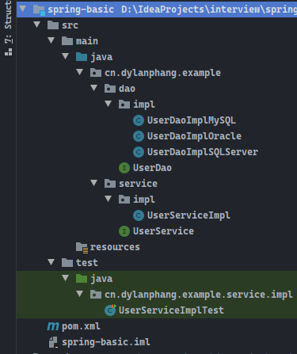
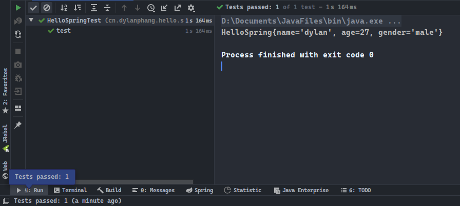

# 前言

> - 本篇将更为通俗易懂的方式，讲解Spring的核心IoC和AOP。

# 什么是IoC？

- `IoC`即`Inversion of Control`（**控制反转**），是面向对象编程中的一种设计原则，可以用来减低计算机代码之间的耦合度。其中最常见的方法叫做**依赖注入**，即`Dependency Injection`，简称`DI`。另外还有一种叫**依赖查找**，即`Dependency Lookup`。
- 通过控制反转，对象在被创建的时候，由一个调度系统内所有对象的外界实体，将其所依赖的对象的引用传递给它。这个过程可以说是依赖被注入到了对象中。
- **控制反转**是一种通过描述（XML或注解）并通过第三方去生产或获取特定对象的方式。在Spring中实现**控制反转**的是IoC容器，其实现方法是**依赖注入**（`Dependency Injection`）。

# 传统案例分析与修改

## 1. 模拟查询

- 我们尝试考虑以下代码，有一个`dao`层的接口，我们需要为这个接口编写读取三种不同数据库的代码。
- 假设使用传统的`JDBC`方式，那么显然，这三种不同数据库的`dao`实现类中，所使用的`sql`语句很大几率上是完全不一样的，因此我们还需要编写三个不同的`dao`实现类。
- 其次我们在业务层编写一个业务类`service`，所有用户都会直接通过调用`service`层的方法来间接调用`dao`层的方法。在`service`层我们提供查询`MySQL`数据库的`dao`实现类对象。



- 最后我们编写一个测试类，模拟用户调用`service`层的接口，查询数据库的数据。

```java
package cn.dylanphang.example.service.impl;

import cn.dylanphang.example.service.UserService;
import org.junit.Test;

public class UserServiceImplTest {
    @Test
    public void test() {
        UserService userService = new UserServiceImpl();
        userService.findAllUser();
    }
}
```

- 在这个案例中，我们主要关注的是`service`层中的实现类，实现类中已经将从`MySQL`数据中查询数据的`dao`对象通过`new`关键字创建，并应用到了用户调用的目标方法`findAllUser()`中了。

```java
package cn.dylanphang.example.service.impl;

import cn.dylanphang.example.dao.UserDao;
import cn.dylanphang.example.dao.impl.UserDaoImplMySQL;
import cn.dylanphang.example.service.UserService;

/**
 * @author dylan
 */
public class UserServiceImpl implements UserService {
	// 这一步已经被写死了
    private final UserDao userDao = new UserDaoImplMySQL();

    public void findAllUser() {
        this.userDao.findAll();
    }
}
```

## 2. 重要问题

- 假设这个时候，用户不需要从`MySQL`中查询数据了，想要换一个数据库，例如`Oracle`。那么这个时候，我们只能通过修改我们`service`层中的代码，以满足用户的要求。

```java
package cn.dylanphang.example.service.impl;

import cn.dylanphang.example.dao.UserDao;
import cn.dylanphang.example.dao.impl.UserDaoImplOracle;
import cn.dylanphang.example.service.UserService;

/**
 * @author dylan
 */
public class UserServiceImpl implements UserService {
	// 这一步已经被写死了
    private final UserDao userDao = new UserDaoImplOracle();

    public void findAllUser() {
        this.userDao.findAll();
    }
}
```

## 3. 解决方案

- 我们当然可以试图编写三个不同的业务层实现类，以满足用户的不同选择。但在这里，更为合适的解决方案是：在`service`实现类中，不使用`new`关键字创建`dao`实现类的对象，转而使用`Setter`方法的方式，同样把选择权交给用户，但对象只有被需要的时候，才会被创建并使用。
- 我们需要做的是稍微修改一下`service`实现类的代码：

```java
package cn.dylanphang.example.service.impl;

import cn.dylanphang.example.dao.UserDao;
import cn.dylanphang.example.service.UserService;

/**
 * @author dylan
 */
public class UserServiceImpl implements UserService {

    private UserDao userDao;

    // 用户可以执行选择查询的数据库是什么
    public void setUserDao(UserDao userDao) {
        this.userDao = userDao;
    }

    public void findAllUser() {
        this.userDao.findAll();
    }
}
```

- 自此，用户可以执行选择要在哪个数据库中进行数据的查询：

```java
package cn.dylanphang.example.service.impl;

import cn.dylanphang.example.dao.impl.UserDaoImplMySQL;
import cn.dylanphang.example.dao.impl.UserDaoImplOracle;
import cn.dylanphang.example.dao.impl.UserDaoImplSQLServer;
import org.junit.Test;

public class UserServiceImplTest {
    @Test
    public void test() {
        UserServiceImpl userService = new UserServiceImpl();

        // 在Oracle中查询数据
        userService.setUserDao(new UserDaoImplOracle());
        userService.findAllUser();

        // 在MySQL中查询数据
        userService.setUserDao(new UserDaoImplMySQL());
        userService.findAllUser();

        // 在SQLServer中查询数据
        userService.setUserDao(new UserDaoImplSQLServer());
        userService.findAllUser();
    }
}
```

## 4. 结果分析 

- 在修改程序之前，每一次的用户需求，都会导致我们去修改业务层的代码，而如果一个程序的代码量十分巨大，那么一次修改所要付出的代价是十分沉重的。
- 而在添加了`Setter`方法之后，原本`service`实现类使用`new`关键字主动创建对象的局面，变成了使用`Setter`方法注入的、由用户控制的、其本身不再主动创建对象的局面。这个过程我们称为控制反转。
  - 程序不再主动使用关键字`new`来创建对象了，也就是程序员本身不再拥有对该类的控制权。将该控制权交由用户来控制，给我们带来的好处是：不再需要根据用户的需求修改代码了，即不再需要对该类进行管理了，同时大大降低了系统代码之间的耦合性。
- 在`Setter`方法注入的设计模式下，控制权交给了用户，用户可以根据需求选择合适的`dao`实现类，从而完成不同的查询目的。

# Spring中的控制反转

- 在上一节中我们使用`Setter`方法对称性进行了改进，实现了控制反转，即将选择权移交给用户，对象不再是由程序员主动创建的，而是由用户按需创建。
- 由于多态的特性，我们可以轻易地使用`Setter`方法实现控制反转，大大降低了修改代码所可能带来的失误风险。
- 控制反转的核心我认为是两点：
  1. 从宏观上来说，是将以往程序员所能主动控制的代码，都变成一种可以通过用户需求来灵活响应的代码，表现为程序的控制权从开发者手中转移到了使用者的手中；
  2. 从微观上来说，程序中的类不再主动需求某一个特定的类，而是通过配置的方式，将程序所需要的类提供到其中，完成一种类似于按需创建的模式。
- 使用`Setter`进行控制反转的实现，其中最为重要的应该是多态。如果没有多态的特性，用户需要进行类之外的对类之内的东西进行调整是不可能实现的，程序只能通过提供更多不同方法的方式，给用户提供更多的选择；而无法在只提供一个方法的前提下，通过多种参数的方式提供选择。

- 接下来我们看看`Spring`的控制转`IoC`。

## 1. Spring IoC概述

- `Spring`中拥有一个`IoC`容器，用于存储通过`xml`文件或注解配置的各类对象，这个些对象被统称为`Bean`，通过`ApplicationContext`（`Spring`上下文对象）中的`getBean`方法，可以从`IoC`容器中取出这些对象。
- `Bean`对象中如果需要引入另一个`Bean`对象，根据引入方式的不同，需要按需选择使用构造器注入还是`Setter`注入，将另一个`Bean`对象注入到目标`Bean`中。

## 2. 构造器注入与Setter注入

- 所有的使用构造函数进行初始化的字段，必须通过`bean`中的`constructor-arg`标签进行注入：
  - 使用构造器注入是必须要要进行`constructor-arg`标签配置的，构造器注入本身就是为了防止对象的遗漏注入，如果类中的某些字段是使用构造器进行初始化的，不使用`constructor-arg`会提示配置错误；
  - 但需要注意的是，如果类中编写了有参构造用于注入，但同时无参构造也存在，那么Spring配置文件将不再继续强制使用有参构造，也就是说，在这种情况下即使不使用`constructor-arg`进行必要的注入，配置也不会报错。
- 所有的类字段中拥有`Setter`方法的，可以通过`bean`中的`property`标签进行注入：
  - `Setter`注入等同于传统上利用多态特性进行控制反转的方法。使用`Setter`注入的字段，`Spring`不强制要求进行配置，也就是说，如果一旦类中的完整功能，需要某些字段的提前注入，但配置中遗漏了注入，会导致程序在使用到相关功能的时候出现不必要的异常。
- 官方较为推荐的注入方式是构造器注入，这样不会出现配置不当导致的异常。

## 3. 项目实现

### a. 依赖导入

- 使用的是`Maven`项目，需要导入以下依赖：

```xml
<!-- 使用webmvc是因为Maven导入的相关依赖中，包含了我们使用Spring的全部依赖 -->
<dependency>
    <groupId>org.springframework</groupId>
    <artifactId>spring-webmvc</artifactId>
    <version>5.2.7.RELEASE</version>
</dependency>
```

### b. 实验类

- 字段`name`使用`Setter`注入，而`age`和`gender`则使用构造器注入：

```java
package cn.dylanphang.hello.sample;

/**
 * @author dylan
 */
public class HelloSpring {
    private String name;
    private Integer age;
    private String gender;

    public HelloSpring(Integer age, String gender) {
        this.age = age;
        this.gender = gender;
    }

    public void setName(String name) {
        this.name = name;
    }

    @Override
    public String toString() {
        return "HelloSpring{" +
                "name='" + name + '\'' +
                ", age=" + age +
                "gender='" + gender + '\'' +
                '}';
    }
}
```

### c. 配置文件

- `Spring`的配置文件如下，`IDEA`可以直接创建`Spring`的配置文件模板：

```xml
<?xml version="1.0" encoding="UTF-8"?>
<beans xmlns="http://www.springframework.org/schema/beans"
       xmlns:xsi="http://www.w3.org/2001/XMLSchema-instance"
       xsi:schemaLocation="http://www.springframework.org/schema/beans
       http://www.springframework.org/schema/beans/spring-beans.xsd">

    <bean id="helloSpring" class="cn.dylanphang.hello.sample.HelloSpring">
        <property name="name" value="dylan"/>
        <constructor-arg name="age" value="27"/>
        <constructor-arg name="gender" value="male"/>
    </bean>
</beans>
```

### d. 测试类

- 需要使用`SpringContext`对象加载配置文件，并使用`getBean`方法从`IoC`容器中将对象取出：

```java
package cn.dylanphang.hello.sample;

import org.junit.Test;
import org.springframework.context.ApplicationContext;
import org.springframework.context.support.ClassPathXmlApplicationContext;

public class HelloSpringTest {
    /**
     * 类ClassPathXmlApplicationContext可以接收String数组，也就是可以同时配置多个Xml文件。
     *
     * 对象交由Spring来创建、管理、装配。
     */
    @Test
    public void test() {
        // 获取Spring的上下文对象
        final ApplicationContext ac = new ClassPathXmlApplicationContext("beans.xml");

        // 在获取完Spring Context之后，配置文件中的对象已经被创建且交由Spring管理了，我们只需要从容器中将对象取出来使用即可
        final HelloSpring helloSpring = (HelloSpring) ac.getBean("helloSpring");

        // 控制台打印，测试通过
        System.out.println(helloSpring);
    }
}
```

### e. 实验结果

- 测试类运行结果：



## 4. 结果分析

1. 程序通过配置文件的方式，将`HelloSpring`类中所需要的字段都进行了相应的注入；
2. `Spring`通过`SpringContext`对象加载配置文件`Beans.xml`，将创建好的`HelloSpring`对象放置于`Spring IoC`容器中；
3. 用户通过`SpringContext`对象中的`getBean`方法将创建好的`HelloSpring`对象取出，并调用`HelloSpring`对象中的`toString`方法，得到`HelloSpring`对象中的内容。

# 使用Spring修改案例

## 1. 修改方式

- 只需要在原本的案例中增加一个配置文件，以及修改测试类获取`service`对象的方式即可。
- Spirng配置文件：

```xml
<?xml version="1.0" encoding="UTF-8"?>
<beans xmlns="http://www.springframework.org/schema/beans"
       xmlns:xsi="http://www.w3.org/2001/XMLSchema-instance"
       xsi:schemaLocation="http://www.springframework.org/schema/beans
       http://www.springframework.org/schema/beans/spring-beans.xsd">

    <!-- 初始化所有的数据库查询dao类对象，交由Spring管理、装配 -->
    <bean id="userDaoImplMySQL" class="cn.dylanphang.example.dao.impl.UserDaoImplMySQL"/>
    <bean id="userDaoImplOracle" class="cn.dylanphang.example.dao.impl.UserDaoImplOracle"/>
    <bean id="userDaoImplSQLServer" class="cn.dylanphang.example.dao.impl.UserDaoImplSQLServer"/>

    <!-- 将开放配置文件，供用用户选择使用哪个数据库进行查询工作 -->
    <bean id="userService" class="cn.dylanphang.example.service.impl.UserServiceImpl">
        <property name="userDao" ref="userDaoImplMySQL"/>
    </bean>
</beans>
```

- 测试类：

```java
package cn.dylanphang.example.service.impl;

import cn.dylanphang.example.service.UserService;
import org.junit.Test;
import org.springframework.context.ApplicationContext;
import org.springframework.context.support.ClassPathXmlApplicationContext;

public class UserServiceSpringTest {
    /**
     * 优点不再需要修改程序了，只需要通过配置文件即可控制选择哪个数据库进行数据查询的工作。
     */
    @Test
    public void test() {
        final ApplicationContext ac = new ClassPathXmlApplicationContext("user-beans.xml");

        final UserService userService = (UserService) ac.getBean("userService");
        userService.findAllUser();
    }
}
```

## 2. 结果分析

- 使用`Spring`来进行修改的案例，基本上没有什么太大的变化：
  - 使用`Setter`利用多态的方式对项目进行的改造，实现了控制反转的目的，本质上用户通过修改接入程序附带的选项，来修改程序的响应方式；
  - `Spring`则通过配置文件的方式，本质上用户将通过修改接入程序的附带选项，来间接修改程序的配置文件，从而影响程序的响应方式。
- 在这个案例中，`Spring`没有比传统的`Setter`设计模式要优越的地方是，完全不需要对代码进行修改，即可达到将选择权交给用户的目的。
- 即便是传统的`Setter`设计模式，也需要在`Controller`中对用户的选择进行判断，用户传送给`Controller`的数据很大几率上是一个用于表明需要使用的准确`dao`对象的`String`类型的数据。对于接受到这个数据的`Controller`来说，需要使用条件判断语句，选择创建合适的`dao`对象，然后才能进行`service`对象的创建和准确调用；

- 但对于`Spring`来说，配置文件本来就是`String`类型，用户可以修改配置文件，而程序只需要通过配置文件就可以创建准确的对象了，`Controller`不需要进行进一步的判断，因为获取到的对象已经是用户需要的那个对象了。
- 此时如果多一种查询方法`someSQL`，传统的Setter设计模式，需要在`Controller`中对条件判断语句进行修改；而对于`Spring IoC`来说，只需要添加一个`Bean`，完全不需要对`Controller`进行修改。

# 构造器注入的方式

- `Spring`在创建`Bean`对象的时候，可以使用两种注入方式：`Setter`注入和构造器注入。
- 关于`Setter`注入的方式，不再赘述。此篇列举出使用构造器注入的几种方式，以及使用实例说明`Spring`默认创建的`Bean`对象是单例对象（`singleton`）。

## 1. 实验类

- 以下为参与实例的实验类，前三个为普通的使用内置引用数据类型为字段的类，最后一个将使用前三个实验类作为字段参数：

```java
package cn.dylanphang.hello.ioc;

/**
 * @author dylan
 */
public class TypeIocA {
    private String name;
    private Integer age;
    private String gender;

    public TypeIocA(String name, Integer age, String gender) {
        this.name = name;
        this.age = age;
        this.gender = gender;
    }

    @Override
    public String toString() {
        return "TypeIocA{" +
                "name='" + name + '\'' +
                ", age=" + age +
                ", gender='" + gender + '\'' +
                '}';
    }
}
```

```java
package cn.dylanphang.hello.ioc;

/**
 * @author dylan
 */
public class TypeIocB {
    private String name;
    private Integer age;
    private String gender;

    public TypeIocB(String name, Integer age, String gender) {
        this.name = name;
        this.age = age;
        this.gender = gender;
    }

    @Override
    public String toString() {
        return "TypeIocA{" +
                "name='" + name + '\'' +
                ", age=" + age +
                ", gender='" + gender + '\'' +
                '}';
    }
}
```

```java
package cn.dylanphang.hello.ioc;

/**
 * @author dylan
 */
public class TypeIocC {
    private String name;
    private Integer age;

    public TypeIocC(String name, Integer age) {
        this.name = name;
        this.age = age;
    }

    @Override
    public String toString() {
        return "TypeIocA{" +
                "name='" + name + '\'' +
                ", age=" + age +
                '}';
    }
}
```

```java
package cn.dylanphang.hello.ioc;

/**
 * @author dylan
 */
public class TypeIocD {
    private TypeIocA typeIocA;
    private TypeIocB typeIocB;
    private TypeIocC typeIocC;

    public TypeIocD(TypeIocA typeIocA, TypeIocB typeIocB, TypeIocC typeIocC) {
        this.typeIocA = typeIocA;
        this.typeIocB = typeIocB;
        this.typeIocC = typeIocC;
    }

    @Override
    public String toString() {
        return "TypeIocD{" +
                "typeIocA=" + typeIocA +
                ", typeIocB=" + typeIocB +
                ", typeIocC=" + typeIocC +
                '}';
    }
}
```

## 2. 配置文件

- 配置文件中主要展示了使用构造器注入的三种方式：
  1. 使用参数名`name`；
  2. 使用索引`index`；
  3. 使用参数数据类型`type`；
  4. 使用其他`Bean`对象`ref`。
- 注意，在`Bean`对象`typeIocB`中，我们将其`scope`设置为`prototype`，意思是这个`Bean`对象为多例对象。

```xml
<?xml version="1.0" encoding="UTF-8"?>
<beans xmlns="http://www.springframework.org/schema/beans"
       xmlns:xsi="http://www.w3.org/2001/XMLSchema-instance"
       xsi:schemaLocation="http://www.springframework.org/schema/beans http://www.springframework.org/schema/beans/spring-beans.xsd">

    <!-- 最常用的构造器标签属性是name -->
    <bean id="typeIocA" class="cn.dylanphang.hello.ioc.TypeIocA">
        <constructor-arg name="name" value="dylan"/>
        <constructor-arg name="age" value="27"/>
        <constructor-arg name="gender" value="male"/>
    </bean>

    <!-- 采用索引index的方式进行注入，scope="prototype"表明这不是一个单例对象 -->
    <bean id="typeIocB" class="cn.dylanphang.hello.ioc.TypeIocB" scope="prototype">
        <constructor-arg index="0" value="rose"/>
        <constructor-arg index="1" value="21"/>
        <constructor-arg index="2" value="female"/>
    </bean>

    <!-- 采用构造器参数类型，进行注入，但如果存在两个或两个以上的同类型，注入将失败并报错 -->
    <bean id="typeIocC" class="cn.dylanphang.hello.ioc.TypeIocC">
        <constructor-arg type="java.lang.String" value="mike"/>
        <constructor-arg type="java.lang.Integer" value="19"/>
    </bean>

    <!-- 一个Bean对象如果需要注入其他的Bean对象，使用标签属性ref即可 -->
    <bean id="typeIocD" class="cn.dylanphang.hello.ioc.TypeIocD">
        <constructor-arg ref="typeIocA"/>
        <constructor-arg ref="typeIocB"/>
        <constructor-arg ref="typeIocC"/>
    </bean>
</beans>
```

## 3. 测试类

- 以下为测试构造器注入情况，和`Spring IoC`容器中对象是否为单例的测试。

```java
package cn.dylanphang.hello.ioc;

import org.junit.After;
import org.junit.Before;
import org.junit.Test;
import org.springframework.context.ApplicationContext;
import org.springframework.context.support.ClassPathXmlApplicationContext;

public class TypeIocTest {
    private ApplicationContext ac = null;

    @Test
    public void testA() {
        final TypeIocA typeIocA = (TypeIocA) this.ac.getBean("typeIocA");
        final TypeIocB typeIocB = (TypeIocB) this.ac.getBean("typeIocB");
        final TypeIocC typeIocC = (TypeIocC) this.ac.getBean("typeIocC");
        final TypeIocD typeIocD = (TypeIocD) this.ac.getBean("typeIocD");

        System.out.println(typeIocA);
        System.out.println(typeIocB);
        System.out.println(typeIocC);
        System.out.println(typeIocD);
    }

    @Test
    public void testB() {
        final TypeIocA typeIocAFirst = (TypeIocA) this.ac.getBean("typeIocA");
        final TypeIocA typeIocASecond = (TypeIocA) this.ac.getBean("typeIocA");
        final TypeIocB typeIocBFirst = (TypeIocB) this.ac.getBean("typeIocB");
        final TypeIocB typeIocBSecond = (TypeIocB) this.ac.getBean("typeIocB");

        System.out.println(typeIocAFirst == typeIocASecond);
        System.out.println(typeIocBFirst == typeIocBSecond);
    }

    @Before
    public void init() {
        this.ac = new ClassPathXmlApplicationContext("ioc-type.xml");
    }

    @After
    public void destroy() {
        if (this.ac != null) {
            ((ClassPathXmlApplicationContext) this.ac).close();
        }
    }
}
```

## 4. 实验结果

- 前三种注入方式中最为推荐的注入方式是使用`constructor-arg`中的属性`name`注入；而第四中是在类中注入其他的引用数据类型。
- 引用数据类型使用`==`比较的是地址值，通过测试类可以看出，`Spring`默认创建的`Bean`对象是单例的，如果希望创建的`Bean`是多例的，使用`Bean`标签属性`scope`，将`scope`的值设置为`prototype`即可。

# Setter注入的方式

- `Setter`注入的方式需要使用`property`标签，以下介绍注入不同类型数据时，应该使用的格式，同样的在`constructor-arg`标签中，也可以使用同样的格式，来注入不同的数据类型：

```xml
<?xml version="1.0" encoding="UTF-8"?>
<beans xmlns="http://www.springframework.org/schema/beans"
       xmlns:xsi="http://www.w3.org/2001/XMLSchema-instance"
       xsi:schemaLocation="http://www.springframework.org/schema/beans http://www.springframework.org/schema/beans/spring-beans.xsd">

    <bean id="setterInjection" class="cn.dylanphang.setter.SetterInjection">
        <!-- String类型 -->
        <property name="name" value="dylan"/>
        <!-- 将String类型的值指向null -->
        <property name="girlFriend">
            <null/>
        </property>
        <!-- 自定义的引用数据类型 -->
        <property name="address" ref="address"/>
        <!-- 数组 -->
        <property name="myArray">
            <array>
                <value>AAA</value>
                <value>BBB</value>
                <value>CCC</value>
            </array>
        </property>
        <!-- 列表 -->
        <property name="myList">
            <list>
                <value>111</value>
                <value>222</value>
                <value>333</value>
            </list>
        </property>
        <!-- 集合，集合中包含自定义的引用数据类型，需要重写类型中的equals和hashCode方法 -->
        <property name="mySet">
            <set>
                <!-- 通过引用的方式引用其他的bean标签 -->
                <ref bean="userA"/>
                <!-- 可以自己在set标签内编写bean标签 -->
                <bean id="userB" class="cn.dylanphang.setter.User">
                    <property name="name" value="mike"/>
                    <property name="age" value="23"/>
                    <property name="gender" value="male"/>
                </bean>
            </set>
        </property>
        <!-- map类型 -->
        <property name="myMap">
            <map>
                <entry key="hanna" value="21"/>
                <entry key="dora" value="21"/>
            </map>
        </property>
        <!-- property类型 -->
        <property name="myPro">
            <props>
                <prop key="ivy">25</prop>
                <prop key="savi">21</prop>
            </props>
        </property>
    </bean>

    <bean id="address" class="cn.dylanphang.setter.Address">
        <property name="address" value="anywhere"/>
    </bean>

    <bean id="userA" class="cn.dylanphang.setter.User">
        <property name="name" value="rose"/>
        <property name="age" value="21"/>
        <property name="gender" value="female"/>
    </bean>

</beans>
```

# 注入方式拓展

- 官方还提供了两种使用命名空间注入的方式：`c`命名空间注入和`p`命名空间注入。
- 可以自己理解为替代了繁琐的`constructor-arg`标签和`property`标签，可以自己在`bean`标签中使用属性的方式进行构造器注入和`Setter`注入。
- 使用该命名空间，需要为配置文件添加命名空间约束：

```xml
<?xml version="1.0" encoding="UTF-8"?>
<beans xmlns:p="http://www.springframework.org/schema/p"
	   xmlns:c="http://www.springframework.org/schema/c">
</beans>
```

- 实验类如下：

```java
package cn.dylanphang.namespace;

/**
 * @author dylan
 */
public class User {
    private String name;
    private Integer age;
    private String gender;

    public User(Integer age, String gender) {
        this.age = age;
        this.gender = gender;
    }

    public String getName() {
        return name;
    }

    public void setName(String name) {
        this.name = name;
    }

    public Integer getAge() {
        return age;
    }

    public String getGender() {
        return gender;
    }

    @Override
    public String toString() {
        return "User{" +
                "name='" + name + '\'' +
                ", age=" + age +
                ", gender='" + gender + '\'' +
                '}';
    }
}
```

- 配置文件如下：

```xml
<?xml version="1.0" encoding="UTF-8"?>
<beans xmlns="http://www.springframework.org/schema/beans"
       xmlns:xsi="http://www.w3.org/2001/XMLSchema-instance"
       xmlns:p="http://www.springframework.org/schema/p"
       xmlns:c="http://www.springframework.org/schema/c"
       xsi:schemaLocation="http://www.springframework.org/schema/beans http://www.springframework.org/schema/beans/spring-beans.xsd">

    <bean id="user" class="cn.dylanphang.namespace.User" p:name="dylan" c:age="27" c:gender="male"/>

</beans>
```

- 测试类如下：

```java
package cn.dylanphang.namespace;

import org.junit.After;
import org.junit.Before;
import org.junit.Test;
import org.springframework.context.ApplicationContext;
import org.springframework.context.support.ClassPathXmlApplicationContext;

public class NamespaceTest {
    private ApplicationContext ac = null;

    @Test
    public void test() {
        final User user = this.ac.getBean("user", User.class);
        System.out.println(user);
    }

    @Before
    public void init() {
        this.ac = new ClassPathXmlApplicationContext("namespace.xml");
    }

    @After
    public void destroy() {
        if (this.ac != null) {
            ((ClassPathXmlApplicationContext) this.ac).close();
        }
    }
}
```

# 依赖注入的细节

1. 如果类中的字段采用的是`Setter`注入，如果没有有参构造，`Spring`将使用默认的无参构造，将对象创建之后，使用其中的`Setter`方法为字段赋值；
2. 如果类中的字段采用部分`Setter`注入，此时只编写了有参构造，则必须在配置文件中进行构造器注入，因为此时默认的无参构造已经不存在了，`Spring`需要创建此对象，必须通过有参构造去创建，之后才能使用`Setter`方法为部分字段赋值；
3. 如果类中的字段采用部分`Setter`注入，此时类同时具有有参构造、无参构造，则不强制配置文件中进行构造器注入，`Spirng`可以使用默认的无参构造创建对象，并使用其中的`Setter`方法为字段进行赋值。
4. 以上，也是为什么有时候会出现`bean`标签报错的情况，总结就是：如果你使用Setter注入，就需要给Spring提供创建该类的合适方式。

# 配置文件的标签及属性

- 主要为补充的知识点，目前涉及三个标签或属性：
  1. `alias`标签；
  2. `bean`中的`name`属性；
  3. `import`标签。

- `alias`标签可以为`Bean`设置别名，程序可以通过别名来获取到指定的`Bean`对象：

```xml
<?xml version="1.0" encoding="UTF-8"?>
<beans xmlns="http://www.springframework.org/schema/beans"
       xmlns:xsi="http://www.w3.org/2001/XMLSchema-instance"
       xsi:schemaLocation="http://www.springframework.org/schema/beans
       http://www.springframework.org/schema/beans/spring-beans.xsd">

    <bean id="helloSpring" class="cn.dylanphang.hello.sample.HelloSpring">
        <property name="name" value="dylan"/>
        <constructor-arg name="age" value="27"/>
        <constructor-arg name="gender" value="male"/>
    </bean>
    <!-- 可以使用helloSpring来获取对象，也可以使用dylanSpring来获取对象 -->
    <alias name="helloSpring" alias="dylanSpring"/>
</beans>
```

- 而`bean`中的`name`属性更像是`alias`标签的一种扩展，在`name`属性中可以设置多个别名，别名之间可以使用空格、分号、逗号等形式分隔：

```xml
<?xml version="1.0" encoding="UTF-8"?>
<beans xmlns="http://www.springframework.org/schema/beans"
       xmlns:xsi="http://www.w3.org/2001/XMLSchema-instance"
       xsi:schemaLocation="http://www.springframework.org/schema/beans
       http://www.springframework.org/schema/beans/spring-beans.xsd">

    <bean id="helloSpring" class="cn.dylanphang.hello.sample.HelloSpring" name="dylanSpring,roseSpring">
        <property name="name" value="dylan"/>
        <constructor-arg name="age" value="27"/>
        <constructor-arg name="gender" value="male"/>
    </bean>
</beans>
```

- `import`标签可以整合多个`Spring`配置文件，事实上，`ApplicationContext`也是可以同时接收多个配置文件作为参数的，整合的文件为`applicationContext.xml`：

```xml
<?xml version="1.0" encoding="UTF-8"?>
<beans xmlns="http://www.springframework.org/schema/beans"
       xmlns:xsi="http://www.w3.org/2001/XMLSchema-instance"
       xsi:schemaLocation="http://www.springframework.org/schema/beans http://www.springframework.org/schema/beans/spring-beans.xsd">

    <import resource="classpath*:beans.xml"/>
    <import resource="classpath*:ioc-type.xml"/>
    <import resource="classpath*:user-beans.xml"/>

</beans>
```

```java
package cn.dylanphang.total;

import cn.dylanphang.hello.ioc.TypeIocA;
import cn.dylanphang.hello.sample.HelloSpring;
import org.junit.After;
import org.junit.Before;
import org.junit.Test;
import org.springframework.context.ApplicationContext;
import org.springframework.context.support.ClassPathXmlApplicationContext;

public class ImportTest {
    private ApplicationContext ac = null;

    @Test
    public void test() {
        final HelloSpring helloSpring = (HelloSpring) ac.getBean("roseSpring");
        System.out.println(helloSpring);

        final TypeIocA typeIocA = (TypeIocA) this.ac.getBean("typeIocA");
        System.out.println(typeIocA);
    }

    @Before
    public void init() {
        this.ac = new ClassPathXmlApplicationContext("applicationContext.xml");
    }

    @After
    public void destroy() {
        if (this.ac != null) {
            ((ClassPathXmlApplicationContext) this.ac).close();
        }
    }
}
```

- 需要注意的是，使用`import`标签，`Spring`会将配置文件中同名的`Bean`整合在一起，如果遇到了同名但配置不一致的`Bean`，`Spring`会以最后一个使用`import`标签导入的`Bean`为准。

# 配置实现自动装配

- 使用配置文件可以实现自动装配，主要有两种方法：byName`和`byType`。
  - `byName`：会根据对象中拥有Setter方法的字段名，来找寻适合的beanId，如果找到则装配，如果没有找到则不装配；
  - `byType`：会根据对象中拥有Setter方法的字段类型，来找寻适合的该类型的bean，如果找到则装配，如果没有找到则不装配。
- 实验类：

```java
package cn.dylanphang.autowire;

/**
 * @author dylan
 */
public class Person {
    private String name;
    private Cat cat;
    private Dog dog;

    public String getName() {
        return name;
    }

    public void setName(String name) {
        this.name = name;
    }

    public Cat getCat() {
        return cat;
    }

    public void setCat(Cat cat) {
        this.cat = cat;
    }

    public Dog getDog() {
        return dog;
    }

    public void setDog(Dog dog) {
        this.dog = dog;
    }
}
```

- 配置文件：

```xml
<?xml version="1.0" encoding="UTF-8"?>
<beans xmlns="http://www.springframework.org/schema/beans"
       xmlns:xsi="http://www.w3.org/2001/XMLSchema-instance"
       xsi:schemaLocation="http://www.springframework.org/schema/beans http://www.springframework.org/schema/beans/spring-beans.xsd">

    <bean id="cat" class="cn.dylanphang.autowire.Cat"/>
    <bean id="dog" class="cn.dylanphang.autowire.Dog"/>

    <bean id="personA" class="cn.dylanphang.autowire.Person" autowire="byName">
        <property name="name" value="dylan"/>
    </bean>
    <bean id="personB" class="cn.dylanphang.autowire.Person" autowire="byType">
        <property name="name" value="hanna"/>
    </bean>

</beans>
```

- 测试类：

```java
package cn.dylanphang.autowire;

import org.junit.After;
import org.junit.Before;
import org.junit.Test;
import org.springframework.context.ApplicationContext;
import org.springframework.context.support.ClassPathXmlApplicationContext;

public class PersonTest {
    private ApplicationContext ac = null;

    @Test
    public void testA() {
        final Person personA = this.ac.getBean("personA", Person.class);
        final Person personB = this.ac.getBean("personB", Person.class);

        System.out.println(personA.getName());
        personA.getCat().shout();
        personA.getDog().shout();

        System.out.println(personB.getName());
        personB.getCat().shout();
        personB.getDog().shout();
    }

    @Before
    public void init() {
        this.ac = new ClassPathXmlApplicationContext("person.xml");
    }

    @After
    public void destroy() {
        if (this.ac != null) {
            ((ClassPathXmlApplicationContext) this.ac).close();
        }
    }
}
```

# 注解实现自动装配  

- 待续...